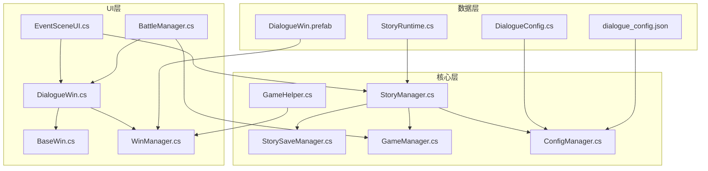
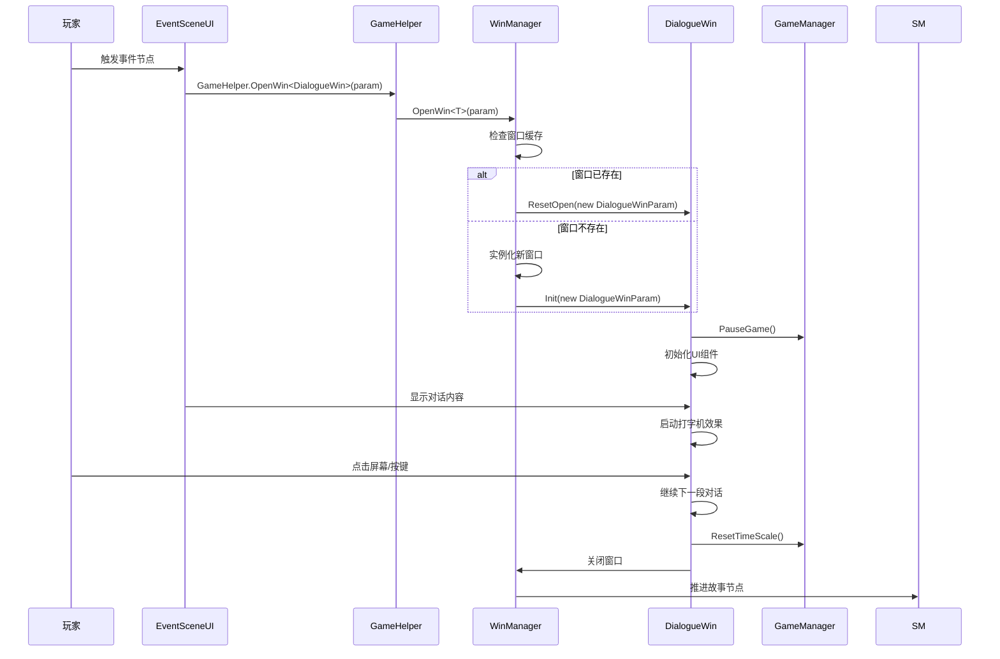
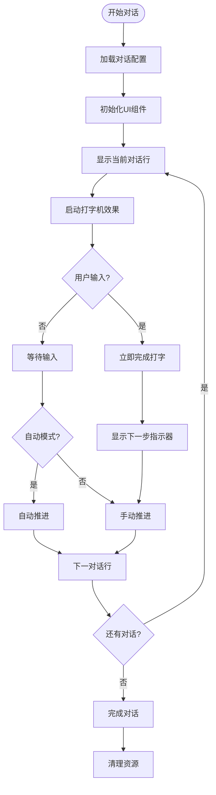
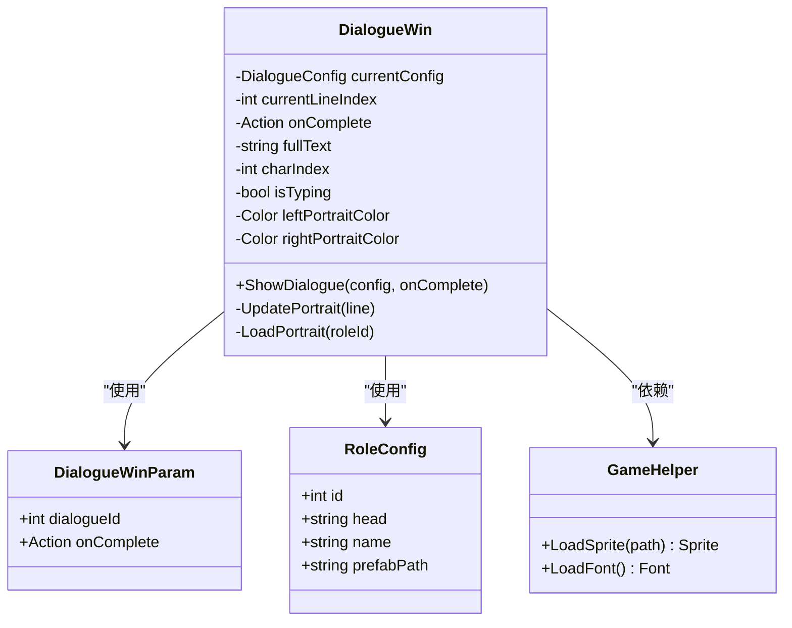
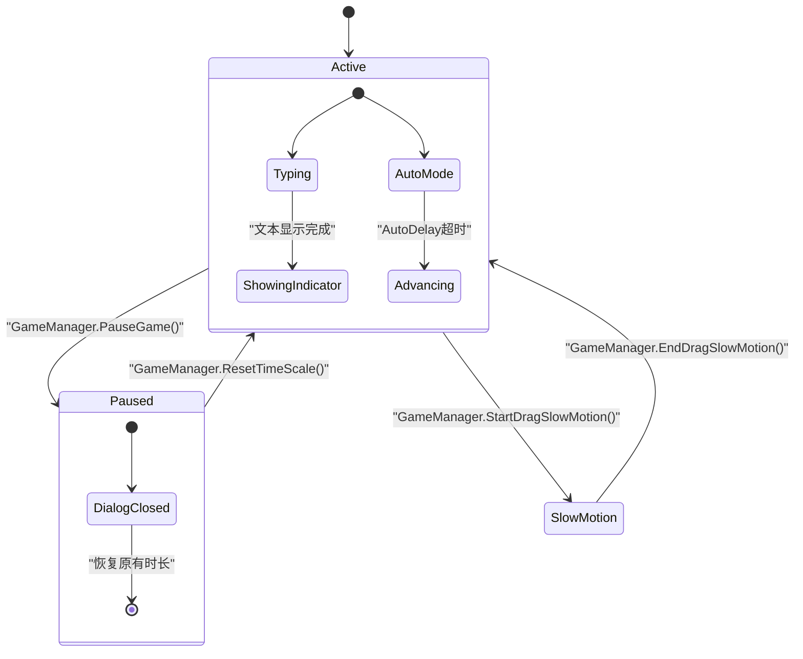
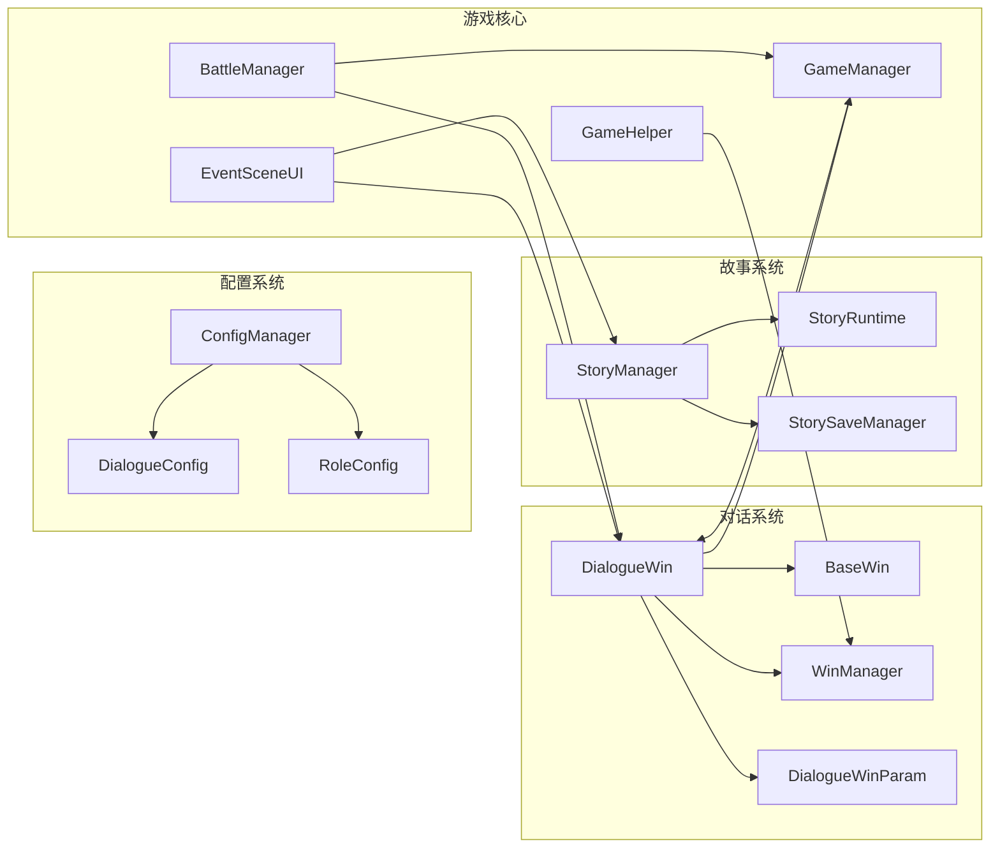

# 对话系统（Dialogue Win）技术文档

<cite>
**本文档引用的文件**
- [DialogueWin.cs](file://Assets/Scripts/UI/Windows/DialogueWin.cs)
- [BaseWin.cs](file://Assets/Scripts/UI/Windows/BaseWin.cs)
- [WinManager.cs](file://Assets/Scripts/UI/Managers/WinManager.cs)
- [EventSceneUI.cs](file://Assets/Scripts/UI/Scenes/EventSceneUI.cs)
- [BattleManager.cs](file://Assets/Scripts/Battle/BattleManager.cs)
- [StoryManager.cs](file://Assets/Scripts/Core/StoryManager.cs)
- [StorySaveManager.cs](file://Assets/Scripts/Core/StorySaveManager.cs)
- [GameManager.cs](file://Assets/Scripts/Core/GameManager.cs)
- [GameHelper.cs](file://Assets/Scripts/Core/GameHelper.cs)
- [ConfigManager.cs](file://Assets/Scripts/Core/ConfigManager.cs)
- [StoryRuntime.cs](file://Assets/Scripts/Data/StoryRuntime.cs)
- [DialogueConfig.cs](file://Assets/Scripts/Data/Configs/DialogueConfig.cs)
- [dialogue_config.json](file://Assets/Resources/Configs/dialogue_config.json)
- [DialogueWin.prefab](file://Assets/Resources/UI/Windows/DialogueWin.prefab)
</cite>

## 更新摘要
**所做更改**
- 更新了参数化初始化机制的说明，从直接使用Init()方法改为使用参数化初始化
- 新增了DialogueWinParam参数类的详细说明
- 更新了与GameManager倍速系统的集成功能
- 修改了窗口管理流程图以反映新的参数传递机制
- 更新了故障排除指南以包含参数化初始化相关问题

## 目录
1. [简介](#简介)
2. [项目结构](#项目结构)
3. [核心组件](#核心组件)
4. [架构概览](#架构概览)
5. [详细组件分析](#详细组件分析)
6. [依赖关系分析](#依赖关系分析)
7. [性能考虑](#性能考虑)
8. [故障排除指南](#故障排除指南)
9. [结论](#结论)

## 简介

对话系统（Dialogue Win）是GeometryTD游戏中的核心叙事组件，负责处理游戏中的所有对话场景。该系统提供了完整的对话显示功能，包括打字机效果、自动播放模式、角色头像显示、以及与故事管理系统深度集成的能力。

**重要更新**：系统现已采用参数化初始化重构，从直接使用Init()方法改为使用参数化初始化机制，新增DialogueWinParam参数类，以及与GameManager倍速系统的深度集成。

系统支持多语言对话内容，具有灵活的配置机制，可以轻松扩展新的对话场景和角色。对话系统采用事件驱动的设计模式，与游戏的整体架构无缝集成。

## 项目结构

对话系统位于Unity项目的UI层，主要文件组织如下：



**图表来源**
- [DialogueWin.cs:1-443](file://Assets/Scripts/UI/Windows/DialogueWin.cs#L1-L443)
- [BaseWin.cs:1-175](file://Assets/Scripts/UI/Windows/BaseWin.cs#L1-L175)
- [WinManager.cs:1-221](file://Assets/Scripts/UI/Managers/WinManager.cs#L1-L221)

**章节来源**
- [DialogueWin.cs:1-50](file://Assets/Scripts/UI/Windows/DialogueWin.cs#L1-L50)
- [BaseWin.cs:1-36](file://Assets/Scripts/UI/Windows/BaseWin.cs#L1-L36)
- [WinManager.cs:1-60](file://Assets/Scripts/UI/Managers/WinManager.cs#L1-L60)

## 核心组件

### 对话窗口组件（DialogueWin）

DialogueWin是对话系统的核心组件，继承自BaseWin基类，提供完整的对话显示功能：

**参数化初始化特性：**
- 支持DialogueWinParam参数类传入
- 通过Data属性访问传入的参数
- 自动参数绑定和验证

**主要功能特性：**
- 打字机文字效果显示
- 角色头像动态加载和显示
- 自动播放模式控制
- 跳过对话功能
- 时间缩放暂停机制

**关键属性：**
- `speakerText`: 显示说话者名称
- `dialogueText`: 显示对话文本
- `leftPortrait/rightPortrait`: 左右两侧角色头像
- `skipButton/autoButton/clickArea`: 用户交互按钮

**章节来源**
- [DialogueWin.cs:7-443](file://Assets/Scripts/UI/Windows/DialogueWin.cs#L7-L443)

### 参数类（DialogueWinParam）

**新增功能**：DialogueWinParam是专门为DialogueWin设计的参数类，提供类型安全的参数传递机制：

**核心属性：**
- `dialogueId`: 对话配置ID
- `onComplete`: 对话完成回调函数

**章节来源**
- [DialogueWin.cs:9-14](file://Assets/Scripts/UI/Windows/DialogueWin.cs#L9-L14)

### 基础窗口组件（BaseWin）

BaseWin提供窗口管理的基础功能，定义了窗口生命周期的标准接口：

**参数化初始化方法：**
- `Init(object param)`: 支持参数化初始化
- `ResetOpen(object param)`: 重置窗口并接受新参数
- `Data`: 存储传入的参数对象

**核心方法：**
- `Init(object param)`: 初始化窗口并绑定UI组件
- `Show()`: 显示窗口
- `Hide()`: 隐藏窗口
- `OnClose()`: 关闭窗口时的清理逻辑

**章节来源**
- [BaseWin.cs:5-175](file://Assets/Scripts/UI/Windows/BaseWin.cs#L5-L175)

### 窗口管理器（WinManager）

WinManager负责管理所有UI窗口的生命周期，提供统一的窗口打开、关闭和缓存机制：

**参数化窗口管理：**
- `OpenWin<T>(string winName = null, object param = null)`: 支持参数化窗口打开
- 自动参数传递给窗口的Init方法
- 支持窗口重用和参数更新

**主要职责：**
- 窗口实例化和缓存
- 层级排序和渲染管理
- 窗口生命周期控制
- 预制体资源管理

**章节来源**
- [WinManager.cs:7-221](file://Assets/Scripts/UI/Managers/WinManager.cs#L7-L221)

## 架构概览

对话系统采用分层架构设计，各组件职责明确，耦合度低。**重要更新**：现在支持参数化初始化机制：



**图表来源**
- [EventSceneUI.cs:506-512](file://Assets/Scripts/UI/Scenes/EventSceneUI.cs#L506-L512)
- [GameHelper.cs:78-82](file://Assets/Scripts/Core/GameHelper.cs#L78-L82)
- [WinManager.cs:63-114](file://Assets/Scripts/UI/Managers/WinManager.cs#L63-L114)
- [DialogueWin.cs:105-106](file://Assets/Scripts/UI/Windows/DialogueWin.cs#L105-L106)

## 详细组件分析

### 参数化初始化流程

**重要更新**：对话系统现在采用参数化初始化机制：

```mermaid
flowchart TD
Start([开始对话]) --> CreateParam[创建DialogueWinParam]
CreateParam --> OpenWin[GameHelper.OpenWin<DialogueWin>(param)]
OpenWin --> CheckCache{窗口已缓存?}
CheckCache --> |是| ResetOpen[调用ResetOpen(param)]
CheckCache --> |否| InitWindow[实例化新窗口]
InitWindow --> InitMethod[调用Init(param)]
ResetOpen --> ParamBinding[参数绑定到Data属性]
InitMethod --> ParamBinding
ParamBinding --> LoadUI[加载UI组件]
LoadUI --> ShowDialogue[调用ShowDialogue]
ShowDialogue --> StartTyping[启动打字机效果]
```

**图表来源**
- [GameHelper.cs:78-82](file://Assets/Scripts/Core/GameHelper.cs#L78-L82)
- [WinManager.cs:73-110](file://Assets/Scripts/UI/Managers/WinManager.cs#L73-L110)
- [BaseWin.cs:98-103](file://Assets/Scripts/UI/Windows/BaseWin.cs#L98-L103)

**章节来源**
- [DialogueWin.cs:57-73](file://Assets/Scripts/UI/Windows/DialogueWin.cs#L57-L73)
- [BaseWin.cs:98-103](file://Assets/Scripts/UI/Windows/BaseWin.cs#L98-L103)

### 对话显示引擎

对话显示引擎实现了复杂的文本渲染逻辑，包括打字机效果和实时字符计数：



**图表来源**
- [DialogueWin.cs:164-221](file://Assets/Scripts/UI/Windows/DialogueWin.cs#L164-L221)

**章节来源**
- [DialogueWin.cs:103-128](file://Assets/Scripts/UI/Windows/DialogueWin.cs#L103-L128)
- [DialogueWin.cs:164-193](file://Assets/Scripts/UI/Windows/DialogueWin.cs#L164-L193)

### 头像管理系统

头像系统支持左右两侧的角色显示，具有智能的头像切换和高亮功能：



**图表来源**
- [DialogueWin.cs:130-162](file://Assets/Scripts/UI/Windows/DialogueWin.cs#L130-L162)
- [ConfigManager.cs:96-98](file://Assets/Scripts/Core/ConfigManager.cs#L96-L98)

**章节来源**
- [DialogueWin.cs:130-162](file://Assets/Scripts/UI/Windows/DialogueWin.cs#L130-L162)

### 时间控制机制

**重要更新**：对话系统现在与GameManager倍速系统深度集成：



**图表来源**
- [DialogueWin.cs:90-92](file://Assets/Scripts/UI/Windows/DialogueWin.cs#L90-L92)
- [DialogueWin.cs:255-262](file://Assets/Scripts/UI/Windows/DialogueWin.cs#L255-L262)
- [GameManager.cs:276-318](file://Assets/Scripts/Core/GameManager.cs#L276-L318)

**章节来源**
- [DialogueWin.cs:90-92](file://Assets/Scripts/UI/Windows/DialogueWin.cs#L90-L92)
- [DialogueWin.cs:255-262](file://Assets/Scripts/UI/Windows/DialogueWin.cs#L255-L262)

### 配置系统集成

对话系统与游戏配置系统深度集成，支持动态加载和热更新：

**配置文件结构：**
- `dialogue_config.json`: 对话内容配置
- `role_config.json`: 角色配置
- 动态生成的配置表

**章节来源**
- [dialogue_config.json:1-325](file://Assets/Resources/Configs/dialogue_config.json#L1-L325)
- [DialogueConfig.cs:10-31](file://Assets/Scripts/Data/Configs/DialogueConfig.cs#L10-L31)

## 依赖关系分析

**重要更新**：对话系统现在与GameManager倍速系统紧密集成：



**图表来源**
- [DialogueWin.cs:1-10](file://Assets/Scripts/UI/Windows/DialogueWin.cs#L1-L10)
- [EventSceneUI.cs:36-68](file://Assets/Scripts/UI/Scenes/EventSceneUI.cs#L36-L68)
- [BattleManager.cs:819-825](file://Assets/Scripts/Battle/BattleManager.cs#L819-L825)
- [GameManager.cs:276-318](file://Assets/Scripts/Core/GameManager.cs#L276-L318)

**章节来源**
- [DialogueWin.cs:1-10](file://Assets/Scripts/UI/Windows/DialogueWin.cs#L1-L10)
- [EventSceneUI.cs:36-68](file://Assets/Scripts/UI/Scenes/EventSceneUI.cs#L36-L68)
- [BattleManager.cs:819-825](file://Assets/Scripts/Battle/BattleManager.cs#L819-L825)
- [GameManager.cs:276-318](file://Assets/Scripts/Core/GameManager.cs#L276-L318)

## 性能考虑

对话系统在设计时充分考虑了性能优化：

**内存管理：**
- 窗口实例缓存，避免频繁的实例化销毁
- 字符串缓冲区复用，减少GC压力
- 图片资源异步加载

**渲染优化：**
- 使用Canvas渲染，支持批量渲染
- 条件显示头像，减少不必要的UI元素
- 文本更新采用增量方式

**时间管理：**
- 使用Time.unscaledDeltaTime，不受游戏时间缩放影响
- 精确的定时器管理，避免累积误差
- **新增**：与GameManager倍速系统协同工作，确保对话体验一致性

## 故障排除指南

### 常见问题及解决方案

**对话不显示问题：**
1. 检查对话配置文件是否正确加载
2. 验证角色头像路径是否有效
3. 确认窗口层级设置正确
4. **新增**：检查DialogueWinParam参数是否正确传递

**头像显示异常：**
1. 检查角色配置中的头像路径
2. 验证图片资源是否存在
3. 确认头像尺寸和格式

**时间控制问题：**
1. 检查Time.timeScale设置
2. 验证对话窗口的生命周期管理
3. 确认自动模式定时器
4. **新增**：检查GameManager倍速系统状态

**参数化初始化问题：**
1. 确保使用GameHelper.OpenWin<DialogueWin>(param: new DialogueWinParam{...})
2. 验证DialogueWinParam参数的完整性
3. 检查BaseWin.Data属性是否正确接收参数
4. 确认DialogueWin.data属性能够正确转换为DialogueWinParam

**章节来源**
- [DialogueWin.cs:57-71](file://Assets/Scripts/UI/Windows/DialogueWin.cs#L57-L71)
- [WinManager.cs:80-98](file://Assets/Scripts/UI/Managers/WinManager.cs#L80-L98)
- [GameHelper.cs:78-82](file://Assets/Scripts/Core/GameHelper.cs#L78-L82)

## 结论

对话系统（Dialogue Win）是一个设计精良、功能完整的叙事组件，经过参数化重构后具有以下特点：

**优势：**
- 模块化设计，易于维护和扩展
- 完善的配置系统，支持动态内容管理
- 优秀的用户体验，包括打字机效果和自动播放
- 深度集成的游戏架构，与故事系统无缝协作
- **新增**：参数化初始化机制，提供类型安全的参数传递
- **新增**：与GameManager倍速系统的深度集成，确保一致的游戏体验

**应用场景：**
- 游戏剧情对话
- 角色互动
- 事件场景描述
- 结局展示

**重要更新总结：**
- 从直接使用Init()方法改为使用参数化初始化
- 新增DialogueWinParam参数类，提供类型安全的参数传递
- 与GameManager倍速系统集成，支持拖拽慢放等功能
- 提升了系统的可维护性和扩展性

该系统为GeometryTD游戏提供了强大的叙事能力，是游戏体验的重要组成部分。其清晰的架构设计、完善的错误处理机制，以及最新的参数化重构，确保了系统的稳定性、可维护性和可扩展性。