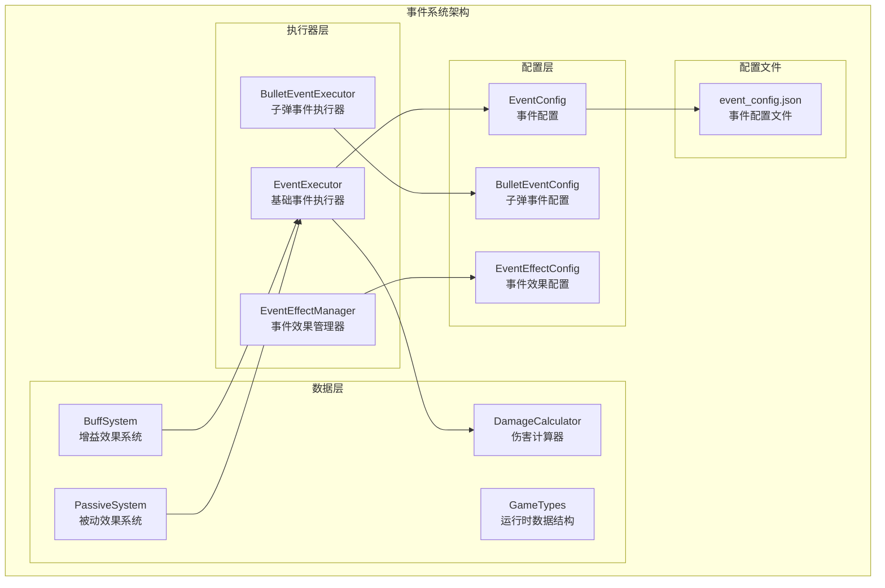
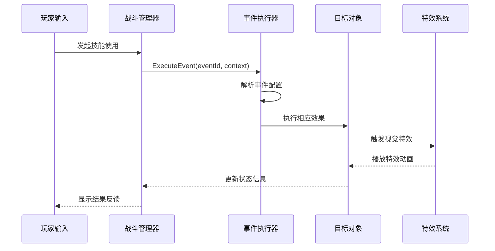
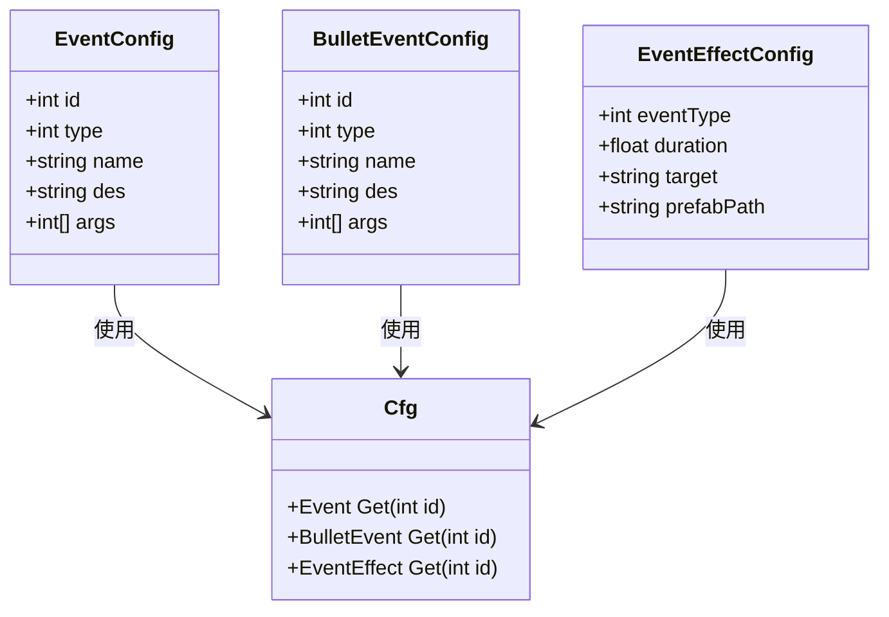
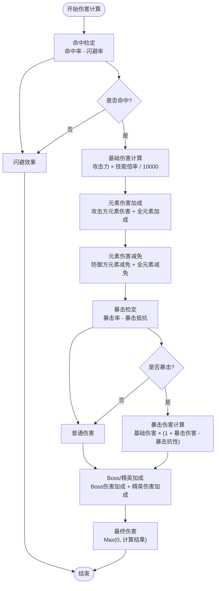
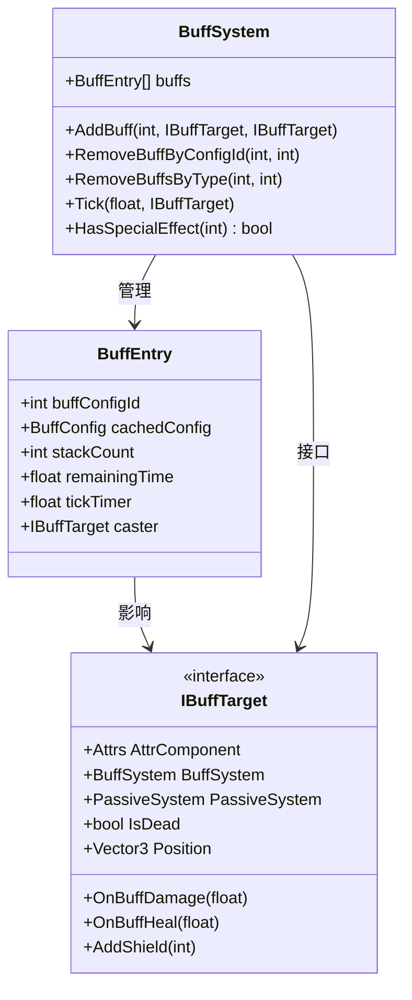
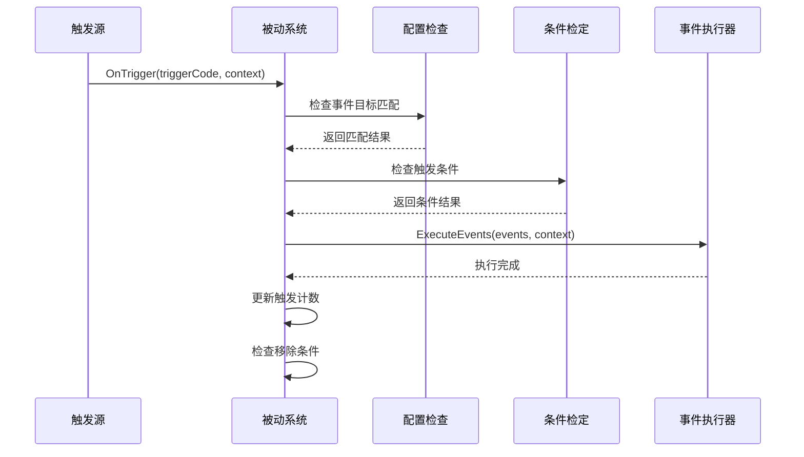
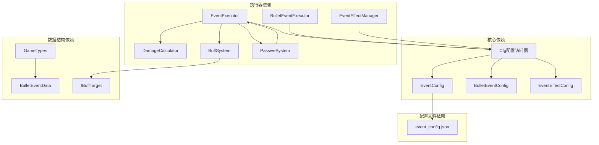

# 事件系统

<cite>
**本文档引用的文件**
- [EventExecutor.cs](file://Assets/Scripts/Battle/EventExecutor.cs)
- [BulletEventExecutor.cs](file://Assets/Scripts/Battle/BulletEventExecutor.cs)
- [EventEffectManager.cs](file://Assets/Scripts/Battle/EventEffectManager.cs)
- [EventConfig.cs](file://Assets/Scripts/Data/Configs/EventConfig.cs)
- [BulletEventConfig.cs](file://Assets/Scripts/Data/Configs/BulletEventConfig.cs)
- [EventEffectConfig.cs](file://Assets/Scripts/Data/Configs/EventEffectConfig.cs)
- [GameTypes.cs](file://Assets/Scripts/Data/GameTypes.cs)
- [Cfg.cs](file://Assets/Scripts/Core/Cfg.cs)
- [DamageCalculator.cs](file://Assets/Scripts/Battle/DamageCalculator.cs)
- [BuffSystem.cs](file://Assets/Scripts/Battle/BuffSystem.cs)
- [PassiveSystem.cs](file://Assets/Scripts/Battle/PassiveSystem.cs)
- [event_config.json](file://Assets/Resources/Configs/event_config.json)
</cite>

## 目录
1. [简介](#简介)
2. [项目结构](#项目结构)
3. [核心组件](#核心组件)
4. [架构概览](#架构概览)
5. [详细组件分析](#详细组件分析)
6. [依赖关系分析](#依赖关系分析)
7. [性能考虑](#性能考虑)
8. [故障排除指南](#故障排除指南)
9. [结论](#结论)

## 简介

事件系统是几何塔防游戏的核心机制，负责处理战斗中的各种效果和交互。该系统采用配置驱动的设计模式，通过JSON配置文件定义事件类型、参数和行为，实现了高度可扩展的游戏机制。

系统主要包含三个核心功能模块：
- **基础事件执行器**：处理伤害、治疗、护盾等基础战斗效果
- **子弹事件执行器**：管理子弹的特殊行为如穿透、爆炸、追踪等
- **事件效果管理器**：负责视觉特效的触发和播放

## 项目结构

事件系统位于项目的Battle目录下，采用分层架构设计：

**图表来源**
- [EventExecutor.cs:1-233](file://Assets/Scripts/Battle/EventExecutor.cs#L1-L233)
- [BulletEventExecutor.cs:1-98](file://Assets/Scripts/Battle/BulletEventExecutor.cs#L1-L98)
- [EventEffectManager.cs:1-33](file://Assets/Scripts/Battle/EventEffectManager.cs#L1-L33)

**章节来源**
- [EventExecutor.cs:1-233](file://Assets/Scripts/Battle/EventExecutor.cs#L1-L233)
- [BulletEventExecutor.cs:1-98](file://Assets/Scripts/Battle/BulletEventExecutor.cs#L1-L98)
- [EventEffectManager.cs:1-33](file://Assets/Scripts/Battle/EventEffectManager.cs#L1-L33)

## 核心组件

### 事件执行器 (EventExecutor)

事件执行器是整个事件系统的核心控制器，负责解析事件配置并执行相应的游戏逻辑。

**主要功能**：
- 解析事件ID并获取对应的配置信息
- 根据事件类型调用相应的处理方法
- 管理事件上下文（施法者、目标、位置等）

**事件类型支持**：
- 伤害事件：造成固定或百分比伤害
- 治疗事件：恢复生命值
- 护盾事件：添加护盾值
- 击退事件：将目标击退指定距离
- 经验事件：为技能增加经验值
- 能量事件：为奥术系统添加能量
- 增益事件：为目标添加增益效果
- 被动事件：注册被动技能
- 召唤事件：生成友方单位
- 洗髓事件：移除目标身上的效果

**章节来源**
- [EventExecutor.cs:13-66](file://Assets/Scripts/Battle/EventExecutor.cs#L13-L66)
- [EventExecutor.cs:68-231](file://Assets/Scripts/Battle/EventExecutor.cs#L68-L231)

### 子弹事件执行器 (BulletEventExecutor)

专门处理子弹特殊行为的执行器，将配置转换为运行时数据结构。

**支持的子弹事件**：
- 穿透：子弹可以穿透多个目标
- 爆炸：子弹命中后产生范围伤害
- 追踪：子弹自动追踪目标
- 散布：子弹分裂成多发
- 跳弹：子弹在场景中反弹
- 簇射：同时发射多颗子弹
- 附着：将事件附加到目标或施法者

**章节来源**
- [BulletEventExecutor.cs:6-95](file://Assets/Scripts/Battle/BulletEventExecutor.cs#L6-L95)

### 事件效果管理器 (EventEffectManager)

负责根据事件类型触发相应的视觉特效。

**功能特性**：
- 从配置表获取特效信息
- 实例化预制件进行特效播放
- 支持多种特效类型和持续时间

**章节来源**
- [EventEffectManager.cs:8-31](file://Assets/Scripts/Battle/EventEffectManager.cs#L8-L31)

## 架构概览

事件系统的整体架构采用分层设计，确保了良好的可维护性和扩展性：

**图表来源**
- [EventExecutor.cs:15-66](file://Assets/Scripts/Battle/EventExecutor.cs#L15-L66)
- [EventEffectManager.cs:13-19](file://Assets/Scripts/Battle/EventEffectManager.cs#L13-L19)

## 详细组件分析

### 事件配置系统

事件系统采用配置驱动的方式，所有事件行为都由外部配置文件定义：

**图表来源**
- [EventConfig.cs:11-24](file://Assets/Scripts/Data/Configs/EventConfig.cs#L11-L24)
- [BulletEventConfig.cs:11-25](file://Assets/Scripts/Data/Configs/BulletEventConfig.cs#L11-L25)
- [EventEffectConfig.cs:11-23](file://Assets/Scripts/Data/Configs/EventEffectConfig.cs#L11-L23)
- [Cfg.cs:7-34](file://Assets/Scripts/Core/Cfg.cs#L7-L34)

### 伤害计算系统

伤害系统实现了复杂的战斗平衡机制：

**图表来源**
- [DamageCalculator.cs:24-117](file://Assets/Scripts/Battle/DamageCalculator.cs#L24-L117)

**章节来源**
- [DamageCalculator.cs:22-118](file://Assets/Scripts/Battle/DamageCalculator.cs#L22-L118)

### 增益效果系统

增益效果系统提供了复杂的状态管理机制：

**图表来源**
- [BuffSystem.cs:6-30](file://Assets/Scripts/Battle/BuffSystem.cs#L6-L30)
- [BuffSystem.cs:30-84](file://Assets/Scripts/Battle/BuffSystem.cs#L30-L84)
- [BuffSystem.cs:16-28](file://Assets/Scripts/Battle/BuffSystem.cs#L16-L28)

**章节来源**
- [BuffSystem.cs:30-378](file://Assets/Scripts/Battle/BuffSystem.cs#L30-L378)

### 被动效果系统

被动系统实现了基于触发条件的效果机制：

**图表来源**
- [PassiveSystem.cs:41-69](file://Assets/Scripts/Battle/PassiveSystem.cs#L41-L69)

**章节来源**
- [PassiveSystem.cs:14-150](file://Assets/Scripts/Battle/PassiveSystem.cs#L14-L150)

## 依赖关系分析

事件系统各组件之间的依赖关系如下：

**图表来源**
- [Cfg.cs:9-33](file://Assets/Scripts/Core/Cfg.cs#L9-L33)
- [EventExecutor.cs:24-25](file://Assets/Scripts/Battle/EventExecutor.cs#L24-L25)
- [BulletEventExecutor.cs:19-20](file://Assets/Scripts/Battle/BulletEventExecutor.cs#L19-L20)

**章节来源**
- [Cfg.cs:7-35](file://Assets/Scripts/Core/Cfg.cs#L7-L35)

## 性能考虑

事件系统在设计时充分考虑了性能优化：

### 内存管理
- 使用对象池避免频繁的垃圾回收
- 缓存配置数据减少重复查询
- 合理的数据结构选择（数组vs列表）

### 执行效率
- 事件类型switch语句优化
- 条件检查的短路评估
- 批量处理相似事件

### 内存优化策略
- 配置数据只读缓存
- 事件上下文重用
- 特效实例化的延迟加载

## 故障排除指南

### 常见问题及解决方案

**事件不生效**
- 检查事件ID是否正确配置
- 验证事件参数格式是否正确
- 确认目标对象是否存活

**伤害计算异常**
- 检查属性配置是否合理
- 验证元素相克关系
- 确认暴击计算逻辑

**特效不显示**
- 检查特效预制件路径
- 验证特效配置参数
- 确认特效生命周期管理

**性能问题**
- 优化事件批量处理
- 减少不必要的配置查询
- 实施适当的对象池

**章节来源**
- [EventExecutor.cs:62-65](file://Assets/Scripts/Battle/EventExecutor.cs#L62-L65)
- [EventEffectManager.cs:23-29](file://Assets/Scripts/Battle/EventEffectManager.cs#L23-L29)

## 结论

事件系统通过其模块化设计和配置驱动的架构，为游戏提供了强大而灵活的效果机制。系统的主要优势包括：

1. **高度可扩展性**：新的事件类型可以通过配置轻松添加
2. **良好的性能表现**：优化的执行流程和内存管理
3. **清晰的架构分离**：职责明确的组件设计
4. **强大的配置系统**：外部配置文件便于平衡调整

该系统为几何塔防游戏的核心玩法提供了坚实的技术基础，支持复杂的游戏机制实现和快速的功能迭代。