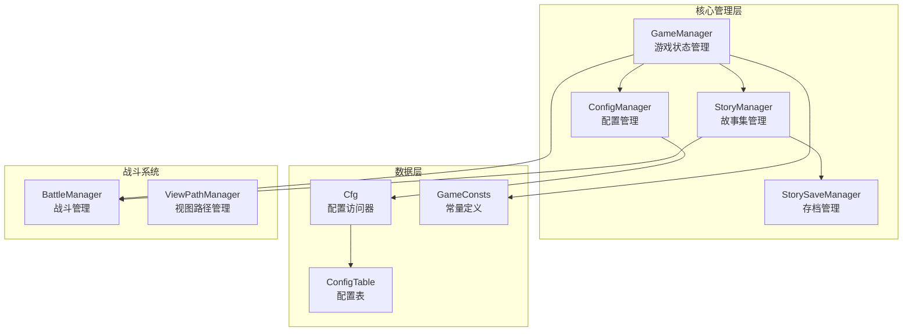
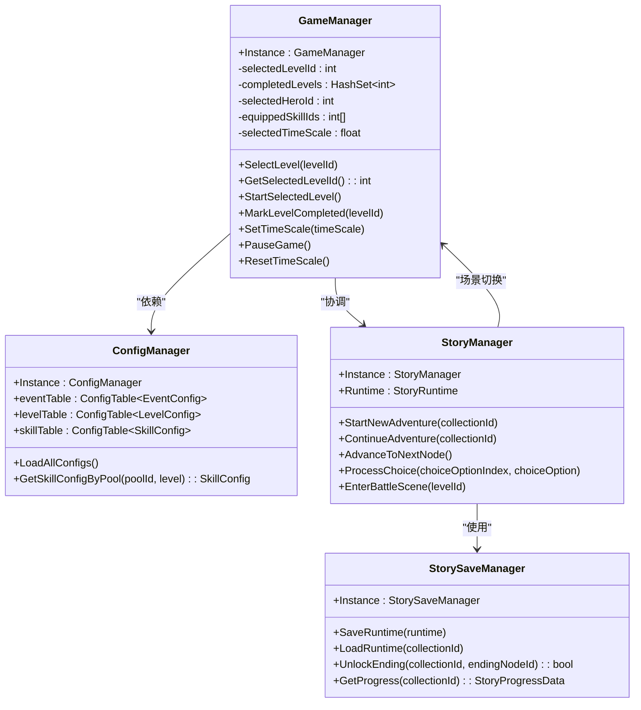
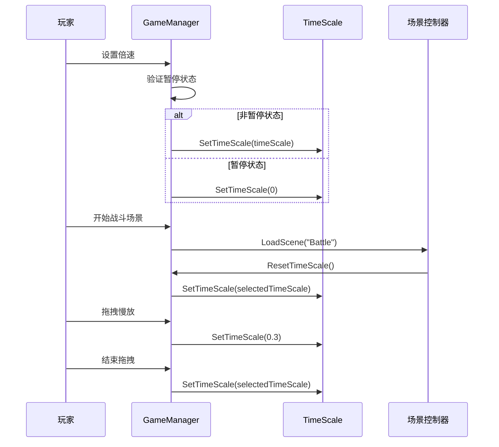
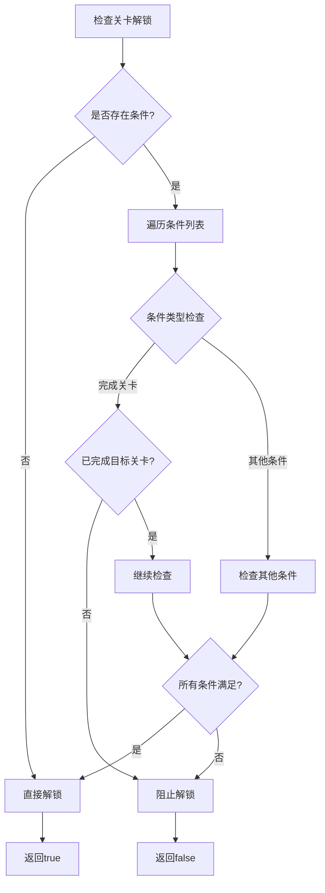
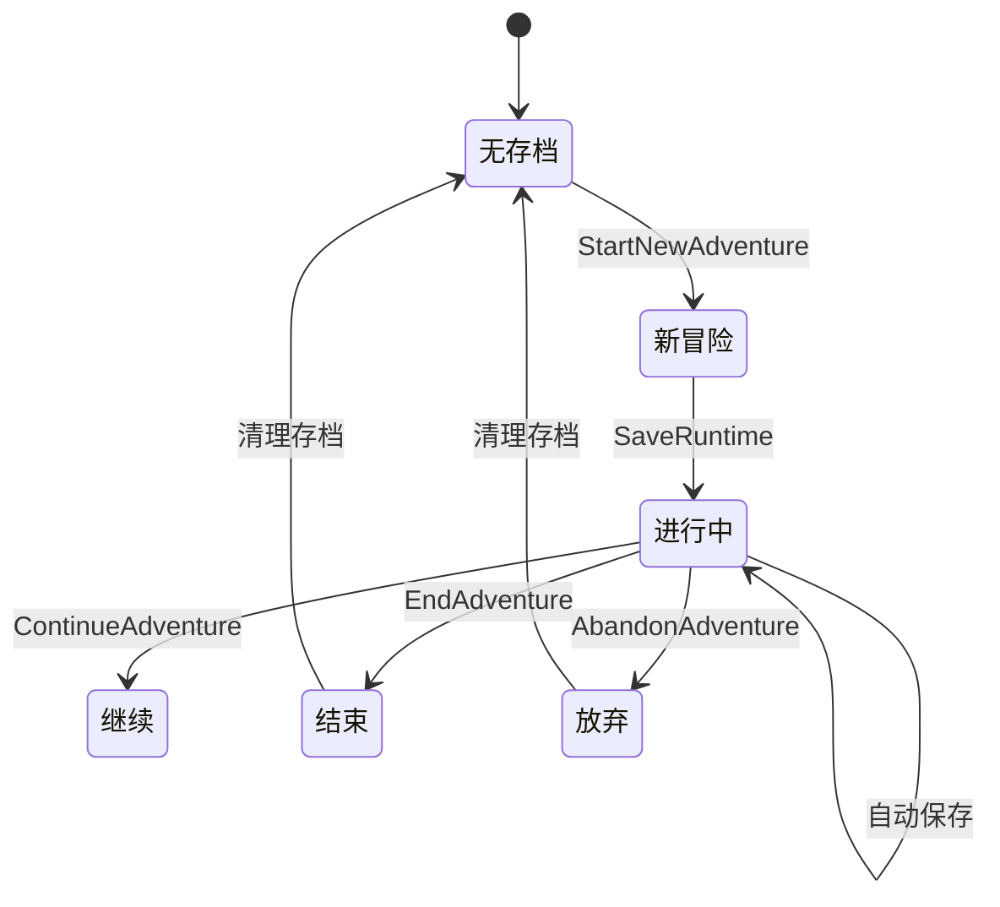
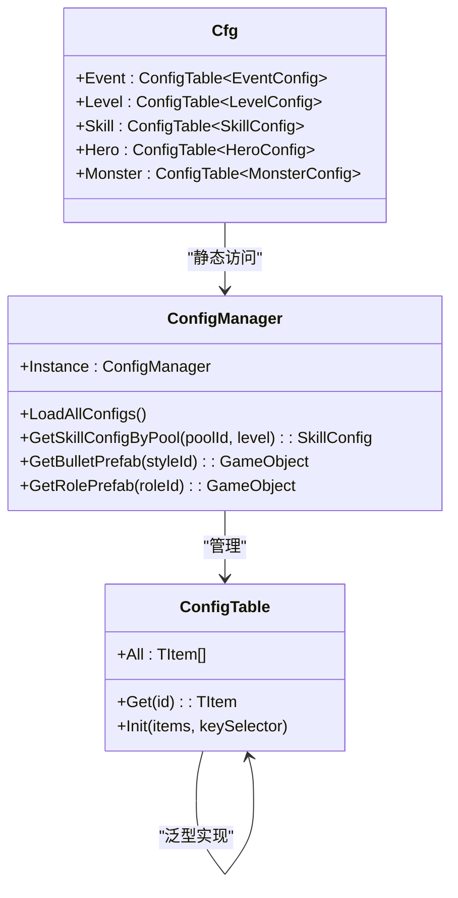
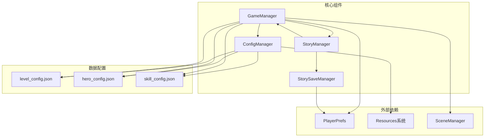

# 游戏管理器核心

<cite>
**本文档引用的文件**
- [GameManager.cs](file://Assets/Scripts/Core/GameManager.cs)
- [ConfigManager.cs](file://Assets/Scripts/Core/ConfigManager.cs)
- [StoryManager.cs](file://Assets/Scripts/Core/StoryManager.cs)
- [StorySaveManager.cs](file://Assets/Scripts/Core/StorySaveManager.cs)
- [Cfg.cs](file://Assets/Scripts/Core/Cfg.cs)
- [ViewPathManager.cs](file://Assets/Scripts/Core/ViewPathManager.cs)
- [GameConsts.cs](file://Assets/Scripts/Data/GameConsts.cs)
- [BattleManager.cs](file://Assets/Scripts/Battle/BattleManager.cs)
- [ConfigTable.cs](file://Assets/Scripts/Core/ConfigTable.cs)
- [GameHelper.cs](file://Assets/Scripts/Core/GameHelper.cs)
- [StoryRuntime.cs](file://Assets/Scripts/Data/StoryRuntime.cs)
- [GameTypes.cs](file://Assets/Scripts/Data/GameTypes.cs)
- [level_config.json](file://Assets/Resources/Configs/level_config.json)
- [hero_config.json](file://Assets/Resources/Configs/hero_config.json)
- [skill_config.json](file://Assets/Resources/Configs/skill_config.json)
</cite>

## 目录
1. [简介](#简介)
2. [项目结构](#项目结构)
3. [核心组件](#核心组件)
4. [架构概览](#架构概览)
5. [详细组件分析](#详细组件分析)
6. [依赖关系分析](#依赖关系分析)
7. [性能考虑](#性能考虑)
8. [故障排除指南](#故障排除指南)
9. [结论](#结论)

## 简介

游戏管理器核心是GeometryTD项目中的中央控制系统，负责管理游戏的全局状态、配置数据、故事进程和战斗系统。该系统采用单例模式设计，确保在整个游戏生命周期中提供一致的游戏体验。

系统主要功能包括：
- 全局游戏状态管理（关卡选择、英雄选择、技能装备）
- 配置管理系统（动态加载和缓存游戏配置）
- 故事集管理（冒险进程、存档系统、结局解锁）
- 时间控制和倍速管理
- 跨场景持久化机制

## 项目结构

游戏管理器核心位于Assets/Scripts/Core目录下，采用模块化设计，每个核心组件都有明确的职责分工：

**图表来源**
- [GameManager.cs:1-325](file://Assets/Scripts/Core/GameManager.cs#L1-L325)
- [ConfigManager.cs:1-265](file://Assets/Scripts/Core/ConfigManager.cs#L1-L265)
- [StoryManager.cs:1-574](file://Assets/Scripts/Core/StoryManager.cs#L1-L574)

**章节来源**
- [GameManager.cs:1-325](file://Assets/Scripts/Core/GameManager.cs#L1-L325)
- [ConfigManager.cs:1-265](file://Assets/Scripts/Core/ConfigManager.cs#L1-L265)
- [StoryManager.cs:1-574](file://Assets/Scripts/Core/StoryManager.cs#L1-L574)

## 核心组件

### GameManager - 游戏状态管理中心

GameManager是整个游戏的核心控制器，采用单例模式确保全局唯一性。它负责管理以下关键功能：

**主要职责：**
- 关卡选择和状态管理
- 英雄选择和装备管理
- 技能和奥术装备系统
- 时间控制和倍速管理
- 持久化存储管理

**关键特性：**
- 使用PlayerPrefs进行本地存储
- 支持多种游戏倍速（0.3x、0.5x、1x、1.5x）
- 暂停功能支持
- 关卡解锁条件验证

**章节来源**
- [GameManager.cs:7-325](file://Assets/Scripts/Core/GameManager.cs#L7-L325)

### ConfigManager - 配置管理系统

ConfigManager负责动态加载和管理所有游戏配置数据。系统自动生成配置表，提供类型安全的访问接口。

**核心功能：**
- 自动加载JSON配置文件
- 构建配置查找表
- 预加载游戏资源（子弹、特效、角色预制体）
- 提供配置数据的类型安全访问

**配置类型覆盖：**
- 角色配置（HeroConfig）
- 关卡配置（LevelConfig）
- 技能配置（SkillConfig）
- 怪物配置（MonsterConfig）
- 奥术配置（ArcaneConfig）
- 故事节点配置（StoryNodeConfig）

**章节来源**
- [ConfigManager.cs:11-265](file://Assets/Scripts/Core/ConfigManager.cs#L11-L265)

### StoryManager - 故事集管理器

StoryManager管理故事集的完整生命周期，从开始冒险到结束冒险的全过程。

**主要功能：**
- 冒险生命周期管理（开始/继续/结束/放弃）
- 节点推进和选择处理
- 金币系统和藏品管理
- Boss事件处理
- 场景导航

**存档系统：**
- 运行时存档（中途存档）
- 永久进度存档（结局解锁状态）
- 自动保存机制

**章节来源**
- [StoryManager.cs:12-574](file://Assets/Scripts/Core/StoryManager.cs#L12-L574)

### StorySaveManager - 存档管理器

专门负责故事集相关的存档操作，提供运行时存档和永久进度存档功能。

**存档类型：**
- 运行时存档：保存当前冒险进度
- 永久进度：保存解锁的结局和完成度
- 自动清理：冒险结束后自动清理临时存档

**章节来源**
- [StorySaveManager.cs:11-179](file://Assets/Scripts/Core/StorySaveManager.cs#L11-L179)

## 架构概览

游戏管理器核心采用分层架构设计，确保各组件之间的松耦合和高内聚：

**图表来源**
- [GameManager.cs:7-325](file://Assets/Scripts/Core/GameManager.cs#L7-L325)
- [ConfigManager.cs:11-265](file://Assets/Scripts/Core/ConfigManager.cs#L11-L265)
- [StoryManager.cs:12-574](file://Assets/Scripts/Core/StoryManager.cs#L12-L574)
- [StorySaveManager.cs:11-179](file://Assets/Scripts/Core/StorySaveManager.cs#L11-L179)

## 详细组件分析

### 时间管理系统

GameManager实现了统一的时间控制机制，确保游戏在不同场景下的时间流速一致性：

**图表来源**
- [GameManager.cs:247-322](file://Assets/Scripts/Core/GameManager.cs#L247-L322)

**章节来源**
- [GameManager.cs:247-322](file://Assets/Scripts/Core/GameManager.cs#L247-L322)

### 关卡解锁系统

关卡解锁机制基于条件配置，支持复杂的解锁逻辑：

**图表来源**
- [GameManager.cs:85-108](file://Assets/Scripts/Core/GameManager.cs#L85-L108)

**章节来源**
- [GameManager.cs:85-108](file://Assets/Scripts/Core/GameManager.cs#L85-L108)

### 故事集存档流程

StoryManager实现了完整的冒险存档系统，支持多种存档状态：

**图表来源**
- [StoryManager.cs:96-164](file://Assets/Scripts/Core/StoryManager.cs#L96-L164)
- [StorySaveManager.cs:33-100](file://Assets/Scripts/Core/StorySaveManager.cs#L33-L100)

**章节来源**
- [StoryManager.cs:96-164](file://Assets/Scripts/Core/StoryManager.cs#L96-L164)
- [StorySaveManager.cs:33-100](file://Assets/Scripts/Core/StorySaveManager.cs#L33-L100)

### 配置系统架构

ConfigManager提供了类型安全的配置访问机制：

**图表来源**
- [Cfg.cs:7-35](file://Assets/Scripts/Core/Cfg.cs#L7-L35)
- [ConfigManager.cs:11-37](file://Assets/Scripts/Core/ConfigManager.cs#L11-L37)
- [ConfigTable.cs:12-56](file://Assets/Scripts/Core/ConfigTable.cs#L12-L56)

**章节来源**
- [Cfg.cs:7-35](file://Assets/Scripts/Core/Cfg.cs#L7-L35)
- [ConfigManager.cs:11-37](file://Assets/Scripts/Core/ConfigManager.cs#L11-L37)
- [ConfigTable.cs:12-56](file://Assets/Scripts/Core/ConfigTable.cs#L12-L56)

## 依赖关系分析

游戏管理器核心组件之间存在清晰的依赖关系：

**图表来源**
- [GameManager.cs:1-43](file://Assets/Scripts/Core/GameManager.cs#L1-L43)
- [ConfigManager.cs:53-188](file://Assets/Scripts/Core/ConfigManager.cs#L53-L188)
- [StorySaveManager.cs:34-60](file://Assets/Scripts/Core/StorySaveManager.cs#L34-L60)

**章节来源**
- [GameManager.cs:1-43](file://Assets/Scripts/Core/GameManager.cs#L1-L43)
- [ConfigManager.cs:53-188](file://Assets/Scripts/Core/ConfigManager.cs#L53-L188)
- [StorySaveManager.cs:34-60](file://Assets/Scripts/Core/StorySaveManager.cs#L34-L60)

## 性能考虑

### 内存优化策略

1. **配置缓存机制**：ConfigManager使用字典缓存配置数据，避免重复解析JSON文件
2. **资源预加载**：在ConfigManager中预加载常用的子弹、特效和角色预制体
3. **单例模式**：所有核心管理器都采用单例模式，减少内存占用

### 时间复杂度分析

- **配置查找**：O(1) 平均时间复杂度，基于字典查找
- **关卡解锁检查**：O(n) 时间复杂度，n为条件数量
- **存档操作**：O(1) 时间复杂度，基于PlayerPrefs的键值操作

### 最佳实践建议

1. **延迟初始化**：只在需要时才初始化昂贵的组件
2. **批量操作**：合并多个PlayerPrefs操作以减少I/O开销
3. **资源管理**：及时释放不需要的资源引用

## 故障排除指南

### 常见问题及解决方案

**问题1：配置文件加载失败**
- 检查JSON文件格式是否正确
- 确认文件路径是否在Resources目录下
- 验证字段名称与配置类定义是否匹配

**问题2：存档数据丢失**
- 检查PlayerPrefs是否正常工作
- 验证JSON序列化/反序列化过程
- 确认存档键名是否正确

**问题3：时间控制异常**
- 检查Time.timeScale设置逻辑
- 验证暂停状态判断条件
- 确认场景切换时的重置逻辑

**章节来源**
- [ConfigManager.cs:173-188](file://Assets/Scripts/Core/ConfigManager.cs#L173-L188)
- [StorySaveManager.cs:34-60](file://Assets/Scripts/Core/StorySaveManager.cs#L34-L60)
- [GameManager.cs:251-263](file://Assets/Scripts/Core/GameManager.cs#L251-L263)

## 结论

游戏管理器核心系统通过精心设计的架构和模块化组件，为GeometryTD项目提供了稳定可靠的游戏管理基础。系统的主要优势包括：

1. **清晰的职责分离**：每个组件都有明确的功能边界
2. **强类型配置系统**：编译时类型检查确保配置安全性
3. **灵活的存档机制**：支持多种存档状态和恢复能力
4. **统一的时间控制**：确保游戏体验的一致性
5. **高效的资源管理**：通过缓存和预加载优化性能

该系统为后续的功能扩展提供了良好的基础，开发者可以在保持现有架构稳定性的前提下，安全地添加新的功能模块。