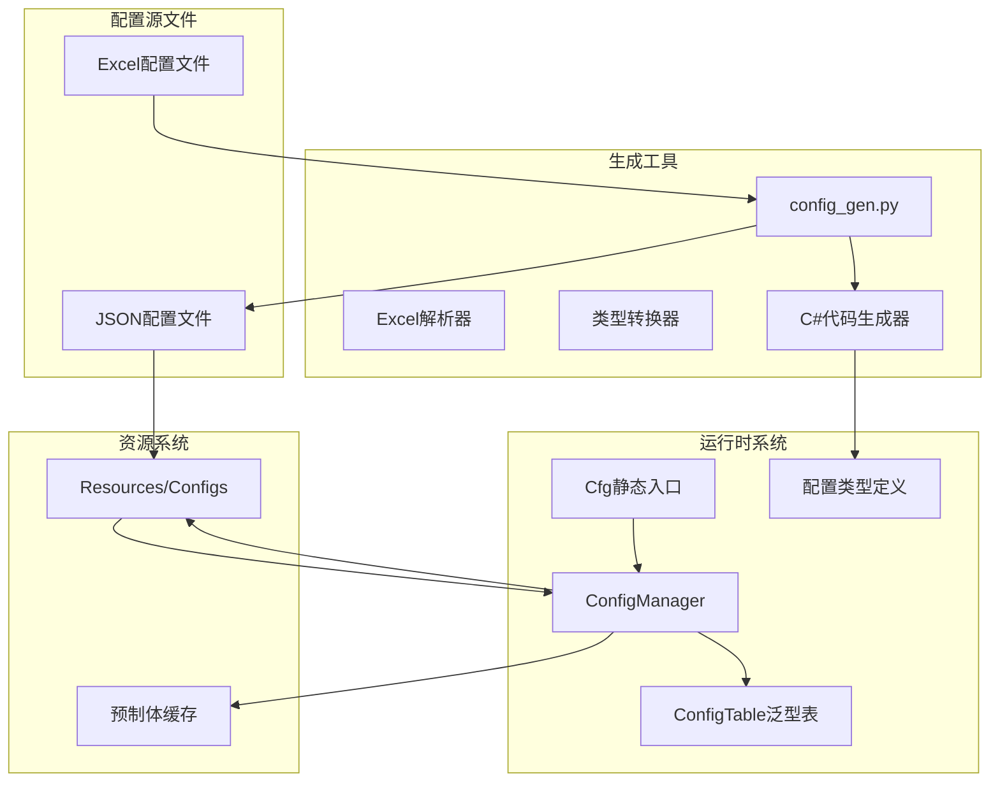
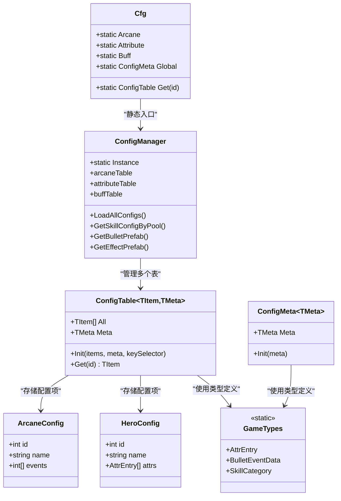
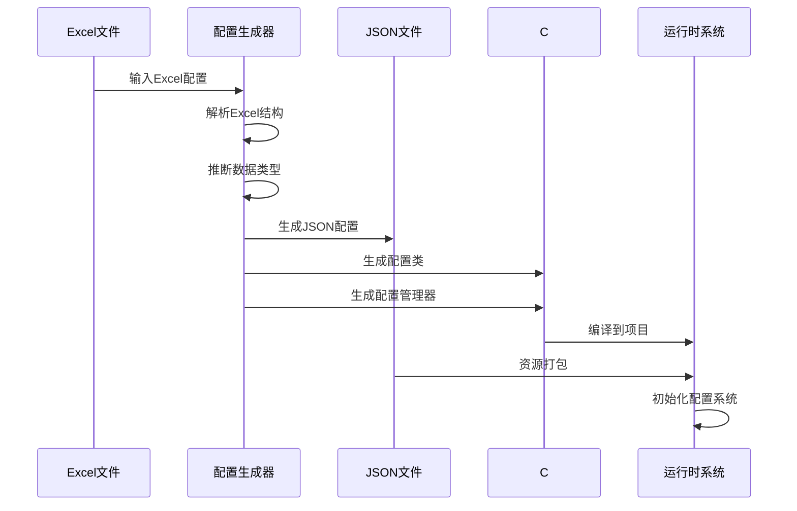
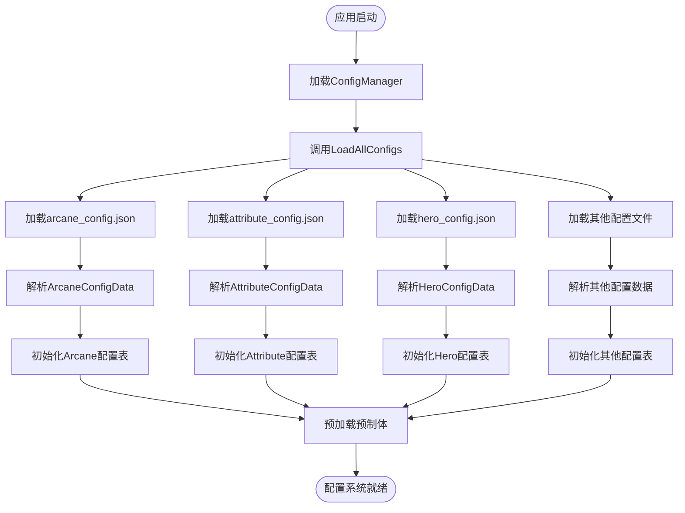
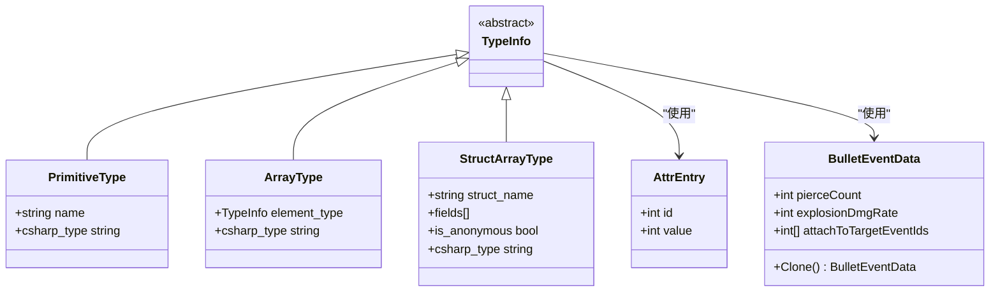
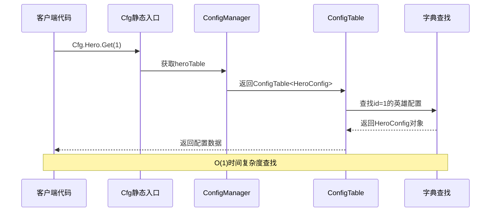
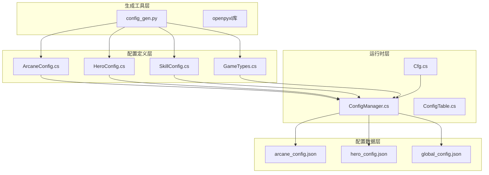
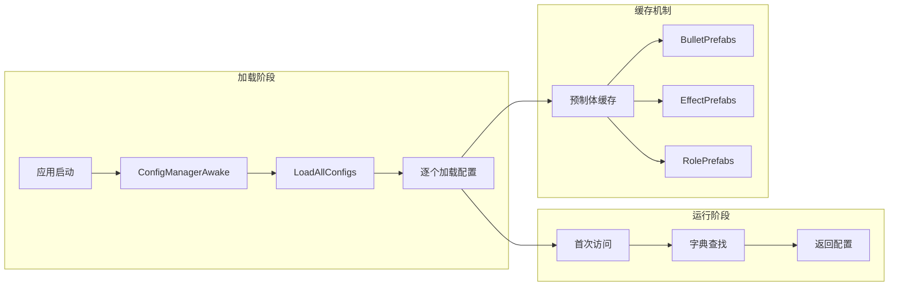

# 旧配置系统

<cite>
**本文档引用的文件**
- [Assets/Scripts/Core/Cfg.cs](file://Assets/Scripts/Core/Cfg.cs)
- [Assets/Scripts/Core/ConfigManager.cs](file://Assets/Scripts/Core/ConfigManager.cs)
- [Assets/Scripts/Core/ConfigTable.cs](file://Assets/Scripts/Core/ConfigTable.cs)
- [Assets/Scripts/Data/GameTypes.cs](file://Assets/Scripts/Data/GameTypes.cs)
- [Assets/Scripts/Data/Configs/ArcaneConfig.cs](file://Assets/Scripts/Data/Configs/ArcaneConfig.cs)
- [Assets/Scripts/Data/Configs/HeroConfig.cs](file://Assets/Scripts/Data/Configs/HeroConfig.cs)
- [Assets/Scripts/Data/Configs/SkillConfig.cs](file://Assets/Scripts/Data/Configs/SkillConfig.cs)
- [Assets/Resources/Configs/arcane_config.json](file://Assets/Resources/Configs/arcane_config.json)
- [Assets/Resources/Configs/hero_config.json](file://Assets/Resources/Configs/hero_config.json)
- [Assets/Resources/Configs/global_config.json](file://Assets/Resources/Configs/global_config.json)
- [Tools/config_gen.py](file://Tools/config_gen.py)
</cite>

## 更新摘要
**所做更改**
- 更新了配置系统架构描述，反映现代化重构后的自动化配置表系统
- 重新组织了核心组件分析，突出新的ConfigTable泛型架构
- 更新了配置生成流程和加载机制的说明
- 增强了性能优化和故障排除指南
- 更新了所有相关的架构图和示例代码

## 目录
1. [简介](#简介)
2. [项目结构](#项目结构)
3. [核心组件](#核心组件)
4. [架构概览](#架构概览)
5. [详细组件分析](#详细组件分析)
6. [依赖关系分析](#依赖关系分析)
7. [性能考虑](#性能考虑)
8. [故障排除指南](#故障排除指南)
9. [结论](#结论)

## 简介

这是一个基于Unity引擎开发的现代化配置系统，采用自动化配置表系统实现。该系统通过Excel到JSON再到C#代码的完整转换流程，为游戏提供了灵活且可维护的配置管理机制。

**更新** 系统已完全重构为现代化的自动化配置表系统，替代了原有的手动配置管理方式。新系统提供了更强的类型安全性和更好的性能表现。

系统的核心特点包括：
- 自动化配置生成工具链
- 泛型类型安全的配置访问接口
- 预加载资源缓存机制
- 支持多种配置类型的统一管理
- 增强的错误处理和调试能力

## 项目结构

现代化配置系统主要由以下几部分组成：

**图表来源**
- [Tools/config_gen.py:587-688](file://Tools/config_gen.py#L587-L688)
- [Assets/Scripts/Core/Cfg.cs:7-33](file://Assets/Scripts/Core/Cfg.cs#L7-L33)
- [Assets/Scripts/Core/ConfigManager.cs:11-37](file://Assets/Scripts/Core/ConfigManager.cs#L11-L37)

**章节来源**
- [Tools/config_gen.py:1-688](file://Tools/config_gen.py#L1-L688)
- [Assets/Scripts/Core/Cfg.cs:1-35](file://Assets/Scripts/Core/Cfg.cs#L1-L35)
- [Assets/Scripts/Core/ConfigManager.cs:1-318](file://Assets/Scripts/Core/ConfigManager.cs#L1-L318)

## 核心组件

### 配置生成器 (config_gen.py)

配置生成器是整个系统的核心工具，负责将Excel格式的配置文件转换为JSON和对应的C#代码。

**主要功能：**
- Excel文件解析和类型推断
- JSON配置文件生成
- C#配置类代码自动生成
- 配置管理器代码生成

**更新** 新版本增强了类型推断的准确性，支持更复杂的嵌套结构和数组类型。

**章节来源**
- [Tools/config_gen.py:18-94](file://Tools/config_gen.py#L18-L94)
- [Tools/config_gen.py:240-262](file://Tools/config_gen.py#L240-L262)
- [Tools/config_gen.py:318-451](file://Tools/config_gen.py#L318-L451)

### 静态配置入口 (Cfg.cs)

提供统一的配置访问接口，通过静态属性访问各个配置表。

**核心特性：**
- 单例模式的ConfigManager访问
- 泛型类型安全的配置表访问
- 简化的API调用体验

**更新** 新版本支持更多配置表类型，包括带元数据和不带元数据的配置表。

**章节来源**
- [Assets/Scripts/Core/Cfg.cs:7-33](file://Assets/Scripts/Core/Cfg.cs#L7-L33)

### 配置管理器 (ConfigManager.cs)

运行时配置管理的核心组件，负责配置文件的加载、初始化和缓存管理。

**主要职责：**
- 配置文件的自动加载
- 配置表的初始化
- 预制体资源的预加载缓存
- 自定义业务逻辑方法

**更新** 新版本提供了更强大的资源预加载机制和错误处理能力。

**章节来源**
- [Assets/Scripts/Core/ConfigManager.cs:11-318](file://Assets/Scripts/Core/ConfigManager.cs#L11-L318)

### 配置表 (ConfigTable.cs)

现代化的泛型配置数据结构，支持带元数据和不带元数据的两种配置表类型。

**设计模式：**
- 泛型类型安全
- 字典索引优化查找性能
- 统一的数据访问接口

**更新** 新版本引入了ConfigMeta类用于处理纯元数据配置，提供了更清晰的配置分类。

**章节来源**
- [Assets/Scripts/Core/ConfigTable.cs:11-73](file://Assets/Scripts/Core/ConfigTable.cs#L11-L73)

## 架构概览

**图表来源**
- [Assets/Scripts/Core/Cfg.cs:7-33](file://Assets/Scripts/Core/Cfg.cs#L7-L33)
- [Assets/Scripts/Core/ConfigManager.cs:11-37](file://Assets/Scripts/Core/ConfigManager.cs#L11-L37)
- [Assets/Scripts/Core/ConfigTable.cs:11-73](file://Assets/Scripts/Core/ConfigTable.cs#L11-L73)
- [Assets/Scripts/Data/GameTypes.cs:8-82](file://Assets/Scripts/Data/GameTypes.cs#L8-L82)

## 详细组件分析

### 配置生成流程

**更新** 新版本的生成流程更加高效，支持增量更新和更好的错误报告。

**图表来源**
- [Tools/config_gen.py:587-688](file://Tools/config_gen.py#L587-L688)
- [Tools/config_gen.py:240-262](file://Tools/config_gen.py#L240-L262)

### 配置加载流程

**更新** 新版本的加载流程包含了更完善的错误处理和资源预加载机制。

**图表来源**
- [Assets/Scripts/Core/ConfigManager.cs:48-177](file://Assets/Scripts/Core/ConfigManager.cs#L48-L177)
- [Assets/Scripts/Core/ConfigManager.cs:255-298](file://Assets/Scripts/Core/ConfigManager.cs#L255-L298)

### 数据类型系统

系统支持多种数据类型，通过类型推断和转换实现：

**更新** 新版本增强了对复杂嵌套结构的支持，包括匿名结构体和共享类型定义。

**图表来源**
- [Tools/config_gen.py:22-94](file://Tools/config_gen.py#L22-L94)
- [Assets/Scripts/Data/GameTypes.cs:8-56](file://Assets/Scripts/Data/GameTypes.cs#L8-L56)

**章节来源**
- [Tools/config_gen.py:18-94](file://Tools/config_gen.py#L18-L94)
- [Assets/Scripts/Data/GameTypes.cs:8-82](file://Assets/Scripts/Data/GameTypes.cs#L8-L82)

### 配置表访问模式

**更新** 新版本的访问模式更加直观，支持泛型参数的自动推断。

**图表来源**
- [Assets/Scripts/Core/Cfg.cs:23](file://Assets/Scripts/Core/Cfg.cs#L23)
- [Assets/Scripts/Core/ConfigTable.cs:26-32](file://Assets/Scripts/Core/ConfigTable.cs#L26-L32)

**章节来源**
- [Assets/Scripts/Core/Cfg.cs:11-32](file://Assets/Scripts/Core/Cfg.cs#L11-L32)
- [Assets/Scripts/Core/ConfigTable.cs:26-32](file://Assets/Scripts/Core/ConfigTable.cs#L26-L32)

## 依赖关系分析

**更新** 新版本的依赖关系更加清晰，减少了循环依赖的可能性。

**图表来源**
- [Tools/config_gen.py:16-20](file://Tools/config_gen.py#L16-L20)
- [Assets/Scripts/Core/ConfigManager.cs:15-37](file://Assets/Scripts/Core/ConfigManager.cs#L15-L37)

**章节来源**
- [Tools/config_gen.py:16-20](file://Tools/config_gen.py#L16-L20)
- [Assets/Scripts/Core/ConfigManager.cs:15-37](file://Assets/Scripts/Core/ConfigManager.cs#L15-L37)

## 性能考虑

### 内存优化策略

1. **字典索引优化**
   - 使用哈希表实现O(1)的配置查找
   - 避免线性搜索带来的性能问题

2. **资源预加载缓存**
   - 预加载常用的预制体资源
   - 减少运行时资源加载开销

3. **延迟初始化**
   - 按需加载配置表
   - 避免不必要的内存占用

### 加载性能优化

**更新** 新版本的缓存机制更加智能，支持条件加载和资源回收。

**图表来源**
- [Assets/Scripts/Core/ConfigManager.cs:48-54](file://Assets/Scripts/Core/ConfigManager.cs#L48-L54)
- [Assets/Scripts/Core/ConfigManager.cs:255-298](file://Assets/Scripts/Core/ConfigManager.cs#L255-L298)

## 故障排除指南

### 常见问题及解决方案

**配置文件加载失败**
- 检查JSON文件路径是否正确
- 验证JSON格式的有效性
- 确认文件已添加到Resources目录

**配置数据解析错误**
- 检查Excel配置中的数据类型
- 验证字段名称的一致性
- 确认生成的C#代码编译通过

**运行时访问异常**
- 确认ConfigManager已正确初始化
- 检查配置表的键值唯一性
- 验证预制体路径的有效性

**更新** 新版本增加了更详细的错误日志和调试信息，便于问题诊断。

**章节来源**
- [Assets/Scripts/Core/ConfigManager.cs:179-194](file://Assets/Scripts/Core/ConfigManager.cs#L179-L194)
- [Assets/Scripts/Core/ConfigManager.cs:255-298](file://Assets/Scripts/Core/ConfigManager.cs#L255-L298)

## 结论

现代化配置系统通过自动化工具链实现了从Excel到JSON再到C#代码的完整转换，提供了类型安全、高性能的配置管理方案。系统的主要优势包括：

1. **开发效率提升** - 自动化生成减少手工编码工作
2. **类型安全保障** - 编译时类型检查避免运行时错误
3. **性能优化** - 字典索引和资源缓存机制
4. **扩展性强** - 支持新的配置类型和业务需求
5. **维护性增强** - 清晰的架构分离和错误处理

**更新** 新版本的配置系统在保持原有优势的基础上，进一步提升了系统的稳定性和可维护性，为游戏开发提供了更加可靠和高效的配置管理基础设施。

该系统为游戏开发提供了稳定可靠的配置管理基础设施，支持复杂的配置数据结构和多样的使用场景。