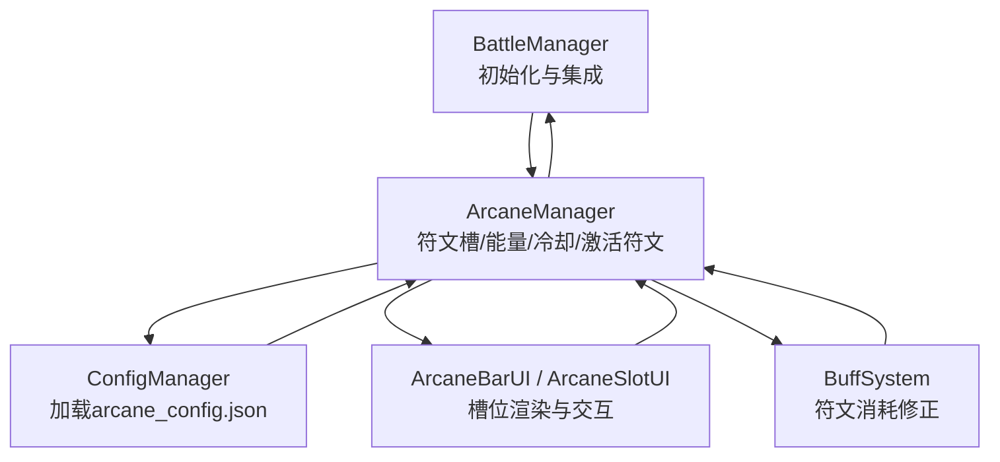
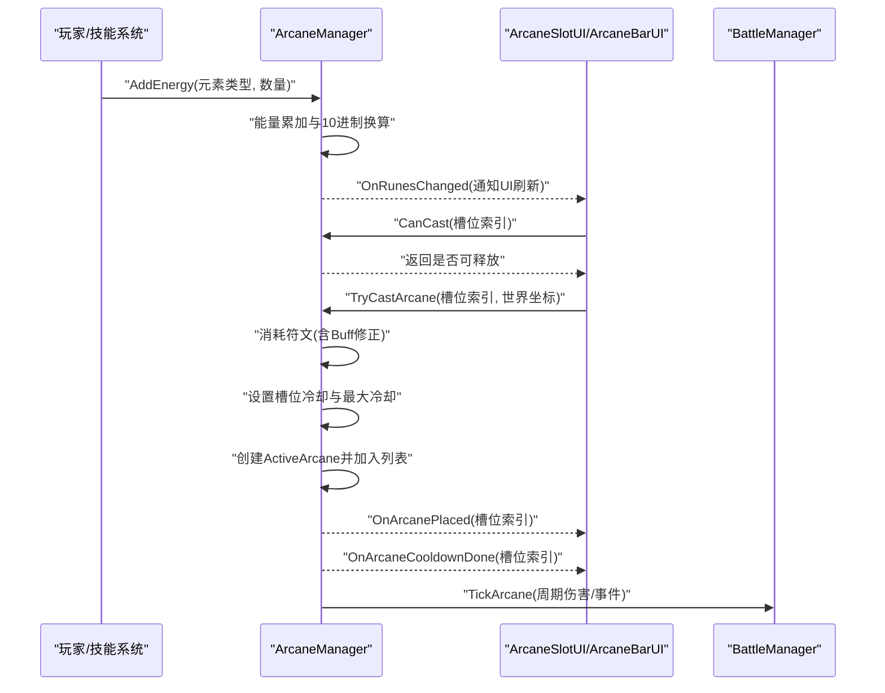
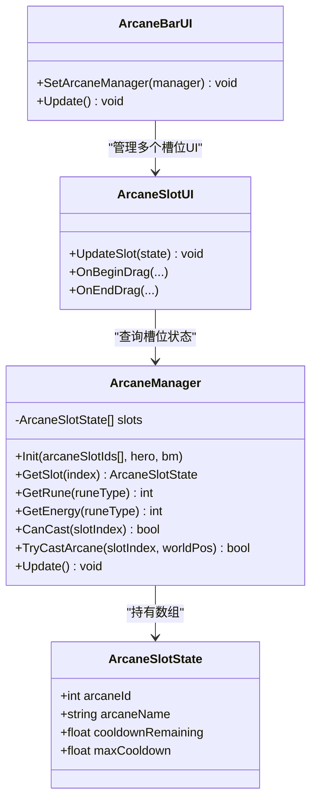
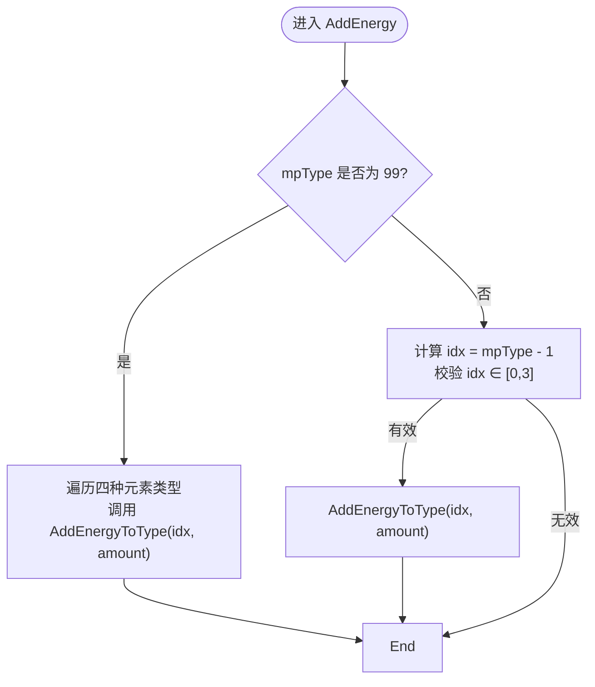
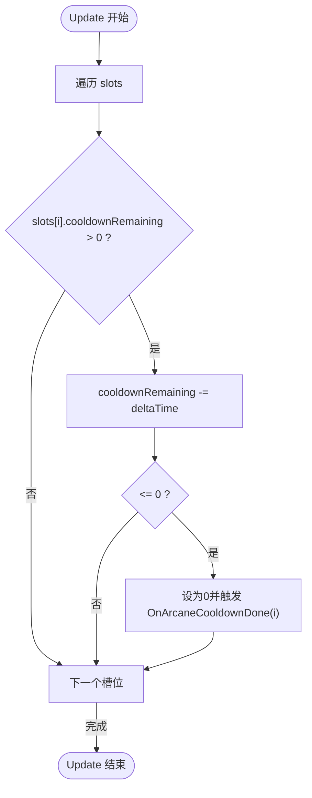
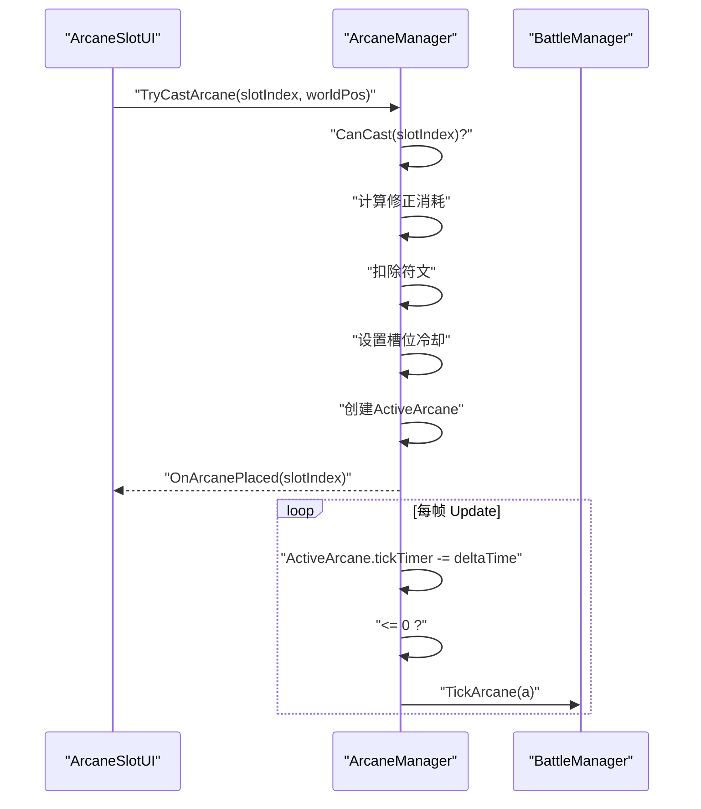
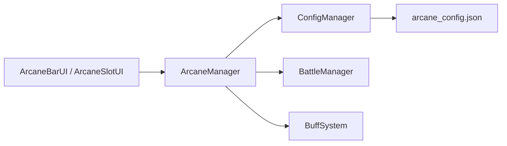

# 奥术管理器核心

<cite>
**本文引用的文件**
- [ArcaneManager.cs](file://Assets/Scripts/Battle/ArcaneManager.cs)
- [arcane_config.json](file://Assets/Resources/Configs/arcane_config.json)
- [ArcaneSlotUI.cs](file://Assets/Scripts/UI/ArcaneSlotUI.cs)
- [ArcaneBarUI.cs](file://Assets/Scripts/UI/ArcaneBarUI.cs)
- [ConfigManager.cs](file://Assets/Scripts/Core/ConfigManager.cs)
- [BattleManager.cs](file://Assets/Scripts/Battle/BattleManager.cs)
- [BuffSystem.cs](file://Assets/Scripts/Battle/BuffSystem.cs)
</cite>

## 目录
1. [简介](#简介)
2. [项目结构](#项目结构)
3. [核心组件](#核心组件)
4. [架构总览](#架构总览)
5. [详细组件分析](#详细组件分析)
6. [依赖关系分析](#依赖关系分析)
7. [性能考量](#性能考量)
8. [故障排查指南](#故障排查指南)
9. [结论](#结论)
10. [附录](#附录)

## 简介
本文件面向GeometryTD的“奥术管理器”核心功能，系统性梳理ArcaneManager类的职责与实现细节，重点覆盖以下方面：
- 符文槽位管理：槽位状态结构体设计、槽位索引系统与UI联动
- 能量系统：AddEnergy方法如何按类型累加能量，并以10点能量折算为1个符文
- 冷却机制：Update中的冷却倒计时与OnArcaneCooldownDone事件触发
- 释放流程：TryCastArcane的完整调用链，包括符文消耗、冷却设置与激活符文创建
- 使用示例：如何正确初始化ArcaneManager及订阅符文释放事件

## 项目结构
与“奥术管理器”直接相关的模块与文件如下：
- 战斗核心：BattleManager负责初始化ArcaneManager并注入英雄与战斗环境
- 奥术管理：ArcaneManager承载符文槽位、能量与冷却状态，调度激活符文的周期性伤害
- 配置系统：ConfigManager统一加载arcane_config.json，提供符文配置查询
- UI层：ArcaneBarUI与ArcaneSlotUI负责槽位渲染、拖放释放与提示展示
- 奥术配置：arcane_config.json定义每种符文的伤害、范围、冷却、符文消耗等参数

图表来源
- [BattleManager.cs:240-247](file://Assets/Scripts/Battle/BattleManager.cs#L240-L247)
- [ArcaneManager.cs:23-56](file://Assets/Scripts/Battle/ArcaneManager.cs#L23-L56)
- [ConfigManager.cs:258-272](file://Assets/Scripts/Core/ConfigManager.cs#L258-L272)
- [ArcaneSlotUI.cs:1-350](file://Assets/Scripts/UI/ArcaneSlotUI.cs#L1-L350)
- [ArcaneBarUI.cs:1-30](file://Assets/Scripts/UI/ArcaneBarUI.cs#L1-L30)
- [BuffSystem.cs:282-303](file://Assets/Scripts/Battle/BuffSystem.cs#L282-L303)

章节来源
- [ArcaneManager.cs:23-56](file://Assets/Scripts/Battle/ArcaneManager.cs#L23-L56)
- [arcane_config.json:1-6](file://Assets/Resources/Configs/arcane_config.json#L1-L6)
- [ArcaneSlotUI.cs:1-350](file://Assets/Scripts/UI/ArcaneSlotUI.cs#L1-L350)
- [ArcaneBarUI.cs:1-30](file://Assets/Scripts/UI/ArcaneBarUI.cs#L1-L30)
- [ConfigManager.cs:258-272](file://Assets/Scripts/Core/ConfigManager.cs#L258-L272)
- [BattleManager.cs:240-247](file://Assets/Scripts/Battle/BattleManager.cs#L240-L247)
- [BuffSystem.cs:282-303](file://Assets/Scripts/Battle/BuffSystem.cs#L282-L303)

## 核心组件
- ArcaneSlotState：描述单个槽位的当前符文ID、名称、剩余冷却与最大冷却
- ActiveArcane：描述一个已释放的激活符文实例，包含位置、周期间隔、周期计时器与配置
- ArcaneManager：核心控制器，维护槽位数组、四种元素类型的符文与能量、激活符文列表；提供初始化、查询、能量累加、释放判定与执行、冷却更新、周期伤害等能力
- 配置与UI：通过ConfigManager加载arcane_config.json；ArcaneBarUI/ArcaneSlotUI负责槽位渲染与交互

章节来源
- [ArcaneManager.cs:6-28](file://Assets/Scripts/Battle/ArcaneManager.cs#L6-L28)
- [arcane_config.json:1-6](file://Assets/Resources/Configs/arcane_config.json#L1-L6)
- [ArcaneSlotUI.cs:49-97](file://Assets/Scripts/UI/ArcaneSlotUI.cs#L49-L97)
- [ArcaneBarUI.cs:18-27](file://Assets/Scripts/UI/ArcaneBarUI.cs#L18-L27)

## 架构总览
ArcaneManager作为战斗中的“资源-释放-反馈”中枢，其工作流如下：
- 资源生成：技能使用后由外部系统调用AddEnergy按元素类型增加能量，满10点转换为1个符文
- 释放判定：CanCast检查槽位冷却与符文消耗（含Buff修正），决定是否可释放
- 释放执行：TryCastArcane消耗符文、设置槽位冷却、创建ActiveArcane并加入列表
- 周期伤害：Update中对每个ActiveArcane进行tick计时，到达间隔则触发伤害与事件
- 冷却反馈：槽位冷却归零时触发OnArcaneCooldownDone事件，供UI或上层逻辑响应

图表来源
- [ArcaneManager.cs:80-106](file://Assets/Scripts/Battle/ArcaneManager.cs#L80-L106)
- [ArcaneManager.cs:119-165](file://Assets/Scripts/Battle/ArcaneManager.cs#L119-L165)
- [ArcaneManager.cs:167-196](file://Assets/Scripts/Battle/ArcaneManager.cs#L167-L196)
- [ArcaneSlotUI.cs:100-150](file://Assets/Scripts/UI/ArcaneSlotUI.cs#L100-L150)
- [ArcaneBarUI.cs:18-27](file://Assets/Scripts/UI/ArcaneBarUI.cs#L18-L27)

## 详细组件分析

### ArcaneSlotState与槽位索引系统
- 设计要点
  - 槽位状态包含：符文ID、名称、剩余冷却、最大冷却
  - 槽位数组长度由初始化时传入的符文ID数组决定，索引即槽位编号
- 状态流转
  - 初始化：根据符文ID从配置系统加载名称与默认冷却
  - 释放：TryCastArcane设置剩余冷却=max冷却
  - 更新：Update逐槽冷却递减，归零触发OnArcaneCooldownDone
- UI联动
  - ArcaneBarUI每帧遍历槽位并调用ArcaneSlotUI.UpdateSlot
  - ArcaneSlotUI依据槽位状态显示冷却遮罩与倒计时文本

图表来源
- [ArcaneManager.cs:6-56](file://Assets/Scripts/Battle/ArcaneManager.cs#L6-L56)
- [ArcaneSlotUI.cs:49-97](file://Assets/Scripts/UI/ArcaneSlotUI.cs#L49-L97)
- [ArcaneBarUI.cs:18-27](file://Assets/Scripts/UI/ArcaneBarUI.cs#L18-L27)

章节来源
- [ArcaneManager.cs:6-56](file://Assets/Scripts/Battle/ArcaneManager.cs#L6-L56)
- [ArcaneSlotUI.cs:49-97](file://Assets/Scripts/UI/ArcaneSlotUI.cs#L49-L97)
- [ArcaneBarUI.cs:18-27](file://Assets/Scripts/UI/ArcaneBarUI.cs#L18-L27)

### 能量系统与10点能量换算为1个符文
- 能量累加入口
  - AddEnergy支持两种模式：
    - 元素类型=99：对所有四种元素类型累加
    - 元素类型∈{1,2,3,4}：仅对对应类型累加
- 换算规则
  - 每种元素类型独立维护能量计数，达到10点即扣除10并增加1个对应符文
  - 换算完成后触发OnRunesChanged，驱动UI刷新
- 复杂度
  - 单次AddEnergy为O(1)或O(4)，取决于是否全类型累加
  - 换算过程为常数次循环（最多一次）

图表来源
- [ArcaneManager.cs:80-95](file://Assets/Scripts/Battle/ArcaneManager.cs#L80-L95)
- [ArcaneManager.cs:97-106](file://Assets/Scripts/Battle/ArcaneManager.cs#L97-L106)

章节来源
- [ArcaneManager.cs:80-106](file://Assets/Scripts/Battle/ArcaneManager.cs#L80-L106)

### 冷却系统与OnArcaneCooldownDone事件
- 冷却更新
  - Update中遍历所有槽位，若剩余冷却>0则递减
  - 归零时重置为0并触发OnArcaneCooldownDone
- 事件用途
  - UI层可订阅该事件以恢复槽位可用态与动画
  - 上层逻辑可据此刷新策略或解锁新动作

图表来源
- [ArcaneManager.cs:167-196](file://Assets/Scripts/Battle/ArcaneManager.cs#L167-L196)

章节来源
- [ArcaneManager.cs:167-196](file://Assets/Scripts/Battle/ArcaneManager.cs#L167-L196)

### TryCastArcane完整流程
- 可释放性检查
  - CanCast：检查槽位冷却、配置有效性、元素类型索引合法性、修正后的符文消耗
- 释放执行
  - 消耗符文：按修正后的消耗值从对应元素符文中扣除
  - 设置冷却：槽位剩余冷却=max冷却
  - 创建激活符文：记录位置、tick间隔、初始tick计时为0（立即首次生效）、保存配置
  - 事件回调：触发OnArcanePlaced
- 周期伤害
  - Update中对每个ActiveArcane进行tick计时，到达间隔则调用TickArcane
  - TickArcane根据配置决定全屏伤害或范围伤害，对目标施加伤害与事件

图表来源
- [ArcaneManager.cs:119-165](file://Assets/Scripts/Battle/ArcaneManager.cs#L119-L165)
- [ArcaneManager.cs:167-196](file://Assets/Scripts/Battle/ArcaneManager.cs#L167-L196)
- [ArcaneManager.cs:198-256](file://Assets/Scripts/Battle/ArcaneManager.cs#L198-L256)

章节来源
- [ArcaneManager.cs:119-165](file://Assets/Scripts/Battle/ArcaneManager.cs#L119-L165)
- [ArcaneManager.cs:167-196](file://Assets/Scripts/Battle/ArcaneManager.cs#L167-L196)
- [ArcaneManager.cs:198-256](file://Assets/Scripts/Battle/ArcaneManager.cs#L198-L256)

### 配置与数据模型
- 配置来源
  - ConfigManager加载arcane_config.json并建立ID到配置的映射
  - ArcaneManager通过ConfigManager查询具体符文的名称、图标、伤害、伤害类型、半径、周期间隔、冷却、符文消耗、符文类型、事件列表等
- 示例配置字段
  - id、name、icon、dmg、dmgType、radius、tickInterval、cd、runeCost、runeType、events、enemyEvents、bulletEvents
- UI提示
  - ArcaneSlotUI在点击槽位时显示tooltip，包含名称、描述、消耗、冷却等信息

章节来源
- [ConfigManager.cs:258-272](file://Assets/Scripts/Core/ConfigManager.cs#L258-L272)
- [arcane_config.json:1-6](file://Assets/Resources/Configs/arcane_config.json#L1-L6)
- [ArcaneSlotUI.cs:233-304](file://Assets/Scripts/UI/ArcaneSlotUI.cs#L233-L304)

### 初始化与事件订阅
- 初始化
  - BattleManager在战斗开始时创建ArcaneManager并调用Init，传入玩家已装备的符文ID数组、英雄控制器与战斗管理器
- 事件订阅
  - OnRunesChanged：符文变化时刷新UI
  - OnArcanePlaced：符文放置时更新槽位状态与视觉反馈
  - OnArcaneCooldownDone：槽位冷却结束时恢复可用态

章节来源
- [BattleManager.cs:240-247](file://Assets/Scripts/Battle/BattleManager.cs#L240-L247)
- [ArcaneManager.cs:33-36](file://Assets/Scripts/Battle/ArcaneManager.cs#L33-L36)

## 依赖关系分析
- 组件耦合
  - ArcaneManager强依赖ConfigManager（查询配置）与BattleManager（执行伤害/范围查询）
  - UI层通过ArcaneBarUI/ArcaneSlotUI间接依赖ArcaneManager，形成“状态驱动渲染”的单向依赖
  - BuffSystem通过ArcaneCostModifier影响CanCast的消耗判定，体现“状态修正”对业务逻辑的影响
- 外部依赖
  - ConfigManager依赖Resources路径下的JSON配置文件
  - ArcaneSlotUI依赖Unity UI组件与相机空间转换

图表来源
- [ArcaneManager.cs:30-31](file://Assets/Scripts/Battle/ArcaneManager.cs#L30-L31)
- [ConfigManager.cs:258-272](file://Assets/Scripts/Core/ConfigManager.cs#L258-L272)
- [arcane_config.json:1-6](file://Assets/Resources/Configs/arcane_config.json#L1-L6)
- [ArcaneSlotUI.cs:1-350](file://Assets/Scripts/UI/ArcaneSlotUI.cs#L1-L350)
- [ArcaneBarUI.cs:1-30](file://Assets/Scripts/UI/ArcaneBarUI.cs#L1-L30)
- [BuffSystem.cs:282-303](file://Assets/Scripts/Battle/BuffSystem.cs#L282-L303)

章节来源
- [ArcaneManager.cs:30-31](file://Assets/Scripts/Battle/ArcaneManager.cs#L30-L31)
- [ConfigManager.cs:258-272](file://Assets/Scripts/Core/ConfigManager.cs#L258-L272)
- [ArcaneSlotUI.cs:1-350](file://Assets/Scripts/UI/ArcaneSlotUI.cs#L1-L350)
- [ArcaneBarUI.cs:1-30](file://Assets/Scripts/UI/ArcaneBarUI.cs#L1-L30)
- [BuffSystem.cs:282-303](file://Assets/Scripts/Battle/BuffSystem.cs#L282-L303)

## 性能考量
- 时间复杂度
  - AddEnergy：O(1)或O(4)，取决于是否全类型累加
  - CanCast：O(1)，包含一次配置查询与一次修正计算
  - TryCastArcane：O(1)，包含一次配置查询、一次消耗修正与一次符文扣减
  - Update：槽位数量×O(1)用于冷却更新；激活符文数量×O(1)用于tick计时与伤害触发
- 空间复杂度
  - slots数组大小=槽位数量
  - runes与energy为固定大小数组（4）
  - activeArcanes线性增长，上限受同时激活符文数量限制
- 优化建议
  - 将符文消耗修正缓存于CanCast前，避免重复查询BuffSystem
  - 对ActiveArcane列表采用对象池减少GC压力（可选）
  - 在UI层对频繁刷新的文本/图像进行节流或延迟更新

## 故障排查指南
- 无法释放符文
  - 检查槽位冷却是否仍大于0
  - 检查符文类型索引是否合法（1~4）
  - 检查BuffSystem是否对特定符文/元素类型施加了额外消耗
- 能量不增长或不换算
  - 确认AddEnergy传入的mpType是否为99或1~4
  - 确认OnRunesChanged事件是否被UI订阅并刷新
- 冷却不消失
  - 检查Update是否正常执行
  - 检查OnArcaneCooldownDone事件是否被UI订阅
- 伤害异常
  - 检查配置中dmg、tickInterval、半径与dmgType是否符合预期
  - 检查TickArcane中全屏与范围分支逻辑是否正确

章节来源
- [ArcaneManager.cs:119-165](file://Assets/Scripts/Battle/ArcaneManager.cs#L119-L165)
- [ArcaneManager.cs:167-196](file://Assets/Scripts/Battle/ArcaneManager.cs#L167-L196)
- [ArcaneManager.cs:198-256](file://Assets/Scripts/Battle/ArcaneManager.cs#L198-L256)
- [BuffSystem.cs:282-303](file://Assets/Scripts/Battle/BuffSystem.cs#L282-L303)

## 结论
ArcaneManager以简洁的数据结构与清晰的流程控制实现了“能量-符文-冷却-释放-周期伤害”的完整闭环。通过配置化与事件驱动，系统具备良好的扩展性与可维护性。实际开发中应重点关注：
- 正确初始化与事件订阅
- 能量换算与符文消耗修正的边界条件
- 冷却与周期伤害的帧率无关性
- UI层对状态变更的及时响应

## 附录

### 使用场景与最佳实践
- 初始化ArcaneManager
  - 在战斗开始时由BattleManager创建并调用Init，传入玩家已装备的符文ID数组、英雄控制器与战斗管理器
- 订阅事件
  - OnRunesChanged：刷新符文栏与槽位可用态
  - OnArcanePlaced：播放放置特效与音效
  - OnArcaneCooldownDone：恢复槽位高亮与可释放状态
- 释放符文
  - UI端通过ArcaneSlotUI的拖拽与点击交互触发TryCastArcane
  - 后端根据配置执行伤害与事件，必要时对全屏或范围目标进行分发

章节来源
- [BattleManager.cs:240-247](file://Assets/Scripts/Battle/BattleManager.cs#L240-L247)
- [ArcaneSlotUI.cs:100-150](file://Assets/Scripts/UI/ArcaneSlotUI.cs#L100-L150)
- [ArcaneManager.cs:33-36](file://Assets/Scripts/Battle/ArcaneManager.cs#L33-L36)