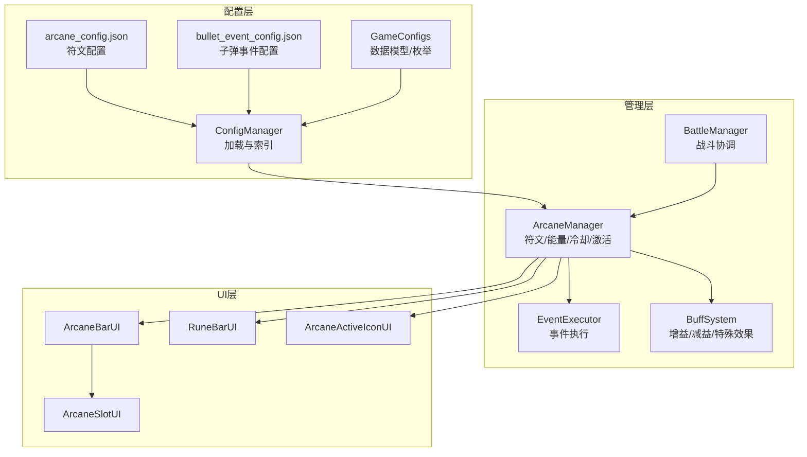
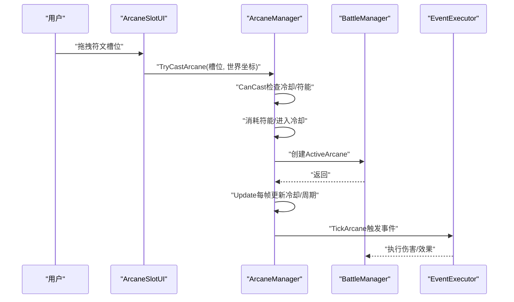
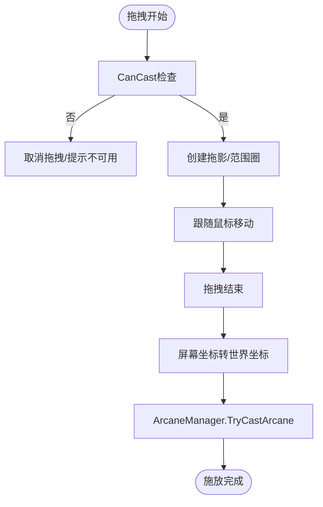
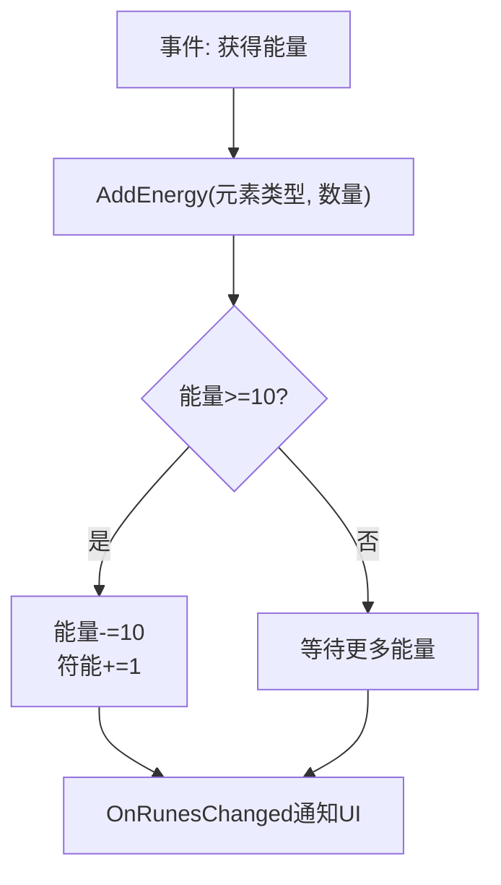
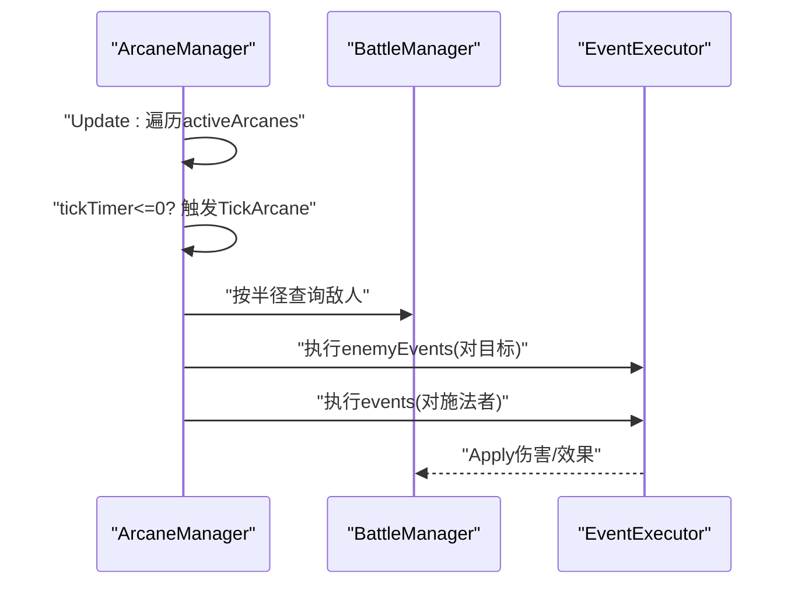
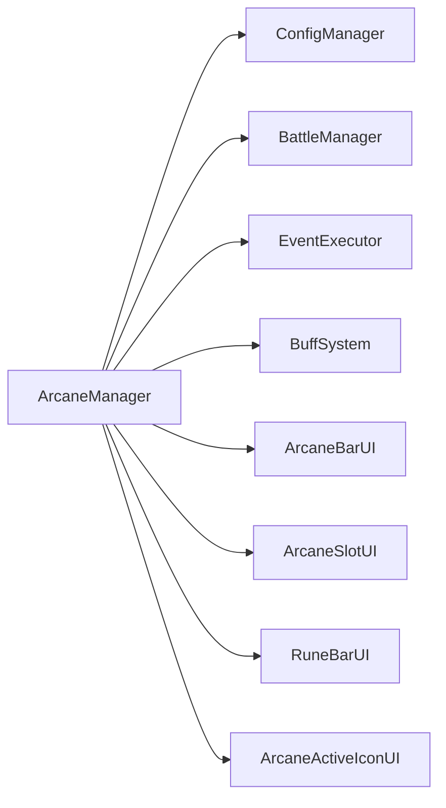

# 奥术系统

<cite>
**本文档引用的文件**
- [ArcaneManager.cs](file://Assets/Scripts/Battle/ArcaneManager.cs)
- [ArcaneSlotUI.cs](file://Assets/Scripts/UI/ArcaneSlotUI.cs)
- [ArcaneBarUI.cs](file://Assets/Scripts/UI/ArcaneBarUI.cs)
- [ArcaneActiveIconUI.cs](file://Assets/Scripts/UI/ArcaneActiveIconUI.cs)
- [RuneBarUI.cs](file://Assets/Scripts/UI/RuneBarUI.cs)
- [ConfigManager.cs](file://Assets/Scripts/Core/ConfigManager.cs)
- [GameConfigs.cs](file://Assets/Scripts/Data/GameConfigs.cs)
- [arcane_config.json](file://Assets/Resources/Configs/arcane_config.json)
- [bullet_event_config.json](file://Assets/Resources/Configs/bullet_event_config.json)
- [EventExecutor.cs](file://Assets/Scripts/Battle/EventExecutor.cs)
- [BuffSystem.cs](file://Assets/Scripts/Battle/BuffSystem.cs)
- [BattleManager.cs](file://Assets/Scripts/Battle/BattleManager.cs)
</cite>

## 目录
1. [简介](#简介)
2. [项目结构](#项目结构)
3. [核心组件](#核心组件)
4. [架构总览](#架构总览)
5. [详细组件分析](#详细组件分析)
6. [依赖关系分析](#依赖关系分析)
7. [性能考量](#性能考量)
8. [故障排查指南](#故障排查指南)
9. [结论](#结论)
10. [附录](#附录)

## 简介
本文件为 GeometryTD 的奥术系统技术文档，围绕符文槽位管理、能量收集与冷却系统、符文配置与效果、组合机制、激活触发与执行流程、平衡性设计以及扩展指南进行系统化说明。文档面向开发者与策划，既提供代码级实现细节，也给出可视化图示与实践建议。

## 项目结构
- 配置层：arcane_config.json 定义符文属性与效果；bullet_event_config.json 定义子弹事件；GameConfigs 提供数据模型与枚举。
- 管理层：ArcaneManager 负责符文槽位、能量、冷却与激活逻辑；ConfigManager 负责加载与索引配置。
- 游戏层：BattleManager 协调战斗流程，调用 ArcaneManager 执行符文；EventExecutor 执行事件链。
- UI层：ArcaneBarUI/ArcaneSlotUI/RuneBarUI/ArcaneActiveIconUI 负责显示符文槽、符能、冷却与激活图标。

图表来源
- [ConfigManager.cs:77-122](file://Assets/Scripts/Core/ConfigManager.cs#L77-L122)
- [ArcaneManager.cs:23-56](file://Assets/Scripts/Battle/ArcaneManager.cs#L23-L56)
- [ArcaneBarUI.cs:5-28](file://Assets/Scripts/UI/ArcaneBarUI.cs#L5-L28)
- [RuneBarUI.cs:6-33](file://Assets/Scripts/UI/RuneBarUI.cs#L6-L33)
- [ArcaneActiveIconUI.cs:7-25](file://Assets/Scripts/UI/ArcaneActiveIconUI.cs#L7-L25)
- [EventExecutor.cs:13-20](file://Assets/Scripts/Battle/EventExecutor.cs#L13-L20)
- [BuffSystem.cs:30-84](file://Assets/Scripts/Battle/BuffSystem.cs#L30-L84)
- [BattleManager.cs:240-274](file://Assets/Scripts/Battle/BattleManager.cs#L240-L274)

章节来源
- [ConfigManager.cs:77-122](file://Assets/Scripts/Core/ConfigManager.cs#L77-L122)
- [ArcaneManager.cs:23-56](file://Assets/Scripts/Battle/ArcaneManager.cs#L23-L56)
- [ArcaneBarUI.cs:5-28](file://Assets/Scripts/UI/ArcaneBarUI.cs#L5-L28)
- [RuneBarUI.cs:6-33](file://Assets/Scripts/UI/RuneBarUI.cs#L6-L33)
- [ArcaneActiveIconUI.cs:7-25](file://Assets/Scripts/UI/ArcaneActiveIconUI.cs#L7-L25)
- [EventExecutor.cs:13-20](file://Assets/Scripts/Battle/EventExecutor.cs#L13-L20)
- [BuffSystem.cs:30-84](file://Assets/Scripts/Battle/BuffSystem.cs#L30-L84)
- [BattleManager.cs:240-274](file://Assets/Scripts/Battle/BattleManager.cs#L240-L274)

## 核心组件
- 符文槽位与状态
  - ArcaneSlotState：记录每个槽位的符文ID、名称、剩余冷却与最大冷却。
  - ArcaneManager.slots：固定长度数组，对应UI栏位数量。
- 能量与符能
  - energy：每种元素能量（0-9），满10进1符能。
  - runes：每种元素符能（可消耗用于施放）。
- 激活与周期
  - ActiveArcane：记录激活符文的位置、周期、计时与配置。
  - 每帧更新冷却与激活周期，周期到触发伤害/事件。
- 触发与效果
  - CanCast：检查冷却与符能消耗（含Buff修饰）。
  - TryCastArcane：消耗符能、进入冷却、创建ActiveArcane。
  - TickArcane：按配置计算伤害、范围命中、执行事件链。

章节来源
- [ArcaneManager.cs:6-28](file://Assets/Scripts/Battle/ArcaneManager.cs#L6-L28)
- [ArcaneManager.cs:119-165](file://Assets/Scripts/Battle/ArcaneManager.cs#L119-L165)
- [ArcaneManager.cs:198-256](file://Assets/Scripts/Battle/ArcaneManager.cs#L198-L256)

## 架构总览
下图展示从用户交互到符文激活、伤害计算与事件执行的完整流程。

图表来源
- [ArcaneSlotUI.cs:100-154](file://Assets/Scripts/UI/ArcaneSlotUI.cs#L100-L154)
- [ArcaneManager.cs:135-165](file://Assets/Scripts/Battle/ArcaneManager.cs#L135-L165)
- [ArcaneManager.cs:167-196](file://Assets/Scripts/Battle/ArcaneManager.cs#L167-L196)
- [ArcaneManager.cs:198-256](file://Assets/Scripts/Battle/ArcaneManager.cs#L198-L256)
- [EventExecutor.cs:13-20](file://Assets/Scripts/Battle/EventExecutor.cs#L13-L20)

## 详细组件分析

### 符文槽位与UI交互
- ArcaneSlotUI
  - 拖拽开始/拖拽中/拖拽结束：创建拖影、范围圈、屏幕坐标到世界坐标的转换。
  - 结束拖拽且不在栏位内：调用 ArcaneManager.TryCastArcane。
  - UpdateSlot：根据冷却、符能与可用性更新UI（透明度、颜色、冷却覆盖）。
- ArcaneBarUI
  - 将 ArcaneManager 的槽位状态同步到各 ArcaneSlotUI。
- ArcaneActiveIconUI
  - 监听 OnArcanePlaced，动态生成激活图标并显示剩余周期。

图表来源
- [ArcaneSlotUI.cs:100-154](file://Assets/Scripts/UI/ArcaneSlotUI.cs#L100-L154)
- [ArcaneManager.cs:135-165](file://Assets/Scripts/Battle/ArcaneManager.cs#L135-L165)

章节来源
- [ArcaneSlotUI.cs:100-154](file://Assets/Scripts/UI/ArcaneSlotUI.cs#L100-L154)
- [ArcaneSlotUI.cs:49-97](file://Assets/Scripts/UI/ArcaneSlotUI.cs#L49-L97)
- [ArcaneBarUI.cs:18-27](file://Assets/Scripts/UI/ArcaneBarUI.cs#L18-L27)
- [ArcaneActiveIconUI.cs:27-87](file://Assets/Scripts/UI/ArcaneActiveIconUI.cs#L27-L87)

### 能量收集与冷却系统
- 能量收集
  - EventExecutor.HandleGainEnergy：根据事件参数为指定元素类型增加能量（0-9）。
  - ArcaneManager.AddEnergy：累加能量，满10进1符能，并触发 OnRunesChanged。
- 冷却系统
  - ArcaneManager.Update：逐槽更新冷却，冷却归零触发 OnArcaneCooldownDone。
  - ArcaneSlotUI：显示冷却覆盖与剩余时间文本。
- 符能消耗与修饰
  - ArcaneManager.GetModifiedCost：结合 BuffSystem.GetArcaneCostModifier 对符能消耗进行加成/减免。
  - ArcaneManager.TryCastArcane：按修饰后的消耗扣减符能。

图表来源
- [EventExecutor.cs:124-143](file://Assets/Scripts/Battle/EventExecutor.cs#L124-L143)
- [ArcaneManager.cs:81-106](file://Assets/Scripts/Battle/ArcaneManager.cs#L81-L106)
- [BuffSystem.cs:285-303](file://Assets/Scripts/Battle/BuffSystem.cs#L285-L303)

章节来源
- [EventExecutor.cs:124-143](file://Assets/Scripts/Battle/EventExecutor.cs#L124-L143)
- [ArcaneManager.cs:81-106](file://Assets/Scripts/Battle/ArcaneManager.cs#L81-L106)
- [ArcaneManager.cs:167-196](file://Assets/Scripts/Battle/ArcaneManager.cs#L167-L196)
- [ArcaneSlotUI.cs:63-78](file://Assets/Scripts/UI/ArcaneSlotUI.cs#L63-L78)
- [RuneBarUI.cs:35-54](file://Assets/Scripts/UI/RuneBarUI.cs#L35-L54)
- [BuffSystem.cs:285-303](file://Assets/Scripts/Battle/BuffSystem.cs#L285-L303)

### 符文配置与效果类型
- 配置来源
  - ConfigManager.LoadAllConfigs：加载 arcane_config.json 并建立 ArcaneConfigs 与索引。
  - ArcaneConfig：包含 id、name、desList、icon、dmg、dmgType、radius、tickInterval、cd、runeCost、runeType、events/enemyEvents/bulletEvents。
- 效果类型
  - 主动效果：由 ArcaneManager.TickArcane 执行，按配置计算伤害与范围命中。
  - 被动效果：通过 events/enemyEvents/bulletEvents 调用 EventExecutor 执行。
  - 全屏AoE：当 radius < 0 时，BattleManager.DealFullScreenAoe 对全体敌人造成伤害并附加事件。
- 元素类型
  - dmgType：0=无属性, 1=火, 2=冰, 3=电, 4=风；用于伤害计算与UI视觉区分。

```mermaid
classDiagram
class ArcaneConfig {
+int id
+string name
+string[] desList
+string icon
+int dmg
+int dmgType
+float radius
+float tickInterval
+float cd
+int runeCost
+int runeType
+int[] events
+int[] enemyEvents
+int[] bulletEvents
}
class ConfigManager {
+ArcaneConfig[] ArcaneConfigs
+GetArcaneConfig(id) ArcaneConfig
}
class ArcaneManager {
+Init(arcaneSlotIds, hero, bm)
+CanCast(slotIndex) bool
+TryCastArcane(slotIndex, pos) bool
+GetActiveArcanes() ActiveArcane[]
}
ConfigManager --> ArcaneConfig : "提供"
ArcaneManager --> ArcaneConfig : "读取"
```

图表来源
- [GameConfigs.cs:429-446](file://Assets/Scripts/Data/GameConfigs.cs#L429-L446)
- [ConfigManager.cs:258-272](file://Assets/Scripts/Core/ConfigManager.cs#L258-L272)
- [ArcaneManager.cs:39-56](file://Assets/Scripts/Battle/ArcaneManager.cs#L39-L56)
- [ArcaneManager.cs:119-165](file://Assets/Scripts/Battle/ArcaneManager.cs#L119-L165)

章节来源
- [arcane_config.json:1-6](file://Assets/Resources/Configs/arcane_config.json#L1-L6)
- [GameConfigs.cs:429-446](file://Assets/Scripts/Data/GameConfigs.cs#L429-L446)
- [ConfigManager.cs:77-122](file://Assets/Scripts/Core/ConfigManager.cs#L77-L122)
- [ArcaneManager.cs:198-256](file://Assets/Scripts/Battle/ArcaneManager.cs#L198-L256)
- [BattleManager.cs:419-453](file://Assets/Scripts/Battle/BattleManager.cs#L419-L453)

### 激活触发与效果实现
- 触发条件
  - CanCast：冷却归零且当前符能 ≥ 修饰后的 runeCost。
- 激活过程
  - TryCastArcane：扣减符能、设置冷却、创建 ActiveArcane 并加入列表。
  - Update：遍历 slots 更新冷却；遍历 activeArcanes 更新 tickTimer，周期到触发 TickArcane。
- 效果实现
  - TickArcane：按配置计算实际伤害（基于英雄基础攻击与配置倍率），范围命中敌人并执行 enemyEvents；同时对施法者执行 events。
  - 全屏AoE：radius < 0 时对全体敌人执行伤害与事件。
  - VFX：SpawnTickVfx 根据元素类型生成圆形扩散特效。

图表来源
- [ArcaneManager.cs:167-196](file://Assets/Scripts/Battle/ArcaneManager.cs#L167-L196)
- [ArcaneManager.cs:198-256](file://Assets/Scripts/Battle/ArcaneManager.cs#L198-L256)
- [BattleManager.cs:381-395](file://Assets/Scripts/Battle/BattleManager.cs#L381-L395)
- [BattleManager.cs:419-453](file://Assets/Scripts/Battle/BattleManager.cs#L419-L453)
- [EventExecutor.cs:13-20](file://Assets/Scripts/Battle/EventExecutor.cs#L13-L20)

章节来源
- [ArcaneManager.cs:167-196](file://Assets/Scripts/Battle/ArcaneManager.cs#L167-L196)
- [ArcaneManager.cs:198-256](file://Assets/Scripts/Battle/ArcaneManager.cs#L198-L256)
- [BattleManager.cs:381-395](file://Assets/Scripts/Battle/BattleManager.cs#L381-L395)
- [BattleManager.cs:419-453](file://Assets/Scripts/Battle/BattleManager.cs#L419-L453)
- [EventExecutor.cs:13-20](file://Assets/Scripts/Battle/EventExecutor.cs#L13-L20)

### 符文组合系统与策略深度
- 当前实现
  - 单个符文独立配置，通过 events/enemyEvents/bulletEvents 实现效果组合。
  - 未见“多符文组合”专属配置或规则，组合效果由多个符文的事件叠加实现。
- 策略维度
  - 元素克制：不同 dmgType 的符文对不同敌人有差异化效果。
  - 冷却与能量：符能收集与冷却节奏影响连携与爆发。
  - 范围与全屏：半径与全屏AoE的选择决定清线与控场策略。
- 扩展建议
  - 在 BuffSystem 或 ArcaneManager 增加“组合效果”判定与加成逻辑，以符文ID集合为键进行组合加成。

章节来源
- [ArcaneManager.cs:108-133](file://Assets/Scripts/Battle/ArcaneManager.cs#L108-L133)
- [BuffSystem.cs:285-303](file://Assets/Scripts/Battle/BuffSystem.cs#L285-L303)
- [bullet_event_config.json:1-37](file://Assets/Resources/Configs/bullet_event_config.json#L1-L37)

### 平衡性设计
- 能量消耗限制
  - runeCost：基础消耗；BuffSystem.GetArcaneCostModifier 可加成/减免。
- 冷却时间设置
  - cd：冷却时间，ArcaneSlotUI 显示剩余时间；ArcaneManager.Update 逐槽冷却。
- 效果强度调节
  - dmg 与 tickInterval：dmg 决定单次伤害，tickInterval 决定周期频率。
  - radius：范围AoE；radius < 0 为全屏AoE。
  - 元素类型 dmgType：影响伤害计算与视觉反馈。

章节来源
- [ArcaneManager.cs:108-133](file://Assets/Scripts/Battle/ArcaneManager.cs#L108-L133)
- [ArcaneManager.cs:167-196](file://Assets/Scripts/Battle/ArcaneManager.cs#L167-L196)
- [ArcaneManager.cs:198-256](file://Assets/Scripts/Battle/ArcaneManager.cs#L198-L256)
- [ArcaneSlotUI.cs:63-78](file://Assets/Scripts/UI/ArcaneSlotUI.cs#L63-L78)
- [GameConfigs.cs:429-446](file://Assets/Scripts/Data/GameConfigs.cs#L429-L446)

### 扩展指南
- 添加新符文类型
  - 在 arcane_config.json 中新增 ArcaneConfig 条目，设置 id/name/desList/icon/dmg/dmgType/radius/tickInterval/cd/runeCost/runeType/events/enemyEvents/bulletEvents。
  - 在 ConfigManager 中无需改动（自动加载）。
- 修改符文效果
  - 通过 events/enemyEvents/bulletEvents 引用事件ID，事件由 EventExecutor 执行。
  - 若需全屏AoE，将 radius 设为负值。
- 实现自定义组合规则
  - 方案一：在 BuffSystem 或 ArcaneManager 增加组合判定（如特定符文ID集合触发加成）。
  - 方案二：在 ArcaneManager 中维护“已激活符文集合”，在 TickArcane 前后统一处理组合效果。

章节来源
- [arcane_config.json:1-6](file://Assets/Resources/Configs/arcane_config.json#L1-L6)
- [ConfigManager.cs:77-122](file://Assets/Scripts/Core/ConfigManager.cs#L77-L122)
- [EventExecutor.cs:13-20](file://Assets/Scripts/Battle/EventExecutor.cs#L13-L20)
- [bullet_event_config.json:1-37](file://Assets/Resources/Configs/bullet_event_config.json#L1-L37)
- [BuffSystem.cs:285-303](file://Assets/Scripts/Battle/BuffSystem.cs#L285-L303)

## 依赖关系分析
- ArcaneManager 依赖
  - ConfigManager：读取 ArcaneConfig。
  - BattleManager：范围查询、全屏AoE、敌人接口。
  - EventExecutor：执行事件链。
  - BuffSystem：获取符能消耗修饰。
- UI 依赖
  - ArcaneBarUI/ArcaneSlotUI：绑定 ArcaneManager，监听槽位状态与符能变化。
  - RuneBarUI：订阅 OnRunesChanged，实时刷新符能与能量。
  - ArcaneActiveIconUI：订阅 OnArcanePlaced，显示激活图标与剩余时间。

图表来源
- [ArcaneManager.cs:39-56](file://Assets/Scripts/Battle/ArcaneManager.cs#L39-L56)
- [ArcaneManager.cs:198-256](file://Assets/Scripts/Battle/ArcaneManager.cs#L198-L256)
- [ArcaneBarUI.cs:11-18](file://Assets/Scripts/UI/ArcaneBarUI.cs#L11-L18)
- [RuneBarUI.cs:22-27](file://Assets/Scripts/UI/RuneBarUI.cs#L22-L27)
- [ArcaneActiveIconUI.cs:14-19](file://Assets/Scripts/UI/ArcaneActiveIconUI.cs#L14-L19)

章节来源
- [ArcaneManager.cs:39-56](file://Assets/Scripts/Battle/ArcaneManager.cs#L39-L56)
- [ArcaneManager.cs:198-256](file://Assets/Scripts/Battle/ArcaneManager.cs#L198-L256)
- [ArcaneBarUI.cs:11-18](file://Assets/Scripts/UI/ArcaneBarUI.cs#L11-L18)
- [RuneBarUI.cs:22-27](file://Assets/Scripts/UI/RuneBarUI.cs#L22-L27)
- [ArcaneActiveIconUI.cs:14-19](file://Assets/Scripts/UI/ArcaneActiveIconUI.cs#L14-L19)

## 性能考量
- 时间复杂度
  - Update 每帧遍历 slots 与 activeArcanes，复杂度 O(S+A)，S 为槽位数，A 为激活符文数。
  - 范围查询 GetEnemiesInRadius 遍历存活敌人，复杂度 O(N)，N 为敌人数量。
- 优化建议
  - 使用空间换时间：缓存敌人包围盒或四叉树以降低范围查询成本。
  - 合理控制激活符文数量：限制最大激活数，避免过多 tick 计算。
  - UI刷新去抖：RuneBarUI 已通过定时刷新，ArcaneSlotUI 可考虑节流。

## 故障排查指南
- 常见问题
  - 符文无法施放：检查 CanCast 返回值，确认冷却是否归零、符能是否足够、Buff 是否增加消耗。
  - 伤害异常：核对 ArcaneConfig.dmg 与 dmgType，确认 BattleManager 的全屏AoE路径与范围命中逻辑。
  - 事件未生效：检查 events/enemyEvents/bulletEvents 的事件ID是否存在，EventExecutor 是否正确执行。
- 调试要点
  - 在 ArcaneManager.TickArcane 中断点，观察实际伤害与事件链。
  - 在 EventExecutor.HandleGainEnergy 中断点，确认能量收集是否按预期触发。
  - 在 BuffSystem.GetArcaneCostModifier 中断点，确认符能消耗修饰是否生效。

章节来源
- [ArcaneManager.cs:119-165](file://Assets/Scripts/Battle/ArcaneManager.cs#L119-L165)
- [ArcaneManager.cs:198-256](file://Assets/Scripts/Battle/ArcaneManager.cs#L198-L256)
- [EventExecutor.cs:124-143](file://Assets/Scripts/Battle/EventExecutor.cs#L124-L143)
- [BuffSystem.cs:285-303](file://Assets/Scripts/Battle/BuffSystem.cs#L285-L303)

## 结论
GeometryTD 的奥术系统以配置驱动为核心，通过 ArcaneManager 统一管理符文槽位、能量与冷却，配合 ConfigManager、EventExecutor 与 BuffSystem 实现灵活的效果与修饰。UI 层提供直观的交互与反馈。当前版本侧重单符文效果叠加，组合策略可通过扩展 BuffSystem 或 ArcaneManager 的组合判定进一步深化。建议在后续迭代中引入组合规则与性能优化，以提升策略深度与运行效率。

## 附录
- 配置示例路径
  - 符文配置：[arcane_config.json:1-6](file://Assets/Resources/Configs/arcane_config.json#L1-L6)
  - 子弹事件配置：[bullet_event_config.json:1-37](file://Assets/Resources/Configs/bullet_event_config.json#L1-L37)
- 数据模型参考
  - 符文配置结构：[GameConfigs.cs:429-446](file://Assets/Scripts/Data/GameConfigs.cs#L429-L446)
  - 事件类型与参数：[GameConfigs.cs:122-170](file://Assets/Scripts/Data/GameConfigs.cs#L122-L170)
  - 事件执行入口：[EventExecutor.cs:13-63](file://Assets/Scripts/Battle/EventExecutor.cs#L13-L63)