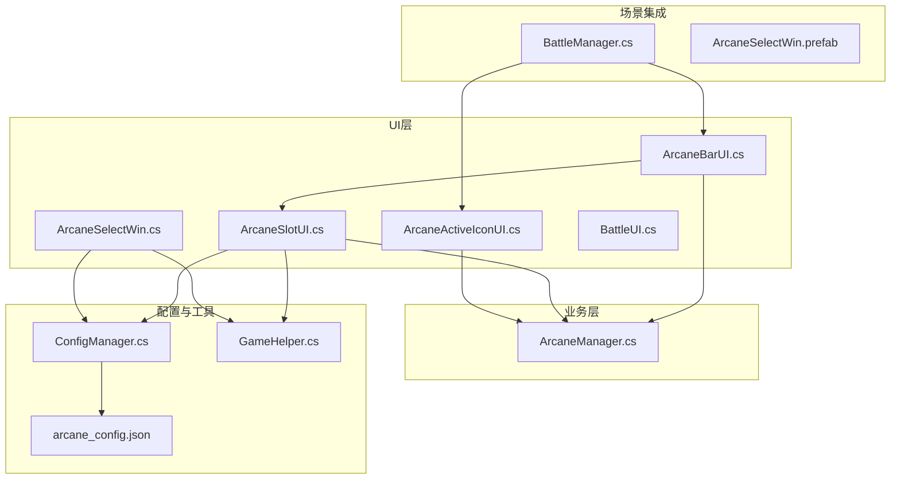
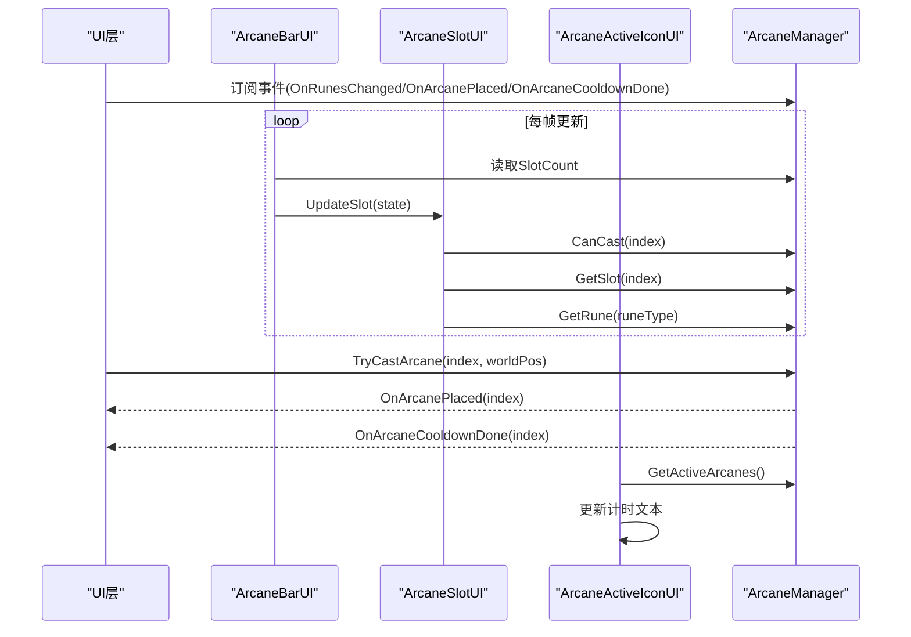
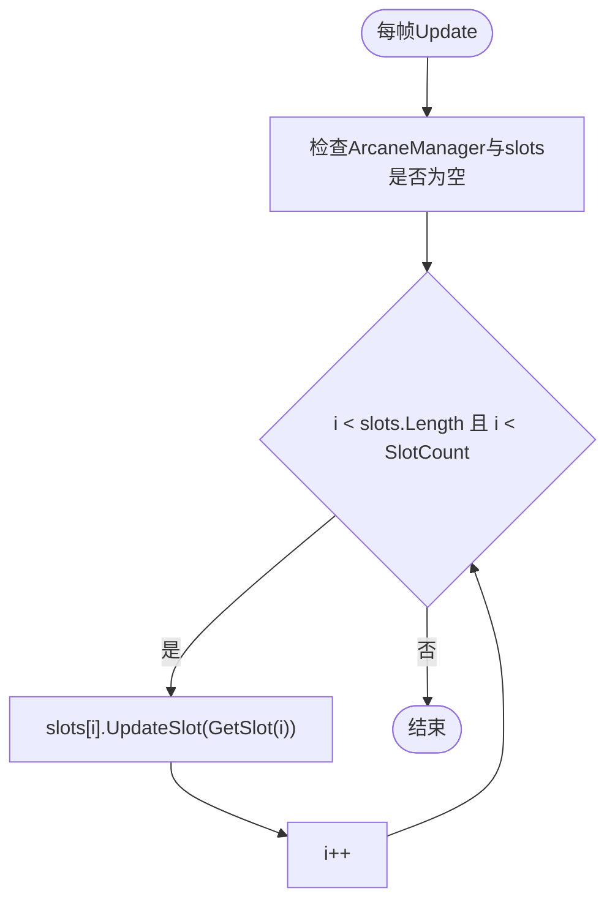
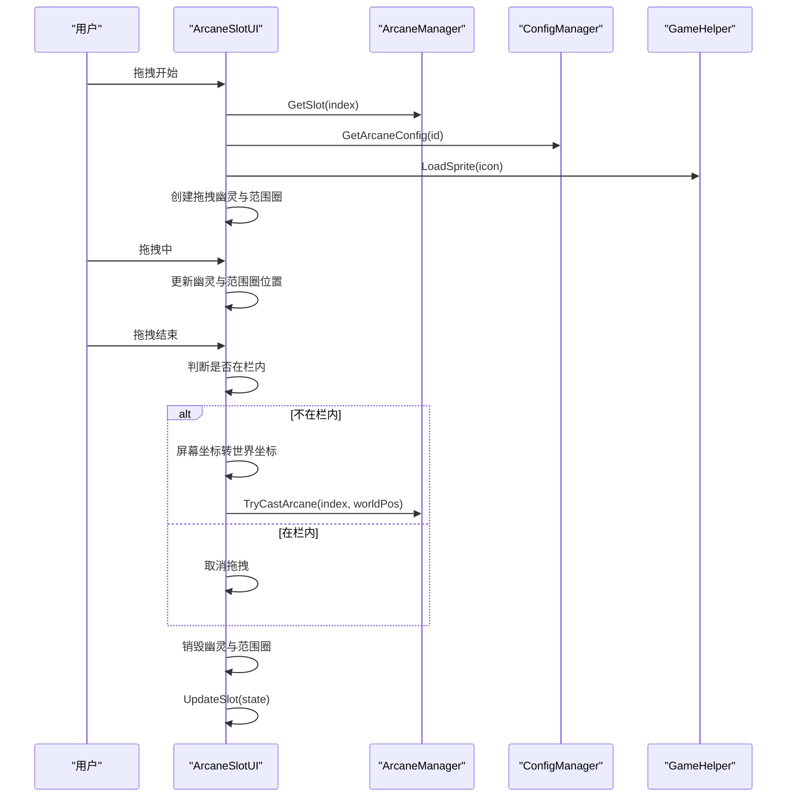
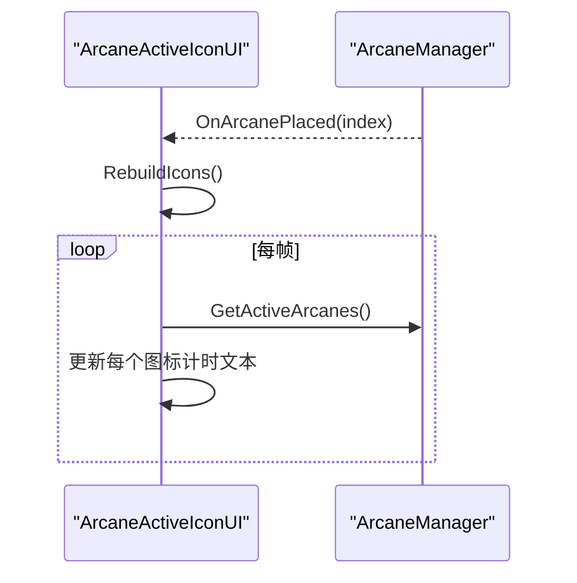
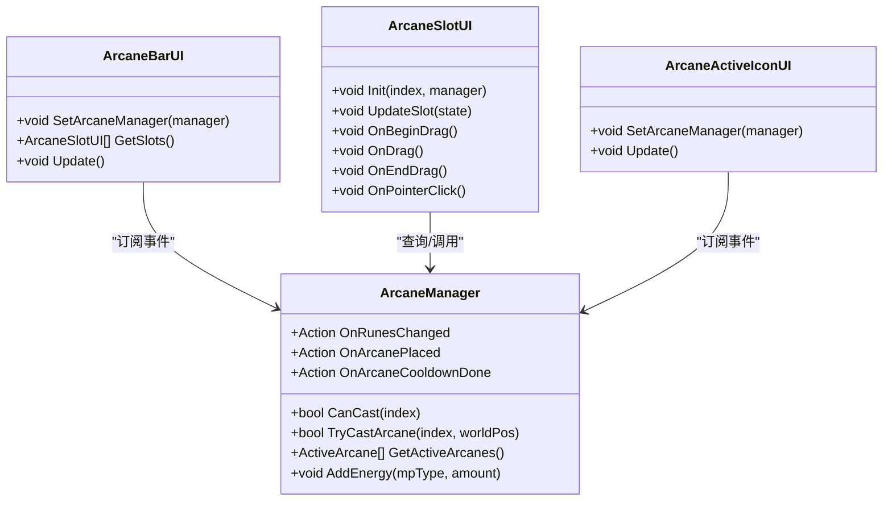
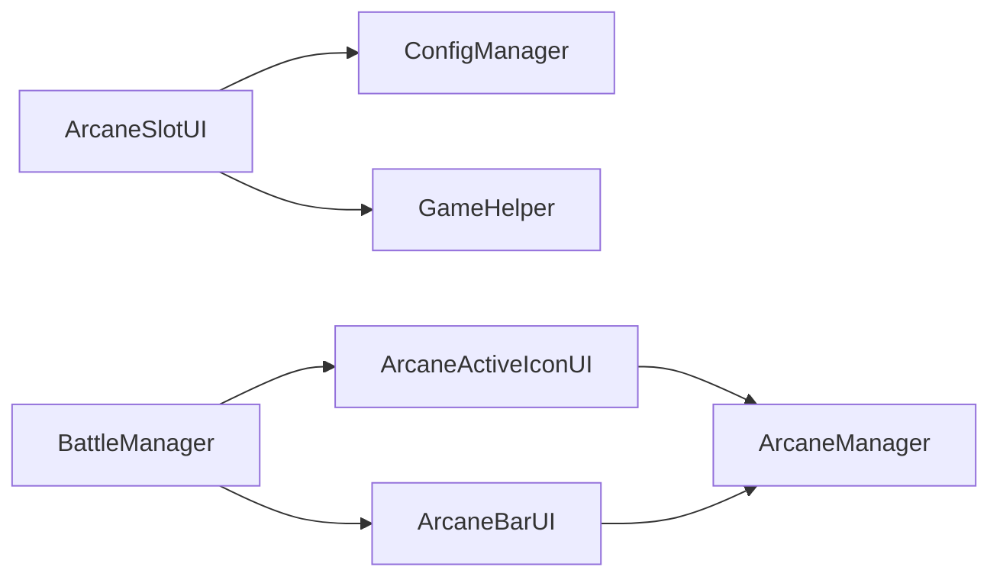

# 符文UI组件

<cite>
**本文档引用的文件**
- [ArcaneBarUI.cs](file://Assets/Scripts/UI/ArcaneBarUI.cs)
- [ArcaneSlotUI.cs](file://Assets/Scripts/UI/ArcaneSlotUI.cs)
- [ArcaneActiveIconUI.cs](file://Assets/Scripts/UI/ArcaneActiveIconUI.cs)
- [ArcaneManager.cs](file://Assets/Scripts/Battle/ArcaneManager.cs)
- [arcane_config.json](file://Assets/Resources/Configs/arcane_config.json)
- [ConfigManager.cs](file://Assets/Scripts/Core/ConfigManager.cs)
- [GameHelper.cs](file://Assets/Scripts/Core/GameHelper.cs)
- [ArcaneSelectWin.cs](file://Assets/Scripts/UI/ArcaneSelectWin.cs)
- [BaseWin.cs](file://Assets/Scripts/UI/BaseWin.cs)
- [BattleUI.cs](file://Assets/Scripts/UI/BattleUI.cs)
- [BattleManager.cs](file://Assets/Scripts/Battle/BattleManager.cs)
- [ArcaneSelectWin.prefab](file://Assets/Resources/UI/ArcaneSelectWin.prefab)
</cite>

## 目录
1. [简介](#简介)
2. [项目结构](#项目结构)
3. [核心组件](#核心组件)
4. [架构总览](#架构总览)
5. [详细组件分析](#详细组件分析)
6. [依赖关系分析](#依赖关系分析)
7. [性能考虑](#性能考虑)
8. [故障排除指南](#故障排除指南)
9. [结论](#结论)
10. [附录](#附录)

## 简介
本文件面向GeometryTD项目的符文UI系统，围绕ArcaneBarUI、ArcaneSlotUI与ArcaneActiveIconUI三大核心UI组件进行技术文档化，深入解释符文栏的整体布局、能量条显示与符文槽位的视觉反馈机制；剖析单个符文槽位的渲染、冷却指示器与点击交互；阐述激活符文图标的显示、效果范围可视化与动画播放控制；梳理UI组件与ArcaneManager的事件交互；分析响应式布局与触摸交互支持；并提供UI自定义指南与最佳实践。

## 项目结构
符文UI相关代码位于Assets/Scripts/UI目录，核心业务逻辑位于Assets/Scripts/Battle目录，配置数据位于Assets/Resources/Configs目录，UI预制体位于Assets/Resources/UI目录。

**图表来源**
- [ArcaneBarUI.cs:1-30](file://Assets/Scripts/UI/ArcaneBarUI.cs#L1-L30)
- [ArcaneSlotUI.cs:1-350](file://Assets/Scripts/UI/ArcaneSlotUI.cs#L1-L350)
- [ArcaneActiveIconUI.cs:1-113](file://Assets/Scripts/UI/ArcaneActiveIconUI.cs#L1-L113)
- [ArcaneManager.cs:1-298](file://Assets/Scripts/Battle/ArcaneManager.cs#L1-L298)
- [ConfigManager.cs:1-619](file://Assets/Scripts/Core/ConfigManager.cs#L1-L619)
- [GameHelper.cs:1-84](file://Assets/Scripts/Core/GameHelper.cs#L1-L84)
- [arcane_config.json:1-6](file://Assets/Resources/Configs/arcane_config.json#L1-L6)
- [BattleManager.cs:1-200](file://Assets/Scripts/Battle/BattleManager.cs#L1-L200)
- [ArcaneSelectWin.prefab:1-942](file://Assets/Resources/UI/ArcaneSelectWin.prefab#L1-L942)

**章节来源**
- [ArcaneBarUI.cs:1-30](file://Assets/Scripts/UI/ArcaneBarUI.cs#L1-L30)
- [ArcaneSlotUI.cs:1-350](file://Assets/Scripts/UI/ArcaneSlotUI.cs#L1-L350)
- [ArcaneActiveIconUI.cs:1-113](file://Assets/Scripts/UI/ArcaneActiveIconUI.cs#L1-L113)
- [ArcaneManager.cs:1-298](file://Assets/Scripts/Battle/ArcaneManager.cs#L1-L298)
- [ConfigManager.cs:1-619](file://Assets/Scripts/Core/ConfigManager.cs#L1-L619)
- [GameHelper.cs:1-84](file://Assets/Scripts/Core/GameHelper.cs#L1-L84)
- [arcane_config.json:1-6](file://Assets/Resources/Configs/arcane_config.json#L1-L6)
- [BattleManager.cs:1-200](file://Assets/Scripts/Battle/BattleManager.cs#L1-L200)
- [ArcaneSelectWin.prefab:1-942](file://Assets/Resources/UI/ArcaneSelectWin.prefab#L1-L942)

## 核心组件
- ArcaneBarUI：符文栏容器，负责遍历并驱动各ArcaneSlotUI更新状态。
- ArcaneSlotUI：单个符文槽位，负责渲染图标、名称、消耗、冷却覆盖与倒计时文本、拖拽与点击交互、提示框与范围圈可视化。
- ArcaneActiveIconUI：激活符文图标集合，负责显示当前激活符文的剩余时间。
- ArcaneManager：符文系统的核心状态机，管理符文槽、符能与能量、冷却、激活符文列表与事件广播。

**章节来源**
- [ArcaneBarUI.cs:1-30](file://Assets/Scripts/UI/ArcaneBarUI.cs#L1-L30)
- [ArcaneSlotUI.cs:1-350](file://Assets/Scripts/UI/ArcaneSlotUI.cs#L1-L350)
- [ArcaneActiveIconUI.cs:1-113](file://Assets/Scripts/UI/ArcaneActiveIconUI.cs#L1-L113)
- [ArcaneManager.cs:1-298](file://Assets/Scripts/Battle/ArcaneManager.cs#L1-L298)

## 架构总览
UI组件通过ArcaneManager提供的状态与事件进行双向联动：
- UI订阅ArcaneManager事件（如符文放置、冷却完成），驱动界面刷新。
- 用户操作（点击、拖拽）触发ArcaneManager的TryCastArcane等方法，更新状态并触发事件。

**图表来源**
- [ArcaneBarUI.cs:18-27](file://Assets/Scripts/UI/ArcaneBarUI.cs#L18-L27)
- [ArcaneSlotUI.cs:49-97](file://Assets/Scripts/UI/ArcaneSlotUI.cs#L49-L97)
- [ArcaneActiveIconUI.cs:27-110](file://Assets/Scripts/UI/ArcaneActiveIconUI.cs#L27-L110)
- [ArcaneManager.cs:33-35](file://Assets/Scripts/Battle/ArcaneManager.cs#L33-L35)
- [ArcaneManager.cs:135-165](file://Assets/Scripts/Battle/ArcaneManager.cs#L135-L165)

## 详细组件分析

### ArcaneBarUI：符文栏容器与状态同步
- 组件职责
  - 保存ArcaneSlotUI数组。
  - 在每帧遍历槽位，调用每个槽位的UpdateSlot以同步状态。
  - 提供SetArcaneManager与GetSlots接口。
- 布局与数据流
  - 通过ArcaneManager.SlotCount限制遍历长度，避免越界。
  - 从ArcaneManager按索引获取ArcaneSlotState，传递给对应槽位。
- 性能注意
  - slots数组长度应与ArcaneManager槽位数一致；若不一致，UI将按两者较小值进行更新，避免空引用。

**图表来源**
- [ArcaneBarUI.cs:18-27](file://Assets/Scripts/UI/ArcaneBarUI.cs#L18-L27)

**章节来源**
- [ArcaneBarUI.cs:1-30](file://Assets/Scripts/UI/ArcaneBarUI.cs#L1-L30)

### ArcaneSlotUI：单个符文槽位渲染与交互
- 渲染要素
  - 图标：从配置加载，首次为空时尝试加载。
  - 名称与消耗：从配置读取，消耗颜色随符能充足度变化。
  - 冷却覆盖与倒计时：冷却中显示填充圆环与秒级文本。
  - 可释放状态：根据CanCast调整透明度与图标颜色。
- 拖拽与范围可视化
  - 开始拖拽：记录半径，创建拖拽幽灵与范围圈（基于圆形纹理）。
  - 拖拽中：跟随鼠标移动，更新范围圈位置。
  - 结束拖拽：若不在栏内，转换屏幕坐标到世界坐标，调用ArcaneManager.TryCastArcane。
  - 恢复图标颜色与透明度。
- 提示框
  - 点击显示动态提示框，包含名称、描述列表、消耗、冷却等信息，自动定时销毁。
- 交互细节
  - 使用Unity事件接口实现拖拽与点击。
  - 通过ConfigManager与GameHelper加载配置与字体资源。

**图表来源**
- [ArcaneSlotUI.cs:100-154](file://Assets/Scripts/UI/ArcaneSlotUI.cs#L100-L154)
- [ArcaneSlotUI.cs:165-230](file://Assets/Scripts/UI/ArcaneSlotUI.cs#L165-L230)
- [ArcaneSlotUI.cs:233-341](file://Assets/Scripts/UI/ArcaneSlotUI.cs#L233-L341)
- [ArcaneManager.cs:135-165](file://Assets/Scripts/Battle/ArcaneManager.cs#L135-L165)
- [ConfigManager.cs:266-272](file://Assets/Scripts/Core/ConfigManager.cs#L266-L272)
- [GameHelper.cs:13-29](file://Assets/Scripts/Core/GameHelper.cs#L13-L29)

**章节来源**
- [ArcaneSlotUI.cs:1-350](file://Assets/Scripts/UI/ArcaneSlotUI.cs#L1-L350)

### ArcaneActiveIconUI：激活符文图标与计时
- 功能概述
  - 订阅ArcaneManager.OnArcanePlaced事件，重建激活图标集合。
  - 每帧读取ArcaneManager.GetActiveArcanes，更新每个图标上的剩余时间文本。
- 视觉呈现
  - 每个激活符文以容器+背景+中心计时文本的方式呈现，按顺序排列。
- 生命周期
  - 组件销毁时取消事件订阅，防止泄漏。

**图表来源**
- [ArcaneActiveIconUI.cs:14-110](file://Assets/Scripts/UI/ArcaneActiveIconUI.cs#L14-L110)
- [ArcaneManager.cs:34-35](file://Assets/Scripts/Battle/ArcaneManager.cs#L34-L35)

**章节来源**
- [ArcaneActiveIconUI.cs:1-113](file://Assets/Scripts/UI/ArcaneActiveIconUI.cs#L1-L113)

### UI与ArcaneManager交互机制
- 事件订阅
  - OnRunesChanged：符能变化后刷新所有槽位的可释放状态与消耗颜色。
  - OnArcanePlaced：激活符文放置后重建激活图标集合。
  - OnArcaneCooldownDone：槽位冷却完成时刷新该槽位。
- 事件触发
  - ArcaneManager在TryCastArcane成功后触发OnArcanePlaced，并设置槽位冷却。
  - ArcaneManager在Update中推进冷却与激活符文计时，冷却归零时触发OnArcaneCooldownDone。

**图表来源**
- [ArcaneManager.cs:33-35](file://Assets/Scripts/Battle/ArcaneManager.cs#L33-L35)
- [ArcaneBarUI.cs:11-16](file://Assets/Scripts/UI/ArcaneBarUI.cs#L11-L16)
- [ArcaneSlotUI.cs:31-47](file://Assets/Scripts/UI/ArcaneSlotUI.cs#L31-L47)
- [ArcaneActiveIconUI.cs:14-25](file://Assets/Scripts/UI/ArcaneActiveIconUI.cs#L14-L25)

**章节来源**
- [ArcaneManager.cs:33-35](file://Assets/Scripts/Battle/ArcaneManager.cs#L33-L35)
- [ArcaneBarUI.cs:11-16](file://Assets/Scripts/UI/ArcaneBarUI.cs#L11-L16)
- [ArcaneSlotUI.cs:31-47](file://Assets/Scripts/UI/ArcaneSlotUI.cs#L31-L47)
- [ArcaneActiveIconUI.cs:14-25](file://Assets/Scripts/UI/ArcaneActiveIconUI.cs#L14-L25)

### 响应式设计与触摸交互
- 响应式布局
  - ArcaneSelectWin通过GridLayout与LayoutElement控制项高度，配合ScrollView实现自适应滚动。
  - 文本与按钮锚点采用相对锚点，保证在不同分辨率下保持相对位置。
- 触摸交互
  - ArcaneSlotUI实现IBeginDragHandler/IDragHandler/IEndDragHandler与IPointerClickHandler，兼容触摸设备的拖拽与点击。
  - 屏幕坐标到世界坐标的转换使用Camera.main与射线平面相交，确保在不同分辨率下准确命中。

**章节来源**
- [ArcaneSelectWin.cs:76-125](file://Assets/Scripts/UI/ArcaneSelectWin.cs#L76-L125)
- [ArcaneSlotUI.cs:100-154](file://Assets/Scripts/UI/ArcaneSlotUI.cs#L100-L154)
- [ArcaneSlotUI.cs:156-163](file://Assets/Scripts/UI/ArcaneSlotUI.cs#L156-L163)

### UI自定义指南
- 修改符文槽位样式
  - 在ArcaneSlotUI中调整图标、名称、消耗、冷却文本的颜色与尺寸；调整CanvasGroup透明度与图标颜色以反映可释放状态。
  - 在ArcaneSelectWin中调整项的高度、颜色与选中态背景。
- 调整动画效果
  - 拖拽幽灵与范围圈通过动态创建Sprite与Texture2D实现，可在创建阶段调整透明度、排序层与缩放。
  - 激活符文计时文本的字体与描边可通过GameHelper加载的字体统一管理。
- 添加新的视觉反馈
  - 在ArcaneSlotUI的UpdateSlot中增加新的视觉元素（如额外图标、边框高亮）。
  - 在ArcaneActiveIconUI中扩展计时文本格式或添加额外状态指示。

**章节来源**
- [ArcaneSlotUI.cs:49-97](file://Assets/Scripts/UI/ArcaneSlotUI.cs#L49-L97)
- [ArcaneSlotUI.cs:165-230](file://Assets/Scripts/UI/ArcaneSlotUI.cs#L165-L230)
- [ArcaneActiveIconUI.cs:32-87](file://Assets/Scripts/UI/ArcaneActiveIconUI.cs#L32-L87)
- [GameHelper.cs:49-58](file://Assets/Scripts/Core/GameHelper.cs#L49-L58)

### 使用示例与最佳实践
- 初始化与绑定
  - 在场景中将ArcaneManager实例注入ArcaneBarUI与ArcaneSlotUI；ArcaneActiveIconUI订阅ArcaneManager事件。
- 性能优化
  - 避免在Update中频繁创建对象；拖拽幽灵与范围圈仅在拖拽期间创建与销毁。
  - 使用ConfigManager缓存配置，减少重复加载。
- 用户体验
  - 消耗颜色随符能变化，提供即时反馈。
  - 冷却覆盖与倒计时清晰可见，避免误操作。
  - 提示框内容来自配置，确保文案一致性。

**章节来源**
- [ArcaneBarUI.cs:11-16](file://Assets/Scripts/UI/ArcaneBarUI.cs#L11-L16)
- [ArcaneSlotUI.cs:165-191](file://Assets/Scripts/UI/ArcaneSlotUI.cs#L165-L191)
- [ArcaneManager.cs:80-106](file://Assets/Scripts/Battle/ArcaneManager.cs#L80-L106)

## 依赖关系分析
- ArcaneSlotUI依赖ConfigManager加载图标与配置，依赖GameHelper加载字体与精灵。
- ArcaneActiveIconUI依赖ArcaneManager的激活符文列表与事件。
- ArcaneBarUI依赖ArcaneManager的槽位数量与状态。
- BattleManager持有UI引用并在场景中协调符文系统的初始化与更新。

**图表来源**
- [ArcaneSlotUI.cs:53-61](file://Assets/Scripts/UI/ArcaneSlotUI.cs#L53-L61)
- [ArcaneActiveIconUI.cs:14-18](file://Assets/Scripts/UI/ArcaneActiveIconUI.cs#L14-L18)
- [ArcaneBarUI.cs:9-16](file://Assets/Scripts/UI/ArcaneBarUI.cs#L9-L16)
- [BattleManager.cs:18-24](file://Assets/Scripts/Battle/BattleManager.cs#L18-L24)

**章节来源**
- [ArcaneSlotUI.cs:1-350](file://Assets/Scripts/UI/ArcaneSlotUI.cs#L1-L350)
- [ArcaneActiveIconUI.cs:1-113](file://Assets/Scripts/UI/ArcaneActiveIconUI.cs#L1-L113)
- [ArcaneBarUI.cs:1-30](file://Assets/Scripts/UI/ArcaneBarUI.cs#L1-L30)
- [BattleManager.cs:1-200](file://Assets/Scripts/Battle/BattleManager.cs#L1-L200)

## 性能考虑
- 避免每帧重复加载资源：图标与字体通过ConfigManager与GameHelper缓存。
- 控制UI更新频率：ArcaneBarUI每帧仅遍历有效槽位，ArcaneActiveIconUI仅在数量变化时重建。
- 资源生命周期管理：拖拽期间动态创建的幽灵与范围圈在结束时及时销毁，防止内存泄漏。
- 事件订阅管理：ArcaneActiveIconUI在销毁时取消事件订阅，避免回调链过长。

[本节为通用指导，无需特定文件引用]

## 故障排除指南
- 槽位未显示图标
  - 检查配置路径是否正确，确认ConfigManager已加载arcane_config.json。
  - 确认GameHelper.LoadSprite返回非空。
- 冷却覆盖不显示
  - 检查cooldownOverlay是否赋值，确认槽位处于冷却状态且maxCooldown大于0。
- 拖拽无效
  - 确认CanCast返回true，检查事件数据指针是否为空。
  - 检查根Canvas层级与barRect是否正确获取。
- 提示框不出现
  - 确认activeTooltip未被其他提示框覆盖，检查配置desList是否存在。
- 激活图标不刷新
  - 确认ArcaneManager已触发OnArcanePlaced，且ArcaneActiveIconUI已订阅事件。

**章节来源**
- [arcane_config.json:1-6](file://Assets/Resources/Configs/arcane_config.json#L1-L6)
- [ConfigManager.cs:266-272](file://Assets/Scripts/Core/ConfigManager.cs#L266-L272)
- [GameHelper.cs:13-29](file://Assets/Scripts/Core/GameHelper.cs#L13-L29)
- [ArcaneSlotUI.cs:66-78](file://Assets/Scripts/UI/ArcaneSlotUI.cs#L66-L78)
- [ArcaneSlotUI.cs:100-154](file://Assets/Scripts/UI/ArcaneSlotUI.cs#L100-L154)
- [ArcaneActiveIconUI.cs:27-30](file://Assets/Scripts/UI/ArcaneActiveIconUI.cs#L27-L30)

## 结论
符文UI系统通过ArcaneBarUI、ArcaneSlotUI与ArcaneActiveIconUI三者协作，结合ArcaneManager的状态与事件，实现了完整的符文选择、拖拽施放、冷却与激活展示功能。系统具备良好的可扩展性与自定义能力，同时在性能与用户体验方面提供了多项优化建议与最佳实践。

[本节为总结，无需特定文件引用]

## 附录
- 配置文件说明
  - arcane_config.json定义了符文的基础属性（名称、图标、伤害、类型、半径、间隔、冷却、消耗、事件等）。
- UI预制体
  - ArcaneSelectWin.prefab定义了符文选择窗口的布局与控件锚点，便于在不同分辨率下保持一致的视觉效果。

**章节来源**
- [arcane_config.json:1-6](file://Assets/Resources/Configs/arcane_config.json#L1-L6)
- [ArcaneSelectWin.prefab:1-942](file://Assets/Resources/UI/ArcaneSelectWin.prefab#L1-L942)