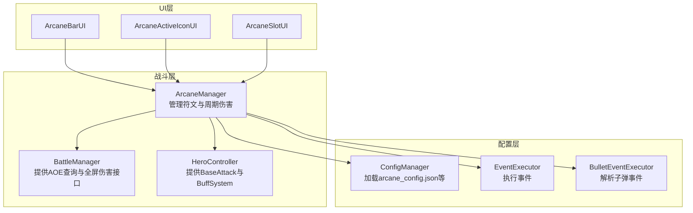
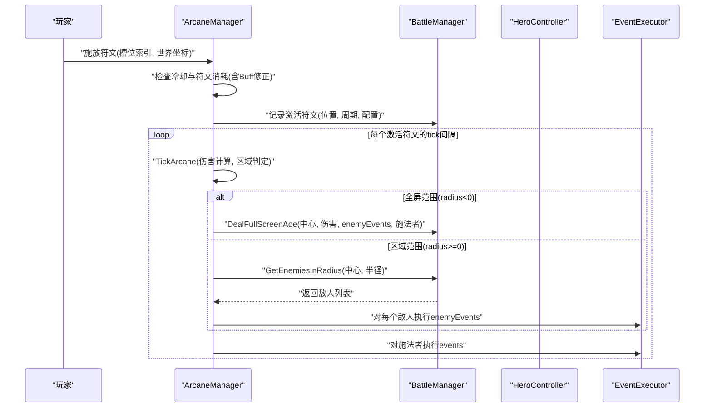
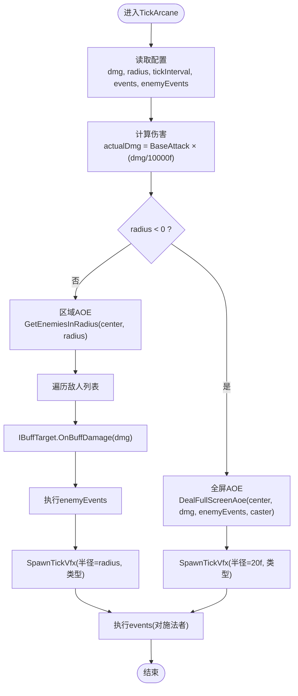
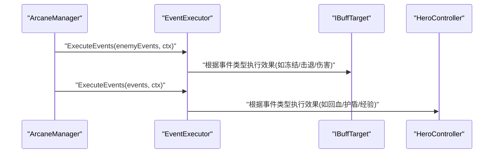
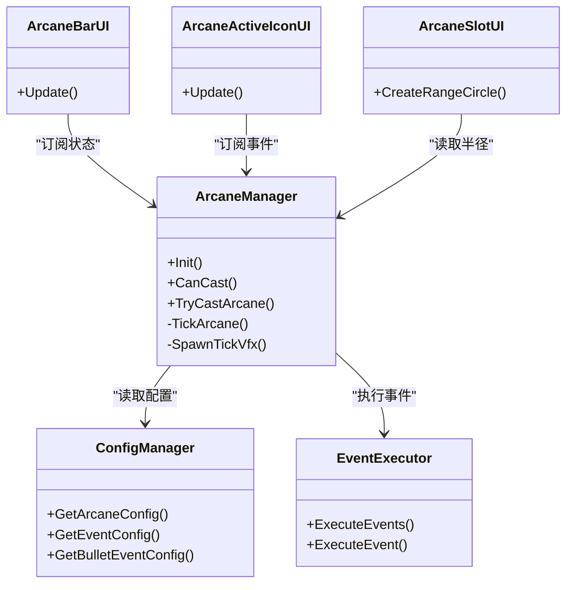

# 符文效果系统

<cite>
**本文引用的文件**
- [ArcaneManager.cs](file://Assets/Scripts/Battle/ArcaneManager.cs)
- [arcane_config.json](file://Assets/Resources/Configs/arcane_config.json)
- [event_config.json](file://Assets/Resources/Configs/event_config.json)
- [bullet_event_config.json](file://Assets/Resources/Configs/bullet_event_config.json)
- [EventExecutor.cs](file://Assets/Scripts/Battle/EventExecutor.cs)
- [BulletEventExecutor.cs](file://Assets/Scripts/Battle/BulletEventExecutor.cs)
- [ArcaneBarUI.cs](file://Assets/Scripts/UI/ArcaneBarUI.cs)
- [ArcaneActiveIconUI.cs](file://Assets/Scripts/UI/ArcaneActiveIconUI.cs)
- [ArcaneSlotUI.cs](file://Assets/Scripts/UI/ArcaneSlotUI.cs)
- [ConfigManager.cs](file://Assets/Scripts/Core/ConfigManager.cs)
- [BuffSystem.cs](file://Assets/Scripts/Battle/BuffSystem.cs)
</cite>

## 目录
1. [简介](#简介)
2. [项目结构](#项目结构)
3. [核心组件](#核心组件)
4. [架构总览](#架构总览)
5. [详细组件分析](#详细组件分析)
6. [依赖关系分析](#依赖关系分析)
7. [性能考量](#性能考量)
8. [故障排查指南](#故障排查指南)
9. [结论](#结论)
10. [附录](#附录)

## 简介
本文件面向GeometryTD的符文效果系统，围绕“符文激活后效果”的实现机制进行深入技术解析，重点涵盖以下主题：
- TickArcane方法的完整流程与伤害计算逻辑
- 四种符文类型（火焰、冰霜、闪电、风）的特殊效果与视觉表现
- 全屏范围攻击与区域范围攻击的区别及radius参数语义
- 符文事件系统：enemyEvents对敌人的影响与events对英雄自身的效果
- 伤害计算公式：hero.BaseAttack与config.dmg的比例关系与实际伤害的精确计算
- 平衡性分析：伤害输出、范围覆盖与持续时间的权衡
- 配置示例与调试方法：如何测试与验证符文效果的正确性

## 项目结构
与符文系统直接相关的核心代码与资源分布如下：
- 战斗层：ArcaneManager负责符文槽位、能量/符文管理、施放判定、主动符文的周期触发与伤害结算
- 配置层：ConfigManager统一加载arcane_config.json等配置；事件系统通过event_config.json与bullet_event_config.json驱动效果
- UI层：ArcaneBarUI、ArcaneActiveIconUI、ArcaneSlotUI展示符文槽位状态、激活符文倒计时与范围预览
- 事件执行：EventExecutor根据事件ID执行具体效果；BulletEventExecutor解析子弹事件数据

**图表来源**
- [ArcaneManager.cs:23-296](file://Assets/Scripts/Battle/ArcaneManager.cs#L23-L296)
- [ConfigManager.cs:77-122](file://Assets/Scripts/Core/ConfigManager.cs#L77-L122)
- [EventExecutor.cs:13-63](file://Assets/Scripts/Battle/EventExecutor.cs#L13-L63)
- [BulletEventExecutor.cs:6-95](file://Assets/Scripts/Battle/BulletEventExecutor.cs#L6-L95)
- [ArcaneBarUI.cs:5-29](file://Assets/Scripts/UI/ArcaneBarUI.cs#L5-L29)
- [ArcaneActiveIconUI.cs:7-112](file://Assets/Scripts/UI/ArcaneActiveIconUI.cs#L7-L112)
- [ArcaneSlotUI.cs:193-230](file://Assets/Scripts/UI/ArcaneSlotUI.cs#L193-L230)

**章节来源**
- [ArcaneManager.cs:23-296](file://Assets/Scripts/Battle/ArcaneManager.cs#L23-L296)
- [ConfigManager.cs:77-122](file://Assets/Scripts/Core/ConfigManager.cs#L77-L122)

## 核心组件
- ArcaneManager：维护符文槽位、能量/符文转换、施放判定、冷却、主动符文周期触发与伤害结算
- EventExecutor：根据事件ID执行伤害、护盾、击退、经验、能量、增益、召唤、驱散等效果
- BulletEventExecutor：解析子弹事件（穿透、爆炸、追踪、散射、弹射、齐射、连射等）并生成数据
- ConfigManager：集中加载与缓存各类配置（含arcane_config.json）
- UI组件：ArcaneBarUI、ArcaneActiveIconUI、ArcaneSlotUI用于展示符文槽位、激活符文倒计时与范围预览

**章节来源**
- [ArcaneManager.cs:23-296](file://Assets/Scripts/Battle/ArcaneManager.cs#L23-L296)
- [EventExecutor.cs:13-196](file://Assets/Scripts/Battle/EventExecutor.cs#L13-L196)
- [BulletEventExecutor.cs:6-98](file://Assets/Scripts/Battle/BulletEventExecutor.cs#L6-L98)
- [ConfigManager.cs:77-122](file://Assets/Scripts/Core/ConfigManager.cs#L77-L122)
- [ArcaneBarUI.cs:5-29](file://Assets/Scripts/UI/ArcaneBarUI.cs#L5-L29)
- [ArcaneActiveIconUI.cs:7-112](file://Assets/Scripts/UI/ArcaneActiveIconUI.cs#L7-L112)
- [ArcaneSlotUI.cs:193-230](file://Assets/Scripts/UI/ArcaneSlotUI.cs#L193-L230)

## 架构总览
下图展示了从符文施放到周期伤害、事件执行与视觉反馈的关键交互：

**图表来源**
- [ArcaneManager.cs:135-256](file://Assets/Scripts/Battle/ArcaneManager.cs#L135-L256)
- [EventExecutor.cs:15-63](file://Assets/Scripts/Battle/EventExecutor.cs#L15-L63)

**章节来源**
- [ArcaneManager.cs:135-256](file://Assets/Scripts/Battle/ArcaneManager.cs#L135-L256)
- [EventExecutor.cs:15-63](file://Assets/Scripts/Battle/EventExecutor.cs#L15-L63)

## 详细组件分析

### TickArcane方法与伤害计算
- 伤害基础值：actualDmg = hero.BaseAttack × (config.dmg / 10000f)
- 区域判定：若config.radius < 0，则为全屏范围；否则为以激活位置为中心的圆形范围
- 全屏范围：调用BattleManager.DealFullScreenAoe，对所有敌人造成伤害，并执行enemyEvents
- 区域范围：调用BattleManager.GetEnemiesInRadius获取敌人列表，逐个对IBuffTarget执行OnBuffDamage与enemyEvents
- 自身事件：无论是否全屏，均会基于events对施法者(hero)执行EventExecutor.ExecuteEvents

**图表来源**
- [ArcaneManager.cs:198-256](file://Assets/Scripts/Battle/ArcaneManager.cs#L198-L256)
- [ArcaneManager.cs:258-295](file://Assets/Scripts/Battle/ArcaneManager.cs#L258-L295)

**章节来源**
- [ArcaneManager.cs:198-256](file://Assets/Scripts/Battle/ArcaneManager.cs#L198-L256)
- [ArcaneManager.cs:258-295](file://Assets/Scripts/Battle/ArcaneManager.cs#L258-L295)

### 四种符文类型的特殊效果与视觉表现
- 火焰(fire, dmgType=1)：伤害高，视觉为橙红色
- 冰霜(ice, dmgType=2)：可附加冻结效果，视觉为蓝色
- 闪电(electric, dmgType=3)：可附加弹射效果，视觉为黄绿色
- 风(wind, dmgType=4)：全屏范围，视觉为青绿色

视觉反馈由SpawnTickVfx按dmgType生成彩色圆盘纹理并在0.5秒内销毁。

**章节来源**
- [ArcaneManager.cs:258-295](file://Assets/Scripts/Battle/ArcaneManager.cs#L258-L295)
- [arcane_config.json:2-5](file://Assets/Resources/Configs/arcane_config.json#L2-L5)

### 全屏范围攻击与区域范围攻击
- 区域范围：config.radius ≥ 0，使用GetEnemiesInRadius(center, radius)获取敌人并逐个造成伤害与执行enemyEvents
- 全屏范围：config.radius < 0，使用DealFullScreenAoe对所有敌人造成伤害，并执行enemyEvents
- 视觉差异：全屏模式使用较大半径(20f)绘制VFX，区域模式使用实际半径

**章节来源**
- [ArcaneManager.cs:204-242](file://Assets/Scripts/Battle/ArcaneManager.cs#L204-L242)

### 符文事件系统：enemyEvents与events
- enemyEvents：对命中的敌人生效，例如冰霜术的冻结、风之诗的击退
- events：对施法者自身生效，例如某些符文可能为施法者提供增益或能量
- 事件执行：EventExecutor根据事件ID分派到对应处理器（伤害、护盾、击退、经验、能量、增益、召唤、驱散等）

**图表来源**
- [ArcaneManager.cs:227-255](file://Assets/Scripts/Battle/ArcaneManager.cs#L227-L255)
- [EventExecutor.cs:22-63](file://Assets/Scripts/Battle/EventExecutor.cs#L22-L63)

**章节来源**
- [ArcaneManager.cs:227-255](file://Assets/Scripts/Battle/ArcaneManager.cs#L227-L255)
- [EventExecutor.cs:22-63](file://Assets/Scripts/Battle/EventExecutor.cs#L22-L63)

### 伤害计算公式与实际伤害
- 基础伤害：actualDmg = hero.BaseAttack × (config.dmg / 10000f)
- 敌人承受伤害：IBuffTarget.OnBuffDamage(actualDmg)
- 自身回血：当事件参数中dmgRate为负值时，按BaseAttack比例回血
- 击退距离：Knockback事件按事件参数除以10000换算为单位距离

**章节来源**
- [ArcaneManager.cs:203-203](file://Assets/Scripts/Battle/ArcaneManager.cs#L203-L203)
- [EventExecutor.cs:65-93](file://Assets/Scripts/Battle/EventExecutor.cs#L65-L93)
- [EventExecutor.cs:102-114](file://Assets/Scripts/Battle/EventExecutor.cs#L102-L114)

### 子弹事件与弹射/散射/齐射
- 弹射：Bounce系列事件支持弹射次数、弹射半径、最小距离与伤害衰减参数
- 散射：Scatter系列事件支持散射数量与角度偏转
- 齐射：Volley系列事件支持同时攻击多个目标
- 连射：Burst系列事件支持连续发射
- 追踪：Tracking事件使子弹追踪目标

这些事件通过BulletEventExecutor解析为BulletEventData供子弹系统使用。

**章节来源**
- [bullet_event_config.json:1-37](file://Assets/Resources/Configs/bullet_event_config.json#L1-L37)
- [BulletEventExecutor.cs:8-95](file://Assets/Scripts/Battle/BulletEventExecutor.cs#L8-L95)

### UI与范围可视化
- ArcaneBarUI：同步符文槽位状态
- ArcaneActiveIconUI：显示激活符文的剩余tick时间
- ArcaneSlotUI：在鼠标悬停时绘制范围圈（仅当半径>0时）

**章节来源**
- [ArcaneBarUI.cs:18-27](file://Assets/Scripts/UI/ArcaneBarUI.cs#L18-L27)
- [ArcaneActiveIconUI.cs:89-110](file://Assets/Scripts/UI/ArcaneActiveIconUI.cs#L89-L110)
- [ArcaneSlotUI.cs:193-230](file://Assets/Scripts/UI/ArcaneSlotUI.cs#L193-L230)

## 依赖关系分析
- ArcaneManager依赖：
  - ConfigManager：获取ArcaneConfig
  - BattleManager：AOE查询与全屏伤害接口
  - HeroController：BaseAttack与BuffSystem
  - EventExecutor：执行enemyEvents与events
- EventExecutor依赖：
  - ConfigManager：获取EventConfig
  - DamageCalculator：计算伤害（间接）
- UI组件依赖ArcaneManager的状态与事件回调

**图表来源**
- [ArcaneManager.cs:39-56](file://Assets/Scripts/Battle/ArcaneManager.cs#L39-L56)
- [ConfigManager.cs:77-122](file://Assets/Scripts/Core/ConfigManager.cs#L77-L122)
- [EventExecutor.cs:15-20](file://Assets/Scripts/Battle/EventExecutor.cs#L15-L20)
- [ArcaneBarUI.cs:18-27](file://Assets/Scripts/UI/ArcaneBarUI.cs#L18-L27)
- [ArcaneActiveIconUI.cs:27-30](file://Assets/Scripts/UI/ArcaneActiveIconUI.cs#L27-L30)
- [ArcaneSlotUI.cs:193-230](file://Assets/Scripts/UI/ArcaneSlotUI.cs#L193-L230)

**章节来源**
- [ArcaneManager.cs:39-56](file://Assets/Scripts/Battle/ArcaneManager.cs#L39-L56)
- [ConfigManager.cs:77-122](file://Assets/Scripts/Core/ConfigManager.cs#L77-L122)
- [EventExecutor.cs:15-20](file://Assets/Scripts/Battle/EventExecutor.cs#L15-L20)
- [ArcaneBarUI.cs:18-27](file://Assets/Scripts/UI/ArcaneBarUI.cs#L18-L27)
- [ArcaneActiveIconUI.cs:27-30](file://Assets/Scripts/UI/ArcaneActiveIconUI.cs#L27-L30)
- [ArcaneSlotUI.cs:193-230](file://Assets/Scripts/UI/ArcaneSlotUI.cs#L193-L230)

## 性能考量
- Tick频率控制：activeArcanes按各自tickInterval更新，避免每帧遍历所有敌人
- 区域查询优化：GetEnemiesInRadius应基于空间分区或碰撞检测快速筛选
- 事件执行批量化：同一帧内对同一批目标执行的事件尽量合并处理
- VFX生命周期：SpawnTickVfx在0.5秒后销毁，避免长期持有对象
- 能量转换：AddEnergyToType循环进位，注意符文上限与溢出处理

[本节为通用性能建议，不直接分析具体文件]

## 故障排查指南
- 施放失败
  - 检查冷却：slots[i].cooldownRemaining是否大于0
  - 检查符文消耗：GetModifiedCost是否超过当前符文数量
  - 参考路径：[ArcaneManager.cs:119-133](file://Assets/Scripts/Battle/ArcaneManager.cs#L119-L133)
- 伤害未生效
  - 确认IBuffTarget存在且可接收伤害
  - 检查actualDmg是否为正数
  - 参考路径：[ArcaneManager.cs:203-242](file://Assets/Scripts/Battle/ArcaneManager.cs#L203-L242)
- 事件未触发
  - 确认eventIds非空且在event_config.json中存在
  - 检查EventExecutor的事件类型分支
  - 参考路径：[EventExecutor.cs:15-63](file://Assets/Scripts/Battle/EventExecutor.cs#L15-L63)
- 全屏/区域判定异常
  - 检查config.radius是否为负数
  - 参考路径：[ArcaneManager.cs:204-211](file://Assets/Scripts/Battle/ArcaneManager.cs#L204-L211)
- 视觉反馈缺失
  - 确认SpawnTickVfx被调用且GameObject在0.5秒后销毁
  - 参考路径：[ArcaneManager.cs:258-295](file://Assets/Scripts/Battle/ArcaneManager.cs#L258-L295)

**章节来源**
- [ArcaneManager.cs:119-133](file://Assets/Scripts/Battle/ArcaneManager.cs#L119-L133)
- [ArcaneManager.cs:203-242](file://Assets/Scripts/Battle/ArcaneManager.cs#L203-L242)
- [EventExecutor.cs:15-63](file://Assets/Scripts/Battle/EventExecutor.cs#L15-L63)
- [ArcaneManager.cs:258-295](file://Assets/Scripts/Battle/ArcaneManager.cs#L258-L295)

## 结论
符文效果系统通过ArcaneManager统一调度，结合ConfigManager提供的配置与EventExecutor的事件执行，实现了灵活而强大的范围伤害与附加效果机制。全屏与区域两种模式通过radius参数区分，伤害计算以BaseAttack为基础并按配置比例缩放，配合enemyEvents与events形成对敌人与自身的双重影响。通过合理的配置与事件组合，可在伤害输出、范围覆盖与持续时间之间取得良好平衡。

[本节为总结性内容，不直接分析具体文件]

## 附录

### 配置示例与字段说明
- arcane_config.json关键字段
  - id：符文ID
  - name/desList/icon：名称、描述、图标
  - dmg：伤害比例基数（与10000组合决定实际伤害）
  - dmgType：伤害类型（1=火, 2=冰, 3=电, 4=风）
  - radius：范围半径；radius<0表示全屏
  - tickInterval：周期间隔
  - cd：冷却时间
  - runeCost/runeType：消耗符文数量与类型
  - events/enemyEvents/bulletEvents：对施法者/敌人/子弹的事件列表

参考路径：
- [arcane_config.json:1-6](file://Assets/Resources/Configs/arcane_config.json#L1-L6)

**章节来源**
- [arcane_config.json:1-6](file://Assets/Resources/Configs/arcane_config.json#L1-L6)

### 伤害计算与平衡性建议
- 基础伤害：actualDmg = BaseAttack × (dmg / 10000f)
- 平衡性权衡
  - 伤害输出：通过dmg与tickInterval共同控制
  - 范围覆盖：radius越大伤害越分散，全屏适合清场
  - 持续时间：tickInterval越短，总伤害越高但更易被规避
  - 成本：runeCost与BuffSystem的消耗修正需与收益匹配

参考路径：
- [ArcaneManager.cs:203-203](file://Assets/Scripts/Battle/ArcaneManager.cs#L203-L203)
- [BuffSystem.cs:285-303](file://Assets/Scripts/Battle/BuffSystem.cs#L285-L303)

**章节来源**
- [ArcaneManager.cs:203-203](file://Assets/Scripts/Battle/ArcaneManager.cs#L203-L203)
- [BuffSystem.cs:285-303](file://Assets/Scripts/Battle/BuffSystem.cs#L285-L303)

### 调试方法与验证步骤
- 施放验证
  - 使用ArcaneBarUI确认槽位状态与冷却
  - 使用ArcaneActiveIconUI观察剩余tick时间
  - 参考路径：[ArcaneBarUI.cs:18-27](file://Assets/Scripts/UI/ArcaneBarUI.cs#L18-L27)，[ArcaneActiveIconUI.cs:89-110](file://Assets/Scripts/UI/ArcaneActiveIconUI.cs#L89-L110)
- 伤害验证
  - 在TickArcane中断点，检查actualDmg与敌人列表
  - 参考路径：[ArcaneManager.cs:198-256](file://Assets/Scripts/Battle/ArcaneManager.cs#L198-L256)
- 事件验证
  - 在EventExecutor中断点，确认事件ID与类型分支
  - 参考路径：[EventExecutor.cs:22-63](file://Assets/Scripts/Battle/EventExecutor.cs#L22-L63)
- 范围可视化
  - 悬停ArcaneSlotUI查看范围圈
  - 参考路径：[ArcaneSlotUI.cs:193-230](file://Assets/Scripts/UI/ArcaneSlotUI.cs#L193-L230)

**章节来源**
- [ArcaneBarUI.cs:18-27](file://Assets/Scripts/UI/ArcaneBarUI.cs#L18-L27)
- [ArcaneActiveIconUI.cs:89-110](file://Assets/Scripts/UI/ArcaneActiveIconUI.cs#L89-L110)
- [ArcaneManager.cs:198-256](file://Assets/Scripts/Battle/ArcaneManager.cs#L198-L256)
- [EventExecutor.cs:22-63](file://Assets/Scripts/Battle/EventExecutor.cs#L22-L63)
- [ArcaneSlotUI.cs:193-230](file://Assets/Scripts/UI/ArcaneSlotUI.cs#L193-L230)