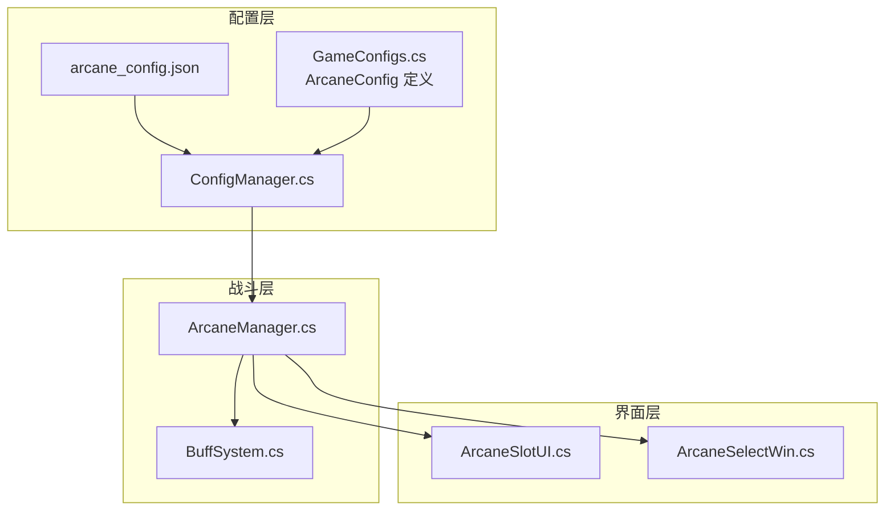
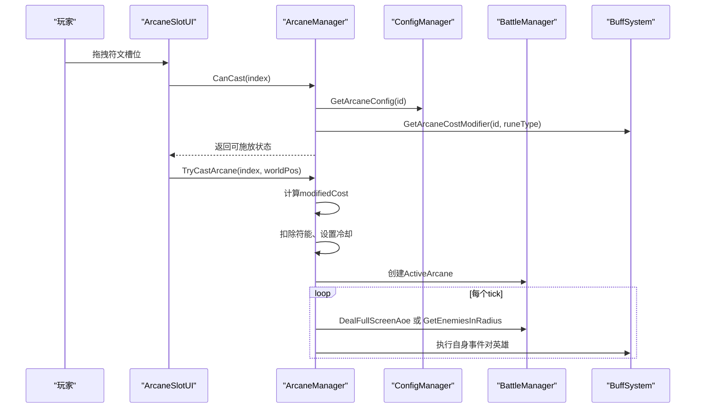
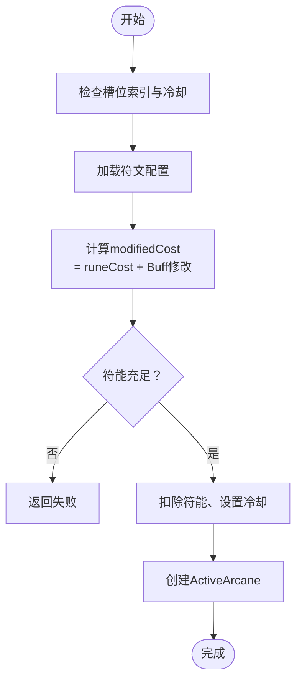
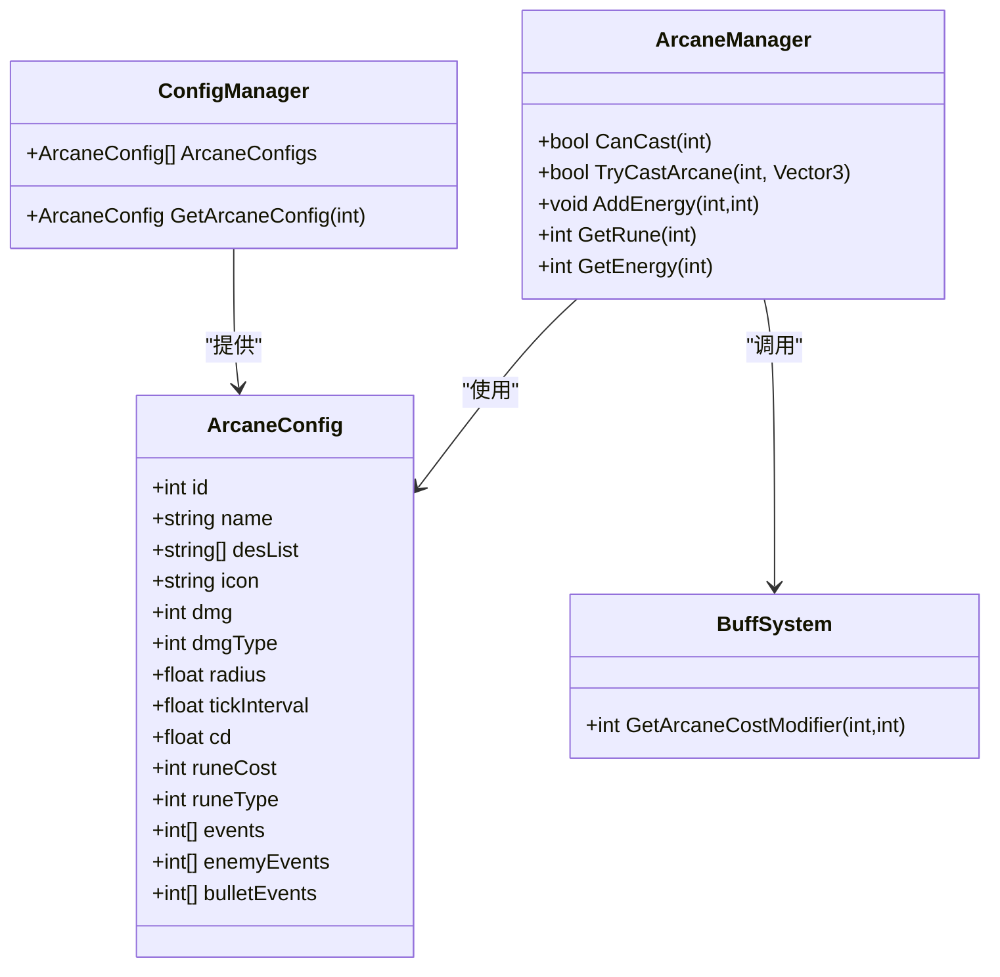

# 符文配置系统

<cite>
**本文档引用的文件**
- [arcane_config.json](file://Assets/Resources/Configs/arcane_config.json)
- [ArcaneManager.cs](file://Assets/Scripts/Battle/ArcaneManager.cs)
- [ArcaneSlotUI.cs](file://Assets/Scripts/UI/ArcaneSlotUI.cs)
- [ArcaneSelectWin.cs](file://Assets/Scripts/UI/ArcaneSelectWin.cs)
- [ConfigManager.cs](file://Assets/Scripts/Core/ConfigManager.cs)
- [GameConfigs.cs](file://Assets/Scripts/Data/GameConfigs.cs)
- [BuffSystem.cs](file://Assets/Scripts/Battle/BuffSystem.cs)
</cite>

## 目录
1. [简介](#简介)
2. [项目结构](#项目结构)
3. [核心组件](#核心组件)
4. [架构总览](#架构总览)
5. [详细组件分析](#详细组件分析)
6. [依赖关系分析](#依赖关系分析)
7. [性能考量](#性能考量)
8. [故障排查指南](#故障排查指南)
9. [结论](#结论)
10. [附录](#附录)

## 简介
本文件面向GeometryTD的符文配置系统，围绕arcane_config.json配置文件与运行时系统进行技术文档化说明。内容涵盖：
- arcane_config.json的结构与字段定义
- 符文效果配置项的含义与作用
- 符文组合/叠加效果的配置机制
- 符文成本修改器的成本计算流程
- 最佳实践与扩展指南

## 项目结构
与符文系统相关的资源与代码主要分布在以下位置：
- 配置资源：Assets/Resources/Configs/arcane_config.json
- 核心管理：Assets/Scripts/Battle/ArcaneManager.cs
- UI交互：Assets/Scripts/UI/ArcaneSlotUI.cs、Assets/Scripts/UI/ArcaneSelectWin.cs
- 配置加载：Assets/Scripts/Core/ConfigManager.cs
- 数据模型：Assets/Scripts/Data/GameConfigs.cs
- 英雄Buff系统：Assets/Scripts/Battle/BuffSystem.cs

图表来源
- [arcane_config.json](file://Assets/Resources/Configs/arcane_config.json)
- [ConfigManager.cs](file://Assets/Scripts/Core/ConfigManager.cs)
- [GameConfigs.cs](file://Assets/Scripts/Data/GameConfigs.cs)
- [ArcaneManager.cs](file://Assets/Scripts/Battle/ArcaneManager.cs)
- [ArcaneSlotUI.cs](file://Assets/Scripts/UI/ArcaneSlotUI.cs)
- [ArcaneSelectWin.cs](file://Assets/Scripts/UI/ArcaneSelectWin.cs)
- [BuffSystem.cs](file://Assets/Scripts/Battle/BuffSystem.cs)

章节来源
- [arcane_config.json](file://Assets/Resources/Configs/arcane_config.json)
- [ConfigManager.cs](file://Assets/Scripts/Core/ConfigManager.cs)
- [GameConfigs.cs](file://Assets/Scripts/Data/GameConfigs.cs)

## 核心组件
- 配置模型：ArcaneConfig（定义符文的基础属性与效果）
- 配置加载：ConfigManager（从JSON加载并缓存ArcaneConfig）
- 管理器：ArcaneManager（符文槽位、符能、冷却、施放与伤害计算）
- UI：ArcaneSlotUI（拖拽施放、范围预览、提示信息）
- Buff系统：BuffSystem（提供符文消耗修改器）

章节来源
- [GameConfigs.cs](file://Assets/Scripts/Data/GameConfigs.cs)
- [ConfigManager.cs](file://Assets/Scripts/Core/ConfigManager.cs)
- [ArcaneManager.cs](file://Assets/Scripts/Battle/ArcaneManager.cs)
- [ArcaneSlotUI.cs](file://Assets/Scripts/UI/ArcaneSlotUI.cs)
- [BuffSystem.cs](file://Assets/Scripts/Battle/BuffSystem.cs)

## 架构总览
运行时流程概览：
- 启动时ConfigManager加载arcane_config.json，构建ArcaneConfig字典
- ArcaneManager初始化槽位，读取配置并维护符能与冷却
- 玩家通过ArcaneSlotUI拖拽符文到地面施放
- ArcaneManager计算消耗（含Buff修改），扣除符能并进入冷却
- 每个tick按配置对范围内敌人造成伤害，并执行事件

图表来源
- [ArcaneSlotUI.cs](file://Assets/Scripts/UI/ArcaneSlotUI.cs)
- [ArcaneManager.cs](file://Assets/Scripts/Battle/ArcaneManager.cs)
- [ConfigManager.cs](file://Assets/Scripts/Core/ConfigManager.cs)
- [BuffSystem.cs](file://Assets/Scripts/Battle/BuffSystem.cs)

## 详细组件分析

### arcane_config.json 配置文件结构与字段定义
- 文件路径：Assets/Resources/Configs/arcane_config.json
- 结构要点：
  - arcanes 数组：包含多个符文配置对象
  - 每个符文对象包含：
    - id：符文唯一标识
    - name：符文名称
    - desList：描述列表（用于UI提示）
    - icon：图标资源路径
    - dmg：伤害百分比基数（与英雄基础攻击按万分比换算）
    - dmgType：伤害类型（1=火, 2=冰, 3=电, 4=风）
    - radius：范围半径；当为负值时表示全屏AOE
    - tickInterval：tick间隔（秒）
    - cd：冷却时间（秒）
    - runeCost：基础符能消耗
    - runeType：符能类型（1=火, 2=冰, 3=电, 4=风）
    - events：对施法者自身的事件ID数组
    - enemyEvents：对敌人的事件ID数组
    - bulletEvents：对子弹的事件ID数组

章节来源
- [arcane_config.json](file://Assets/Resources/Configs/arcane_config.json)
- [GameConfigs.cs](file://Assets/Scripts/Data/GameConfigs.cs)

### ArcaneConfig 数据模型
- 定义位置：GameConfigs.cs 中的 ArcaneConfig 类
- 字段与含义：
  - id、name、desList、icon：基础显示信息
  - dmg、dmgType：伤害计算参数
  - radius：范围或全屏标志
  - tickInterval：伤害tick间隔
  - cd：冷却
  - runeCost、runeType：消耗与类型
  - events/enemyEvents/bulletEvents：事件数组

章节来源
- [GameConfigs.cs](file://Assets/Scripts/Data/GameConfigs.cs)

### ConfigManager 的配置加载与查询
- 负责从Resources加载arcane_config.json并构建ArcaneConfig字典
- 提供GetArcaneConfig(id)查询接口

章节来源
- [ConfigManager.cs](file://Assets/Scripts/Core/ConfigManager.cs)

### ArcaneManager 的运行时逻辑
- 管理符文槽位、符能与冷却
- 能量收集与符能转换（每10点能量=1符能）
- 施放判定与消耗（含Buff修改）
- Tick处理：按配置对范围内敌人造成伤害，执行事件
- VFX生成：按伤害类型生成可视化圆圈效果

关键流程图（施放判定与消耗）

图表来源
- [ArcaneManager.cs](file://Assets/Scripts/Battle/ArcaneManager.cs)
- [BuffSystem.cs](file://Assets/Scripts/Battle/BuffSystem.cs)

章节来源
- [ArcaneManager.cs](file://Assets/Scripts/Battle/ArcaneManager.cs)

### ArcaneSlotUI 的交互与可视化
- 拖拽施放：支持从槽位拖出到地面施放
- 范围预览：拖拽时显示圆形范围
- 冷却遮罩与倒计时：显示冷却进度
- 成本颜色提示：当前符能是否足够
- 提示窗口：显示名称、描述、消耗、冷却等信息

章节来源
- [ArcaneSlotUI.cs](file://Assets/Scripts/UI/ArcaneSlotUI.cs)

### BuffSystem 的符文消耗修改器
- GetArcaneCostModifier(arcaneId, runeType)会遍历所有Buff的specialEvent
- 匹配类型为ArcaneCostMod的特殊事件
- 参数约定：args[0]=符文ID(-1表示全部), args[1]=符能类型(-1表示全部), args[2]=消耗变化值
- 返回值为所有匹配Buff的累计修改值（可正可负）

章节来源
- [BuffSystem.cs](file://Assets/Scripts/Battle/BuffSystem.cs)

### 符文效果配置详解
- 伤害百分比 dmg：与英雄基础攻击按万分比换算，实际伤害=基础攻击×(dmg/10000)
- 范围 radius：>0为圆形范围，<0为全屏AOE
- tick间隔 tickInterval：每tick触发一次伤害与事件
- 伤害类型 dmgType：决定伤害特效颜色与可能的抗性/加成属性映射

章节来源
- [ArcaneManager.cs](file://Assets/Scripts/Battle/ArcaneManager.cs)
- [GameConfigs.cs](file://Assets/Scripts/Data/GameConfigs.cs)

### 符文组合效果的配置机制
- 通过Buff的specialEvent配置实现“符文组合”效果
- ArcaneCostMod：修改特定符文或全部符文的消耗
- 其他Buff事件：可对符文施加额外效果（如对英雄自身事件）
- 事件数组（events/enemyEvents/bulletEvents）：在施法者、敌人或子弹上附加效果

章节来源
- [BuffSystem.cs](file://Assets/Scripts/Battle/BuffSystem.cs)
- [ArcaneManager.cs](file://Assets/Scripts/Battle/ArcaneManager.cs)

### 符文成本修改器实现原理
- ArcaneManager.GetModifiedCost先取配置的runeCost
- 调用BuffSystem.GetArcaneCostModifier得到修改值
- 最终消耗=MAX(0, runeCost + 修改值)，避免负消耗

章节来源
- [ArcaneManager.cs](file://Assets/Scripts/Battle/ArcaneManager.cs)
- [BuffSystem.cs](file://Assets/Scripts/Battle/BuffSystem.cs)

### UI与配置联动
- ArcaneSelectWin列出所有可用符文，支持选择并保存到游戏管理器
- ArcaneSlotUI读取配置显示图标、描述、消耗与冷却
- 拖拽施放时根据配置radius显示范围预览

章节来源
- [ArcaneSelectWin.cs](file://Assets/Scripts/UI/ArcaneSelectWin.cs)
- [ArcaneSlotUI.cs](file://Assets/Scripts/UI/ArcaneSlotUI.cs)

## 依赖关系分析
- 配置层：arcane_config.json → ConfigManager → ArcaneManager
- 运行时：ArcaneManager ← BuffSystem（通过英雄Buff系统提供消耗修改）
- 界面层：ArcaneSlotUI/ArcaneSelectWin 依赖ConfigManager与ArcaneManager

图表来源
- [GameConfigs.cs](file://Assets/Scripts/Data/GameConfigs.cs)
- [ConfigManager.cs](file://Assets/Scripts/Core/ConfigManager.cs)
- [ArcaneManager.cs](file://Assets/Scripts/Battle/ArcaneManager.cs)
- [BuffSystem.cs](file://Assets/Scripts/Battle/BuffSystem.cs)

章节来源
- [GameConfigs.cs](file://Assets/Scripts/Data/GameConfigs.cs)
- [ConfigManager.cs](file://Assets/Scripts/Core/ConfigManager.cs)
- [ArcaneManager.cs](file://Assets/Scripts/Battle/ArcaneManager.cs)
- [BuffSystem.cs](file://Assets/Scripts/Battle/BuffSystem.cs)

## 性能考量
- 配置加载：ConfigManager一次性加载并缓存，避免重复IO
- 施放判定：O(1)查询配置与Buff修改，开销极低
- Tick处理：按ActiveArcane数量线性更新，注意合理设置tickInterval与半径
- VFX生成：每tick创建临时GameObject，生命周期短，注意销毁

[本节为通用性能建议，无需特定文件引用]

## 故障排查指南
- 施放失败
  - 检查符文槽位冷却是否归零
  - 检查当前符能是否满足modifiedCost
  - 检查Buff是否导致消耗异常（如负消耗被截断为0）
- 伤害异常
  - 检查dmg与dmgType是否正确
  - 检查半径是否为负导致全屏AOE
- UI显示问题
  - 检查配置中的icon路径是否存在
  - 检查desList是否为空

章节来源
- [ArcaneManager.cs](file://Assets/Scripts/Battle/ArcaneManager.cs)
- [ArcaneSlotUI.cs](file://Assets/Scripts/UI/ArcaneSlotUI.cs)

## 结论
符文配置系统以arcane_config.json为核心，结合ConfigManager与ArcaneManager实现完整的施放、消耗与伤害流程；通过BuffSystem的ArcaneCostMod实现符文组合与强化。该系统具备良好的扩展性，可通过新增符文配置与Buff事件实现复杂的游戏机制。

[本节为总结，无需特定文件引用]

## 附录

### 配置示例与扩展示例
- 新增符文步骤
  - 在arcane_config.json的arcanes数组中添加新对象，填写必要字段
  - 在ConfigManager加载后即可通过GetArcaneConfig(id)获取
  - 在ArcaneSlotUI/ArcaneSelectWin中即可显示与选择
- 修改现有符文
  - 直接调整现有对象的字段（如dmg、radius、tickInterval、cd、runeCost等）
  - 如需改变消耗，可在Buff中添加ArcaneCostMod事件
- 示例参考
  - 参考现有符文配置，保持字段一致与命名规范

章节来源
- [arcane_config.json](file://Assets/Resources/Configs/arcane_config.json)
- [ConfigManager.cs](file://Assets/Scripts/Core/ConfigManager.cs)
- [ArcaneSlotUI.cs](file://Assets/Scripts/UI/ArcaneSlotUI.cs)
- [ArcaneSelectWin.cs](file://Assets/Scripts/UI/ArcaneSelectWin.cs)

### 最佳实践
- 数值平衡性
  - dmg与runeCost应与符能类型相匹配，避免某类符文过于强势
  - radius与tickInterval共同决定伤害密度，需测试平衡
- 效果强度设计
  - 使用全屏AOE时谨慎设置半径与伤害，避免单次伤害过高
  - 通过事件(enemyEvents/bulletEvents)增加策略深度
- 性能优化
  - 控制ActiveArcane数量与tick频率
  - 合理使用全屏AOE，避免大范围频繁检测
  - UI提示与范围预览仅在拖拽时启用

[本节为通用建议，无需特定文件引用]