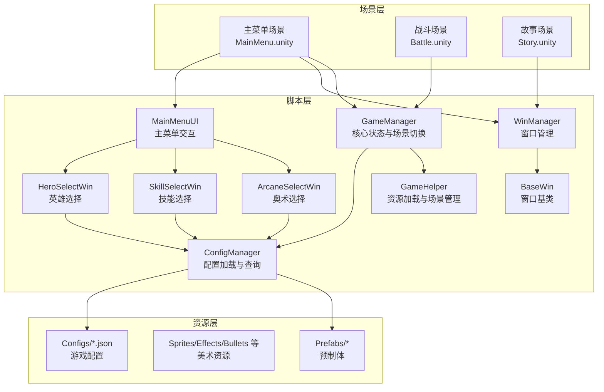
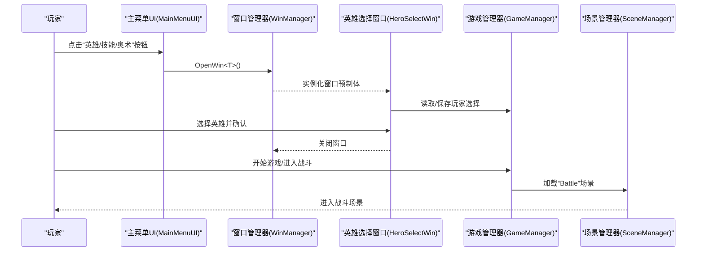
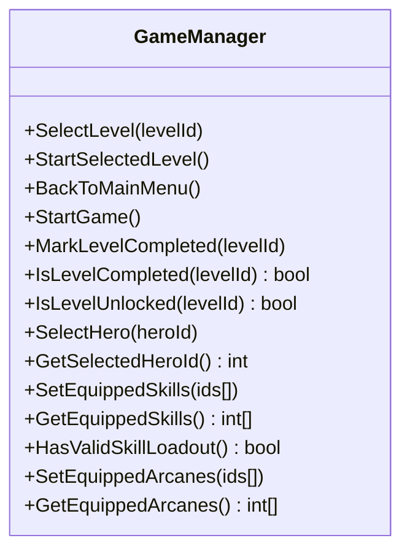
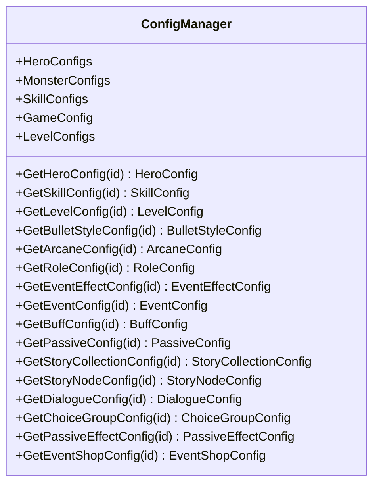
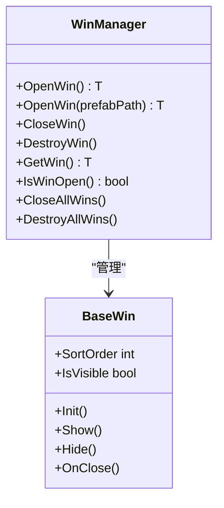
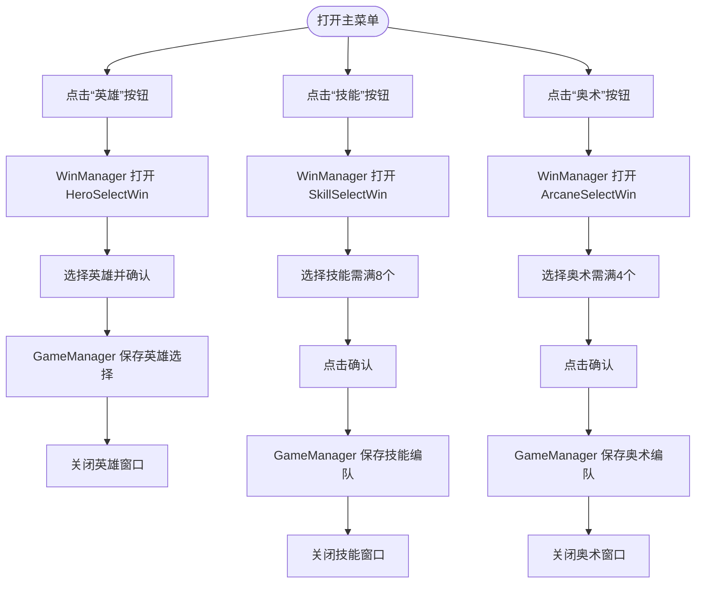
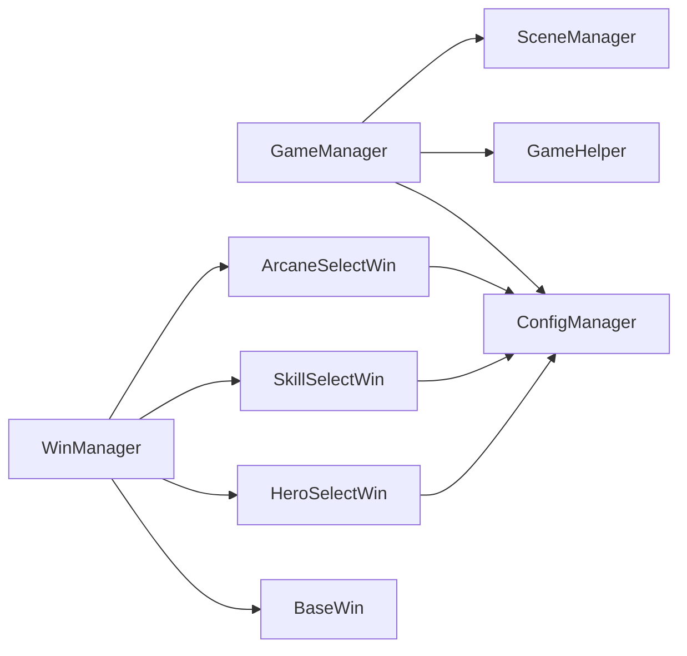

# 快速开始

<cite>
**本文引用的文件**
- [项目设置（ProjectSettings）](file://ProjectSettings/ProjectSettings.asset)
- [主菜单场景（MainMenu.unity）](file://Assets/Scenes/MainMenu.unity)
- [战斗场景（Battle.unity）](file://Assets/Scenes/Battle.unity)
- [故事场景（Story.unity）](file://Assets/Scenes/Story.unity)
- [游戏管理器（GameManager.cs）](file://Assets/Scripts/Core/GameManager.cs)
- [配置管理器（ConfigManager.cs）](file://Assets/Scripts/Core/ConfigManager.cs)
- [游戏助手（GameHelper.cs）](file://Assets/Scripts/Core/GameHelper.cs)
- [窗口基类（BaseWin.cs）](file://Assets/Scripts/UI/BaseWin.cs)
- [窗口管理器（WinManager.cs）](file://Assets/Scripts/UI/WinManager.cs)
- [主菜单UI（MainMenuUI.cs）](file://Assets/Scripts/UI/MainMenuUI.cs)
- [英雄选择窗口（HeroSelectWin.cs）](file://Assets/Scripts/UI/HeroSelectWin.cs)
- [技能选择窗口（SkillSelectWin.cs）](file://Assets/Scripts/UI/SkillSelectWin.cs)
- [奥术选择窗口（ArcaneSelectWin.cs）](file://Assets/Scripts/UI/ArcaneSelectWin.cs)
- [游戏配置（game_config.json）](file://Assets/Resources/Configs/game_config.json)
</cite>

## 目录
1. [简介](#简介)
2. [项目结构](#项目结构)
3. [核心组件](#核心组件)
4. [架构总览](#架构总览)
5. [详细组件分析](#详细组件分析)
6. [依赖关系分析](#依赖关系分析)
7. [性能考虑](#性能考虑)
8. [故障排除指南](#故障排除指南)
9. [结论](#结论)
10. [附录](#附录)

## 简介
本指南面向首次接触 GeometryTD 项目的开发者，目标是帮助你在最短时间内完成开发环境搭建、导入项目、运行第一个场景，并理解项目的核心架构与启动流程。你将学会：
- 如何准备 Unity 开发环境与必备工具
- 如何克隆仓库、打开 Unity 项目并进行基础配置
- 项目的目录结构与模块划分
- 从主菜单到游戏场景的启动流程
- 基础的“Hello World”式运行示例
- 常见问题排查与调试技巧

## 项目结构
GeometryTD 是一个基于 Unity 的塔防类游戏项目，采用分层清晰的 C# 脚本组织方式，主要分为以下模块：
- 场景层（Scenes）：包含主菜单、战斗、故事等场景
- 资源层（Resources）：包含配置文件、图标、背景、子弹、特效等资源
- 脚本层（Scripts）：按功能域划分为 Core（核心）、UI（界面）、Battle（战斗）
- 预制体层（Prefabs）：角色、背景、子弹、特效等预制体

图表来源
- [主菜单场景（MainMenu.unity）](file://Assets/Scenes/MainMenu.unity)
- [战斗场景（Battle.unity）](file://Assets/Scenes/Battle.unity)
- [故事场景（Story.unity）](file://Assets/Scenes/Story.unity)
- [游戏管理器（GameManager.cs）](file://Assets/Scripts/Core/GameManager.cs)
- [配置管理器（ConfigManager.cs）](file://Assets/Scripts/Core/ConfigManager.cs)
- [游戏助手（GameHelper.cs）](file://Assets/Scripts/Core/GameHelper.cs)
- [窗口基类（BaseWin.cs）](file://Assets/Scripts/UI/BaseWin.cs)
- [窗口管理器（WinManager.cs）](file://Assets/Scripts/UI/WinManager.cs)
- [主菜单UI（MainMenuUI.cs）](file://Assets/Scripts/UI/MainMenuUI.cs)
- [英雄选择窗口（HeroSelectWin.cs）](file://Assets/Scripts/UI/HeroSelectWin.cs)
- [技能选择窗口（SkillSelectWin.cs）](file://Assets/Scripts/UI/SkillSelectWin.cs)
- [奥术选择窗口（ArcaneSelectWin.cs）](file://Assets/Scripts/UI/ArcaneSelectWin.cs)
- [游戏配置（game_config.json）](file://Assets/Resources/Configs/game_config.json)

章节来源
- [主菜单场景（MainMenu.unity）](file://Assets/Scenes/MainMenu.unity)
- [战斗场景（Battle.unity）](file://Assets/Scenes/Battle.unity)
- [故事场景（Story.unity）](file://Assets/Scenes/Story.unity)
- [游戏管理器（GameManager.cs）](file://Assets/Scripts/Core/GameManager.cs)
- [配置管理器（ConfigManager.cs）](file://Assets/Scripts/Core/ConfigManager.cs)
- [游戏助手（GameHelper.cs）](file://Assets/Scripts/Core/GameHelper.cs)
- [窗口基类（BaseWin.cs）](file://Assets/Scripts/UI/BaseWin.cs)
- [窗口管理器（WinManager.cs）](file://Assets/Scripts/UI/WinManager.cs)
- [主菜单UI（MainMenuUI.cs）](file://Assets/Scripts/UI/MainMenuUI.cs)
- [英雄选择窗口（HeroSelectWin.cs）](file://Assets/Scripts/UI/HeroSelectWin.cs)
- [技能选择窗口（SkillSelectWin.cs）](file://Assets/Scripts/UI/SkillSelectWin.cs)
- [奥术选择窗口（ArcaneSelectWin.cs）](file://Assets/Scripts/UI/ArcaneSelectWin.cs)
- [游戏配置（game_config.json）](file://Assets/Resources/Configs/game_config.json)

## 核心组件
- 游戏管理器（GameManager）：负责全局状态（选关、英雄、技能、奥术、关卡完成状态）与场景切换
- 配置管理器（ConfigManager）：集中加载与缓存所有 JSON 配置，提供查询接口
- 窗口系统（BaseWin/WinManager）：统一的 UI 窗口生命周期与层级管理
- 主菜单交互（MainMenuUI）：触发英雄/技能/奥术选择窗口
- 资源助手（GameHelper）：封装资源与场景加载的通用逻辑

章节来源
- [游戏管理器（GameManager.cs）](file://Assets/Scripts/Core/GameManager.cs)
- [配置管理器（ConfigManager.cs）](file://Assets/Scripts/Core/ConfigManager.cs)
- [窗口基类（BaseWin.cs）](file://Assets/Scripts/UI/BaseWin.cs)
- [窗口管理器（WinManager.cs）](file://Assets/Scripts/UI/WinManager.cs)
- [主菜单UI（MainMenuUI.cs）](file://Assets/Scripts/UI/MainMenuUI.cs)
- [游戏助手（GameHelper.cs）](file://Assets/Scripts/Core/GameHelper.cs)

## 架构总览
从主菜单到战斗场景的典型流程如下：

图表来源
- [主菜单UI（MainMenuUI.cs）](file://Assets/Scripts/UI/MainMenuUI.cs)
- [窗口管理器（WinManager.cs）](file://Assets/Scripts/UI/WinManager.cs)
- [英雄选择窗口（HeroSelectWin.cs）](file://Assets/Scripts/UI/HeroSelectWin.cs)
- [游戏管理器（GameManager.cs）](file://Assets/Scripts/Core/GameManager.cs)
- [主菜单场景（MainMenu.unity）](file://Assets/Scenes/MainMenu.unity)
- [战斗场景（Battle.unity）](file://Assets/Scenes/Battle.unity)

章节来源
- [主菜单UI（MainMenuUI.cs）](file://Assets/Scripts/UI/MainMenuUI.cs)
- [窗口管理器（WinManager.cs）](file://Assets/Scripts/UI/WinManager.cs)
- [英雄选择窗口（HeroSelectWin.cs）](file://Assets/Scripts/UI/HeroSelectWin.cs)
- [游戏管理器（GameManager.cs）](file://Assets/Scripts/Core/GameManager.cs)
- [主菜单场景（MainMenu.unity）](file://Assets/Scenes/MainMenu.unity)
- [战斗场景（Battle.unity）](file://Assets/Scenes/Battle.unity)

## 详细组件分析

### 组件A：游戏管理器（GameManager）
- 职责
  - 单例持有全局状态（当前选关、英雄、技能、奥术、已完成关卡）
  - 提供场景切换入口（主菜单、战斗）
  - 提供关卡解锁判断与持久化存储
- 关键行为
  - 选关与开始：SelectLevel → StartSelectedLevel → 切换到 Battle
  - 返回主菜单：BackToMainMenu
  - 英雄/技能/奥术选择与持久化：SelectHero/SetEquippedSkills/SetEquippedArcanes
  - 关卡完成标记与解锁条件校验

图表来源
- [游戏管理器（GameManager.cs）](file://Assets/Scripts/Core/GameManager.cs)

章节来源
- [游戏管理器（GameManager.cs）](file://Assets/Scripts/Core/GameManager.cs)

### 组件B：配置管理器（ConfigManager）
- 职责
  - 加载并缓存所有 JSON 配置（英雄、怪物、技能、关卡、事件、属性等）
  - 提供查询接口（按 ID 获取配置、预加载预制体）
- 关键行为
  - 加载：Awake 中调用 LoadAllConfigs 并建立查找表
  - 查询：如 GetHeroConfig、GetSkillConfig、GetLevelConfig 等
  - 预加载：子弹/特效/角色预制体缓存，提升运行时性能

图表来源
- [配置管理器（ConfigManager.cs）](file://Assets/Scripts/Core/ConfigManager.cs)

章节来源
- [配置管理器（ConfigManager.cs）](file://Assets/Scripts/Core/ConfigManager.cs)
- [游戏配置（game_config.json）](file://Assets/Resources/Configs/game_config.json)

### 组件C：窗口系统（BaseWin/WinManager）
- 职责
  - BaseWin：定义窗口生命周期（Init/Show/Hide/OnClose）
  - WinManager：统一实例化、缓存、排序与遮挡处理，支持全屏遮罩与点击穿透控制
- 关键行为
  - OpenWin<T>/CloseWin<T>/DestroyWin<T>
  - 自动挂载 Canvas/CanvasScaler/GraphicRaycaster
  - 更新 sortingOrder 保证层级正确

图表来源
- [窗口基类（BaseWin.cs）](file://Assets/Scripts/UI/BaseWin.cs)
- [窗口管理器（WinManager.cs）](file://Assets/Scripts/UI/WinManager.cs)

章节来源
- [窗口基类（BaseWin.cs）](file://Assets/Scripts/UI/BaseWin.cs)
- [窗口管理器（WinManager.cs）](file://Assets/Scripts/UI/WinManager.cs)

### 组件D：主菜单与选择窗口
- 主菜单交互（MainMenuUI）
  - 触发英雄/技能/奥术选择窗口
- 英雄选择（HeroSelectWin）
  - 读取 ConfigManager 中的英雄列表，动态生成条目
  - 选择后通过 GameManager 保存并更新 UI
- 技能选择（SkillSelectWin）
  - 限制必须选择 8 个技能，支持确认与取消
- 奥术选择（ArcaneSelectWin）
  - 限制必须选择 4 个奥术，支持确认与取消

图表来源
- [主菜单UI（MainMenuUI.cs）](file://Assets/Scripts/UI/MainMenuUI.cs)
- [窗口管理器（WinManager.cs）](file://Assets/Scripts/UI/WinManager.cs)
- [英雄选择窗口（HeroSelectWin.cs）](file://Assets/Scripts/UI/HeroSelectWin.cs)
- [技能选择窗口（SkillSelectWin.cs）](file://Assets/Scripts/UI/SkillSelectWin.cs)
- [奥术选择窗口（ArcaneSelectWin.cs）](file://Assets/Scripts/UI/ArcaneSelectWin.cs)
- [游戏管理器（GameManager.cs）](file://Assets/Scripts/Core/GameManager.cs)

章节来源
- [主菜单UI（MainMenuUI.cs）](file://Assets/Scripts/UI/MainMenuUI.cs)
- [窗口管理器（WinManager.cs）](file://Assets/Scripts/UI/WinManager.cs)
- [英雄选择窗口（HeroSelectWin.cs）](file://Assets/Scripts/UI/HeroSelectWin.cs)
- [技能选择窗口（SkillSelectWin.cs）](file://Assets/Scripts/UI/SkillSelectWin.cs)
- [奥术选择窗口（ArcaneSelectWin.cs）](file://Assets/Scripts/UI/ArcaneSelectWin.cs)
- [游戏管理器（GameManager.cs）](file://Assets/Scripts/Core/GameManager.cs)

## 依赖关系分析
- GameManager 依赖 ConfigManager（读取默认英雄、技能槽位、关卡配置）
- UI 窗口依赖 WinManager（统一实例化与层级管理），HeroSelectWin/SkillSelectWin/ArcaneSelectWin 依赖 ConfigManager 查询数据
- GameHelper 提供资源与场景加载的通用封装，被 WinManager 与 ConfigManager 使用
- 场景层（Scenes）通过 UI 与核心脚本交互，最终由 GameManager 控制场景切换

图表来源
- [游戏管理器（GameManager.cs）](file://Assets/Scripts/Core/GameManager.cs)
- [配置管理器（ConfigManager.cs）](file://Assets/Scripts/Core/ConfigManager.cs)
- [游戏助手（GameHelper.cs）](file://Assets/Scripts/Core/GameHelper.cs)
- [窗口基类（BaseWin.cs）](file://Assets/Scripts/UI/BaseWin.cs)
- [窗口管理器（WinManager.cs）](file://Assets/Scripts/UI/WinManager.cs)
- [英雄选择窗口（HeroSelectWin.cs）](file://Assets/Scripts/UI/HeroSelectWin.cs)
- [技能选择窗口（SkillSelectWin.cs）](file://Assets/Scripts/UI/SkillSelectWin.cs)
- [奥术选择窗口（ArcaneSelectWin.cs）](file://Assets/Scripts/UI/ArcaneSelectWin.cs)

章节来源
- [游戏管理器（GameManager.cs）](file://Assets/Scripts/Core/GameManager.cs)
- [配置管理器（ConfigManager.cs）](file://Assets/Scripts/Core/ConfigManager.cs)
- [游戏助手（GameHelper.cs）](file://Assets/Scripts/Core/GameHelper.cs)
- [窗口基类（BaseWin.cs）](file://Assets/Scripts/UI/BaseWin.cs)
- [窗口管理器（WinManager.cs）](file://Assets/Scripts/UI/WinManager.cs)
- [英雄选择窗口（HeroSelectWin.cs）](file://Assets/Scripts/UI/HeroSelectWin.cs)
- [技能选择窗口（SkillSelectWin.cs）](file://Assets/Scripts/UI/SkillSelectWin.cs)
- [奥术选择窗口（ArcaneSelectWin.cs）](file://Assets/Scripts/UI/ArcaneSelectWin.cs)

## 性能考虑
- 预加载策略：ConfigManager 在启动时预加载子弹/特效/角色预制体，减少运行时资源请求开销
- 窗口层级：WinManager 为每个窗口独立 Canvas 并设置 sortingOrder，避免层级混乱导致的重绘
- 字体与资源：GameHelper 缓存字体，减少重复加载
- 场景切换：使用 Time.timeScale 归零/恢复与 SceneManager 切换，避免协程或动画残留影响

## 故障排除指南
- 找不到窗口预制体
  - 现象：日志报错“找不到窗口预制体”
  - 排查：确认 WinManager 打开的窗口路径是否正确；检查资源路径与命名一致性
  - 参考：[窗口管理器（WinManager.cs）](file://Assets/Scripts/UI/WinManager.cs)
- 预制体缺少组件
  - 现象：日志报错“预制体缺少组件”
  - 排查：确认窗口预制体上挂载了正确的窗口脚本（如 HeroSelectWin）
  - 参考：[窗口管理器（WinManager.cs）](file://Assets/Scripts/UI/WinManager.cs)
- 配置文件加载失败
  - 现象：日志报错“无法加载配置文件/配置文件解析失败”
  - 排查：确认 JSON 文件格式正确、路径无误；检查 Resources 下的文件是否打包
  - 参考：[配置管理器（ConfigManager.cs）](file://Assets/Scripts/Core/ConfigManager.cs)
- 场景切换异常
  - 现象：切换场景后 UI 或状态异常
  - 排查：确认 GameManager 的场景名与 Build Settings 中的场景名称一致；检查 Time.timeScale 是否被意外修改
  - 参考：[游戏管理器（GameManager.cs）](file://Assets/Scripts/Core/GameManager.cs)
- 英雄/技能/奥术未生效
  - 现象：选择后未保存或显示不正确
  - 排查：确认 GameManager 的持久化键值与读写逻辑；检查 UI 选择逻辑与回调
  - 参考：[游戏管理器（GameManager.cs）](file://Assets/Scripts/Core/GameManager.cs)，[英雄选择窗口（HeroSelectWin.cs）](file://Assets/Scripts/UI/HeroSelectWin.cs)，[技能选择窗口（SkillSelectWin.cs）](file://Assets/Scripts/UI/SkillSelectWin.cs)，[奥术选择窗口（ArcaneSelectWin.cs）](file://Assets/Scripts/UI/ArcaneSelectWin.cs)

章节来源
- [窗口管理器（WinManager.cs）](file://Assets/Scripts/UI/WinManager.cs)
- [配置管理器（ConfigManager.cs）](file://Assets/Scripts/Core/ConfigManager.cs)
- [游戏管理器（GameManager.cs）](file://Assets/Scripts/Core/GameManager.cs)
- [英雄选择窗口（HeroSelectWin.cs）](file://Assets/Scripts/UI/HeroSelectWin.cs)
- [技能选择窗口（SkillSelectWin.cs）](file://Assets/Scripts/UI/SkillSelectWin.cs)
- [奥术选择窗口（ArcaneSelectWin.cs）](file://Assets/Scripts/UI/ArcaneSelectWin.cs)

## 结论
通过本指南，你已经完成了 GeometryTD 项目的环境准备、项目导入与基础配置，理解了核心模块与启动流程，并掌握了常见问题的排查方法。建议在掌握上述内容后，进一步阅读各组件的详细实现，逐步扩展你的开发能力。

## 附录

### A. 开发环境与工具准备
- Unity 版本
  - 项目设置中包含 Unity 版本信息，建议使用与项目匹配的 Unity 版本以避免兼容性问题
  - 参考：[项目设置（ProjectSettings）](file://ProjectSettings/ProjectSettings.asset)
- 必备工具
  - Unity Hub（用于管理 Unity 版本与项目）
  - Visual Studio 或 Rider（推荐使用 VS，便于调试）
  - Git（用于克隆与版本管理）

章节来源
- [项目设置（ProjectSettings）](file://ProjectSettings/ProjectSettings.asset)

### B. 克隆与导入项目
- 步骤概览
  - 使用 Git 克隆仓库到本地
  - 打开 Unity Hub，添加项目根目录
  - 在 Unity 中打开 Scenes/MainMenu.unity
  - 点击“播放”运行主菜单场景
- 注意事项
  - 若首次打开提示缺失包，请根据提示安装所需包
  - 确保场景名称与 GameManager 中使用的名称一致（如 Battle/MainMenu）

章节来源
- [主菜单场景（MainMenu.unity）](file://Assets/Scenes/MainMenu.unity)
- [游戏管理器（GameManager.cs）](file://Assets/Scripts/Core/GameManager.cs)

### C. Hello World 示例（运行第一个场景）
- 目标：从主菜单进入战斗场景
- 步骤
  - 打开 Scenes/MainMenu.unity
  - 点击“英雄/技能/奥术”按钮，打开对应窗口
  - 完成英雄与编队选择
  - 点击“开始游戏”或“进入战斗”，等待场景切换
- 验证
  - 场景成功切换至 Battle.unity，战斗界面可交互

章节来源
- [主菜单场景（MainMenu.unity）](file://Assets/Scenes/MainMenu.unity)
- [战斗场景（Battle.unity）](file://Assets/Scenes/Battle.unity)
- [主菜单UI（MainMenuUI.cs）](file://Assets/Scripts/UI/MainMenuUI.cs)
- [窗口管理器（WinManager.cs）](file://Assets/Scripts/UI/WinManager.cs)
- [英雄选择窗口（HeroSelectWin.cs）](file://Assets/Scripts/UI/HeroSelectWin.cs)
- [技能选择窗口（SkillSelectWin.cs）](file://Assets/Scripts/UI/SkillSelectWin.cs)
- [奥术选择窗口（ArcaneSelectWin.cs）](file://Assets/Scripts/UI/ArcaneSelectWin.cs)
- [游戏管理器（GameManager.cs）](file://Assets/Scripts/Core/GameManager.cs)