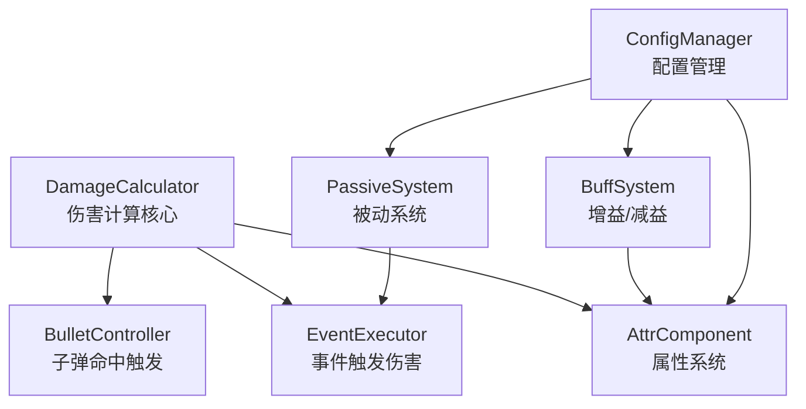
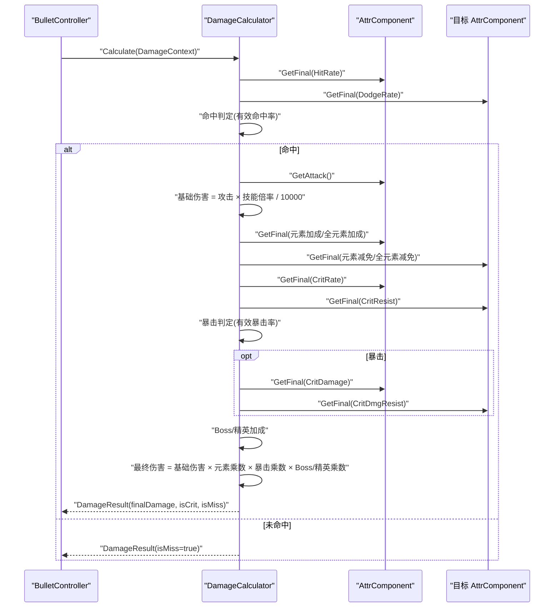
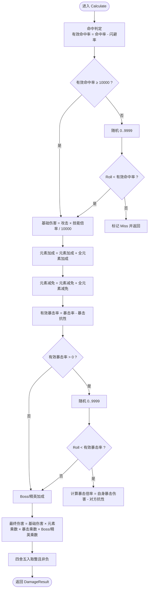
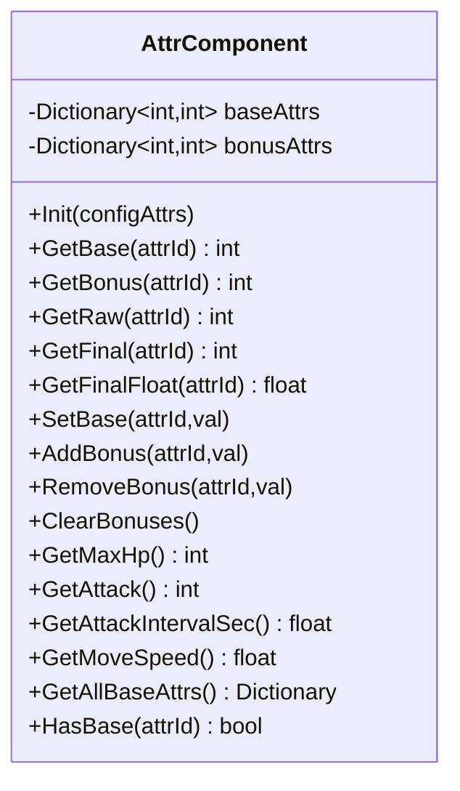
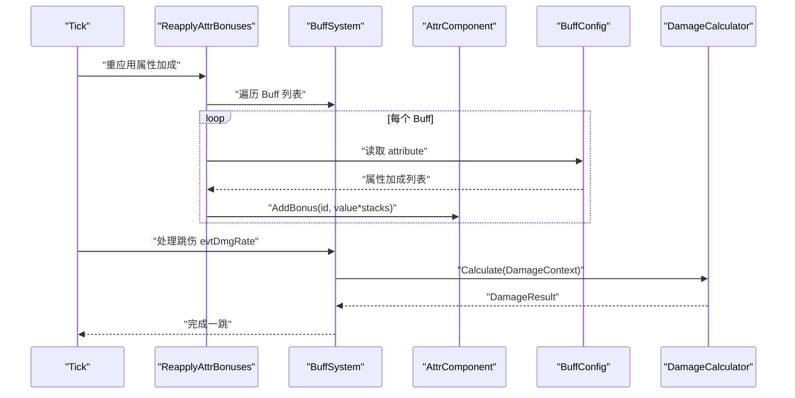
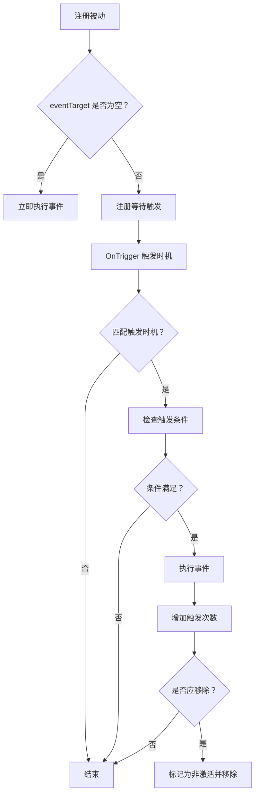
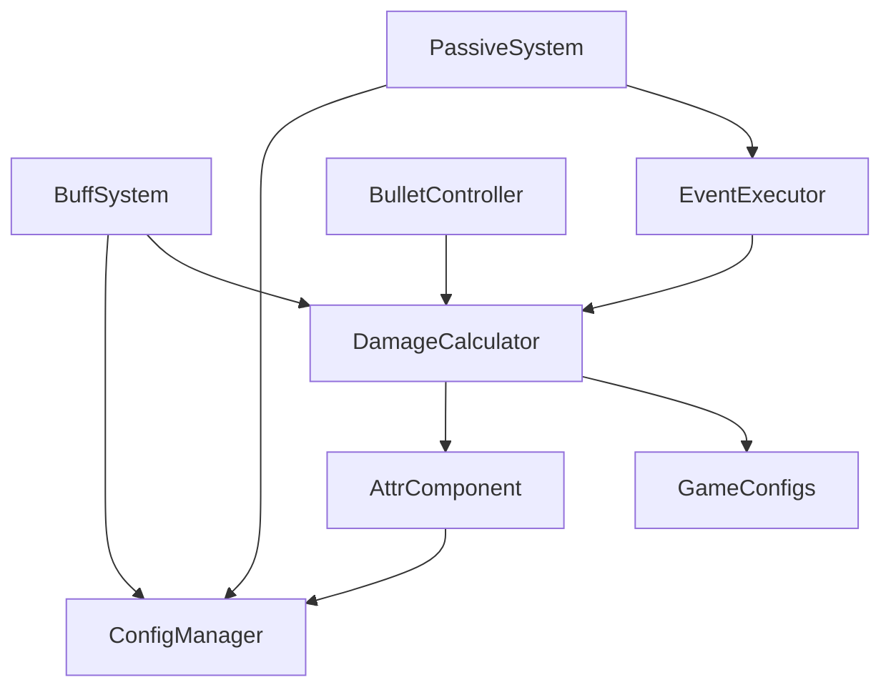

# 伤害计算系统

<cite>
**本文档引用的文件**
- [DamageCalculator.cs](file://Assets/Scripts/Battle/DamageCalculator.cs)
- [AttrComponent.cs](file://Assets/Scripts/Battle/AttrComponent.cs)
- [BuffSystem.cs](file://Assets/Scripts/Battle/BuffSystem.cs)
- [PassiveSystem.cs](file://Assets/Scripts/Battle/PassiveSystem.cs)
- [GameConfigs.cs](file://Assets/Scripts/Data/GameConfigs.cs)
- [ConfigManager.cs](file://Assets/Scripts/Core/ConfigManager.cs)
- [BulletController.cs](file://Assets/Scripts/Battle/BulletController.cs)
- [EventExecutor.cs](file://Assets/Scripts/Battle/EventExecutor.cs)
</cite>

## 目录
1. [简介](#简介)
2. [项目结构](#项目结构)
3. [核心组件](#核心组件)
4. [架构总览](#架构总览)
5. [详细组件分析](#详细组件分析)
6. [依赖关系分析](#依赖关系分析)
7. [性能考量](#性能考量)
8. [故障排查指南](#故障排查指南)
9. [结论](#结论)
10. [附录](#附录)

## 简介
本文件面向伤害计算系统，围绕 DamageCalculator 核心算法与 AttrComponent、BuffSystem、PassiveSystem 的协同机制进行深入技术说明。内容涵盖：
- 基础伤害计算、属性加成、抗性处理、最终伤害确定
- AttrComponent 属性系统对伤害计算的影响（攻击力、防御力、暴击率、抗性等）
- BuffSystem 增益/减益对伤害的影响（伤害加成、伤害减免、异常状态）
- PassiveSystem 被动技能对伤害的间接影响（触发条件、效果叠加、持续时间）
- 精度控制（浮点运算、舍入规则、数值范围限制）
- 扩展性设计（新伤害类型与计算规则的支持）

## 项目结构
伤害计算系统主要由以下模块组成：
- 伤害计算器：DamageCalculator
- 属性系统：AttrComponent
- 增益/减益系统：BuffSystem
- 被动系统：PassiveSystem
- 配置管理：ConfigManager、GameConfigs（包含 AttributeIds、BuffConfig、PassiveConfig 等）
- 使用场景：BulletController、EventExecutor 等在战斗流程中调用伤害计算

图表来源
- [DamageCalculator.cs:22-104](file://Assets/Scripts/Battle/DamageCalculator.cs#L22-L104)
- [AttrComponent.cs:6-128](file://Assets/Scripts/Battle/AttrComponent.cs#L6-L128)
- [BuffSystem.cs:30-378](file://Assets/Scripts/Battle/BuffSystem.cs#L30-L378)
- [PassiveSystem.cs:14-149](file://Assets/Scripts/Battle/PassiveSystem.cs#L14-L149)
- [ConfigManager.cs:6-619](file://Assets/Scripts/Core/ConfigManager.cs#L6-L619)
- [BulletController.cs:256-289](file://Assets/Scripts/Battle/BulletController.cs#L256-L289)
- [EventExecutor.cs:65-100](file://Assets/Scripts/Battle/EventExecutor.cs#L65-L100)

章节来源
- [DamageCalculator.cs:1-106](file://Assets/Scripts/Battle/DamageCalculator.cs#L1-L106)
- [AttrComponent.cs:1-129](file://Assets/Scripts/Battle/AttrComponent.cs#L1-L129)
- [BuffSystem.cs:1-378](file://Assets/Scripts/Battle/BuffSystem.cs#L1-L378)
- [PassiveSystem.cs:1-150](file://Assets/Scripts/Battle/PassiveSystem.cs#L1-L150)
- [GameConfigs.cs:1-775](file://Assets/Scripts/Data/GameConfigs.cs#L1-L775)
- [ConfigManager.cs:1-619](file://Assets/Scripts/Core/ConfigManager.cs#L1-L619)
- [BulletController.cs:256-289](file://Assets/Scripts/Battle/BulletController.cs#L256-L289)
- [EventExecutor.cs:65-100](file://Assets/Scripts/Battle/EventExecutor.cs#L65-L100)

## 核心组件
- DamageCalculator：提供 DamageContext 和 DamageResult，执行命中判定、基础伤害、元素加成/减免、暴击判定、Boss/精英加成、最终伤害计算与舍入。
- AttrComponent：提供基础属性、加成属性、最终属性、派生属性（如最大生命、攻击力、攻速、移速），并支持属性上限/下限约束与万分比转换。
- BuffSystem：维护 Buff 生命周期、叠加、刷新、跳伤、特殊事件（伤害、护盾、反击、无敌、冰冻等）、属性重应用。
- PassiveSystem：注册被动、按触发时机与条件执行事件、统计触发次数、支持移除条件。
- GameConfigs：集中定义 AttributeIds（含元素加成/减免映射）、事件类型、Buff 特殊事件类型、配置结构体。
- ConfigManager：统一加载与查询各类配置（属性元数据、Buff、Passive、Event 等），提供缓存查找。

章节来源
- [DamageCalculator.cs:22-104](file://Assets/Scripts/Battle/DamageCalculator.cs#L22-L104)
- [AttrComponent.cs:6-128](file://Assets/Scripts/Battle/AttrComponent.cs#L6-L128)
- [BuffSystem.cs:30-378](file://Assets/Scripts/Battle/BuffSystem.cs#L30-L378)
- [PassiveSystem.cs:14-149](file://Assets/Scripts/Battle/PassiveSystem.cs#L14-L149)
- [GameConfigs.cs:17-83](file://Assets/Scripts/Data/GameConfigs.cs#L17-L83)
- [ConfigManager.cs:6-619](file://Assets/Scripts/Core/ConfigManager.cs#L6-L619)

## 架构总览
伤害计算从“命中判定”开始，随后计算基础伤害，再引入元素加成/减免、暴击判定、Boss/精英加成，最后以“万分比”形式进行乘法合成，并进行舍入与取整，确保非负结果。

图表来源
- [DamageCalculator.cs:24-103](file://Assets/Scripts/Battle/DamageCalculator.cs#L24-L103)
- [BulletController.cs:274-289](file://Assets/Scripts/Battle/BulletController.cs#L274-L289)

章节来源
- [DamageCalculator.cs:24-103](file://Assets/Scripts/Battle/DamageCalculator.cs#L24-L103)
- [BulletController.cs:274-289](file://Assets/Scripts/Battle/BulletController.cs#L274-L289)

## 详细组件分析

### DamageCalculator 伤害计算核心
- 输入上下文 DamageContext 包含攻击者/防御者属性、技能伤害倍率、伤害类型、目标是否为 Boss/精英。
- 计算步骤：
  1) 命中判定：有效命中率 = 命中率 - 闪避率；若有效命中率不足则直接 Miss。
  2) 基础伤害：基础攻击 × 技能倍率 / 10000。
  3) 元素加成：按技能伤害类型映射到对应元素加成（含全元素加成）。
  4) 元素减免：按技能伤害类型映射到对应元素减免（含全元素减免）。
  5) 暴击判定：有效暴击率 = 暴击率 - 暴击抗性；若命中则计算暴击伤害倍率（自身暴击伤害 - 对方抗性）。
  6) Boss/精英加成：根据目标类型累加加成。
  7) 最终伤害：基础伤害 × (1 + 加成/10000 - 减免/10000) × (1 + 暴击倍率/10000) × (1 + Boss/精英加成/10000)，四舍五入取整且非负。

图表来源
- [DamageCalculator.cs:24-103](file://Assets/Scripts/Battle/DamageCalculator.cs#L24-L103)

章节来源
- [DamageCalculator.cs:24-103](file://Assets/Scripts/Battle/DamageCalculator.cs#L24-L103)

### AttrComponent 属性系统
- 数据结构：基础属性字典、加成属性字典。
- 计算流程：
  - GetRaw：基础 + 加成。
  - GetFinal：先取原始值，再通过 ConfigManager 的属性元数据进行上下限裁剪。
  - GetFinalFloat：若 powerType=1（万分比），则返回除以 10000 的浮点值；否则返回整型。
  - 派生属性：最大生命（HP×(10000+百分比)/10000）、攻击力（Attack×(10000+百分比)/10000）、攻速、移速等。
- 与伤害计算的关系：
  - 命中率、闪避率、暴击率、暴击抗性、元素加成/减免、Boss/精英加成均来自 AttrComponent 的 GetFinal。
  - 攻击力通过 AttrComponent.GetAttack 参与基础伤害计算。

图表来源
- [AttrComponent.cs:6-128](file://Assets/Scripts/Battle/AttrComponent.cs#L6-L128)

章节来源
- [AttrComponent.cs:38-114](file://Assets/Scripts/Battle/AttrComponent.cs#L38-L114)
- [ConfigManager.cs:405-424](file://Assets/Scripts/Core/ConfigManager.cs#L405-L424)

### BuffSystem 增益/减益系统
- BuffEntry：包含配置ID、缓存配置、叠层、剩余时间、跳伤计时、施加者引用。
- BuffSystem 主要能力：
  - 添加/移除 Buff、按类型批量移除、概率判定、叠加上限、刷新持续时间。
  - Tick：每帧重应用属性加成、处理跳伤（evtDmgRate）、按间隔触发事件（evtDamage）、结束事件（evtWhenEnd）、过期移除。
  - 特殊事件：无敌、冰冻、反击、技能伤害变化、奥术消耗变化、技能子弹变化等。
  - 与伤害计算的耦合点：
    - ReapplyAttrBonuses：在 Tick 中清空并重新应用所有 Buff 的属性加成，直接影响 AttrComponent 的 GetFinal。
    - 跳伤 evtDmgRate：构建 DamageContext 后调用 DamageCalculator.Calculate，实现“持续伤害”的伤害计算。
    - 技能伤害变化（SkillDmgMod）：可聚合多个 Buff 的技能伤害修正（万分比）。

图表来源
- [BuffSystem.cs:140-225](file://Assets/Scripts/Battle/BuffSystem.cs#L140-L225)
- [BuffSystem.cs:227-248](file://Assets/Scripts/Battle/BuffSystem.cs#L227-L248)
- [DamageCalculator.cs:24-103](file://Assets/Scripts/Battle/DamageCalculator.cs#L24-L103)

章节来源
- [BuffSystem.cs:34-84](file://Assets/Scripts/Battle/BuffSystem.cs#L34-L84)
- [BuffSystem.cs:140-225](file://Assets/Scripts/Battle/BuffSystem.cs#L140-L225)
- [BuffSystem.cs:227-248](file://Assets/Scripts/Battle/BuffSystem.cs#L227-L248)
- [BuffSystem.cs:263-280](file://Assets/Scripts/Battle/BuffSystem.cs#L263-L280)

### PassiveSystem 被动系统
- ActivePassive：记录被动配置、触发次数、激活状态。
- PassiveSystem：
  - RegisterPassive：立即触发或注册等待触发。
  - OnTrigger：匹配触发时机、检查条件、执行事件、统计触发次数、按移除条件清理。
  - 条件支持：目标生命值百分比、目标护盾百分比等。
- 与伤害计算的间接关系：
  - 被动事件可能通过 EventExecutor 触发伤害（负数倍率表示治疗），从而影响目标血量。
  - 被动事件也可能改变属性（通过 AttrComponent 的加成），间接影响后续伤害计算。

图表来源
- [PassiveSystem.cs:18-69](file://Assets/Scripts/Battle/PassiveSystem.cs#L18-L69)
- [PassiveSystem.cs:81-118](file://Assets/Scripts/Battle/PassiveSystem.cs#L81-L118)
- [PassiveSystem.cs:120-142](file://Assets/Scripts/Battle/PassiveSystem.cs#L120-L142)

章节来源
- [PassiveSystem.cs:14-149](file://Assets/Scripts/Battle/PassiveSystem.cs#L14-L149)

### 伤害计算的精度控制
- 伤害计算采用长整型中间值（long）保存基础伤害，避免早期溢出。
- 浮点乘法：元素乘数、暴击乘数、Boss/精英乘数均为浮点，最终结果经四舍五入取整。
- 数值范围：最终伤害取非负值；有效命中率与有效暴击率均取非负值。
- 属性值范围：AttrComponent 在 GetFinal 中通过 ConfigManager 的属性元数据进行上下限裁剪，避免极端值影响平衡。

章节来源
- [DamageCalculator.cs:46-100](file://Assets/Scripts/Battle/DamageCalculator.cs#L46-L100)
- [AttrComponent.cs:38-53](file://Assets/Scripts/Battle/AttrComponent.cs#L38-L53)

### 伤害计算系统的扩展性设计
- 新的伤害类型：
  - 在 AttributeIds 中新增元素加成/减免映射函数，DamageCalculator 会按技能伤害类型自动查找对应属性。
  - ConfigManager 提供 GetAttrMeta，支持属性元数据（上下限、万分比转换）。
- 新的计算规则：
  - 可通过 BuffSystem 的 specialEvent（如 SkillDmgMod、ArcaneCostMod、SkillBulletMod）扩展技能伤害修正、消耗变化、子弹事件。
  - 可通过 PassiveSystem 的事件系统在特定时机附加新的伤害/治疗效果。
- 新的属性：
  - 在 AttributeConfig 中定义属性元数据，AttrComponent 支持上下限与万分比转换。
  - AttrComponent 的派生属性接口可扩展更多派生计算（如新的百分比加成）。

章节来源
- [GameConfigs.cs:58-83](file://Assets/Scripts/Data/GameConfigs.cs#L58-L83)
- [ConfigManager.cs:405-424](file://Assets/Scripts/Core/ConfigManager.cs#L405-L424)
- [BuffSystem.cs:263-303](file://Assets/Scripts/Battle/BuffSystem.cs#L263-L303)
- [PassiveSystem.cs:41-69](file://Assets/Scripts/Battle/PassiveSystem.cs#L41-L69)

## 依赖关系分析
- DamageCalculator 依赖 AttrComponent（属性值）、GameConfigs（元素映射）、Unity Random（随机判定）。
- AttrComponent 依赖 ConfigManager（属性元数据）。
- BuffSystem 依赖 ConfigManager（BuffConfig）、DamageCalculator（跳伤伤害）、EventExecutor（事件触发）。
- PassiveSystem 依赖 ConfigManager（PassiveConfig）、EventExecutor（事件执行）。
- 使用端（BulletController、EventExecutor）负责构造 DamageContext 并调用 DamageCalculator。

图表来源
- [DamageCalculator.cs:22-104](file://Assets/Scripts/Battle/DamageCalculator.cs#L22-L104)
- [AttrComponent.cs:6-128](file://Assets/Scripts/Battle/AttrComponent.cs#L6-L128)
- [BuffSystem.cs:30-378](file://Assets/Scripts/Battle/BuffSystem.cs#L30-L378)
- [PassiveSystem.cs:14-149](file://Assets/Scripts/Battle/PassiveSystem.cs#L14-L149)
- [ConfigManager.cs:6-619](file://Assets/Scripts/Core/ConfigManager.cs#L6-L619)
- [BulletController.cs:256-289](file://Assets/Scripts/Battle/BulletController.cs#L256-L289)
- [EventExecutor.cs:65-100](file://Assets/Scripts/Battle/EventExecutor.cs#L65-L100)

章节来源
- [DamageCalculator.cs:22-104](file://Assets/Scripts/Battle/DamageCalculator.cs#L22-L104)
- [AttrComponent.cs:6-128](file://Assets/Scripts/Battle/AttrComponent.cs#L6-L128)
- [BuffSystem.cs:30-378](file://Assets/Scripts/Battle/BuffSystem.cs#L30-L378)
- [PassiveSystem.cs:14-149](file://Assets/Scripts/Battle/PassiveSystem.cs#L14-L149)
- [ConfigManager.cs:6-619](file://Assets/Scripts/Core/ConfigManager.cs#L6-L619)
- [BulletController.cs:256-289](file://Assets/Scripts/Battle/BulletController.cs#L256-L289)
- [EventExecutor.cs:65-100](file://Assets/Scripts/Battle/EventExecutor.cs#L65-L100)

## 性能考量
- 计算复杂度：DamageCalculator 单次计算为常数级，主要开销在随机数生成与属性查询。
- 内存占用：AttrComponent 使用两个字典存储基础与加成属性；BuffSystem 使用列表存储 BuffEntry。
- 优化建议：
  - 将 AttrComponent 的属性查询封装为内联或缓存常用属性值。
  - 在 BuffSystem 中按类型分组 Buff，减少遍历成本。
  - 对于高频跳伤（如持续伤害），可考虑批量处理或延迟队列。

## 故障排查指南
- 命中率异常：
  - 检查 AttrComponent 的命中率与闪避率是否被 Buff 正确加成/削减。
  - 确认 DamageCalculator 的有效命中率计算逻辑未出现负值。
- 暴击率异常：
  - 检查 AttrComponent 的暴击率与暴击抗性是否正确，以及 DamageCalculator 的有效暴击率计算。
- 元素伤害无效：
  - 确认技能伤害类型与 AttributeIds 的元素映射正确，且元素加成/减免属性存在。
- Boss/精英加成无效：
  - 检查 DamageContext 的 isTargetBoss/isTargetElite 标志是否正确设置。
- 跳伤未生效：
  - 检查 BuffConfig 的 jumpTime、evtDmgRate 是否配置正确，且 BuffSystem.Tick 是否正常执行。
- 被动触发不生效：
  - 检查 PassiveConfig 的 eventTarget、eventCond、eventRemove 是否符合预期，以及 EventExecutor 是否正确执行事件。

章节来源
- [DamageCalculator.cs:31-103](file://Assets/Scripts/Battle/DamageCalculator.cs#L31-L103)
- [BuffSystem.cs:140-225](file://Assets/Scripts/Battle/BuffSystem.cs#L140-L225)
- [PassiveSystem.cs:41-69](file://Assets/Scripts/Battle/PassiveSystem.cs#L41-L69)

## 结论
伤害计算系统通过 DamageCalculator 的标准化流程，结合 AttrComponent 的属性体系、BuffSystem 的动态加成与 PassiveSystem 的事件驱动，实现了高扩展性与强耦合的伤害链路。系统采用“万分比”与“浮点乘法”的组合，在保证精度的同时兼顾性能；通过 ConfigManager 的集中配置与元数据裁剪，确保数值平衡与可维护性。未来可通过扩展元素类型、新增 Buff 特殊事件与被动条件，进一步丰富伤害计算策略。

## 附录
- 关键算法路径参考：
  - 命中判定与基础伤害：[DamageCalculator.cs:31-48](file://Assets/Scripts/Battle/DamageCalculator.cs#L31-L48)
  - 元素加成/减免与 Boss/精英加成：[DamageCalculator.cs:49-92](file://Assets/Scripts/Battle/DamageCalculator.cs#L49-L92)
  - 暴击判定与最终伤害：[DamageCalculator.cs:69-100](file://Assets/Scripts/Battle/DamageCalculator.cs#L69-L100)
  - 属性上限/下限与万分比转换：[AttrComponent.cs:38-62](file://Assets/Scripts/Battle/AttrComponent.cs#L38-L62)
  - 属性重应用与跳伤：[BuffSystem.cs:140-225](file://Assets/Scripts/Battle/BuffSystem.cs#L140-L225)
  - 被动触发与条件检查：[PassiveSystem.cs:41-118](file://Assets/Scripts/Battle/PassiveSystem.cs#L41-L118)