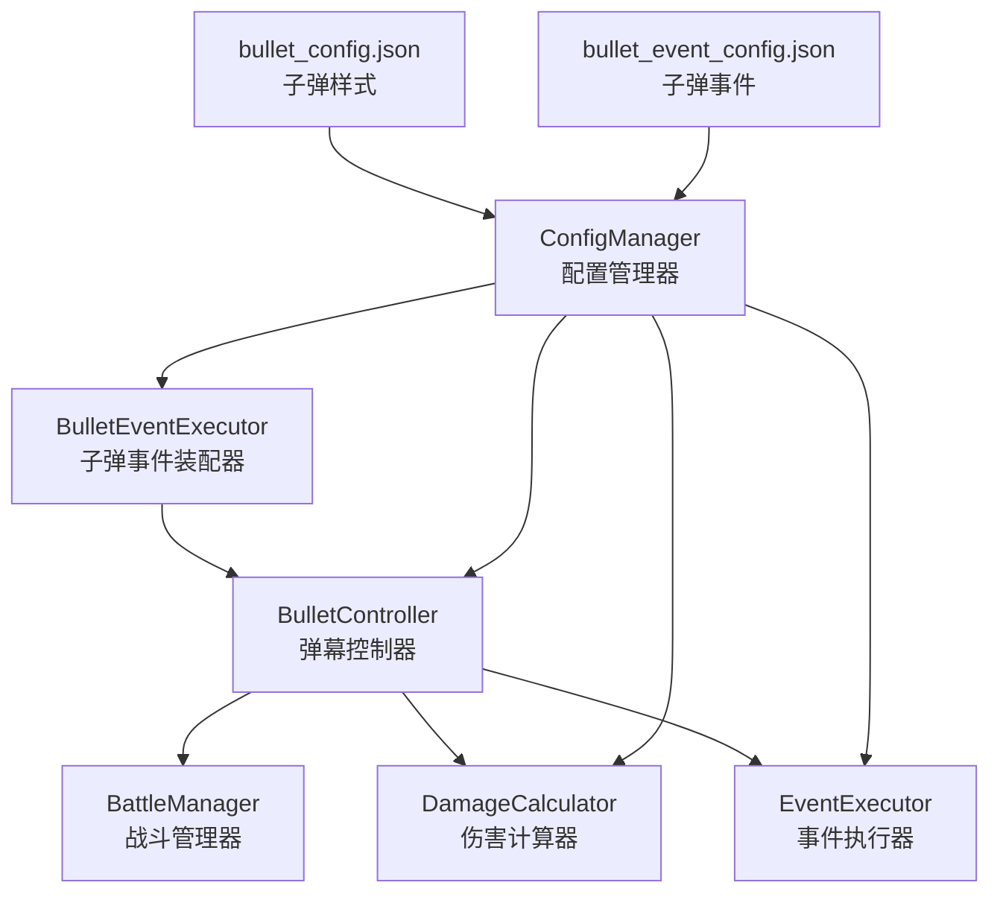
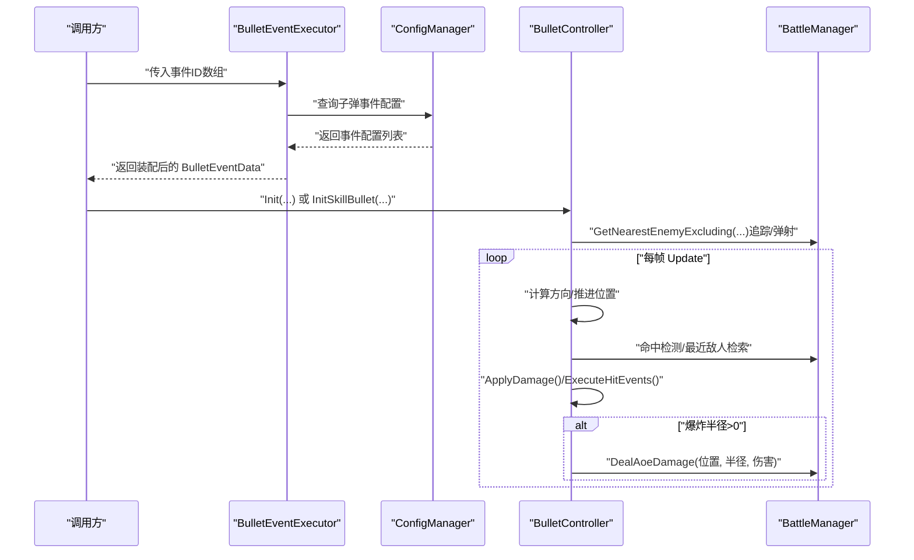
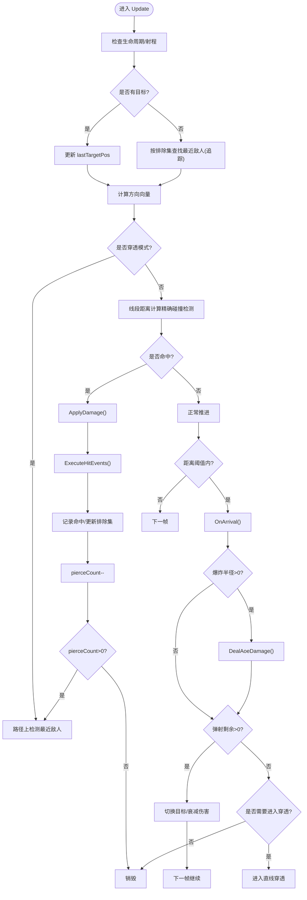
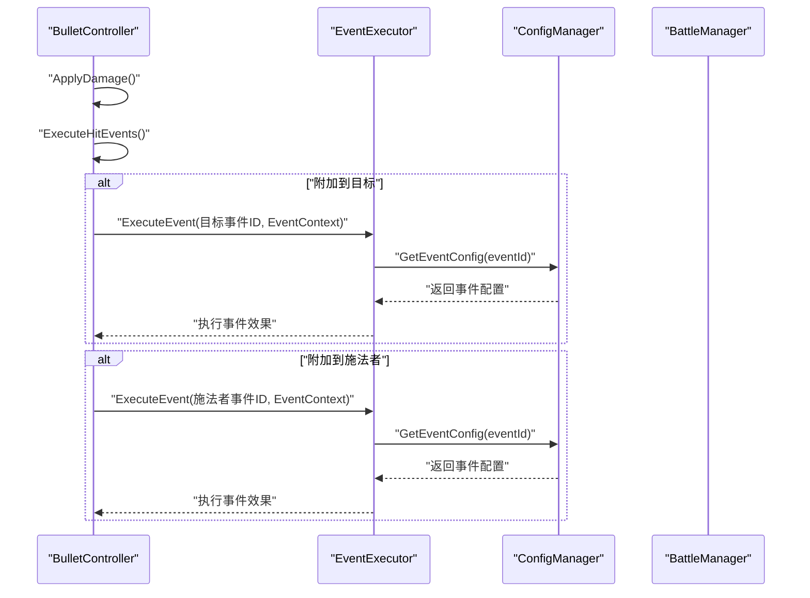
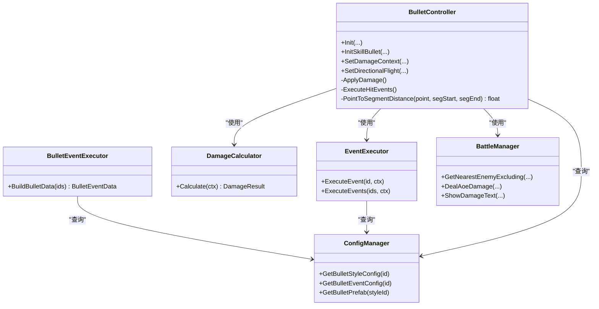

# 弹幕系统

<cite>
**本文引用的文件**
- [BulletController.cs](file://Assets/Scripts/Battle/BulletController.cs)
- [BulletEventExecutor.cs](file://Assets/Scripts/Battle/BulletEventExecutor.cs)
- [GameConfigs.cs](file://Assets/Scripts/Data/GameConfigs.cs)
- [DamageCalculator.cs](file://Assets/Scripts/Battle/DamageCalculator.cs)
- [EventExecutor.cs](file://Assets/Scripts/Battle/EventExecutor.cs)
- [ConfigManager.cs](file://Assets/Scripts/Core/ConfigManager.cs)
- [bullet_config.json](file://Assets/Resources/Configs/bullet_config.json)
- [bullet_event_config.json](file://Assets/Resources/Configs/bullet_event_config.json)
- [BattleManager.cs](file://Assets/Scripts/Battle/BattleManager.cs)
</cite>

## 目录
1. [简介](#简介)
2. [项目结构](#项目结构)
3. [核心组件](#核心组件)
4. [架构总览](#架构总览)
5. [详细组件分析](#详细组件分析)
6. [依赖关系分析](#依赖关系分析)
7. [性能考量](#性能考量)
8. [故障排查指南](#故障排查指南)
9. [结论](#结论)
10. [附录](#附录)

## 简介
本技术文档围绕弹幕系统展开，重点解析 BulletController 弹幕控制器的设计与实现，涵盖弹幕创建、飞行轨迹、碰撞/命中检测、效果触发；梳理弹幕类型体系（英雄弹幕、Boss弹幕、技能弹幕）及其差异；详解飞行算法（直线飞行、追踪、散射、轨迹控制）；阐述事件系统（BulletEventExecutor 的事件装配、效果链式触发、参数传递）；分析性能优化（对象池化、碰撞检测优化、生命周期控制）；并给出扩展性设计建议与关键算法的实现路径。

## 项目结构
弹幕系统位于 Battle 命名空间下，核心文件如下：
- BulletController.cs：弹幕实体控制器，负责飞行、追踪、命中、AOE、弹射、穿透、事件触发等
- BulletEventExecutor.cs：将子弹事件配置装配为运行时数据 BulletEventData
- GameConfigs.cs：定义 BulletEventType、BulletEventData 等数据模型与常量
- DamageCalculator.cs：基于属性系统的伤害计算
- EventExecutor.cs：通用事件执行器，用于触发命中附加效果
- ConfigManager.cs：配置加载与缓存，提供子弹样式与事件配置查询
- bullet_config.json：子弹样式配置
- bullet_event_config.json：子弹事件配置
- BattleManager.cs：战斗管理器，提供AOE伤害、最近敌人检索、UI反馈等

**图表来源**
- [BulletController.cs:1-374](file://Assets/Scripts/Battle/BulletController.cs#L1-L374)
- [BulletEventExecutor.cs:1-98](file://Assets/Scripts/Battle/BulletEventExecutor.cs#L1-L98)
- [GameConfigs.cs:157-314](file://Assets/Scripts/Data/GameConfigs.cs#L157-L314)
- [DamageCalculator.cs:1-106](file://Assets/Scripts/Battle/DamageCalculator.cs#L1-L106)
- [EventExecutor.cs:13-195](file://Assets/Scripts/Battle/EventExecutor.cs#L13-L195)
- [ConfigManager.cs:1-200](file://Assets/Scripts/Core/ConfigManager.cs#L1-L200)
- [bullet_config.json:1-9](file://Assets/Resources/Configs/bullet_config.json#L1-L9)
- [bullet_event_config.json:1-37](file://Assets/Resources/Configs/bullet_event_config.json#L1-L37)
- [BattleManager.cs:1-200](file://Assets/Scripts/Battle/BattleManager.cs#L1-L200)

**章节来源**
- [BulletController.cs:1-374](file://Assets/Scripts/Battle/BulletController.cs#L1-L374)
- [BulletEventExecutor.cs:1-98](file://Assets/Scripts/Battle/BulletEventExecutor.cs#L1-L98)
- [GameConfigs.cs:157-314](file://Assets/Scripts/Data/GameConfigs.cs#L157-L314)
- [DamageCalculator.cs:1-106](file://Assets/Scripts/Battle/DamageCalculator.cs#L1-L106)
- [EventExecutor.cs:13-195](file://Assets/Scripts/Battle/EventExecutor.cs#L13-L195)
- [ConfigManager.cs:1-200](file://Assets/Scripts/Core/ConfigManager.cs#L1-L200)
- [bullet_config.json:1-9](file://Assets/Resources/Configs/bullet_config.json#L1-L9)
- [bullet_event_config.json:1-37](file://Assets/Resources/Configs/bullet_event_config.json#L1-L37)
- [BattleManager.cs:1-200](file://Assets/Scripts/Battle/BattleManager.cs#L1-L200)

## 核心组件
- BulletController：单帧更新推进弹幕飞行，处理追踪、弹射、穿透、爆炸、事件触发与伤害结算
- BulletEventExecutor：将事件ID数组装配为 BulletEventData，包含穿透、爆炸、追踪、散射、弹射、连射、齐射及附加事件等
- GameConfigs：定义 BulletEventType 常量与 BulletEventData 数据结构，提供克隆能力
- DamageCalculator：基于命中/闪避、元素加成/减免、暴击/抗性、Boss/精英加成的完整伤害公式
- EventExecutor：通用事件执行器，支持伤害、治疗、护盾、击退、经验、能量、增益、被动、召唤、驱散等
- ConfigManager：集中加载与缓存子弹样式与子弹事件配置，并提供预制体缓存
- BattleManager：提供AOE伤害、最近敌人检索、伤害数字显示等

**章节来源**
- [BulletController.cs:32-374](file://Assets/Scripts/Battle/BulletController.cs#L32-L374)
- [BulletEventExecutor.cs:8-95](file://Assets/Scripts/Battle/BulletEventExecutor.cs#L8-L95)
- [GameConfigs.cs:157-314](file://Assets/Scripts/Data/GameConfigs.cs#L157-L314)
- [DamageCalculator.cs:22-103](file://Assets/Scripts/Battle/DamageCalculator.cs#L22-L103)
- [EventExecutor.cs:13-195](file://Assets/Scripts/Battle/EventExecutor.cs#L13-L195)
- [ConfigManager.cs:65-200](file://Assets/Scripts/Core/ConfigManager.cs#L65-L200)
- [BattleManager.cs:48-120](file://Assets/Scripts/Battle/BattleManager.cs#L48-L120)

## 架构总览
弹幕系统采用"事件装配 + 实体控制器 + 伤害/事件执行器"的分层设计：
- 事件装配层：BulletEventExecutor 将事件ID数组转换为 BulletEventData，供 BulletController 使用
- 实体控制层：BulletController 在 Update 中推进弹幕生命周期，按配置执行飞行、命中、AOE、弹射、穿透
- 计算层：DamageCalculator 提供完整伤害公式；EventExecutor 处理命中附加效果
- 配置层：ConfigManager 加载 bullet_config.json 与 bullet_event_config.json，并缓存子弹样式与事件配置

**图表来源**
- [BulletEventExecutor.cs:8-95](file://Assets/Scripts/Battle/BulletEventExecutor.cs#L8-L95)
- [ConfigManager.cs:98-122](file://Assets/Scripts/Core/ConfigManager.cs#L98-L122)
- [BulletController.cs:94-216](file://Assets/Scripts/Battle/BulletController.cs#L94-L216)
- [BattleManager.cs:48-120](file://Assets/Scripts/Battle/BattleManager.cs#L48-L120)

## 详细组件分析

### BulletController 弹幕控制器
- 初始化
  - 普通弹幕：Init(target, speed, damage, isEnemyBullet, bm, attackRange)
  - 技能弹幕：InitSkillBullet(target, speed, damage, bm, data, attackRange, caster)
  - 设置伤害上下文：SetDamageContext(attackerAttrs, skillDmgRatio, skillDmgType)，启用完整伤害公式
  - 直线飞行：SetDirectionalFlight(direction)，进入穿透模式
- 更新流程
  - 生命周期：lifeTime 递减，超时销毁；超出最大射程销毁
  - 追踪：若开启追踪且当前目标为空，从 BattleManager 按排除集合检索最近敌人
  - 飞行：朝 lastTargetPos 推进，非穿刺模式更新 pierceDirection
  - 精确碰撞检测：使用线段距离计算（PointToSegmentDistance）检测从当前位置到下一位置的路径是否与目标发生碰撞
  - 穿透：在路径上检测最近敌人，命中即 ApplyDamage + ExecuteHitEvents + 记录命中 + pierceCount--
  - 到达：ApplyDamage + ExecuteHitEvents；若爆炸半径>0，执行AOE；若弹射剩余>0，按弹射参数切换目标；否则进入直线穿透或销毁
- 伤害与效果
  - 敌方弹幕命中英雄：使用 DamageCalculator 完整伤害公式；若命中则显示伤害数字
  - 己方弹幕命中怪物/Boss：识别精英/Boss，使用 DamageCalculator；命中则显示伤害数字
  - 命中附加事件：对目标附加事件、对施法者附加事件，通过 EventExecutor 执行

**更新** 碰撞检测算法已完全重写，使用线段距离计算替代简单点到点检查，提供更精确的碰撞检测能力

**图表来源**
- [BulletController.cs:94-216](file://Assets/Scripts/Battle/BulletController.cs#L94-L216)
- [BattleManager.cs:48-120](file://Assets/Scripts/Battle/BattleManager.cs#L48-L120)

**章节来源**
- [BulletController.cs:32-374](file://Assets/Scripts/Battle/BulletController.cs#L32-L374)

### 碰撞检测算法详解
**更新** BulletController.cs完全重写了碰撞检测算法，使用线段距离计算替代简单点到点检查

- 线段距离计算算法（PointToSegmentDistance）
  - 计算点到线段的最短距离，提供精确的碰撞检测
  - 使用向量投影和夹角判断确定最近点
  - 当线段长度接近零时，直接返回点到端点的距离
  - 通过 clamp01 确保最近点在线段范围内

- 精确碰撞检测流程
  - 非穿透模式：检查从当前位置到下一位置的线段与目标的最短距离
  - 穿透模式：在移动路径周围搜索最近敌人，使用线段距离计算精确命中
  - 基于步长的搜索半径：searchRadius = step * 0.5f + 0.5f，平衡精度与性能

**章节来源**
- [BulletController.cs:136-175](file://Assets/Scripts/Battle/BulletController.cs#L136-L175)
- [BulletController.cs:192-200](file://Assets/Scripts/Battle/BulletController.cs#L192-L200)

### 弹幕类型系统
- 英雄弹幕（isEnemyBullet=false）
  - 由英雄释放，通常用于技能弹幕；可设置 caster，命中后对目标与施法者附加事件
- Boss弹幕（isEnemyBullet=true）
  - 由Boss释放，命中英雄时使用 DamageCalculator；未设置伤害上下文则使用预计算 damage
- 技能弹幕
  - 通过 InitSkillBullet 注入 BulletEventData 与 caster；可启用追踪、爆炸、弹射、穿透、散射、连射、齐射等效果

**章节来源**
- [BulletController.cs:32-73](file://Assets/Scripts/Battle/BulletController.cs#L32-L73)
- [BulletController.cs:218-302](file://Assets/Scripts/Battle/BulletController.cs#L218-L302)

### 飞行算法与轨迹控制
- 直线飞行
  - SetDirectionalFlight 设置固定方向，进入穿透模式，按方向推进
- 追踪机制
  - 开启 homing 后，若目标丢失，按排除集检索最近敌人作为新目标
- 散射效果
  - 通过 BulletEventExecutor 装配 scatterCount 与 scatterAngle，配合技能系统在发射时生成多枚弹幕
- 轨迹控制
  - pierceDirection 保存当前直线方向；在非穿刺模式下随目标朝向更新；在弹射/爆炸后按新目标或方向重置

**章节来源**
- [BulletController.cs:86-171](file://Assets/Scripts/Battle/BulletController.cs#L86-L171)
- [BulletEventExecutor.cs:42-48](file://Assets/Scripts/Battle/BulletEventExecutor.cs#L42-L48)

### 事件系统与效果链式触发
- BulletEventExecutor.BuildBulletData
  - 将事件ID数组装配为 BulletEventData，支持穿透、爆炸、追踪、散射、弹射、连射、齐射、附加到目标/施法者等
- ExecuteHitEvents
  - 命中后对目标与施法者分别附加事件，构造 EventContext 并交由 EventExecutor 执行
- EventExecutor
  - 支持伤害/治疗、护盾、击退、经验、能量、增益、被动、召唤、驱散等事件类型

**图表来源**
- [BulletController.cs:304-342](file://Assets/Scripts/Battle/BulletController.cs#L304-L342)
- [EventExecutor.cs:22-63](file://Assets/Scripts/Battle/EventExecutor.cs#L22-L63)
- [ConfigManager.cs:98-122](file://Assets/Scripts/Core/ConfigManager.cs#L98-L122)

**章节来源**
- [BulletEventExecutor.cs:8-95](file://Assets/Scripts/Battle/BulletEventExecutor.cs#L8-L95)
- [BulletController.cs:304-342](file://Assets/Scripts/Battle/BulletController.cs#L304-L342)
- [EventExecutor.cs:13-195](file://Assets/Scripts/Battle/EventExecutor.cs#L13-L195)

### 伤害计算与参数传递
- DamageCalculator.Calculate
  - 命中判定、元素加成/减免、暴击判定、Boss/精英加成，最终得到 finalDamage
- 参数传递
  - SetDamageContext 提供 attackerAttrs、skillDmgRatio、skillDmgType，确保命中时使用完整伤害公式
  - ApplyDamage 区分敌方弹幕（命中英雄）与己方弹幕（命中怪物/Boss），并标注 isTargetBoss/isTargetElite

**章节来源**
- [DamageCalculator.cs:22-103](file://Assets/Scripts/Battle/DamageCalculator.cs#L22-L103)
- [BulletController.cs:79-84](file://Assets/Scripts/Battle/BulletController.cs#L79-L84)
- [BulletController.cs:218-302](file://Assets/Scripts/Battle/BulletController.cs#L218-L302)

### 配置与扩展
- 子弹样式
  - bullet_config.json 定义样式ID与资源路径，ConfigManager 预加载并缓存
- 子弹事件
  - bullet_event_config.json 定义事件类型、名称、描述与参数；BulletEventExecutor 按类型解析参数
- 扩展建议
  - 新增事件类型：在 GameConfigs.BulletEventType 增加常量，在 BulletEventExecutor 中新增分支解析
  - 新增弹幕样式：在 bullet_config.json 添加条目，确保资源路径正确
  - 新增效果：在 EventExecutor 中新增事件类型处理逻辑

**章节来源**
- [bullet_config.json:1-9](file://Assets/Resources/Configs/bullet_config.json#L1-L9)
- [bullet_event_config.json:1-37](file://Assets/Resources/Configs/bullet_event_config.json#L1-L37)
- [GameConfigs.cs:157-170](file://Assets/Scripts/Data/GameConfigs.cs#L157-L170)
- [BulletEventExecutor.cs:23-89](file://Assets/Scripts/Battle/BulletEventExecutor.cs#L23-L89)
- [EventExecutor.cs:30-62](file://Assets/Scripts/Battle/EventExecutor.cs#L30-L62)

## 依赖关系分析
- BulletController 依赖
  - BattleManager：最近敌人检索、AOE伤害、伤害数字显示
  - DamageCalculator：完整伤害公式
  - EventExecutor：命中附加事件
  - ConfigManager：子弹样式与事件配置查询
- BulletEventExecutor 依赖
  - ConfigManager：子弹事件配置查询
- EventExecutor 依赖
  - ConfigManager：事件配置查询
  - DamageCalculator：伤害事件中的伤害计算

**图表来源**
- [BulletController.cs:32-374](file://Assets/Scripts/Battle/BulletController.cs#L32-L374)
- [BulletEventExecutor.cs:8-95](file://Assets/Scripts/Battle/BulletEventExecutor.cs#L8-L95)
- [DamageCalculator.cs:22-103](file://Assets/Scripts/Battle/DamageCalculator.cs#L22-L103)
- [EventExecutor.cs:13-195](file://Assets/Scripts/Battle/EventExecutor.cs#L13-L195)
- [ConfigManager.cs:98-122](file://Assets/Scripts/Core/ConfigManager.cs#L98-L122)
- [BattleManager.cs:48-120](file://Assets/Scripts/Battle/BattleManager.cs#L48-L120)

**章节来源**
- [BulletController.cs:32-374](file://Assets/Scripts/Battle/BulletController.cs#L32-L374)
- [BulletEventExecutor.cs:8-95](file://Assets/Scripts/Battle/BulletEventExecutor.cs#L8-L95)
- [DamageCalculator.cs:22-103](file://Assets/Scripts/Battle/DamageCalculator.cs#L22-L103)
- [EventExecutor.cs:13-195](file://Assets/Scripts/Battle/EventExecutor.cs#L13-L195)
- [ConfigManager.cs:98-122](file://Assets/Scripts/Core/ConfigManager.cs#L98-L122)
- [BattleManager.cs:48-120](file://Assets/Scripts/Battle/BattleManager.cs#L48-L120)

## 性能考量
- 对象池管理
  - 建议对子弹预制体进行对象池化，减少 Instantiate/Destroy 开销；在 BulletController 生命周期结束时回收
- 碰撞检测优化
  - **更新** 线段距离计算算法已在 BulletController.cs 中完全重写，提供更精确的碰撞检测
  - 穿透模式下仅在固定半径内检索最近敌人，避免全场景扫描；可结合空间分区（如网格/四叉树）进一步优化
  - 基于步长的搜索半径计算：searchRadius = step * 0.5f + 0.5f，平衡精度与性能
- 生命周期控制
  - 明确 lifeTime 与 maxAttackRange 的上限，及时销毁过期弹幕；在 OnArrival 中尽早短路弹射/穿透逻辑
- 事件执行
  - 事件ID数组在装配阶段合并为列表，避免每帧重复解析；EventExecutor 的事件类型分支应保持简洁

**章节来源**
- [BulletController.cs:136-175](file://Assets/Scripts/Battle/BulletController.cs#L136-L175)
- [BulletController.cs:192-200](file://Assets/Scripts/Battle/BulletController.cs#L192-L200)

## 故障排查指南
- 子弹未命中目标
  - 检查 homing 是否开启、target 是否为空、排除集是否过大导致找不到新目标
  - **更新** 确认线段距离计算算法是否正确工作，检查 PointToSegmentDistance 方法的输入参数
- 伤害异常
  - 确认是否调用 SetDamageContext；若未设置，ApplyDamage 将退回预计算 damage
- 事件未生效
  - 检查 BulletEventExecutor 是否正确装配 attachToTarget/attachToCaster 事件ID；确认 EventExecutor 的事件类型分支
- 预制体加载失败
  - 检查 bullet_config.json 的 prefabPath 是否正确；确认 ConfigManager 预加载是否成功

**章节来源**
- [BulletController.cs:112-121](file://Assets/Scripts/Battle/BulletController.cs#L112-L121)
- [BulletController.cs:218-302](file://Assets/Scripts/Battle/BulletController.cs#L218-L302)
- [BulletEventExecutor.cs:8-95](file://Assets/Scripts/Battle/BulletEventExecutor.cs#L8-L95)
- [EventExecutor.cs:13-195](file://Assets/Scripts/Battle/EventExecutor.cs#L13-L195)
- [ConfigManager.cs:169-198](file://Assets/Scripts/Core/ConfigManager.cs#L169-L198)

## 结论
弹幕系统以 BulletController 为核心，结合 BulletEventExecutor 的事件装配、ConfigManager 的配置管理、DamageCalculator 的伤害公式与 EventExecutor 的效果执行，形成清晰的职责分层。系统支持多种弹幕效果（追踪、爆炸、弹射、穿透、散射、连射、齐射）并通过事件附加实现丰富的命中后效果。通过对象池、碰撞优化与生命周期控制可显著提升性能。

**更新** 最新的碰撞检测算法使用线段距离计算，提供了更精确的弹幕飞行路径碰撞检测能力，替代了简单的点到点检查，显著提升了命中判定的准确性。

扩展方面，新增事件类型与弹幕样式均具备明确的接入点与配置入口。

## 附录
- 关键算法实现路径参考
  - 飞行轨迹计算：[BulletController.cs:128-131](file://Assets/Scripts/Battle/BulletController.cs#L128-L131)
  - **更新** 精确碰撞检测算法：[BulletController.cs:136-175](file://Assets/Scripts/Battle/BulletController.cs#L136-L175)
  - **更新** 线段距离计算实现：[BulletController.cs:192-200](file://Assets/Scripts/Battle/BulletController.cs#L192-L200)
  - 事件触发（命中附加）：[BulletController.cs:304-342](file://Assets/Scripts/Battle/BulletController.cs#L304-L342)
  - 伤害计算（完整公式）：[DamageCalculator.cs:24-103](file://Assets/Scripts/Battle/DamageCalculator.cs#L24-L103)
  - 子弹事件装配：[BulletEventExecutor.cs:8-95](file://Assets/Scripts/Battle/BulletEventExecutor.cs#L8-L95)