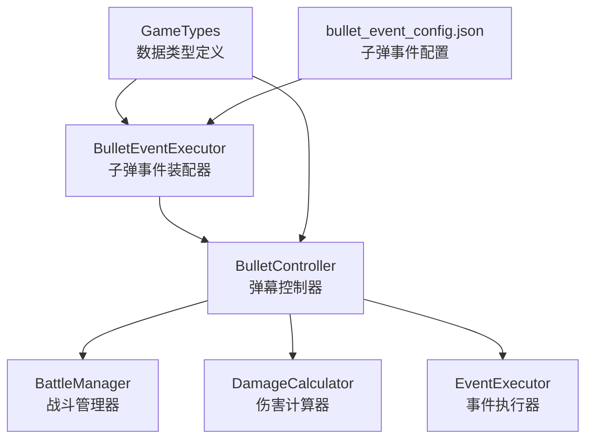
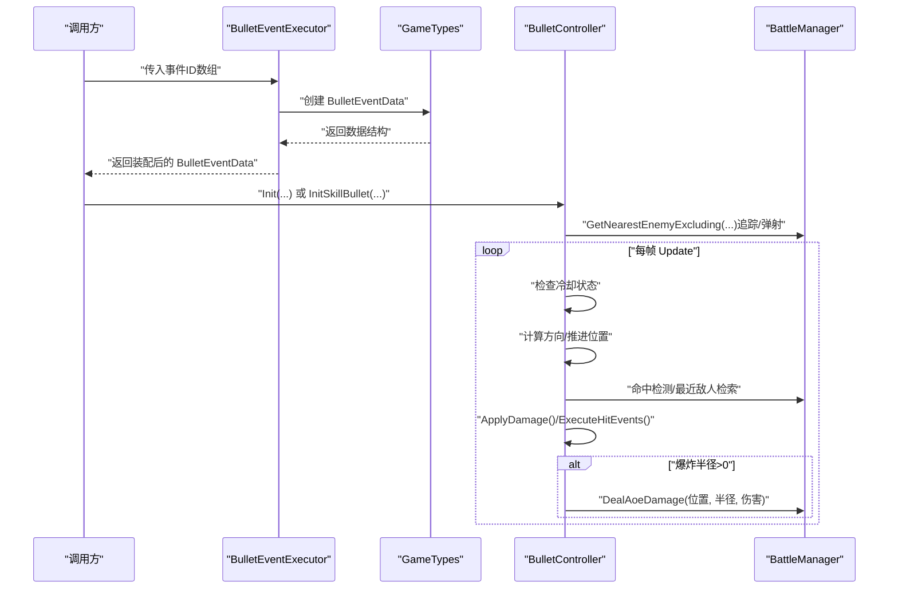
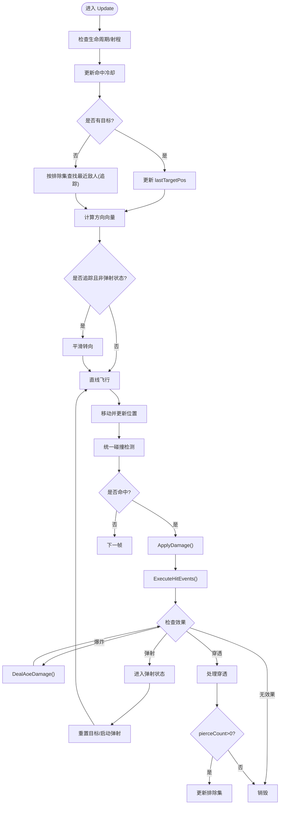
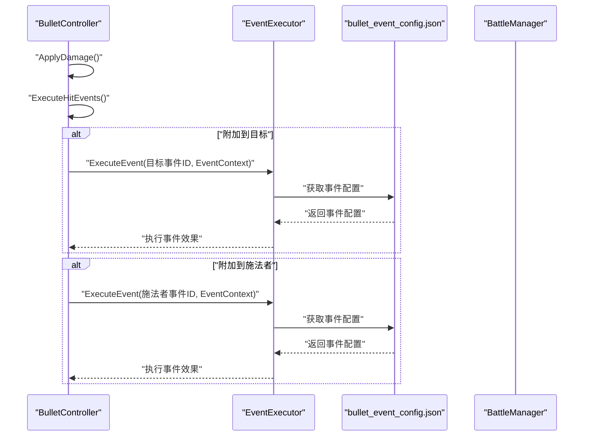
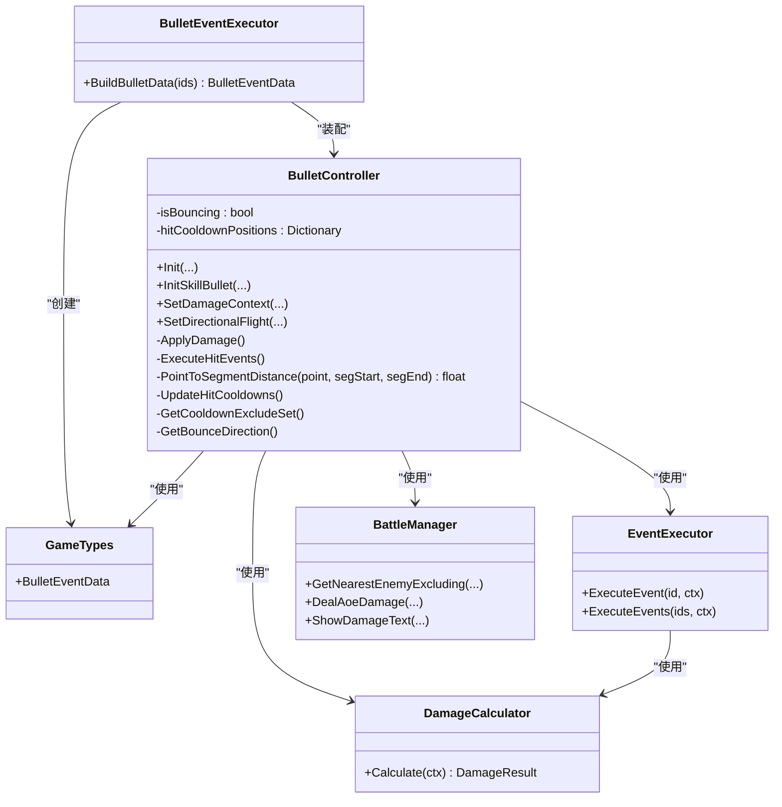

# 弹幕系统

<cite>
**本文引用的文件**
- [BulletController.cs](file://Assets/Scripts/Battle/BulletController.cs)
- [BulletEventExecutor.cs](file://Assets/Scripts/Battle/BulletEventExecutor.cs)
- [GameTypes.cs](file://Assets/Scripts/Data/GameTypes.cs)
- [DamageCalculator.cs](file://Assets/Scripts/Battle/DamageCalculator.cs)
- [EventExecutor.cs](file://Assets/Scripts/Battle/EventExecutor.cs)
- [bullet_event_config.json](file://Assets/Resources/Configs/bullet_event_config.json)
- [BattleManager.cs](file://Assets/Scripts/Battle/BattleManager.cs)
</cite>

## 更新摘要
**变更内容**
- 完全重写 BulletController.cs，引入新的状态管理系统和弹射机制
- 新增冷却系统，支持追踪穿刺子弹的重复命中冷却
- 显著改进弹幕物理和碰撞检测算法
- 增强的平滑追踪和弹射方向计算
- 详细的命中冷却管理和排除集机制

## 目录
1. [简介](#简介)
2. [项目结构](#项目结构)
3. [核心组件](#核心组件)
4. [架构总览](#架构总览)
5. [详细组件分析](#详细组件分析)
6. [依赖关系分析](#依赖关系分析)
7. [性能考量](#性能考量)
8. [故障排查指南](#故障排查指南)
9. [结论](#结论)
10. [附录](#附录)

## 简介
本技术文档围绕弹幕系统展开，重点解析 BulletController 弹幕控制器的设计与实现，涵盖弹幕创建、飞行轨迹、碰撞/命中检测、效果触发；梳理弹幕类型体系（英雄弹幕、Boss弹幕、技能弹幕）及其差异；详解飞行算法（直线飞行、追踪、散射、轨迹控制）；阐述事件系统（BulletEventExecutor 的事件装配、效果链式触发、参数传递）；分析性能优化（对象池化、碰撞检测优化、生命周期控制）；并给出扩展性设计建议与关键算法的实现路径。

**更新** 系统已完全重写，引入了新的状态管理系统、弹射机制和冷却系统，显著改进了弹幕物理和碰撞检测能力。

## 项目结构
弹幕系统位于 Battle 命名空间下，核心文件如下：
- BulletController.cs：弹幕实体控制器，负责飞行、追踪、命中、AOE、弹射、穿透、事件触发等
- BulletEventExecutor.cs：将子弹事件配置装配为运行时数据 BulletEventData
- GameTypes.cs：定义 BulletEventData 数据结构与克隆能力
- DamageCalculator.cs：基于属性系统的伤害计算
- EventExecutor.cs：通用事件执行器，用于触发命中附加效果
- bullet_event_config.json：子弹事件配置
- BattleManager.cs：战斗管理器，提供AOE伤害、最近敌人检索、UI反馈等

**图表来源**
- [BulletController.cs:1-591](file://Assets/Scripts/Battle/BulletController.cs#L1-L591)
- [BulletEventExecutor.cs:1-96](file://Assets/Scripts/Battle/BulletEventExecutor.cs#L1-L96)
- [GameTypes.cs:17-52](file://Assets/Scripts/Data/GameTypes.cs#L17-L52)
- [DamageCalculator.cs:1-120](file://Assets/Scripts/Battle/DamageCalculator.cs#L1-L120)
- [EventExecutor.cs:1-245](file://Assets/Scripts/Battle/EventExecutor.cs#L1-L245)
- [bullet_event_config.json:1-363](file://Assets/Resources/Configs/bullet_event_config.json#L1-L363)
- [BattleManager.cs:1-200](file://Assets/Scripts/Battle/BattleManager.cs#L1-L200)

## 核心组件
- **BulletController**：单帧更新推进弹幕飞行，处理追踪、弹射、穿透、爆炸、事件触发与伤害结算
- **BulletEventExecutor**：将事件ID数组装配为 BulletEventData，包含穿透、爆炸、追踪、散射、弹射、连射、齐射及附加事件等
- **GameTypes**：定义 BulletEventData 数据结构，提供克隆能力
- **DamageCalculator**：基于命中/闪避、元素加成/减免、暴击/抗性、Boss/精英加成的完整伤害公式
- **EventExecutor**：通用事件执行器，支持伤害、治疗、护盾、击退、经验、能量、增益、被动、召唤、驱散等
- **BattleManager**：提供AOE伤害、最近敌人检索、伤害数字显示等

**更新** BulletController 现已引入状态管理系统，包括弹射状态标志和冷却系统，显著增强了弹幕行为的复杂性和准确性。

## 架构总览
弹幕系统采用"事件装配 + 实体控制器 + 伤害/事件执行器"的分层设计：
- 事件装配层：BulletEventExecutor 将事件ID数组转换为 BulletEventData，供 BulletController 使用
- 实体控制层：BulletController 在 Update 中推进弹幕生命周期，按配置执行飞行、命中、AOE、弹射、穿透
- 计算层：DamageCalculator 提供完整伤害公式；EventExecutor 处理命中附加效果
- 配置层：bullet_event_config.json 提供子弹事件配置

**图表来源**
- [BulletEventExecutor.cs:8-93](file://Assets/Scripts/Battle/BulletEventExecutor.cs#L8-L93)
- [GameTypes.cs:17-52](file://Assets/Scripts/Data/GameTypes.cs#L17-L52)
- [BulletController.cs:109-210](file://Assets/Scripts/Battle/BulletController.cs#L109-L210)
- [BattleManager.cs:1-200](file://Assets/Scripts/Battle/BattleManager.cs#L1-L200)

## 详细组件分析

### BulletController 弹幕控制器
**更新** BulletController 已完全重写，引入了新的状态管理系统、弹射机制和冷却系统

- **初始化**
  - 普通弹幕：Init(target, speed, damage, isEnemyBullet, bm, attackRange)
  - 技能弹幕：InitSkillBullet(target, speed, damage, bm, data, attackRange, caster)
  - 设置伤害上下文：SetDamageContext(attackerAttrs, skillDmgRatio, skillDmgType)，启用完整伤害公式
  - 直线飞行：SetDirectionalFlight(direction)，进入穿透模式

- **状态管理系统**
  - `isBouncing`：弹射状态标志，弹射后子弹沿直线飞行，不再追踪目标
  - `hitCooldownPositions`：记录每个敌人被命中时子弹的位置，用于追踪穿刺子弹的重复命中冷却
  - `REHIT_MIN_DISTANCE`：子弹离开命中点多远后才能再次命中同一敌人（默认3f）

- **冷却系统**
  - `UpdateHitCooldowns()`：每帧清理已满足冷却距离的命中记录
  - `GetCooldownExcludeSet()`：获取当前需要排除的敌人集合（hitTargets + 未冷却的 hitCooldownPositions）

- **更新流程**
  - 生命周期：lifeTime 递减，超时销毁；超出最大射程销毁
  - 冷却检查：每帧更新命中冷却，排除未冷却的敌人
  - 追踪：若开启追踪且当前目标为空，从 BattleManager 按排除集合检索最近敌人
  - 飞行：朝 lastTargetPos 推进，非穿刺模式更新 pierceDirection
  - 精确碰撞检测：使用线段距离计算（PointToSegmentDistance）检测从当前位置到下一位置的路径是否与目标发生碰撞
  - 穿透：在路径上检测最近敌人，命中即 ApplyDamage + ExecuteHitEvents + 记录命中 + pierceCount--
  - 到达：ApplyDamage + ExecuteHitEvents；若爆炸半径>0，执行AOE；若弹射剩余>0，按弹射参数切换目标；否则进入直线穿透或销毁

- **弹射机制**
  - `GetBounceDirection()`：计算弹射方向
    - 有其他敌人时：随机选一个敌人，朝该敌人方向弹射
    - 仅有一个敌人时：朝当前飞行方向的右侧随机方向弹射（30°~150°偏转）

- **伤害与效果**
  - 敌方弹幕命中英雄：使用 DamageCalculator 完整伤害公式；若命中则显示伤害数字
  - 己方弹幕命中怪物/Boss：识别精英/Boss，使用 DamageCalculator；命中则显示伤害数字
  - 命中附加事件：对目标附加事件、对施法者附加事件，通过 EventExecutor 执行

**图表来源**
- [BulletController.cs:109-210](file://Assets/Scripts/Battle/BulletController.cs#L109-L210)
- [BulletController.cs:225-327](file://Assets/Scripts/Battle/BulletController.cs#L225-L327)
- [BulletController.cs:521-588](file://Assets/Scripts/Battle/BulletController.cs#L521-L588)

**章节来源**
- [BulletController.cs:1-591](file://Assets/Scripts/Battle/BulletController.cs#L1-L591)

### 碰撞检测算法详解
**更新** BulletController.cs完全重写了碰撞检测算法，使用线段距离计算替代简单点到点检查

- **线段距离计算算法（PointToSegmentDistance）**
  - 计算点到线段的最短距离，提供精确的碰撞检测
  - 使用向量投影和夹角判断确定最近点
  - 当线段长度接近零时，直接返回点到端点的距离
  - 通过 clamp01 确保最近点在线段范围内

- **精确碰撞检测流程**
  - **敌方弹幕**：检查是否接近英雄，使用线段距离判断
  - **己方弹幕**：检测路径上的敌人，使用线段距离计算精确命中
  - **基于步长的搜索半径**：searchRadius = step * 0.5f + 0.5f，平衡精度与性能

**章节来源**
- [BulletController.cs:215-223](file://Assets/Scripts/Battle/BulletController.cs#L215-L223)
- [BulletController.cs:174-209](file://Assets/Scripts/Battle/BulletController.cs#L174-L209)

### 冷却系统详解
**更新** 新增的冷却系统显著改进了追踪穿刺子弹的行为

- **命中冷却机制**
  - `hitCooldownPositions`：记录每个敌人被命中时子弹的位置
  - `REHIT_MIN_DISTANCE`：默认3f，子弹离开命中点多远后才能再次命中同一敌人
  - `UpdateHitCooldowns()`：每帧清理已满足冷却距离的命中记录

- **排除集管理**
  - `GetCooldownExcludeSet()`：获取当前需要排除的敌人集合
  - 合并 `hitTargets` 和 `hitCooldownPositions` 中的敌人
  - 用于追踪时排除未冷却的敌人，避免重复命中

**章节来源**
- [BulletController.cs:27-36](file://Assets/Scripts/Battle/BulletController.cs#L27-L36)
- [BulletController.cs:521-554](file://Assets/Scripts/Battle/BulletController.cs#L521-L554)

### 弹射机制详解
**更新** 全新的弹射系统，支持智能弹射方向计算

- **弹射状态管理**
  - `isBouncing`：弹射状态标志，弹射后子弹沿直线飞行
  - 弹射时清除目标，进入直线飞行模式

- **弹射方向计算**
  - `GetBounceDirection()`：智能弹射方向计算
  - 有其他敌人时：随机选一个敌人，朝该敌人方向弹射
  - 仅有一个敌人时：朝当前飞行方向的右侧随机方向弹射（30°~150°偏转）

- **弹射参数**
  - `bulletData.bounceCount`：弹射次数
  - `bulletData.bounceDmgMod`：弹射伤害衰减比例

**章节来源**
- [BulletController.cs:271-283](file://Assets/Scripts/Battle/BulletController.cs#L271-L283)
- [BulletController.cs:561-588](file://Assets/Scripts/Battle/BulletController.cs#L561-L588)

### 弹幕类型系统
- **英雄弹幕（isEnemyBullet=false）**
  - 由英雄释放，通常用于技能弹幕；可设置 caster，命中后对目标与施法者附加事件
- **Boss弹幕（isEnemyBullet=true）**
  - 由Boss释放，命中英雄时使用 DamageCalculator；未设置伤害上下文则使用预计算 damage
- **技能弹幕**
  - 通过 InitSkillBullet 注入 BulletEventData 与 caster；可启用追踪、爆炸、弹射、穿透、散射、连射、齐射等效果

**章节来源**
- [BulletController.cs:50-89](file://Assets/Scripts/Battle/BulletController.cs#L50-L89)
- [BulletController.cs:329-432](file://Assets/Scripts/Battle/BulletController.cs#L329-L432)

### 飞行算法与轨迹控制
- **直线飞行**
  - SetDirectionalFlight 设置固定方向，进入穿透模式，按方向推进
- **平滑追踪机制**
  - 开启 homing 后，若目标丢失，按排除集检索最近敌人作为新目标
  - `currentVelocity` 和 `turnSpeed` 控制平滑转向
  - `Vector3.RotateTowards` 实现弧线飞行效果
- **散射效果**
  - 通过 BulletEventExecutor 装配 scatterCount 与 scatterAngle，配合技能系统在发射时生成多枚弹幕
- **轨迹控制**
  - pierceDirection 保存当前直线方向；在非穿刺模式下随目标朝向更新；在弹射/爆炸后按新目标或方向重置

**章节来源**
- [BulletController.cs:102-107](file://Assets/Scripts/Battle/BulletController.cs#L102-L107)
- [BulletController.cs:132-160](file://Assets/Scripts/Battle/BulletController.cs#L132-L160)
- [BulletController.cs:41-42](file://Assets/Scripts/Battle/BulletController.cs#L41-L42)

### 事件系统与效果链式触发
- **BulletEventExecutor.BuildBulletData**
  - 将事件ID数组装配为 BulletEventData，支持穿透、爆炸、追踪、散射、弹射、连射、齐射、附加到目标/施法者等
- **ExecuteHitEvents**
  - 命中后对目标与施法者分别附加事件，构造 EventContext 并交由 EventExecutor 执行
- **EventExecutor**
  - 支持伤害/治疗、护盾、击退、经验、能量、增益、被动、召唤、驱散等事件类型

**图表来源**
- [BulletController.cs:466-516](file://Assets/Scripts/Battle/BulletController.cs#L466-L516)
- [EventExecutor.cs:22-69](file://Assets/Scripts/Battle/EventExecutor.cs#L22-L69)
- [bullet_event_config.json:1-363](file://Assets/Resources/Configs/bullet_event_config.json#L1-L363)

**章节来源**
- [BulletEventExecutor.cs:8-93](file://Assets/Scripts/Battle/BulletEventExecutor.cs#L8-L93)
- [BulletController.cs:466-516](file://Assets/Scripts/Battle/BulletController.cs#L466-L516)
- [EventExecutor.cs:1-245](file://Assets/Scripts/Battle/EventExecutor.cs#L1-L245)

### 伤害计算与参数传递
- **DamageCalculator.Calculate**
  - 命中判定、元素加成/减免、暴击判定、Boss/精英加成，最终得到 finalDamage
- **参数传递**
  - SetDamageContext 提供 attackerAttrs、skillDmgRatio、skillDmgType，确保命中时使用完整伤害公式
  - ApplyDamage 区分敌方弹幕（命中英雄）与己方弹幕（命中怪物/Boss），并标注 isTargetBoss/isTargetElite

**章节来源**
- [DamageCalculator.cs:45-117](file://Assets/Scripts/Battle/DamageCalculator.cs#L45-L117)
- [BulletController.cs:95-100](file://Assets/Scripts/Battle/BulletController.cs#L95-L100)
- [BulletController.cs:329-432](file://Assets/Scripts/Battle/BulletController.cs#L329-L432)

### 配置与扩展
- **子弹事件**
  - bullet_event_config.json 定义事件类型、名称、描述与参数；BulletEventExecutor 按类型解析参数
- **扩展建议**
  - 新增事件类型：在 bullet_event_config.json 添加新事件配置，在 BulletEventExecutor 中新增分支解析
  - 新增弹幕效果：通过 BulletEventData 字段扩展，支持新的弹幕行为
  - 新增冷却机制：可扩展 hitCooldownPositions 以支持更多类型的冷却需求

**章节来源**
- [bullet_event_config.json:1-363](file://Assets/Resources/Configs/bullet_event_config.json#L1-L363)
- [BulletEventExecutor.cs:8-93](file://Assets/Scripts/Battle/BulletEventExecutor.cs#L8-L93)
- [GameTypes.cs:17-52](file://Assets/Scripts/Data/GameTypes.cs#L17-L52)

## 依赖关系分析
- **BulletController 依赖**
  - BattleManager：最近敌人检索、AOE伤害、伤害数字显示
  - DamageCalculator：完整伤害公式
  - EventExecutor：命中附加事件
  - GameTypes：BulletEventData 数据结构
- **BulletEventExecutor 依赖**
  - GameTypes：BulletEventData 创建
  - bullet_event_config.json：事件配置查询
- **EventExecutor 依赖**
  - DamageCalculator：伤害事件中的伤害计算

**图表来源**
- [BulletController.cs:1-591](file://Assets/Scripts/Battle/BulletController.cs#L1-L591)
- [BulletEventExecutor.cs:8-93](file://Assets/Scripts/Battle/BulletEventExecutor.cs#L8-L93)
- [GameTypes.cs:17-52](file://Assets/Scripts/Data/GameTypes.cs#L17-L52)
- [DamageCalculator.cs:45-117](file://Assets/Scripts/Battle/DamageCalculator.cs#L45-L117)
- [EventExecutor.cs:22-69](file://Assets/Scripts/Battle/EventExecutor.cs#L22-L69)
- [BattleManager.cs:1-200](file://Assets/Scripts/Battle/BattleManager.cs#L1-L200)

**章节来源**
- [BulletController.cs:1-591](file://Assets/Scripts/Battle/BulletController.cs#L1-L591)
- [BulletEventExecutor.cs:8-93](file://Assets/Scripts/Battle/BulletEventExecutor.cs#L8-L93)
- [GameTypes.cs:17-52](file://Assets/Scripts/Data/GameTypes.cs#L17-L52)
- [DamageCalculator.cs:45-117](file://Assets/Scripts/Battle/DamageCalculator.cs#L45-L117)
- [EventExecutor.cs:22-69](file://Assets/Scripts/Battle/EventExecutor.cs#L22-L69)
- [BattleManager.cs:1-200](file://Assets/Scripts/Battle/BattleManager.cs#L1-L200)

## 性能考量
- **对象池管理**
  - 建议对子弹预制体进行对象池化，减少 Instantiate/Destroy 开销；在 BulletController 生命周期结束时回收
- **碰撞检测优化**
  - **更新** 线段距离计算算法已在 BulletController.cs 中完全重写，提供更精确的碰撞检测
  - 穿透模式下仅在固定半径内检索最近敌人，避免全场景扫描；可结合空间分区（如网格/四叉树）进一步优化
  - 基于步长的搜索半径计算：searchRadius = step * 0.5f + 0.5f，平衡精度与性能
- **冷却系统优化**
  - `UpdateHitCooldowns()` 每帧只处理需要冷却的敌人，避免不必要的遍历
  - `GetCooldownExcludeSet()` 合并多个排除集合，提高追踪效率
- **生命周期控制**
  - 明确 lifeTime 与 maxAttackRange 的上限，及时销毁过期弹幕；在 OnArrival 中尽早短路弹射/穿透逻辑
- **事件执行**
  - 事件ID数组在装配阶段合并为列表，避免每帧重复解析；EventExecutor 的事件类型分支应保持简洁

**章节来源**
- [BulletController.cs:128-129](file://Assets/Scripts/Battle/BulletController.cs#L128-L129)
- [BulletController.cs:171-172](file://Assets/Scripts/Battle/BulletController.cs#L171-L172)
- [BulletController.cs:521-554](file://Assets/Scripts/Battle/BulletController.cs#L521-L554)

## 故障排查指南
- **子弹未命中目标**
  - 检查 homing 是否开启、target 是否为空、排除集是否过大导致找不到新目标
  - **更新** 确认线段距离计算算法是否正确工作，检查 PointToSegmentDistance 方法的输入参数
- **弹射异常**
  - 检查 `isBouncing` 状态是否正确设置
  - 确认 `GetBounceDirection()` 返回的方向是否合理
- **冷却问题**
  - 检查 `hitCooldownPositions` 是否正确记录命中位置
  - 确认 `REHIT_MIN_DISTANCE` 设置是否合适
  - 验证 `UpdateHitCooldowns()` 是否每帧正确清理冷却记录
- **伤害异常**
  - 确认是否调用 SetDamageContext；若未设置，ApplyDamage 将退回预计算 damage
- **事件未生效**
  - 检查 BulletEventExecutor 是否正确装配 attachToTarget/attachToCaster 事件ID；确认 EventExecutor 的事件类型分支
- **性能问题**
  - 检查冷却系统是否过度遍历；确认排除集大小是否合理

**章节来源**
- [BulletController.cs:132-146](file://Assets/Scripts/Battle/BulletController.cs#L132-L146)
- [BulletController.cs:271-283](file://Assets/Scripts/Battle/BulletController.cs#L271-L283)
- [BulletController.cs:521-554](file://Assets/Scripts/Battle/BulletController.cs#L521-L554)
- [BulletController.cs:329-432](file://Assets/Scripts/Battle/BulletController.cs#L329-L432)
- [BulletEventExecutor.cs:8-93](file://Assets/Scripts/Battle/BulletEventExecutor.cs#L8-L93)
- [EventExecutor.cs:22-69](file://Assets/Scripts/Battle/EventExecutor.cs#L22-L69)

## 结论
弹幕系统以 BulletController 为核心，结合 BulletEventExecutor 的事件装配、GameTypes 的数据结构定义、DamageCalculator 的伤害公式与 EventExecutor 的效果执行，形成清晰的职责分层。系统支持多种弹幕效果（追踪、爆炸、弹射、穿透、散射、连射、齐射）并通过事件附加实现丰富的命中后效果。

**更新** 最新的 BulletController 完全重写版本引入了新的状态管理系统、弹射机制和冷却系统，显著改进了弹幕物理和碰撞检测能力。新的系统支持更复杂的弹幕行为，包括智能弹射方向计算、精确的命中冷却管理和平滑的追踪转向。

通过对象池、碰撞优化与生命周期控制可显著提升性能。扩展方面，新增事件类型与弹幕样式均具备明确的接入点与配置入口。

## 附录
- **关键算法实现路径参考**
  - 飞行轨迹计算：[BulletController.cs:151-160](file://Assets/Scripts/Battle/BulletController.cs#L151-L160)
  - **更新** 精确碰撞检测算法：[BulletController.cs:174-209](file://Assets/Scripts/Battle/BulletController.cs#L174-L209)
  - **更新** 线段距离计算实现：[BulletController.cs:215-223](file://Assets/Scripts/Battle/BulletController.cs#L215-L223)
  - **更新** 冷却系统实现：[BulletController.cs:521-554](file://Assets/Scripts/Battle/BulletController.cs#L521-L554)
  - **更新** 弹射机制实现：[BulletController.cs:561-588](file://Assets/Scripts/Battle/BulletController.cs#L561-L588)
  - 事件触发（命中附加）：[BulletController.cs:466-516](file://Assets/Scripts/Battle/BulletController.cs#L466-L516)
  - 伤害计算（完整公式）：[DamageCalculator.cs:45-117](file://Assets/Scripts/Battle/DamageCalculator.cs#L45-L117)
  - 子弹事件装配：[BulletEventExecutor.cs:8-93](file://Assets/Scripts/Battle/BulletEventExecutor.cs#L8-L93)