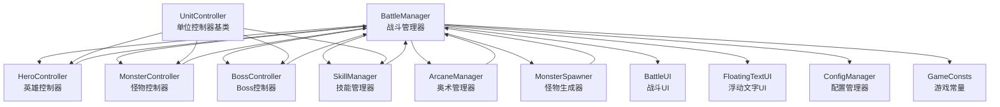
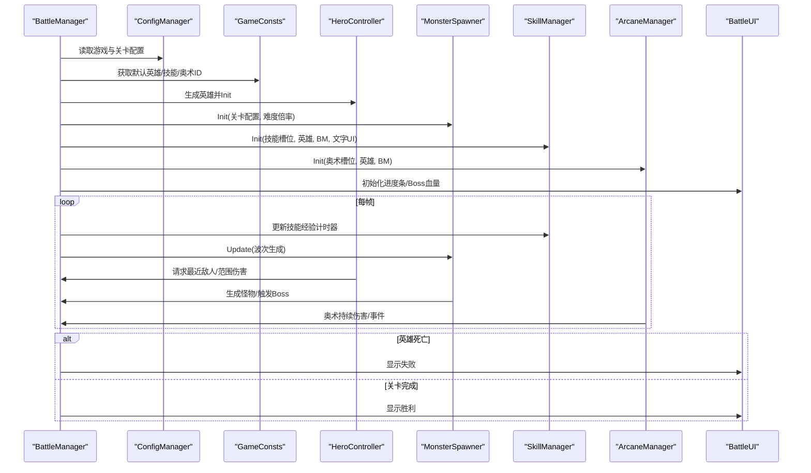
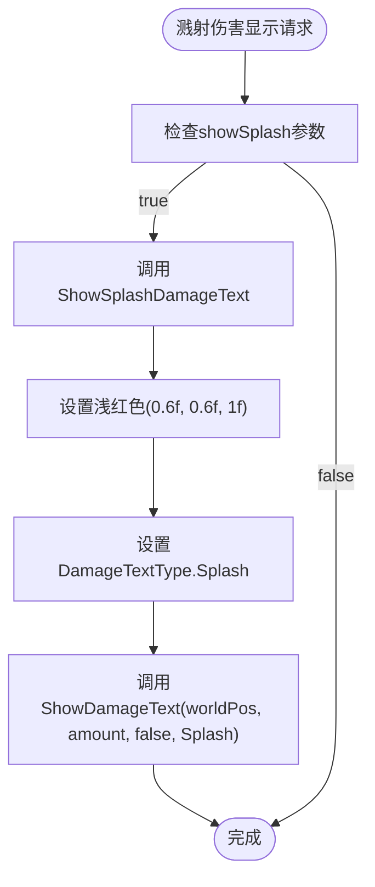
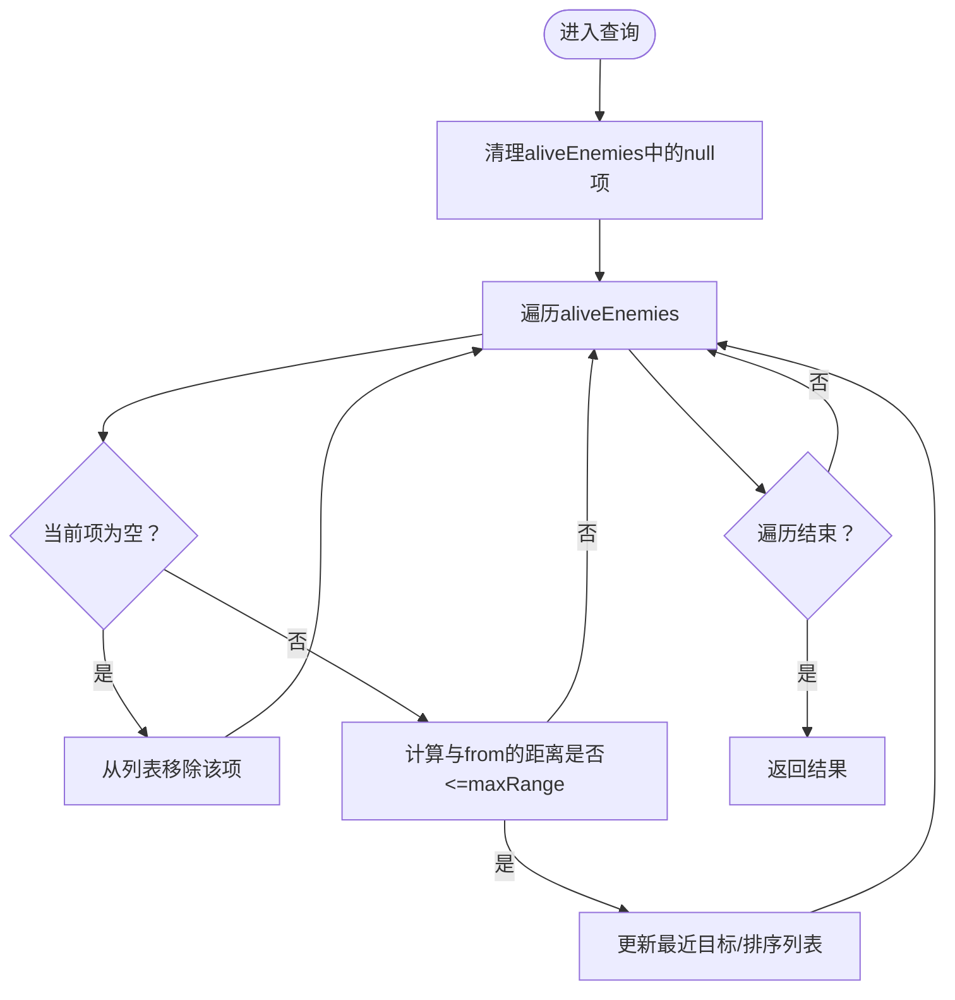
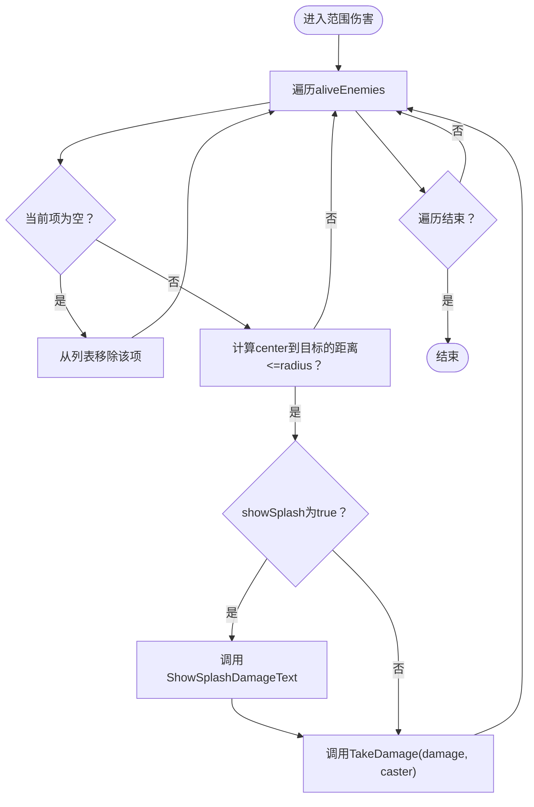
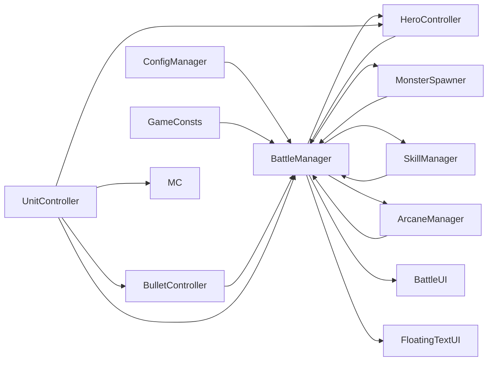

# 战斗管理器

<cite>
**本文档引用的文件**
- [BattleManager.cs](file://Assets/Scripts/Battle/BattleManager.cs)
- [HeroController.cs](file://Assets/Scripts/Battle/HeroController.cs)
- [MonsterController.cs](file://Assets/Scripts/Battle/MonsterController.cs)
- [BossController.cs](file://Assets/Scripts/Battle/BossController.cs)
- [SkillManager.cs](file://Assets/Scripts/Battle/SkillManager.cs)
- [ArcaneManager.cs](file://Assets/Scripts/Battle/ArcaneManager.cs)
- [MonsterSpawner.cs](file://Assets/Scripts/Battle/MonsterSpawner.cs)
- [DamageCalculator.cs](file://Assets/Scripts/Battle/DamageCalculator.cs)
- [AttrComponent.cs](file://Assets/Scripts/Battle/AttrComponent.cs)
- [BattleUI.cs](file://Assets/Scripts/UI/BattleUI.cs)
- [ConfigManager.cs](file://Assets/Scripts/Core/ConfigManager.cs)
- [UnitController.cs](file://Assets/Scripts/Battle/UnitController.cs)
- [SummonMonsterController.cs](file://Assets/Scripts/Battle/SummonMonsterController.cs)
- [FloatingTextUI.cs](file://Assets/Scripts/UI/FloatingTextUI.cs)
- [BulletController.cs](file://Assets/Scripts/Battle/BulletController.cs)
- [GameConsts.cs](file://Assets/Scripts/Data/GameConsts.cs)
- [ConfigTable.cs](file://Assets/Scripts/Core/ConfigTable.cs)
</cite>

## 更新摘要
**变更内容**
- 更新基于应用变更：BattleManager类中对GameConsts.MetaConsts的引用已更新为直接引用GameConsts，反映了GameConsts类结构的扁平化重构
- 移除了对MetaConsts嵌套类的引用，直接使用GameConsts中的常量和枚举
- 优化了配置表结构，Meta值现在直接存储在GameConsts中

## 目录
1. [简介](#简介)
2. [项目结构](#项目结构)
3. [核心组件](#核心组件)
4. [架构总览](#架构总览)
5. [详细组件分析](#详细组件分析)
6. [依赖关系分析](#依赖关系分析)
7. [性能考虑](#性能考虑)
8. [故障排除指南](#故障排除指南)
9. [结论](#结论)
10. [附录](#附录)

## 简介
本文件为战斗管理器（BattleManager）的详细技术文档，面向开发者与策划人员，全面阐述其职责边界、架构设计、核心流程与扩展性。文档覆盖以下主题：
- 战斗初始化流程与回合制战斗逻辑
- 战斗状态管理与结果判定
- 与HeroController、MonsterController、SkillManager、ArcaneManager的交互机制
- 公共接口设计（敌人查询、范围伤害、敌人生成）
- 性能优化策略与内存回收
- 关键算法实现路径（寻径、伤害计算、经验分配）
- 扩展性设计与新战斗场景支持
- **新增** 溅射伤害显示功能与浮动文字系统增强
- **更新** GameConsts类结构扁平化重构后的适配

## 项目结构
战斗系统位于Assets/Scripts/Battle目录下，采用"按功能模块划分"的组织方式：
- 控制器层：HeroController、MonsterController、BossController、SummonMonsterController
- 管理器层：BattleManager、SkillManager、ArcaneManager、MonsterSpawner
- 计算层：DamageCalculator、AttrComponent
- UI层：BattleUI、FloatingTextUI（新增溅射伤害显示）
- 配置层：ConfigManager（集中加载与缓存各类配置）
- 常量层：GameConsts（包含所有系统常量，包括Meta常量）

**图表来源**
- [BattleManager.cs:1-908](file://Assets/Scripts/Battle/BattleManager.cs#L1-L908)
- [HeroController.cs:1-460](file://Assets/Scripts/Battle/HeroController.cs#L1-L460)
- [MonsterController.cs:1-224](file://Assets/Scripts/Battle/MonsterController.cs#L1-L224)
- [BossController.cs:1-193](file://Assets/Scripts/Battle/BossController.cs#L1-L193)
- [SkillManager.cs:1-242](file://Assets/Scripts/Battle/SkillManager.cs#L1-L242)
- [ArcaneManager.cs:1-298](file://Assets/Scripts/Battle/ArcaneManager.cs#L1-L298)
- [MonsterSpawner.cs:1-167](file://Assets/Scripts/Battle/MonsterSpawner.cs#L1-L167)
- [BattleUI.cs:1-146](file://Assets/Scripts/UI/BattleUI.cs#L1-L146)
- [FloatingTextUI.cs:1-199](file://Assets/Scripts/UI/FloatingTextUI.cs#L1-L199)
- [ConfigManager.cs:1-619](file://Assets/Scripts/Core/ConfigManager.cs#L1-L619)
- [UnitController.cs:1-291](file://Assets/Scripts/Battle/UnitController.cs#L1-L291)
- [GameConsts.cs:185-287](file://Assets/Scripts/Data/GameConsts.cs#L185-L287)

**章节来源**
- [BattleManager.cs:145-275](file://Assets/Scripts/Battle/BattleManager.cs#L145-L275)

## 核心组件
- 战斗管理器（BattleManager）：负责战斗生命周期、敌人列表管理、范围伤害、生成接口、结果判定、UI联动与事件链处理，**新增溅射伤害显示功能**。
- 英雄控制器（HeroController）：负责英雄行为、攻击与技能释放、伤害减免与护盾、状态栏更新。
- 怪物控制器（MonsterController）：负责怪物AI、移动、近战/远程攻击、死亡回收。
- Boss控制器（BossController）：负责Boss专属AI、到达目标位置、阶段化攻击与血量UI。
- **新增** 召唤物控制器（SummonMonsterController）：负责召唤生物的生命周期、属性继承与攻击逻辑。
- 技能管理器（SkillManager）：负责技能槽位、经验分配、冷却与升级、技能使用。
- 奥术管理器（ArcaneManager）：负责符文能量、奥术放置、持续伤害与事件执行。
- 怪物生成器（MonsterSpawner）：负责波次生成、精英触发、Boss挑战阈值与通关判定。
- 伤害计算器（DamageCalculator）：统一的伤害计算公式与命中/暴击判定。
- 属性组件（AttrComponent）：属性加成、上下限约束、派生属性计算。
- 战斗UI（BattleUI）：进度条、Boss血量、胜负结算面板。
- **新增** 浮动文字UI（FloatingTextUI）：支持普通伤害与溅射伤害的专用显示效果。
- 配置管理器（ConfigManager）：集中加载与缓存所有配置，提供查询接口。
- **新增** 单位控制器基类（UnitController）：提供通用单位行为逻辑与UID管理。
- **更新** 游戏常量（GameConsts）：包含所有系统常量，包括英雄、技能、奥术、怪物等元数据常量，**移除了MetaConsts嵌套类**。

**章节来源**
- [BattleManager.cs:7-51](file://Assets/Scripts/Battle/BattleManager.cs#L7-L51)
- [HeroController.cs:7-51](file://Assets/Scripts/Battle/HeroController.cs#L7-L51)
- [MonsterController.cs:5-40](file://Assets/Scripts/Battle/MonsterController.cs#L5-L40)
- [BossController.cs:5-40](file://Assets/Scripts/Battle/BossController.cs#L5-L40)
- [SummonMonsterController.cs:1-207](file://Assets/Scripts/Battle/SummonMonsterController.cs#L1-L207)
- [SkillManager.cs:15-46](file://Assets/Scripts/Battle/SkillManager.cs#L15-L46)
- [ArcaneManager.cs:23-78](file://Assets/Scripts/Battle/ArcaneManager.cs#L23-L78)
- [MonsterSpawner.cs:6-43](file://Assets/Scripts/Battle/MonsterSpawner.cs#L6-L43)
- [DamageCalculator.cs:22-103](file://Assets/Scripts/Battle/DamageCalculator.cs#L22-L103)
- [AttrComponent.cs:6-53](file://Assets/Scripts/Battle/AttrComponent.cs#L6-L53)
- [BattleUI.cs:6-105](file://Assets/Scripts/UI/BattleUI.cs#L6-L105)
- [FloatingTextUI.cs:10-14](file://Assets/Scripts/UI/FloatingTextUI.cs#L10-L14)
- [ConfigManager.cs:6-122](file://Assets/Scripts/Core/ConfigManager.cs#L6-L122)
- [UnitController.cs:1-291](file://Assets/Scripts/Battle/UnitController.cs#L1-L291)
- [GameConsts.cs:185-287](file://Assets/Scripts/Data/GameConsts.cs#L185-L287)

## 架构总览
BattleManager作为中枢，协调各子系统：
- 初始化阶段：读取配置、生成英雄、初始化UI、启动怪物生成器与技能/奥术管理器。
- 运行阶段：每帧更新技能经验计时器；怪物生成器按波次生成敌人；英雄与怪物AI驱动；范围伤害与生成接口被调用；Boss事件链处理。
- 结束阶段：根据英雄存活与否判定胜负，暂停时间流，显示结算面板。

**图表来源**
- [BattleManager.cs:65-110](file://Assets/Scripts/Battle/BattleManager.cs#L65-L110)
- [BattleManager.cs:145-275](file://Assets/Scripts/Battle/BattleManager.cs#L145-L275)
- [MonsterSpawner.cs:55-66](file://Assets/Scripts/Battle/MonsterSpawner.cs#L55-L66)
- [ArcaneManager.cs:167-196](file://Assets/Scripts/Battle/ArcaneManager.cs#L167-L196)

## 详细组件分析

### 战斗管理器（BattleManager）
- 职责边界
  - 战斗生命周期管理（开始、结束、暂停）
  - 敌人列表维护与清理（空引用剔除）
  - 范围伤害与全屏AoE处理
  - 敌人生成接口（普通怪物、Boss、子弹、召唤物）
  - 与UI、事件系统的集成
  - Boss事件链（对话/选择）处理
  - **新增** 溅射伤害显示：支持爆炸波及伤害的专用显示效果
  - **新增** UID生成器：为每个战斗单位生成唯一标识符
- 关键接口
  - 敌人查询：GetNearestEnemy、GetNearestEnemies、GetNearestEnemiesUnique、GetNearestEnemyExcluding
  - 范围查询：GetEnemiesInRadius
  - 范围伤害：DealAoeDamage、**新增** DealAoeDamageSplash、DealFullScreenAoe
  - 生成接口：SpawnMonster、SpawnLevelBoss、SpawnHeroBullet、SpawnSkillBullet、SpawnSkillBulletDirectional、SpawnSkillBulletWithScatter、SpawnBossBullet、SpawnMonsterBullet、SpawnSummon
  - 经验分配：GrantSkillXp、OnHeroNormalAttack（已改为计时器自动）
  - 回调：OnMonsterKilled、OnBossKilled、OnLevelComplete、OnHeroDead
  - **新增** 溅射伤害显示：ShowSplashDamageText、ShowDamageText
  - **新增** UID生成：GenerateUid()
- 性能要点
  - 每帧清理aliveEnemies中的null项，避免遍历时的空引用
  - 使用HashSet进行排除过滤，减少重复计算
  - 通过ConfigManager缓存预制体与角色配置，降低资源加载开销
  - **新增** 溅射伤害显示使用专用颜色（浅红色）和动画效果，提升视觉反馈
  - **新增** UID生成器使用简单递增算法，确保唯一性且无内存开销
  - **更新** 直接引用GameConsts常量，避免MetaConsts嵌套访问的额外开销

**章节来源**
- [BattleManager.cs:48-61](file://Assets/Scripts/Battle/BattleManager.cs#L48-L61)
- [BattleManager.cs:63-101](file://Assets/Scripts/Battle/BattleManager.cs#L63-L101)
- [BattleManager.cs:277-378](file://Assets/Scripts/Battle/BattleManager.cs#L277-L378)
- [BattleManager.cs:397-453](file://Assets/Scripts/Battle/BattleManager.cs#L397-L453)
- [BattleManager.cs:446-489](file://Assets/Scripts/Battle/BattleManager.cs#L446-L489)
- [BattleManager.cs:491-525](file://Assets/Scripts/Battle/BattleManager.cs#L491-L525)
- [BattleManager.cs:527-695](file://Assets/Scripts/Battle/BattleManager.cs#L527-L695)
- [BattleManager.cs:706-786](file://Assets/Scripts/Battle/BattleManager.cs#L706-L786)

#### 溅射伤害显示算法

**图表来源**
- [BattleManager.cs:95-101](file://Assets/Scripts/Battle/BattleManager.cs#L95-L101)
- [BattleManager.cs:464-489](file://Assets/Scripts/Battle/BattleManager.cs#L464-L489)

#### 敌人查询算法

**图表来源**
- [BattleManager.cs:277-378](file://Assets/Scripts/Battle/BattleManager.cs#L277-L378)

#### 范围伤害处理（增强版）

**图表来源**
- [BattleManager.cs:464-489](file://Assets/Scripts/Battle/BattleManager.cs#L464-L489)

### 游戏常量系统（GameConsts）- 已更新
- **更新** 类结构重构
  - GameConsts现在是一个扁平化的静态类，直接包含所有常量和枚举
  - 移除了MetaConsts嵌套类，Meta值直接存储在GameConsts中
  - 包含单位阵营、单位类型、动画状态、游戏速度、窗口类型等枚举
  - 包含英雄、技能、奥术、怪物等元数据常量
- 关键常量
  - 默认英雄ID：GameConsts.DefaultHeroId
  - 技能槽位ID数组：GameConsts.SkillSlotIds
  - 奥术槽位ID数组：GameConsts.ArcaneSlotIds
  - Boss怪物ID：GameConsts.BossMonsterId
  - Boss击杀阈值：GameConsts.KillCountForBoss
  - 怪物生成间隔：GameConsts.MonsterSpawnInterval
- 在BattleManager中的使用
  - 获取默认英雄ID：GameConsts.DefaultHeroId
  - 获取默认技能槽位：GameConsts.SkillSlotIds
  - 获取默认奥术槽位：GameConsts.ArcaneSlotIds

**章节来源**
- [GameConsts.cs:185-287](file://Assets/Scripts/Data/GameConsts.cs#L185-L287)
- [BattleManager.cs:195](file://Assets/Scripts/Battle/BattleManager.cs#L195)
- [BattleManager.cs:255](file://Assets/Scripts/Battle/BattleManager.cs#L255)
- [BattleManager.cs:280](file://Assets/Scripts/Battle/BattleManager.cs#L280)

### 配置表系统（ConfigTable）- 已更新
- **更新** Meta值存储位置变更
  - ConfigTable注释指出Meta值现在存储在GameConsts中
  - 不再需要通过MetaConsts访问元数据常量
  - 保持了原有的配置表结构和功能

**章节来源**
- [ConfigTable.cs:9](file://Assets/Scripts/Core/ConfigTable.cs#L9)

### 浮动文字UI系统（新增）
- 职责边界
  - 支持普通伤害与溅射伤害的专用显示效果
  - 提供伤害数字的动画与视觉反馈
  - 管理文字对象的生命周期与销毁
- 关键功能
  - **新增** DamageTextType枚举：Normal（普通）和 Splash（溅射）
  - **新增** 溅射效果动画：快速缩放、回弹、淡出的组合动画
  - 普通伤害动画：从头顶快速飘过并渐隐
  - 随机偏移与左右交替显示，避免文字重叠
- 与战斗管理器交互
  - 通过ShowDamageText方法接收伤害显示请求
  - 支持不同类型的伤害显示效果

**章节来源**
- [FloatingTextUI.cs:10-14](file://Assets/Scripts/UI/FloatingTextUI.cs#L10-L14)
- [FloatingTextUI.cs:23-90](file://Assets/Scripts/UI/FloatingTextUI.cs#L23-L90)
- [FloatingTextUI.cs:124-196](file://Assets/Scripts/UI/FloatingTextUI.cs#L124-L196)

### 单位控制器基类（UnitController）
- 职责边界
  - 提供所有战斗单位的通用行为逻辑
  - **新增** UID管理：为每个单位分配唯一标识符
  - 属性系统集成：与AttrComponent协作
  - Buff系统管理：处理状态效果
  - 动画与朝向控制：与Animator和CharacterFacing协作
- 关键功能
  - **新增** UID生成：通过battleManager.GenerateUid()获取唯一ID
  - 阵营与类型管理：使用GameConsts.UnitGroup和GameConsts.UnitType枚举
  - 通用攻击逻辑：技能选择、冷却管理、伤害计算
  - 受伤与死亡处理：血量管理、状态栏更新、销毁逻辑
- 与战斗管理器交互
  - 通过GenerateUid()获取唯一标识符
  - 通过BattleManager访问全局系统

**章节来源**
- [UnitController.cs:22-90](file://Assets/Scripts/Battle/UnitController.cs#L22-L90)
- [UnitController.cs:84-90](file://Assets/Scripts/Battle/UnitController.cs#L84-L90)

### 英雄控制器（HeroController）
- 行为与状态
  - 攻击间隔驱动、蓄力状态、冷却计时
  - 技能分类路由（召唤、护盾、自身、弹幕、AoE）
  - 伤害减免、护盾吸收、无敌免疫
  - 伤害文本显示、状态栏更新
- 与战斗管理器交互
  - 使用GetNearestEnemies系列查询目标
  - 通过SpawnSkillBullet/方向/散射接口发射子弹
  - 通过DealFullScreenAoe执行全屏AoE伤害
  - **新增** 使用UID进行单位追踪
- 伤害计算
  - 基于AttrComponent的最终攻击值与技能比例
  - 合并子弹事件与敌方事件，支持弹幕与爆发

**章节来源**
- [HeroController.cs:61-87](file://Assets/Scripts/Battle/HeroController.cs#L61-L87)
- [HeroController.cs:171-200](file://Assets/Scripts/Battle/HeroController.cs#L171-L200)

### 怪物控制器（MonsterController）
- AI与行为
  - 近战/远程切换、追击与攻击
  - 技能冷却与技能攻击（远程子弹）
  - 冰冻状态下的移动限制
- 死亡与回收
  - 触发OnMonsterKilled回调，移除aliveEnemies项
  - 销毁对象以释放内存
- **新增** UID管理
  - 通过InitUnit()方法获取唯一标识符
  - 使用GameConsts.UnitGroup.Enemy和GameConsts.UnitType.Monster

**章节来源**
- [MonsterController.cs:34-79](file://Assets/Scripts/Battle/MonsterController.cs#L34-L79)
- [MonsterController.cs:198-200](file://Assets/Scripts/Battle/MonsterController.cs#L198-L200)

### Boss控制器（BossController）
- 特殊AI
  - 先移动到目标位置再攻击
  - 技能冷却与攻击间隔控制
  - 血量UI同步更新
- 死亡与事件链
  - 触发OnBossKilled回调
  - 进入Boss事件链（对话/选择）
- **新增** UID管理
  - 通过InitUnit()方法获取唯一标识符
  - 使用GameConsts.UnitGroup.Enemy和GameConsts.UnitType.Boss

**章节来源**
- [BossController.cs:30-59](file://Assets/Scripts/Battle/BossController.cs#L30-L59)
- [BossController.cs:167-170](file://Assets/Scripts/Battle/BossController.cs#L167-L170)

### 召唤物控制器（SummonMonsterController）
- **新增** 功能特性
  - 召唤生物的生命周期管理
  - 属性继承机制：从召唤者继承属性并按比例缩放
  - 自动销毁：基于持续时间的生存控制
  - 追踪能力：可选择是否具有追踪目标的能力
- 与战斗管理器交互
  - 通过GenerateUid()获取唯一标识符
  - 使用GetNearestEnemy()查询目标
  - 通过BattleManager.SpawnBossBullet()发射子弹
- 属性系统
  - 支持从召唤者继承属性
  - 支持配置中定义的属性覆盖
  - 自动计算最大生命值

**章节来源**
- [SummonMonsterController.cs:52-110](file://Assets/Scripts/Battle/SummonMonsterController.cs#L52-L110)
- [SummonMonsterController.cs:185-192](file://Assets/Scripts/Battle/SummonMonsterController.cs#L185-L192)

### 技能管理器（SkillManager）
- 技能槽位与经验
  - 槽位状态（等级、经验、冷却）
  - 随机经验分配与升级
  - 可用槽位选择
- 技能使用
  - 冷却检查、配置读取、使用后重置冷却
- 与战斗管理器协作
  - 通过计时器自动发放经验
  - 由英雄调用UseSkill触发

**章节来源**
- [SkillManager.cs:42-70](file://Assets/Scripts/Battle/SkillManager.cs#L42-L70)
- [SkillManager.cs:87-137](file://Assets/Scripts/Battle/SkillManager.cs#L87-L137)
- [SkillManager.cs:139-183](file://Assets/Scripts/Battle/SkillManager.cs#L139-L183)
- [SkillManager.cs:185-239](file://Assets/Scripts/Battle/SkillManager.cs#L185-L239)

### 奥术管理器（ArcaneManager）
- 能量与符文
  - 通过技能使用获得能量，累积转换为符文
  - 成本修正（Buff影响）
- 奥术放置与持续伤害
  - 放置后创建ActiveArcane，按tick间隔执行
  - 全屏或范围伤害，附加敌方事件
- 与战斗管理器协作
  - 调用DealFullScreenAoe与GetEnemiesInRadius

**章节来源**
- [ArcaneManager.cs:39-56](file://Assets/Scripts/Battle/ArcaneManager.cs#L39-L56)
- [ArcaneManager.cs:80-106](file://Assets/Scripts/Battle/ArcaneManager.cs#L80-L106)
- [ArcaneManager.cs:119-165](file://Assets/Scripts/Battle/ArcaneManager.cs#L119-L165)
- [ArcaneManager.cs:167-196](file://Assets/Scripts/Battle/ArcaneManager.cs#L167-L196)
- [ArcaneManager.cs:198-256](file://Assets/Scripts/Battle/ArcaneManager.cs#L198-L256)

### 怪物生成器（MonsterSpawner）
- 波次生成
  - 定时生成、精英触发、Boss阈值
- 通关判定
  - 最后一个Boss被击败后停止生成并触发通关

**章节来源**
- [MonsterSpawner.cs:25-43](file://Assets/Scripts/Battle/MonsterSpawner.cs#L25-L43)
- [MonsterSpawner.cs:55-66](file://Assets/Scripts/Battle/MonsterSpawner.cs#L55-L66)
- [MonsterSpawner.cs:68-83](file://Assets/Scripts/Battle/MonsterSpawner.cs#L68-L83)
- [MonsterSpawner.cs:85-109](file://Assets/Scripts/Battle/MonsterSpawner.cs#L85-L109)
- [MonsterSpawner.cs:117-145](file://Assets/Scripts/Battle/MonsterSpawner.cs#L117-L145)

### 伤害计算器（DamageCalculator）
- 计算流程
  - 命中率与闪避
  - 基础伤害（攻击×比例）
  - 元素增伤/减伤
  - 暴击率与抗性、倍率修正
  - Boss/精英额外增伤
  - 最终伤害取整
- 复杂度
  - 时间复杂度O(1)，空间复杂度O(1)

**章节来源**
- [DamageCalculator.cs:24-103](file://Assets/Scripts/Battle/DamageCalculator.cs#L24-L103)

### 属性组件（AttrComponent）
- 功能
  - 基础属性、加成属性、上下限约束
  - 派生属性（最大生命、攻击力、攻速、移速）
- 与伤害系统协作
  - 提供最终攻击值、攻速、元素抗性等

**章节来源**
- [AttrComponent.cs:11-53](file://Assets/Scripts/Battle/AttrComponent.cs#L11-L53)
- [AttrComponent.cs:88-114](file://Assets/Scripts/Battle/AttrComponent.cs#L88-L114)

### 战斗UI（BattleUI）
- 功能
  - 普通模式进度条与文字
  - Boss模式血量条与文字
  - 胜负结算面板与返回按钮
- 与战斗管理器协作
  - 接收进度更新与Boss血量更新
  - 显示结果面板

**章节来源**
- [BattleUI.cs:33-105](file://Assets/Scripts/UI/BattleUI.cs#L33-L105)
- [BattleUI.cs:107-119](file://Assets/Scripts/UI/BattleUI.cs#L107-L119)
- [BattleUI.cs:121-143](file://Assets/Scripts/UI/BattleUI.cs#L121-L143)

### 配置管理器（ConfigManager）
- 功能
  - 加载并缓存所有配置（英雄、怪物、技能、关卡、角色等）
  - 提供查询接口（技能、怪物、角色、子弹样式、事件等）
  - 预加载预制体与角色配置
- 与战斗管理器协作
  - 读取关卡配置、难度倍率
  - 获取角色与子弹预制体
  - 获取Boss事件配置

**章节来源**
- [ConfigManager.cs:77-122](file://Assets/Scripts/Core/ConfigManager.cs#L77-L122)
- [ConfigManager.cs:148-160](file://Assets/Scripts/Core/ConfigManager.cs#L148-L160)
- [ConfigManager.cs:217-234](file://Assets/Scripts/Core/ConfigManager.cs#L217-L234)
- [ConfigManager.cs:236-256](file://Assets/Scripts/Core/ConfigManager.cs#L236-L256)
- [ConfigManager.cs:316-322](file://Assets/Scripts/Core/ConfigManager.cs#L316-L322)
- [ConfigManager.cs:350-370](file://Assets/Scripts/Core/ConfigManager.cs#L350-L370)

## 依赖关系分析
- BattleManager依赖
  - ConfigManager：读取配置、获取预制体与角色配置
  - HeroController：英雄行为与技能释放
  - MonsterSpawner：波次生成与Boss触发
  - SkillManager：技能经验与槽位管理
  - ArcaneManager：符文能量与持续伤害
  - BattleUI：进度条与结算面板
  - **新增** FloatingTextUI：溅射伤害显示
  - **更新** GameConsts：直接获取默认英雄、技能、奥术ID
- 控制器间耦合
  - HeroController通过BattleManager查询敌人与发射子弹
  - MonsterController/BossController通过BattleManager回传击杀/死亡事件
  - ArcaneManager通过BattleManager执行范围伤害与查询敌人
  - **新增** BulletController通过BattleManager执行溅射伤害
  - **新增** 所有UnitController子类通过BattleManager.GenerateUid()获取唯一ID
- 外部依赖
  - 配置文件（JSON）与Resources资源加载
  - Unity动画与UI组件

**图表来源**
- [BattleManager.cs:145-275](file://Assets/Scripts/Battle/BattleManager.cs#L145-L275)
- [HeroController.cs:240-281](file://Assets/Scripts/Battle/HeroController.cs#L240-L281)
- [MonsterController.cs:274-277](file://Assets/Scripts/Battle/MonsterController.cs#L274-L277)
- [ArcaneManager.cs:208-256](file://Assets/Scripts/Battle/ArcaneManager.cs#L208-L256)
- [BulletController.cs:231-235](file://Assets/Scripts/Battle/BulletController.cs#L231-L235)
- [UnitController.cs:84-90](file://Assets/Scripts/Battle/UnitController.cs#L84-L90)

## 性能考虑
- 敌人列表管理
  - 每帧清理aliveEnemies中的null项，避免无效遍历
  - 使用HashSet进行排除过滤，降低重复计算
- 内存回收
  - 怪物与Boss死亡后立即销毁对象
  - ConfigManager缓存预制体与角色配置，减少重复加载
- 计时器优化
  - 技能经验计时器每帧更新，但仅在到期时执行经验发放
  - ArcaneManager的tick计时器按间隔触发，避免每帧全量扫描
- 避免频繁GC
  - 复用List与数组，减少临时对象创建
  - 使用Sort比较器与直接索引访问，避免LINQ等高开销操作
- **新增** 溅射伤害显示优化
  - 使用专用颜色常量，避免重复计算
  - 浮动文字对象使用协程异步销毁，避免阻塞主线程
  - 溅射效果动画使用lerp插值，保证流畅性
- **新增** UID生成器优化
  - 使用简单递增算法，无内存分配开销
  - 确保ID唯一性且生成速度快
- **更新** GameConsts访问优化
  - 直接访问GameConsts常量，避免MetaConsts嵌套访问的额外开销
  - 扁平化结构减少了属性访问层级

**章节来源**
- [BattleManager.cs:70-110](file://Assets/Scripts/Battle/BattleManager.cs#L70-L110)
- [BattleManager.cs:304-327](file://Assets/Scripts/Battle/BattleManager.cs#L304-L327)
- [MonsterController.cs:274-279](file://Assets/Scripts/Battle/MonsterController.cs#L274-L279)
- [BossController.cs:262-267](file://Assets/Scripts/Battle/BossController.cs#L262-L267)
- [ArcaneManager.cs:167-196](file://Assets/Scripts/Battle/ArcaneManager.cs#L167-L196)
- [FloatingTextUI.cs:78-196](file://Assets/Scripts/UI/FloatingTextUI.cs#L78-L196)

## 故障排除指南
- 英雄无法释放技能
  - 检查SkillManager槽位等级与冷却状态
  - 确认HeroController未处于冻结/无敌等异常状态
- 敌人不生成
  - 检查MonsterSpawner是否处于停止状态或Boss激活
  - 确认关卡配置的monsterList与superMList存在且合法
- Boss事件未触发
  - 确认StoryManager处于冒险模式且存在Boss事件
  - 检查OnBossKilled后的流程是否正确推进
- 范围伤害无效
  - 检查中心点与半径参数
  - 确认目标在aliveEnemies中且未被清理
  - **新增** 检查showSplash参数是否正确传递
- UI不更新
  - 检查BattleUI是否正确初始化与接收回调
  - 确认OnMonsterKilled/OnBossKilled等回调被调用
- **新增** 溅射伤害显示问题
  - 检查FloatingTextUI是否正确初始化
  - 确认DamageTextType枚举值为Splash
  - 验证ShowSplashDamageText方法被正确调用
  - 检查溅射效果的颜色与动画是否正常
- **新增** UID相关问题
  - 检查GenerateUid()方法是否正常调用
  - 确认UnitController.InitUnit()正确初始化UID
  - 验证UID在单位生命周期内的唯一性
- **更新** GameConsts访问问题
  - 确认BattleManager正确引用GameConsts而非GameConsts.MetaConsts
  - 检查GameConsts中的常量是否正确初始化
  - 验证Meta常量（英雄、技能、奥术ID）是否可用

**章节来源**
- [SkillManager.cs:87-137](file://Assets/Scripts/Battle/SkillManager.cs#L87-L137)
- [MonsterSpawner.cs:45-53](file://Assets/Scripts/Battle/MonsterSpawner.cs#L45-L53)
- [BattleManager.cs:706-761](file://Assets/Scripts/Battle/BattleManager.cs#L706-L761)
- [BattleManager.cs:397-453](file://Assets/Scripts/Battle/BattleManager.cs#L397-L453)
- [BattleUI.cs:33-105](file://Assets/Scripts/UI/BattleUI.cs#L33-L105)
- [FloatingTextUI.cs:10-14](file://Assets/Scripts/UI/FloatingTextUI.cs#L10-L14)
- [BattleManager.cs:95-101](file://Assets/Scripts/Battle/BattleManager.cs#L95-L101)

## 结论
BattleManager通过清晰的职责划分与模块化设计，实现了回合制战斗的核心流程：初始化、生成、战斗、事件与结算。其公共接口覆盖了敌人查询、范围伤害与生成三大类能力，并通过SkillManager与ArcaneManager提供了可扩展的技能与机制。**新增的溅射伤害显示功能**通过FloatingTextUI系统实现了爆炸波及伤害的专用视觉效果，提升了游戏体验。**新增的UID生成器功能**进一步增强了战斗系统的追踪能力，为后续的单位管理、状态持久化和调试提供了坚实基础。**更新的GameConsts类结构扁平化重构**简化了常量访问，提高了代码可读性和维护性。性能方面，通过每帧清理、内存回收、计时器优化、溅射伤害显示优化与GameConsts访问优化确保了稳定运行。建议在新增战斗场景时，遵循现有接口与事件链模式，保持低耦合与高内聚。

## 附录
- 关键算法实现路径
  - 敌人寻径与查询：[BattleManager.cs:277-378](file://Assets/Scripts/Battle/BattleManager.cs#L277-L378)
  - 范围伤害计算（增强版）：[BattleManager.cs:446-489](file://Assets/Scripts/Battle/BattleManager.cs#L446-L489)
  - 伤害计算公式：[DamageCalculator.cs:24-103](file://Assets/Scripts/Battle/DamageCalculator.cs#L24-L103)
  - 经验分配与升级：[SkillManager.cs:139-183](file://Assets/Scripts/Battle/SkillManager.cs#L139-L183)
  - 奥术持续伤害：[ArcaneManager.cs:198-256](file://Assets/Scripts/Battle/ArcaneManager.cs#L198-L256)
  - **新增** 溅射伤害显示：[BattleManager.cs:95-101](file://Assets/Scripts/Battle/BattleManager.cs#L95-L101)
  - **新增** 浮动文字动画：[FloatingTextUI.cs:124-196](file://Assets/Scripts/UI/FloatingTextUI.cs#L124-L196)
  - **新增** UID生成算法：[BattleManager.cs:58-61](file://Assets/Scripts/Battle/BattleManager.cs#L58-L61)
  - **新增** 单位初始化流程：[UnitController.cs:84-90](file://Assets/Scripts/Battle/UnitController.cs#L84-L90)
  - **更新** GameConsts常量访问：[BattleManager.cs:195](file://Assets/Scripts/Battle/BattleManager.cs#L195), [BattleManager.cs:255](file://Assets/Scripts/Battle/BattleManager.cs#L255), [BattleManager.cs:280](file://Assets/Scripts/Battle/BattleManager.cs#L280)
- 扩展性建议
  - 新增战斗场景：通过LevelConfig扩展波次与Boss阈值，复用MonsterSpawner与BattleManager
  - 新增技能/机制：通过SkillManager与ArcaneManager的槽位与事件系统扩展
  - 新增敌人类型：新增控制器并接入aliveEnemies管理与回调
  - **新增** 新增单位类型：继承UnitController基类，自动获得UID管理能力
  - **新增** 新增伤害类型：扩展DamageTextType枚举以支持更多视觉效果
  - **新增** 新增溅射效果：通过DealAoeDamageSplash方法支持爆炸波及伤害的专用显示
  - **更新** 新增常量：在GameConsts中直接添加新的系统常量，无需通过MetaConsts嵌套访问