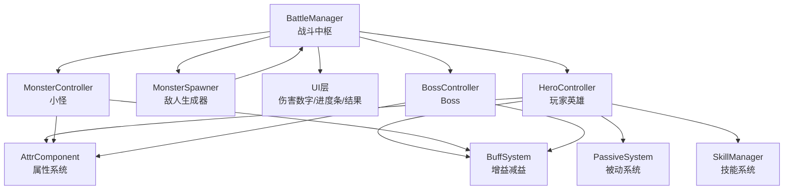
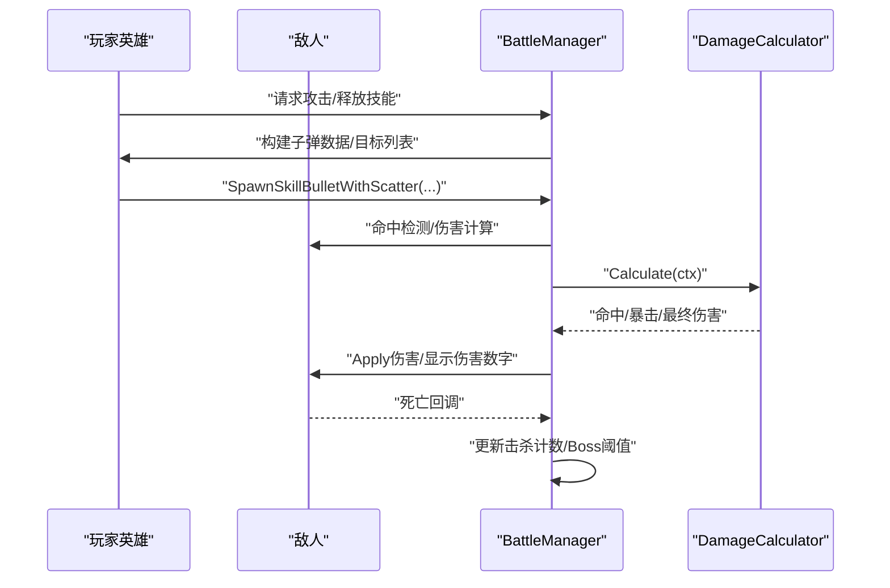
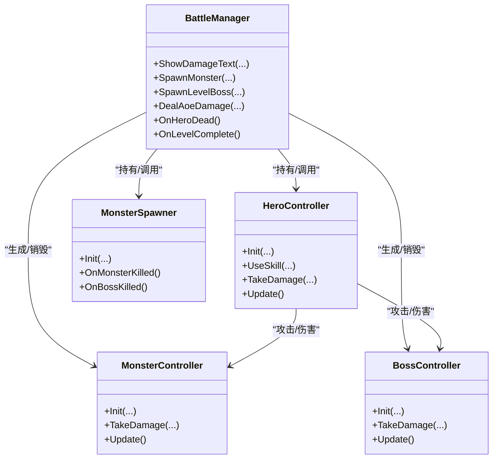
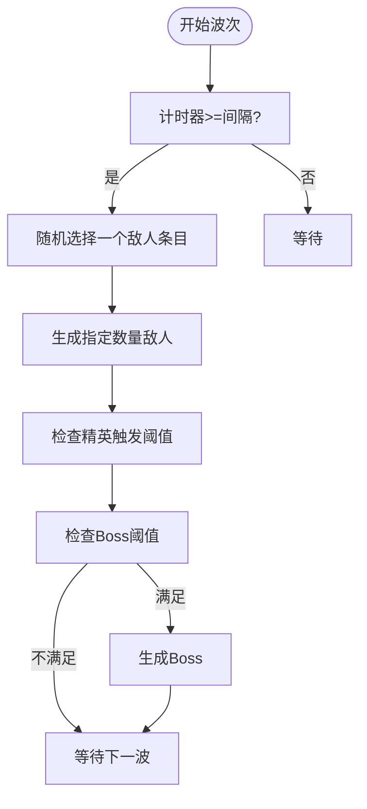
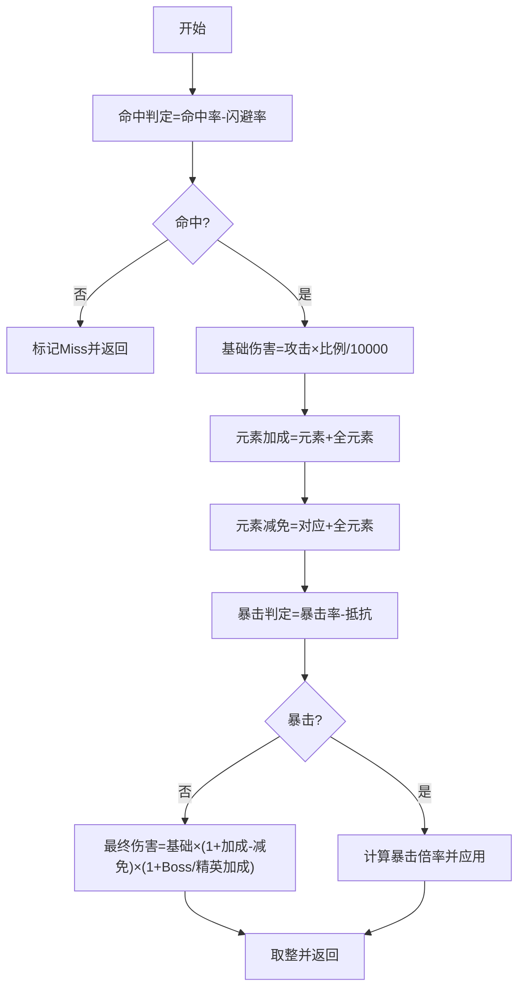
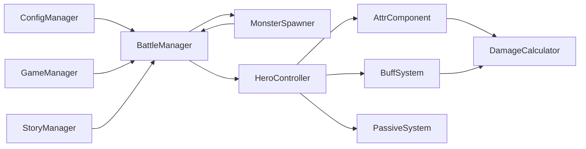

# 战斗系统

<cite>
**本文档引用的文件**
- [BattleManager.cs](file://Assets/Scripts/Battle/BattleManager.cs)
- [HeroController.cs](file://Assets/Scripts/Battle/HeroController.cs)
- [MonsterController.cs](file://Assets/Scripts/Battle/MonsterController.cs)
- [BossController.cs](file://Assets/Scripts/Battle/BossController.cs)
- [MonsterSpawner.cs](file://Assets/Scripts/Battle/MonsterSpawner.cs)
- [AttrComponent.cs](file://Assets/Scripts/Battle/AttrComponent.cs)
- [BuffSystem.cs](file://Assets/Scripts/Battle/BuffSystem.cs)
- [PassiveSystem.cs](file://Assets/Scripts/Battle/PassiveSystem.cs)
- [DamageCalculator.cs](file://Assets/Scripts/Battle/DamageCalculator.cs)
- [SkillManager.cs](file://Assets/Scripts/Battle/SkillManager.cs)
- [attribute_config.json](file://Assets/Resources/Configs/attribute_config.json)
- [buff_config.json](file://Assets/Resources/Configs/buff_config.json)
- [skill_config.json](file://Assets/Resources/Configs/skill_config.json)
- [monster_config.json](file://Assets/Resources/Configs/monster_config.json)
- [level_config.json](file://Assets/Resources/Configs/level_config.json)
</cite>

## 目录
1. [简介](#简介)
2. [项目结构](#项目结构)
3. [核心组件](#核心组件)
4. [架构总览](#架构总览)
5. [详细组件分析](#详细组件分析)
6. [依赖关系分析](#依赖关系分析)
7. [性能考量](#性能考量)
8. [故障排查指南](#故障排查指南)
9. [结论](#结论)
10. [附录](#附录)

## 简介
本文件系统化梳理 GeometryTD 的回合制战斗机制与实时战斗融合的实现，覆盖战斗状态管理、行动顺序控制、回合切换逻辑；角色控制器（HeroController、MonsterController、BossController）的职责与协作；敌人生成系统（MonsterSpawner）的波次管理与难度递增；伤害计算（包含命中、暴击、元素抗性与加成）与 Buff/被动影响；以及战斗结果判定与奖励分配。同时提供扩展性设计说明，指导如何新增敌人类型、Boss 挑战与特殊战斗场景。

## 项目结构
战斗系统主要位于 Assets/Scripts/Battle 目录下，围绕 BattleManager 作为中枢协调各子系统：
- BattleManager：战斗生命周期、生成与销毁、UI 更新、Boss 事件链、奖励发放
- 角色控制器：HeroController（玩家）、MonsterController（小怪）、BossController（Boss）
- 生成器：MonsterSpawner（波次、精英、Boss 触发）
- 属性与效果：AttrComponent（属性基值/加成/派生）、BuffSystem（增益减益）、PassiveSystem（被动触发）
- 计算器：DamageCalculator（伤害、命中、暴击、元素抗性）
- 技能系统：SkillManager（技能槽、经验、冷却）

图表来源
- [BattleManager.cs:1-805](file://Assets/Scripts/Battle/BattleManager.cs#L1-L805)
- [HeroController.cs:1-514](file://Assets/Scripts/Battle/HeroController.cs#L1-L514)
- [MonsterController.cs:1-290](file://Assets/Scripts/Battle/MonsterController.cs#L1-L290)
- [BossController.cs:1-278](file://Assets/Scripts/Battle/BossController.cs#L1-L278)
- [MonsterSpawner.cs:1-167](file://Assets/Scripts/Battle/MonsterSpawner.cs#L1-L167)

章节来源
- [BattleManager.cs:145-275](file://Assets/Scripts/Battle/BattleManager.cs#L145-L275)

## 核心组件
- 战斗中枢 BattleManager：负责初始化、生成敌人与子弹、AOE 伤害、Boss 事件链、胜利/失败判定、UI 更新与奖励发放
- 英雄 HeroController：负责普攻与技能释放、蓄力状态、护盾、伤害吸收、伤害文本显示、事件执行
- 小怪 MonsterController：负责寻路、近战或远程攻击、死亡回收
- Boss BossController：负责移动到目标位置、定点攻击、Boss 血量 UI 更新
- 生成器 MonsterSpawner：负责按波次生成普通敌人、精英敌人、Boss 触发与通关判定
- 属性 AttrComponent：提供属性基值、加成、派生属性（如最大生命、攻击力、攻速、移速）
- 增益减益 BuffSystem：统一管理 Buff 生命周期、叠层、属性加成、跳伤、特殊效果（冻结、无敌、反击等）
- 被动 PassiveSystem：被动触发、条件判断、移除策略
- 伤害计算器 DamageCalculator：命中、闪避、元素加成/减免、暴击、Boss/精英加成
- 技能系统 SkillManager：技能槽、等级、经验、冷却、使用流程

章节来源
- [HeroController.cs:85-138](file://Assets/Scripts/Battle/HeroController.cs#L85-L138)
- [MonsterController.cs:62-120](file://Assets/Scripts/Battle/MonsterController.cs#L62-L120)
- [BossController.cs:63-118](file://Assets/Scripts/Battle/BossController.cs#L63-L118)
- [MonsterSpawner.cs:25-43](file://Assets/Scripts/Battle/MonsterSpawner.cs#L25-L43)
- [AttrComponent.cs:11-53](file://Assets/Scripts/Battle/AttrComponent.cs#L11-L53)
- [BuffSystem.cs:34-84](file://Assets/Scripts/Battle/BuffSystem.cs#L34-L84)
- [PassiveSystem.cs:18-39](file://Assets/Scripts/Battle/PassiveSystem.cs#L18-L39)
- [DamageCalculator.cs:24-103](file://Assets/Scripts/Battle/DamageCalculator.cs#L24-L103)
- [SkillManager.cs:48-70](file://Assets/Scripts/Battle/SkillManager.cs#L48-L70)

## 架构总览
战斗系统采用“中枢协调 + 角色自治”的架构：
- BattleManager 作为全局中枢，统一调度生成、销毁、UI、事件与奖励
- 角色控制器各自维护状态机（移动、攻击、技能、死亡），通过 AttrComponent 与 BuffSystem 协作
- 生成器独立于战斗循环外，按固定间隔触发生成
- 计算器与系统以纯函数方式提供可复用的计算能力

图表来源
- [HeroController.cs:207-281](file://Assets/Scripts/Battle/HeroController.cs#L207-L281)
- [BattleManager.cs:495-568](file://Assets/Scripts/Battle/BattleManager.cs#L495-L568)
- [DamageCalculator.cs:24-103](file://Assets/Scripts/Battle/DamageCalculator.cs#L24-L103)

## 详细组件分析

### 战斗状态管理与回合/节奏控制
- 初始化与难度：BattleManager 读取关卡配置与难度系数，初始化英雄、生成器、技能与奥术系统，并加载背景
- 波次与生成：MonsterSpawner 按固定间隔生成普通敌人，精英敌人按击杀数阈值触发，Boss 在达到击杀阈值后出现
- 技能经验：HeroController 不再直接通过普攻获得经验，改为由 BattleManager 定时向随机技能槽发放经验，形成稳定的节奏
- 结束判定：Boss 被击杀后继续下一波 Boss 或通关；英雄死亡则游戏暂停并显示失败界面

章节来源
- [BattleManager.cs:145-275](file://Assets/Scripts/Battle/BattleManager.cs#L145-L275)
- [BattleManager.cs:625-637](file://Assets/Scripts/Battle/BattleManager.cs#L625-L637)
- [MonsterSpawner.cs:55-66](file://Assets/Scripts/Battle/MonsterSpawner.cs#L55-L66)
- [MonsterSpawner.cs:111-144](file://Assets/Scripts/Battle/MonsterSpawner.cs#L111-L144)

### 行动顺序与角色控制器协作
- 英雄：每帧更新 Buff、蓄力状态、攻击冷却；根据攻击技能配置与目标范围进行射击；支持多段弹幕与散射
- 小怪：根据是否拥有技能分为近战与远程；远程时按技能冷却与攻击间隔进行射击；近战时接近英雄后造成接触伤害
- Boss：先移动到目标位置，到达后按固定攻击间隔进行定点攻击；Boss 血量变化会同步 UI

图表来源
- [BattleManager.cs:1-805](file://Assets/Scripts/Battle/BattleManager.cs#L1-L805)
- [HeroController.cs:85-138](file://Assets/Scripts/Battle/HeroController.cs#L85-L138)
- [MonsterController.cs:62-120](file://Assets/Scripts/Battle/MonsterController.cs#L62-L120)
- [BossController.cs:63-118](file://Assets/Scripts/Battle/BossController.cs#L63-L118)
- [MonsterSpawner.cs:25-43](file://Assets/Scripts/Battle/MonsterSpawner.cs#L25-L43)

章节来源
- [HeroController.cs:147-176](file://Assets/Scripts/Battle/HeroController.cs#L147-L176)
- [MonsterController.cs:128-198](file://Assets/Scripts/Battle/MonsterController.cs#L128-L198)
- [BossController.cs:126-183](file://Assets/Scripts/Battle/BossController.cs#L126-L183)

### 敌人生成系统（MonsterSpawner）
- 波次管理：按关卡配置的 spawn_interval 固定刷新，从 monsterList 中随机选取敌人生成
- 精英触发：根据 superMList 的 num 阈值与累计生成数触发精英敌人
- Boss 切换：按 bossList 的 num 阈值依次触发 Boss；Boss 被击杀后继续下一阶段
- 关停策略：Boss 全部击杀后停止生成并触发通关

图表来源
- [MonsterSpawner.cs:68-83](file://Assets/Scripts/Battle/MonsterSpawner.cs#L68-L83)
- [MonsterSpawner.cs:85-109](file://Assets/Scripts/Battle/MonsterSpawner.cs#L85-L109)
- [MonsterSpawner.cs:117-129](file://Assets/Scripts/Battle/MonsterSpawner.cs#L117-L129)

章节来源
- [MonsterSpawner.cs:25-43](file://Assets/Scripts/Battle/MonsterSpawner.cs#L25-L43)
- [MonsterSpawner.cs:131-144](file://Assets/Scripts/Battle/MonsterSpawner.cs#L131-L144)

### 伤害计算系统（命中/闪避/元素/暴击）
伤害计算遵循以下步骤：
1) 命中判定：命中率 - 闪避率，若低于阈值则 Miss
2) 基础伤害：攻击 × 技能伤害比例 / 10000
3) 元素加成：攻击侧元素伤害加成 + 全元素伤害加成
4) 元素减免：防御侧对应元素伤害减免 + 全元素伤害减免
5) 暴击判定：攻击侧暴击率 - 防御侧暴击抵抗，产生暴击倍率（考虑暴击伤害抵抗）
6) Boss/精英加成：根据目标类型追加伤害加成
7) 最终伤害：取最大 0 的整数结果

图表来源
- [DamageCalculator.cs:24-103](file://Assets/Scripts/Battle/DamageCalculator.cs#L24-L103)

章节来源
- [DamageCalculator.cs:5-21](file://Assets/Scripts/Battle/DamageCalculator.cs#L5-L21)
- [attribute_config.json:1-39](file://Assets/Resources/Configs/attribute_config.json#L1-L39)

### 属性系统与 Buff/被动影响
- 属性系统 AttrComponent
  - 提供基值与加成的分离存储，支持上限/下限约束
  - 派生属性：最大生命、攻击力、攻速、移速
- BuffSystem
  - 统一管理 Buff 的叠加、持续时间、跳伤与特殊效果（冻结、无敌、反击等）
  - 对属性加成进行重算，确保每帧生效
  - 提供技能伤害修正、奥术消耗修正、额外子弹事件收集
- PassiveSystem
  - 被动注册与触发，支持条件判断与移除策略（按触发次数或特定触发码）

章节来源
- [AttrComponent.cs:11-53](file://Assets/Scripts/Battle/AttrComponent.cs#L11-L53)
- [BuffSystem.cs:34-84](file://Assets/Scripts/Battle/BuffSystem.cs#L34-L84)
- [BuffSystem.cs:227-248](file://Assets/Scripts/Battle/BuffSystem.cs#L227-L248)
- [PassiveSystem.cs:18-39](file://Assets/Scripts/Battle/PassiveSystem.cs#L18-L39)

### 技能与经验系统（SkillManager）
- 技能槽位：每个槽位记录等级、经验、冷却剩余时间
- 使用流程：校验等级与冷却，读取配置后交由英雄控制器执行
- 经验发放：BattleManager 定时向随机槽位发放经验，达到 10 经验升级，最高 10 级

章节来源
- [SkillManager.cs:48-70](file://Assets/Scripts/Battle/SkillManager.cs#L48-L70)
- [SkillManager.cs:87-137](file://Assets/Scripts/Battle/SkillManager.cs#L87-L137)
- [SkillManager.cs:139-183](file://Assets/Scripts/Battle/SkillManager.cs#L139-L183)
- [BattleManager.cs:625-637](file://Assets/Scripts/Battle/BattleManager.cs#L625-L637)

### 战斗结果判定与奖励
- 失败：英雄死亡，暂停时间，显示失败界面，触发剧情失败处理
- 胜利：Boss 全部击杀且生成器停止，暂停时间，显示胜利界面，标记关卡完成
- 奖励：击杀普通/精英/Boss 获得金币，Story 模式下可触发对话/选项事件链

章节来源
- [BattleManager.cs:788-805](file://Assets/Scripts/Battle/BattleManager.cs#L788-L805)
- [BattleManager.cs:771-786](file://Assets/Scripts/Battle/BattleManager.cs#L771-L786)
- [BattleManager.cs:656-665](file://Assets/Scripts/Battle/BattleManager.cs#L656-L665)
- [BattleManager.cs:685-690](file://Assets/Scripts/Battle/BattleManager.cs#L685-L690)

## 依赖关系分析
- BattleManager 依赖 ConfigManager/GameManager/StoryManager 提供配置与存档信息
- 角色控制器依赖 AttrComponent/BuffSystem/PassiveSystem 进行状态与属性计算
- 生成器依赖 BattleManager 的生成接口与关卡配置
- 伤害计算独立于角色，仅依赖属性与配置
- 技能系统与 Buff/被动系统通过事件与配置耦合

图表来源
- [BattleManager.cs:145-275](file://Assets/Scripts/Battle/BattleManager.cs#L145-L275)
- [HeroController.cs:85-138](file://Assets/Scripts/Battle/HeroController.cs#L85-L138)
- [MonsterSpawner.cs:25-43](file://Assets/Scripts/Battle/MonsterSpawner.cs#L25-L43)
- [DamageCalculator.cs:24-103](file://Assets/Scripts/Battle/DamageCalculator.cs#L24-L103)

## 性能考量
- 更新频率：角色控制器每帧仅做必要计算（Buff Tick、冷却、寻路/攻击），避免高频 GC
- 数据结构：使用 List 存活敌人与 Buff，注意及时清理无效项
- 伤害计算：纯函数计算，避免频繁对象分配；命中/暴击使用整数比例减少浮点误差
- 生成策略：波次间隔固定，精英与 Boss 阈值基于整数计数，避免复杂判定

## 故障排查指南
- 英雄无法释放技能：检查 SkillManager 的槽位等级与冷却剩余时间
- 命中异常：核对命中率/闪避率配置与 AttrComponent 的派生属性
- Buff 不生效：确认 BuffSystem 的叠加上限、持续时间与属性加成是否正确
- Boss 不出现：检查 MonsterSpawner 的 killCount 与 bossList 阈值
- 伤害为 0：检查元素加成/减免与 Boss/精英加成是否导致最终伤害被截断

章节来源
- [SkillManager.cs:87-137](file://Assets/Scripts/Battle/SkillManager.cs#L87-L137)
- [BuffSystem.cs:140-225](file://Assets/Scripts/Battle/BuffSystem.cs#L140-L225)
- [MonsterSpawner.cs:117-129](file://Assets/Scripts/Battle/MonsterSpawner.cs#L117-L129)
- [DamageCalculator.cs:94-103](file://Assets/Scripts/Battle/DamageCalculator.cs#L94-L103)

## 结论
该战斗系统通过 BattleManager 统一调度，结合角色自治与纯函数计算，实现了稳定、可扩展的回合制与实时战斗融合体验。属性、Buff、被动与伤害计算模块清晰解耦，便于后续扩展新敌人、Boss 与特殊场景。建议在新增内容时遵循现有配置与事件体系，保持一致的数据流与 UI 协作。

## 附录

### 关键算法与配置参考路径
- 命中/闪避/元素/暴击伤害计算：[DamageCalculator.cs:24-103](file://Assets/Scripts/Battle/DamageCalculator.cs#L24-L103)
- 属性基值/加成/派生属性：[AttrComponent.cs:11-53](file://Assets/Scripts/Battle/AttrComponent.cs#L11-L53)
- Buff 增益/减益与特殊效果：[BuffSystem.cs:34-84](file://Assets/Scripts/Battle/BuffSystem.cs#L34-L84)
- 被动触发与条件判断：[PassiveSystem.cs:18-39](file://Assets/Scripts/Battle/PassiveSystem.cs#L18-L39)
- 技能槽与使用流程：[SkillManager.cs:48-70](file://Assets/Scripts/Battle/SkillManager.cs#L48-L70)
- 关卡与难度配置：[level_config.json:1-80](file://Assets/Resources/Configs/level_config.json#L1-L80)
- 属性元数据定义：[attribute_config.json:1-39](file://Assets/Resources/Configs/attribute_config.json#L1-L39)
- Buff 配置样例：[buff_config.json:1-23](file://Assets/Resources/Configs/buff_config.json#L1-L23)
- 技能配置样例：[skill_config.json:1-800](file://Assets/Resources/Configs/skill_config.json#L1-L800)
- 敌人配置样例：[monster_config.json:1-167](file://Assets/Resources/Configs/monster_config.json#L1-L167)