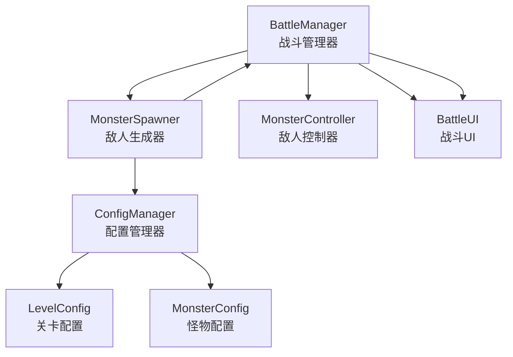
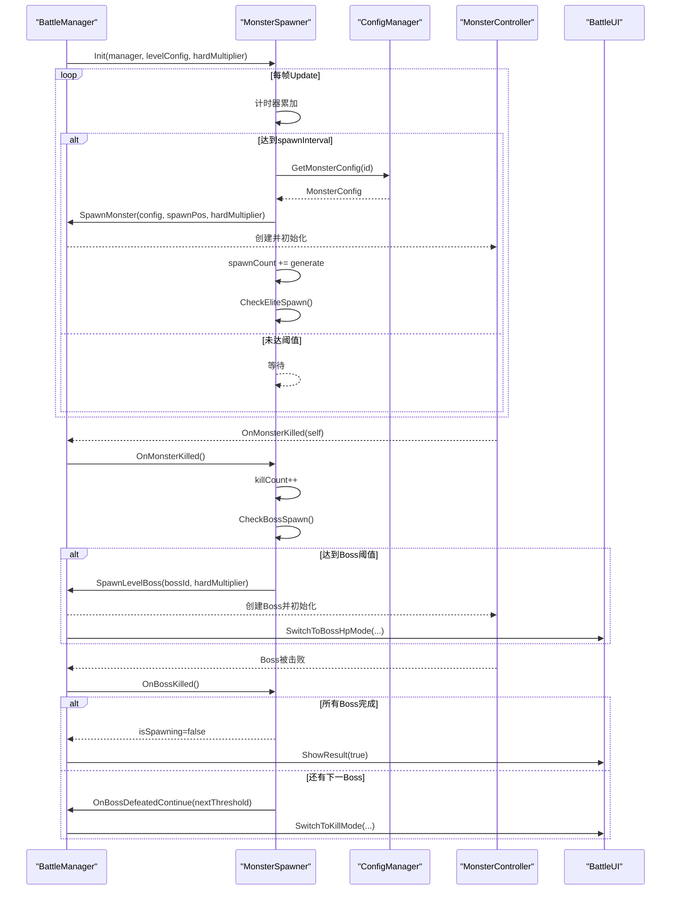
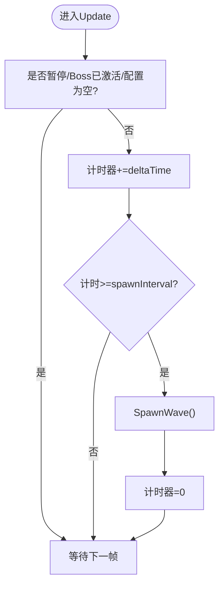
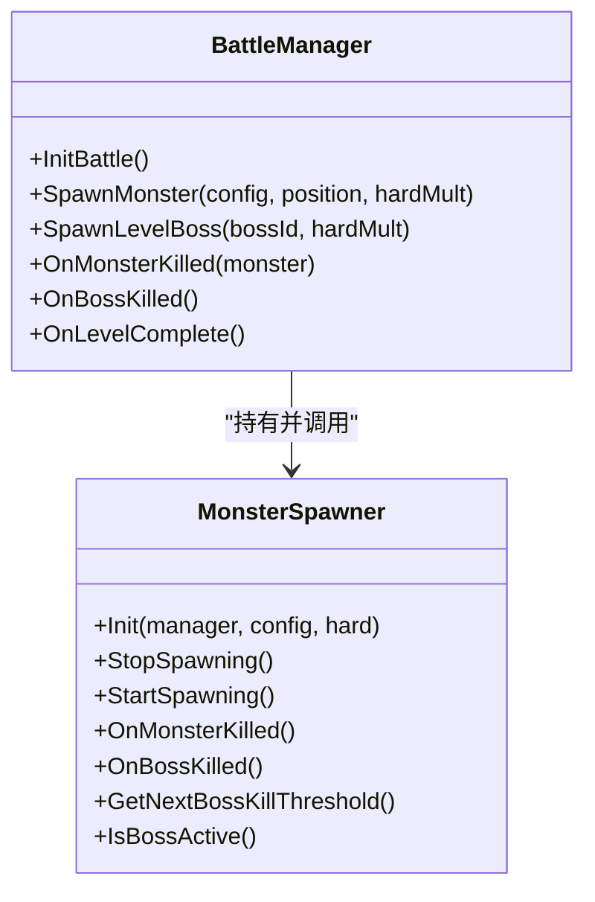
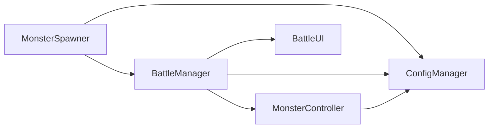

# 敌人生成系统

<cite>
**本文档引用的文件**
- [MonsterSpawner.cs](file://Assets/Scripts/Battle/MonsterSpawner.cs)
- [BattleManager.cs](file://Assets/Scripts/Battle/BattleManager.cs)
- [MonsterController.cs](file://Assets/Scripts/Battle/MonsterController.cs)
- [GameConfigs.cs](file://Assets/Scripts/Data/GameConfigs.cs)
- [ConfigManager.cs](file://Assets/Scripts/Core/ConfigManager.cs)
- [level_config.json](file://Assets/Resources/Configs/level_config.json)
- [monster_config.json](file://Assets/Resources/Configs/monster_config.json)
- [BattleUI.cs](file://Assets/Scripts/UI/BattleUI.cs)
</cite>

## 目录
1. [简介](#简介)
2. [项目结构](#项目结构)
3. [核心组件](#核心组件)
4. [架构总览](#架构总览)
5. [详细组件分析](#详细组件分析)
6. [依赖关系分析](#依赖关系分析)
7. [性能考量](#性能考量)
8. [故障排除指南](#故障排除指南)
9. [结论](#结论)
10. [附录](#附录)

## 简介
本文件针对游戏中的MonsterSpawner敌人生成系统进行深入技术文档化，涵盖波次管理、生成时机控制、难度递增机制、波次配置系统、生成器计时机制、难度系数应用、监控机制以及扩展性设计。文档以代码为依据，结合配置文件与运行时流程，帮助开发者与策划理解系统的设计理念与实现原理，并提供可操作的扩展建议。

## 项目结构
敌人生成系统主要由以下模块构成：
- MonsterSpawner：负责波次调度、生成时机控制、精英触发、Boss激活与通关判定
- BattleManager：负责战斗生命周期、生成器初始化、怪物生成、Boss生成、UI同步
- MonsterController：负责单个敌人的行为、属性、死亡回调
- ConfigManager：负责加载与查询各类配置（关卡、怪物、技能、子弹样式等）
- GameConfigs：定义配置数据结构（LevelConfig、MonsterConfig、LevelMonsterEntry等）
- level_config.json：关卡配置（波次、精英、Boss、难度、生成间隔等）
- monster_config.json：怪物配置（基础属性、精英标记、Boss标记、攻击技能等）
- BattleUI：负责击杀进度与Boss血量UI更新

图表来源
- [BattleManager.cs:145-275](file://Assets/Scripts/Battle/BattleManager.cs#L145-L275)
- [MonsterSpawner.cs:25-43](file://Assets/Scripts/Battle/MonsterSpawner.cs#L25-L43)
- [ConfigManager.cs:77-122](file://Assets/Scripts/Core/ConfigManager.cs#L77-L122)

章节来源
- [BattleManager.cs:145-275](file://Assets/Scripts/Battle/BattleManager.cs#L145-L275)
- [MonsterSpawner.cs:25-43](file://Assets/Scripts/Battle/MonsterSpawner.cs#L25-L43)
- [ConfigManager.cs:77-122](file://Assets/Scripts/Core/ConfigManager.cs#L77-L122)

## 核心组件
- MonsterSpawner：波次调度、生成计时、精英触发、Boss激活、通关判定
- BattleManager：初始化生成器、生成怪物与Boss、UI进度更新、通关/失败处理
- MonsterController：敌人属性、行为、死亡回调、伤害显示
- ConfigManager：配置加载与查询、怪物/关卡/技能/子弹样式等
- GameConfigs：配置数据结构定义（LevelConfig、LevelMonsterEntry、LevelEliteEntry、LevelBossEntry、MonsterConfig等）

章节来源
- [MonsterSpawner.cs:6-43](file://Assets/Scripts/Battle/MonsterSpawner.cs#L6-L43)
- [BattleManager.cs:7-51](file://Assets/Scripts/Battle/BattleManager.cs#L7-L51)
- [GameConfigs.cs:494-533](file://Assets/Scripts/Data/GameConfigs.cs#L494-L533)

## 架构总览
MonsterSpawner在每帧根据spawnInterval进行计时，到达阈值后随机选择一个波次条目，生成指定数量的怪物；同时监控spawnCount，按精英触发规则生成精英敌人；当击杀数达到Boss阈值时激活Boss；Boss被击败后切换到下一阶段Boss或结束关卡。

图表来源
- [MonsterSpawner.cs:55-83](file://Assets/Scripts/Battle/MonsterSpawner.cs#L55-L83)
- [MonsterSpawner.cs:111-145](file://Assets/Scripts/Battle/MonsterSpawner.cs#L111-L145)
- [BattleManager.cs:456-493](file://Assets/Scripts/Battle/BattleManager.cs#L456-L493)
- [BattleManager.cs:639-704](file://Assets/Scripts/Battle/BattleManager.cs#L639-L704)
- [BattleUI.cs:33-105](file://Assets/Scripts/UI/BattleUI.cs#L33-L105)

## 详细组件分析

### MonsterSpawner：波次调度与生成控制
- 初始化：接收BattleManager、LevelConfig、hardMultiplier，设置spawnInterval、计时器、spawnCount、killCount、当前Boss索引、Boss激活状态、精英触发记录数组
- Update循环：若未暂停、Boss已激活或配置为空则跳过；否则累加计时器，达到阈值后调用SpawnWave并重置计时器
- SpawnWave：从monsterList中随机选择一个条目，获取对应MonsterConfig，按generate数量在右侧边界随机Y坐标生成怪物，同时增加spawnCount并检查精英触发
- CheckEliteSpawn：遍历superMList，基于spawnCount/num计算触发次数，若超过上次触发则生成elite怪物
- OnMonsterKilled：killCount++，检查Boss激活条件
- CheckBossSpawn：若bossActive为false且当前Boss阈值未超界，则根据killCount与bossList[currentBossIndex].num比较决定是否生成Boss
- OnBossKilled：bossActive=false，currentBossIndex++；若超出bossList长度则停止生成并通知BattleManager通关；否则通知继续下一阶段Boss
- GetNextBossKillThreshold：返回下一个Boss的击杀阈值
- IsBossActive：返回Boss激活状态
- GetRandomSpawnPos：固定X=12，Y在[-3.5,3.5]之间随机

图表来源
- [MonsterSpawner.cs:55-66](file://Assets/Scripts/Battle/MonsterSpawner.cs#L55-L66)

章节来源
- [MonsterSpawner.cs:25-43](file://Assets/Scripts/Battle/MonsterSpawner.cs#L25-L43)
- [MonsterSpawner.cs:55-83](file://Assets/Scripts/Battle/MonsterSpawner.cs#L55-L83)
- [MonsterSpawner.cs:85-109](file://Assets/Scripts/Battle/MonsterSpawner.cs#L85-L109)
- [MonsterSpawner.cs:111-145](file://Assets/Scripts/Battle/MonsterSpawner.cs#L111-L145)
- [MonsterSpawner.cs:159-164](file://Assets/Scripts/Battle/MonsterSpawner.cs#L159-L164)

### BattleManager：生成器初始化与战斗生命周期
- InitBattle：加载关卡配置、计算hardMultiplier、初始化生成器、生成英雄、初始化技能/奥术系统、初始化UI进度条
- SpawnMonster：根据MonsterConfig与hardMultiplier生成怪物，加入存活列表
- SpawnLevelBoss：根据Boss配置在右侧边界生成Boss，设置目标朝向，加入存活列表并切换UI模式
- OnMonsterKilled：移除存活列表中的敌人，通知生成器更新击杀数，更新UI进度
- OnBossKilled：移除Boss引用，处理Boss事件链（对话/选择），最终通知生成器继续下一阶段Boss或通关
- OnLevelComplete：标记关卡完成，暂停时间，显示胜利界面

图表来源
- [BattleManager.cs:145-275](file://Assets/Scripts/Battle/BattleManager.cs#L145-L275)
- [MonsterSpawner.cs:25-53](file://Assets/Scripts/Battle/MonsterSpawner.cs#L25-L53)

章节来源
- [BattleManager.cs:145-275](file://Assets/Scripts/Battle/BattleManager.cs#L145-L275)
- [BattleManager.cs:456-493](file://Assets/Scripts/Battle/BattleManager.cs#L456-L493)
- [BattleManager.cs:639-704](file://Assets/Scripts/Battle/BattleManager.cs#L639-L704)

### MonsterController：敌人属性与行为
- Init：初始化属性组件，应用hardMultiplier到HP与攻击力，设置最大血量与当前血量，初始化技能攻击范围与冷却计时
- Update：驱动Buff系统，处理冻结状态，根据是否有技能决定移动/攻击逻辑；近身敌人会触发接触伤害
- TrySkillAttack：根据技能冷却判断释放技能，计算伤害并调用BattleManager生成子弹
- TakeDamage：应用反制与无敌判定，更新血条，显示伤害数字，死亡时回调BattleManager

章节来源
- [MonsterController.cs:62-120](file://Assets/Scripts/Battle/MonsterController.cs#L62-L120)
- [MonsterController.cs:128-198](file://Assets/Scripts/Battle/MonsterController.cs#L128-L198)
- [MonsterController.cs:200-231](file://Assets/Scripts/Battle/MonsterController.cs#L200-L231)
- [MonsterController.cs:233-251](file://Assets/Scripts/Battle/MonsterController.cs#L233-L251)
- [MonsterController.cs:268-279](file://Assets/Scripts/Battle/MonsterController.cs#L268-L279)

### 配置系统：波次与难度
- LevelConfig：包含关卡ID、名称、描述、背景、条件、难度系数hard、生成间隔spawn_interval、金币奖励、怪物波次列表monsterList、精英波次列表superMList、Boss列表bossList
- LevelMonsterEntry：怪物ID与生成数量
- LevelEliteEntry：精英ID、触发击杀数阈值、生成数量
- LevelBossEntry：Boss ID与击杀阈值
- MonsterConfig：怪物ID、名称、角色、等级、是否Boss、是否精英、攻击技能ID、攻击间隔、属性列表
- ConfigManager：集中加载与查询各类配置，提供GetLevelConfig、GetMonsterConfig、GetRolePrefab等接口

章节来源
- [GameConfigs.cs:494-533](file://Assets/Scripts/Data/GameConfigs.cs#L494-L533)
- [GameConfigs.cs:340-351](file://Assets/Scripts/Data/GameConfigs.cs#L340-L351)
- [ConfigManager.cs:77-122](file://Assets/Scripts/Core/ConfigManager.cs#L77-L122)
- [ConfigManager.cs:316-322](file://Assets/Scripts/Core/ConfigManager.cs#L316-L322)
- [ConfigManager.cs:236-245](file://Assets/Scripts/Core/ConfigManager.cs#L236-L245)

### 关卡配置示例与参数说明
- 关卡1：spawn_interval=1.5秒，monsterList包含2种普通怪物，superMList包含1个精英条目（每20击杀触发1个），bossList包含1个Boss（10击杀阈值）
- 关卡2：spawn_interval=1.3秒，monsterList包含3种普通怪物，superMList包含1个精英条目（每15击杀触发1个），bossList包含2个Boss（20与40击杀阈值）
- 关卡3：spawn_interval=1.0秒，monsterList包含3种普通怪物，superMList包含2个精英条目（每10与25击杀分别触发），bossList包含3个Boss（20、40与60击杀阈值）

章节来源
- [level_config.json:1-80](file://Assets/Resources/Configs/level_config.json#L1-L80)

### 怪物配置示例与属性说明
- 普通怪物：如小型/中型/大型异形，基础HP与攻击力随等级提升，移动速度与命中率等属性
- 精英怪物：如异形精锐、虚空侍卫，is_elite=true，属性显著提升
- Boss怪物：如虚空领主、深渊守卫、虚空暴君，is_boss=true，拥有攻击技能与更高的属性

章节来源
- [monster_config.json:1-167](file://Assets/Resources/Configs/monster_config.json#L1-L167)

## 依赖关系分析
- MonsterSpawner依赖BattleManager进行怪物生成与Boss生成，依赖ConfigManager查询怪物配置
- BattleManager依赖ConfigManager加载关卡配置与怪物配置，依赖MonsterSpawner进行波次进度与Boss激活控制
- MonsterController依赖ConfigManager查询技能配置，依赖BattleManager生成子弹与显示伤害
- BattleUI依赖MonsterSpawner提供的击杀阈值与Boss激活状态进行UI切换

图表来源
- [MonsterSpawner.cs:25-43](file://Assets/Scripts/Battle/MonsterSpawner.cs#L25-L43)
- [BattleManager.cs:145-275](file://Assets/Scripts/Battle/BattleManager.cs#L145-L275)
- [MonsterController.cs:95-105](file://Assets/Scripts/Battle/MonsterController.cs#L95-L105)

章节来源
- [MonsterSpawner.cs:25-43](file://Assets/Scripts/Battle/MonsterSpawner.cs#L25-L43)
- [BattleManager.cs:145-275](file://Assets/Scripts/Battle/BattleManager.cs#L145-L275)
- [MonsterController.cs:95-105](file://Assets/Scripts/Battle/MonsterController.cs#L95-L105)

## 性能考量
- 计时器精度：使用Time.deltaTime累加，spawnInterval为浮点数，适合大多数场景；若需要更精确的节拍，可考虑基于FixedUpdate或引入计步器
- 随机采样：monsterList随机选择采用Random.Range，复杂度O(1)，性能良好；若需权重采样，可在LevelMonsterEntry中扩展weight字段并实现加权随机
- 精英触发：每次SpawnWave检查superMList，复杂度O(n)，n为精英条目数量；可通过缓存触发阈值与上次触发记录避免重复计算
- 存活列表：BattleManager维护aliveEnemies列表，查找最近敌人时线性扫描，复杂度O(m)；m为存活敌人数量；可考虑空间换时间，建立四叉树或网格索引优化范围查询
- UI更新：UI仅在Boss激活或击杀阈值变化时切换，避免频繁刷新

## 故障排除指南
- 生成器不工作
  - 检查MonsterSpawner是否被正确添加到场景中并初始化
  - 确认LevelConfig.monsterList非空且包含有效条目
  - 检查hardMultiplier是否为合理数值
- 精英不触发
  - 确认LevelConfig.superMList存在且num>0
  - 检查spawnCount是否正确累加
  - 确认eliteLastTrigger数组长度与superMList一致
- Boss不出现
  - 检查killCount是否正确累加
  - 确认bossList当前索引未越界
  - 检查killCount与bossList[currentBossIndex].num的关系
- Boss无法被击败
  - 确认MonsterController死亡时调用OnMonsterKilled
  - 检查BattleManager.OnBossKilled流程是否正确执行
  - 确认UI模式切换逻辑正常

章节来源
- [MonsterSpawner.cs:55-66](file://Assets/Scripts/Battle/MonsterSpawner.cs#L55-L66)
- [MonsterSpawner.cs:85-109](file://Assets/Scripts/Battle/MonsterSpawner.cs#L85-L109)
- [MonsterSpawner.cs:117-129](file://Assets/Scripts/Battle/MonsterSpawner.cs#L117-L129)
- [BattleManager.cs:639-704](file://Assets/Scripts/Battle/BattleManager.cs#L639-L704)

## 结论
MonsterSpawner敌人生成系统通过简洁的波次调度与生成计时实现了可控的难度递增与Boss节奏。系统以配置为中心，便于策划灵活调整波次参数、精英触发与Boss阈值。通过hardMultiplier将关卡难度系数平滑融入怪物属性，确保挑战性随关卡推进而提升。UI层与生成器紧密联动，提供清晰的进度反馈。未来可在随机权重、精英触发优化、范围查询加速等方面进一步提升性能与可扩展性。

## 附录

### 波次配置系统要点
- 波次参数设置：spawn_interval控制生成频率，coinNormalKill/coinEliteKill/coinBossKill定义击杀奖励
- 敌人组合：monsterList定义普通怪物及其生成数量
- 生成顺序：按spawnInterval周期性随机选择条目生成
- 特殊事件触发：superMList定义精英触发条件与生成数量，bossList定义Boss击杀阈值与Boss序列

章节来源
- [GameConfigs.cs:494-533](file://Assets/Scripts/Data/GameConfigs.cs#L494-L533)
- [level_config.json:15-24](file://Assets/Resources/Configs/level_config.json#L15-L24)
- [level_config.json:38-49](file://Assets/Resources/Configs/level_config.json#L38-L49)
- [level_config.json:63-76](file://Assets/Resources/Configs/level_config.json#L63-L76)

### 生成器计时机制
- 波次间隔：spawnInterval来自LevelConfig，MonsterSpawner每帧累加计时器并在达到阈值时生成波次
- 生成延迟：通过spawnTimer与spawnInterval配合实现，可直接修改LevelConfig调整生成密度
- 随机分布算法：monsterList采用均匀随机选择，可扩展为加权随机以平衡敌人组合

章节来源
- [MonsterSpawner.cs:31-32](file://Assets/Scripts/Battle/MonsterSpawner.cs#L31-L32)
- [MonsterSpawner.cs:60-65](file://Assets/Scripts/Battle/MonsterSpawner.cs#L60-L65)
- [MonsterSpawner.cs:70-71](file://Assets/Scripts/Battle/MonsterSpawner.cs#L70-L71)

### 难度系数应用
- hardMultiplier计算：BattleManager根据LevelConfig.hard计算hardMultiplier=hard/10000
- 敌人属性调整：MonsterController在Init时将HP与攻击力按hardMultiplier缩放
- 掉落物品变化：关卡配置提供coinNormalKill/coinEliteKill/coinBossKill，用于击杀奖励

章节来源
- [BattleManager.cs:176](file://Assets/Scripts/Battle/BattleManager.cs#L176)
- [MonsterController.cs:74-78](file://Assets/Scripts/Battle/MonsterController.cs#L74-L78)
- [level_config.json:11-13](file://Assets/Resources/Configs/level_config.json#L11-L13)

### 生成器监控机制
- 敌人数量统计：BattleManager维护aliveEnemies列表，MonsterSpawner维护spawnCount与killCount
- 波次进度跟踪：BattleUI根据MonsterSpawner提供的阈值更新进度条
- Boss激活条件：CheckBossSpawn根据killCount与bossList阈值决定Boss生成

章节来源
- [BattleManager.cs:36](file://Assets/Scripts/Battle/BattleManager.cs#L36)
- [BattleManager.cs:639-654](file://Assets/Scripts/Battle/BattleManager.cs#L639-L654)
- [BattleUI.cs:33-105](file://Assets/Scripts/UI/BattleUI.cs#L33-L105)
- [MonsterSpawner.cs:117-129](file://Assets/Scripts/Battle/MonsterSpawner.cs#L117-L129)

### 扩展性设计建议
- 新波次类型：在LevelConfig中新增条目类型（如“阶段Boss”、“特殊事件Boss”），在MonsterSpawner中扩展对应触发逻辑
- 新生成模式：支持多波次并行、波次间冷却、波次组合权重等，可在LevelConfig中扩展字段并通过ConfigManager查询
- 性能优化：为精英触发与Boss阈值建立缓存索引，为范围查询引入空间索引结构
- 配置可视化：为关卡编辑器提供波次配置面板，支持拖拽排序、权重设置、阈值校验