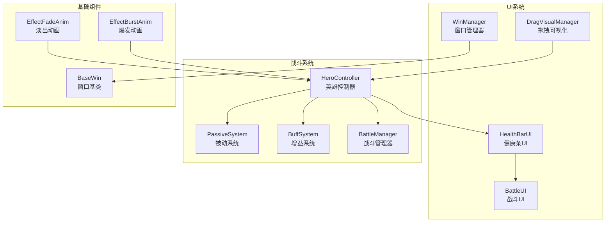
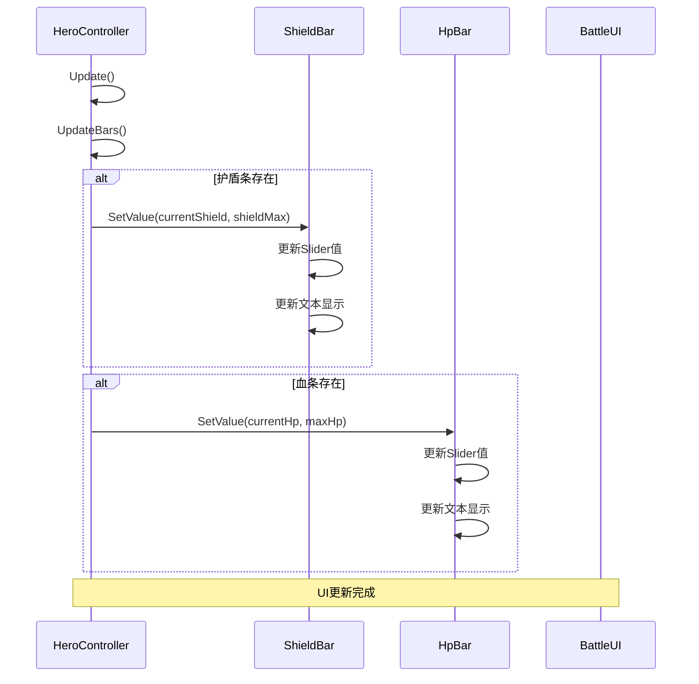
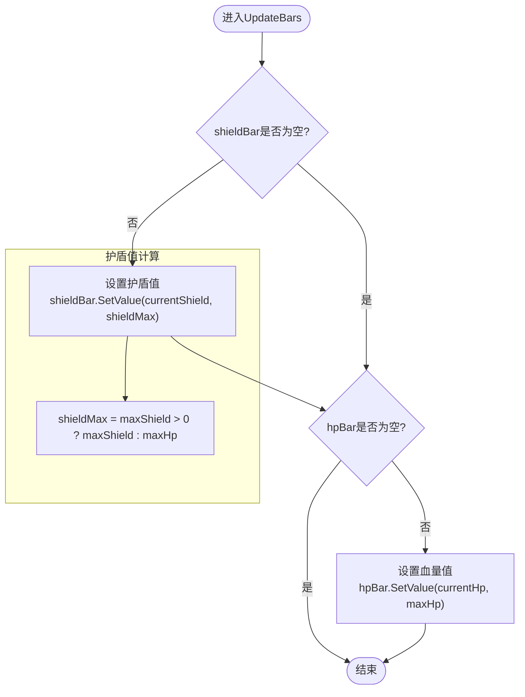
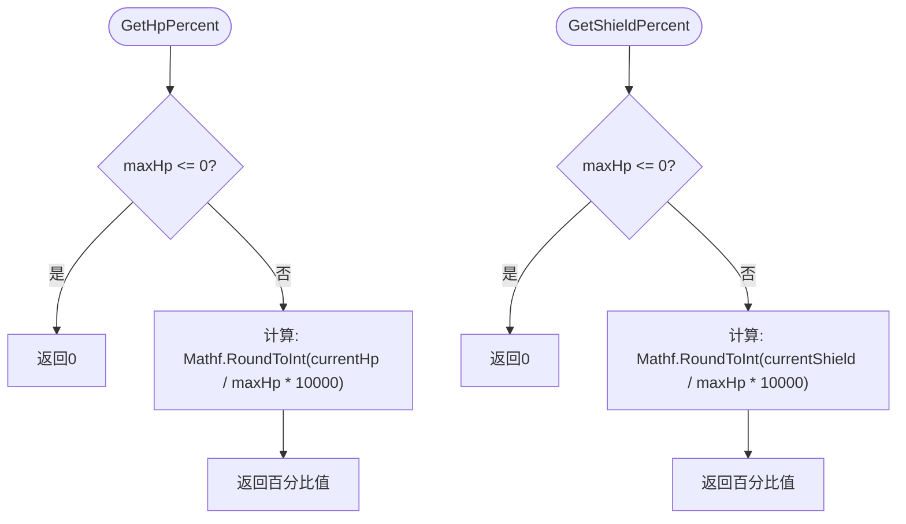
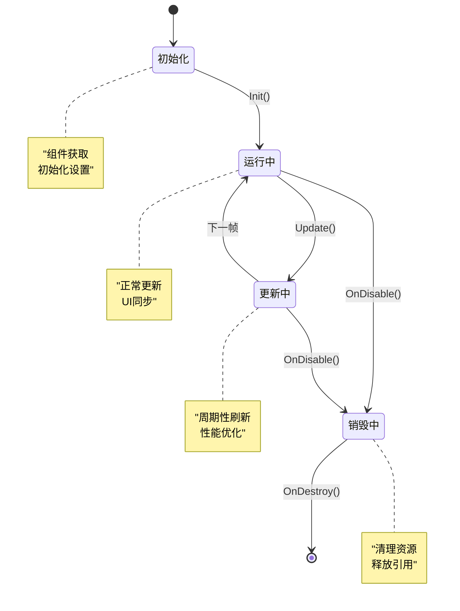
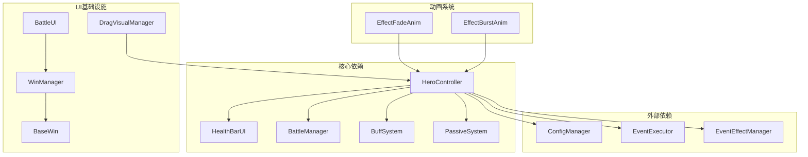
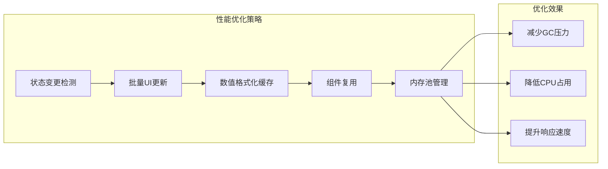

# 英雄UI集成

<cite>
**本文档引用的文件**
- [HeroController.cs](file://Assets/Scripts/Battle/HeroController.cs)
- [HealthBarUI.cs](file://Assets/Scripts/UI/HealthBarUI.cs)
- [BattleUI.cs](file://Assets/Scripts/UI/BattleUI.cs)
- [WinManager.cs](file://Assets/Scripts/UI/WinManager.cs)
- [BaseWin.cs](file://Assets/Scripts/UI/BaseWin.cs)
- [DragVisualManager.cs](file://Assets/Scripts/Battle/DragVisualManager.cs)
- [EffectFadeAnim.cs](file://Assets/Scripts/Battle/EffectFadeAnim.cs)
- [EffectBurstAnim.cs](file://Assets/Scripts/Battle/EffectBurstAnim.cs)
</cite>

## 目录
1. [简介](#简介)
2. [项目结构](#项目结构)
3. [核心组件](#核心组件)
4. [架构概览](#架构概览)
5. [详细组件分析](#详细组件分析)
6. [依赖关系分析](#依赖关系分析)
7. [性能考虑](#性能考虑)
8. [故障排除指南](#故障排除指南)
9. [结论](#结论)

## 简介

本文档深入分析了HeroController的UI集成系统，重点解释英雄控制器与UI系统的交互机制。该系统实现了完整的血条显示、护盾条管理、状态指示器功能，提供了高性能的UI更新机制和灵活的扩展架构。

HeroController作为战斗系统的核心控制器，负责管理英雄的属性状态、技能释放、伤害计算等核心逻辑，并通过HealthBarUI组件与用户界面进行实时交互。系统采用松耦合的设计模式，通过接口和事件机制实现组件间的解耦。

## 项目结构

项目采用分层架构设计，UI系统位于独立的Scripts/UI目录下，与业务逻辑保持清晰的分离：



**图表来源**
- [HeroController.cs:1-514](file://Assets/Scripts/Battle/HeroController.cs#L1-L514)
- [HealthBarUI.cs:1-36](file://Assets/Scripts/UI/HealthBarUI.cs#L1-L36)
- [WinManager.cs:1-195](file://Assets/Scripts/UI/WinManager.cs#L1-L195)

**章节来源**
- [HeroController.cs:1-50](file://Assets/Scripts/Battle/HeroController.cs#L1-L50)
- [HealthBarUI.cs:1-36](file://Assets/Scripts/UI/HealthBarUI.cs#L1-L36)

## 核心组件

### HeroController - 英雄控制器

HeroController是整个UI集成系统的核心，负责管理英雄的状态和与UI的交互：

**主要职责：**
- 管理英雄属性状态（生命值、护盾值、攻击力等）
- 处理伤害计算和护盾吸收逻辑
- 协调技能释放和UI更新
- 维护与战斗系统的交互

**关键特性：**
- 实现IBuffTarget接口，支持增益系统的状态管理
- 提供百分比计算方法（GetHpPercent、GetShieldPercent）
- 集成多种技能类型处理（普通攻击、技能释放、护盾技能等）

**章节来源**
- [HeroController.cs:7-514](file://Assets/Scripts/Battle/HeroController.cs#L7-L514)

### HealthBarUI - 健康条UI组件

HealthBarUI是专门用于显示英雄血量和护盾的UI组件：

**核心功能：**
- Slider组件绑定血量和护盾显示
- Text组件显示具体数值
- 动态文本显示开关控制
- 数值格式化和显示优化

**技术特点：**
- 支持动态最大值设置
- 自动数值格式化（向上取整）
- 文本显示的条件控制
- 简洁的接口设计

**章节来源**
- [HealthBarUI.cs:6-36](file://Assets/Scripts/UI/HealthBarUI.cs#L6-L36)

## 架构概览

系统采用控制器-视图分离的架构模式，通过明确的接口和事件机制实现松耦合设计：



**图表来源**
- [HeroController.cs:449-460](file://Assets/Scripts/Battle/HeroController.cs#L449-L460)
- [HealthBarUI.cs:12-24](file://Assets/Scripts/UI/HealthBarUI.cs#L12-L24)

## 详细组件分析

### UpdateBars方法的UI更新逻辑

UpdateBars方法是HeroController与UI系统交互的核心函数，实现了血条和护盾条的同步更新：



**图表来源**
- [HeroController.cs:449-460](file://Assets/Scripts/Battle/HeroController.cs#L449-L460)

**更新逻辑详解：**
1. **护盾条更新**：当maxShield大于0时使用护盾最大值，否则回退到maxHp
2. **血条更新**：始终使用maxHp作为血量最大值
3. **空值检查**：防止空引用导致的异常
4. **同步更新**：确保血条和护盾条同时更新，保持视觉一致性

**章节来源**
- [HeroController.cs:449-460](file://Assets/Scripts/Battle/HeroController.cs#L449-L460)

### 百分比计算算法

HeroController提供了精确的百分比计算方法，用于UI显示和状态同步：



**图表来源**
- [HeroController.cs:73-83](file://Assets/Scripts/Battle/HeroController.cs#L73-L83)

**算法特点：**
- 使用10000倍精度避免浮点数误差
- 四舍五入确保显示的整数值
- 边界条件检查防止除零错误
- 返回值范围0-10000对应0%-100%

**章节来源**
- [HeroController.cs:73-83](file://Assets/Scripts/Battle/HeroController.cs#L73-L83)

### HealthBarUI的数值格式化

HealthBarUI组件实现了智能的数值格式化和显示控制：

```mermaid
classDiagram
class HealthBarUI {
+Slider slider
+Text valueText
+bool showText
+SetValue(current, max) void
+SetShowText(show) void
}
class Slider {
+float maxValue
+float value
}
class Text {
+string text
}
HealthBarUI --> Slider : "使用"
HealthBarUI --> Text : "使用"
note for HealthBarUI : "数值格式化 : <br/>向上取整显示<br/>格式 : 当前值/最大值"
```

**图表来源**
- [HealthBarUI.cs:6-36](file://Assets/Scripts/UI/HealthBarUI.cs#L6-L36)

**格式化规则：**
- 使用Mathf.CeilToInt进行向上取整
- 显示格式为"当前值/最大值"
- 支持动态显示开关控制
- 自动处理空引用情况

**章节来源**
- [HealthBarUI.cs:12-33](file://Assets/Scripts/UI/HealthBarUI.cs#L12-L33)

### UI组件生命周期管理

系统采用统一的生命周期管理模式，确保UI组件的正确初始化和销毁：



**生命周期流程：**
1. **初始化阶段**：组件获取和基本设置
2. **运行阶段**：持续的UI更新和状态同步
3. **更新阶段**：周期性刷新和性能优化
4. **销毁阶段**：资源清理和引用释放

**章节来源**
- [HeroController.cs:85-138](file://Assets/Scripts/Battle/HeroController.cs#L85-L138)
- [WinManager.cs:28-38](file://Assets/Scripts/UI/WinManager.cs#L28-L38)

## 依赖关系分析

系统采用模块化设计，各组件间保持低耦合高内聚的关系：



**依赖特点：**
- HeroController对UI组件的依赖是单向的
- UI组件不反向依赖控制器
- 通过接口和事件实现松耦合
- 支持组件的独立测试和替换

**章节来源**
- [HeroController.cs:85-138](file://Assets/Scripts/Battle/HeroController.cs#L85-L138)
- [WinManager.cs:61-102](file://Assets/Scripts/UI/WinManager.cs#L61-L102)

## 性能考虑

系统在设计时充分考虑了性能优化，采用了多种策略确保流畅的用户体验：

### 更新频率控制策略

1. **按需更新**：仅在状态变化时触发UI更新
2. **周期性刷新**：通过Update方法控制更新频率
3. **条件检查**：避免不必要的UI操作

### 批量更新策略



**优化措施：**
- 使用静态数组避免频繁分配
- 缓存计算结果减少重复运算
- 组件复用避免频繁实例化
- 内存池管理减少垃圾回收

### 内存管理

系统采用以下内存管理策略：
- 对象池模式管理临时对象
- 及时释放不再使用的引用
- 避免循环引用造成内存泄漏
- 使用弱引用管理跨场景引用

**章节来源**
- [HeroController.cs:147-176](file://Assets/Scripts/Battle/HeroController.cs#L147-L176)
- [WinManager.cs:147-155](file://Assets/Scripts/UI/WinManager.cs#L147-L155)

## 故障排除指南

### 常见问题及解决方案

**问题1：UI不显示或显示异常**
- 检查HealthBarUI组件的Slider和Text引用
- 确认maxValue和value的设置顺序
- 验证UI组件的激活状态

**问题2：数值显示不准确**
- 检查百分比计算方法的边界条件
- 验证数值格式化的取整逻辑
- 确认UI更新的时机和频率

**问题3：性能问题**
- 分析Update方法中的计算开销
- 检查UI更新的频率控制
- 监控内存分配和垃圾回收

**章节来源**
- [HealthBarUI.cs:12-24](file://Assets/Scripts/UI/HealthBarUI.cs#L12-L24)
- [HeroController.cs:449-460](file://Assets/Scripts/Battle/HeroController.cs#L449-L460)

## 结论

HeroController的UI集成系统展现了优秀的架构设计和实现质量。系统通过清晰的职责分离、松耦合的组件设计、高效的性能优化策略，成功实现了复杂的UI交互需求。

**主要优势：**
- **模块化设计**：各组件职责明确，易于维护和扩展
- **性能优化**：采用多种策略确保流畅的用户体验
- **可扩展性**：支持自定义UI组件和视觉效果
- **稳定性**：完善的错误处理和边界条件检查

**未来改进方向：**
- 增加更多类型的UI组件支持
- 实现更丰富的动画效果
- 优化大规模场景下的性能表现
- 提供更灵活的UI布局配置

该系统为类似的游戏项目提供了优秀的参考模板，展示了如何在Unity环境下构建高质量的UI集成解决方案。