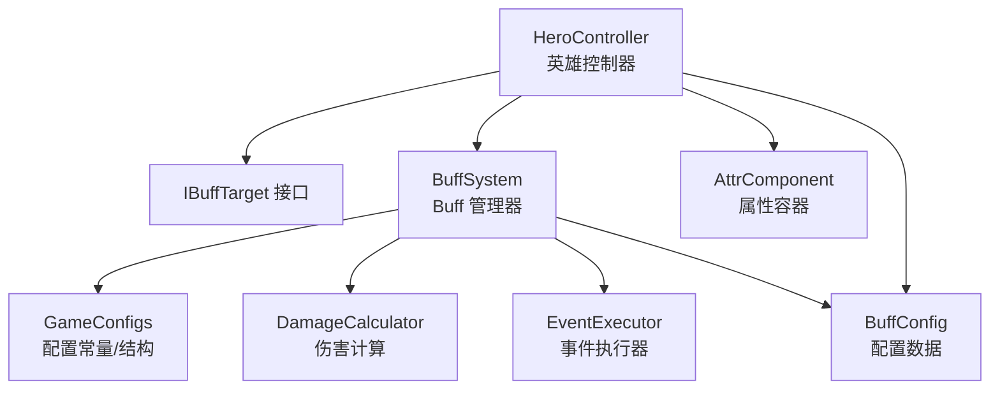
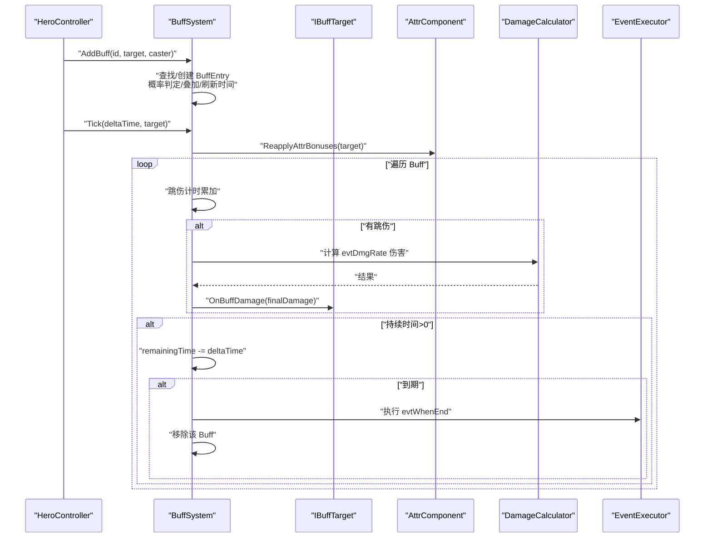
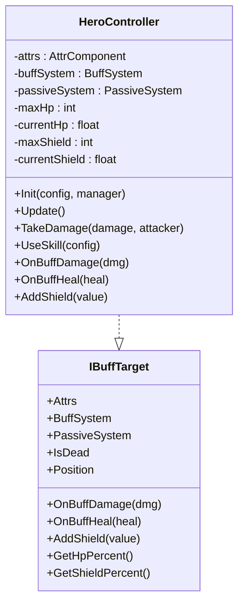
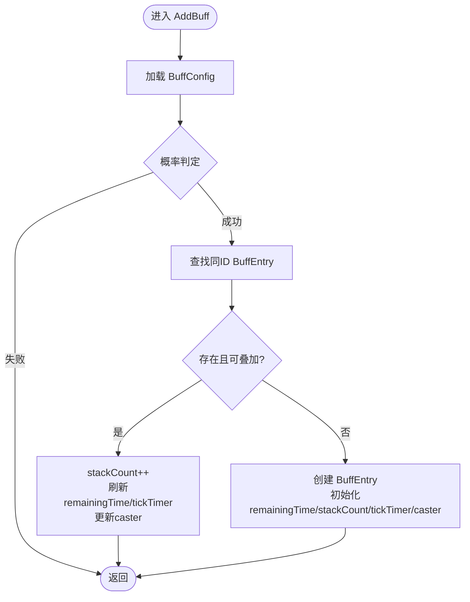
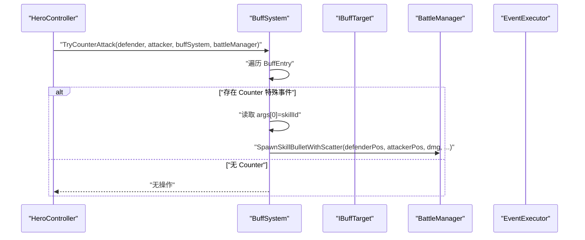
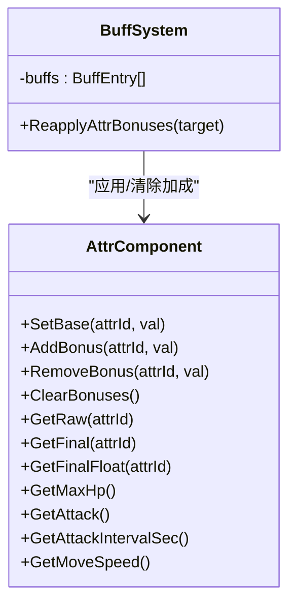
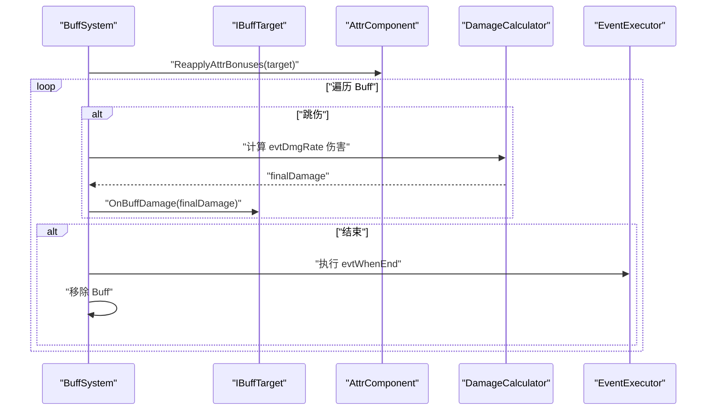
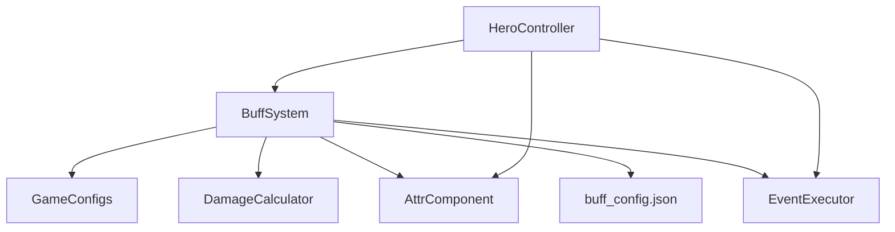

# 英雄增益减益系统

<cite>
**本文档引用的文件**
- [HeroController.cs](file://Assets/Scripts/Battle/HeroController.cs)
- [BuffSystem.cs](file://Assets/Scripts/Battle/BuffSystem.cs)
- [GameConfigs.cs](file://Assets/Scripts/Data/GameConfigs.cs)
- [AttrComponent.cs](file://Assets/Scripts/Battle/AttrComponent.cs)
- [DamageCalculator.cs](file://Assets/Scripts/Battle/DamageCalculator.cs)
- [EventExecutor.cs](file://Assets/Scripts/Battle/EventExecutor.cs)
- [buff_config.json](file://Assets/Resources/Configs/buff_config.json)
</cite>

## 目录
1. [简介](#简介)
2. [项目结构](#项目结构)
3. [核心组件](#核心组件)
4. [架构总览](#架构总览)
5. [详细组件分析](#详细组件分析)
6. [依赖关系分析](#依赖关系分析)
7. [性能考虑](#性能考虑)
8. [故障排除指南](#故障排除指南)
9. [结论](#结论)
10. [附录](#附录)

## 简介
本技术文档围绕 HeroController 的增益减益系统进行深入解析，重点阐述 IBuffTarget 接口的实现与 BuffSystem 的集成机制，覆盖增益减益效果的注册、管理、移除流程；Buff 生命周期管理（添加、更新、移除）；特殊 Buff 的处理逻辑（蓄力、无敌、反制、伤害修饰等）；Buff 对英雄属性的影响机制（属性加成、数值计算、实时更新）；以及 Buff 系统的事件处理（OnBuffDamage 受击回调、OnBuffHeal 治疗回调、状态变化通知）。同时提供具体的代码示例路径，展示 Buff 的添加和移除算法，并解释系统的扩展性设计。

## 项目结构
本系统主要涉及以下模块：
- HeroController：英雄实体，实现 IBuffTarget 接口，持有 BuffSystem 和 AttrComponent，负责战斗行为与 Buff 生命周期驱动。
- BuffSystem：Buff 核心管理器，负责 Buff 的注册、叠加、刷新、移除、特殊效果判断、属性重应用、事件触发等。
- AttrComponent：属性容器，提供基础值、加成值、最终值计算及上下限约束。
- GameConfigs：Buff 配置常量与数据结构定义，包含 BuffSpecialEventType、BuffConfig 等。
- DamageCalculator：伤害计算引擎，用于 Buff 触发的伤害快照计算。
- EventExecutor：事件执行器，用于执行 Buff 配置中的事件数组。
- buff_config.json：Buff 配置资源，定义各类 Buff 的类型、持续时间、叠加上限、特殊事件等。

**图表来源**
- [HeroController.cs:1-514](file://Assets/Scripts/Battle/HeroController.cs#L1-L514)
- [BuffSystem.cs:1-378](file://Assets/Scripts/Battle/BuffSystem.cs#L1-L378)
- [GameConfigs.cs:170-369](file://Assets/Scripts/Data/GameConfigs.cs#L170-L369)
- [AttrComponent.cs:33-128](file://Assets/Scripts/Battle/AttrComponent.cs#L33-L128)
- [DamageCalculator.cs:69-105](file://Assets/Scripts/Battle/DamageCalculator.cs#L69-L105)
- [EventExecutor.cs:65-100](file://Assets/Scripts/Battle/EventExecutor.cs#L65-L100)

**章节来源**
- [HeroController.cs:1-514](file://Assets/Scripts/Battle/HeroController.cs#L1-L514)
- [BuffSystem.cs:1-378](file://Assets/Scripts/Battle/BuffSystem.cs#L1-L378)
- [GameConfigs.cs:170-369](file://Assets/Scripts/Data/GameConfigs.cs#L170-L369)

## 核心组件
- IBuffTarget 接口：定义所有可成为 Buff 目标的对象必须提供的能力，包括属性容器、BuffSystem 引用、被动系统、受击/治疗/护盾回调、死亡状态、位置、血量/护盾百分比等。
- BuffSystem：维护 BuffEntry 列表，提供 AddBuff、RemoveBuffByConfigId、RemoveBuffsByType、HasSpecialEffect、IsInvincible、IsFrozen、Tick、ReapplyAttrBonuses、GetSkillDmgModifier、CollectExtraBulletEventIds、TryCounterAttack 等方法。
- HeroController：实现 IBuffTarget，持有 BuffSystem 与 AttrComponent；在 Update 中驱动 BuffSystem.Tick；处理蓄力状态（Charge）、攻击时的 Buff 集成（伤害修饰、额外子弹事件收集）；在受击时调用 BuffSystem.TryCounterAttack 并处理减伤与护盾优先。

**章节来源**
- [HeroController.cs:7-83](file://Assets/Scripts/Battle/HeroController.cs#L7-L83)
- [BuffSystem.cs:16-28](file://Assets/Scripts/Battle/BuffSystem.cs#L16-L28)
- [BuffSystem.cs:30-378](file://Assets/Scripts/Battle/BuffSystem.cs#L30-L378)

## 架构总览
HeroController 作为 IBuffTarget 的实现者，通过 BuffSystem 驱动整个增益减益生命周期。BuffSystem 在 Tick 中重算属性加成、按跳伤间隔触发事件、处理持续时间到期与结束事件，并根据特殊事件类型提供特殊能力（如无敌、冻结、反制）。

**图表来源**
- [HeroController.cs:147-176](file://Assets/Scripts/Battle/HeroController.cs#L147-L176)
- [BuffSystem.cs:140-225](file://Assets/Scripts/Battle/BuffSystem.cs#L140-L225)
- [BuffSystem.cs:227-248](file://Assets/Scripts/Battle/BuffSystem.cs#L227-L248)
- [DamageCalculator.cs:69-105](file://Assets/Scripts/Battle/DamageCalculator.cs#L69-L105)
- [EventExecutor.cs:188-196](file://Assets/Scripts/Battle/EventExecutor.cs#L188-L196)

## 详细组件分析

### IBuffTarget 接口与 HeroController 实现
- 接口职责：提供属性容器、BuffSystem 引用、被动系统、受击/治疗/护盾回调、死亡状态、位置、血量/护盾百分比查询。
- HeroController 实现要点：
  - 提供 Attrs、BuffSystem、PassiveSystem、IsDead、Position 等只读属性。
  - OnBuffDamage：若处于无敌状态则直接返回，否则调用 TakeDamage。
  - OnBuffHeal：直接回血并更新血条。
  - AddShield：设置并限制在最大生命值范围内。
  - 在 Update 中每帧调用 BuffSystem.Tick 驱动 Buff 生命周期。
  - 蓄力逻辑：当空闲时间超过阈值时，添加 charge_buff_ids 对应的 Buff，并在攻击时退出蓄力并移除。

**图表来源**
- [HeroController.cs:7-83](file://Assets/Scripts/Battle/HeroController.cs#L7-L83)
- [HeroController.cs:147-176](file://Assets/Scripts/Battle/HeroController.cs#L147-L176)
- [HeroController.cs:405-447](file://Assets/Scripts/Battle/HeroController.cs#L405-L447)
- [BuffSystem.cs:16-28](file://Assets/Scripts/Battle/BuffSystem.cs#L16-L28)

**章节来源**
- [HeroController.cs:7-83](file://Assets/Scripts/Battle/HeroController.cs#L7-L83)
- [HeroController.cs:147-176](file://Assets/Scripts/Battle/HeroController.cs#L147-L176)
- [HeroController.cs:405-447](file://Assets/Scripts/Battle/HeroController.cs#L405-L447)

### BuffSystem 生命周期管理
- 添加（AddBuff）：
  - 从 ConfigManager 获取 BuffConfig。
  - 概率判定：若 probability 在 (0,10000) 内，按万分比随机决定是否生效。
  - 查找同 ID 的现有 BuffEntry：
    - 若存在且未达叠加上限，则 stackCount++。
    - 刷新 remainingTime 与 tickTimer，并更新 caster。
  - 若不存在，则创建新 BuffEntry，初始化 remainingTime（lastTime/1000），tickTimer=0，stackCount=1。
- 更新（Tick）：
  - ReapplyAttrBonuses：清空属性加成，遍历 Buff，按类型与无敌状态应用属性加成。
  - 遍历 Buff，按 jumpTime 间隔触发：
    - evtDmgRate：计算伤害并调用 OnBuffDamage（无敌状态下跳过）。
    - evtDamage：执行事件数组。
  - 持续时间 remainingTime 倒计时，到期则执行 evtWhenEnd 并移除 Buff。
- 移除（RemoveBuffByConfigId/RemoveBuffsByType）：
  - 支持按 BuffConfigId 或 Buff 类型批量移除，可指定移除数量上限。
- 特殊效果（HasSpecialEffect/IsInvincible/IsFrozen）：
  - 通过 BuffSpecialEventType 判断是否存在特定特殊事件。
  - 无敌：Immune 伤害与控制。
  - 冰冻：在非无敌状态下禁止移动与攻击。
- 属性重应用（ReapplyAttrBonuses）：
  - 清空加成后，按 BuffConfig.attribute 应用加成，叠加层数影响最终值。
  - 无敌状态下跳过减益类型的属性加成。

**图表来源**
- [BuffSystem.cs:34-84](file://Assets/Scripts/Battle/BuffSystem.cs#L34-L84)

**章节来源**
- [BuffSystem.cs:34-84](file://Assets/Scripts/Battle/BuffSystem.cs#L34-L84)
- [BuffSystem.cs:140-225](file://Assets/Scripts/Battle/BuffSystem.cs#L140-L225)
- [BuffSystem.cs:227-248](file://Assets/Scripts/Battle/BuffSystem.cs#L227-L248)

### 特殊 Buff 处理逻辑
- 蓄力（Charge）：
  - HeroController 在 Update 中检测空闲时间，超过阈值后为每个 charge_buff_ids 添加对应 Buff，并播放动画；攻击时退出蓄力并移除这些 Buff。
- 无敌（Invincible）：
  - BuffSystem.HasSpecialEffect(BuffSpecialEventType.Invincible) 返回 true，导致 OnBuffDamage 直接返回，且 ReapplyAttrBonuses 跳过减益属性。
- 冰冻（Freeze）：
  - BuffSystem.HasSpecialEffect(BuffSpecialEventType.Freeze) 返回 true，导致 IsFrozen 为真，HeroController 在攻击周期中跳过攻击。
- 反制（Counter）：
  - 当被攻击时，BuffSystem.TryCounterAttack 遍历拥有 Counter 特殊事件的 Buff，读取 args[0] 作为技能 ID，构建子弹数据并发射反击弹。
- 伤害修饰（SkillDmgMod）：
  - BuffSystem.GetSkillDmgModifier(skillId) 计算所有命中 Buff 的技能伤害修改值（万分比），HeroController 在计算实际伤害时乘以相应倍率。

**图表来源**
- [HeroController.cs:410-410](file://Assets/Scripts/Battle/HeroController.cs#L410-L410)
- [BuffSystem.cs:331-375](file://Assets/Scripts/Battle/BuffSystem.cs#L331-L375)

**章节来源**
- [HeroController.cs:178-205](file://Assets/Scripts/Battle/HeroController.cs#L178-L205)
- [HeroController.cs:410-410](file://Assets/Scripts/Battle/HeroController.cs#L410-L410)
- [BuffSystem.cs:129-138](file://Assets/Scripts/Battle/BuffSystem.cs#L129-L138)
- [BuffSystem.cs:263-280](file://Assets/Scripts/Battle/BuffSystem.cs#L263-L280)
- [BuffSystem.cs:331-375](file://Assets/Scripts/Battle/BuffSystem.cs#L331-L375)

### Buff 对英雄属性的影响机制
- 属性容器 AttrComponent：
  - 提供基础值、加成值、最终值计算，支持上下限约束。
  - 关键方法：GetRaw、GetFinal、GetFinalFloat、AddBonus、RemoveBonus、ClearBonuses、GetMaxHp、GetAttack、GetAttackIntervalSec、GetMoveSpeed。
- BuffSystem.ReapplyAttrBonuses：
  - 清空加成后，遍历 Buff，按 BuffConfig.attribute 应用加成，叠加层数乘以单层值。
  - 无敌状态下跳过减益类型的属性加成，避免减速等控制效果生效。
- HeroController 在 Init 与 Update 中均会驱动 ReapplyAttrBonuses，确保属性实时更新。

**图表来源**
- [AttrComponent.cs:33-128](file://Assets/Scripts/Battle/AttrComponent.cs#L33-L128)
- [BuffSystem.cs:227-248](file://Assets/Scripts/Battle/BuffSystem.cs#L227-L248)

**章节来源**
- [AttrComponent.cs:33-128](file://Assets/Scripts/Battle/AttrComponent.cs#L33-L128)
- [BuffSystem.cs:227-248](file://Assets/Scripts/Battle/BuffSystem.cs#L227-L248)

### Buff 系统事件处理
- OnBuffDamage 回调：由 BuffSystem 在跳伤或事件触发时调用，HeroController 在受击前先尝试反制，再检查无敌状态，最后扣除护盾与血量。
- OnBuffHeal 回调：由 BuffSystem 或事件系统触发，HeroController 直接回血并更新 UI。
- 状态变化通知：Buff 过期时执行 evtWhenEnd 事件，允许在配置中附加清理逻辑或额外效果。

**图表来源**
- [BuffSystem.cs:140-225](file://Assets/Scripts/Battle/BuffSystem.cs#L140-L225)
- [HeroController.cs:53-63](file://Assets/Scripts/Battle/HeroController.cs#L53-L63)
- [EventExecutor.cs:65-100](file://Assets/Scripts/Battle/EventExecutor.cs#L65-L100)

**章节来源**
- [HeroController.cs:53-63](file://Assets/Scripts/Battle/HeroController.cs#L53-L63)
- [BuffSystem.cs:140-225](file://Assets/Scripts/Battle/BuffSystem.cs#L140-L225)
- [EventExecutor.cs:65-100](file://Assets/Scripts/Battle/EventExecutor.cs#L65-L100)

### Buff 的添加与移除算法示例路径
- 添加 Buff（按 BuffConfigId）：[BuffSystem.cs:34-84](file://Assets/Scripts/Battle/BuffSystem.cs#L34-L84)
- 按 BuffConfigId 移除：[BuffSystem.cs:86-98](file://Assets/Scripts/Battle/BuffSystem.cs#L86-L98)
- 按 Buff 类型移除：[BuffSystem.cs:100-112](file://Assets/Scripts/Battle/BuffSystem.cs#L100-L112)
- 获取技能伤害修饰：[BuffSystem.cs:263-280](file://Assets/Scripts/Battle/BuffSystem.cs#L263-L280)
- 收集额外子弹事件 ID：[BuffSystem.cs:308-326](file://Assets/Scripts/Battle/BuffSystem.cs#L308-L326)
- 反制触发：[BuffSystem.cs:331-375](file://Assets/Scripts/Battle/BuffSystem.cs#L331-L375)

**章节来源**
- [BuffSystem.cs:34-84](file://Assets/Scripts/Battle/BuffSystem.cs#L34-L84)
- [BuffSystem.cs:86-98](file://Assets/Scripts/Battle/BuffSystem.cs#L86-L98)
- [BuffSystem.cs:100-112](file://Assets/Scripts/Battle/BuffSystem.cs#L100-L112)
- [BuffSystem.cs:263-280](file://Assets/Scripts/Battle/BuffSystem.cs#L263-L280)
- [BuffSystem.cs:308-326](file://Assets/Scripts/Battle/BuffSystem.cs#L308-L326)
- [BuffSystem.cs:331-375](file://Assets/Scripts/Battle/BuffSystem.cs#L331-L375)

### Buff 系统扩展性设计
- 配置驱动：BuffConfig 定义了 Buff 的类型、叠加上限、概率、持续时间、跳伤间隔、属性加成、事件数组、特殊事件等，便于通过 JSON 配置快速扩展新 Buff。
- 特殊事件类型扩展：通过 BuffSpecialEventType 常量扩展新类型（如新增 104=破盾爆发），并在 BuffSystem 中新增对应处理逻辑。
- 事件系统集成：evtDmgRate、evtDamage、evtWhenEnd 与 EventExecutor 协作，支持复杂效果链路。
- 属性系统扩展：AttrComponent 支持任意属性加成，BuffSystem 通过 attribute 字段统一应用，无需修改核心逻辑。

**章节来源**
- [GameConfigs.cs:172-182](file://Assets/Scripts/Data/GameConfigs.cs#L172-L182)
- [GameConfigs.cs:218-237](file://Assets/Scripts/Data/GameConfigs.cs#L218-L237)
- [EventExecutor.cs:65-100](file://Assets/Scripts/Battle/EventExecutor.cs#L65-L100)
- [AttrComponent.cs:33-128](file://Assets/Scripts/Battle/AttrComponent.cs#L33-L128)

## 依赖关系分析
- HeroController 依赖：
  - BuffSystem：驱动 Buff 生命周期与特殊效果。
  - AttrComponent：提供属性计算与实时更新。
  - EventExecutor：执行 Buff 事件。
  - ConfigManager：获取 BuffConfig 与技能配置。
- BuffSystem 依赖：
  - GameConfigs：BuffSpecialEventType、BuffConfig。
  - AttrComponent：ReapplyAttrBonuses。
  - DamageCalculator：evtDmgRate 伤害计算。
  - EventExecutor：evtDamage/evtWhenEnd 事件执行。
- 配置文件：
  - buff_config.json：定义各类 Buff 的行为参数。

**图表来源**
- [HeroController.cs:1-514](file://Assets/Scripts/Battle/HeroController.cs#L1-L514)
- [BuffSystem.cs:1-378](file://Assets/Scripts/Battle/BuffSystem.cs#L1-L378)
- [GameConfigs.cs:170-369](file://Assets/Scripts/Data/GameConfigs.cs#L170-L369)
- [buff_config.json:1-23](file://Assets/Resources/Configs/buff_config.json#L1-L23)

**章节来源**
- [HeroController.cs:1-514](file://Assets/Scripts/Battle/HeroController.cs#L1-L514)
- [BuffSystem.cs:1-378](file://Assets/Scripts/Battle/BuffSystem.cs#L1-L378)
- [GameConfigs.cs:170-369](file://Assets/Scripts/Data/GameConfigs.cs#L170-L369)
- [buff_config.json:1-23](file://Assets/Resources/Configs/buff_config.json#L1-L23)

## 性能考虑
- Buff 遍历：Tick 中对 Buff 列表进行从后向前遍历，避免删除元素时索引变化带来的问题；跳伤计时使用 tickTimer 累加，避免频繁比较。
- 属性重应用：ReapplyAttrBonuses 每帧清空并重新应用，确保实时性；在无敌状态下跳过减益属性，减少无效计算。
- 概率判定：AddBuff 中的概率判定仅在 probability ∈ (0,10000) 时进行，避免不必要的随机数生成。
- 事件执行：evtDamage/evtWhenEnd 仅在存在配置时执行，减少空分支开销。

[本节为通用性能讨论，不直接分析具体文件]

## 故障排除指南
- Buff 不生效：
  - 检查 BuffConfig.probability 是否为 0 或小于随机阈值。
  - 确认 BuffConfig.lastTime 是否为负值（永久 Buff）或大于 0。
  - 确认 BuffConfig.dispel 是否正确设置，避免被错误驱散。
- 无敌状态异常：
  - 确认 BuffConfig.specialEvent 包含 Invincible 类型且 args 为空。
  - 检查 ReapplyAttrBonuses 是否在无敌状态下跳过了减益属性。
- 冰冻状态无效：
  - 确认 BuffConfig.specialEvent 包含 Freeze 类型。
  - 检查 HeroController 的攻击周期是否因 IsFrozen 返回而跳过。
- 反制不触发：
  - 确认 BuffConfig.specialEvent 包含 Counter 类型且 args[0] 指向有效技能 ID。
  - 检查 EventExecutor 是否能正确解析技能配置与子弹事件。
- 伤害修饰不生效：
  - 确认 BuffConfig.specialEvent 中 SkillDmgMod 的 args[0] 是否为 -1（全部技能）或具体技能 ID。
  - 检查 HeroController 在计算伤害时是否调用了 GetSkillDmgModifier 并乘以相应倍率。

**章节来源**
- [BuffSystem.cs:39-44](file://Assets/Scripts/Battle/BuffSystem.cs#L39-L44)
- [BuffSystem.cs:129-138](file://Assets/Scripts/Battle/BuffSystem.cs#L129-L138)
- [HeroController.cs:171-172](file://Assets/Scripts/Battle/HeroController.cs#L171-L172)
- [BuffSystem.cs:331-375](file://Assets/Scripts/Battle/BuffSystem.cs#L331-L375)
- [BuffSystem.cs:263-280](file://Assets/Scripts/Battle/BuffSystem.cs#L263-L280)
- [HeroController.cs:254-255](file://Assets/Scripts/Battle/HeroController.cs#L254-L255)

## 结论
HeroController 的增益减益系统通过 IBuffTarget 接口与 BuffSystem 的紧密协作，实现了完整的 Buff 生命周期管理与事件驱动机制。系统以配置为中心，支持灵活扩展新的 Buff 类型与效果机制；通过属性重应用与实时更新，确保 Buff 对英雄属性的影响即时可见；通过特殊事件类型（蓄力、无敌、反制、伤害修饰等）丰富了战斗策略与玩法深度。建议在扩展新 Buff 时遵循现有配置结构与事件模式，保持系统的一致性与可维护性。

[本节为总结性内容，不直接分析具体文件]

## 附录
- Buff 配置示例参考：[buff_config.json:1-23](file://Assets/Resources/Configs/buff_config.json#L1-L23)
- BuffSpecialEventType 常量定义：[GameConfigs.cs:172-182](file://Assets/Scripts/Data/GameConfigs.cs#L172-L182)
- BuffConfig 数据结构定义：[GameConfigs.cs:218-237](file://Assets/Scripts/Data/GameConfigs.cs#L218-L237)