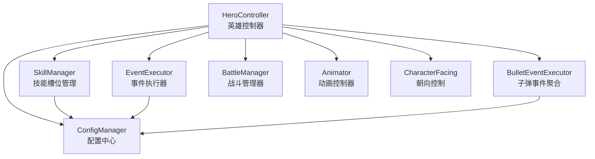
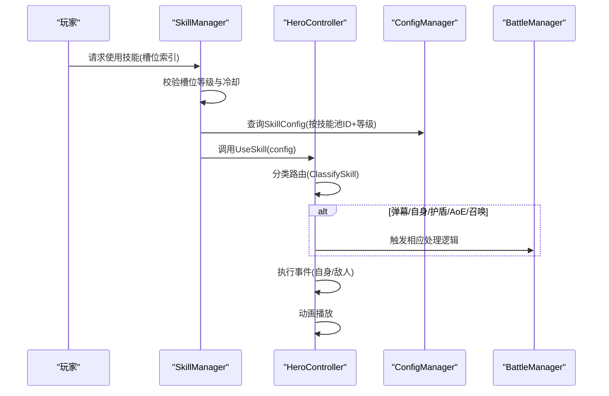
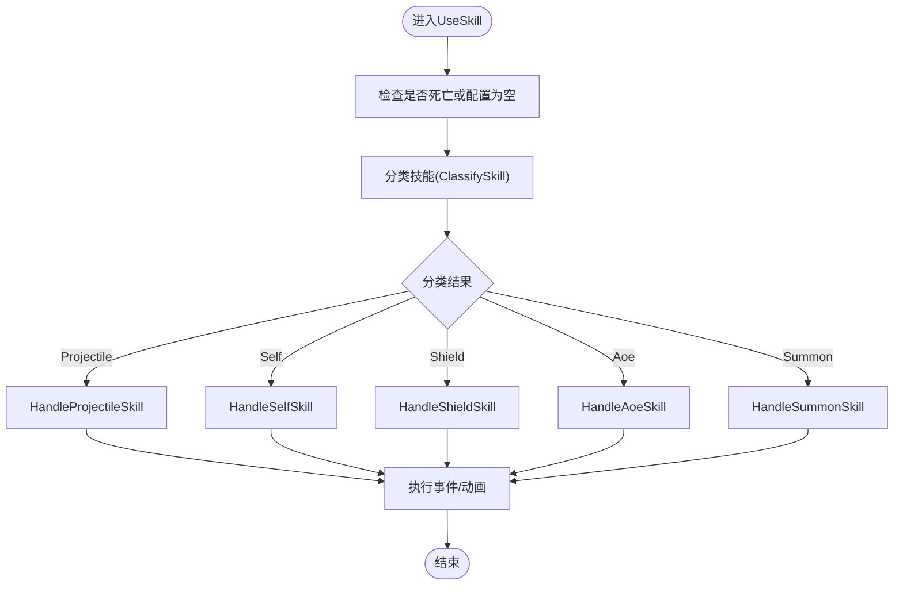
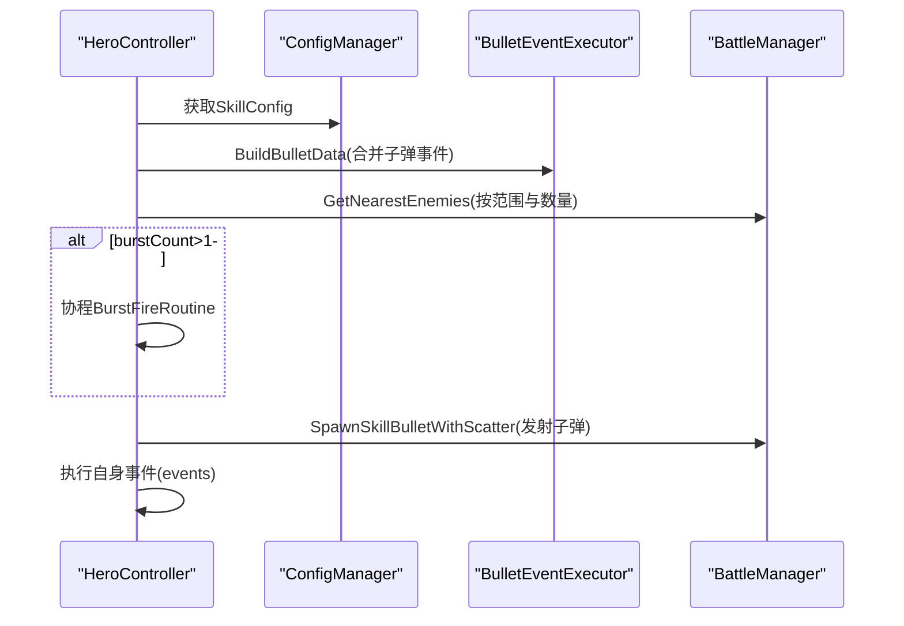
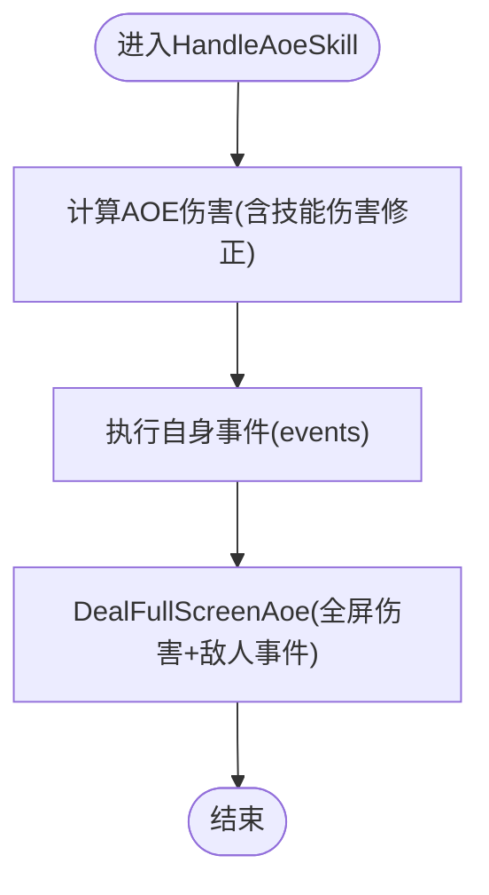
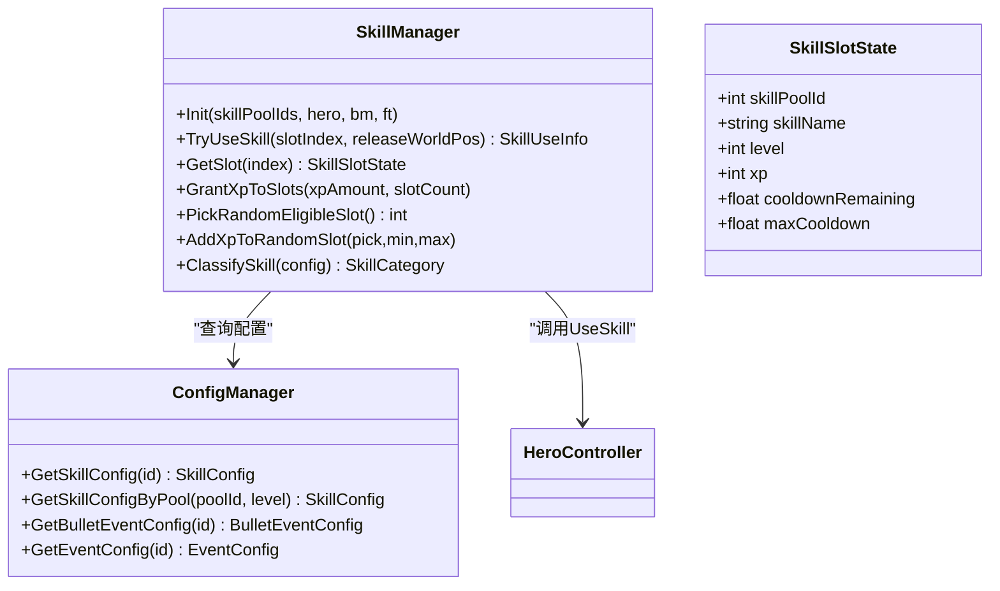
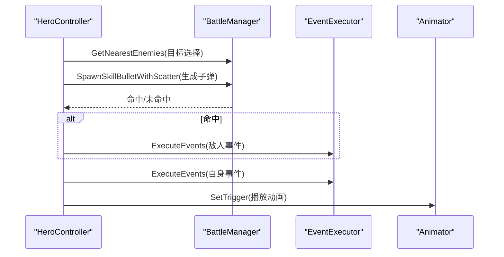
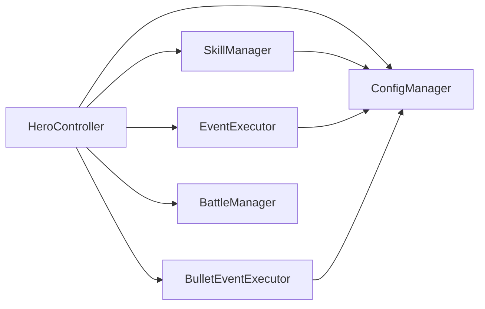

# 英雄技能系统

<cite>
**本文档引用的文件**
- [HeroController.cs](file://Assets/Scripts/Battle/HeroController.cs)
- [SkillManager.cs](file://Assets/Scripts/Battle/SkillManager.cs)
- [BulletEventExecutor.cs](file://Assets/Scripts/Battle/BulletEventExecutor.cs)
- [EventExecutor.cs](file://Assets/Scripts/Battle/EventExecutor.cs)
- [ConfigManager.cs](file://Assets/Scripts/Core/ConfigManager.cs)
- [skill_config.json](file://Assets/Resources/Configs/skill_config.json)
</cite>

## 目录
1. [简介](#简介)
2. [项目结构](#项目结构)
3. [核心组件](#核心组件)
4. [架构总览](#架构总览)
5. [详细组件分析](#详细组件分析)
6. [依赖关系分析](#依赖关系分析)
7. [性能考虑](#性能考虑)
8. [故障排除指南](#故障排除指南)
9. [结论](#结论)
10. [附录](#附录)

## 简介
本文件面向HeroController的技能系统，提供从架构设计到实现细节的全面技术文档。重点涵盖：
- 统一入口UseSkill与技能路由机制
- 技能分类与处理流程（弹幕、自身效果、护盾、AoE、召唤）
- 技能配置加载与管理（SkillConfig、技能ID映射、冷却时间）
- 技能执行全流程（伤害计算、目标选择、子弹生成、事件触发、动画播放）
- 扩展机制（新增技能类型与效果）
- 性能优化策略与最佳实践

## 项目结构
技能系统主要由以下模块协作完成：
- HeroController：英雄实体，负责技能使用、伤害计算、目标选择、子弹发射与事件执行
- SkillManager：技能槽位管理、冷却控制、XP成长与技能调用
- EventExecutor：通用事件执行器，支持伤害、护盾、击退、经验、能量、增益、被动、召唤、驱散等
- BulletEventExecutor：子弹事件聚合器，将多个子弹事件参数合并为BulletEventData
- ConfigManager：配置中心，提供SkillConfig、BulletEventConfig、EventConfig等读取
- skill_config.json：技能配置资源，包含技能ID、等级、类别、伤害、冷却、子弹样式、事件列表等

**图表来源**
- [HeroController.cs:284-297](file://Assets/Scripts/Battle/HeroController.cs#L284-L297)
- [SkillManager.cs:48-137](file://Assets/Scripts/Battle/SkillManager.cs#L48-L137)
- [BulletEventExecutor.cs:8-95](file://Assets/Scripts/Battle/BulletEventExecutor.cs#L8-L95)
- [EventExecutor.cs:15-63](file://Assets/Scripts/Battle/EventExecutor.cs#L15-L63)
- [ConfigManager.cs](file://Assets/Scripts/Core/ConfigManager.cs)

**章节来源**
- [HeroController.cs:85-138](file://Assets/Scripts/Battle/HeroController.cs#L85-L138)
- [SkillManager.cs:48-137](file://Assets/Scripts/Battle/SkillManager.cs#L48-L137)

## 核心组件
- HeroController
  - 负责初始化英雄属性、技能冷却、攻击循环、伤害减免与护盾逻辑
  - 提供UseSkill统一入口，按技能类别分派到具体处理函数
  - 负责目标选择、伤害计算、子弹生成、事件触发与动画播放
- SkillManager
  - 管理技能槽位（技能池ID、名称、等级、XP、冷却剩余）
  - 控制冷却时间更新与技能释放校验
  - 依据槽位等级查询SkillConfig并调用HeroController.UseSkill
- EventExecutor
  - 通用事件执行器，根据事件类型分发到对应处理器
  - 支持伤害、护盾、击退、经验、能量、增益、被动、召唤、驱散等
- BulletEventExecutor
  - 将多个子弹事件ID合并为BulletEventData，聚合pierce、explosion、tracking、scatter、bounce、burst、volley等参数
- ConfigManager
  - 提供SkillConfig、BulletEventConfig、EventConfig等配置读取接口
- skill_config.json
  - 技能配置资源，包含技能ID、等级、类别、伤害、冷却、子弹样式、事件列表等

**章节来源**
- [HeroController.cs:284-297](file://Assets/Scripts/Battle/HeroController.cs#L284-L297)
- [SkillManager.cs:25-40](file://Assets/Scripts/Battle/SkillManager.cs#L25-L40)
- [EventExecutor.cs:15-63](file://Assets/Scripts/Battle/EventExecutor.cs#L15-L63)
- [BulletEventExecutor.cs:8-95](file://Assets/Scripts/Battle/BulletEventExecutor.cs#L8-L95)
- [ConfigManager.cs](file://Assets/Scripts/Core/ConfigManager.cs)
- [skill_config.json:1-1509](file://Assets/Resources/Configs/skill_config.json#L1-L1509)

## 架构总览
技能系统采用“统一入口 + 分类路由”的设计，HeroController作为核心调度者，SkillManager负责冷却与槽位管理，EventExecutor与BulletEventExecutor分别处理事件与子弹行为，ConfigManager提供配置支撑。

**图表来源**
- [SkillManager.cs:87-137](file://Assets/Scripts/Battle/SkillManager.cs#L87-L137)
- [HeroController.cs:284-297](file://Assets/Scripts/Battle/HeroController.cs#L284-L297)
- [ConfigManager.cs](file://Assets/Scripts/Core/ConfigManager.cs)

## 详细组件分析

### UseSkill统一入口与技能路由
- 统一入口：HeroController.UseSkill接收SkillConfig，通过SkillManager.ClassifySkill进行分类
- 路由机制：根据分类调用对应处理函数（弹幕、自身、护盾、AoE、召唤）
- 冷却与范围：路由前会检查冷却状态与攻击范围，确保合法使用

**图表来源**
- [HeroController.cs:284-297](file://Assets/Scripts/Battle/HeroController.cs#L284-L297)
- [SkillManager.cs:25-40](file://Assets/Scripts/Battle/SkillManager.cs#L25-L40)

**章节来源**
- [HeroController.cs:284-297](file://Assets/Scripts/Battle/HeroController.cs#L284-L297)
- [SkillManager.cs:25-40](file://Assets/Scripts/Battle/SkillManager.cs#L25-L40)

### 技能类型处理详解

#### HandleProjectileSkill 弹幕技能
- 伤害计算：基于英雄攻击力与技能伤害比例，叠加技能伤害修正系数
- 子弹事件：合并基础子弹事件与来自Buff的额外子弹事件，构建BulletEventData
- 目标选择：按技能范围与目标数量选择最近敌人
- 发射方式：支持单发或连发（burstCount），必要时协程延时
- 敌人事件：将技能的enemyEvents合并到子弹attachToTargetEventIds中，命中后触发

**图表来源**
- [HeroController.cs:300-339](file://Assets/Scripts/Battle/HeroController.cs#L300-L339)
- [BulletEventExecutor.cs:8-95](file://Assets/Scripts/Battle/BulletEventExecutor.cs#L8-L95)

**章节来源**
- [HeroController.cs:300-339](file://Assets/Scripts/Battle/HeroController.cs#L300-L339)
- [BulletEventExecutor.cs:8-95](file://Assets/Scripts/Battle/BulletEventExecutor.cs#L8-L95)

#### HandleSelfSkill 自身效果技能
- 仅对施法者生效，执行技能自身的events（如增益、治疗、经验、能量等）

**章节来源**
- [HeroController.cs:342-352](file://Assets/Scripts/Battle/HeroController.cs#L342-L352)

#### HandleShieldSkill 护盾技能
- 对施法者施加护盾效果，通常配合Buff系统实现护盾值叠加与衰减

**章节来源**
- [HeroController.cs:355-365](file://Assets/Scripts/Battle/HeroController.cs#L355-L365)

#### HandleAoeSkill 全屏AoE技能
- 计算AOE伤害，叠加技能伤害修正系数
- 先执行自身事件，再对全屏敌人造成伤害并附加enemyEvents

**图表来源**
- [HeroController.cs:368-389](file://Assets/Scripts/Battle/HeroController.cs#L368-L389)

**章节来源**
- [HeroController.cs:368-389](file://Assets/Scripts/Battle/HeroController.cs#L368-L389)

#### HandleSummonSkill 召唤技能
- 执行技能自身的events，通常包含召唤怪物的事件类型

**章节来源**
- [HeroController.cs:392-402](file://Assets/Scripts/Battle/HeroController.cs#L392-L402)

### 技能配置加载与管理
- 配置读取：ConfigManager提供SkillConfig、BulletEventConfig、EventConfig等读取接口
- 技能ID映射：SkillManager根据技能池ID与等级查询SkillConfig
- 冷却时间：SkillManager维护每个槽位的冷却剩余与最大冷却，UseSkill后重置
- 技能分类：SkillManager.ClassifySkill优先读取配置中的category字段，否则回退到根据bulletSpeed/dmg判断

**图表来源**
- [SkillManager.cs:15-240](file://Assets/Scripts/Battle/SkillManager.cs#L15-L240)
- [ConfigManager.cs](file://Assets/Scripts/Core/ConfigManager.cs)

**章节来源**
- [SkillManager.cs:48-137](file://Assets/Scripts/Battle/SkillManager.cs#L48-L137)
- [SkillManager.cs:25-40](file://Assets/Scripts/Battle/SkillManager.cs#L25-L40)
- [ConfigManager.cs](file://Assets/Scripts/Core/ConfigManager.cs)

### 技能执行全流程
- 目标选择：优先按技能范围与目标数量选择最近敌人；若无目标则不释放
- 子弹生成：根据BulletEventData参数生成散射、追踪、弹跳、爆炸等效果
- 伤害计算：EventExecutor.HandleDamage根据伤害率与伤害类型计算最终伤害
- 事件触发：先执行自身事件，再执行敌人事件（如附着到目标的事件）
- 动画播放：触发攻击或蓄力动画

**图表来源**
- [HeroController.cs:207-281](file://Assets/Scripts/Battle/HeroController.cs#L207-L281)
- [EventExecutor.cs:15-63](file://Assets/Scripts/Battle/EventExecutor.cs#L15-L63)

**章节来源**
- [HeroController.cs:207-281](file://Assets/Scripts/Battle/HeroController.cs#L207-L281)
- [EventExecutor.cs:65-93](file://Assets/Scripts/Battle/EventExecutor.cs#L65-L93)

### 扩展机制
- 新增技能类型
  - 在SkillManager.ClassifySkill中增加分类判断或扩展category字段
  - 在HeroController.UseSkill中新增case分支并实现对应处理函数
- 新增子弹事件
  - 在BulletEventExecutor中扩展BuildBulletData的事件类型分支
  - 在BulletEventData中新增对应字段（如新效果参数）
- 新增通用事件
  - 在EventExecutor中新增事件类型分支与处理逻辑
  - 在EventContext中补充必要的上下文信息

**章节来源**
- [SkillManager.cs:25-40](file://Assets/Scripts/Battle/SkillManager.cs#L25-L40)
- [HeroController.cs:284-297](file://Assets/Scripts/Battle/HeroController.cs#L284-L297)
- [BulletEventExecutor.cs:8-95](file://Assets/Scripts/Battle/BulletEventExecutor.cs#L8-L95)
- [EventExecutor.cs:15-63](file://Assets/Scripts/Battle/EventExecutor.cs#L15-L63)

### 关键算法与实现要点
- 伤害公式
  - 基础伤害：英雄攻击力 × 技能伤害比例 / 10000
  - 技能伤害修正：叠加Buff提供的技能伤害修正系数
  - 最终伤害：通过DamageCalculator计算（包含抗性、减伤、弱点等）
- 目标筛选
  - 优先使用BulletEventData.volleyCount，其次使用属性AttackCount
  - 按技能范围与目标数量选择最近敌人
- 效果叠加
  - 子弹事件合并：将技能自带事件与Buff附加事件合并
  - 敌人事件附着：将enemyEvents合并到子弹attachToTargetEventIds中

**章节来源**
- [HeroController.cs:250-258](file://Assets/Scripts/Battle/HeroController.cs#L250-L258)
- [HeroController.cs:235-242](file://Assets/Scripts/Battle/HeroController.cs#L235-L242)
- [HeroController.cs:492-499](file://Assets/Scripts/Battle/HeroController.cs#L492-L499)
- [BulletEventExecutor.cs:8-95](file://Assets/Scripts/Battle/BulletEventExecutor.cs#L8-L95)

## 依赖关系分析
- HeroController依赖
  - SkillManager：用于分类与路由
  - ConfigManager：读取SkillConfig、BulletEventConfig、EventConfig
  - EventExecutor：执行事件
  - BulletEventExecutor：聚合子弹事件
  - BattleManager：目标选择、子弹生成、AOE伤害
- SkillManager依赖
  - ConfigManager：查询SkillConfig
  - HeroController：调用UseSkill
- EventExecutor与BulletEventExecutor依赖
  - ConfigManager：读取事件与子弹事件配置

**图表来源**
- [HeroController.cs:284-297](file://Assets/Scripts/Battle/HeroController.cs#L284-L297)
- [SkillManager.cs:48-137](file://Assets/Scripts/Battle/SkillManager.cs#L48-L137)
- [EventExecutor.cs:15-63](file://Assets/Scripts/Battle/EventExecutor.cs#L15-L63)
- [BulletEventExecutor.cs:8-95](file://Assets/Scripts/Battle/BulletEventExecutor.cs#L8-L95)

**章节来源**
- [HeroController.cs:284-297](file://Assets/Scripts/Battle/HeroController.cs#L284-L297)
- [SkillManager.cs:48-137](file://Assets/Scripts/Battle/SkillManager.cs#L48-L137)

## 性能考虑
- 冷却与计时
  - 使用增量式冷却更新，避免每帧重复查询配置
  - 技能冷却与攻击间隔分开管理，减少耦合
- 目标选择
  - 优先使用最近敌人，减少遍历成本
  - 范围与数量限制避免过度搜索
- 子弹事件聚合
  - 一次性BuildBulletData，避免多次配置查询
  - burstCount使用协程分帧，降低单帧峰值
- 事件执行
  - 事件数组顺序执行，避免重复查找
  - 未知事件类型仅记录警告，不阻塞主流程
- 动画与视觉
  - 动画触发与事件解耦，避免同步阻塞

[本节为通用性能建议，无需特定文件引用]

## 故障排除指南
- 技能无法释放
  - 检查SkillManager.TryUseSkill返回的错误码（等级不足、冷却中、无效槽位）
  - 确认SkillConfig的cd与category正确
- 伤害异常
  - 检查技能伤害比例与Buff伤害修正是否叠加
  - 确认DamageCalculator输入参数（attackerAttrs、defenderAttrs、dmgType等）
- 子弹效果不生效
  - 检查BulletEventExecutor是否正确聚合事件参数
  - 确认attachToTargetEventIds是否合并了enemyEvents
- 动画未播放
  - 检查Animator是否存在且已设置触发器
  - 确认UseSkill路径中是否调用了动画触发

**章节来源**
- [SkillManager.cs:87-137](file://Assets/Scripts/Battle/SkillManager.cs#L87-L137)
- [HeroController.cs:284-297](file://Assets/Scripts/Battle/HeroController.cs#L284-L297)
- [EventExecutor.cs:65-93](file://Assets/Scripts/Battle/EventExecutor.cs#L65-L93)
- [BulletEventExecutor.cs:8-95](file://Assets/Scripts/Battle/BulletEventExecutor.cs#L8-L95)

## 结论
HeroController的技能系统以统一入口与分类路由为核心，结合SkillManager的冷却与槽位管理、EventExecutor与BulletEventExecutor的事件与子弹行为聚合，以及ConfigManager的配置支撑，形成了可扩展、可维护的技能体系。通过合理的算法与性能优化策略，系统能够在保证灵活性的同时维持良好的运行效率。

[本节为总结性内容，无需特定文件引用]

## 附录
- 技能配置示例参考：skill_config.json中包含多种技能类别（Projectile、Self、Shield、Aoe、Summon）与等级变化
- 事件与子弹事件类型定义：参考EventExecutor与BulletEventExecutor中的事件类型枚举与参数说明

**章节来源**
- [skill_config.json:1-1509](file://Assets/Resources/Configs/skill_config.json#L1-L1509)
- [EventExecutor.cs:15-63](file://Assets/Scripts/Battle/EventExecutor.cs#L15-L63)
- [BulletEventExecutor.cs:8-95](file://Assets/Scripts/Battle/BulletEventExecutor.cs#L8-L95)