# 英雄核心控制逻辑

<cite>
**本文档引用的文件**
- [HeroController.cs](file://Assets/Scripts/Battle/HeroController.cs)
- [AttrComponent.cs](file://Assets/Scripts/Battle/AttrComponent.cs)
- [BuffSystem.cs](file://Assets/Scripts/Battle/BuffSystem.cs)
- [PassiveSystem.cs](file://Assets/Scripts/Battle/PassiveSystem.cs)
- [SkillManager.cs](file://Assets/Scripts/Battle/SkillManager.cs)
- [DamageCalculator.cs](file://Assets/Scripts/Battle/DamageCalculator.cs)
- [BulletEventExecutor.cs](file://Assets/Scripts/Battle/BulletEventExecutor.cs)
- [ConfigManager.cs](file://Assets/Scripts/Core/ConfigManager.cs)
- [hero_config.json](file://Assets/Resources/Configs/hero_config.json)
- [skill_config.json](file://Assets/Resources/Configs/skill_config.json)
- [attribute_config.json](file://Assets/Resources/Configs/attribute_config.json)
</cite>

## 目录
1. [简介](#简介)
2. [项目结构](#项目结构)
3. [核心组件](#核心组件)
4. [架构总览](#架构总览)
5. [详细组件分析](#详细组件分析)
6. [依赖关系分析](#依赖关系分析)
7. [性能考量](#性能考量)
8. [故障排查指南](#故障排查指南)
9. [结论](#结论)
10. [附录](#附录)

## 简介
本文件面向HeroController的核心控制逻辑，系统化梳理其职责边界与实现机制，覆盖属性初始化、状态管理、攻击循环、技能系统集成等关键环节。文档以循序渐进的方式呈现，既适合初学者快速上手，也便于资深开发者深入理解内部算法与扩展点。

## 项目结构
HeroController位于战斗模块中，负责英雄实体的生命周期、行为调度与交互。其直接依赖如下：
- 属性系统：AttrComponent 提供基础/加成/最终属性计算与派生属性
- 增益系统：BuffSystem 管理增益/减益/特殊效果，驱动属性加成与周期性事件
- 被动系统：PassiveSystem 管理被动触发与移除条件
- 技能系统：SkillManager 分类与使用技能；HeroController 内部路由不同类型的技能
- 计算系统：DamageCalculator 提供伤害计算；BulletEventExecutor 解析子弹事件
- 配置系统：ConfigManager 统一加载与查询各类配置

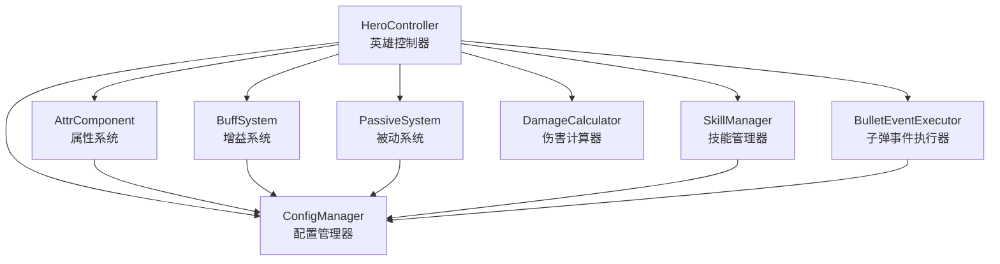

图表来源
- [HeroController.cs:85-138](file://Assets/Scripts/Battle/HeroController.cs#L85-L138)
- [AttrComponent.cs:11-21](file://Assets/Scripts/Battle/AttrComponent.cs#L11-L21)
- [BuffSystem.cs:34-84](file://Assets/Scripts/Battle/BuffSystem.cs#L34-L84)
- [PassiveSystem.cs:18-39](file://Assets/Scripts/Battle/PassiveSystem.cs#L18-L39)
- [SkillManager.cs:25-40](file://Assets/Scripts/Battle/SkillManager.cs#L25-L40)
- [DamageCalculator.cs:24-103](file://Assets/Scripts/Battle/DamageCalculator.cs#L24-L103)
- [BulletEventExecutor.cs:8-95](file://Assets/Scripts/Battle/BulletEventExecutor.cs#L8-L95)
- [ConfigManager.cs:77-122](file://Assets/Scripts/Core/ConfigManager.cs#L77-L122)

章节来源
- [HeroController.cs:85-138](file://Assets/Scripts/Battle/HeroController.cs#L85-L138)
- [ConfigManager.cs:77-122](file://Assets/Scripts/Core/ConfigManager.cs#L77-L122)

## 核心组件
- 英雄控制器 HeroController：负责初始化、主循环、攻击决策、受击处理、技能路由与状态同步
- 属性系统 AttrComponent：提供基础/加成/最终属性计算，派生属性（如最大生命、攻击、攻速、移速）
- 增益系统 BuffSystem：管理增益/减益叠加上限、持续时间、周期性事件、无敌/冻结判定、伤害修正
- 被动系统 PassiveSystem：注册被动、按触发时机与条件执行、支持移除条件
- 技能管理器 SkillManager：技能槽位、等级/经验、冷却、使用验证与分类
- 伤害计算器 DamageCalculator：命中/闪避、元素加成/减免、暴击/抗性、Boss/精英加成
- 子弹事件执行器 BulletEventExecutor：解析子弹事件（穿透、爆炸、追踪、散射、弹跳、爆发、齐射等）

章节来源
- [HeroController.cs:85-138](file://Assets/Scripts/Battle/HeroController.cs#L85-L138)
- [AttrComponent.cs:38-114](file://Assets/Scripts/Battle/AttrComponent.cs#L38-L114)
- [BuffSystem.cs:30-258](file://Assets/Scripts/Battle/BuffSystem.cs#L30-L258)
- [PassiveSystem.cs:14-148](file://Assets/Scripts/Battle/PassiveSystem.cs#L14-L148)
- [SkillManager.cs:15-242](file://Assets/Scripts/Battle/SkillManager.cs#L15-L242)
- [DamageCalculator.cs:22-103](file://Assets/Scripts/Battle/DamageCalculator.cs#L22-L103)
- [BulletEventExecutor.cs:6-98](file://Assets/Scripts/Battle/BulletEventExecutor.cs#L6-L98)

## 架构总览
HeroController采用“控制器+系统”的分层设计：
- 控制器层：HeroController 负责状态机与行为编排
- 系统层：AttrComponent/BuffSystem/PassiveSystem 独立维护各自状态与规则
- 计算层：DamageCalculator/BulletEventExecutor 提供可复用的计算与事件解析
- 配置层：ConfigManager 加载并缓存配置，为各系统提供查询接口

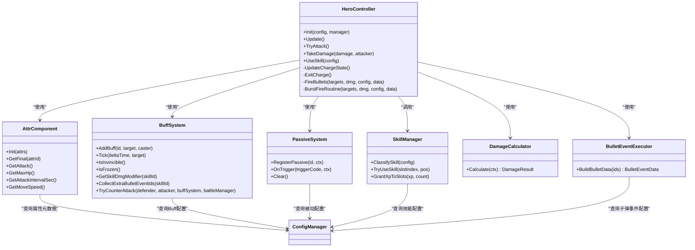

图表来源
- [HeroController.cs:85-281](file://Assets/Scripts/Battle/HeroController.cs#L85-L281)
- [AttrComponent.cs:11-114](file://Assets/Scripts/Battle/AttrComponent.cs#L11-L114)
- [BuffSystem.cs:34-375](file://Assets/Scripts/Battle/BuffSystem.cs#L34-L375)
- [PassiveSystem.cs:18-148](file://Assets/Scripts/Battle/PassiveSystem.cs#L18-L148)
- [SkillManager.cs:25-137](file://Assets/Scripts/Battle/SkillManager.cs#L25-L137)
- [DamageCalculator.cs:24-103](file://Assets/Scripts/Battle/DamageCalculator.cs#L24-L103)
- [BulletEventExecutor.cs:8-95](file://Assets/Scripts/Battle/BulletEventExecutor.cs#L8-L95)
- [ConfigManager.cs:217-272](file://Assets/Scripts/Core/ConfigManager.cs#L217-L272)

## 详细组件分析

### 初始化流程（Init）
HeroController的Init方法完成以下关键步骤：
- 属性系统建立：获取或创建AttrComponent并初始化基础属性
- 生命与护盾：基于属性计算最大生命与初始护盾
- 蓄力配置：记录蓄力相关Buff ID、重置最后攻击时间、初始化蓄力状态
- 攻击技能数组：根据配置构建技能ID、CD、计时器与配置数组，并确定攻击范围
- 引用与UI：获取Animator、方向朝向组件，设置血条与护盾条UI
- 清空系统：清空Buff与被动系统，刷新UI

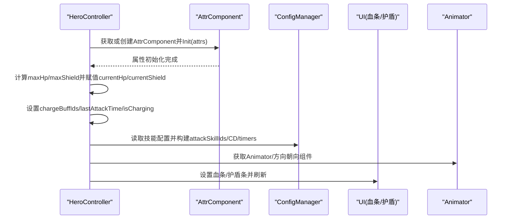

图表来源
- [HeroController.cs:85-138](file://Assets/Scripts/Battle/HeroController.cs#L85-L138)
- [AttrComponent.cs:11-21](file://Assets/Scripts/Battle/AttrComponent.cs#L11-L21)
- [ConfigManager.cs:217-227](file://Assets/Scripts/Core/ConfigManager.cs#L217-L227)

章节来源
- [HeroController.cs:85-138](file://Assets/Scripts/Battle/HeroController.cs#L85-L138)
- [hero_config.json:13-22](file://Assets/Resources/Configs/hero_config.json#L13-L22)
- [skill_config.json:8-19](file://Assets/Resources/Configs/skill_config.json#L8-L19)

### 主循环（Update）
每帧Update负责：
- Buff系统驱动：按deltaTime推进，可能触发周期性事件与结束事件
- 蓄力状态检测：若空闲时间超过阈值且存在蓄力Buff，进入蓄力状态并播放动画
- 技能冷却计时：对每个攻击技能计时器累加
- 攻击间隔控制：根据属性计算的攻击间隔，当计时达到阈值且未冻结时尝试攻击
- UI刷新：更新血条与护盾条

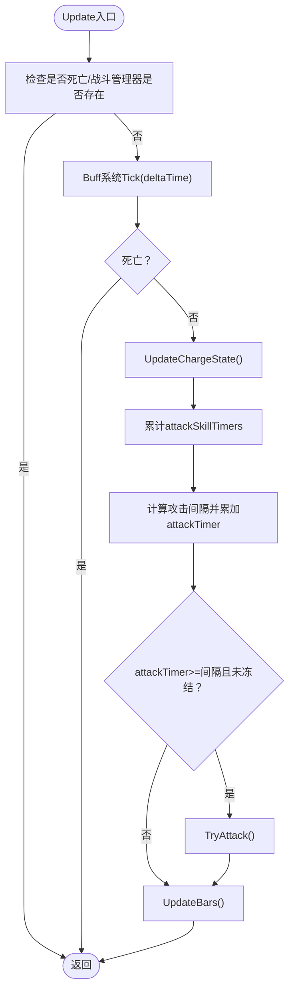

图表来源
- [HeroController.cs:147-176](file://Assets/Scripts/Battle/HeroController.cs#L147-L176)
- [BuffSystem.cs:140-225](file://Assets/Scripts/Battle/BuffSystem.cs#L140-L225)

章节来源
- [HeroController.cs:147-176](file://Assets/Scripts/Battle/HeroController.cs#L147-L176)
- [BuffSystem.cs:140-225](file://Assets/Scripts/Battle/BuffSystem.cs#L140-L225)

### 蓄力状态（Charge）
蓄力逻辑基于空闲时间阈值判断：
- 当idle >= 5秒且isCharging为false时，进入蓄力：设置isCharging=true、播放动画、为每个chargeBuffId添加对应Buff
- 攻击发生时立即退出蓄力：移除所有对应的Buff

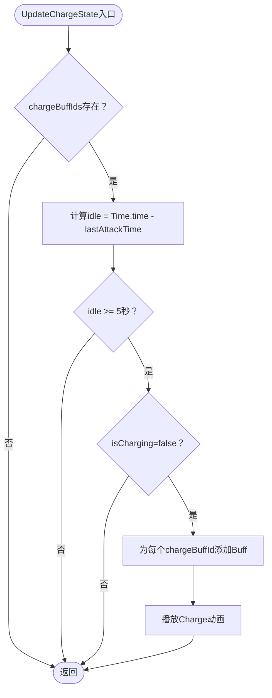

图表来源
- [HeroController.cs:178-205](file://Assets/Scripts/Battle/HeroController.cs#L178-L205)

章节来源
- [HeroController.cs:178-205](file://Assets/Scripts/Battle/HeroController.cs#L178-L205)

### 攻击决策（TryAttack）
TryAttack的完整流程：
- 选择可用技能：从后向前扫描attackSkillTimers，找到首个冷却完毕的技能索引
- 重置计时器并获取技能配置
- 合并子弹事件：将技能自带事件与Buff收集的额外事件合并
- 目标选择：优先使用子弹数据的齐射数，否则使用属性AttackCount；调用BattleManager获取最近敌人列表
- 攻击时退出蓄力、更新lastAttackTime、朝向目标、计算基础伤害
- 伤害修正：应用Buff提供的技能伤害修正系数
- 合并敌方事件：将技能的enemyEvents合并到子弹attachToTargetEventIds
- 发射方式：若burstCount>1则协程爆发射击，否则直接发射
- 自身事件：执行技能events
- 动画触发：播放Attack动画
- 通知：调用BattleManager.OnHeroNormalAttack

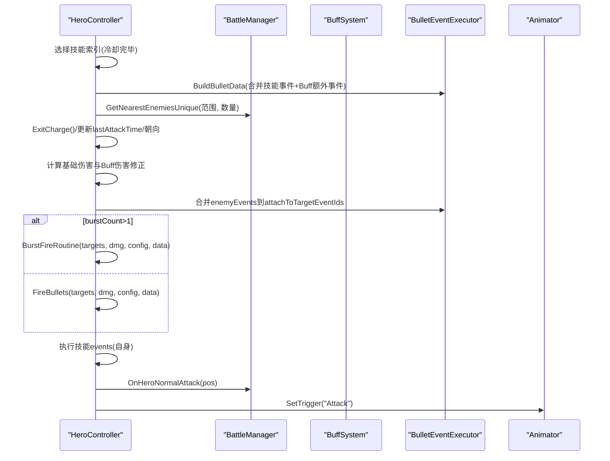

图表来源
- [HeroController.cs:207-281](file://Assets/Scripts/Battle/HeroController.cs#L207-L281)
- [BulletEventExecutor.cs:8-95](file://Assets/Scripts/Battle/BulletEventExecutor.cs#L8-L95)
- [BuffSystem.cs:308-326](file://Assets/Scripts/Battle/BuffSystem.cs#L308-L326)

章节来源
- [HeroController.cs:207-281](file://Assets/Scripts/Battle/HeroController.cs#L207-L281)
- [BulletEventExecutor.cs:8-95](file://Assets/Scripts/Battle/BulletEventExecutor.cs#L8-L95)
- [BuffSystem.cs:308-326](file://Assets/Scripts/Battle/BuffSystem.cs#L308-L326)

### 受击处理（TakeDamage）
TakeDamage遵循以下优先级与顺序：
- 反击：在无敌判定前先尝试Buff反制（可能触发反击技能）
- 无敌判定：若处于无敌状态则直接返回
- 减伤：应用属性AllElemDmgReduce的百分比减免
- 护盾优先：优先扣除护盾，护盾不足再扣血量
- 血量更新：确保不低于0，刷新UI
- 死亡判定：若血量<=0，通知BattleManager.OnHeroDead

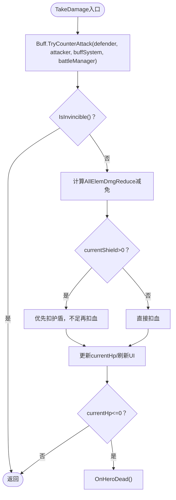

图表来源
- [HeroController.cs:405-447](file://Assets/Scripts/Battle/HeroController.cs#L405-L447)
- [BuffSystem.cs:331-375](file://Assets/Scripts/Battle/BuffSystem.cs#L331-L375)

章节来源
- [HeroController.cs:405-447](file://Assets/Scripts/Battle/HeroController.cs#L405-L447)
- [BuffSystem.cs:331-375](file://Assets/Scripts/Battle/BuffSystem.cs#L331-L375)

### 技能路由（UseSkill）
HeroController提供统一的UseSkill入口，内部按技能类别进行分发：
- 召唤：HandleSummonSkill
- 护盾：HandleShieldSkill
- 自身：HandleSelfSkill
- 子弹型：HandleProjectileSkill（含散射/齐射/爆发等）
- 全屏AOE：HandleAoeSkill

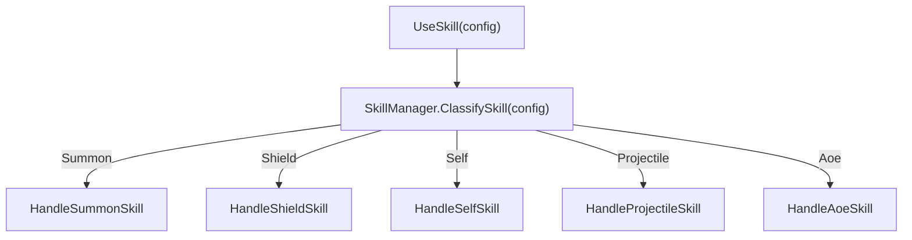

图表来源
- [HeroController.cs:284-297](file://Assets/Scripts/Battle/HeroController.cs#L284-L297)
- [SkillManager.cs:25-40](file://Assets/Scripts/Battle/SkillManager.cs#L25-L40)

章节来源
- [HeroController.cs:284-297](file://Assets/Scripts/Battle/HeroController.cs#L284-L297)
- [SkillManager.cs:25-40](file://Assets/Scripts/Battle/SkillManager.cs#L25-L40)

### 属性计算与派生属性
AttrComponent提供：
- 基础属性与加成属性的存储与查询
- 最终属性的上下限约束与浮点转换
- 派生属性：最大生命、攻击力、攻击间隔（毫秒转秒）、移动速度

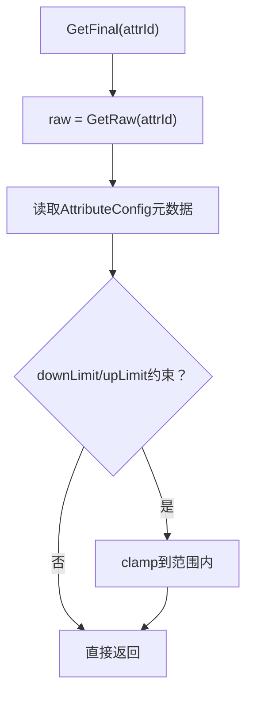

图表来源
- [AttrComponent.cs:38-53](file://Assets/Scripts/Battle/AttrComponent.cs#L38-L53)
- [attribute_config.json:1-39](file://Assets/Resources/Configs/attribute_config.json#L1-L39)

章节来源
- [AttrComponent.cs:38-114](file://Assets/Scripts/Battle/AttrComponent.cs#L38-L114)
- [attribute_config.json:1-39](file://Assets/Resources/Configs/attribute_config.json#L1-L39)

### 伤害公式与判定
DamageCalculator提供完整的伤害计算链路：
- 命中判定：命中率-闪避率，低于阈值则miss
- 基础伤害：攻击力 × 技能伤害比例 / 10000
- 元素加成/减免：技能类型对应元素加成 + 全元素加成，减去目标元素减免 + 全元素减免
- 暴击判定：暴击率-抗性，产生暴击倍率
- Boss/精英加成：对Boss或精英单位的额外伤害加成
- 最终伤害：max(0, 基础×(1+加成-减免)×(1+暴击)×(1+Boss/精英))

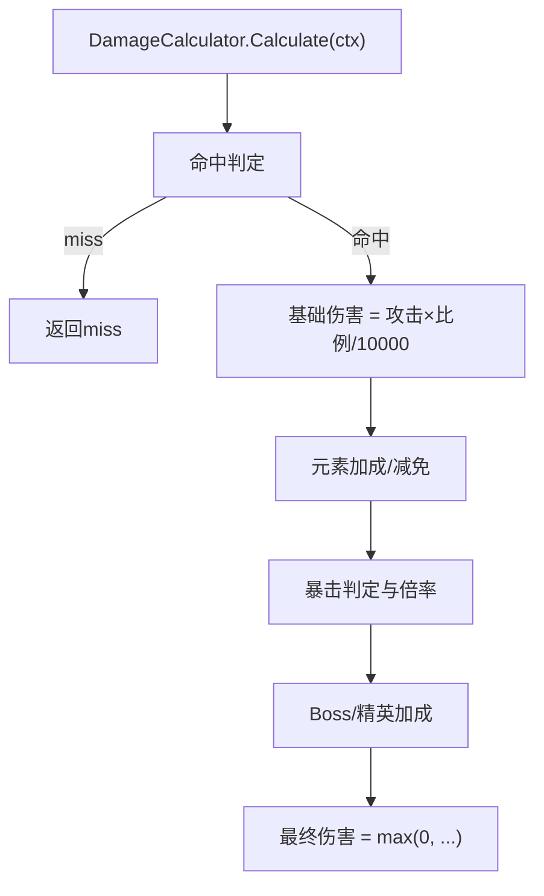

图表来源
- [DamageCalculator.cs:24-103](file://Assets/Scripts/Battle/DamageCalculator.cs#L24-L103)

章节来源
- [DamageCalculator.cs:24-103](file://Assets/Scripts/Battle/DamageCalculator.cs#L24-L103)

### 子弹事件解析
BulletEventExecutor将事件ID序列解析为BulletEventData，支持：
- 穿透、爆炸、追踪、散射、弹跳、爆发、齐射、附着到目标/施法者等

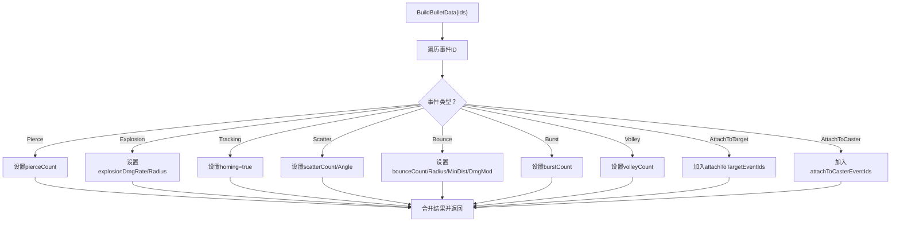

图表来源
- [BulletEventExecutor.cs:8-95](file://Assets/Scripts/Battle/BulletEventExecutor.cs#L8-L95)

章节来源
- [BulletEventExecutor.cs:8-95](file://Assets/Scripts/Battle/BulletEventExecutor.cs#L8-L95)

### 被动系统与增益系统
- 被动系统：注册被动事件，按触发时机与条件执行，支持按触发次数或特定触发码移除
- 增益系统：支持叠加上限、刷新持续时间、周期性跳伤/事件、属性加成重算、无敌/冻结判定、伤害修正、额外子弹事件收集、反击触发

章节来源
- [PassiveSystem.cs:18-148](file://Assets/Scripts/Battle/PassiveSystem.cs#L18-L148)
- [BuffSystem.cs:34-375](file://Assets/Scripts/Battle/BuffSystem.cs#L34-L375)

## 依赖关系分析
HeroController与各系统的耦合度低，主要通过接口与配置管理器解耦：
- 通过IBuffTarget接口与BuffSystem交互
- 通过ConfigManager统一查询技能/子弹事件/Buff/被动配置
- 通过BattleManager进行敌人检索、子弹生成、伤害广播与死亡通知

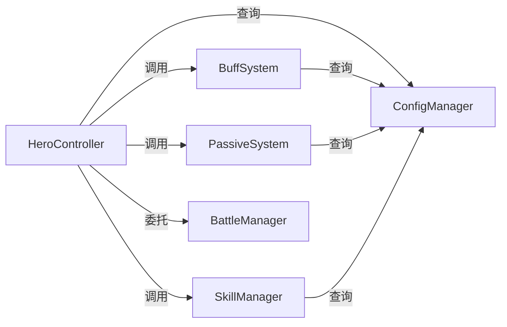

图表来源
- [HeroController.cs:43-47](file://Assets/Scripts/Battle/HeroController.cs#L43-L47)
- [ConfigManager.cs:217-272](file://Assets/Scripts/Core/ConfigManager.cs#L217-L272)

章节来源
- [HeroController.cs:43-47](file://Assets/Scripts/Battle/HeroController.cs#L43-L47)
- [ConfigManager.cs:217-272](file://Assets/Scripts/Core/ConfigManager.cs#L217-L227)

## 性能考量
- Update每帧开销主要来自：
  - BuffSystem.Tick：遍历Buff并按跳伤间隔触发事件，注意避免过多Buff导致的线性开销
  - TryAttack：目标检索、事件合并、伤害计算与子弹生成，建议限制搜索半径与目标数量
- 蓄力状态：仅在空闲阈值触发，避免频繁切换
- 协程爆发射击：burstCount>1时使用协程，注意协程数量与帧间分配
- 属性计算：AttrComponent的GetFinal包含元数据查询，建议在初始化阶段完成属性构建，减少运行时查询

[本节为通用指导，无需特定文件引用]

## 故障排查指南
- 攻击不触发：检查attackSkillTimers是否正确累加、attackTimer是否达到攻击间隔、是否被冻结
- 无敌无效：确认Buff是否标记为无敌类型，且HasSpecialEffect返回true
- 伤害异常：核对AllElemDmgReduce是否生效、元素加成/减免是否正确、是否触发了Buff伤害修正
- 护盾不扣：检查TakeDamage路径是否先扣护盾再扣血，以及currentShield是否被清零
- 技能无效果：确认SkillManager.ClassifySkill返回的类别与HeroController的分支一致，事件ID是否正确解析

章节来源
- [HeroController.cs:147-176](file://Assets/Scripts/Battle/HeroController.cs#L147-L176)
- [HeroController.cs:405-447](file://Assets/Scripts/Battle/HeroController.cs#L405-L447)
- [BuffSystem.cs:129-138](file://Assets/Scripts/Battle/BuffSystem.cs#L129-L138)
- [SkillManager.cs:25-40](file://Assets/Scripts/Battle/SkillManager.cs#L25-L40)

## 结论
HeroController以清晰的职责划分与可扩展的系统设计，实现了稳定的英雄控制逻辑。通过配置驱动与事件系统，能够灵活适配不同英雄与技能机制。建议在扩展新英雄或新技能时，遵循现有接口与配置规范，确保属性、Buff、被动与事件的一致性。

[本节为总结性内容，无需特定文件引用]

## 附录

### 关键算法与数据结构摘要
- 属性系统：AttrComponent提供基础/加成/最终属性与派生属性
- 增益系统：BuffSystem管理叠加、持续时间、周期性事件与伤害修正
- 被动系统：PassiveSystem按触发时机与条件执行事件
- 伤害计算：DamageCalculator实现命中/闪避、元素加成/减免、暴击/抗性、Boss/精英加成
- 子弹事件：BulletEventExecutor解析事件并生成BulletEventData

章节来源
- [AttrComponent.cs:38-114](file://Assets/Scripts/Battle/AttrComponent.cs#L38-L114)
- [BuffSystem.cs:34-375](file://Assets/Scripts/Battle/BuffSystem.cs#L34-L375)
- [PassiveSystem.cs:18-148](file://Assets/Scripts/Battle/PassiveSystem.cs#L18-L148)
- [DamageCalculator.cs:24-103](file://Assets/Scripts/Battle/DamageCalculator.cs#L24-L103)
- [BulletEventExecutor.cs:8-95](file://Assets/Scripts/Battle/BulletEventExecutor.cs#L8-L95)