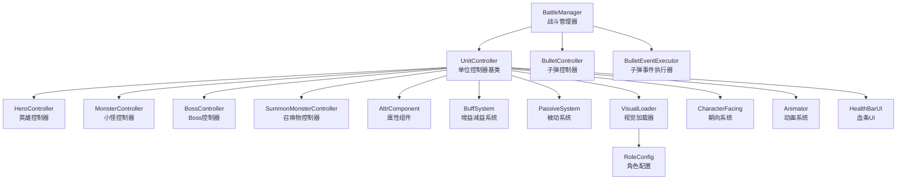
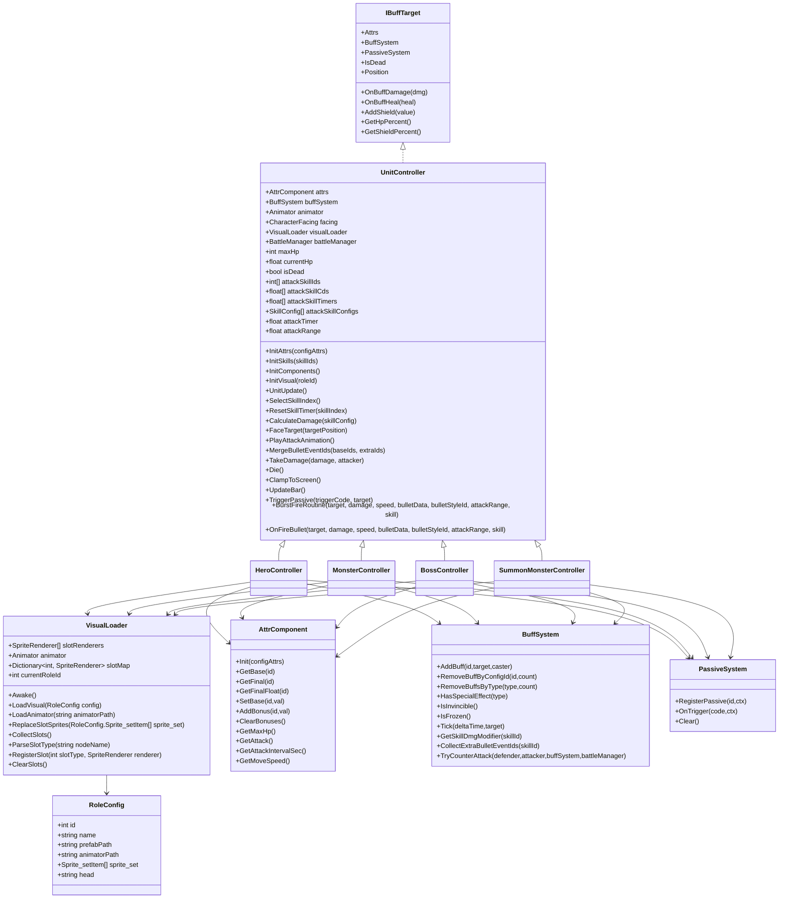
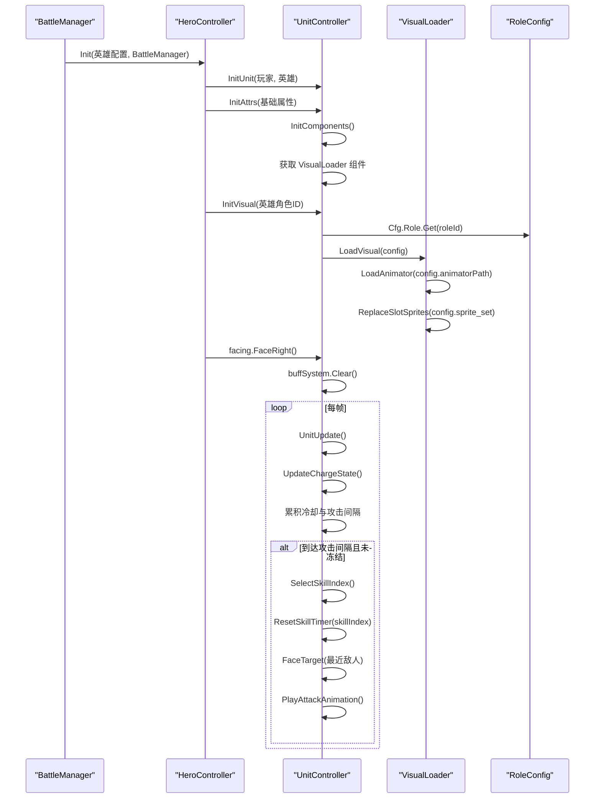
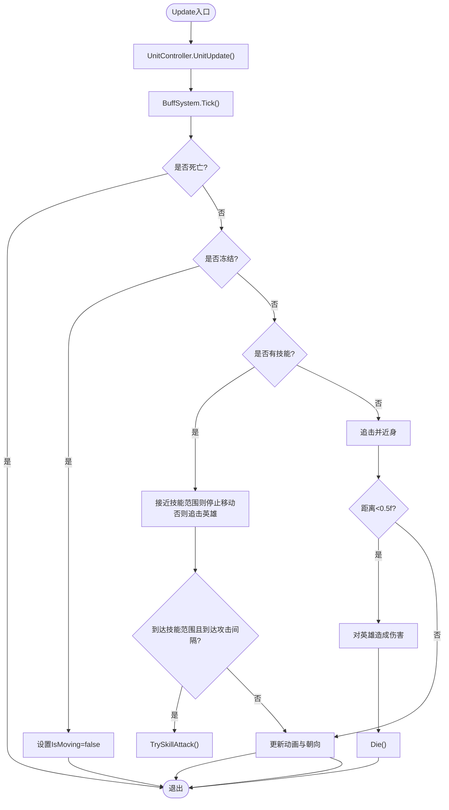
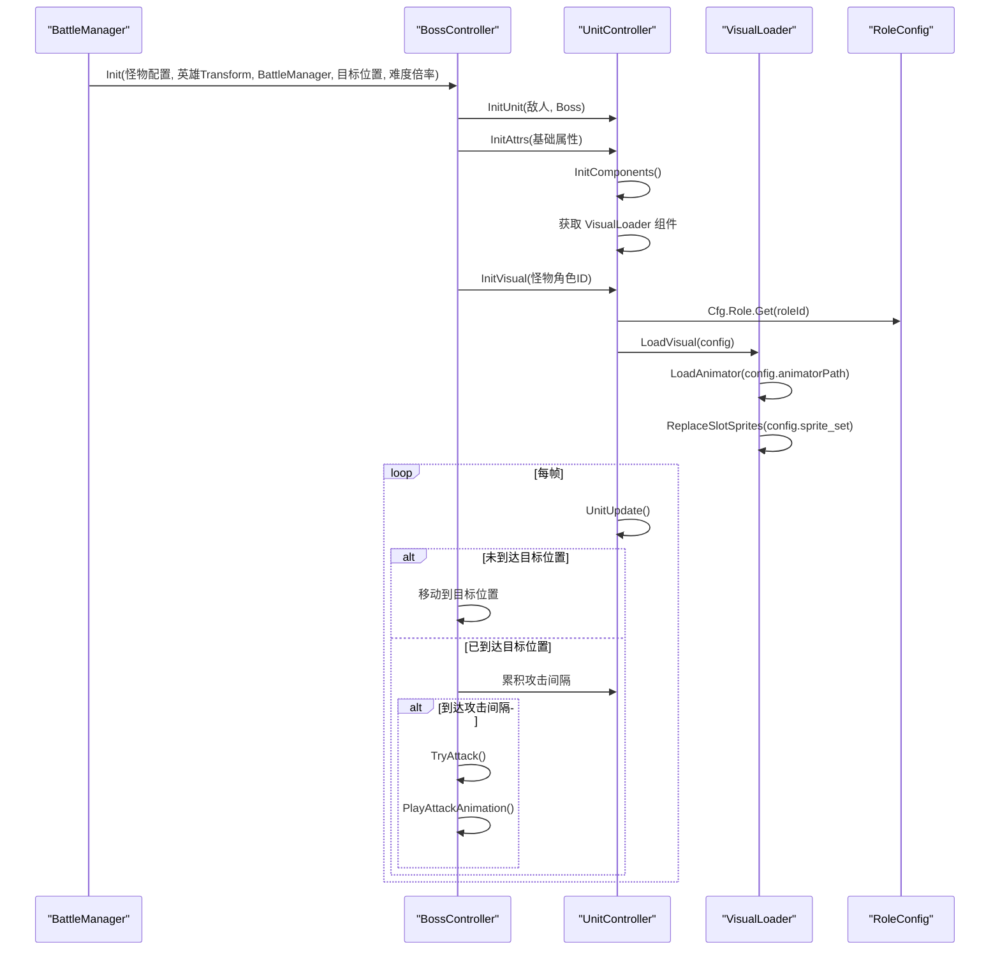
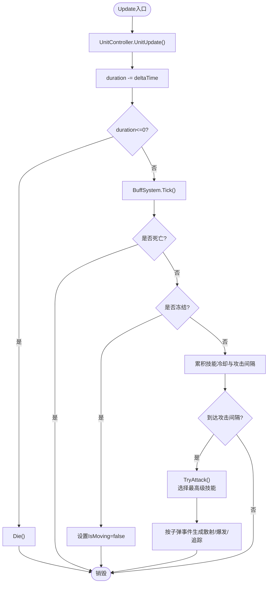
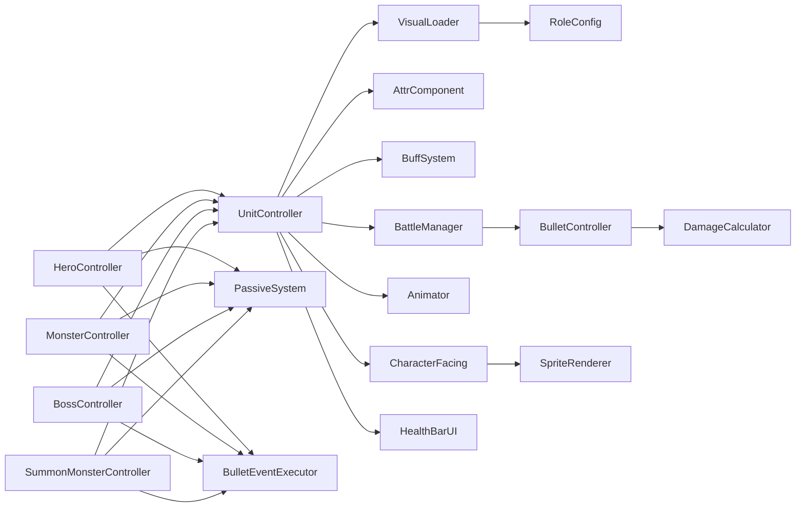

# 角色控制器

<cite>
**本文档引用的文件**
- [UnitController.cs](file://Assets/Scripts/Battle/UnitController.cs)
- [HeroController.cs](file://Assets/Scripts/Battle/HeroController.cs)
- [MonsterController.cs](file://Assets/Scripts/Battle/MonsterController.cs)
- [BossController.cs](file://Assets/Scripts/Battle/BossController.cs)
- [SummonMonsterController.cs](file://Assets/Scripts/Battle/SummonMonsterController.cs)
- [VisualLoader.cs](file://Assets/Scripts/Battle/VisualLoader.cs)
- [VisualLoader_Usage.md](file://Assets/Scripts/Battle/VisualLoader_Usage.md)
- [AttrComponent.cs](file://Assets/Scripts/Battle/AttrComponent.cs)
- [BuffSystem.cs](file://Assets/Scripts/Battle/BuffSystem.cs)
- [PassiveSystem.cs](file://Assets/Scripts/Battle/PassiveSystem.cs)
- [BattleManager.cs](file://Assets/Scripts/Battle/BattleManager.cs)
- [CharacterFacing.cs](file://Assets/Scripts/Battle/CharacterFacing.cs)
- [DamageCalculator.cs](file://Assets/Scripts/Battle/DamageCalculator.cs)
- [BulletController.cs](file://Assets/Scripts/Battle/BulletController.cs)
- [BulletEventExecutor.cs](file://Assets/Scripts/Battle/BulletEventExecutor.cs)
- [RoleConfig.cs](file://Assets/Scripts/Data/Configs/RoleConfig.cs)
- [role_config.json](file://Assets/Resources/Configs/role_config.json)
- [attribute_config.json](file://Assets/Resources/Configs/attribute_config.json)
- [buff_config.json](file://Assets/Resources/Configs/buff_config.json)
- [skill_config.json](file://Assets/Resources/Configs/skill_config.json)
</cite>

## 更新摘要
**变更内容**
- 新增FaceRight()方法确保角色进入战斗时正确朝向右侧
- 动画文件重大更新：新增Charge动画，Attack.anim、Die.anim等动画优化
- 角色面向系统优化，统一了角色朝向控制逻辑

## 目录
1. [简介](#简介)
2. [项目结构](#项目结构)
3. [核心组件](#核心组件)
4. [架构总览](#架构总览)
5. [详细组件分析](#详细组件分析)
6. [视觉定制系统](#视觉定制系统)
7. [角色面向系统](#角色面向系统)
8. [依赖关系分析](#依赖关系分析)
9. [性能考量](#性能考量)
10. [故障排查指南](#故障排查指南)
11. [结论](#结论)
12. [附录](#附录)

## 简介
本技术文档围绕角色控制器系统展开，系统包含四类角色控制器：HeroController（英雄）、MonsterController（小怪）、BossController（Boss）、SummonMonsterController（召唤物）。**经过架构重构，所有角色控制器现在统一继承自UnitController基类，实现了属性管理、增益系统、技能冷却、动画处理等共享功能的标准化。** 系统共享统一的属性系统与增益减益系统，并通过战斗管理器进行生命周期与交互编排。

**最新更新**：系统现已集成VisualLoader视觉定制系统，通过RoleConfig配置实现统一的角色外观管理，支持槽位化Sprite替换和自定义Animator加载。同时新增了角色面向系统优化，确保角色进入战斗时正确朝向右侧。

## 项目结构
角色控制器位于战斗模块下，与属性系统、增益系统、被动系统、战斗管理器、面向系统、伤害计算、子弹系统等紧密协作。**新的架构通过UnitController基类统一了所有角色控制器的共同功能，并通过VisualLoader系统实现统一的视觉定制。**

**更新** 所有角色控制器现在继承自UnitController基类，统一了属性管理、增益系统、技能冷却、动画处理等共享功能。新增的VisualLoader系统通过RoleConfig实现统一的视觉定制。

图示来源
- [BattleManager.cs:145-275](file://Assets/Scripts/Battle/BattleManager.cs#L145-L275)
- [UnitController.cs:10-271](file://Assets/Scripts/Battle/UnitController.cs#L10-L271)
- [HeroController.cs:7-457](file://Assets/Scripts/Battle/HeroController.cs#L7-L457)
- [MonsterController.cs:5-221](file://Assets/Scripts/Battle/MonsterController.cs#L5-L221)
- [BossController.cs:5-190](file://Assets/Scripts/Battle/BossController.cs#L5-L190)
- [SummonMonsterController.cs:6-199](file://Assets/Scripts/Battle/SummonMonsterController.cs#L6-L199)
- [VisualLoader.cs:10-205](file://Assets/Scripts/Battle/VisualLoader.cs#L10-L205)

章节来源
- [BattleManager.cs:145-275](file://Assets/Scripts/Battle/BattleManager.cs#L145-L275)
- [UnitController.cs:10-271](file://Assets/Scripts/Battle/UnitController.cs#L10-L271)

## 核心组件
- **UnitController基类**：提供所有角色控制器共享的基础功能，包括属性管理、增益系统、技能冷却、动画处理、屏幕边界限制、UI更新等。
- **VisualLoader视觉加载器**：根据RoleConfig动态替换槽位Sprite和Animator，实现统一的角色外观管理。
- **RoleConfig角色配置**：包含角色ID、名称、预制体路径、动画控制器路径、槽位贴图配置等信息。
- **属性系统 AttrComponent**：集中管理基础属性、加成属性与派生属性（如最大生命、攻击力、攻击间隔、移速），并提供上下限约束与浮点化转换。
- **增益减益系统 BuffSystem**：统一管理增益/减益的叠加、持续时间、跳伤/跳效果、特殊效果（如无敌、冻结）与属性加成重算。
- **被动系统 PassiveSystem**：注册被动、按触发时机与条件执行事件，并支持移除策略（按触发次数或特定触发码）。
- **朝向系统 CharacterFacing**：根据目标方向调整角色朝向，保证视觉一致性。**新增FaceRight()方法确保角色进入战斗时正确朝向右侧。**
- **伤害计算器 DamageCalculator**：基于命中/闪避、元素加成/减免、暴击/抗暴击、Boss/精英加成等计算最终伤害。
- **子弹事件执行器 BulletEventExecutor**：将子弹事件配置聚合成可执行的数据结构（穿透、爆炸、追踪、散射、弹跳、超量、爆发等）。

**更新** 新增VisualLoader视觉加载器系统，通过RoleConfig实现统一的角色外观管理，支持槽位化Sprite替换和自定义Animator加载。

章节来源
- [UnitController.cs:10-271](file://Assets/Scripts/Battle/UnitController.cs#L10-L271)
- [VisualLoader.cs:10-205](file://Assets/Scripts/Battle/VisualLoader.cs#L10-L205)
- [RoleConfig.cs:10-33](file://Assets/Scripts/Data/Configs/RoleConfig.cs#L10-L33)
- [AttrComponent.cs:11-129](file://Assets/Scripts/Battle/AttrComponent.cs#L11-L129)
- [BuffSystem.cs:35-427](file://Assets/Scripts/Battle/BuffSystem.cs#L35-L427)
- [PassiveSystem.cs:14-253](file://Assets/Scripts/Battle/PassiveSystem.cs#L14-L253)
- [CharacterFacing.cs:18-33](file://Assets/Scripts/Battle/CharacterFacing.cs#L18-L33)
- [DamageCalculator.cs:24-103](file://Assets/Scripts/Battle/DamageCalculator.cs#L24-L103)
- [BulletEventExecutor.cs:8-95](file://Assets/Scripts/Battle/BulletEventExecutor.cs#L8-L95)

## 架构总览
角色控制器采用"统一基类 + 多态行为 + 视觉定制"的设计模式：
- **统一基类**：UnitController提供所有角色控制器共享的基础功能，包括属性管理、增益系统、技能冷却、动画处理等。
- **视觉定制**：通过VisualLoader系统和RoleConfig配置实现统一的角色外观管理。
- **接口统一**：所有角色控制器实现IBuffTarget接口，统一暴露属性、增益系统、被动系统访问，以及受击/治疗/护盾、死亡判定、位置与血量百分比查询。
- **控制器职责分离**：HeroController负责玩家输入与技能调度；MonsterController/BossController负责AI寻路与技能；SummonMonsterController负责临时单位与继承属性。
- **生命周期由 BattleManager 统一编排**：生成、查询敌人、发射子弹、AoE伤害、Boss事件链、UI更新与游戏结束判定。

**更新** 所有角色控制器现在都继承自UnitController基类，统一了属性管理、增益系统、技能冷却、动画处理等共享功能。新增的VisualLoader系统通过RoleConfig实现统一的视觉定制。

图示来源
- [UnitController.cs:10-271](file://Assets/Scripts/Battle/UnitController.cs#L10-L271)
- [VisualLoader.cs:10-205](file://Assets/Scripts/Battle/VisualLoader.cs#L10-L205)
- [RoleConfig.cs:10-33](file://Assets/Scripts/Data/Configs/RoleConfig.cs#L10-L33)
- [HeroController.cs:7-457](file://Assets/Scripts/Battle/HeroController.cs#L7-L457)
- [MonsterController.cs:5-221](file://Assets/Scripts/Battle/MonsterController.cs#L5-L221)
- [BossController.cs:5-190](file://Assets/Scripts/Battle/BossController.cs#L5-L190)
- [SummonMonsterController.cs:6-199](file://Assets/Scripts/Battle/SummonMonsterController.cs#L6-L199)
- [AttrComponent.cs:11-129](file://Assets/Scripts/Battle/AttrComponent.cs#L11-L129)
- [BuffSystem.cs:35-427](file://Assets/Scripts/Battle/BuffSystem.cs#L35-L427)
- [PassiveSystem.cs:14-253](file://Assets/Scripts/Battle/PassiveSystem.cs#L14-L253)

## 详细组件分析

### UnitController 基类
**新增** UnitController是所有角色控制器的基类，提供了统一的基础功能：

- **属性管理**：统一的属性初始化、技能配置、攻击范围设置
- **增益系统**：统一的增益系统驱动、冷却计时、伤害计算
- **动画处理**：统一的朝向控制、攻击动画播放
- **视觉系统**：统一的视觉加载器集成，支持RoleConfig配置
- **生命周期管理**：统一的死亡处理、屏幕边界限制、UI更新
- **子弹事件**：统一的子弹事件合并、爆炸连发协程

**更新** UnitController基类统一了所有角色控制器的共同功能，包括属性管理、增益系统、技能冷却、动画处理、视觉系统、屏幕边界限制、UI更新等。

章节来源
- [UnitController.cs:10-271](file://Assets/Scripts/Battle/UnitController.cs#L10-L271)

### HeroController 英雄控制器
- **设计要点**
  - 统一的属性与增益系统集成，支持护盾、无敌、冻结等状态。
  - 蓄力机制：长时间无攻击后进入蓄力状态，施加蓄力增益并触发动画。
  - 技能路由：根据技能分类（召唤、护盾、自身、弹幕、AOE）分派到不同处理逻辑。
  - 子弹事件合并：将技能自带事件与增益附加事件合并，支持散射、爆发、追踪等效果。
  - 受击处理：先尝试反击，再判断无敌，随后计算减伤与护盾优先，最后更新UI。
  - **视觉系统集成**：通过InitVisual方法加载角色配置，实现统一的外观管理。
  - **面向系统优化**：进入战斗时调用FaceRight()确保角色正确朝向右侧。
- **初始化流程**
  - 读取英雄配置，初始化 AttrComponent 并设置最大生命与护盾上限。
  - 解析攻击技能列表，构建冷却计时器与技能配置缓存，确定攻击范围。
  - 初始化动画与朝向系统，获取VisualLoader组件。
  - **新增** 调用InitVisual加载角色配置，实现视觉定制。
  - **新增** 调用facing.FaceRight()确保角色朝向右侧。
  - 清空增益与被动，更新血条与护盾条。
- **关键算法**
  - 攻击判定：按攻击间隔触发，若未冻结则尝试攻击；攻击时退出蓄力并更新朝向。
  - 伤害计算：基础伤害 = 攻击力 × 技能伤害比例 ÷ 10000；叠加技能伤害修正；合并敌方事件到子弹attachToTarget事件。
  - 散射/爆发：根据子弹事件配置生成多枚子弹或按固定间隔连续发射。
- **生命周期**
  - 创建：BattleManager 生成英雄并调用 Init。
  - 更新：每帧驱动增益系统、蓄力状态、冷却计时与攻击间隔。
  - 销毁：生命归零时通知 BattleManager 并销毁对象。

**更新** HeroController现在继承自UnitController，复用了基类的属性管理、增益系统、技能冷却等功能，并通过InitVisual方法集成VisualLoader视觉系统。

图示来源
- [HeroController.cs:61-84](file://Assets/Scripts/Battle/HeroController.cs#L61-L84)
- [HeroController.cs:93-115](file://Assets/Scripts/Battle/HeroController.cs#L93-L115)
- [HeroController.cs:146-219](file://Assets/Scripts/Battle/HeroController.cs#L146-L219)
- [HeroController.cs:433-437](file://Assets/Scripts/Battle/HeroController.cs#L433-L437)
- [UnitController.cs:118-132](file://Assets/Scripts/Battle/UnitController.cs#L118-L132)
- [UnitController.cs:135-147](file://Assets/Scripts/Battle/UnitController.cs#L135-L147)
- [UnitController.cs:169-177](file://Assets/Scripts/Battle/UnitController.cs#L169-L177)
- [UnitController.cs:142-159](file://Assets/Scripts/Battle/UnitController.cs#L142-L159)

章节来源
- [HeroController.cs:61-84](file://Assets/Scripts/Battle/HeroController.cs#L61-L84)
- [HeroController.cs:93-115](file://Assets/Scripts/Battle/HeroController.cs#L93-L115)
- [HeroController.cs:117-133](file://Assets/Scripts/Battle/HeroController.cs#L117-L133)
- [HeroController.cs:146-219](file://Assets/Scripts/Battle/HeroController.cs#L146-L219)
- [HeroController.cs:222-344](file://Assets/Scripts/Battle/HeroController.cs#L222-L344)
- [HeroController.cs:350-419](file://Assets/Scripts/Battle/HeroController.cs#L350-L419)
- [HeroController.cs:421-429](file://Assets/Scripts/Battle/HeroController.cs#L421-L429)
- [HeroController.cs:433-437](file://Assets/Scripts/Battle/HeroController.cs#L433-L437)
- [HeroController.cs:439-442](file://Assets/Scripts/Battle/HeroController.cs#L439-L442)

### MonsterController 小怪控制器
- **设计要点**
  - AI：根据是否有技能决定远程/近战行为；有技能时在范围内触发技能，否则追击并近身造成伤害。
  - 难度系数：按关卡难度倍率放大基础属性（HP与攻击）。
  - 屏幕边界限制：防止小怪移出屏幕。
  - **视觉系统集成**：通过InitVisual方法加载角色配置，实现统一的外观管理。
  - **面向系统优化**：根据目标方向调用FaceToward()或FaceRight()控制角色朝向。
- **初始化流程**
  - 设置英雄目标、精英标记与难度倍率。
  - 初始化 AttrComponent，应用难度乘数，设置最大生命与当前生命。
  - 解析技能列表，确定技能攻击范围与冷却计时器。
  - **新增** 初始化组件并调用InitVisual加载角色配置。
- **关键算法**
  - 距离判断与移动：计算与英雄的距离，超过技能范围则追击；到达近身距离时触发近战伤害并自爆死亡。
  - 技能攻击：按冷却时间选择最高级技能，计算伤害并发射子弹。
- **生命周期**
  - 创建：BattleManager 生成小怪并调用 Init。
  - 更新：每帧驱动增益系统、移动与技能冷却，必要时触发技能或近战。
  - 销毁：生命归零时通知 BattleManager 并销毁对象。

**更新** MonsterController现在继承自UnitController，复用了基类的属性管理、增益系统、技能冷却等功能，并通过InitVisual方法集成VisualLoader视觉系统。

图示来源
- [MonsterController.cs:84-147](file://Assets/Scripts/Battle/MonsterController.cs#L84-L147)
- [MonsterController.cs:149-171](file://Assets/Scripts/Battle/MonsterController.cs#L149-L171)
- [MonsterController.cs:173-191](file://Assets/Scripts/Battle/MonsterController.cs#L173-L191)
- [UnitController.cs:118-132](file://Assets/Scripts/Battle/UnitController.cs#L118-L132)
- [UnitController.cs:142-159](file://Assets/Scripts/Battle/UnitController.cs#L142-L159)

章节来源
- [MonsterController.cs:34-76](file://Assets/Scripts/Battle/MonsterController.cs#L34-L76)
- [MonsterController.cs:84-147](file://Assets/Scripts/Battle/MonsterController.cs#L84-L147)
- [MonsterController.cs:149-171](file://Assets/Scripts/Battle/MonsterController.cs#L149-L171)
- [MonsterController.cs:173-191](file://Assets/Scripts/Battle/MonsterController.cs#L173-L191)
- [MonsterController.cs:195-211](file://Assets/Scripts/Battle/MonsterController.cs#L195-L211)

### BossController Boss控制器
- **设计要点**
  - 特殊机制：先移动到目标位置后再进入攻击阶段，期间可被击退但会回到目标位置。
  - 技能池：按冷却时间选择最高级技能，计算伤害并发射Boss子弹。
  - UI联动：实时更新Boss血条。
  - **视觉系统集成**：通过InitVisual方法加载角色配置，实现统一的外观管理。
  - **面向系统优化**：根据目标方向调用FaceToward()控制角色朝向。
- **初始化流程**
  - 设置英雄目标、目标位置与到达标记。
  - 初始化 AttrComponent，应用难度乘数，设置最大生命与当前生命。
  - 解析技能列表，确定攻击范围与冷却计时器。
  - **新增** 初始化组件并调用InitVisual加载角色配置。
- **关键算法**
  - 位置到达检测：到达后标记并停止移动；未到达则朝目标位置移动。
  - 攻击判定：到达目标位置后按攻击间隔触发技能。
- **生命周期**
  - 创建：BattleManager 生成Boss并调用 Init。
  - 更新：每帧驱动增益系统、移动与攻击，必要时触发技能。
  - 销毁：生命归零时通知 BattleManager 并销毁对象。

**更新** BossController现在继承自UnitController，复用了基类的属性管理、增益系统、技能冷却等功能，并通过InitVisual方法集成VisualLoader视觉系统。

图示来源
- [BossController.cs:30-56](file://Assets/Scripts/Battle/BossController.cs#L30-L56)
- [BossController.cs:64-114](file://Assets/Scripts/Battle/BossController.cs#L64-L114)
- [BossController.cs:116-135](file://Assets/Scripts/Battle/BossController.cs#L116-L135)
- [BossController.cs:137-160](file://Assets/Scripts/Battle/BossController.cs#L137-L160)
- [UnitController.cs:118-132](file://Assets/Scripts/Battle/UnitController.cs#L118-L132)
- [UnitController.cs:142-159](file://Assets/Scripts/Battle/UnitController.cs#L142-L159)

章节来源
- [BossController.cs:30-56](file://Assets/Scripts/Battle/BossController.cs#L30-L56)
- [BossController.cs:64-114](file://Assets/Scripts/Battle/BossController.cs#L64-L114)
- [BossController.cs:116-135](file://Assets/Scripts/Battle/BossController.cs#L116-L135)
- [BossController.cs:137-160](file://Assets/Scripts/Battle/BossController.cs#L137-L160)
- [BossController.cs:164-180](file://Assets/Scripts/Battle/BossController.cs#L164-L180)

### SummonMonsterController 召唤物控制器
- **设计要点**
  - 临时单位：带存活倒计时，到期自动销毁。
  - 属性继承：按配置类型对基础属性进行缩放继承，确保强度平衡。
  - 技能发射：与英雄类似，支持散射、爆发、追踪等子弹事件。
  - **视觉系统集成**：通过InitVisual方法加载角色配置，实现统一的外观管理。
  - **面向系统优化**：进入战斗时调用FaceRight()确保角色正确朝向右侧。
- **初始化流程**
  - 设置战斗管理器、存活时长、是否追踪、难度倍率。
  - 初始化 AttrComponent，按属性元数据对基础属性进行缩放。
  - 解析技能列表，确定攻击范围与冷却计时器。
  - **新增** 初始化组件并调用InitVisual加载角色配置。
  - **新增** 当角色属于玩家阵营时，调用facing.FaceRight()确保朝向右侧。
- **关键算法**
  - 存活倒计时：每帧递减，到期触发死亡。
  - 技能发射：选择最高级可用技能，计算伤害与特效，必要时开启追踪。
- **生命周期**
  - 创建：BattleManager 生成召唤物并调用 Init。
  - 更新：每帧驱动增益系统、冷却与攻击间隔。
  - 销毁：存活结束或生命归零时销毁对象。

**更新** SummonMonsterController现在继承自UnitController，复用了基类的属性管理、增益系统、技能冷却等功能，并通过InitVisual方法集成VisualLoader视觉系统。

图示来源
- [SummonMonsterController.cs:104-133](file://Assets/Scripts/Battle/SummonMonsterController.cs#L104-L133)
- [SummonMonsterController.cs:135-171](file://Assets/Scripts/Battle/SummonMonsterController.cs#L135-L171)
- [SummonMonsterController.cs:177-189](file://Assets/Scripts/Battle/SummonMonsterController.cs#L177-L189)
- [UnitController.cs:118-132](file://Assets/Scripts/Battle/UnitController.cs#L118-L132)
- [UnitController.cs:142-159](file://Assets/Scripts/Battle/UnitController.cs#L142-L159)

章节来源
- [SummonMonsterController.cs:52-102](file://Assets/Scripts/Battle/SummonMonsterController.cs#L52-L102)
- [SummonMonsterController.cs:104-133](file://Assets/Scripts/Battle/SummonMonsterController.cs#L104-L133)
- [SummonMonsterController.cs:135-171](file://Assets/Scripts/Battle/SummonMonsterController.cs#L135-L171)
- [SummonMonsterController.cs:177-189](file://Assets/Scripts/Battle/SummonMonsterController.cs#L177-L189)

### 通用基类设计与接口
- **IBuffTarget 接口**：统一暴露属性、增益系统、被动系统、受击/治疗/护盾、死亡判定、位置与血量百分比查询。
- **UnitController 基类**：提供所有角色控制器共享的基础功能，包括属性管理、增益系统、技能冷却、动画处理、视觉系统、屏幕边界限制、UI更新等。
- **VisualLoader视觉加载器**：根据RoleConfig配置动态替换槽位Sprite和Animator，支持自定义动画控制器加载。
- **RoleConfig角色配置**：包含角色ID、名称、预制体路径、动画控制器路径、槽位贴图配置等信息。
- **AttrComponent**：集中式属性管理，支持上下限约束与百分比换算，派生属性计算（如最大生命、攻击力、攻击间隔、移速）。
- **BuffSystem**：统一增益/减益生命周期管理，支持叠加、持续时间、跳伤/跳效果、特殊效果（无敌、冻结）与属性加成重算。
- **PassiveSystem**：被动注册、触发与移除策略，支持条件检查与触发次数限制。

**更新** 所有角色控制器现在都继承自UnitController基类，统一了属性管理、增益系统、技能冷却、动画处理、视觉系统等功能。

章节来源
- [UnitController.cs:37-70](file://Assets/Scripts/Battle/UnitController.cs#L37-L70)
- [UnitController.cs:71-105](file://Assets/Scripts/Battle/UnitController.cs#L71-L105)
- [UnitController.cs:109-115](file://Assets/Scripts/Battle/UnitController.cs#L109-L115)
- [UnitController.cs:118-132](file://Assets/Scripts/Battle/UnitController.cs#L118-L132)
- [UnitController.cs:135-147](file://Assets/Scripts/Battle/UnitController.cs#L135-L147)
- [UnitController.cs:157-167](file://Assets/Scripts/Battle/UnitController.cs#L157-L167)
- [UnitController.cs:169-177](file://Assets/Scripts/Battle/UnitController.cs#L169-L177)
- [UnitController.cs:180-190](file://Assets/Scripts/Battle/UnitController.cs#L180-L190)
- [UnitController.cs:193](file://Assets/Scripts/Battle/UnitController.cs#L193)
- [UnitController.cs:196-208](file://Assets/Scripts/Battle/UnitController.cs#L196-L208)
- [UnitController.cs:211-224](file://Assets/Scripts/Battle/UnitController.cs#L211-L224)
- [UnitController.cs:227-233](file://Assets/Scripts/Battle/UnitController.cs#L227-L233)
- [UnitController.cs:236-247](file://Assets/Scripts/Battle/UnitController.cs#L236-L247)
- [UnitController.cs:250-263](file://Assets/Scripts/Battle/UnitController.cs#L250-L263)
- [UnitController.cs:268](file://Assets/Scripts/Battle/UnitController.cs#L268)
- [VisualLoader.cs:10-205](file://Assets/Scripts/Battle/VisualLoader.cs#L10-L205)
- [RoleConfig.cs:10-33](file://Assets/Scripts/Data/Configs/RoleConfig.cs#L10-L33)

## 视觉定制系统

### VisualLoader视觉加载器
**新增** VisualLoader是一个专门用于动态加载角色视觉表现的组件，支持统一的角色外观管理：

- **槽位化Sprite替换**：根据RoleConfig配置的sprite_set数组，按slotType替换对应的SpriteRenderer。
- **自定义Animator加载**：支持加载自定义的RuntimeAnimatorController，实现角色动画的统一管理。
- **自动槽位收集**：支持自动识别命名规范的槽位节点（如"0_Slot"、"Slot_1"）。
- **资源兜底机制**：当资源不存在或配置缺失时，自动隐藏对应槽位，保证视觉一致性。
- **调试信息输出**：提供详细的加载日志，便于开发调试。

**更新** 新增VisualLoader视觉加载器系统，通过RoleConfig实现统一的角色外观管理。

章节来源
- [VisualLoader.cs:10-205](file://Assets/Scripts/Battle/VisualLoader.cs#L10-L205)

### RoleConfig角色配置
**新增** RoleConfig是VisualLoader系统的核心配置数据结构：

- **基本字段**：包含角色ID、名称、预制体路径、头像路径等基本信息。
- **动画配置**：支持自定义Animator控制器路径，实现角色动画的统一管理。
- **槽位配置**：sprite_set数组定义了角色外观的各个槽位及其对应的Sprite路径。
- **槽位类型**：slotType定义了不同的外观部件类型（如身体、头部、武器、特效等）。
- **资源路径**：spritePath定义了对应槽位的Sprite资源路径。

**更新** 新增RoleConfig配置结构，支持槽位化视觉资源管理。

章节来源
- [RoleConfig.cs:10-33](file://Assets/Scripts/Data/Configs/RoleConfig.cs#L10-L33)
- [role_config.json:1-323](file://Assets/Resources/Configs/role_config.json#L1-L323)

### 视觉系统集成流程
**新增** 所有角色控制器通过InitVisual方法集成VisualLoader系统：

- **配置获取**：通过Cfg.Role.Get(roleId)获取对应的角色配置。
- **组件初始化**：在InitComponents中获取VisualLoader组件引用。
- **视觉加载**：调用LoadVisual方法加载角色配置，实现统一的外观管理。
- **Animator替换**：根据配置加载自定义Animator控制器。
- **Sprite替换**：遍历所有槽位，按slotType匹配配置并替换Sprite。
- **兜底处理**：当资源不存在或配置缺失时，自动隐藏对应槽位。

**更新** 所有角色控制器现在都通过InitVisual方法集成VisualLoader视觉系统。

章节来源
- [UnitController.cs:142-159](file://Assets/Scripts/Battle/UnitController.cs#L142-L159)
- [HeroController.cs:84-85](file://Assets/Scripts/Battle/HeroController.cs#L84-L85)
- [MonsterController.cs:78-79](file://Assets/Scripts/Battle/MonsterController.cs#L78-L79)
- [BossController.cs:58-59](file://Assets/Scripts/Battle/BossController.cs#L58-L59)
- [SummonMonsterController.cs:109-110](file://Assets/Scripts/Battle/SummonMonsterController.cs#L109-L110)

## 角色面向系统

### CharacterFacing 朝向系统
**新增** CharacterFacing是专门负责角色朝向控制的组件，确保角色在战斗中始终面向正确的方向：

- **FaceToward方法**：根据目标位置计算角色朝向，左移时faceLeft为true，右移时faceLeft为false。
- **FaceRight方法**：确保角色进入战斗时始终朝向右侧，通过设置scale.x为负值实现。
- **Sorting Order设置**：在Awake阶段为所有SpriteRenderer设置统一的sortingOrder，确保角色层级正确。
- **轴心点控制**：通过修改localScale实现角色左右翻转，保持视觉一致性。

**更新** 新增FaceRight()方法确保角色进入战斗时正确朝向右侧，优化了角色面向系统。

章节来源
- [CharacterFacing.cs:18-33](file://Assets/Scripts/Battle/CharacterFacing.cs#L18-L33)

### 面向系统集成流程
**新增** 所有角色控制器在初始化时都会调用面向系统：

- **HeroController**：在Init方法末尾调用facing.FaceRight()确保英雄进入战斗时朝向右侧。
- **SummonMonsterController**：在初始化时检查角色组，玩家阵营调用facing.FaceRight()。
- **MonsterController/BossController**：根据移动方向调用facing.FaceToward()控制朝向。

**更新** 所有角色控制器现在都集成了面向系统，确保角色朝向的一致性。

章节来源
- [HeroController.cs:89-90](file://Assets/Scripts/Battle/HeroController.cs#L89-L90)
- [SummonMonsterController.cs:113-114](file://Assets/Scripts/Battle/SummonMonsterController.cs#L113-L114)
- [MonsterController.cs:116-116](file://Assets/Scripts/Battle/MonsterController.cs#L116-L116)
- [BossController.cs:97-97](file://Assets/Scripts/Battle/BossController.cs#L97-L97)

## 依赖关系分析
- **控制器依赖**：所有角色控制器现在都继承自UnitController基类，复用其提供的属性管理、增益系统、技能冷却、动画处理等功能。
- **视觉系统依赖**：UnitController通过VisualLoader组件集成视觉定制系统，依赖RoleConfig配置数据。
- **面向系统依赖**：所有角色控制器通过CharacterFacing组件控制角色朝向，确保视觉一致性。
- **控制器依赖 BattleManager**：提供敌人查询、子弹生成、AoE伤害与Boss事件链。
- **控制器依赖 AttrComponent**：计算派生属性与最终数值。
- **控制器依赖 BuffSystem**：管理状态与属性加成，并在受击时触发反击。
- **子弹控制器依赖 DamageCalculator**：进行伤害计算，并根据事件配置附加效果。

**更新** 所有角色控制器现在都继承自UnitController基类，统一了依赖关系和功能实现。新增的VisualLoader系统通过RoleConfig实现统一的视觉定制，CharacterFacing组件提供统一的面向控制。

图示来源
- [UnitController.cs:10-271](file://Assets/Scripts/Battle/UnitController.cs#L10-L271)
- [VisualLoader.cs:10-205](file://Assets/Scripts/Battle/VisualLoader.cs#L10-L205)
- [RoleConfig.cs:10-33](file://Assets/Scripts/Data/Configs/RoleConfig.cs#L10-L33)
- [HeroController.cs:61-84](file://Assets/Scripts/Battle/HeroController.cs#L61-L84)
- [MonsterController.cs:34-76](file://Assets/Scripts/Battle/MonsterController.cs#L34-L76)
- [BossController.cs:30-56](file://Assets/Scripts/Battle/BossController.cs#L30-L56)
- [SummonMonsterController.cs:52-102](file://Assets/Scripts/Battle/SummonMonsterController.cs#L52-L102)
- [BattleManager.cs:277-594](file://Assets/Scripts/Battle/BattleManager.cs#L277-L594)
- [BulletController.cs:256-289](file://Assets/Scripts/Battle/BulletController.cs#L256-L289)
- [DamageCalculator.cs:24-103](file://Assets/Scripts/Battle/DamageCalculator.cs#L24-L103)
- [BulletEventExecutor.cs:8-95](file://Assets/Scripts/Battle/BulletEventExecutor.cs#L8-L95)

章节来源
- [UnitController.cs:10-271](file://Assets/Scripts/Battle/UnitController.cs#L10-L271)
- [VisualLoader.cs:10-205](file://Assets/Scripts/Battle/VisualLoader.cs#L10-L205)
- [RoleConfig.cs:10-33](file://Assets/Scripts/Data/Configs/RoleConfig.cs#L10-L33)
- [BattleManager.cs:277-594](file://Assets/Scripts/Battle/BattleManager.cs#L277-L594)
- [BulletController.cs:256-289](file://Assets/Scripts/Battle/BulletController.cs#L256-L289)
- [DamageCalculator.cs:24-103](file://Assets/Scripts/Battle/DamageCalculator.cs#L24-L103)
- [BulletEventExecutor.cs:8-95](file://Assets/Scripts/Battle/BulletEventExecutor.cs#L8-L95)

## 性能考量
- **属性计算**：AttrComponent 使用字典存储基础与加成属性，派生属性计算避免重复遍历，建议在增益系统重算时批量清理与重加。
- **增益系统**：BuffSystem 每帧遍历增益列表，注意避免过多增益叠加导致的性能开销；可考虑按类型分组或延迟处理。
- **视觉系统**：VisualLoader在Awake阶段自动收集槽位，建议合理设置槽位数量，避免过多的SpriteRenderer遍历。
- **面向系统**：CharacterFacing组件仅在需要时修改scale，避免频繁的transform操作。
- **资源加载**：GameHelper.LoadSprite和GameHelper.LoadAnimator可能产生资源加载开销，建议在游戏启动时预加载常用资源。
- **子弹生成**：散射/爆发会生成大量子弹，应限制最大数量与角度范围，避免帧率抖动。
- **寻路与查询**：敌人查询与排序在每帧执行，建议缓存最近目标或限制查询半径与数量。
- **基类优化**：UnitController基类统一了所有角色控制器的共同功能，减少了代码重复，提高了内存使用效率。

**更新** 新增的VisualLoader视觉系统和CharacterFacing面向系统需要考虑资源加载开销和槽位遍历性能。

## 故障排查指南
- **受击无反应**
  - 检查是否处于无敌状态（BuffSystem.IsInvincible）。
  - 检查护盾是否完全吸收伤害。
- **技能不触发**
  - 检查技能冷却计时器是否达到阈值。
  - 检查技能配置ID是否存在且正确。
- **子弹效果异常**
  - 检查子弹事件配置（散射、追踪、爆炸、弹跳、超量）是否正确。
  - 检查技能伤害修正与附加事件合并逻辑。
- **AI 不移动**
  - 检查 BuffSystem 是否处于冻结状态。
  - 检查技能范围与距离判断逻辑。
- **视觉系统问题**
  - **槽位不显示**：检查RoleConfig中的sprite_set配置是否正确，确认spritePath路径有效。
  - **动画不播放**：检查RoleConfig中的animatorPath配置，确认Animator控制器存在且参数名一致。
  - **轴心点偏移**：检查所有同类槽位的Sprite轴心点是否统一。
  - **资源加载失败**：查看Console中的警告日志，确认资源路径和文件名正确。
- **面向系统问题**
  - **角色不朝右**：检查是否正确调用了facing.FaceRight()方法。
  - **朝向切换异常**：检查FaceToward方法的坐标计算逻辑。
  - **层级错误**：检查sortingOrder设置是否正确。
- **基类功能问题**
  - 检查 UnitController 的属性管理、增益系统、技能冷却等功能是否正常工作。
  - 检查动画系统和屏幕边界限制功能。

**更新** 新增了VisualLoader视觉系统和CharacterFacing面向系统相关的故障排查指南。

章节来源
- [UnitController.cs:118-132](file://Assets/Scripts/Battle/UnitController.cs#L118-L132)
- [UnitController.cs:135-147](file://Assets/Scripts/Battle/UnitController.cs#L135-L147)
- [UnitController.cs:169-177](file://Assets/Scripts/Battle/UnitController.cs#L169-L177)
- [UnitController.cs:211-224](file://Assets/Scripts/Battle/UnitController.cs#L211-L224)
- [VisualLoader.cs:34-55](file://Assets/Scripts/Battle/VisualLoader.cs#L34-L55)
- [VisualLoader.cs:100-121](file://Assets/Scripts/Battle/VisualLoader.cs#L100-L121)
- [VisualLoader.cs:166-183](file://Assets/Scripts/Battle/VisualLoader.cs#L166-L183)
- [CharacterFacing.cs:18-33](file://Assets/Scripts/Battle/CharacterFacing.cs#L18-L33)
- [BuffSystem.cs:170-179](file://Assets/Scripts/Battle/BuffSystem.cs#L170-L179)
- [HeroController.cs:404-419](file://Assets/Scripts/Battle/HeroController.cs#L404-L419)
- [BulletEventExecutor.cs:8-95](file://Assets/Scripts/Battle/BulletEventExecutor.cs#L8-L95)
- [MonsterController.cs:92-97](file://Assets/Scripts/Battle/MonsterController.cs#L92-L97)

## 结论
角色控制器系统通过统一的UnitController基类实现了高度内聚、低耦合的设计。**架构重构后，所有角色控制器都继承自UnitController基类，统一了属性管理、增益系统、技能冷却、动画处理等共享功能，减少了代码重复，提高了维护性。** 新增的VisualLoader视觉定制系统通过RoleConfig配置实现了统一的角色外观管理，支持槽位化Sprite替换和自定义Animator加载。**新增的CharacterFacing面向系统确保了角色在战斗中的正确朝向控制，提升了游戏体验的一致性。**

HeroController 负责玩家交互与技能调度，MonsterController/BossController 实现了清晰的AI与特殊机制，SummonMonsterController 提供了灵活的临时单位管理。通过 BattleManager 的编排与事件系统，整个战斗流程具备良好的扩展性与可维护性。

**更新** 架构重构显著提升了系统的统一性和可维护性，所有角色控制器现在共享相同的基类功能，并通过VisualLoader系统实现统一的视觉定制，通过CharacterFacing系统实现统一的面向控制。

## 附录
- 属性配置参考：[attribute_config.json:1-39](file://Assets/Resources/Configs/attribute_config.json#L1-L39)
- 增益配置参考：[buff_config.json:1-23](file://Assets/Resources/Configs/buff_config.json#L1-L23)
- 技能配置参考：[skill_config.json:1-200](file://Assets/Resources/Configs/skill_config.json#L1-L200)
- 角色配置参考：[role_config.json:1-323](file://Assets/Resources/Configs/role_config.json#L1-L323)
- 视觉系统使用指南：[VisualLoader_Usage.md:1-165](file://Assets/Scripts/Battle/VisualLoader_Usage.md#L1-L165)