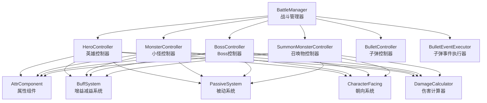
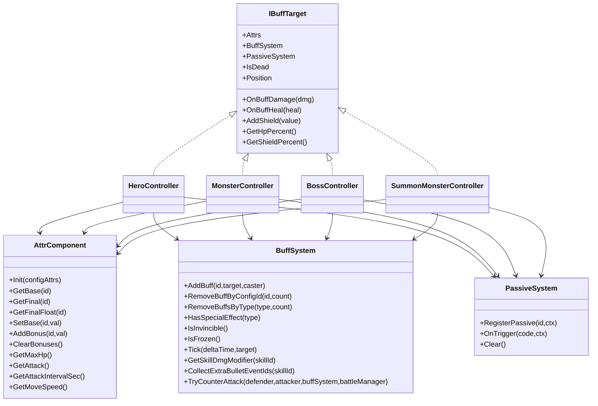
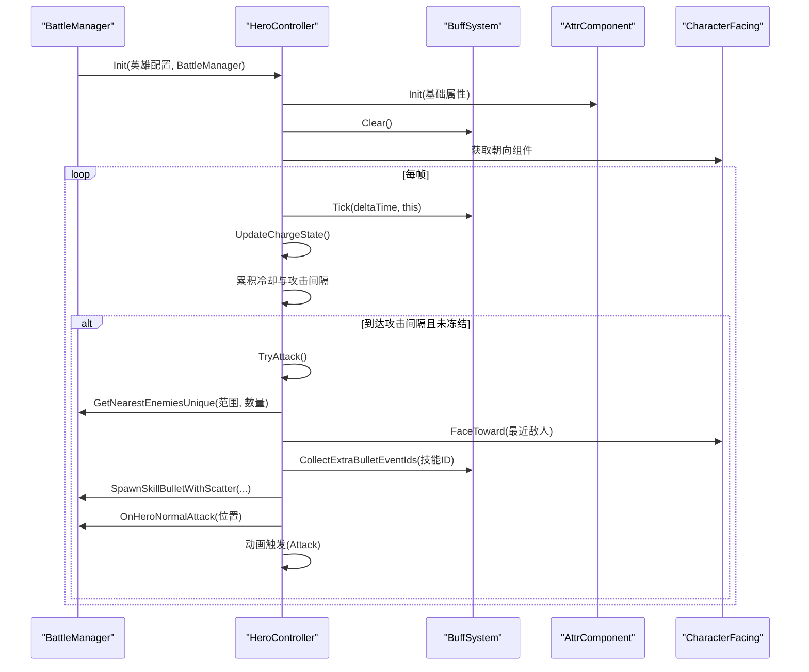
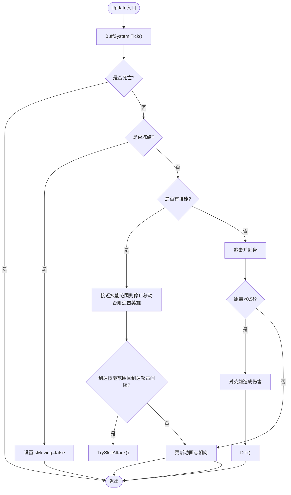
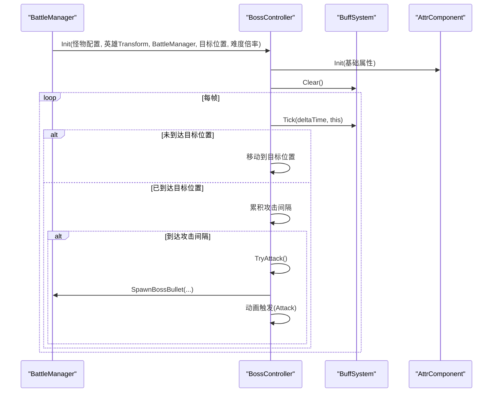
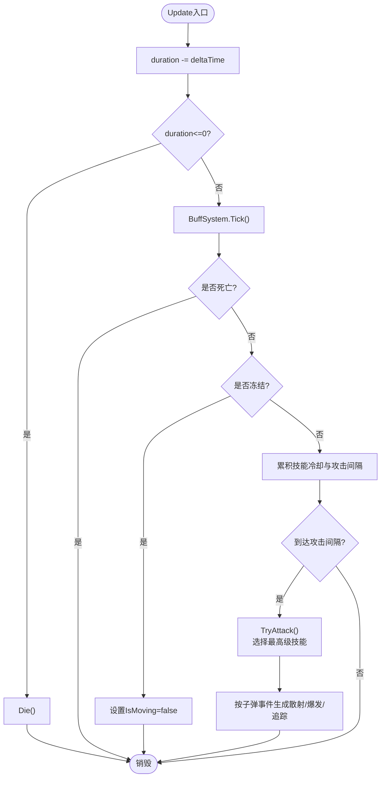
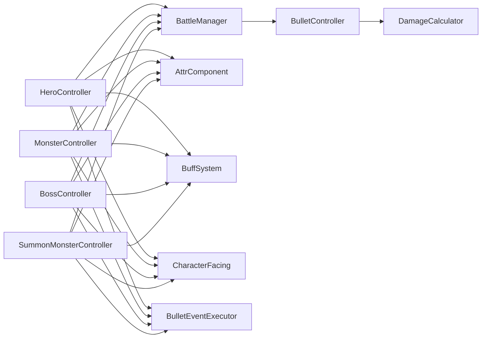

# 角色控制器

<cite>
**本文档引用的文件**
- [HeroController.cs](file://Assets/Scripts/Battle/HeroController.cs)
- [MonsterController.cs](file://Assets/Scripts/Battle/MonsterController.cs)
- [BossController.cs](file://Assets/Scripts/Battle/BossController.cs)
- [SummonMonsterController.cs](file://Assets/Scripts/Battle/SummonMonsterController.cs)
- [AttrComponent.cs](file://Assets/Scripts/Battle/AttrComponent.cs)
- [BuffSystem.cs](file://Assets/Scripts/Battle/BuffSystem.cs)
- [PassiveSystem.cs](file://Assets/Scripts/Battle/PassiveSystem.cs)
- [BattleManager.cs](file://Assets/Scripts/Battle/BattleManager.cs)
- [CharacterFacing.cs](file://Assets/Scripts/Battle/CharacterFacing.cs)
- [DamageCalculator.cs](file://Assets/Scripts/Battle/DamageCalculator.cs)
- [BulletController.cs](file://Assets/Scripts/Battle/BulletController.cs)
- [BulletEventExecutor.cs](file://Assets/Scripts/Battle/BulletEventExecutor.cs)
- [attribute_config.json](file://Assets/Resources/Configs/attribute_config.json)
- [buff_config.json](file://Assets/Resources/Configs/buff_config.json)
- [skill_config.json](file://Assets/Resources/Configs/skill_config.json)
</cite>

## 目录
1. [简介](#简介)
2. [项目结构](#项目结构)
3. [核心组件](#核心组件)
4. [架构总览](#架构总览)
5. [详细组件分析](#详细组件分析)
6. [依赖关系分析](#依赖关系分析)
7. [性能考量](#性能考量)
8. [故障排查指南](#故障排查指南)
9. [结论](#结论)
10. [附录](#附录)

## 简介
本技术文档围绕角色控制器系统展开，系统包含四类角色控制器：HeroController（英雄）、MonsterController（小怪）、BossController（Boss）、SummonMonsterController（召唤物）。它们共享统一的属性系统与增益减益系统，并通过战斗管理器进行生命周期与交互编排。本文将从设计模式、职责分工、初始化流程、行为差异、生命周期管理、关键算法与扩展性等方面进行全面解析。

## 项目结构
角色控制器位于战斗模块下，与属性系统、增益系统、被动系统、战斗管理器、面向系统、伤害计算、子弹系统等紧密协作。

图示来源
- [BattleManager.cs:145-275](file://Assets/Scripts/Battle/BattleManager.cs#L145-L275)
- [HeroController.cs:85-138](file://Assets/Scripts/Battle/HeroController.cs#L85-L138)
- [MonsterController.cs:62-120](file://Assets/Scripts/Battle/MonsterController.cs#L62-L120)
- [BossController.cs:63-118](file://Assets/Scripts/Battle/BossController.cs#L63-L118)
- [SummonMonsterController.cs:58-119](file://Assets/Scripts/Battle/SummonMonsterController.cs#L58-L119)
- [AttrComponent.cs:11-21](file://Assets/Scripts/Battle/AttrComponent.cs#L11-L21)
- [BuffSystem.cs:34-84](file://Assets/Scripts/Battle/BuffSystem.cs#L34-L84)
- [PassiveSystem.cs:18-39](file://Assets/Scripts/Battle/PassiveSystem.cs#L18-L39)
- [CharacterFacing.cs:18-25](file://Assets/Scripts/Battle/CharacterFacing.cs#L18-L25)
- [DamageCalculator.cs:24-103](file://Assets/Scripts/Battle/DamageCalculator.cs#L24-L103)
- [BulletController.cs:256-289](file://Assets/Scripts/Battle/BulletController.cs#L256-L289)
- [BulletEventExecutor.cs:8-95](file://Assets/Scripts/Battle/BulletEventExecutor.cs#L8-L95)

章节来源
- [BattleManager.cs:145-275](file://Assets/Scripts/Battle/BattleManager.cs#L145-L275)

## 核心组件
- 属性系统 AttrComponent：集中管理基础属性、加成属性与派生属性（如最大生命、攻击力、攻击间隔、移速），并提供上下限约束与浮点化转换。
- 增益减益系统 BuffSystem：统一管理增益/减益的叠加、持续时间、跳伤/跳效果、特殊效果（如无敌、冻结）与属性加成重算。
- 被动系统 PassiveSystem：注册被动、按触发时机与条件执行事件，并支持移除策略（按触发次数或特定触发码）。
- 朝向系统 CharacterFacing：根据目标方向调整角色朝向，保证视觉一致性。
- 伤害计算器 DamageCalculator：基于命中/闪避、元素加成/减免、暴击/抗暴击、Boss/精英加成等计算最终伤害。
- 子弹事件执行器 BulletEventExecutor：将子弹事件配置聚合成可执行的数据结构（穿透、爆炸、追踪、散射、弹跳、超量、爆发等）。

章节来源
- [AttrComponent.cs:11-127](file://Assets/Scripts/Battle/AttrComponent.cs#L11-L127)
- [BuffSystem.cs:34-375](file://Assets/Scripts/Battle/BuffSystem.cs#L34-L375)
- [PassiveSystem.cs:18-147](file://Assets/Scripts/Battle/PassiveSystem.cs#L18-L147)
- [CharacterFacing.cs:18-25](file://Assets/Scripts/Battle/CharacterFacing.cs#L18-L25)
- [DamageCalculator.cs:24-103](file://Assets/Scripts/Battle/DamageCalculator.cs#L24-L103)
- [BulletEventExecutor.cs:8-95](file://Assets/Scripts/Battle/BulletEventExecutor.cs#L8-L95)

## 架构总览
角色控制器采用“统一接口 + 多态行为”的设计模式：
- 统一接口 IBuffTarget：定义属性、增益系统、被动系统访问，以及受击/治疗/护盾、死亡判定、位置与血量百分比查询。
- 控制器职责分离：HeroController 负责玩家输入与技能调度；MonsterController/BossController 负责AI寻路与技能；SummonMonsterController 负责临时单位与继承属性。
- 生命周期由 BattleManager 统一编排：生成、查询敌人、发射子弹、AoE伤害、Boss事件链、UI更新与游戏结束判定。

图示来源
- [HeroController.cs:7-47](file://Assets/Scripts/Battle/HeroController.cs#L7-L47)
- [MonsterController.cs:5-38](file://Assets/Scripts/Battle/MonsterController.cs#L5-L38)
- [BossController.cs:5-36](file://Assets/Scripts/Battle/BossController.cs#L5-L36)
- [SummonMonsterController.cs:6-31](file://Assets/Scripts/Battle/SummonMonsterController.cs#L6-L31)
- [AttrComponent.cs:11-127](file://Assets/Scripts/Battle/AttrComponent.cs#L11-L127)
- [BuffSystem.cs:34-375](file://Assets/Scripts/Battle/BuffSystem.cs#L34-L375)
- [PassiveSystem.cs:18-147](file://Assets/Scripts/Battle/PassiveSystem.cs#L18-L147)

## 详细组件分析

### HeroController 英雄控制器
- 设计要点
  - 统一的属性与增益系统集成，支持护盾、无敌、冻结等状态。
  - 蓄力机制：长时间无攻击后进入蓄力状态，施加蓄力增益并触发动画。
  - 技能路由：根据技能分类（召唤、护盾、自身、弹幕、AOE）分派到不同处理逻辑。
  - 子弹事件合并：将技能自带事件与增益附加事件合并，支持散射、爆发、追踪等效果。
  - 受击处理：先尝试反击，再判断无敌，随后计算减伤与护盾优先，最后更新UI。
- 初始化流程
  - 读取英雄配置，初始化 AttrComponent 并设置最大生命与护盾上限。
  - 解析攻击技能列表，构建冷却计时器与技能配置缓存，确定攻击范围。
  - 初始化动画与朝向系统，清空增益与被动，更新血条与护盾条。
- 关键算法
  - 攻击判定：按攻击间隔触发，若未冻结则尝试攻击；攻击时退出蓄力并更新朝向。
  - 伤害计算：基础伤害 = 攻击力 × 技能伤害比例 ÷ 10000；叠加技能伤害修正；合并敌方事件到子弹attachToTarget事件。
  - 散射/爆发：根据子弹事件配置生成多枚子弹或按固定间隔连续发射。
- 生命周期
  - 创建：BattleManager 生成英雄并调用 Init。
  - 更新：每帧驱动增益系统、蓄力状态、冷却计时与攻击间隔。
  - 销毁：生命归零时通知 BattleManager 并销毁对象。

图示来源
- [HeroController.cs:85-138](file://Assets/Scripts/Battle/HeroController.cs#L85-L138)
- [HeroController.cs:147-176](file://Assets/Scripts/Battle/HeroController.cs#L147-L176)
- [HeroController.cs:207-281](file://Assets/Scripts/Battle/HeroController.cs#L207-L281)
- [HeroController.cs:464-487](file://Assets/Scripts/Battle/HeroController.cs#L464-L487)
- [BattleManager.cs:302-353](file://Assets/Scripts/Battle/BattleManager.cs#L302-L353)
- [BattleManager.cs:543-568](file://Assets/Scripts/Battle/BattleManager.cs#L543-L568)

章节来源
- [HeroController.cs:85-138](file://Assets/Scripts/Battle/HeroController.cs#L85-L138)
- [HeroController.cs:147-176](file://Assets/Scripts/Battle/HeroController.cs#L147-L176)
- [HeroController.cs:178-205](file://Assets/Scripts/Battle/HeroController.cs#L178-L205)
- [HeroController.cs:207-281](file://Assets/Scripts/Battle/HeroController.cs#L207-L281)
- [HeroController.cs:284-402](file://Assets/Scripts/Battle/HeroController.cs#L284-L402)
- [HeroController.cs:404-447](file://Assets/Scripts/Battle/HeroController.cs#L404-L447)
- [HeroController.cs:449-460](file://Assets/Scripts/Battle/HeroController.cs#L449-L460)
- [HeroController.cs:464-487](file://Assets/Scripts/Battle/HeroController.cs#L464-L487)
- [HeroController.cs:489-511](file://Assets/Scripts/Battle/HeroController.cs#L489-L511)

### MonsterController 小怪控制器
- 设计要点
  - AI：根据是否有技能决定远程/近战行为；有技能时在范围内触发技能，否则追击并近身造成伤害。
  - 难度系数：按关卡难度倍率放大基础属性（HP与攻击）。
  - 屏幕边界限制：防止小怪移出屏幕。
- 初始化流程
  - 设置英雄目标、精英标记与难度倍率。
  - 初始化 AttrComponent，应用难度乘数，设置最大生命与当前生命。
  - 解析技能列表，确定技能攻击范围与冷却计时器。
- 关键算法
  - 距离判断与移动：计算与英雄的距离，超过技能范围则追击；到达近身距离时触发近战伤害并自爆死亡。
  - 技能攻击：按冷却时间选择最高级技能，计算伤害并发射子弹。
- 生命周期
  - 创建：BattleManager 生成小怪并调用 Init。
  - 更新：每帧驱动增益系统、移动与技能冷却，必要时触发技能或近战。
  - 销毁：生命归零时通知 BattleManager 并销毁对象。

图示来源
- [MonsterController.cs:128-198](file://Assets/Scripts/Battle/MonsterController.cs#L128-L198)
- [MonsterController.cs:200-231](file://Assets/Scripts/Battle/MonsterController.cs#L200-L231)
- [MonsterController.cs:268-279](file://Assets/Scripts/Battle/MonsterController.cs#L268-L279)

章节来源
- [MonsterController.cs:62-120](file://Assets/Scripts/Battle/MonsterController.cs#L62-L120)
- [MonsterController.cs:128-198](file://Assets/Scripts/Battle/MonsterController.cs#L128-L198)
- [MonsterController.cs:200-231](file://Assets/Scripts/Battle/MonsterController.cs#L200-L231)
- [MonsterController.cs:233-251](file://Assets/Scripts/Battle/MonsterController.cs#L233-L251)
- [MonsterController.cs:268-279](file://Assets/Scripts/Battle/MonsterController.cs#L268-L279)

### BossController Boss控制器
- 设计要点
  - 特殊机制：先移动到目标位置后再进入攻击阶段，期间可被击退但会回到目标位置。
  - 技能池：按冷却时间选择最高级技能，计算伤害并发射Boss子弹。
  - UI联动：实时更新Boss血条。
- 初始化流程
  - 设置英雄目标、目标位置与到达标记。
  - 初始化 AttrComponent，应用难度乘数，设置最大生命与当前生命。
  - 解析技能列表，确定攻击范围与冷却计时器。
- 关键算法
  - 位置到达检测：到达后标记并停止移动；未到达则朝目标位置移动。
  - 攻击判定：到达目标位置后按攻击间隔触发技能。
- 生命周期
  - 创建：BattleManager 生成Boss并调用 Init。
  - 更新：每帧驱动增益系统、移动与攻击，必要时触发技能。
  - 销毁：生命归零时通知 BattleManager 并销毁对象。

图示来源
- [BossController.cs:63-118](file://Assets/Scripts/Battle/BossController.cs#L63-L118)
- [BossController.cs:126-183](file://Assets/Scripts/Battle/BossController.cs#L126-L183)
- [BossController.cs:185-214](file://Assets/Scripts/Battle/BossController.cs#L185-L214)
- [BattleManager.cs:578-585](file://Assets/Scripts/Battle/BattleManager.cs#L578-L585)

章节来源
- [BossController.cs:63-118](file://Assets/Scripts/Battle/BossController.cs#L63-L118)
- [BossController.cs:126-183](file://Assets/Scripts/Battle/BossController.cs#L126-L183)
- [BossController.cs:185-214](file://Assets/Scripts/Battle/BossController.cs#L185-L214)
- [BossController.cs:216-239](file://Assets/Scripts/Battle/BossController.cs#L216-L239)
- [BossController.cs:256-267](file://Assets/Scripts/Battle/BossController.cs#L256-L267)

### SummonMonsterController 召唤物控制器
- 设计要点
  - 临时单位：带存活倒计时，到期自动销毁。
  - 属性继承：按配置类型对基础属性进行缩放继承，确保强度平衡。
  - 技能发射：与英雄类似，支持散射、爆发、追踪等子弹事件。
- 初始化流程
  - 设置战斗管理器、存活时长、是否追踪、难度倍率。
  - 初始化 AttrComponent，按属性元数据对基础属性进行缩放。
  - 解析技能列表，确定攻击范围与冷却计时器。
- 关键算法
  - 存活倒计时：每帧递减，到期触发死亡。
  - 技能发射：选择最高级可用技能，计算伤害与特效，必要时开启追踪。
- 生命周期
  - 创建：BattleManager 生成召唤物并调用 Init。
  - 更新：每帧驱动增益系统、冷却与攻击间隔。
  - 销毁：存活结束或生命归零时销毁对象。

图示来源
- [SummonMonsterController.cs:121-157](file://Assets/Scripts/Battle/SummonMonsterController.cs#L121-L157)
- [SummonMonsterController.cs:159-209](file://Assets/Scripts/Battle/SummonMonsterController.cs#L159-L209)
- [SummonMonsterController.cs:241-247](file://Assets/Scripts/Battle/SummonMonsterController.cs#L241-L247)

章节来源
- [SummonMonsterController.cs:58-119](file://Assets/Scripts/Battle/SummonMonsterController.cs#L58-L119)
- [SummonMonsterController.cs:121-157](file://Assets/Scripts/Battle/SummonMonsterController.cs#L121-L157)
- [SummonMonsterController.cs:159-209](file://Assets/Scripts/Battle/SummonMonsterController.cs#L159-L209)
- [SummonMonsterController.cs:241-247](file://Assets/Scripts/Battle/SummonMonsterController.cs#L241-L247)

### 通用基类设计与接口
- IBuffTarget 接口：统一暴露属性、增益系统、被动系统、受击/治疗/护盾、死亡判定、位置与血量百分比查询。
- AttrComponent：集中式属性管理，支持上下限约束与百分比换算，派生属性计算（如最大生命、攻击力、攻击间隔、移速）。
- BuffSystem：统一增益/减益生命周期管理，支持叠加、持续时间、跳伤/跳效果、特殊效果（无敌、冻结）与属性加成重算。
- PassiveSystem：被动注册、触发与移除策略，支持条件检查与触发次数限制。

章节来源
- [HeroController.cs:42-47](file://Assets/Scripts/Battle/HeroController.cs#L42-L47)
- [MonsterController.cs:32-38](file://Assets/Scripts/Battle/MonsterController.cs#L32-L38)
- [BossController.cs:31-36](file://Assets/Scripts/Battle/BossController.cs#L31-L36)
- [SummonMonsterController.cs:26-31](file://Assets/Scripts/Battle/SummonMonsterController.cs#L26-L31)
- [AttrComponent.cs:11-127](file://Assets/Scripts/Battle/AttrComponent.cs#L11-L127)
- [BuffSystem.cs:34-375](file://Assets/Scripts/Battle/BuffSystem.cs#L34-L375)
- [PassiveSystem.cs:18-147](file://Assets/Scripts/Battle/PassiveSystem.cs#L18-L147)

## 依赖关系分析
- 控制器依赖 BattleManager 提供的敌人查询、子弹生成、AoE伤害与Boss事件链。
- 控制器依赖 AttrComponent 计算派生属性与最终数值。
- 控制器依赖 BuffSystem 管理状态与属性加成，并在受击时触发反击。
- 控制器依赖 CharacterFacing 控制角色朝向。
- 子弹控制器依赖 DamageCalculator 进行伤害计算，并根据事件配置附加效果。

图示来源
- [HeroController.cs:85-138](file://Assets/Scripts/Battle/HeroController.cs#L85-L138)
- [MonsterController.cs:62-120](file://Assets/Scripts/Battle/MonsterController.cs#L62-L120)
- [BossController.cs:63-118](file://Assets/Scripts/Battle/BossController.cs#L63-L118)
- [SummonMonsterController.cs:58-119](file://Assets/Scripts/Battle/SummonMonsterController.cs#L58-L119)
- [BattleManager.cs:277-594](file://Assets/Scripts/Battle/BattleManager.cs#L277-L594)
- [BulletController.cs:256-289](file://Assets/Scripts/Battle/BulletController.cs#L256-L289)
- [DamageCalculator.cs:24-103](file://Assets/Scripts/Battle/DamageCalculator.cs#L24-L103)
- [BulletEventExecutor.cs:8-95](file://Assets/Scripts/Battle/BulletEventExecutor.cs#L8-L95)

章节来源
- [BattleManager.cs:277-594](file://Assets/Scripts/Battle/BattleManager.cs#L277-L594)
- [BulletController.cs:256-289](file://Assets/Scripts/Battle/BulletController.cs#L256-L289)
- [DamageCalculator.cs:24-103](file://Assets/Scripts/Battle/DamageCalculator.cs#L24-L103)
- [BulletEventExecutor.cs:8-95](file://Assets/Scripts/Battle/BulletEventExecutor.cs#L8-L95)

## 性能考量
- 属性计算：AttrComponent 使用字典存储基础与加成属性，派生属性计算避免重复遍历，建议在增益系统重算时批量清理与重加。
- 增益系统：BuffSystem 每帧遍历增益列表，注意避免过多增益叠加导致的性能开销；可考虑按类型分组或延迟处理。
- 子弹生成：散射/爆发会生成大量子弹，应限制最大数量与角度范围，避免帧率抖动。
- 寻路与查询：敌人查询与排序在每帧执行，建议缓存最近目标或限制查询半径与数量。

## 故障排查指南
- 受击无反应
  - 检查是否处于无敌状态（BuffSystem.IsInvincible）。
  - 检查护盾是否完全吸收伤害。
- 技能不触发
  - 检查技能冷却计时器是否达到阈值。
  - 检查技能配置ID是否存在且正确。
- 子弹效果异常
  - 检查子弹事件配置（散射、追踪、爆炸、弹跳、超量）是否正确。
  - 检查技能伤害修正与附加事件合并逻辑。
- AI 不移动
  - 检查 BuffSystem 是否处于冻结状态。
  - 检查技能范围与距离判断逻辑。

章节来源
- [BuffSystem.cs:129-138](file://Assets/Scripts/Battle/BuffSystem.cs#L129-L138)
- [HeroController.cs:404-447](file://Assets/Scripts/Battle/HeroController.cs#L404-L447)
- [BulletEventExecutor.cs:8-95](file://Assets/Scripts/Battle/BulletEventExecutor.cs#L8-L95)
- [MonsterController.cs:136-141](file://Assets/Scripts/Battle/MonsterController.cs#L136-L141)

## 结论
角色控制器系统通过统一接口与共享子系统实现了高度内聚、低耦合的设计。HeroController 负责玩家交互与技能调度，MonsterController/BossController 实现了清晰的AI与特殊机制，SummonMonsterController 提供了灵活的临时单位管理。通过 BattleManager 的编排与事件系统，整个战斗流程具备良好的扩展性与可维护性。

## 附录
- 属性配置参考：[attribute_config.json:1-39](file://Assets/Resources/Configs/attribute_config.json#L1-L39)
- 增益配置参考：[buff_config.json:1-23](file://Assets/Resources/Configs/buff_config.json#L1-L23)
- 技能配置参考：[skill_config.json:1-200](file://Assets/Resources/Configs/skill_config.json#L1-L200)