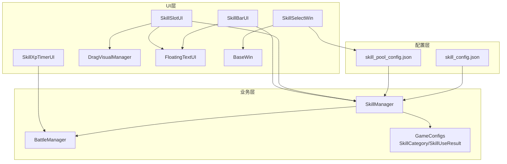
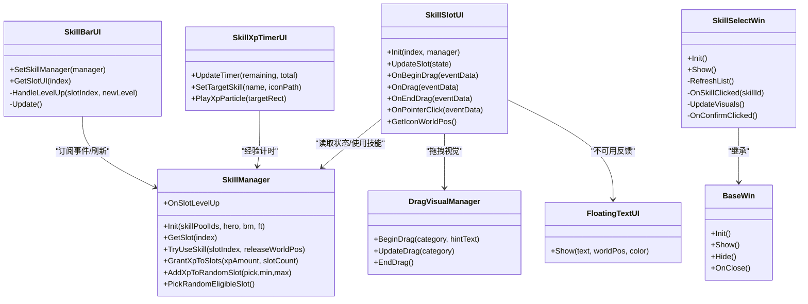
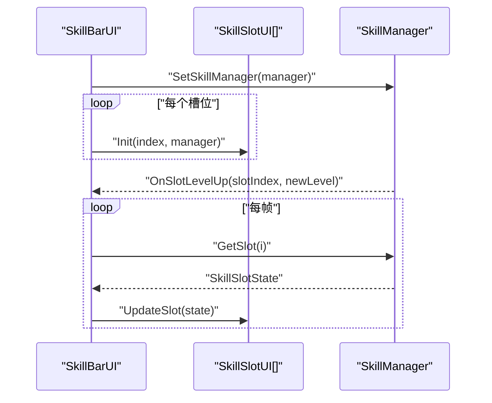
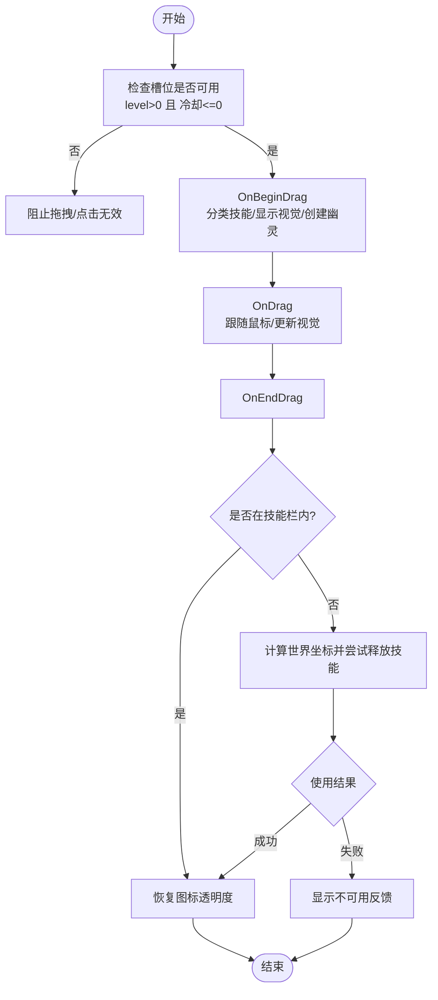
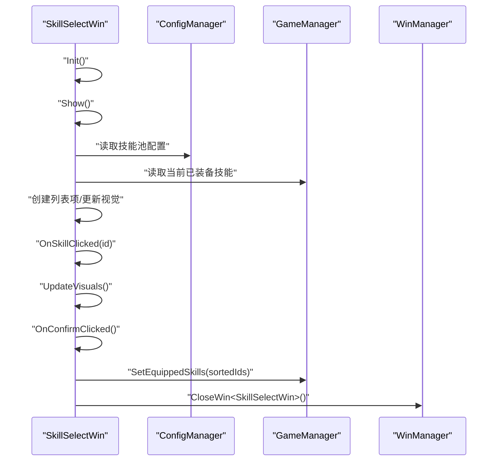
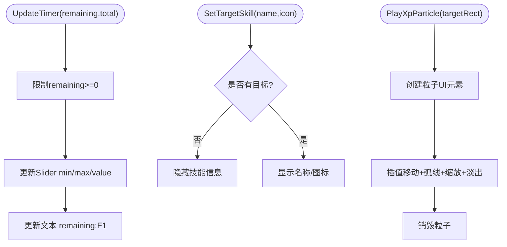
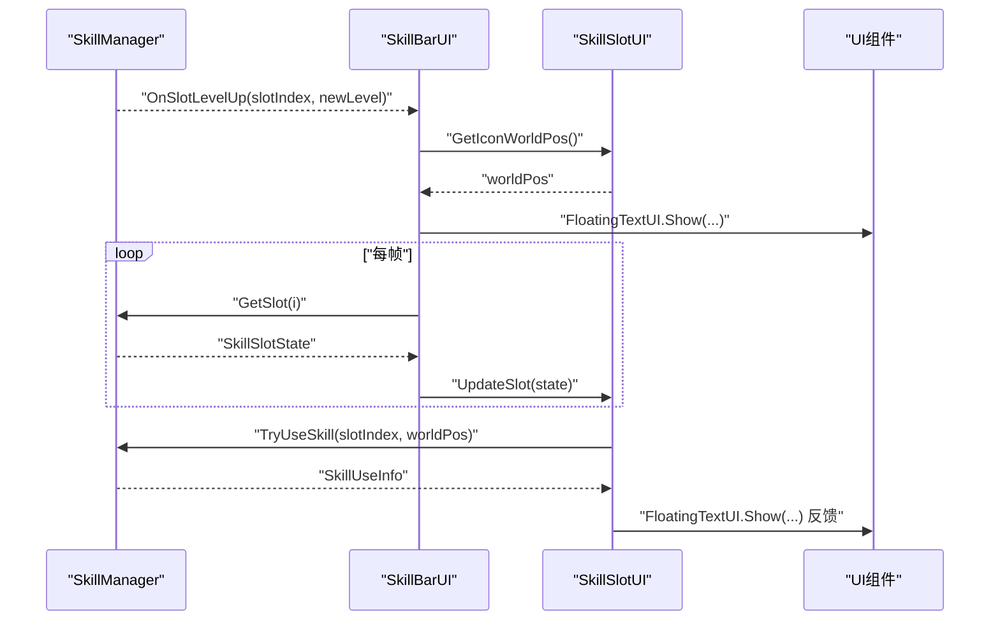
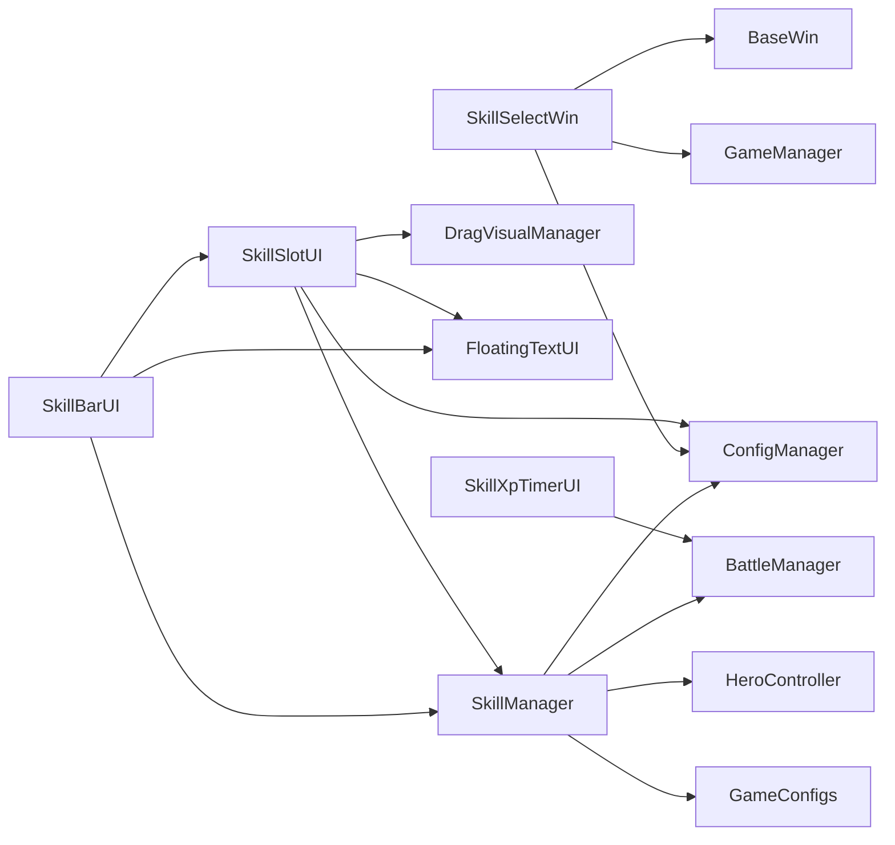

# 技能UI交互

<cite>
**本文档引用的文件**
- [SkillBarUI.cs](file://Assets/Scripts/UI/SkillBarUI.cs)
- [SkillSlotUI.cs](file://Assets/Scripts/UI/SkillSlotUI.cs)
- [SkillSelectWin.cs](file://Assets/Scripts/UI/SkillSelectWin.cs)
- [SkillXpTimerUI.cs](file://Assets/Scripts/UI/SkillXpTimerUI.cs)
- [SkillManager.cs](file://Assets/Scripts/Battle/SkillManager.cs)
- [DragVisualManager.cs](file://Assets/Scripts/UI/DragVisualManager.cs)
- [FloatingTextUI.cs](file://Assets/Scripts/UI/FloatingTextUI.cs)
- [BaseWin.cs](file://Assets/Scripts/UI/BaseWin.cs)
- [GameConfigs.cs](file://Assets/Scripts/Data/GameConfigs.cs)
- [skill_pool_config.json](file://Assets/Resources/Configs/skill_pool_config.json)
- [skill_config.json](file://Assets/Resources/Configs/skill_config.json)
- [BattleManager.cs](file://Assets/Scripts/Battle/BattleManager.cs)
</cite>

## 目录
1. [简介](#简介)
2. [项目结构](#项目结构)
3. [核心组件](#核心组件)
4. [架构总览](#架构总览)
5. [详细组件分析](#详细组件分析)
6. [依赖关系分析](#依赖关系分析)
7. [性能考量](#性能考量)
8. [故障排查指南](#故障排查指南)
9. [结论](#结论)
10. [附录](#附录)

## 简介
本文件面向GeometryTD的技能UI交互系统，围绕以下关键UI组件进行技术文档化：
- 技能栏UI：SkillBarUI，负责技能槽位集合的布局、状态刷新与事件联动
- 单个技能槽位UI：SkillSlotUI，负责图标、等级、经验值、冷却遮罩与文本、拖拽与点击交互
- 技能选择窗口：SkillSelectWin，负责从技能池中选择并替换已装备技能
- 经验值定时器UI：SkillXpTimerUI，负责经验条与冷却条的动态更新及粒子反馈
- 数据绑定与交互：SkillManager作为数据源，SkillSlotUI通过事件与UI联动，SkillBarUI统一驱动刷新

本文件同时提供交互流程图、类图与定制指南，帮助开发者快速理解与扩展UI系统。

## 项目结构
UI层位于Assets/Scripts/UI目录，技能系统核心在Assets/Scripts/Battle目录，配置位于Assets/Resources/Configs。UI组件通过ConfigManager读取技能池与技能配置，通过SkillManager与BattleManager进行数据与行为交互。

图表来源
- [SkillBarUI.cs:1-68](file://Assets/Scripts/UI/SkillBarUI.cs#L1-L68)
- [SkillSlotUI.cs:1-392](file://Assets/Scripts/UI/SkillSlotUI.cs#L1-L392)
- [SkillSelectWin.cs:1-165](file://Assets/Scripts/UI/SkillSelectWin.cs#L1-L165)
- [SkillXpTimerUI.cs:1-148](file://Assets/Scripts/UI/SkillXpTimerUI.cs#L1-L148)
- [SkillManager.cs:1-242](file://Assets/Scripts/Battle/SkillManager.cs#L1-L242)
- [DragVisualManager.cs:1-335](file://Assets/Scripts/UI/DragVisualManager.cs#L1-L335)
- [FloatingTextUI.cs:1-60](file://Assets/Scripts/UI/FloatingTextUI.cs#L1-L60)
- [BaseWin.cs:1-32](file://Assets/Scripts/UI/BaseWin.cs#L1-L32)
- [GameConfigs.cs:450-476](file://Assets/Scripts/Data/GameConfigs.cs#L450-L476)
- [skill_pool_config.json:1-59](file://Assets/Resources/Configs/skill_pool_config.json#L1-L59)
- [skill_config.json:1-800](file://Assets/Resources/Configs/skill_config.json#L1-L800)

章节来源
- [SkillBarUI.cs:1-68](file://Assets/Scripts/UI/SkillBarUI.cs#L1-L68)
- [SkillSlotUI.cs:1-392](file://Assets/Scripts/UI/SkillSlotUI.cs#L1-L392)
- [SkillSelectWin.cs:1-165](file://Assets/Scripts/UI/SkillSelectWin.cs#L1-L165)
- [SkillXpTimerUI.cs:1-148](file://Assets/Scripts/UI/SkillXpTimerUI.cs#L1-L148)
- [SkillManager.cs:1-242](file://Assets/Scripts/Battle/SkillManager.cs#L1-L242)
- [DragVisualManager.cs:1-335](file://Assets/Scripts/UI/DragVisualManager.cs#L1-L335)
- [FloatingTextUI.cs:1-60](file://Assets/Scripts/UI/FloatingTextUI.cs#L1-L60)
- [BaseWin.cs:1-32](file://Assets/Scripts/UI/BaseWin.cs#L1-L32)
- [GameConfigs.cs:450-476](file://Assets/Scripts/Data/GameConfigs.cs#L450-L476)
- [skill_pool_config.json:1-59](file://Assets/Resources/Configs/skill_pool_config.json#L1-L59)
- [skill_config.json:1-800](file://Assets/Resources/Configs/skill_config.json#L1-L800)

## 核心组件
- SkillBarUI：持有多个SkillSlotUI，初始化槽位并周期性调用UpdateSlot刷新；订阅SkillManager的等级提升事件以展示浮动文字提示。
- SkillSlotUI：承载单个技能槽位的完整UI表现，包含图标、等级文本、名称、经验值滑条、冷却遮罩与文本、按钮可交互状态；实现拖拽开始/拖拽/结束与点击事件；根据技能池配置加载名称与图标；根据当前等级与配置生成tooltip；根据使用结果展示不可用反馈。
- SkillSelectWin：从游戏配置中读取技能池列表，允许用户勾选固定数量的技能，确认后写入GameManager的已装备技能数组。
- SkillXpTimerUI：显示经验条剩余时间与总时长，支持设置目标技能图标与名称，并播放从经验条飞向技能图标的粒子动画。
- SkillManager：维护技能槽状态（等级、经验、冷却），提供TryUseSkill执行技能、GrantXpToSlots发放经验、Pick/AddXpToRandomSlot等方法；发布等级提升事件。
- DragVisualManager：在拖拽时提供视觉反馈（半透明遮罩、提示文案、瞄准线、范围光效等）。
- FloatingTextUI：在世界空间显示浮动文字提示。
- GameConfigs：定义SkillCategory与SkillUseResult等枚举与结构体。

章节来源
- [SkillBarUI.cs:1-68](file://Assets/Scripts/UI/SkillBarUI.cs#L1-L68)
- [SkillSlotUI.cs:1-392](file://Assets/Scripts/UI/SkillSlotUI.cs#L1-L392)
- [SkillSelectWin.cs:1-165](file://Assets/Scripts/UI/SkillSelectWin.cs#L1-L165)
- [SkillXpTimerUI.cs:1-148](file://Assets/Scripts/UI/SkillXpTimerUI.cs#L1-L148)
- [SkillManager.cs:1-242](file://Assets/Scripts/Battle/SkillManager.cs#L1-L242)
- [DragVisualManager.cs:1-335](file://Assets/Scripts/UI/DragVisualManager.cs#L1-L335)
- [FloatingTextUI.cs:1-60](file://Assets/Scripts/UI/FloatingTextUI.cs#L1-L60)
- [GameConfigs.cs:450-476](file://Assets/Scripts/Data/GameConfigs.cs#L450-L476)

## 架构总览
UI与业务层通过SkillManager进行解耦，UI仅消费状态与事件，业务层负责状态变更与规则判定。配置层提供技能池与技能配置，供UI与业务层共同使用。

图表来源
- [SkillBarUI.cs:1-68](file://Assets/Scripts/UI/SkillBarUI.cs#L1-L68)
- [SkillSlotUI.cs:1-392](file://Assets/Scripts/UI/SkillSlotUI.cs#L1-L392)
- [SkillSelectWin.cs:1-165](file://Assets/Scripts/UI/SkillSelectWin.cs#L1-L165)
- [SkillXpTimerUI.cs:1-148](file://Assets/Scripts/UI/SkillXpTimerUI.cs#L1-L148)
- [SkillManager.cs:1-242](file://Assets/Scripts/Battle/SkillManager.cs#L1-L242)
- [DragVisualManager.cs:1-335](file://Assets/Scripts/UI/DragVisualManager.cs#L1-L335)
- [FloatingTextUI.cs:1-60](file://Assets/Scripts/UI/FloatingTextUI.cs#L1-L60)
- [BaseWin.cs:1-32](file://Assets/Scripts/UI/BaseWin.cs#L1-L32)

## 详细组件分析

### SkillBarUI：技能栏布局与状态更新
- 初始化：接收SkillManager实例，遍历槽位调用SkillSlotUI.Init完成槽位初始化；订阅SkillManager.OnSlotLevelUp事件用于展示浮动文字提示。
- 刷新：每帧遍历槽位，调用SkillSlotUI.UpdateSlot传入对应SkillSlotState，驱动UI更新。
- 事件：当某槽位等级提升时，根据槽位图标的世界坐标显示“等级提升”浮动文字。

图表来源
- [SkillBarUI.cs:12-65](file://Assets/Scripts/UI/SkillBarUI.cs#L12-L65)
- [SkillSlotUI.cs:85-128](file://Assets/Scripts/UI/SkillSlotUI.cs#L85-L128)
- [SkillManager.cs:21-23](file://Assets/Scripts/Battle/SkillManager.cs#L21-L23)

章节来源
- [SkillBarUI.cs:1-68](file://Assets/Scripts/UI/SkillBarUI.cs#L1-L68)
- [SkillSlotUI.cs:85-128](file://Assets/Scripts/UI/SkillSlotUI.cs#L85-L128)
- [SkillManager.cs:21-23](file://Assets/Scripts/Battle/SkillManager.cs#L21-L23)

### SkillSlotUI：单个槽位的视觉与交互
- 初始化：读取技能池配置，设置名称与图标；缓存根Canvas与技能栏RectTransform；查找FloatingTextUI与DragVisualManager。
- 状态更新：根据SkillSlotState更新等级文本、经验值滑条、冷却遮罩与文本；根据是否可用调整透明度与按钮可交互状态。
- 拖拽交互：在可拖拽条件下分类技能，调用DragVisualManager显示视觉反馈；创建拖拽幽灵图标；在拖拽结束时判断是否在技能栏内，若不在则尝试释放技能并根据结果反馈。
- 点击交互：显示tooltip，内容来自技能池配置的描述列表与当前等级对应的冷却时间。
- 反馈：当使用失败时，调用FloatingTextUI显示不可用原因与剩余冷却。

图表来源
- [SkillSlotUI.cs:131-200](file://Assets/Scripts/UI/SkillSlotUI.cs#L131-L200)
- [SkillSlotUI.cs:231-383](file://Assets/Scripts/UI/SkillSlotUI.cs#L231-L383)
- [SkillManager.cs:87-137](file://Assets/Scripts/Battle/SkillManager.cs#L87-L137)

章节来源
- [SkillSlotUI.cs:1-392](file://Assets/Scripts/UI/SkillSlotUI.cs#L1-L392)
- [SkillManager.cs:87-137](file://Assets/Scripts/Battle/SkillManager.cs#L87-L137)
- [DragVisualManager.cs:29-86](file://Assets/Scripts/UI/DragVisualManager.cs#L29-L86)

### SkillSelectWin：技能选择窗口
- 初始化：绑定关闭与确认按钮事件。
- 显示：刷新列表，读取当前已装备技能与全部技能池配置，逐项创建列表项。
- 交互：点击技能项切换选中状态；当选中数量达到要求时启用确认按钮。
- 确认：排序选中ID并写入GameManager的已装备技能数组，随后关闭窗口。

图表来源
- [SkillSelectWin.cs:19-162](file://Assets/Scripts/UI/SkillSelectWin.cs#L19-L162)
- [BaseWin.cs:1-32](file://Assets/Scripts/UI/BaseWin.cs#L1-L32)

章节来源
- [SkillSelectWin.cs:1-165](file://Assets/Scripts/UI/SkillSelectWin.cs#L1-L165)
- [BaseWin.cs:1-32](file://Assets/Scripts/UI/BaseWin.cs#L1-L32)

### SkillXpTimerUI：经验条与冷却可视化
- 更新：根据剩余时间与总时长更新Slider与文本，确保剩余时间不小于0。
- 目标技能：设置技能名称与图标，未设置时隐藏技能信息区域。
- 粒子反馈：从经验条位置飞向技能图标位置，使用平滑插值与弧线动画，最后渐隐销毁。

图表来源
- [SkillXpTimerUI.cs:36-88](file://Assets/Scripts/UI/SkillXpTimerUI.cs#L36-L88)
- [SkillXpTimerUI.cs:90-145](file://Assets/Scripts/UI/SkillXpTimerUI.cs#L90-L145)

章节来源
- [SkillXpTimerUI.cs:1-148](file://Assets/Scripts/UI/SkillXpTimerUI.cs#L1-L148)
- [BattleManager.cs:70-94](file://Assets/Scripts/Battle/BattleManager.cs#L70-L94)

### UI与技能管理器的数据绑定机制
- 事件订阅：SkillBarUI订阅SkillManager.OnSlotLevelUp，在槽位升级时触发浮动文字提示。
- 状态同步：SkillBarUI每帧调用SkillSlotUI.UpdateSlot传入SkillSlotState，实现UI与数据的双向同步。
- 用户输入：SkillSlotUI在拖拽结束时调用SkillManager.TryUseSkill，返回使用结果并根据结果展示反馈。
- 配置驱动：SkillSlotUI通过ConfigManager读取技能池与技能配置，决定名称、图标、描述与冷却时间。

图表来源
- [SkillBarUI.cs:40-65](file://Assets/Scripts/UI/SkillBarUI.cs#L40-L65)
- [SkillSlotUI.cs:85-128](file://Assets/Scripts/UI/SkillSlotUI.cs#L85-L128)
- [SkillSlotUI.cs:359-383](file://Assets/Scripts/UI/SkillSlotUI.cs#L359-L383)
- [SkillManager.cs:21-23](file://Assets/Scripts/Battle/SkillManager.cs#L21-L23)
- [SkillManager.cs:87-137](file://Assets/Scripts/Battle/SkillManager.cs#L87-L137)

章节来源
- [SkillBarUI.cs:1-68](file://Assets/Scripts/UI/SkillBarUI.cs#L1-L68)
- [SkillSlotUI.cs:1-392](file://Assets/Scripts/UI/SkillSlotUI.cs#L1-L392)
- [SkillManager.cs:1-242](file://Assets/Scripts/Battle/SkillManager.cs#L1-L242)

### 技能槽位交互逻辑
- 点击选择：SkillSlotUI.OnPointerClick在非拖拽状态下显示tooltip，内容来源于技能池配置与当前等级的技能配置。
- 拖拽操作：在满足条件时进入拖拽模式，显示视觉反馈与幽灵图标；拖拽结束时判断位置，若不在技能栏内则尝试释放技能。
- 快捷键支持：当前代码未直接体现键盘快捷键绑定，可通过在SkillSlotUI中添加Input检测并在合适时机调用TryUseSkill实现。

章节来源
- [SkillSlotUI.cs:231-383](file://Assets/Scripts/UI/SkillSlotUI.cs#L231-L383)
- [SkillManager.cs:87-137](file://Assets/Scripts/Battle/SkillManager.cs#L87-L137)

### UI系统定制指南
- 修改技能栏外观：通过SkillBarUI的slots数组在Inspector中布置槽位预制件，调整其布局与间距；在SkillSlotUI中修改图标、文本、Slider与遮罩的样式。
- 调整槽位布局：在SkillSlotUI中修改RectTransform尺寸、锚点与偏移，或在父容器中使用LayoutGroup组件实现自适应排列。
- 自定义交互效果：在SkillSlotUI中扩展拖拽逻辑，或在DragVisualManager中新增视觉类别；在SkillXpTimerUI中调整粒子参数与动画曲线。
- 配置驱动：通过skill_pool_config.json与skill_config.json调整技能名称、描述、图标与冷却时间，从而影响UI显示与tooltip内容。

章节来源
- [SkillSlotUI.cs:1-392](file://Assets/Scripts/UI/SkillSlotUI.cs#L1-L392)
- [SkillXpTimerUI.cs:1-148](file://Assets/Scripts/UI/SkillXpTimerUI.cs#L1-L148)
- [skill_pool_config.json:1-59](file://Assets/Resources/Configs/skill_pool_config.json#L1-L59)
- [skill_config.json:1-800](file://Assets/Resources/Configs/skill_config.json#L1-L800)

## 依赖关系分析
- SkillSlotUI依赖：ConfigManager（读取配置）、SkillManager（读取状态/使用技能）、DragVisualManager（拖拽视觉）、FloatingTextUI（反馈）、GameHelper（字体/精灵加载）。
- SkillBarUI依赖：SkillManager（状态与事件）、SkillSlotUI[]（槽位集合）、FloatingTextUI（等级提升提示）。
- SkillSelectWin依赖：ConfigManager（技能池配置）、GameManager（已装备技能）、BaseWin（窗口基类）。
- SkillXpTimerUI依赖：BattleManager（计时）、GameHelper（字体/精灵）、Canvas（屏幕空间）。
- SkillManager依赖：GameConfigs（枚举与结构体）、ConfigManager（技能配置）、HeroController（执行技能）、BattleManager（计时）。

图表来源
- [SkillSlotUI.cs:35-78](file://Assets/Scripts/UI/SkillSlotUI.cs#L35-L78)
- [SkillBarUI.cs:10-26](file://Assets/Scripts/UI/SkillBarUI.cs#L10-L26)
- [SkillSelectWin.cs:1-165](file://Assets/Scripts/UI/SkillSelectWin.cs#L1-L165)
- [SkillXpTimerUI.cs:1-34](file://Assets/Scripts/UI/SkillXpTimerUI.cs#L1-L34)
- [SkillManager.cs:1-242](file://Assets/Scripts/Battle/SkillManager.cs#L1-L242)
- [GameConfigs.cs:450-476](file://Assets/Scripts/Data/GameConfigs.cs#L450-L476)

章节来源
- [SkillSlotUI.cs:1-392](file://Assets/Scripts/UI/SkillSlotUI.cs#L1-L392)
- [SkillBarUI.cs:1-68](file://Assets/Scripts/UI/SkillBarUI.cs#L1-L68)
- [SkillSelectWin.cs:1-165](file://Assets/Scripts/UI/SkillSelectWin.cs#L1-L165)
- [SkillXpTimerUI.cs:1-148](file://Assets/Scripts/UI/SkillXpTimerUI.cs#L1-L148)
- [SkillManager.cs:1-242](file://Assets/Scripts/Battle/SkillManager.cs#L1-L242)
- [GameConfigs.cs:450-476](file://Assets/Scripts/Data/GameConfigs.cs#L450-L476)

## 性能考量
- UI刷新频率：SkillBarUI每帧遍历槽位调用UpdateSlot，建议在槽位数量较多时考虑按需刷新或使用对象池优化。
- 拖拽视觉：DragVisualManager在拖拽期间降低Time.timeScale并创建多个UI元素，注意在EndDrag时及时销毁，避免内存泄漏。
- 文本与字体：FloatingTextUI与SkillSlotUI的tooltip均使用动态创建的Text组件，建议复用字体资源并控制文本数量。
- 协程与动画：SkillXpTimerUI的粒子动画使用unscaledDeltaTime，避免暂停时卡死；动画时长与缩放应与分辨率匹配，避免过度消耗GPU。

## 故障排查指南
- 槽位无图标或名称：检查SkillSlotUI.Init中ConfigManager读取的技能池配置是否正确，以及GameHelper加载的精灵路径是否存在。
- 拖拽无效：确认SkillSlotUI的按钮可交互状态与isDragging标志，检查SkillManager.GetSlot返回的状态是否满足拖拽条件。
- 冷却遮罩不显示：检查cooldownOverlay的激活与fillAmount赋值逻辑，确认state中的冷却时间与最大冷却时间有效。
- tooltip不出现：检查SkillSlotUI.ShowTooltip中Canvas定位与字体加载，确认技能池配置的desList存在。
- 经验条不更新：检查BattleManager的计时逻辑与SkillXpTimerUI.UpdateTimer调用，确认remaining与total参数有效。
- 等级提升提示不显示：确认SkillBarUI订阅了SkillManager.OnSlotLevelUp事件，且FloatingTextUI可用。

章节来源
- [SkillSlotUI.cs:35-78](file://Assets/Scripts/UI/SkillSlotUI.cs#L35-L78)
- [SkillSlotUI.cs:85-128](file://Assets/Scripts/UI/SkillSlotUI.cs#L85-L128)
- [SkillSlotUI.cs:237-319](file://Assets/Scripts/UI/SkillSlotUI.cs#L237-L319)
- [SkillBarUI.cs:40-54](file://Assets/Scripts/UI/SkillBarUI.cs#L40-L54)
- [SkillXpTimerUI.cs:36-53](file://Assets/Scripts/UI/SkillXpTimerUI.cs#L36-L53)
- [BattleManager.cs:70-94](file://Assets/Scripts/Battle/BattleManager.cs#L70-L94)

## 结论
技能UI交互系统通过SkillBarUI与SkillSlotUI实现对SkillManager状态的高效可视化，结合SkillSelectWin与SkillXpTimerUI提供了完整的技能选择与经验反馈体验。DragVisualManager与FloatingTextUI进一步增强了交互的直观性与反馈质量。通过配置驱动与事件订阅，系统具备良好的扩展性与可定制性。

## 附录
- 使用示例
  - 在场景中挂载SkillBarUI并连接slots数组与FloatingTextUI，随后调用SetSkillManager注入SkillManager实例。
  - 在SkillSlotUI上连接图标、等级文本、经验值Slider、冷却遮罩与按钮，确保各组件在Inspector中正确引用。
  - 打开SkillSelectWin前确保ConfigManager与GameManager已初始化，以便正确读取技能池与已装备技能。
  - 在BattleManager中调用SkillXpTimerUI.UpdateTimer以驱动经验条更新。
- 样式定制方案
  - 图标与字体：通过GameHelper统一加载，可在配置中指定图标路径与字体资源。
  - 拖拽视觉：在DragVisualManager中扩展新的技能类别与视觉效果。
  - 动画与粒子：在SkillXpTimerUI中调整粒子飞行时长、颜色与大小，以适配不同分辨率与性能需求。