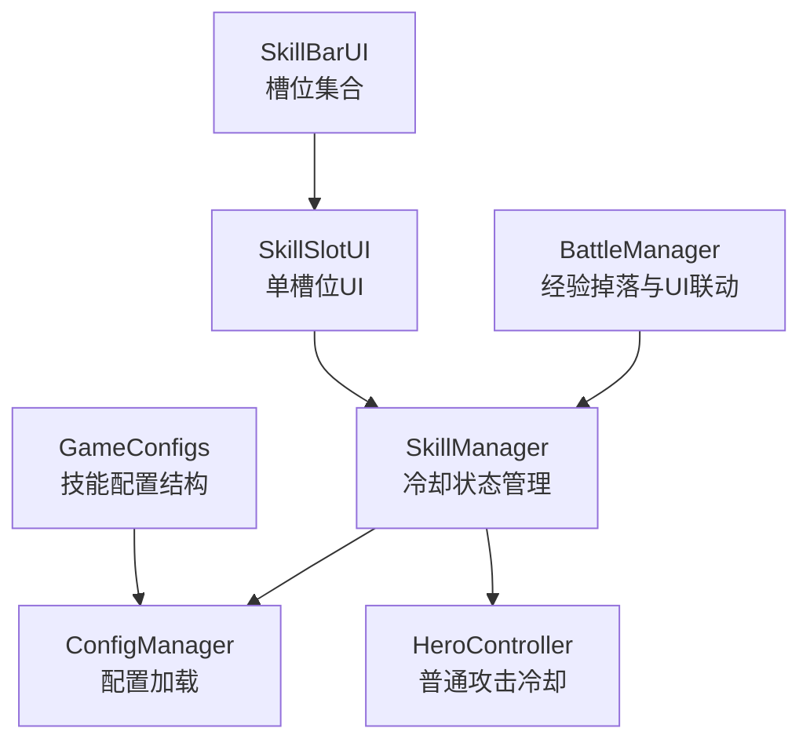
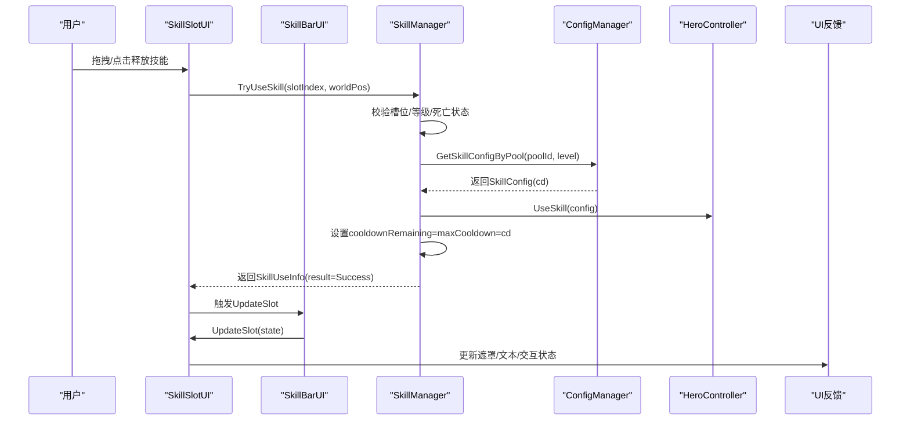
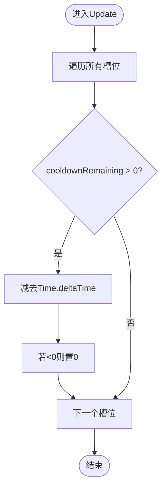
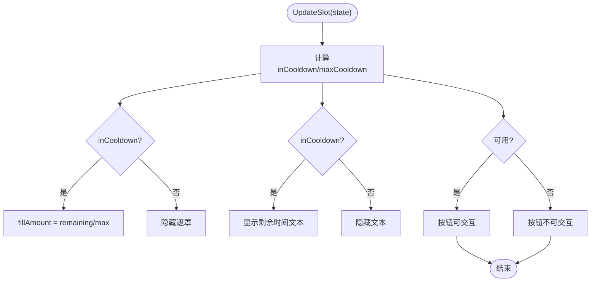
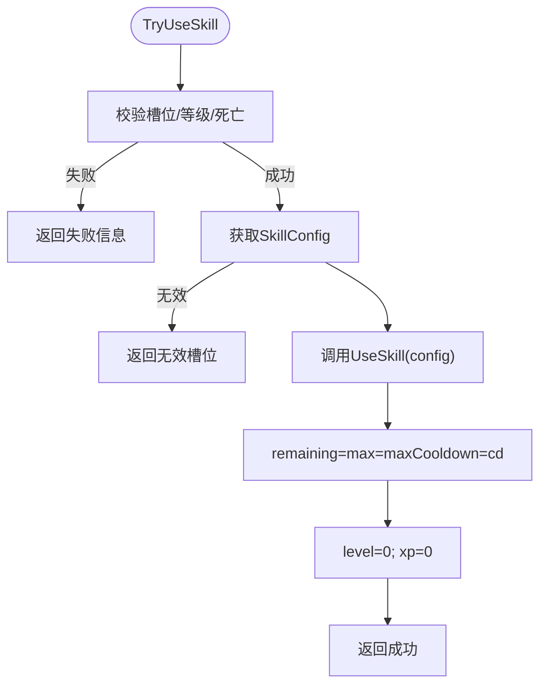
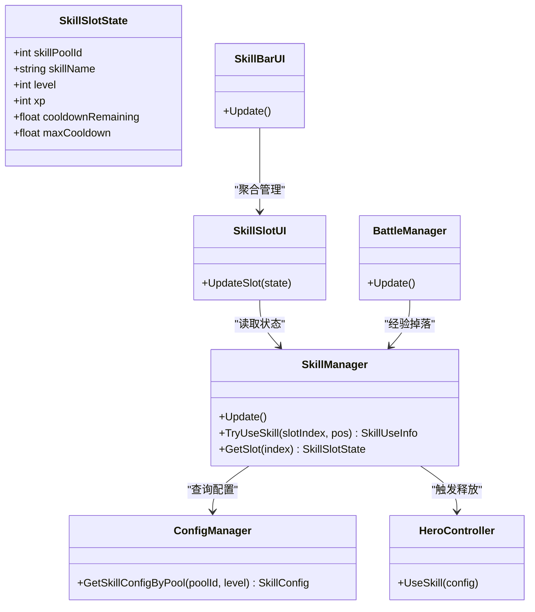

# 技能冷却系统

<cite>
**本文档引用的文件**
- [SkillManager.cs](file://Assets/Scripts/Battle/SkillManager.cs)
- [SkillSlotUI.cs](file://Assets/Scripts/UI/SkillSlotUI.cs)
- [SkillBarUI.cs](file://Assets/Scripts/UI/SkillBarUI.cs)
- [GameConfigs.cs](file://Assets/Scripts/Data/GameConfigs.cs)
- [ConfigManager.cs](file://Assets/Scripts/Core/ConfigManager.cs)
- [HeroController.cs](file://Assets/Scripts/Battle/HeroController.cs)
- [BattleManager.cs](file://Assets/Scripts/Battle/BattleManager.cs)
</cite>

## 目录
1. [简介](#简介)
2. [项目结构](#项目结构)
3. [核心组件](#核心组件)
4. [架构概览](#架构概览)
5. [详细组件分析](#详细组件分析)
6. [依赖关系分析](#依赖关系分析)
7. [性能考量](#性能考量)
8. [故障排除指南](#故障排除指南)
9. [结论](#结论)
10. [附录](#附录)

## 简介
本文件面向GeometryTD的技能冷却系统，提供从底层实现到UI可视化的完整技术文档。内容涵盖：
- Update循环中的冷却时间递减逻辑与Time.deltaTime的处理
- 冷却完成的状态更新与UI反馈
- 冷却时间的计算与显示流程（从SkillSlotState到UI）
- 技能释放后的冷却重置机制（TryUseSkill）
- 性能优化策略（批量更新、内存与渲染效率）
- 游戏平衡影响（使用频率限制、战术设计、玩家体验）
- 扩展可能性（技能组冷却、全局冷却、特殊冷却效果）
- 调试与监控工具建议

## 项目结构
技能冷却系统主要由以下模块组成：
- 战斗层：SkillManager（冷却状态管理）、HeroController（普通攻击冷却）、BattleManager（经验掉落与冷却UI联动）
- 数据层：ConfigManager（配置加载）、GameConfigs（技能配置结构）
- UI层：SkillBarUI（槽位集合）、SkillSlotUI（单槽位UI）



**图表来源**
- [SkillManager.cs:15-242](file://Assets/Scripts/Battle/SkillManager.cs#L15-L242)
- [SkillSlotUI.cs:1-392](file://Assets/Scripts/UI/SkillSlotUI.cs#L1-L392)
- [SkillBarUI.cs:1-68](file://Assets/Scripts/UI/SkillBarUI.cs#L1-L68)
- [ConfigManager.cs:1-619](file://Assets/Scripts/Core/ConfigManager.cs#L1-L619)
- [GameConfigs.cs:360-476](file://Assets/Scripts/Data/GameConfigs.cs#L360-L476)
- [HeroController.cs:1-200](file://Assets/Scripts/Battle/HeroController.cs#L1-L200)
- [BattleManager.cs:1-200](file://Assets/Scripts/Battle/BattleManager.cs#L1-L200)

**章节来源**
- [SkillManager.cs:15-242](file://Assets/Scripts/Battle/SkillManager.cs#L15-L242)
- [SkillSlotUI.cs:1-392](file://Assets/Scripts/UI/SkillSlotUI.cs#L1-L392)
- [SkillBarUI.cs:1-68](file://Assets/Scripts/UI/SkillBarUI.cs#L1-L68)
- [ConfigManager.cs:1-619](file://Assets/Scripts/Core/ConfigManager.cs#L1-L619)
- [GameConfigs.cs:360-476](file://Assets/Scripts/Data/GameConfigs.cs#L360-L476)
- [HeroController.cs:1-200](file://Assets/Scripts/Battle/HeroController.cs#L1-L200)
- [BattleManager.cs:1-200](file://Assets/Scripts/Battle/BattleManager.cs#L1-L200)

## 核心组件
- SkillSlotState：存储每个技能槽的冷却状态（当前剩余冷却、最大冷却、等级、经验等）
- SkillManager：负责冷却状态的批量更新、技能释放判定与冷却重置
- SkillSlotUI：将冷却状态映射到UI（遮罩填充、文本显示、交互禁用）
- SkillBarUI：遍历所有槽位并调用UI更新
- ConfigManager：提供技能配置查询（按池ID+等级组合键）
- GameConfigs：定义SkillConfig结构（包含cd冷却字段）
- HeroController：维护普通攻击的独立冷却计时
- BattleManager：经验掉落定时器与UI联动

**章节来源**
- [SkillManager.cs:5-13](file://Assets/Scripts/Battle/SkillManager.cs#L5-L13)
- [SkillManager.cs:72-85](file://Assets/Scripts/Battle/SkillManager.cs#L72-L85)
- [SkillSlotUI.cs:85-128](file://Assets/Scripts/UI/SkillSlotUI.cs#L85-L128)
- [SkillBarUI.cs:56-65](file://Assets/Scripts/UI/SkillBarUI.cs#L56-L65)
- [ConfigManager.cs:224-227](file://Assets/Scripts/Core/ConfigManager.cs#L224-L227)
- [GameConfigs.cs:378-395](file://Assets/Scripts/Data/GameConfigs.cs#L378-L395)
- [HeroController.cs:147-176](file://Assets/Scripts/Battle/HeroController.cs#L147-L176)
- [BattleManager.cs:70-110](file://Assets/Scripts/Battle/BattleManager.cs#L70-L110)

## 架构概览
冷却系统遵循“状态驱动”的设计：SkillManager在每帧更新所有槽位的冷却剩余时间；当槽位处于冷却时，UI层通过遮罩填充与文本显示直观呈现；当满足释放条件时，SkillManager重置冷却并返回成功结果。



**图表来源**
- [SkillSlotUI.cs:192-200](file://Assets/Scripts/UI/SkillSlotUI.cs#L192-L200)
- [SkillManager.cs:87-137](file://Assets/Scripts/Battle/SkillManager.cs#L87-L137)
- [ConfigManager.cs:224-227](file://Assets/Scripts/Core/ConfigManager.cs#L224-L227)
- [HeroController.cs:128-128](file://Assets/Scripts/Battle/HeroController.cs#L128-L128)
- [SkillBarUI.cs:56-65](file://Assets/Scripts/UI/SkillBarUI.cs#L56-L65)
- [SkillSlotUI.cs:85-128](file://Assets/Scripts/UI/SkillSlotUI.cs#L85-L128)

## 详细组件分析

### 冷却时间递减与Time.deltaTime处理
- 每帧遍历所有槽位，若冷却剩余>0，则扣减Time.deltaTime，并确保不小于0
- 该方式保证了跨帧稳定的时间推进，避免因帧率波动导致的异常加速/减速



**图表来源**
- [SkillManager.cs:72-85](file://Assets/Scripts/Battle/SkillManager.cs#L72-L85)

**章节来源**
- [SkillManager.cs:72-85](file://Assets/Scripts/Battle/SkillManager.cs#L72-L85)

### 冷却完成的状态更新与UI联动
- 当槽位冷却完成（cooldownRemaining==0），UI层通过遮罩填充与文本隐藏实现“可释放”状态
- UI层同时根据等级与冷却状态调整透明度与按钮可交互性



**图表来源**
- [SkillSlotUI.cs:85-128](file://Assets/Scripts/UI/SkillSlotUI.cs#L85-L128)

**章节来源**
- [SkillSlotUI.cs:85-128](file://Assets/Scripts/UI/SkillSlotUI.cs#L85-L128)

### 冷却时间的计算与显示流程
- 计算：SkillManager在TryUseSkill中从ConfigManager查询当前等级对应的SkillConfig，取其cd作为maxCooldown与remaining初始值
- 显示：SkillSlotUI根据state.maxCooldown与state.cooldownRemaining计算遮罩填充比例与文本显示

```mermaid
sequenceDiagram
participant SM as "SkillManager"
participant CM as "ConfigManager"
participant UI as "SkillSlotUI"
SM->>CM : GetSkillConfigByPool(poolId, level)
CM-->>SM : SkillConfig(cd)
SM->>SM : maxCooldown=cd; remaining=cd
SM-->>UI : UpdateSlot(state)
UI->>UI : fillAmount=remaining/max; text=remaining
```

**图表来源**
- [SkillManager.cs:121-133](file://Assets/Scripts/Battle/SkillManager.cs#L121-L133)
- [ConfigManager.cs:224-227](file://Assets/Scripts/Core/ConfigManager.cs#L224-L227)
- [SkillSlotUI.cs:98-115](file://Assets/Scripts/UI/SkillSlotUI.cs#L98-L115)

**章节来源**
- [SkillManager.cs:121-133](file://Assets/Scripts/Battle/SkillManager.cs#L121-L133)
- [ConfigManager.cs:224-227](file://Assets/Scripts/Core/ConfigManager.cs#L224-L227)
- [SkillSlotUI.cs:98-115](file://Assets/Scripts/UI/SkillSlotUI.cs#L98-L115)

### 技能释放后的冷却重置机制
- TryUseSkill执行路径：
  - 校验槽位有效性、英雄存活、等级与冷却状态
  - 通过ConfigManager获取SkillConfig（要求cd>0）
  - 调用HeroController.UseSkill(config)执行技能逻辑
  - 将槽位cooldownRemaining与maxCooldown设为config.cd，并重置level与xp
  - 返回成功结果



**图表来源**
- [SkillManager.cs:87-137](file://Assets/Scripts/Battle/SkillManager.cs#L87-L137)

**章节来源**
- [SkillManager.cs:87-137](file://Assets/Scripts/Battle/SkillManager.cs#L87-L137)

### UI层的可视化展示
- 文本：显示剩余冷却时间（仅在冷却中显示）
- 遮罩：根据remaining/max计算填充比例
- 交互：冷却中与未解锁时禁用按钮
- 视觉反馈：未解锁时降低透明度与饱和度

**章节来源**
- [SkillSlotUI.cs:85-128](file://Assets/Scripts/UI/SkillSlotUI.cs#L85-L128)

### 与普通攻击冷却的关系
- HeroController维护attackSkillTimers数组，逐个技能独立计时
- 与SkillManager的技能槽冷却相互独立，分别服务于不同类型的技能释放

**章节来源**
- [HeroController.cs:147-176](file://Assets/Scripts/Battle/HeroController.cs#L147-L176)

### 经验掉落与冷却UI联动
- BattleManager以固定间隔递减skillXpTimer，到期后向指定槽位发放经验并播放粒子特效
- 同步更新SkillXpTimerUI与目标槽位的UI状态

**章节来源**
- [BattleManager.cs:70-110](file://Assets/Scripts/Battle/BattleManager.cs#L70-L110)
- [SkillBarUI.cs:40-54](file://Assets/Scripts/UI/SkillBarUI.cs#L40-L54)

## 依赖关系分析
- SkillManager依赖ConfigManager获取技能配置（cd字段）
- SkillSlotUI依赖SkillManager提供的SkillSlotState进行UI渲染
- SkillBarUI聚合多个SkillSlotUI并统一调度更新
- HeroController与SkillManager共同参与技能释放流程
- BattleManager协调经验掉落与UI反馈



**图表来源**
- [SkillManager.cs:15-242](file://Assets/Scripts/Battle/SkillManager.cs#L15-L242)
- [SkillSlotUI.cs:1-392](file://Assets/Scripts/UI/SkillSlotUI.cs#L1-L392)
- [SkillBarUI.cs:1-68](file://Assets/Scripts/UI/SkillBarUI.cs#L1-L68)
- [ConfigManager.cs:224-227](file://Assets/Scripts/Core/ConfigManager.cs#L224-L227)
- [HeroController.cs:128-128](file://Assets/Scripts/Battle/HeroController.cs#L128-L128)
- [BattleManager.cs:70-110](file://Assets/Scripts/Battle/BattleManager.cs#L70-L110)

**章节来源**
- [SkillManager.cs:15-242](file://Assets/Scripts/Battle/SkillManager.cs#L15-L242)
- [SkillSlotUI.cs:1-392](file://Assets/Scripts/UI/SkillSlotUI.cs#L1-L392)
- [SkillBarUI.cs:1-68](file://Assets/Scripts/UI/SkillBarUI.cs#L1-L68)
- [ConfigManager.cs:224-227](file://Assets/Scripts/Core/ConfigManager.cs#L224-L227)
- [HeroController.cs:128-128](file://Assets/Scripts/Battle/HeroController.cs#L128-L128)
- [BattleManager.cs:70-110](file://Assets/Scripts/Battle/BattleManager.cs#L70-L110)

## 性能考量
- 批量更新策略
  - SkillManager在单帧内顺序遍历所有槽位，时间复杂度O(N)，N为槽位数量
  - 建议：若槽位数量较多，可考虑按需更新（仅在有冷却或UI可见时更新）
- 时间处理
  - 使用Time.deltaTime确保帧率无关的时间推进，避免抖动
  - 建议：在极低帧率场景下，可在边界处做clamp以防止瞬移
- 内存与GC
  - SkillSlotState为结构化数据，数组分配在初始化时完成
  - 建议：避免在Update中频繁创建临时对象；UI层已尽量复用组件
- 渲染效率
  - 遮罩填充与文本显示为轻量UI操作
  - 建议：在大量槽位场景下，延迟或节流UI刷新频率

[本节为通用性能指导，无需特定文件引用]

## 故障排除指南
- 常见问题
  - 技能无法释放：检查槽位等级是否大于0、冷却是否归零、英雄是否存活
  - 冷却显示异常：确认maxCooldown是否正确设置、UI遮罩fillAmount计算逻辑
  - 释放后冷却未重置：核对TryUseSkill中是否正确设置remaining与max
- 调试建议
  - 在SkillManager.Update中打印槽位状态，验证递减逻辑
  - 在SkillSlotUI.UpdateSlot中输出remaining与max，确认UI映射
  - 使用BattleManager的经验掉落定时器，观察UI粒子与提示联动

**章节来源**
- [SkillManager.cs:72-85](file://Assets/Scripts/Battle/SkillManager.cs#L72-L85)
- [SkillSlotUI.cs:85-128](file://Assets/Scripts/UI/SkillSlotUI.cs#L85-L128)
- [BattleManager.cs:70-110](file://Assets/Scripts/Battle/BattleManager.cs#L70-L110)

## 结论
GeometryTD的技能冷却系统采用“状态驱动+UI映射”的简洁架构：SkillManager集中管理冷却状态，ConfigManager提供配置支撑，SkillSlotUI负责可视化反馈。该设计具备良好的可扩展性与可维护性，能够支持后续的技能组冷却、全局冷却与特殊冷却效果扩展。

## 附录

### 扩展可能性
- 技能组冷却：为一组相关技能共享同一冷却上限，释放任一技能时统一重置
- 全局冷却：引入全局冷却时间，限制单位时间内释放的技能总数
- 特殊冷却效果：如“命中后减少X秒冷却”、“击杀后重置Y技能冷却”等，可通过事件系统与Buff系统集成

[本节为概念性扩展说明，无需特定文件引用]

### 游戏平衡与玩家体验
- 使用频率限制：通过合理设置cd，控制技能强度与使用节奏
- 战术策略设计：冷却时间与技能范围/伤害形成权衡，鼓励多样化的战斗策略
- 玩家体验优化：清晰的UI反馈（遮罩、文本、粒子）提升感知与掌控感

[本节为通用设计指导，无需特定文件引用]