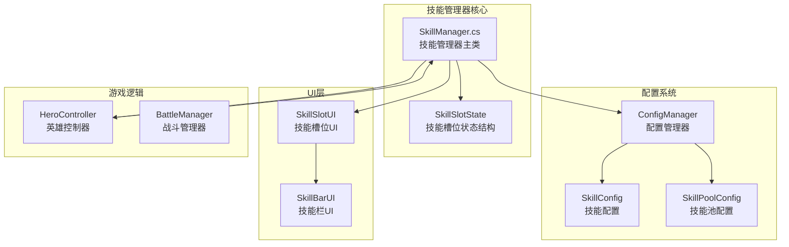
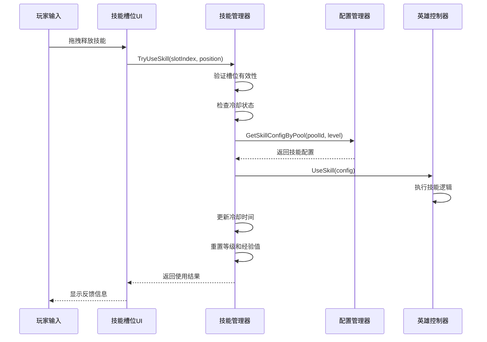
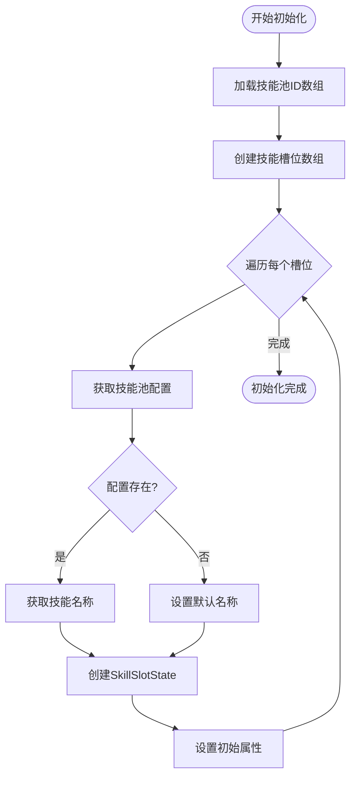
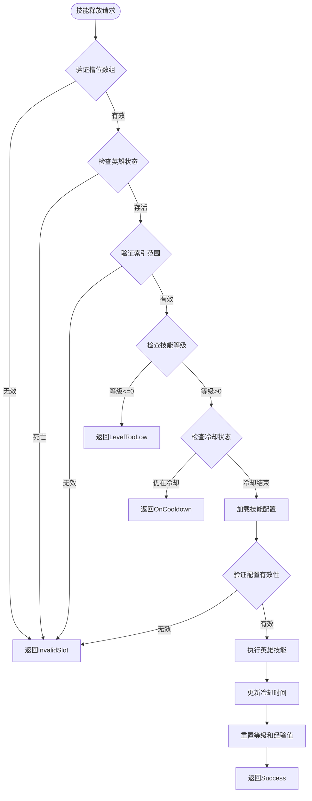
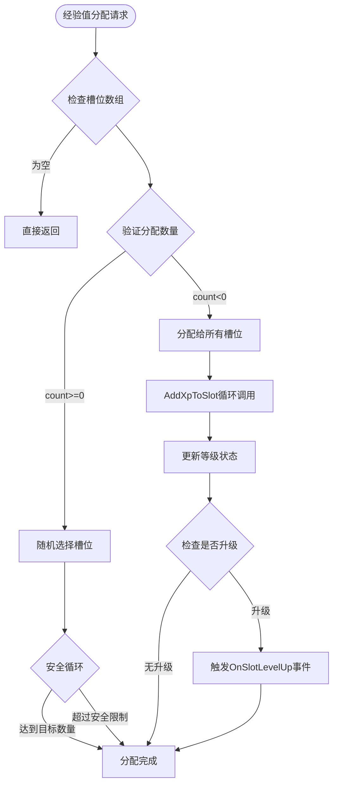
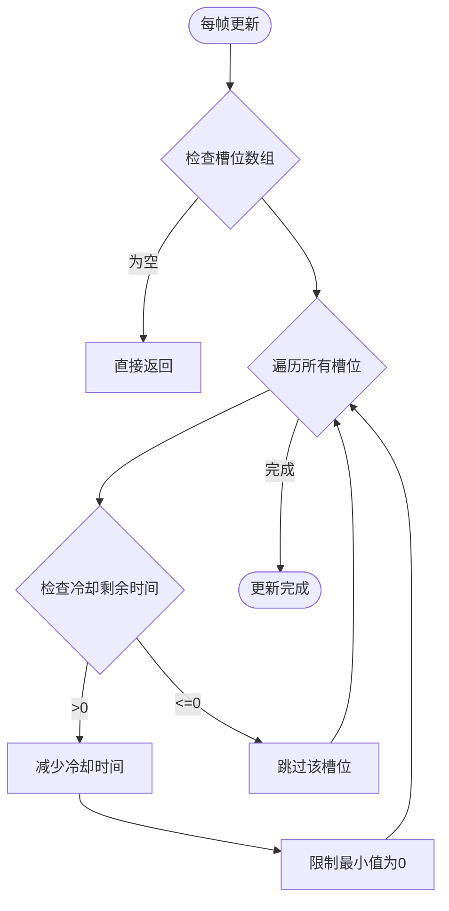
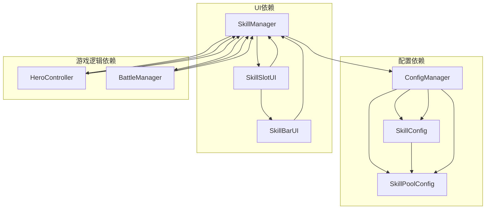

# 技能管理器核心

<cite>
**本文档引用的文件**
- [SkillManager.cs](file://Assets/Scripts/Battle/SkillManager.cs)
- [skill_pool_config.json](file://Assets/Resources/Configs/skill_pool_config.json)
- [GameConfigs.cs](file://Assets/Scripts/Data/GameConfigs.cs)
- [ConfigManager.cs](file://Assets/Scripts/Core/ConfigManager.cs)
- [HeroController.cs](file://Assets/Scripts/Battle/HeroController.cs)
- [SkillSlotUI.cs](file://Assets/Scripts/UI/SkillSlotUI.cs)
- [SkillBarUI.cs](file://Assets/Scripts/UI/SkillBarUI.cs)
- [BattleManager.cs](file://Assets/Scripts/Battle/BattleManager.cs)
</cite>

## 目录
1. [简介](#简介)
2. [项目结构](#项目结构)
3. [核心组件](#核心组件)
4. [架构概览](#架构概览)
5. [详细组件分析](#详细组件分析)
6. [依赖关系分析](#依赖关系分析)
7. [性能考虑](#性能考虑)
8. [故障排除指南](#故障排除指南)
9. [结论](#结论)

## 简介

GeometryTD的技能管理器是游戏战斗系统的核心组件，负责管理英雄的8个技能槽位、技能等级系统和经验值获取机制。该系统实现了完整的技能生命周期管理，从技能槽位初始化、冷却时间管理到技能释放和经验值分配。

技能管理器采用面向对象的设计模式，通过SkillSlotState数据结构封装每个技能槽位的状态信息，包括技能池ID、技能名称、等级、经验值、冷却剩余时间和最大冷却时间等关键属性。系统支持8个技能槽位，每个槽位都具备独立的冷却机制和升级路径。

## 项目结构

技能管理器相关的文件组织结构如下：



**图表来源**
- [SkillManager.cs:15-242](file://Assets/Scripts/Battle/SkillManager.cs#L15-L242)
- [GameConfigs.cs:361-475](file://Assets/Scripts/Data/GameConfigs.cs#L361-L475)
- [ConfigManager.cs:6-619](file://Assets/Scripts/Core/ConfigManager.cs#L6-L619)

**章节来源**
- [SkillManager.cs:1-242](file://Assets/Scripts/Battle/SkillManager.cs#L1-L242)
- [GameConfigs.cs:1-775](file://Assets/Scripts/Data/GameConfigs.cs#L1-L775)

## 核心组件

### SkillSlotState 数据结构

SkillSlotState是技能管理器的核心数据结构，用于封装单个技能槽位的完整状态信息：

| 字段名 | 类型 | 描述 | 默认值 |
|--------|------|------|--------|
| skillPoolId | int | 技能池标识符 | 0 |
| skillName | string | 技能名称 | "" |
| level | int | 当前等级 (0-10) | 0 |
| xp | int | 当前经验值 | 0 |
| cooldownRemaining | float | 剩余冷却时间 (秒) | 0.0f |
| maxCooldown | float | 最大冷却时间 (秒) | 0.0f |

该结构支持完整的技能状态持久化，包括等级上限（10级）、经验值累积机制和冷却时间管理。

**章节来源**
- [SkillManager.cs:5-13](file://Assets/Scripts/Battle/SkillManager.cs#L5-L13)

### SkillManager 主类

SkillManager是技能管理器的核心类，负责协调所有技能相关功能：

#### 主要职责
- **技能槽位管理**: 管理8个技能槽位的状态和生命周期
- **冷却时间处理**: 实时更新和管理技能冷却状态
- **技能释放控制**: 验证技能使用条件并执行技能逻辑
- **经验值系统**: 分配和累积经验值，触发等级提升
- **UI集成**: 与技能槽位UI组件进行数据同步

#### 关键属性
- `slots`: 技能槽位数组，长度固定为8
- `hero`: 英雄控制器引用
- `battleManager`: 战斗管理器引用
- `OnSlotLevelUp`: 等级提升事件回调

**章节来源**
- [SkillManager.cs:15-242](file://Assets/Scripts/Battle/SkillManager.cs#L15-L242)

## 架构概览

技能管理器采用分层架构设计，各组件职责明确，耦合度低：



**图表来源**
- [SkillManager.cs:87-137](file://Assets/Scripts/Battle/SkillManager.cs#L87-L137)
- [HeroController.cs:284-297](file://Assets/Scripts/Battle/HeroController.cs#L284-L297)
- [ConfigManager.cs:224-227](file://Assets/Scripts/Core/ConfigManager.cs#L224-L227)

## 详细组件分析

### 技能槽位初始化过程

技能槽位的初始化过程涉及多个步骤，确保每个槽位都具备完整的配置信息：



**图表来源**
- [SkillManager.cs:48-70](file://Assets/Scripts/Battle/SkillManager.cs#L48-L70)
- [ConfigManager.cs:229-234](file://Assets/Scripts/Core/ConfigManager.cs#L229-L234)

#### 初始化参数说明

- **skillPoolIds**: 技能池ID数组，决定技能槽位的技能类型
- **hero**: 英雄控制器引用，用于技能执行
- **bm**: 战斗管理器引用，提供战斗环境信息
- **ft**: 浮动文字UI，用于显示反馈信息

**章节来源**
- [SkillManager.cs:48-70](file://Assets/Scripts/Battle/SkillManager.cs#L48-L70)

### 技能释放核心逻辑

TryUseSkill方法实现了完整的技能释放流程，包含多重验证和错误处理：



**图表来源**
- [SkillManager.cs:87-137](file://Assets/Scripts/Battle/SkillManager.cs#L87-L137)

#### 技能分类系统

系统支持多种技能类型，通过SkillManager.ClassifySkill方法自动识别：

| 技能类型 | 分类依据 | 示例 |
|----------|----------|------|
| Self | 无特定属性 | 治疗、护盾 |
| Projectile | 子弹速度>0 | 火箭、激光 |
| Aoe | 伤害值>0 | 爆炸、范围攻击 |
| Shield | 特殊效果 | 护盾生成 |
| Summon | 召唤效果 | 召唤宠物 |

**章节来源**
- [SkillManager.cs:25-40](file://Assets/Scripts/Battle/SkillManager.cs#L25-L40)

### 经验值分配系统

经验值分配系统提供了灵活的奖励机制，支持批量分配和随机选择：



**图表来源**
- [SkillManager.cs:139-183](file://Assets/Scripts/Battle/SkillManager.cs#L139-L183)

#### 随机分配算法

随机分配算法使用安全循环机制避免无限循环：

1. **安全限制**: 最多执行100次循环
2. **去重机制**: 使用布尔数组标记已选择的槽位
3. **均匀分布**: 每个槽位被选中的概率相等
4. **边界处理**: 当可选槽位少于目标数量时自动调整

**章节来源**
- [SkillManager.cs:139-183](file://Assets/Scripts/Battle/SkillManager.cs#L139-L183)

### 冷却时间管理系统

冷却时间系统采用实时更新机制，确保精确的时间管理：



**图表来源**
- [SkillManager.cs:72-85](file://Assets/Scripts/Battle/SkillManager.cs#L72-L85)

#### 冷却时间特性

- **实时更新**: 每帧减少0.02秒（基于60FPS）
- **精度控制**: 最小冷却时间为0秒
- **内存优化**: 仅存储剩余时间和最大冷却时间
- **性能友好**: 使用简单的时间差计算

**章节来源**
- [SkillManager.cs:72-85](file://Assets/Scripts/Battle/SkillManager.cs#L72-L85)

## 依赖关系分析

技能管理器与其他系统的依赖关系如下：



**图表来源**
- [SkillManager.cs:17-19](file://Assets/Scripts/Battle/SkillManager.cs#L17-L19)
- [ConfigManager.cs:10-22](file://Assets/Scripts/Core/ConfigManager.cs#L10-L22)

### 外部依赖

技能管理器主要依赖以下外部组件：

1. **ConfigManager**: 提供技能配置查询服务
2. **HeroController**: 执行具体的技能逻辑
3. **BattleManager**: 提供战斗环境信息
4. **SkillSlotUI**: 更新UI显示状态
5. **SkillBarUI**: 协调多个技能槽位UI

**章节来源**
- [SkillManager.cs:17-242](file://Assets/Scripts/Battle/SkillManager.cs#L17-L242)

## 性能考虑

### 时间复杂度分析

- **初始化**: O(n)，其中n为技能槽位数量（固定为8）
- **技能释放**: O(1)，固定时间复杂度
- **冷却更新**: O(n)，线性扫描所有槽位
- **经验值分配**: O(k)，其中k为目标分配数量

### 内存使用优化

1. **固定数组大小**: 技能槽位数组大小固定，避免动态扩容
2. **轻量级数据结构**: SkillSlotState仅包含必要字段
3. **延迟加载**: 技能配置按需加载
4. **事件订阅**: 使用委托机制，避免频繁的对象创建

### 性能优化建议

1. **批量操作**: 对于大量经验值分配，优先使用负数参数一次性分配
2. **冷却管理**: 在不需要时可以暂停冷却更新以节省CPU
3. **UI同步**: 通过事件机制减少不必要的UI更新
4. **配置缓存**: ConfigManager已经内置配置缓存，无需重复查询

## 故障排除指南

### 常见问题及解决方案

#### 技能无法释放

**症状**: 技能槽位显示不可用状态

**可能原因**:
1. 技能等级为0
2. 技能仍在冷却中
3. 英雄处于死亡状态
4. 槽位索引超出范围

**解决方法**:
```csharp
// 检查技能状态
var slot = skillManager.GetSlot(index);
if (slot == null) {
    Debug.LogError("无效的技能槽位索引");
    return;
}
if (slot.level <= 0) {
    Debug.LogError("技能等级不足");
    return;
}
if (slot.cooldownRemaining > 0) {
    Debug.LogError($"技能仍在冷却中: {slot.cooldownRemaining:F1}秒");
    return;
}
```

#### 经验值分配异常

**症状**: 经验值分配不均匀或分配失败

**可能原因**:
1. 槽位数组为空
2. 目标槽位数量超过实际槽位数
3. 槽位已达到10级上限

**解决方法**:
```csharp
// 检查经验值分配参数
if (slotCount < 0) {
    // 分配给所有槽位
    for (int i = 0; i < slots.Length; i++) {
        AddXpToSlot(i, xpAmount);
    }
} else {
    // 随机分配给指定数量的槽位
    int count = Mathf.Min(slotCount, slots.Length);
    // ... 随机分配逻辑
}
```

#### UI显示不同步

**症状**: 技能槽位UI显示与实际状态不符

**可能原因**:
1. UI组件未正确初始化
2. 事件订阅丢失
3. 更新频率不匹配

**解决方法**:
```csharp
// 确保UI正确初始化
public void Init(int index, SkillManager manager) {
    // ... 初始化代码
    UpdateSlot(GetSlot(index)); // 立即更新显示
}

// 监听等级提升事件
skillManager.OnSlotLevelUp += HandleLevelUp;
```

**章节来源**
- [SkillManager.cs:87-137](file://Assets/Scripts/Battle/SkillManager.cs#L87-L137)
- [SkillSlotUI.cs:85-128](file://Assets/Scripts/UI/SkillSlotUI.cs#L85-L128)

## 结论

GeometryTD的技能管理器是一个设计精良、功能完整的系统，成功实现了以下核心目标：

### 设计优势

1. **模块化设计**: 清晰的职责分离，便于维护和扩展
2. **性能优化**: 固定数组大小和高效的数据结构设计
3. **用户体验**: 完整的UI反馈和直观的操作体验
4. **配置驱动**: 基于配置文件的灵活技能系统

### 功能完整性

- **8个技能槽位**: 支持多样化的技能组合
- **等级系统**: 10级上限的渐进式成长
- **冷却管理**: 精确的时间控制机制
- **经验值系统**: 灵活的奖励分配策略
- **UI集成**: 完整的可视化反馈

### 扩展性考虑

系统为未来的功能扩展预留了充足的空间，包括但不限于：
- 技能槽位数量的动态调整
- 新的技能类型和分类
- 更复杂的经验值分配算法
- 自定义技能行为的插件系统

技能管理器作为GeometryTD战斗系统的核心组件，为整个游戏提供了坚实的技能系统基础，是项目架构中的重要里程碑。