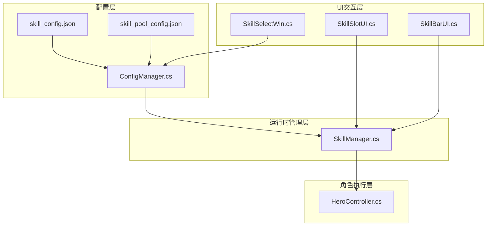
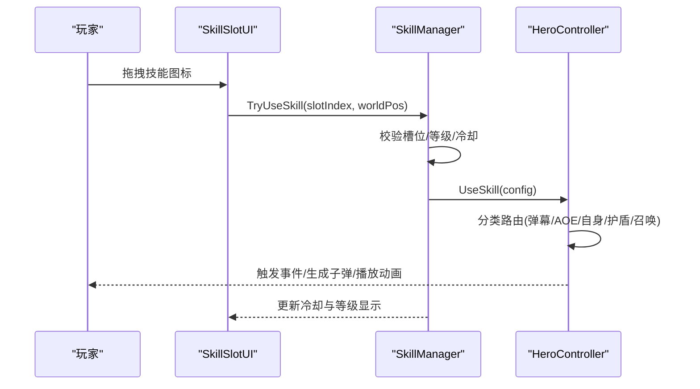
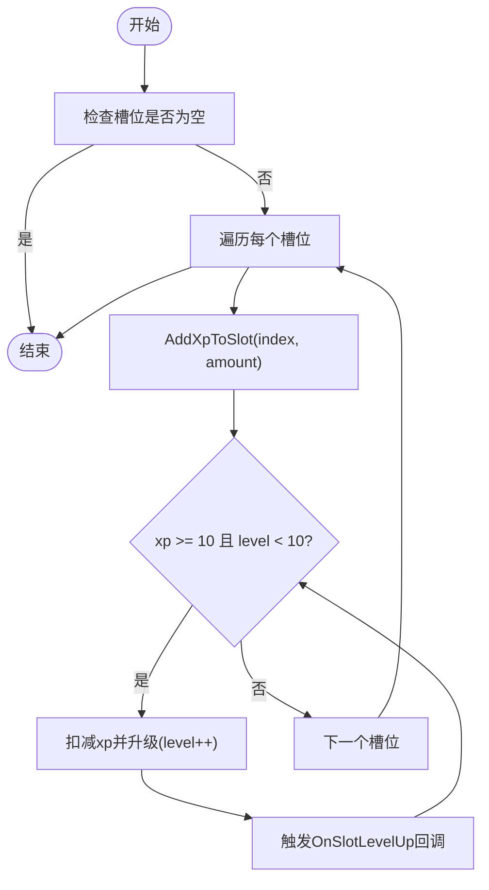
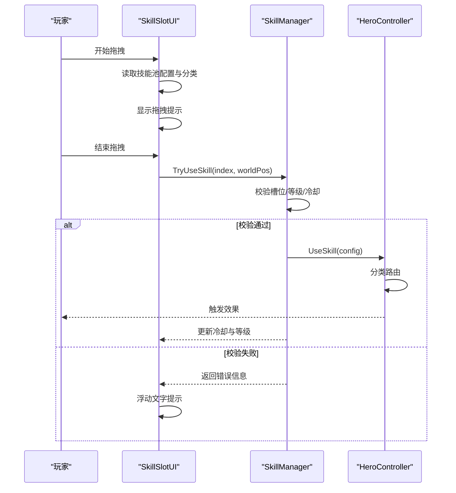
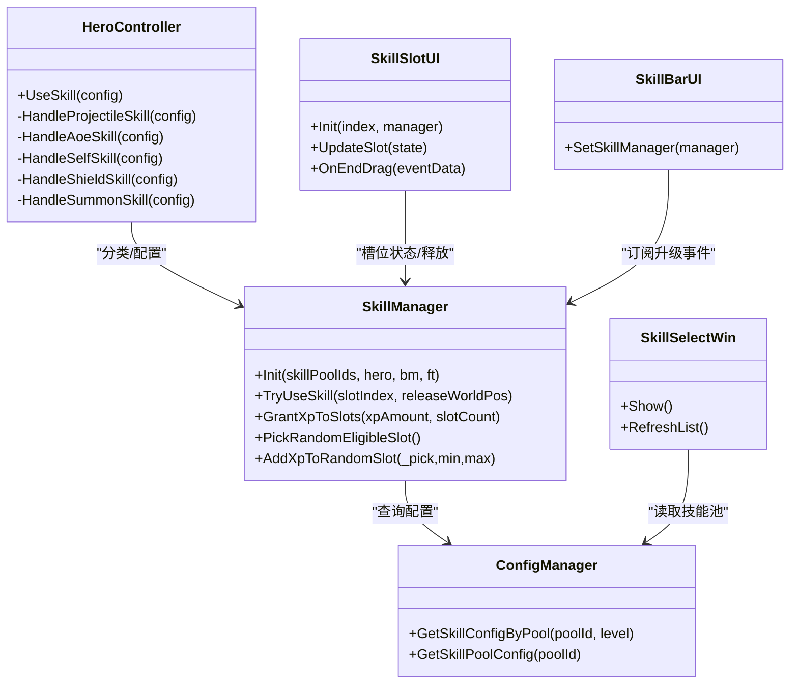

# 技能系统

<cite>
**本文档引用的文件**
- [SkillManager.cs](file://Assets/Scripts/Battle/SkillManager.cs)
- [HeroController.cs](file://Assets/Scripts/Battle/HeroController.cs)
- [SkillSlotUI.cs](file://Assets/Scripts/UI/SkillSlotUI.cs)
- [SkillBarUI.cs](file://Assets/Scripts/UI/SkillBarUI.cs)
- [SkillSelectWin.cs](file://Assets/Scripts/UI/SkillSelectWin.cs)
- [ConfigManager.cs](file://Assets/Scripts/Core/ConfigManager.cs)
- [GameConfigs.cs](file://Assets/Scripts/Data/GameConfigs.cs)
- [skill_config.json](file://Assets/Resources/Configs/skill_config.json)
- [skill_pool_config.json](file://Assets/Resources/Configs/skill_pool_config.json)
</cite>

## 目录
1. [简介](#简介)
2. [项目结构](#项目结构)
3. [核心组件](#核心组件)
4. [架构总览](#架构总览)
5. [详细组件分析](#详细组件分析)
6. [依赖关系分析](#依赖关系分析)
7. [性能考量](#性能考量)
8. [故障排查指南](#故障排查指南)
9. [结论](#结论)
10. [附录](#附录)

## 简介
本文件面向GeometryTD的技能系统，提供从底层实现到上层UI交互的全栈技术文档。内容涵盖：
- 技能槽位管理与冷却机制
- 技能等级与经验系统
- 技能配置与技能池配置
- 技能释放全流程（UI拖拽到游戏逻辑）
- 技能效果触发机制（伤害、治疗、控制等）
- 平衡性设计要点与扩展指南

## 项目结构
技能系统由“配置层”“运行时管理层”“角色执行层”“UI交互层”四部分组成：
- 配置层：skill_config.json定义技能等级与属性；skill_pool_config.json定义技能池与描述信息
- 运行时管理层：SkillManager负责槽位状态、经验与冷却
- 角色执行层：HeroController根据技能分类路由到不同处理分支
- UI交互层：SkillSlotUI/SkillBarUI/SkillSelectWin负责选择、展示与释放

图表来源
- [SkillManager.cs](file://Assets/Scripts/Battle/SkillManager.cs)
- [HeroController.cs](file://Assets/Scripts/Battle/HeroController.cs)
- [SkillSlotUI.cs](file://Assets/Scripts/UI/SkillSlotUI.cs)
- [SkillBarUI.cs](file://Assets/Scripts/UI/SkillBarUI.cs)
- [SkillSelectWin.cs](file://Assets/Scripts/UI/SkillSelectWin.cs)
- [ConfigManager.cs](file://Assets/Scripts/Core/ConfigManager.cs)
- [skill_config.json](file://Assets/Resources/Configs/skill_config.json)
- [skill_pool_config.json](file://Assets/Resources/Configs/skill_pool_config.json)

章节来源
- [SkillManager.cs](file://Assets/Scripts/Battle/SkillManager.cs)
- [ConfigManager.cs](file://Assets/Scripts/Core/ConfigManager.cs)
- [skill_config.json](file://Assets/Resources/Configs/skill_config.json)
- [skill_pool_config.json](file://Assets/Resources/Configs/skill_pool_config.json)

## 核心组件
- 技能槽位状态（SkillSlotState）：记录技能池ID、名称、等级、经验、剩余冷却与最大冷却
- 技能管理器（SkillManager）：初始化槽位、更新冷却、尝试释放技能、分配经验
- 英雄控制器（HeroController）：按技能类别分发到具体处理函数（弹幕、AOE、自身、护盾、召唤）
- UI层（SkillSlotUI/SkillBarUI/SkillSelectWin）：显示等级、经验、冷却；拖拽释放；技能选择窗口

章节来源
- [SkillManager.cs](file://Assets/Scripts/Battle/SkillManager.cs)
- [HeroController.cs](file://Assets/Scripts/Battle/HeroController.cs)
- [SkillSlotUI.cs](file://Assets/Scripts/UI/SkillSlotUI.cs)
- [SkillBarUI.cs](file://Assets/Scripts/UI/SkillBarUI.cs)
- [SkillSelectWin.cs](file://Assets/Scripts/UI/SkillSelectWin.cs)

## 架构总览
技能系统采用“配置驱动 + 分类路由”的架构：
- 配置驱动：通过skill_config.json与skill_pool_config.json定义技能属性、事件与描述
- 分类路由：根据技能配置中的category或特征字段自动分类，再由HeroController路由到对应处理逻辑
- 状态驱动：SkillManager维护每个槽位的经验与等级，影响可释放技能与冷却

图表来源
- [SkillSlotUI.cs](file://Assets/Scripts/UI/SkillSlotUI.cs)
- [SkillManager.cs](file://Assets/Scripts/Battle/SkillManager.cs)
- [HeroController.cs](file://Assets/Scripts/Battle/HeroController.cs)

## 详细组件分析

### 技能槽位与经验系统
- 槽位初始化：SkillManager.Init接收技能池ID数组，为每个ID创建SkillSlotState，初始等级与经验为0，冷却为0
- 经验获取：GrantXpToSlots支持对全部槽位或随机若干槽位发放经验；AddXpToSlot按10点经验升一级，上限10级
- 冷却更新：Update每帧递减冷却，保证UI与逻辑一致

图表来源
- [SkillManager.cs](file://Assets/Scripts/Battle/SkillManager.cs)

章节来源
- [SkillManager.cs](file://Assets/Scripts/Battle/SkillManager.cs)

### 技能配置系统
- skill_config.json定义技能等级属性：id、level、name、category、dmg、dmgType、bulletSpeed、cd、bulletStyleId、attack_range、events/enemyEvents/bulletEvents等
- skill_pool_config.json定义技能池：id、name、desList、icon、dragHint等
- ConfigManager加载并建立查询索引，提供GetSkillConfigByPool与GetSkillPoolConfig等接口

章节来源
- [skill_config.json](file://Assets/Resources/Configs/skill_config.json)
- [skill_pool_config.json](file://Assets/Resources/Configs/skill_pool_config.json)
- [ConfigManager.cs](file://Assets/Scripts/Core/ConfigManager.cs)
- [GameConfigs.cs](file://Assets/Scripts/Data/GameConfigs.cs)

### 技能池系统
- 技能池决定玩家可选的8个技能槽位
- SkillSelectWin允许玩家在可选技能池中选择8个，确认后写入GameManager并用于初始化SkillManager
- 每个槽位名称与图标来自对应技能池配置

章节来源
- [SkillSelectWin.cs](file://Assets/Scripts/UI/SkillSelectWin.cs)
- [ConfigManager.cs](file://Assets/Scripts/Core/ConfigManager.cs)
- [GameConfigs.cs](file://Assets/Scripts/Data/GameConfigs.cs)

### 技能释放流程（从UI到逻辑）
- UI交互：SkillSlotUI监听拖拽事件，拖拽开始时读取技能池配置的dragHint并显示拖拽预览
- 释放判断：拖拽结束时计算世界坐标，调用SkillManager.TryUseSkill
- 释放校验：检查槽位有效性、英雄状态、等级与冷却
- 执行技能：成功后调用HeroController.UseSkill，按分类路由到具体处理函数
- 冷却设定：释放后设置槽位冷却与最大冷却，并重置等级与经验

图表来源
- [SkillSlotUI.cs](file://Assets/Scripts/UI/SkillSlotUI.cs)
- [SkillManager.cs](file://Assets/Scripts/Battle/SkillManager.cs)
- [HeroController.cs](file://Assets/Scripts/Battle/HeroController.cs)

章节来源
- [SkillSlotUI.cs](file://Assets/Scripts/UI/SkillSlotUI.cs)
- [SkillManager.cs](file://Assets/Scripts/Battle/SkillManager.cs)
- [HeroController.cs](file://Assets/Scripts/Battle/HeroController.cs)

### 技能效果触发机制
- 弹幕技能（Projectile）：计算基础伤害与增益修正，合并子弹事件与敌方事件，按范围与目标数量生成子弹
- 自身技能（Self）：仅执行自身事件，如治疗、增益等
- 护盾技能（Shield）：执行自身事件，如生成护盾、反射等
- 全屏AOE（Aoe）：对全体敌人造成伤害并应用敌方事件
- 召唤技能（Summon）：执行自身事件，如生成随从

章节来源
- [HeroController.cs](file://Assets/Scripts/Battle/HeroController.cs)

### 技能平衡性设计
- 伤害计算：以攻击力为基础，按技能配置中的dmg比例换算；可通过Buff系统提供额外伤害修正
- 冷却时间：技能配置中的cd字段决定冷却时长；释放后立即设置槽位冷却与最大冷却
- 使用频率：通过经验系统限制升级速度（每10点经验升一级），避免过度使用
- 控制与限制：UI层在槽位不可用或冷却中时禁用按钮，减少误操作

章节来源
- [HeroController.cs](file://Assets/Scripts/Battle/HeroController.cs)
- [SkillManager.cs](file://Assets/Scripts/Battle/SkillManager.cs)
- [SkillSlotUI.cs](file://Assets/Scripts/UI/SkillSlotUI.cs)

### 扩展指南
- 添加新技能类型
  - 在skill_pool_config.json新增技能池条目，填写name/desList/icon/dragHint
  - 在skill_config.json为该技能池添加多个等级配置，设置category与属性
  - 如需特殊事件，先在event_config/bullet_event_config/buff_config中定义事件
- 修改现有技能属性
  - 直接调整skill_config.json中对应id与level的字段（如dmg、cd、bulletSpeed等）
- 实现自定义技能效果
  - 在HeroController中扩展对应分类的处理函数（如新增SkillCategory），并在UseSkill中路由
  - 通过事件系统（EventExecutor）挂接事件，确保与现有Buff/效果系统兼容

章节来源
- [skill_pool_config.json](file://Assets/Resources/Configs/skill_pool_config.json)
- [skill_config.json](file://Assets/Resources/Configs/skill_config.json)
- [HeroController.cs](file://Assets/Scripts/Battle/HeroController.cs)
- [ConfigManager.cs](file://Assets/Scripts/Core/ConfigManager.cs)

## 依赖关系分析
- SkillManager依赖ConfigManager进行技能配置查询
- HeroController依赖SkillManager的分类结果与配置数据
- UI层依赖ConfigManager与SkillManager进行显示与交互
- 技能池选择窗口依赖ConfigManager与GameManager

图表来源
- [SkillManager.cs](file://Assets/Scripts/Battle/SkillManager.cs)
- [HeroController.cs](file://Assets/Scripts/Battle/HeroController.cs)
- [ConfigManager.cs](file://Assets/Scripts/Core/ConfigManager.cs)
- [SkillSlotUI.cs](file://Assets/Scripts/UI/SkillSlotUI.cs)
- [SkillBarUI.cs](file://Assets/Scripts/UI/SkillBarUI.cs)
- [SkillSelectWin.cs](file://Assets/Scripts/UI/SkillSelectWin.cs)

章节来源
- [SkillManager.cs](file://Assets/Scripts/Battle/SkillManager.cs)
- [HeroController.cs](file://Assets/Scripts/Battle/HeroController.cs)
- [ConfigManager.cs](file://Assets/Scripts/Core/ConfigManager.cs)
- [SkillSlotUI.cs](file://Assets/Scripts/UI/SkillSlotUI.cs)
- [SkillBarUI.cs](file://Assets/Scripts/UI/SkillBarUI.cs)
- [SkillSelectWin.cs](file://Assets/Scripts/UI/SkillSelectWin.cs)

## 性能考量
- 冷却更新：每帧遍历槽位，复杂度O(n)，n为槽位数；建议槽位数固定且较小（如8），性能可接受
- 事件执行：事件列表在运行时构建，注意避免过长事件链导致卡顿
- UI刷新：SkillBarUI按帧更新所有槽位，建议保持槽位数量稳定

## 故障排查指南
- 释放失败
  - 等级不足：检查对应槽位经验是否达到要求
  - 冷却中：查看槽位剩余冷却时间
  - 槽位无效：确认传入的slotIndex是否越界
- 技能未生效
  - 检查技能配置category与属性是否正确
  - 确认事件ID是否存在且已加载
- UI显示异常
  - 检查技能池配置的icon与dragHint是否正确
  - 确认SkillBarUI已绑定SkillManager并订阅升级事件

章节来源
- [SkillManager.cs](file://Assets/Scripts/Battle/SkillManager.cs)
- [SkillSlotUI.cs](file://Assets/Scripts/UI/SkillSlotUI.cs)

## 结论
GeometryTD的技能系统通过“配置驱动 + 分类路由 + 状态管理”的方式实现了灵活而清晰的技能体系。技能池选择、经验升级与冷却机制共同构成了策略深度；UI层提供了直观的交互体验。通过事件系统与Buff系统，技能效果可扩展性强，便于后续迭代与平衡调整。

## 附录
- 技能配置字段说明（节选）
  - id：技能唯一标识
  - level：技能等级
  - name：技能名称
  - category：技能分类（Self/Projectile/Aoe/Shield/Summon）
  - dmg：伤害比例（按10000为基准）
  - dmgType：伤害类型
  - bulletSpeed：子弹速度
  - cd：冷却时间
  - bulletStyleId：子弹样式ID
  - attack_range：攻击范围
  - events/enemyEvents/bulletEvents：事件ID数组

章节来源
- [GameConfigs.cs](file://Assets/Scripts/Data/GameConfigs.cs)
- [skill_config.json](file://Assets/Resources/Configs/skill_config.json)
- [skill_pool_config.json](file://Assets/Resources/Configs/skill_pool_config.json)