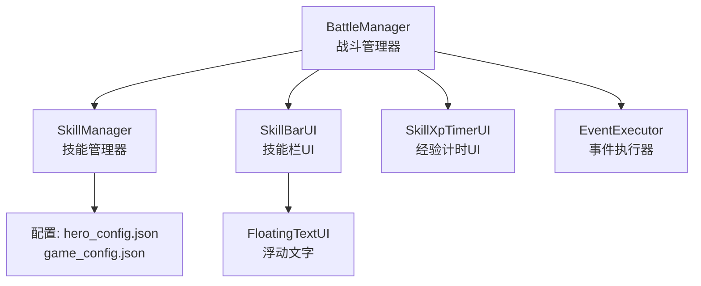
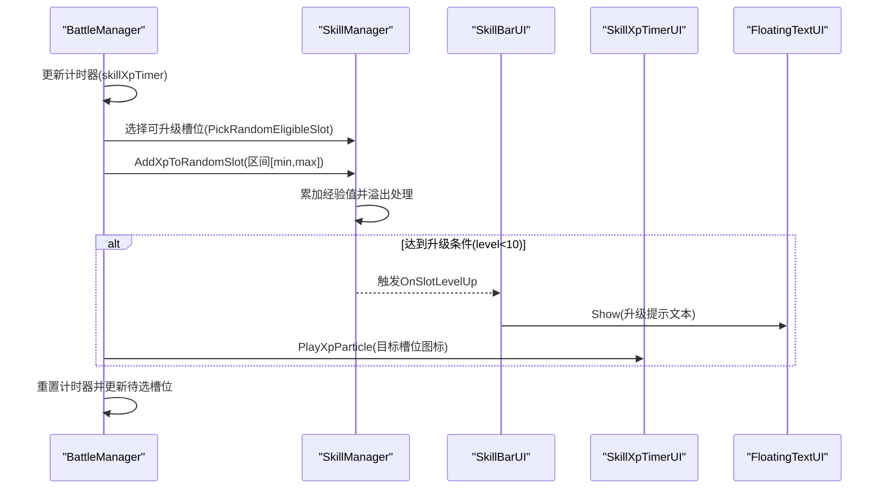
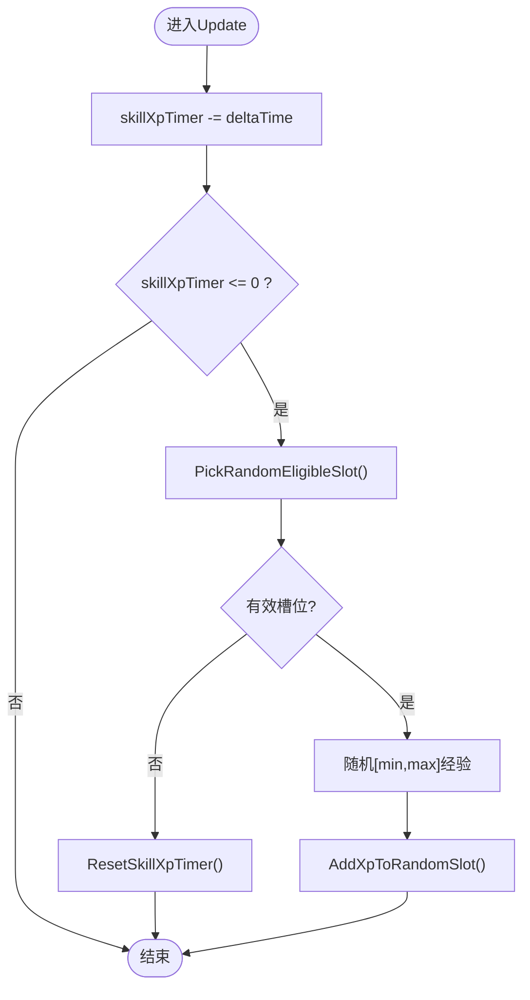
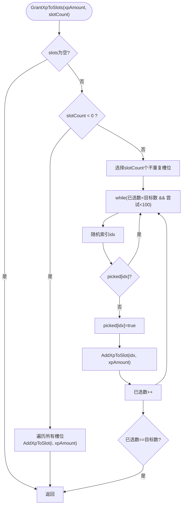
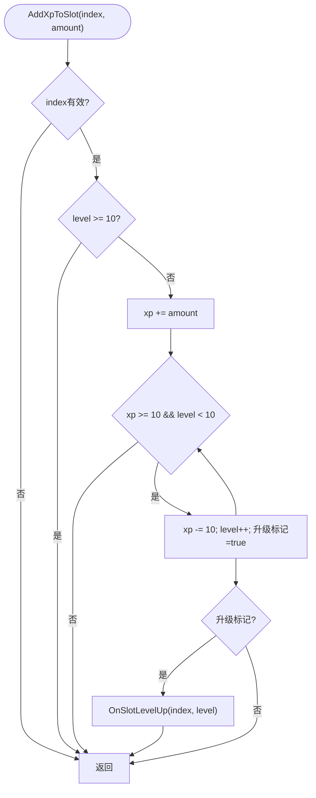
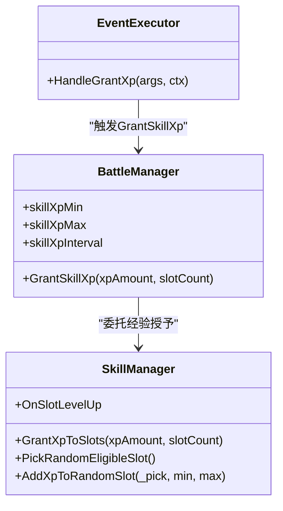
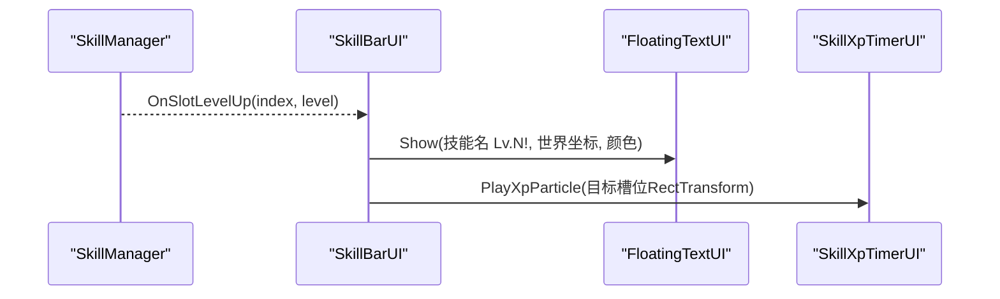
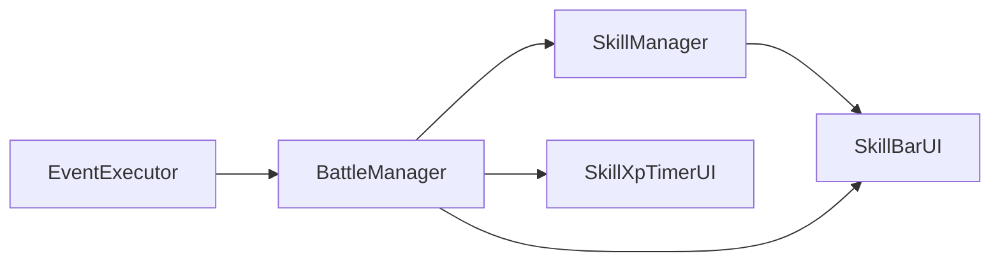

# 技能经验值系统

<cite>
**本文档引用的文件**
- [SkillManager.cs](file://Assets/Scripts/Battle/SkillManager.cs)
- [BattleManager.cs](file://Assets/Scripts/Battle/BattleManager.cs)
- [FloatingTextUI.cs](file://Assets/Scripts/UI/FloatingTextUI.cs)
- [SkillBarUI.cs](file://Assets/Scripts/UI/SkillBarUI.cs)
- [SkillXpTimerUI.cs](file://Assets/Scripts/UI/SkillXpTimerUI.cs)
- [EventExecutor.cs](file://Assets/Scripts/Battle/EventExecutor.cs)
- [hero_config.json](file://Assets/Resources/Configs/hero_config.json)
- [game_config.json](file://Assets/Resources/Configs/game_config.json)
</cite>

## 目录
1. [简介](#简介)
2. [项目结构](#项目结构)
3. [核心组件](#核心组件)
4. [架构总览](#架构总览)
5. [详细组件分析](#详细组件分析)
6. [依赖关系分析](#依赖关系分析)
7. [性能考量](#性能考量)
8. [故障排除指南](#故障排除指南)
9. [结论](#结论)
10. [附录](#附录)

## 简介
本文件全面解析GeometryTD中技能经验值系统的设计与实现，涵盖经验值获取机制、等级提升系统、分配策略、可视化反馈以及游戏平衡设计。系统采用基于时间的自动经验获取，支持均匀分配、随机分配与指定槽位分配三种模式，并通过UI提供直观的升级反馈与粒子动画。

## 项目结构
经验值系统主要由以下模块构成：
- 技能管理器：负责经验值的累计、溢出处理与等级提升判定
- 战斗管理器：负责定时触发经验获取、目标槽位选择与UI联动
- UI层：提供浮动文字提示与粒子特效展示
- 配置层：定义经验获取速率、范围与上限等参数
- 事件系统：支持通过事件触发经验授予

**图表来源**
- [BattleManager.cs: 70-123:70-123](file://Assets/Scripts/Battle/BattleManager.cs#L70-L123)
- [SkillManager.cs: 139-183:139-183](file://Assets/Scripts/Battle/SkillManager.cs#L139-L183)
- [SkillBarUI.cs: 40-54:40-54](file://Assets/Scripts/UI/SkillBarUI.cs#L40-L54)
- [SkillXpTimerUI.cs: 36-53:36-53](file://Assets/Scripts/UI/SkillXpTimerUI.cs#L36-L53)
- [EventExecutor.cs: 116-122:116-122](file://Assets/Scripts/Battle/EventExecutor.cs#L116-L122)

**章节来源**
- [BattleManager.cs: 70-123:70-123](file://Assets/Scripts/Battle/BattleManager.cs#L70-L123)
- [SkillManager.cs: 139-183:139-183](file://Assets/Scripts/Battle/SkillManager.cs#L139-L183)
- [SkillBarUI.cs: 40-54:40-54](file://Assets/Scripts/UI/SkillBarUI.cs#L40-L54)
- [SkillXpTimerUI.cs: 36-53:36-53](file://Assets/Scripts/UI/SkillXpTimerUI.cs#L36-L53)
- [EventExecutor.cs: 116-122:116-122](file://Assets/Scripts/Battle/EventExecutor.cs#L116-L122)

## 核心组件
- 技能槽状态：包含技能池ID、名称、等级、经验值、冷却时间等字段
- 技能管理器：提供经验值累计、溢出处理、等级提升与槽位选择能力
- 战斗管理器：驱动经验计时器、选择目标槽位、触发UI反馈
- UI组件：浮动文字与粒子特效，用于升级提示与经验流动可视化
- 配置系统：定义经验获取间隔、最小/最大经验数量与技能槽位列表

**章节来源**
- [SkillManager.cs: 5-13:5-13](file://Assets/Scripts/Battle/SkillManager.cs#L5-L13)
- [SkillManager.cs: 48-70:48-70](file://Assets/Scripts/Battle/SkillManager.cs#L48-L70)
- [BattleManager.cs: 38-42:38-42](file://Assets/Scripts/Battle/BattleManager.cs#L38-L42)
- [hero_config.json: 9-11:9-11](file://Assets/Resources/Configs/hero_config.json#L9-L11)
- [game_config.json: 6](file://Assets/Resources/Configs/game_config.json#L6)

## 架构总览
经验获取流程以时间驱动为主，战斗管理器在每帧更新经验计时器，当计时到达阈值时，从可升级槽位中随机选择一个目标槽位，向其添加经验。经验达到10点即升级一次，最多10级。升级时通过UI层展示浮动文字与粒子特效。

**图表来源**
- [BattleManager.cs: 70-123:70-123](file://Assets/Scripts/Battle/BattleManager.cs#L70-L123)
- [SkillManager.cs: 185-239:185-239](file://Assets/Scripts/Battle/SkillManager.cs#L185-L239)
- [SkillBarUI.cs: 40-54:40-54](file://Assets/Scripts/UI/SkillBarUI.cs#L40-L54)
- [SkillXpTimerUI.cs: 84-145:84-145](file://Assets/Scripts/UI/SkillXpTimerUI.cs#L84-L145)

## 详细组件分析

### 经验值获取机制
- 自动经验获取：战斗管理器维护skillXpMin、skillXpMax与skillXpInterval，每帧递减计时器，到达阈值后触发经验授予
- 目标槽位选择：优先使用上次目标槽位，若该槽位不可用则重新随机选择；仅在等级小于10的槽位中选择
- 经验区间：每次向目标槽位添加的经验值在[min, max]范围内随机选取

**图表来源**
- [BattleManager.cs: 70-123:70-123](file://Assets/Scripts/Battle/BattleManager.cs#L70-L123)
- [SkillManager.cs: 185-239:185-239](file://Assets/Scripts/Battle/SkillManager.cs#L185-L239)

**章节来源**
- [BattleManager.cs: 70-123:70-123](file://Assets/Scripts/Battle/BattleManager.cs#L70-L123)
- [BattleManager.cs: 178-180:178-180](file://Assets/Scripts/Battle/BattleManager.cs#L178-L180)
- [SkillManager.cs: 185-239:185-239](file://Assets/Scripts/Battle/SkillManager.cs#L185-L239)

### GrantXpToSlots方法的随机分配算法
- 均匀分配：slotCount < 0时，对所有槽位均分经验
- 随机分配：slotCount ≥ 0时，最多选择min(slotCount, 槽位总数)个不重复槽位，使用布尔数组标记已选槽位，防止重复
- 安全循环：限制最大尝试次数(100)，避免极端情况下死循环

**图表来源**
- [SkillManager.cs: 139-164:139-164](file://Assets/Scripts/Battle/SkillManager.cs#L139-L164)

**章节来源**
- [SkillManager.cs: 139-164:139-164](file://Assets/Scripts/Battle/SkillManager.cs#L139-L164)

### AddXpToSlot方法的经验值累加逻辑与溢出处理
- 累加：直接将amount加到当前槽位xp
- 溢出：当xp≥10且等级<10时，持续扣减10并提升一级，直至无法再升级
- 回调：每次成功升级触发OnSlotLevelUp事件，供UI层订阅

**图表来源**
- [SkillManager.cs: 166-183:166-183](file://Assets/Scripts/Battle/SkillManager.cs#L166-L183)

**章节来源**
- [SkillManager.cs: 166-183:166-183](file://Assets/Scripts/Battle/SkillManager.cs#L166-L183)

### 经验值分配策略
- 均匀分配：适用于需要均衡培养所有技能的场景
- 随机分配：适用于希望增加策略性与不确定性，鼓励多技能体验
- 指定槽位分配：通过事件系统或外部接口定向给某槽位经验，适合剧情或特殊道具效果

**图表来源**
- [SkillManager.cs: 139-239:139-239](file://Assets/Scripts/Battle/SkillManager.cs#L139-L239)
- [BattleManager.cs: 631-637:631-637](file://Assets/Scripts/Battle/BattleManager.cs#L631-L637)
- [EventExecutor.cs: 116-122:116-122](file://Assets/Scripts/Battle/EventExecutor.cs#L116-L122)

**章节来源**
- [SkillManager.cs: 139-239:139-239](file://Assets/Scripts/Battle/SkillManager.cs#L139-L239)
- [BattleManager.cs: 631-637:631-637](file://Assets/Scripts/Battle/BattleManager.cs#L631-L637)
- [EventExecutor.cs: 116-122:116-122](file://Assets/Scripts/Battle/EventExecutor.cs#L116-L122)

### 经验值的等级提升系统
- 升级条件：每10点经验值升一级
- 等级上限：10级
- 升级奖励：通过OnSlotLevelUp事件通知UI层，展示升级浮动文字与粒子特效

**章节来源**
- [SkillManager.cs: 174-179:174-179](file://Assets/Scripts/Battle/SkillManager.cs#L174-L179)
- [SkillBarUI.cs: 40-54:40-54](file://Assets/Scripts/UI/SkillBarUI.cs#L40-L54)

### 经验值的可视化反馈
- 浮动文字：SkillBarUI在收到升级事件后，调用FloatingTextUI在对应技能槽图标上方显示“技能名 Lv.N!”
- 粒子特效：SkillXpTimerUI根据计时器位置与目标槽位图标位置播放飞行动画，增强经验流动感

**图表来源**
- [SkillBarUI.cs: 40-54:40-54](file://Assets/Scripts/UI/SkillBarUI.cs#L40-L54)
- [FloatingTextUI.cs: 9-57:9-57](file://Assets/Scripts/UI/FloatingTextUI.cs#L9-L57)
- [SkillXpTimerUI.cs: 84-145:84-145](file://Assets/Scripts/UI/SkillXpTimerUI.cs#L84-L145)

**章节来源**
- [SkillBarUI.cs: 40-54:40-54](file://Assets/Scripts/UI/SkillBarUI.cs#L40-L54)
- [FloatingTextUI.cs: 9-57:9-57](file://Assets/Scripts/UI/FloatingTextUI.cs#L9-L57)
- [SkillXpTimerUI.cs: 84-145:84-145](file://Assets/Scripts/UI/SkillXpTimerUI.cs#L84-L145)

### 游戏平衡设计
- 获取速率：由hero_config.json中的skill_xp_interval控制，越短越快
- 获取幅度：由skill_xp_min与skill_xp_max定义经验区间，影响成长曲线陡峭程度
- 成长上限：10级上限确保数值不会无限膨胀
- 关卡难度：hardMultiplier影响敌人强度，间接影响玩家生存压力与经验收益节奏

**章节来源**
- [BattleManager.cs: 178-180:178-180](file://Assets/Scripts/Battle/BattleManager.cs#L178-L180)
- [hero_config.json: 9-11:9-11](file://Assets/Resources/Configs/hero_config.json#L9-L11)

### 扩展功能
- 经验倍率与临时加成：可通过事件系统或外部接口调整skillXpMin/skillXpMax或直接调用GrantXpToSlots进行批量加成
- 特殊道具效果：通过EventExecutor的HandleGrantXp事件参数传递经验数量与分配数量，实现一次性或持续性加成

**章节来源**
- [EventExecutor.cs: 116-122:116-122](file://Assets/Scripts/Battle/EventExecutor.cs#L116-L122)
- [BattleManager.cs: 631-637:631-637](file://Assets/Scripts/Battle/BattleManager.cs#L631-L637)

### 调试工具与统计功能
- 计时器UI：SkillXpTimerUI实时显示剩余时间与目标技能信息，便于观察经验获取节奏
- 升级提示：FloatingTextUI在升级时显示具体技能名与等级，辅助定位问题
- 日志与断点：可在SkillManager的AddXpToSlot与OnSlotLevelUp处设置断点，观察经验值变化与升级触发

**章节来源**
- [SkillXpTimerUI.cs: 36-53:36-53](file://Assets/Scripts/UI/SkillXpTimerUI.cs#L36-L53)
- [SkillBarUI.cs: 40-54:40-54](file://Assets/Scripts/UI/SkillBarUI.cs#L40-L54)
- [SkillManager.cs: 166-183:166-183](file://Assets/Scripts/Battle/SkillManager.cs#L166-L183)

## 依赖关系分析
- BattleManager依赖SkillManager进行经验授予与槽位选择
- SkillBarUI订阅SkillManager的升级事件，驱动UI反馈
- SkillXpTimerUI与SkillBarUI共同完成经验流动的视觉呈现
- EventExecutor通过BattleManager间接影响SkillManager的经验授予

**图表来源**
- [BattleManager.cs: 70-123:70-123](file://Assets/Scripts/Battle/BattleManager.cs#L70-L123)
- [SkillManager.cs: 139-183:139-183](file://Assets/Scripts/Battle/SkillManager.cs#L139-L183)
- [SkillBarUI.cs: 24](file://Assets/Scripts/UI/SkillBarUI.cs#L24)
- [EventExecutor.cs: 116-122:116-122](file://Assets/Scripts/Battle/EventExecutor.cs#L116-L122)

**章节来源**
- [BattleManager.cs: 70-123:70-123](file://Assets/Scripts/Battle/BattleManager.cs#L70-L123)
- [SkillManager.cs: 139-183:139-183](file://Assets/Scripts/Battle/SkillManager.cs#L139-L183)
- [SkillBarUI.cs: 24](file://Assets/Scripts/UI/SkillBarUI.cs#L24)
- [EventExecutor.cs: 116-122:116-122](file://Assets/Scripts/Battle/EventExecutor.cs#L116-L122)

## 性能考量
- 时间驱动：经验获取在Update中按帧处理，开销极低
- 随机选择：PickRandomEligibleSlot与AddXpToRandomSlot均为O(n)扫描，n为槽位数，通常较小
- UI协程：FloatingTextUI与SkillXpTimerUI使用协程，生命周期受对象销毁影响，注意内存释放

[本节为通用性能讨论，无需特定文件引用]

## 故障排除指南
- 经验不增长
  - 检查BattleManager的skillXpTimer是否正确递减
  - 确认SkillManager的AddXpToSlot未被提前返回（索引越界或已达10级）
- 升级无提示
  - 检查SkillBarUI是否正确订阅OnSlotLevelUp
  - 确认FloatingTextUI的Show调用路径与颜色参数
- 粒子特效不播放
  - 检查SkillXpTimerUI的PlayXpParticle目标RectTransform是否有效
  - 确认Canvas层级与排序设置

**章节来源**
- [BattleManager.cs: 70-123:70-123](file://Assets/Scripts/Battle/BattleManager.cs#L70-L123)
- [SkillManager.cs: 166-183:166-183](file://Assets/Scripts/Battle/SkillManager.cs#L166-L183)
- [SkillBarUI.cs: 40-54:40-54](file://Assets/Scripts/UI/SkillBarUI.cs#L40-L54)
- [SkillXpTimerUI.cs: 84-145:84-145](file://Assets/Scripts/UI/SkillXpTimerUI.cs#L84-L145)

## 结论
GeometryTD的技能经验值系统以简洁高效的时间驱动模型为核心，结合随机分配与指定槽位分配策略，提供了良好的可玩性与平衡性。通过UI层的即时反馈与粒子特效，显著提升了玩家的成长感知。建议在后续版本中引入经验倍率与临时加成机制，进一步丰富策略深度。

## 附录
- 配置项说明
  - skill_xp_interval：经验获取间隔（秒）
  - skill_xp_min/skill_xp_max：每次经验获取的随机区间下限与上限
  - skill_slot_ids：初始技能槽位ID列表

**章节来源**
- [hero_config.json: 9-11:9-11](file://Assets/Resources/Configs/hero_config.json#L9-L11)
- [game_config.json: 6](file://Assets/Resources/Configs/game_config.json#L6)