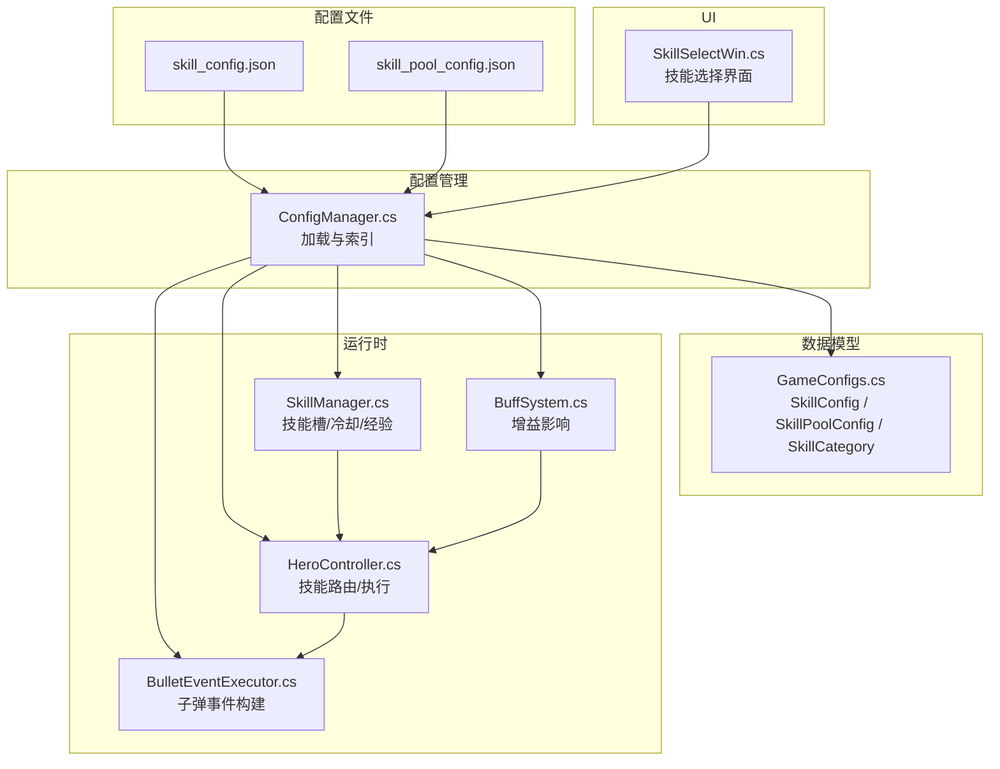
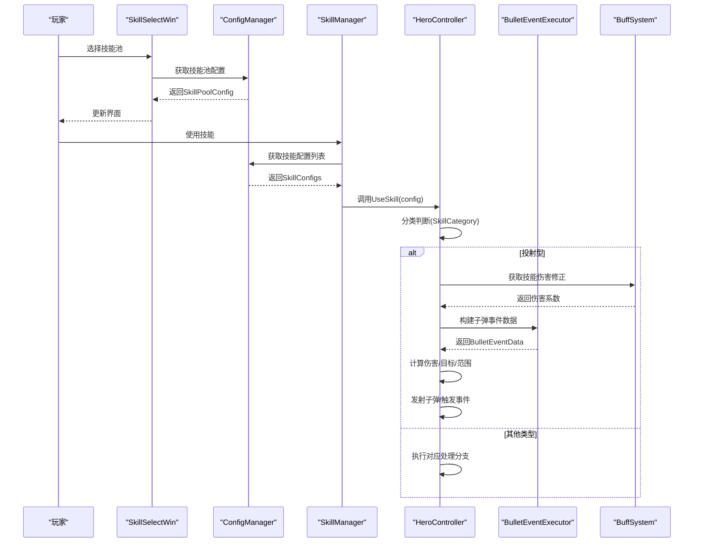
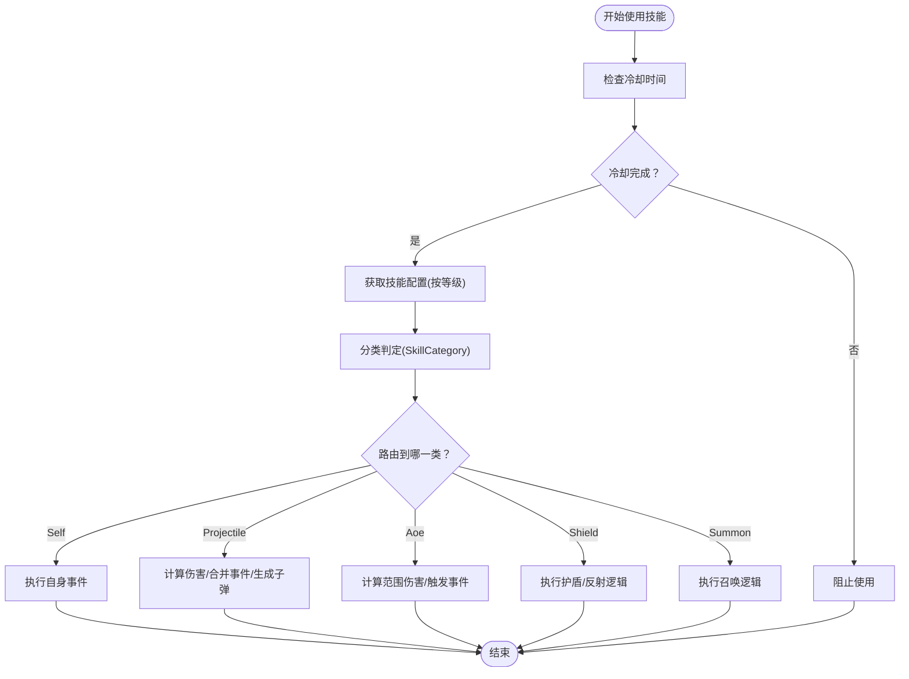
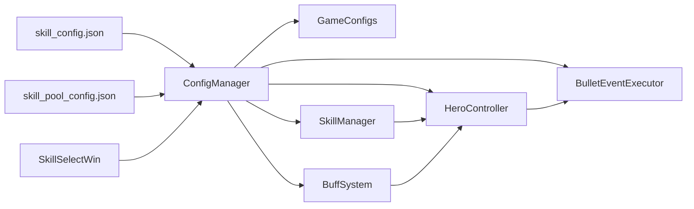

# 技能配置系统

<cite>
**本文引用的文件**
- [skill_config.json](file://Assets/Resources/Configs/skill_config.json)
- [skill_pool_config.json](file://Assets/Resources/Configs/skill_pool_config.json)
- [GameConfigs.cs](file://Assets/Scripts/Data/GameConfigs.cs)
- [ConfigManager.cs](file://Assets/Scripts/Core/ConfigManager.cs)
- [SkillManager.cs](file://Assets/Scripts/Battle/SkillManager.cs)
- [HeroController.cs](file://Assets/Scripts/Battle/HeroController.cs)
- [SkillSelectWin.cs](file://Assets/Scripts/UI/SkillSelectWin.cs)
- [BulletEventExecutor.cs](file://Assets/Scripts/Battle/BulletEventExecutor.cs)
- [BuffSystem.cs](file://Assets/Scripts/Battle/BuffSystem.cs)
</cite>

## 目录
1. [简介](#简介)
2. [项目结构](#项目结构)
3. [核心组件](#核心组件)
4. [架构总览](#架构总览)
5. [详细组件分析](#详细组件分析)
6. [依赖关系分析](#依赖关系分析)
7. [性能考量](#性能考量)
8. [故障排查指南](#故障排查指南)
9. [结论](#结论)
10. [附录](#附录)

## 简介
本文件面向GeometryTD的技能配置系统，系统性梳理了技能配置文件skill_config.json与技能池配置skill_pool_config.json的结构、字段定义与设计意图，解释技能分类体系（Self、Projectile、Aoe、Shield、Summon）及其使用场景，阐明技能等级系统在配置中的体现与变化规律，详述技能效果参数的配置方式（直接伤害、范围伤害、治疗效果、控制技能等），并提供配置扩展指南与最佳实践建议。读者无需深入编程背景即可理解技能系统的配置与调优方法。

## 项目结构
技能配置系统由以下部分组成：
- 配置文件层：skill_config.json（技能配置）、skill_pool_config.json（技能池配置）
- 数据模型层：GameConfigs.cs中定义的SkillConfig、SkillPoolConfig及SkillCategory枚举
- 配置管理层：ConfigManager.cs负责加载与索引配置
- 运行时逻辑层：SkillManager.cs（技能槽位与冷却）、HeroController.cs（技能路由与执行）、BulletEventExecutor.cs（子弹事件构建）、BuffSystem.cs（增益影响）
- UI层：SkillSelectWin.cs（技能选择界面）

图表来源
- [skill_config.json](file://Assets/Resources/Configs/skill_config.json)
- [skill_pool_config.json](file://Assets/Resources/Configs/skill_pool_config.json)
- [GameConfigs.cs](file://Assets/Scripts/Data/GameConfigs.cs)
- [ConfigManager.cs](file://Assets/Scripts/Core/ConfigManager.cs)
- [SkillManager.cs](file://Assets/Scripts/Battle/SkillManager.cs)
- [HeroController.cs](file://Assets/Scripts/Battle/HeroController.cs)
- [BulletEventExecutor.cs](file://Assets/Scripts/Battle/BulletEventExecutor.cs)
- [BuffSystem.cs](file://Assets/Scripts/Battle/BuffSystem.cs)
- [SkillSelectWin.cs](file://Assets/Scripts/UI/SkillSelectWin.cs)

章节来源
- [skill_config.json](file://Assets/Resources/Configs/skill_config.json)
- [skill_pool_config.json](file://Assets/Resources/Configs/skill_pool_config.json)
- [GameConfigs.cs](file://Assets/Scripts/Data/GameConfigs.cs)
- [ConfigManager.cs](file://Assets/Scripts/Core/ConfigManager.cs)

## 核心组件
- 技能配置（SkillConfig）
  - 字段：id、level、name、icon、category、dmg、dmgType、bulletSpeed、cd、bulletStyleId、attack_range、events、enemyEvents、bulletEvents、des
  - 作用：描述单个技能在不同等级下的具体属性与效果
- 技能池配置（SkillPoolConfig）
  - 字段：id、name、desList、icon、dragHint
  - 作用：描述可选技能槽位的展示信息与提示文案
- 技能分类（SkillCategory）
  - 枚举：Self、Projectile、Aoe、Shield、Summon
  - 作用：决定技能的使用方式与执行路径
- 配置管理（ConfigManager）
  - 加载与索引：SkillConfigs、SkillPoolConfigs、BulletStyleConfigs等
  - 提供查询接口：GetSkillConfig、GetSkillPoolConfig等
- 技能管理（SkillManager）
  - 技能槽位状态：skillPoolId、skillName、level、xp、cooldownRemaining、maxCooldown
  - 冷却更新、经验授予、技能使用判定
- 英雄控制器（HeroController）
  - 技能路由：根据SkillCategory分派到不同处理分支
  - 执行流程：计算伤害、合并事件、生成子弹、触发自身事件
- 子弹事件执行器（BulletEventExecutor）
  - 将子弹事件ID数组转换为BulletEventData，支持穿透、爆炸、追踪等效果
- 增益系统（BuffSystem）
  - 影响技能伤害系数与附加子弹事件，如反击盾弹的穿透、急冻冰锥的减速等

章节来源
- [GameConfigs.cs](file://Assets/Scripts/Data/GameConfigs.cs)
- [ConfigManager.cs](file://Assets/Scripts/Core/ConfigManager.cs)
- [SkillManager.cs](file://Assets/Scripts/Battle/SkillManager.cs)
- [HeroController.cs](file://Assets/Scripts/Battle/HeroController.cs)
- [BulletEventExecutor.cs](file://Assets/Scripts/Battle/BulletEventExecutor.cs)
- [BuffSystem.cs](file://Assets/Scripts/Battle/BuffSystem.cs)

## 架构总览
技能配置系统采用“配置驱动 + 运行时解析”的架构：
- 配置文件以JSON形式存储技能与技能池信息
- ConfigManager统一加载并建立查找索引
- GameConfigs定义数据模型与枚举
- 运行时通过SkillManager维护技能槽位状态，HeroController根据分类路由执行技能
- 子弹事件通过BulletEventExecutor构建，增益系统通过BuffSystem影响最终效果

图表来源
- [SkillSelectWin.cs](file://Assets/Scripts/UI/SkillSelectWin.cs)
- [ConfigManager.cs](file://Assets/Scripts/Core/ConfigManager.cs)
- [SkillManager.cs](file://Assets/Scripts/Battle/SkillManager.cs)
- [HeroController.cs](file://Assets/Scripts/Battle/HeroController.cs)
- [BulletEventExecutor.cs](file://Assets/Scripts/Battle/BulletEventExecutor.cs)
- [BuffSystem.cs](file://Assets/Scripts/Battle/BuffSystem.cs)

## 详细组件分析

### 技能配置文件 skill_config.json
- 文件定位：Assets/Resources/Configs/skill_config.json
- 结构概览：包含skills数组，每个元素为SkillConfig对象
- 关键字段说明
  - id：技能唯一标识，通常以前缀区分不同技能族（如1001、1002等）
  - level：技能等级，从0开始，0表示未解锁或基础形态
  - name：技能显示名称
  - icon：图标资源路径
  - category：技能分类字符串，需与SkillCategory枚举匹配
  - dmg：伤害基数（百分比基数为10000），用于按攻击力比例计算实际伤害
  - dmgType：伤害类型（与事件系统配合，如火焰、冰霜、雷电等）
  - bulletSpeed：子弹速度（>0视为投射型技能）
  - cd：冷却时间（秒）
  - bulletStyleId：子弹样式ID，关联bullet_config.json中的样式
  - attack_range：攻击范围（若为0则使用默认攻击范围）
  - events：自身事件ID数组（施法者触发的效果）
  - enemyEvents：敌方事件ID数组（命中目标时触发的效果）
  - bulletEvents：子弹事件ID数组（子弹生命周期内触发的效果）
  - des：描述文本（可为空）
- 等级系统体现
  - 同一技能id下存在多个level条目，形成等级链
  - 例如“烈焰圣弹”从100101到100110，等级越高，cd、伤害、事件效果越强
  - “反击盾弹”在同一id下有多个level，用于逐步解锁或强化
- 使用场景示例
  - 投射型：bulletSpeed > 0，dmg可为0（如某些控制型投射技能）
  - 范围型：dmg > 0，attack_range > 0
  - 自身型：dmg为0，events用于自身增益/治疗/减伤等
  - 护盾型：category为Shield，通常无伤害但有护盾/反射等效果
  - 召唤型：category为Summon，用于生成随从

章节来源
- [skill_config.json](file://Assets/Resources/Configs/skill_config.json)
- [GameConfigs.cs](file://Assets/Scripts/Data/GameConfigs.cs)

### 技能池配置文件 skill_pool_config.json
- 文件定位：Assets/Resources/Configs/skill_pool_config.json
- 结构概览：包含skill_pool_config数组，每个元素为SkillPoolConfig对象
- 关键字段说明
  - id：技能池ID，与game_config中的skill_slot_ids关联
  - name：技能池名称（用于UI展示）
  - desList：描述列表，按等级展示升级效果与特殊效果
  - icon：图标资源路径
  - dragHint：拖拽提示文案（用于交互提示）
- 设计要点
  - 技能池ID作为玩家可选的技能槽位，与ConfigManager中的GameConfig.skill_slot_ids对应
  - desList用于动态展示技能升级效果，便于玩家理解

章节来源
- [skill_pool_config.json](file://Assets/Resources/Configs/skill_pool_config.json)
- [GameConfigs.cs](file://Assets/Scripts/Data/GameConfigs.cs)

### 技能分类系统
- 枚举定义：SkillCategory（Self、Projectile、Aoe、Shield、Summon）
- 分类判定逻辑（SkillManager.ClassifySkill）
  - 优先：从SkillConfig.category字符串解析为枚举
  - 回退：若bulletSpeed > 0，则为Projectile；若dmg > 0，则为Aoe；否则为Self
- 使用场景
  - Self：自身治疗、减伤、增益等
  - Projectile：投射弹道，可附带穿透、爆炸、追踪等子弹事件
  - Aoe：范围伤害，通常无弹道速度
  - Shield：护盾/反射类技能
  - Summon：召唤随从类技能

章节来源
- [GameConfigs.cs](file://Assets/Scripts/Data/GameConfigs.cs)
- [SkillManager.cs](file://Assets/Scripts/Battle/SkillManager.cs)

### 技能等级系统
- 配置层面
  - 同一技能id下按level升序排列，形成等级链
  - 通过events、enemyEvents、bulletEvents、dmg、cd等字段随等级变化
- 运行时层面
  - SkillManager维护每个技能槽位的level与xp
  - 当xp达到阈值时提升level，上限为10
  - 技能使用时根据当前等级选择对应的SkillConfig条目

章节来源
- [SkillManager.cs](file://Assets/Scripts/Battle/SkillManager.cs)
- [skill_config.json](file://Assets/Resources/Configs/skill_config.json)

### 技能效果参数配置
- 直接伤害
  - 通过dmg字段与攻击力计算：actualDmg = 攻击力 × dmg / 10000
  - 可叠加BuffSystem提供的伤害修正
- 范围伤害
  - 通过dmg > 0与attack_range > 0实现
  - 可结合爆炸、减速、易伤等enemyEvents
- 治疗效果
  - Self类技能通常dmg为0，通过events触发治疗事件
- 控制技能
  - 通过enemyEvents实现冻结、减速、眩晕等控制效果
- 子弹事件
  - bulletEvents通过BulletEventExecutor构建，支持穿透、爆炸、追踪等
  - 与BuffSystem联动，可附加额外子弹事件

章节来源
- [HeroController.cs](file://Assets/Scripts/Battle/HeroController.cs)
- [BulletEventExecutor.cs](file://Assets/Scripts/Battle/BulletEventExecutor.cs)
- [BuffSystem.cs](file://Assets/Scripts/Battle/BuffSystem.cs)

### 技能使用流程
- 技能槽位初始化：SkillManager根据game_config中的skill_slot_ids创建槽位
- 技能使用：SkillManager.TryUseSkill检查冷却与等级，成功后调用HeroController.UseSkill
- 分类执行：HeroController根据SkillCategory路由到对应处理函数
  - 投射型：计算伤害、合并事件、生成子弹、触发自身事件
  - 范围型：计算伤害、应用范围效果、触发自身事件
  - 自身型：仅触发自身事件
  - 护盾型/召唤型：执行相应特殊逻辑

图表来源
- [SkillManager.cs](file://Assets/Scripts/Battle/SkillManager.cs)
- [HeroController.cs](file://Assets/Scripts/Battle/HeroController.cs)

## 依赖关系分析
- 配置文件依赖
  - skill_config.json与skill_pool_config.json分别被ConfigManager加载
- 数据模型依赖
  - GameConfigs.cs定义SkillConfig、SkillPoolConfig、SkillCategory
- 运行时依赖
  - SkillManager依赖ConfigManager获取配置，依赖HeroController执行技能
  - HeroController依赖BuffSystem获取伤害修正，依赖BulletEventExecutor构建子弹事件
  - SkillSelectWin依赖ConfigManager与GameConfig进行技能选择UI

图表来源
- [skill_config.json](file://Assets/Resources/Configs/skill_config.json)
- [skill_pool_config.json](file://Assets/Resources/Configs/skill_pool_config.json)
- [ConfigManager.cs](file://Assets/Scripts/Core/ConfigManager.cs)
- [GameConfigs.cs](file://Assets/Scripts/Data/GameConfigs.cs)
- [SkillManager.cs](file://Assets/Scripts/Battle/SkillManager.cs)
- [HeroController.cs](file://Assets/Scripts/Battle/HeroController.cs)
- [BulletEventExecutor.cs](file://Assets/Scripts/Battle/BulletEventExecutor.cs)
- [BuffSystem.cs](file://Assets/Scripts/Battle/BuffSystem.cs)
- [SkillSelectWin.cs](file://Assets/Scripts/UI/SkillSelectWin.cs)

章节来源
- [ConfigManager.cs](file://Assets/Scripts/Core/ConfigManager.cs)
- [GameConfigs.cs](file://Assets/Scripts/Data/GameConfigs.cs)

## 性能考量
- 配置加载与索引
  - ConfigManager在Awake阶段一次性加载并建立字典索引，避免运行时重复IO
- 技能分类判定
  - SkillManager.ClassifySkill优先使用配置字段，回退逻辑简单，常数时间复杂度
- 子弹事件构建
  - BulletEventExecutor按事件ID顺序构建，事件数量有限，构建成本低
- UI与选择
  - SkillSelectWin仅在打开界面时刷新列表，避免频繁查询

[本节为通用性能讨论，不直接分析具体文件]

## 故障排查指南
- 技能未生效
  - 检查技能配置是否正确填写category与bulletSpeed/dmg字段，确保分类正确
  - 确认events/enemyEvents/bulletEvents的ID在对应配置中存在
- 冷却异常
  - 检查cd字段是否为正数，确认SkillManager的冷却更新逻辑正常
- 等级不增长
  - 确认GrantXpToSlots调用与槽位索引有效，检查level上限为10
- UI显示异常
  - 检查SkillSelectWin中SkillPoolConfig的desList与icon路径是否正确

章节来源
- [SkillManager.cs](file://Assets/Scripts/Battle/SkillManager.cs)
- [SkillSelectWin.cs](file://Assets/Scripts/UI/SkillSelectWin.cs)

## 结论
GeometryTD的技能配置系统通过清晰的配置文件结构、明确的技能分类与等级机制、以及完善的运行时解析与执行流程，实现了灵活而可扩展的技能系统。开发者可通过skill_config.json与skill_pool_config.json快速扩展新技能、调整平衡性，并通过UI与运行时逻辑实现良好的玩家体验。

[本节为总结性内容，不直接分析具体文件]

## 附录

### 配置扩展指南
- 添加新技能
  - 在skill_config.json中新增一条SkillConfig记录，设置id、level、name、category、dmg、dmgType、bulletSpeed、cd、bulletStyleId、attack_range、events、enemyEvents、bulletEvents等字段
  - 若为投射型，确保bulletSpeed > 0；若为范围型，确保dmg > 0
  - 若需要特殊效果，补充bulletEvents与enemyEvents的事件ID
- 修改现有技能属性
  - 在同一技能id下增加新的level条目，逐步提升cd、伤害、事件效果
  - 对于Self类技能，优先通过events实现效果而非直接提升dmg
- 实现技能平衡性调整
  - 通过调整dmg、cd、attack_range、bulletEvents等字段实现平衡
  - 利用BuffSystem的伤害修正与额外子弹事件，实现间接平衡
- 最佳实践
  - 同一技能族保持id前缀一致，便于管理
  - 为每个技能提供完整的0级形态（未解锁/基础形态）
  - 使用desList在UI中直观展示升级效果
  - 控制事件数量，避免过长的事件链导致性能问题

章节来源
- [skill_config.json](file://Assets/Resources/Configs/skill_config.json)
- [skill_pool_config.json](file://Assets/Resources/Configs/skill_pool_config.json)
- [GameConfigs.cs](file://Assets/Scripts/Data/GameConfigs.cs)
- [HeroController.cs](file://Assets/Scripts/Battle/HeroController.cs)
- [BulletEventExecutor.cs](file://Assets/Scripts/Battle/BulletEventExecutor.cs)
- [BuffSystem.cs](file://Assets/Scripts/Battle/BuffSystem.cs)