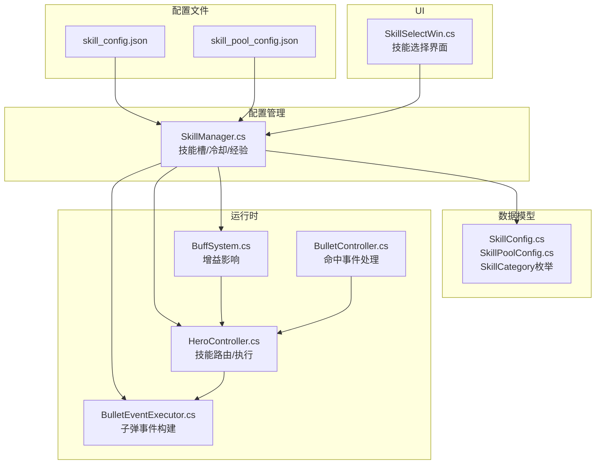
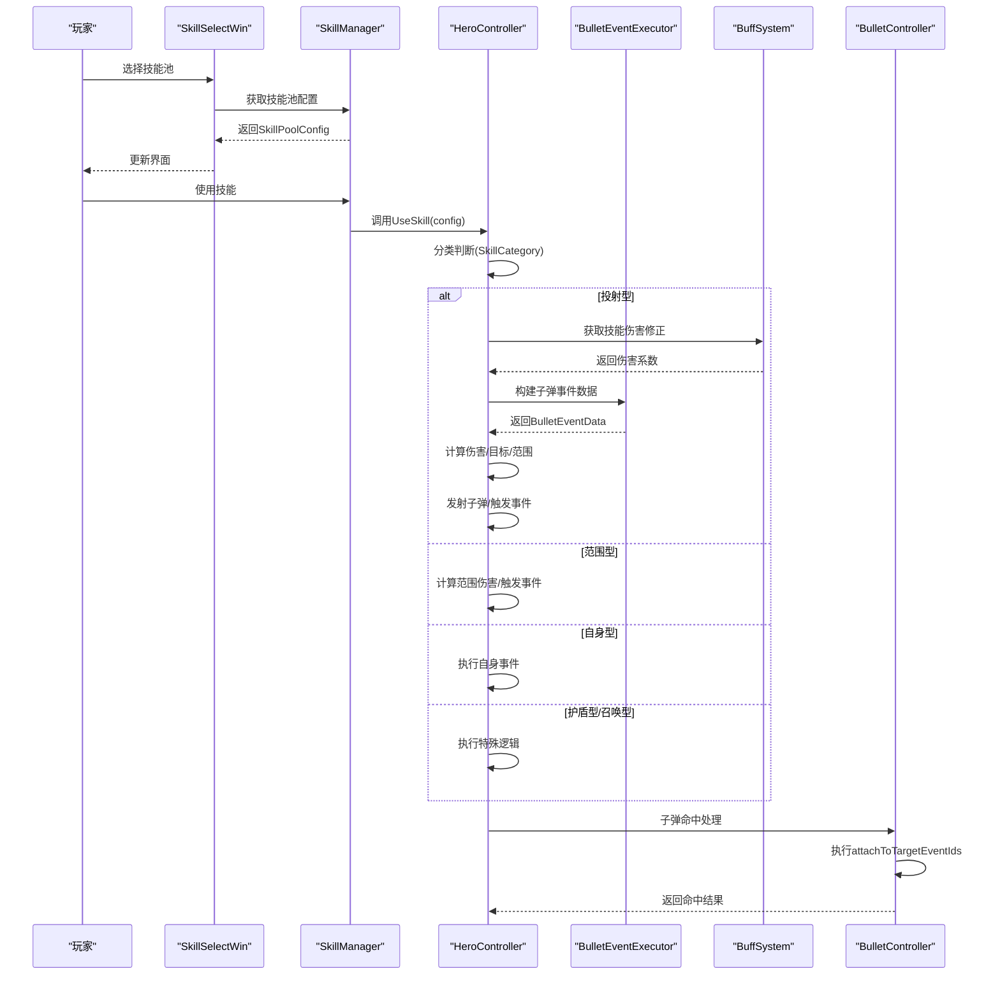
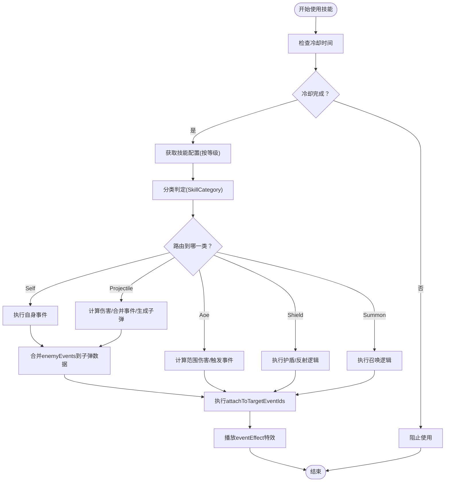
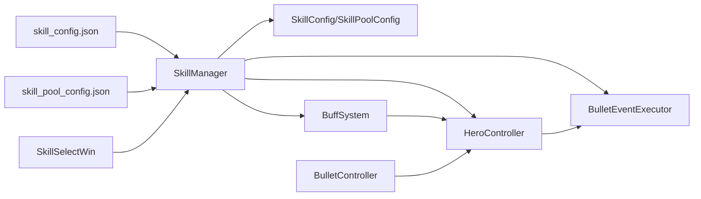

# 技能配置系统

<cite>
**本文引用的文件**
- [skill_config.json](file://Assets/Resources/Configs/skill_config.json)
- [skill_pool_config.json](file://Assets/Resources/Configs/skill_pool_config.json)
- [SkillConfig.cs](file://Assets/Scripts/Data/Configs/SkillConfig.cs)
- [SkillPoolConfig.cs](file://Assets/Scripts/Data/Configs/SkillPoolConfig.cs)
- [SkillManager.cs](file://Assets/Scripts/Battle/SkillManager.cs)
- [HeroController.cs](file://Assets/Scripts/Battle/HeroController.cs)
- [SkillSelectWin.cs](file://Assets/Scripts/UI/SkillSelectWin.cs)
- [BulletEventExecutor.cs](file://Assets/Scripts/Battle/BulletEventExecutor.cs)
- [BuffSystem.cs](file://Assets/Scripts/Battle/BuffSystem.cs)
- [BulletController.cs](file://Assets/Scripts/Battle/BulletController.cs)
- [GameTypes.cs](file://Assets/Scripts/Data/GameTypes.cs)
</cite>

## 更新摘要
**所做更改**
- 更新了技能配置文件结构说明，反映enemyEvents字段的调整
- 新增了技能触发机制一致性优化的相关内容
- 完善了技能效果参数配置的详细说明
- 增强了技能使用流程的分析和图示

## 目录
1. [简介](#简介)
2. [项目结构](#项目结构)
3. [核心组件](#核心组件)
4. [架构总览](#架构总览)
5. [详细组件分析](#详细组件分析)
6. [依赖关系分析](#依赖关系分析)
7. [性能考量](#性能考量)
8. [故障排查指南](#故障排查指南)
9. [结论](#结论)
10. [附录](#附录)

## 简介
本文件面向GeometryTD的技能配置系统，系统性梳理了技能配置文件skill_config.json与技能池配置skill_pool_config.json的结构、字段定义与设计意图，解释技能分类体系（Self、Projectile、Aoe、Shield、Summon）及其使用场景，阐明技能等级系统在配置中的体现与变化规律，详述技能效果参数的配置方式（直接伤害、范围伤害、治疗效果、控制技能等），并提供配置扩展指南与最佳实践建议。本次更新特别关注了技能配置文件中敌人事件引用的调整以及技能触发机制一致性的优化。

## 项目结构
技能配置系统由以下部分组成：
- 配置文件层：skill_config.json（技能配置）、skill_pool_config.json（技能池配置）
- 数据模型层：SkillConfig.cs中定义的SkillConfig、SkillPoolConfig.cs中的SkillPoolConfig及SkillCategory枚举
- 配置管理层：SkillManager.cs负责加载与索引配置
- 运行时逻辑层：HeroController.cs（技能路由与执行）、BulletEventExecutor.cs（子弹事件构建）、BuffSystem.cs（增益影响）
- UI层：SkillSelectWin.cs（技能选择界面）

**图表来源**
- [skill_config.json](file://Assets/Resources/Configs/skill_config.json)
- [skill_pool_config.json](file://Assets/Resources/Configs/skill_pool_config.json)
- [SkillConfig.cs](file://Assets/Scripts/Data/Configs/SkillConfig.cs)
- [SkillPoolConfig.cs](file://Assets/Scripts/Data/Configs/SkillPoolConfig.cs)
- [SkillManager.cs](file://Assets/Scripts/Battle/SkillManager.cs)
- [HeroController.cs](file://Assets/Scripts/Battle/HeroController.cs)
- [BulletEventExecutor.cs](file://Assets/Scripts/Battle/BulletEventExecutor.cs)
- [BuffSystem.cs](file://Assets/Scripts/Battle/BuffSystem.cs)
- [BulletController.cs](file://Assets/Scripts/Battle/BulletController.cs)
- [SkillSelectWin.cs](file://Assets/Scripts/UI/SkillSelectWin.cs)

**章节来源**
- [skill_config.json](file://Assets/Resources/Configs/skill_config.json)
- [skill_pool_config.json](file://Assets/Resources/Configs/skill_pool_config.json)
- [SkillConfig.cs](file://Assets/Scripts/Data/Configs/SkillConfig.cs)
- [SkillPoolConfig.cs](file://Assets/Scripts/Data/Configs/SkillPoolConfig.cs)
- [SkillManager.cs](file://Assets/Scripts/Battle/SkillManager.cs)

## 核心组件
- 技能配置（SkillConfig）
  - 字段：id、poolId、level、name、des、icon、category、dmg、dmgType、bulletSpeed、cd、bulletStyleId、attack_range、events、enemyEvents、bulletEvents、eventEffect
  - 作用：描述单个技能在不同等级下的具体属性与效果，包含敌人事件引用的完整配置
- 技能池配置（SkillPoolConfig）
  - 字段：id、name、des、upDes、levelDes、icon、dragHint
  - 作用：描述可选技能槽位的展示信息与提示文案
- 技能分类（SkillCategory）
  - 枚举：Self、Projectile、Aoe、Shield、Summon
  - 作用：决定技能的使用方式与执行路径
- 配置管理（SkillManager）
  - 技能槽位状态：skillPoolId、skillName、level、xp、cooldownRemaining、maxCooldown
  - 冷却更新、经验授予、技能使用判定
- 英雄控制器（HeroController）
  - 技能路由：根据SkillCategory分派到不同处理分支
  - 执行流程：计算伤害、合并事件、生成子弹、触发自身事件
- 子弹事件执行器（BulletEventExecutor）
  - 将子弹事件ID数组转换为BulletEventData，支持穿透、爆炸、追踪等效果
- 增益系统（BuffSystem）
  - 影响技能伤害系数与附加子弹事件，如反击盾弹的穿透、急冻冰锥的减速等
- 子弹控制器（BulletController）
  - 处理子弹命中后的事件执行，包括一次性特效和持续效果

**章节来源**
- [SkillConfig.cs](file://Assets/Scripts/Data/Configs/SkillConfig.cs)
- [SkillPoolConfig.cs](file://Assets/Scripts/Data/Configs/SkillPoolConfig.cs)
- [SkillManager.cs](file://Assets/Scripts/Battle/SkillManager.cs)
- [HeroController.cs](file://Assets/Scripts/Battle/HeroController.cs)
- [BulletEventExecutor.cs](file://Assets/Scripts/Battle/BulletEventExecutor.cs)
- [BuffSystem.cs](file://Assets/Scripts/Battle/BuffSystem.cs)
- [BulletController.cs](file://Assets/Scripts/Battle/BulletController.cs)

## 架构总览
技能配置系统采用"配置驱动 + 运行时解析"的架构：
- 配置文件以JSON形式存储技能与技能池信息
- SkillManager统一加载并建立查找索引
- 数据模型定义技能配置结构与枚举
- 运行时通过HeroController维护技能槽位状态，根据分类路由执行技能
- 子弹事件通过BulletEventExecutor构建，增益系统通过BuffSystem影响最终效果
- 子弹命中后通过BulletController处理事件执行

**图表来源**
- [SkillSelectWin.cs](file://Assets/Scripts/UI/SkillSelectWin.cs)
- [SkillManager.cs](file://Assets/Scripts/Battle/SkillManager.cs)
- [HeroController.cs](file://Assets/Scripts/Battle/HeroController.cs)
- [BulletEventExecutor.cs](file://Assets/Scripts/Battle/BulletEventExecutor.cs)
- [BuffSystem.cs](file://Assets/Scripts/Battle/BuffSystem.cs)
- [BulletController.cs](file://Assets/Scripts/Battle/BulletController.cs)

## 详细组件分析

### 技能配置文件 skill_config.json
- 文件定位：Assets/Resources/Configs/skill_config.json
- 结构概览：包含skills数组，每个元素为SkillConfig对象
- 关键字段说明
  - id：技能唯一标识，通常以前缀区分不同技能族（如1001、1002等）
  - poolId：技能池ID，关联技能池配置
  - level：技能等级，从0开始，0表示未解锁或基础形态
  - name：技能显示名称
  - icon：图标资源路径
  - category：技能分类字符串，需与SkillCategory枚举匹配
  - dmg：伤害基数（百分比基数为10000），用于按攻击力比例计算实际伤害
  - dmgType：伤害类型（与事件系统配合，如火焰、冰霜、雷电等）
  - bulletSpeed：子弹速度（>0视为投射型技能）
  - cd：冷却时间（秒）
  - bulletStyleId：子弹样式ID，关联bullet_config.json中的样式
  - attack_range：攻击范围（若为0则使用默认攻击范围）
  - events：自身事件ID数组（施法者触发的效果）
  - enemyEvents：敌方事件ID数组（命中目标时触发的效果）
  - bulletEvents：子弹事件ID数组（子弹生命周期内触发的效果）
  - eventEffect：一次性特效ID（子弹命中时播放）
- 等级系统体现
  - 同一技能id下存在多个level条目，形成等级链
  - 例如"烈焰圣弹"从100101到100110，等级越高，cd、伤害、事件效果越强
  - "反击盾弹"在同一id下有多个level，用于逐步解锁或强化
- 使用场景示例
  - 投射型：bulletSpeed > 0，dmg可为0（如某些控制型投射技能）
  - 范围型：dmg > 0，attack_range > 0
  - 自身型：dmg为0，events用于自身增益/治疗/减伤等
  - 护盾型：category为Shield，通常无伤害但有护盾/反射等效果
  - 召唤型：category为Summon，用于生成随从

**更新** 新增了enemyEvents字段的详细说明，该字段现在包含完整的敌人事件引用配置，支持更精细的技能效果控制。

**章节来源**
- [skill_config.json](file://Assets/Resources/Configs/skill_config.json)
- [SkillConfig.cs](file://Assets/Scripts/Data/Configs/SkillConfig.cs)

### 技能池配置文件 skill_pool_config.json
- 文件定位：Assets/Resources/Configs/skill_pool_config.json
- 结构概览：包含skill_pool_config数组，每个元素为SkillPoolConfig对象
- 关键字段说明
  - id：技能池ID，与game_config中的skill_slot_ids关联
  - name：技能池名称（用于UI展示）
  - des：描述文本
  - upDes：升级描述
  - levelDes：等级描述数组，按等级展示升级效果与特殊效果
  - icon：图标资源路径
  - dragHint：拖拽提示文案（用于交互提示）
- 设计要点
  - 技能池ID作为玩家可选的技能槽位，与SkillManager中的skill_slot_ids对应
  - levelDes用于动态展示技能升级效果，便于玩家理解

**章节来源**
- [skill_pool_config.json](file://Assets/Resources/Configs/skill_pool_config.json)
- [SkillPoolConfig.cs](file://Assets/Scripts/Data/Configs/SkillPoolConfig.cs)

### 技能分类系统
- 枚举定义：SkillCategory（Self、Projectile、Aoe、Shield、Summon）
- 分类判定逻辑（SkillManager.ClassifySkill）
  - 优先：从SkillConfig.category字符串解析为枚举
  - 回退：若bulletSpeed > 0，则为Projectile；若dmg > 0，则为Aoe；否则为Self
- 使用场景
  - Self：自身治疗、减伤、增益等
  - Projectile：投射弹道，可附带穿透、爆炸、追踪等子弹事件
  - Aoe：范围伤害，通常无弹道速度
  - Shield：护盾/反射类技能
  - Summon：召唤随从类技能

**章节来源**
- [SkillManager.cs](file://Assets/Scripts/Battle/SkillManager.cs)
- [GameTypes.cs](file://Assets/Scripts/Data/GameTypes.cs)

### 技能等级系统
- 配置层面
  - 同一技能id下按level升序排列，形成等级链
  - 通过events、enemyEvents、bulletEvents、dmg、cd等字段随等级变化
- 运行时层面
  - SkillManager维护每个技能槽位的level与xp
  - 当xp达到阈值时提升level，上限为10
  - 技能使用时根据当前等级选择对应的SkillConfig条目

**章节来源**
- [SkillManager.cs](file://Assets/Scripts/Battle/SkillManager.cs)
- [skill_config.json](file://Assets/Resources/Configs/skill_config.json)

### 技能效果参数配置
- 直接伤害
  - 通过dmg字段与攻击力计算：actualDmg = 攻击力 × dmg / 10000
  - 可叠加BuffSystem提供的伤害修正
- 范围伤害
  - 通过dmg > 0与attack_range > 0实现
  - 可结合爆炸、减速、易伤等enemyEvents
- 治疗效果
  - Self类技能通常dmg为0，通过events触发治疗事件
- 控制技能
  - 通过enemyEvents实现冻结、减速、眩晕等控制效果
- 子弹事件
  - bulletEvents通过BulletEventExecutor构建，支持穿透、爆炸、追踪等
  - 与BuffSystem联动，可附加额外子弹事件
- 一次性特效
  - eventEffect字段指定子弹命中时播放的特效
  - 支持穿透、爆炸、冻结、燃烧、减速等多种特效类型

**更新** 新增了一次性特效（eventEffect）的详细说明，该功能在子弹命中时播放特定视觉效果，增强了技能表现力。

**章节来源**
- [HeroController.cs](file://Assets/Scripts/Battle/HeroController.cs)
- [BulletEventExecutor.cs](file://Assets/Scripts/Battle/BulletEventExecutor.cs)
- [BuffSystem.cs](file://Assets/Scripts/Battle/BuffSystem.cs)
- [BulletController.cs](file://Assets/Scripts/Battle/BulletController.cs)

### 技能使用流程
- 技能槽位初始化：SkillManager根据game_config中的skill_slot_ids创建槽位
- 技能使用：SkillManager.TryUseSkill检查冷却与等级，成功后调用HeroController.UseSkill
- 分类执行：HeroController根据SkillCategory路由到对应处理函数
  - 投射型：计算伤害、合并事件、生成子弹、触发自身事件
  - 范围型：计算伤害、应用范围效果、触发自身事件
  - 自身型：仅触发自身事件
  - 护盾型/召唤型：执行相应特殊逻辑

**更新** 新增了技能触发机制一致性的流程图，展示了enemyEvents与bulletEvents的合并过程以及事件执行的标准化流程。

**图表来源**
- [SkillManager.cs](file://Assets/Scripts/Battle/SkillManager.cs)
- [HeroController.cs](file://Assets/Scripts/Battle/HeroController.cs)
- [BulletController.cs](file://Assets/Scripts/Battle/BulletController.cs)

## 依赖关系分析
- 配置文件依赖
  - skill_config.json与skill_pool_config.json分别被SkillManager加载
- 数据模型依赖
  - SkillConfig.cs与SkillPoolConfig.cs定义技能配置结构
- 运行时依赖
  - HeroController依赖BuffSystem获取伤害修正，依赖BulletEventExecutor构建子弹事件
  - BulletController依赖EventExecutor执行命中后的事件
  - SkillSelectWin依赖SkillManager与GameConfig进行技能选择UI

**图表来源**
- [skill_config.json](file://Assets/Resources/Configs/skill_config.json)
- [skill_pool_config.json](file://Assets/Resources/Configs/skill_pool_config.json)
- [SkillManager.cs](file://Assets/Scripts/Battle/SkillManager.cs)
- [SkillConfig.cs](file://Assets/Scripts/Data/Configs/SkillConfig.cs)
- [SkillPoolConfig.cs](file://Assets/Scripts/Data/Configs/SkillPoolConfig.cs)
- [HeroController.cs](file://Assets/Scripts/Battle/HeroController.cs)
- [BulletEventExecutor.cs](file://Assets/Scripts/Battle/BulletEventExecutor.cs)
- [BuffSystem.cs](file://Assets/Scripts/Battle/BuffSystem.cs)
- [BulletController.cs](file://Assets/Scripts/Battle/BulletController.cs)
- [SkillSelectWin.cs](file://Assets/Scripts/UI/SkillSelectWin.cs)

**章节来源**
- [SkillManager.cs](file://Assets/Scripts/Battle/SkillManager.cs)
- [SkillConfig.cs](file://Assets/Scripts/Data/Configs/SkillConfig.cs)
- [SkillPoolConfig.cs](file://Assets/Scripts/Data/Configs/SkillPoolConfig.cs)

## 性能考量
- 配置加载与索引
  - SkillManager在Awake阶段一次性加载并建立字典索引，避免运行时重复IO
- 技能分类判定
  - SkillManager.ClassifySkill优先使用配置字段，回退逻辑简单，常数时间复杂度
- 子弹事件构建
  - BulletEventExecutor按事件ID顺序构建，事件数量有限，构建成本低
- 事件执行优化
  - enemyEvents与bulletEvents的合并操作在技能使用前完成，减少运行时计算
  - 一次性特效的播放通过EventEffectManager统一管理，避免重复创建

**更新** 新增了事件执行优化的说明，强调了enemyEvents与bulletEvents合并操作的性能优势。

## 故障排查指南
- 技能未生效
  - 检查技能配置是否正确填写category与bulletSpeed/dmg字段，确保分类正确
  - 确认events/enemyEvents/bulletEvents的ID在对应配置中存在
  - 验证enemyEvents字段的引用是否正确指向目标事件ID
- 冷却异常
  - 检查cd字段是否为正数，确认SkillManager的冷却更新逻辑正常
- 等级不增长
  - 确认GrantXpToSlots调用与槽位索引有效，检查level上限为10
- UI显示异常
  - 检查SkillSelectWin中SkillPoolConfig的desList与icon路径是否正确
- 特效不播放
  - 确认eventEffect字段的ID在event_effect_config.json中有对应配置
  - 检查特效预制体路径是否正确

**更新** 新增了特效播放问题的排查指南，包括eventEffect字段和特效预制体的验证步骤。

**章节来源**
- [SkillManager.cs](file://Assets/Scripts/Battle/SkillManager.cs)
- [SkillSelectWin.cs](file://Assets/Scripts/UI/SkillSelectWin.cs)
- [BulletController.cs](file://Assets/Scripts/Battle/BulletController.cs)

## 结论
GeometryTD的技能配置系统通过清晰的配置文件结构、明确的技能分类与等级机制、以及完善的运行时解析与执行流程，实现了灵活而可扩展的技能系统。本次更新进一步优化了技能触发机制的一致性，完善了enemyEvents字段的配置说明，增强了技能效果参数的控制能力。开发者可通过skill_config.json与skill_pool_config.json快速扩展新技能、调整平衡性，并通过UI与运行时逻辑实现良好的玩家体验。

## 附录

### 配置扩展指南
- 添加新技能
  - 在skill_config.json中新增一条SkillConfig记录，设置id、poolId、level、name、category、dmg、dmgType、bulletSpeed、cd、bulletStyleId、attack_range、events、enemyEvents、bulletEvents、eventEffect等字段
  - 若为投射型，确保bulletSpeed > 0；若为范围型，确保dmg > 0
  - 若需要特殊效果，补充bulletEvents与enemyEvents的事件ID
  - 使用eventEffect字段添加一次性特效
- 修改现有技能属性
  - 在同一技能id下增加新的level条目，逐步提升cd、伤害、事件效果
  - 对于Self类技能，优先通过events实现效果而非直接提升dmg
  - 调整enemyEvents字段以增强控制效果
- 实现技能平衡性调整
  - 通过调整dmg、cd、attack_range、bulletEvents等字段实现平衡
  - 利用BuffSystem的伤害修正与额外子弹事件，实现间接平衡
  - 优化enemyEvents的组合以创造更丰富的战斗体验
- 最佳实践
  - 同一技能族保持id前缀一致，便于管理
  - 为每个技能提供完整的0级形态（未解锁/基础形态）
  - 使用desList在UI中直观展示升级效果
  - 控制事件数量，避免过长的事件链导致性能问题
  - 合理使用enemyEvents与bulletEvents的组合，确保技能效果的一致性
  - 为重要技能配置合适的eventEffect，提升视觉反馈质量

**更新** 新增了enemyEvents和eventEffect字段的最佳实践建议，强调了技能效果一致性的重要性。

**章节来源**
- [skill_config.json](file://Assets/Resources/Configs/skill_config.json)
- [skill_pool_config.json](file://Assets/Resources/Configs/skill_pool_config.json)
- [SkillConfig.cs](file://Assets/Scripts/Data/Configs/SkillConfig.cs)
- [HeroController.cs](file://Assets/Scripts/Battle/HeroController.cs)
- [BulletEventExecutor.cs](file://Assets/Scripts/Battle/BulletEventExecutor.cs)
- [BuffSystem.cs](file://Assets/Scripts/Battle/BuffSystem.cs)
- [BulletController.cs](file://Assets/Scripts/Battle/BulletController.cs)