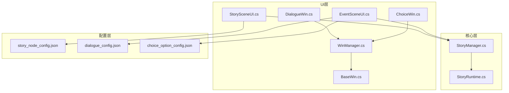
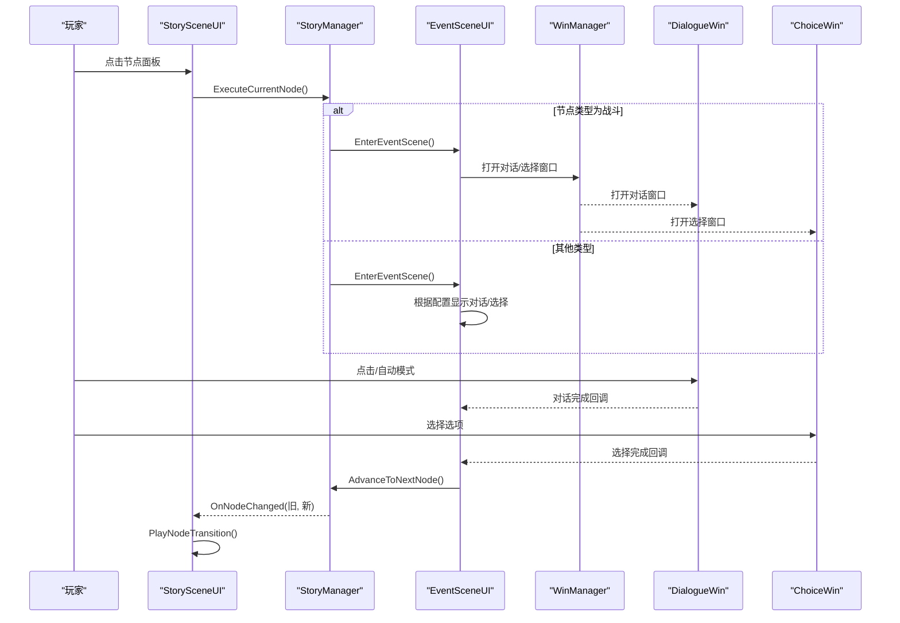
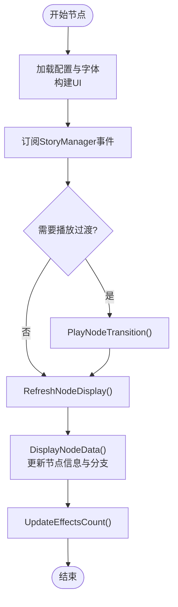
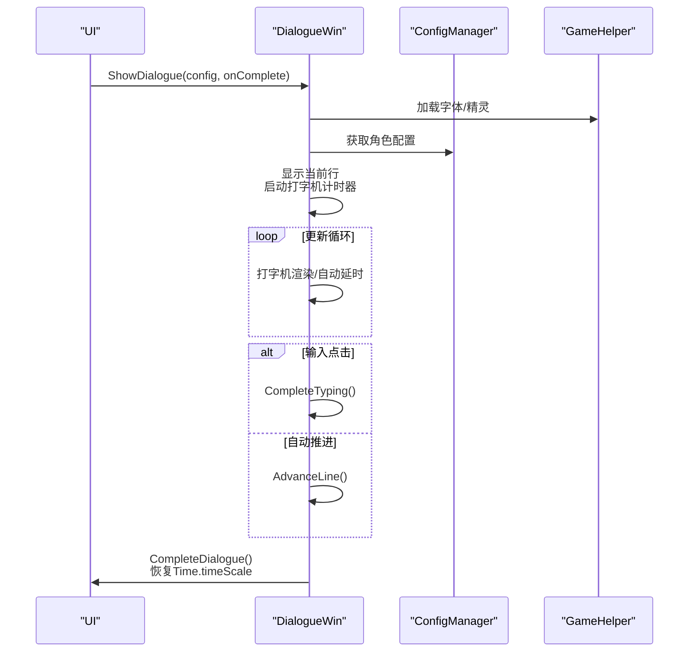
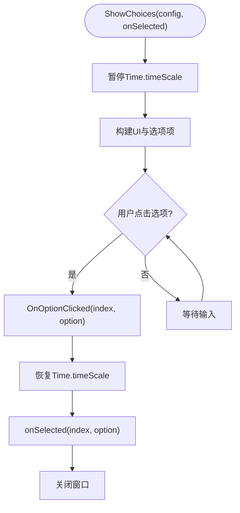
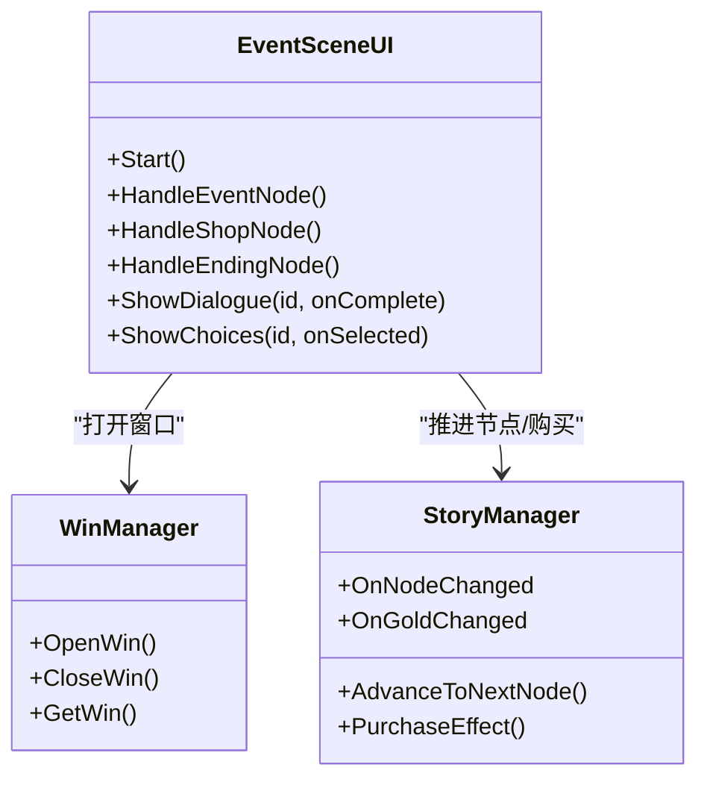
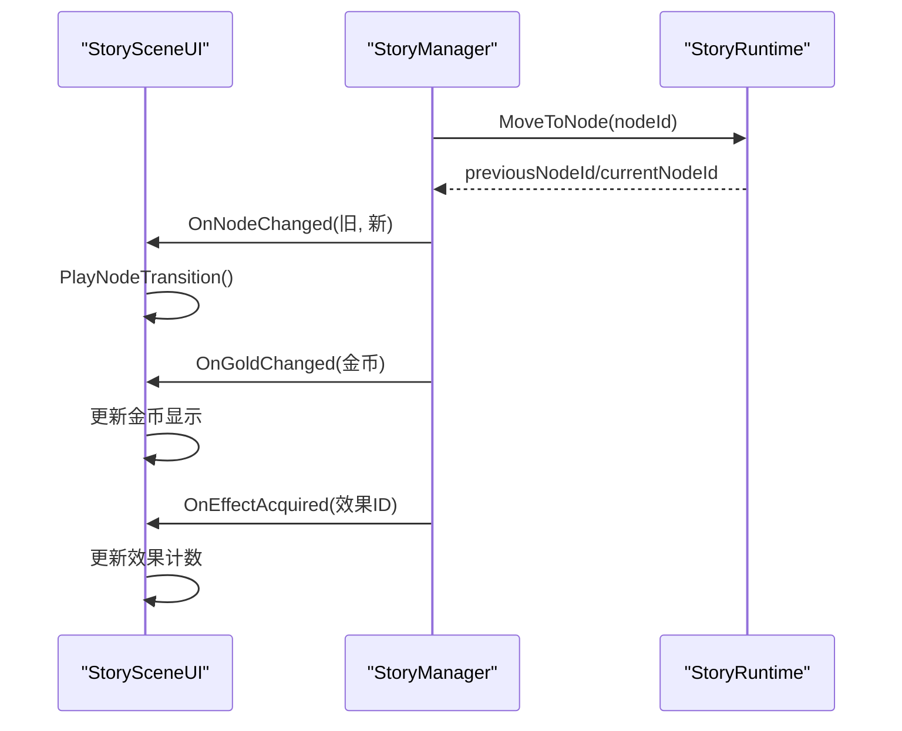
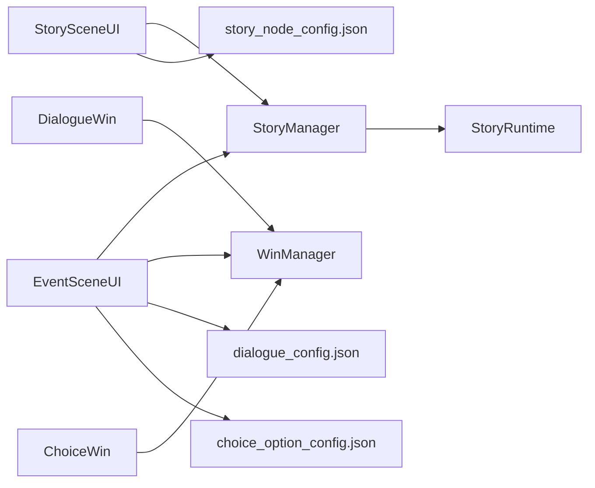

# 故事UI集成

<cite>
**本文引用的文件**
- [StorySceneUI.cs](file://Assets/Scripts/UI/StorySceneUI.cs)
- [DialogueWin.cs](file://Assets/Scripts/UI/DialogueWin.cs)
- [ChoiceWin.cs](file://Assets/Scripts/UI/ChoiceWin.cs)
- [EventSceneUI.cs](file://Assets/Scripts/UI/EventSceneUI.cs)
- [StoryManager.cs](file://Assets/Scripts/Core/StoryManager.cs)
- [BaseWin.cs](file://Assets/Scripts/UI/BaseWin.cs)
- [WinManager.cs](file://Assets/Scripts/UI/WinManager.cs)
- [StoryRuntime.cs](file://Assets/Scripts/Data/StoryRuntime.cs)
- [story_node_config.json](file://Assets/Resources/Configs/story_node_config.json)
- [dialogue_config.json](file://Assets/Resources/Configs/dialogue_config.json)
- [choice_option_config.json](file://Assets/Resources/Configs/choice_option_config.json)
</cite>

## 目录
1. [简介](#简介)
2. [项目结构](#项目结构)
3. [核心组件](#核心组件)
4. [架构总览](#架构总览)
5. [详细组件分析](#详细组件分析)
6. [依赖关系分析](#依赖关系分析)
7. [性能考量](#性能考量)
8. [故障排查指南](#故障排查指南)
9. [结论](#结论)
10. [附录](#附录)

## 简介
本文件面向GeometryTD的故事UI集成系统，围绕故事场景UI、对话窗口、选择窗口以及事件场景UI的架构与实现进行系统化技术说明。重点涵盖：
- StorySceneUI如何管理故事节点的显示与交互，包括分支连线绘制、节点切换动画与状态同步。
- DialogueWin的文本渲染、角色头像显示、自动播放与交互响应机制。
- ChoiceWin的选项布局、用户交互与选择状态管理。
- EventSceneUI对不同类型事件的统一展示与流程编排。
- UI组件与StoryManager之间的事件订阅、状态同步与数据绑定。
- UI动画与过渡效果的实现策略与最佳实践。

## 项目结构
故事UI相关代码主要位于Assets/Scripts/UI目录，配合核心StoryManager与运行时数据StoryRuntime共同工作。配置数据通过JSON资源提供节点、对话与选择项信息。

图表来源
- [StorySceneUI.cs:1-607](file://Assets/Scripts/UI/StorySceneUI.cs#L1-L607)
- [DialogueWin.cs:1-433](file://Assets/Scripts/UI/DialogueWin.cs#L1-L433)
- [ChoiceWin.cs:1-299](file://Assets/Scripts/UI/ChoiceWin.cs#L1-L299)
- [EventSceneUI.cs:1-647](file://Assets/Scripts/UI/EventSceneUI.cs#L1-L647)
- [StoryManager.cs:1-589](file://Assets/Scripts/Core/StoryManager.cs#L1-L589)
- [BaseWin.cs:1-32](file://Assets/Scripts/UI/BaseWin.cs#L1-L32)
- [WinManager.cs:1-195](file://Assets/Scripts/UI/WinManager.cs#L1-L195)
- [StoryRuntime.cs:1-288](file://Assets/Scripts/Data/StoryRuntime.cs#L1-L288)
- [story_node_config.json:1-305](file://Assets/Resources/Configs/story_node_config.json#L1-L305)
- [dialogue_config.json:1-146](file://Assets/Resources/Configs/dialogue_config.json#L1-L146)
- [choice_option_config.json:1-110](file://Assets/Resources/Configs/choice_option_config.json#L1-L110)

章节来源
- [StorySceneUI.cs:1-607](file://Assets/Scripts/UI/StorySceneUI.cs#L1-L607)
- [EventSceneUI.cs:1-647](file://Assets/Scripts/UI/EventSceneUI.cs#L1-L647)
- [StoryManager.cs:1-589](file://Assets/Scripts/Core/StoryManager.cs#L1-L589)
- [WinManager.cs:1-195](file://Assets/Scripts/UI/WinManager.cs#L1-L195)

## 核心组件
- StorySceneUI：故事场景主界面，负责节点信息展示、分支连线绘制、节点切换动画与状态栏更新。
- DialogueWin：对话窗口，实现逐字打印、自动模式、跳过、点击推进与头像高亮。
- ChoiceWin：选择窗口，动态生成选项列表，支持描述与奖励提示，暂停游戏时间并返回选择结果。
- EventSceneUI：事件场景UI，统一对话、选择、商店与结局的展示与流程控制。
- StoryManager：故事管理器，提供事件回调、节点推进、金币与效果管理、场景切换。
- WinManager：窗口管理器，统一窗口实例化、排序与遮罩。
- StoryRuntime：运行时状态，记录节点、选择、金币与效果等数据。

章节来源
- [StorySceneUI.cs:8-607](file://Assets/Scripts/UI/StorySceneUI.cs#L8-L607)
- [DialogueWin.cs:7-433](file://Assets/Scripts/UI/DialogueWin.cs#L7-L433)
- [ChoiceWin.cs:8-299](file://Assets/Scripts/UI/ChoiceWin.cs#L8-L299)
- [EventSceneUI.cs:7-647](file://Assets/Scripts/UI/EventSceneUI.cs#L7-L647)
- [StoryManager.cs:12-589](file://Assets/Scripts/Core/StoryManager.cs#L12-L589)
- [WinManager.cs:7-195](file://Assets/Scripts/UI/WinManager.cs#L7-L195)
- [StoryRuntime.cs:11-204](file://Assets/Scripts/Data/StoryRuntime.cs#L11-L204)

## 架构总览
UI层通过StoryManager提供的事件与数据接口实现状态驱动的界面更新；DialogueWin与ChoiceWin通过WinManager统一打开，并在交互时暂停/恢复Time.timeScale以确保沉浸式体验；EventSceneUI根据当前节点类型分派到对话或选择流程，或直接进入战斗/商店/结局场景。

图表来源
- [StorySceneUI.cs:225-243](file://Assets/Scripts/UI/StorySceneUI.cs#L225-L243)
- [StoryManager.cs:539-560](file://Assets/Scripts/Core/StoryManager.cs#L539-L560)
- [EventSceneUI.cs:72-114](file://Assets/Scripts/UI/EventSceneUI.cs#L72-L114)
- [WinManager.cs:61-102](file://Assets/Scripts/UI/WinManager.cs#L61-L102)
- [DialogueWin.cs:76-101](file://Assets/Scripts/UI/DialogueWin.cs#L76-L101)
- [ChoiceWin.cs:52-68](file://Assets/Scripts/UI/ChoiceWin.cs#L52-L68)

## 详细组件分析

### StorySceneUI：故事场景UI
- 负责节点信息展示（名称、类型、图标）、分支连线绘制与节点切换动画。
- 通过订阅StoryManager的OnNodeChanged、OnGoldChanged、OnEffectAcquired事件实现UI与运行时状态的解耦同步。
- 动画采用三阶段：淡出非目标分支、沿目标分支滑动、淡入新节点与分支，期间屏蔽交互。

图表来源
- [StorySceneUI.cs:39-66](file://Assets/Scripts/UI/StorySceneUI.cs#L39-L66)
- [StorySceneUI.cs:98-118](file://Assets/Scripts/UI/StorySceneUI.cs#L98-L118)
- [StorySceneUI.cs:120-150](file://Assets/Scripts/UI/StorySceneUI.cs#L120-L150)
- [StorySceneUI.cs:152-159](file://Assets/Scripts/UI/StorySceneUI.cs#L152-L159)
- [StorySceneUI.cs:253-383](file://Assets/Scripts/UI/StorySceneUI.cs#L253-L383)

章节来源
- [StorySceneUI.cs:8-607](file://Assets/Scripts/UI/StorySceneUI.cs#L8-L607)
- [StoryRuntime.cs:107-193](file://Assets/Scripts/Data/StoryRuntime.cs#L107-L193)

### DialogueWin：对话窗口
- 实现逐字打印效果，支持自动模式与跳过；暂停Time.timeScale并在窗口关闭时恢复。
- 根据角色配置加载头像，支持左右侧显示与高亮/暗化效果。
- 提供点击区域推进、下一段指示器与按钮控件。

图表来源
- [DialogueWin.cs:76-101](file://Assets/Scripts/UI/DialogueWin.cs#L76-L101)
- [DialogueWin.cs:103-128](file://Assets/Scripts/UI/DialogueWin.cs#L103-L128)
- [DialogueWin.cs:130-162](file://Assets/Scripts/UI/DialogueWin.cs#L130-L162)
- [DialogueWin.cs:164-193](file://Assets/Scripts/UI/DialogueWin.cs#L164-L193)
- [DialogueWin.cs:243-253](file://Assets/Scripts/UI/DialogueWin.cs#L243-L253)

章节来源
- [DialogueWin.cs:1-433](file://Assets/Scripts/UI/DialogueWin.cs#L1-L433)

### ChoiceWin：选择窗口
- 动态生成选项列表，支持标题、描述与奖励提示；暂停Time.timeScale并在选择后恢复。
- 通过回调返回(1-based索引, 选项配置)，外部关闭时返回(0, null)。

图表来源
- [ChoiceWin.cs:52-68](file://Assets/Scripts/UI/ChoiceWin.cs#L52-L68)
- [ChoiceWin.cs:70-86](file://Assets/Scripts/UI/ChoiceWin.cs#L70-L86)
- [ChoiceWin.cs:88-167](file://Assets/Scripts/UI/ChoiceWin.cs#L88-L167)
- [ChoiceWin.cs:189-201](file://Assets/Scripts/UI/ChoiceWin.cs#L189-L201)

章节来源
- [ChoiceWin.cs:1-299](file://Assets/Scripts/UI/ChoiceWin.cs#L1-L299)

### EventSceneUI：事件场景UI
- 根据当前节点类型分派到对话、选择、商店或结局流程。
- 对话与选择通过WinManager打开对应窗口；商店界面动态生成商品列表并支持购买。
- 结局界面支持CG展示与按钮操作（重试/返回）。

图表来源
- [EventSceneUI.cs:36-68](file://Assets/Scripts/UI/EventSceneUI.cs#L36-L68)
- [EventSceneUI.cs:72-114](file://Assets/Scripts/UI/EventSceneUI.cs#L72-L114)
- [EventSceneUI.cs:118-368](file://Assets/Scripts/UI/EventSceneUI.cs#L118-L368)
- [EventSceneUI.cs:372-494](file://Assets/Scripts/UI/EventSceneUI.cs#L372-L494)
- [WinManager.cs:61-102](file://Assets/Scripts/UI/WinManager.cs#L61-L102)
- [StoryManager.cs:539-560](file://Assets/Scripts/Core/StoryManager.cs#L539-L560)

章节来源
- [EventSceneUI.cs:1-647](file://Assets/Scripts/UI/EventSceneUI.cs#L1-L647)

### UI与StoryManager通信机制
- StorySceneUI订阅OnNodeChanged、OnGoldChanged、OnEffectAcquired事件，实现UI与运行时状态的解耦。
- EventSceneUI在对话/选择完成后调用StoryManager.AdvanceToNextNode()推进节点。
- ChoiceWin在选择后调用StoryManager.ProcessChoice()记录选择并发放奖励。
- StoryManager在节点移动时设置ShouldPlayTransition标志，StorySceneUI据此播放过渡动画。

图表来源
- [StorySceneUI.cs:50-94](file://Assets/Scripts/UI/StorySceneUI.cs#L50-L94)
- [StoryManager.cs:244-253](file://Assets/Scripts/Core/StoryManager.cs#L244-L253)
- [StoryManager.cs:564-568](file://Assets/Scripts/Core/StoryManager.cs#L564-L568)
- [StoryManager.cs:565-568](file://Assets/Scripts/Core/StoryManager.cs#L565-L568)

章节来源
- [StorySceneUI.cs:1-607](file://Assets/Scripts/UI/StorySceneUI.cs#L1-L607)
- [StoryManager.cs:1-589](file://Assets/Scripts/Core/StoryManager.cs#L1-L589)

### UI动画与过渡效果
- StorySceneUI的节点切换采用三段式动画：淡出非目标分支、沿目标分支滑动、淡入新节点与分支，期间CanvasGroup屏蔽交互。
- DialogueWin与ChoiceWin通过暂停Time.timeScale营造沉浸体验，窗口关闭时恢复。
- EventSceneUI在商店界面动态生成商品项并更新按钮可用性。

章节来源
- [StorySceneUI.cs:253-383](file://Assets/Scripts/UI/StorySceneUI.cs#L253-L383)
- [DialogueWin.cs:90-93](file://Assets/Scripts/UI/DialogueWin.cs#L90-L93)
- [ChoiceWin.cs:63-66](file://Assets/Scripts/UI/ChoiceWin.cs#L63-L66)
- [EventSceneUI.cs:348-359](file://Assets/Scripts/UI/EventSceneUI.cs#L348-L359)

## 依赖关系分析
- StorySceneUI依赖StoryManager获取当前节点与集合信息，并订阅其事件。
- EventSceneUI依赖StoryManager推进节点与购买效果，依赖WinManager打开对话/选择窗口。
- DialogueWin与ChoiceWin通过WinManager统一管理，共享Canvas与排序。
- StoryRuntime提供运行时状态，StoryManager封装业务逻辑并暴露事件。

图表来源
- [StoryManager.cs:28-52](file://Assets/Scripts/Core/StoryManager.cs#L28-L52)
- [StorySceneUI.cs:40-52](file://Assets/Scripts/UI/StorySceneUI.cs#L40-L52)
- [EventSceneUI.cs:44-67](file://Assets/Scripts/UI/EventSceneUI.cs#L44-L67)
- [WinManager.cs:61-102](file://Assets/Scripts/UI/WinManager.cs#L61-L102)
- [story_node_config.json:1-305](file://Assets/Resources/Configs/story_node_config.json#L1-L305)
- [dialogue_config.json:1-146](file://Assets/Resources/Configs/dialogue_config.json#L1-L146)
- [choice_option_config.json:1-110](file://Assets/Resources/Configs/choice_option_config.json#L1-L110)

章节来源
- [StoryManager.cs:1-589](file://Assets/Scripts/Core/StoryManager.cs#L1-L589)
- [StorySceneUI.cs:1-607](file://Assets/Scripts/UI/StorySceneUI.cs#L1-L607)
- [EventSceneUI.cs:1-647](file://Assets/Scripts/UI/EventSceneUI.cs#L1-L647)
- [WinManager.cs:1-195](file://Assets/Scripts/UI/WinManager.cs#L1-L195)

## 性能考量
- UI构建采用延迟初始化与缓存字体/精灵，减少运行时开销。
- 对话窗口与选择窗口暂停Time.timeScale仅在交互期间生效，避免全局时间冻结。
- 分支连线绘制在节点变更时重建，避免频繁更新。
- 建议：将大量动态UI元素放入滚动区域，使用ContentSizeFitter与LayoutGroup减少布局计算；对头像与CG使用异步加载与缓存池。

## 故障排查指南
- 节点切换无动画：确认StoryManager.ShouldPlayTransition标志正确设置与清零，StorySceneUI在Start中检测并播放过渡。
- 对话窗口无法关闭：检查DialogueWin.OnClose中是否恢复Time.timeScale并调用WinManager.CloseWin。
- 选择窗口无响应：确认ChoiceWin是否正确暂停Time.timeScale并在选择后恢复。
- 商店购买无效：检查StoryManager.PurchaseEffect返回值与金币余额，刷新按钮可用性。

章节来源
- [StorySceneUI.cs:78-94](file://Assets/Scripts/UI/StorySceneUI.cs#L78-L94)
- [DialogueWin.cs:57-71](file://Assets/Scripts/UI/DialogueWin.cs#L57-L71)
- [ChoiceWin.cs:33-46](file://Assets/Scripts/UI/ChoiceWin.cs#L33-L46)
- [EventSceneUI.cs:314-327](file://Assets/Scripts/UI/EventSceneUI.cs#L314-L327)

## 结论
该故事UI集成系统通过清晰的职责划分与事件驱动机制，实现了节点展示、对话与选择交互、商店与结局的统一呈现。StorySceneUI负责场景级动画与状态同步，DialogueWin与ChoiceWin提供沉浸式交互体验，EventSceneUI协调不同事件类型的流程编排。结合StoryManager的事件与数据接口，系统具备良好的扩展性与维护性。

## 附录

### 最佳实践指南
- 组件解耦：UI组件仅订阅StoryManager事件，不直接访问其他模块。
- 事件处理：在UI组件销毁时注销事件订阅，避免内存泄漏。
- 性能优化：使用缓存字体与精灵、延迟构建UI、合理使用布局组件。
- 动画一致性：统一使用CanvasGroup控制交互屏蔽与透明度，保证过渡流畅。

### UI定制与扩展示例
- 自定义节点图标：在StoryNodeConfig中设置icon字段，StorySceneUI会优先加载图标，否则使用类型颜色。
- 扩展事件类型：在EventSceneUI中新增类型分支，调用相应窗口或流程。
- 定制对话样式：在DialogueWin中调整字体大小、颜色与头像尺寸，或替换UI构建逻辑。
- 自定义商店商品：在EventShopConfig中配置商品池与权重，EventSceneUI按refreshCount随机选择并生成UI。

章节来源
- [StorySceneUI.cs:120-150](file://Assets/Scripts/UI/StorySceneUI.cs#L120-L150)
- [EventSceneUI.cs:118-368](file://Assets/Scripts/UI/EventSceneUI.cs#L118-L368)
- [DialogueWin.cs:266-345](file://Assets/Scripts/UI/DialogueWin.cs#L266-L345)
- [story_node_config.json:1-305](file://Assets/Resources/Configs/story_node_config.json#L1-L305)
- [dialogue_config.json:1-146](file://Assets/Resources/Configs/dialogue_config.json#L1-L146)
- [choice_option_config.json:1-110](file://Assets/Resources/Configs/choice_option_config.json#L1-L110)