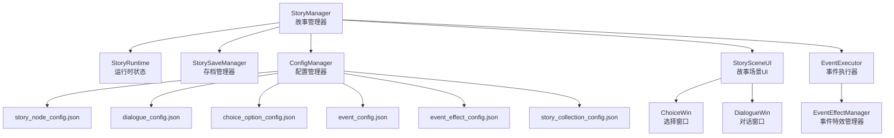
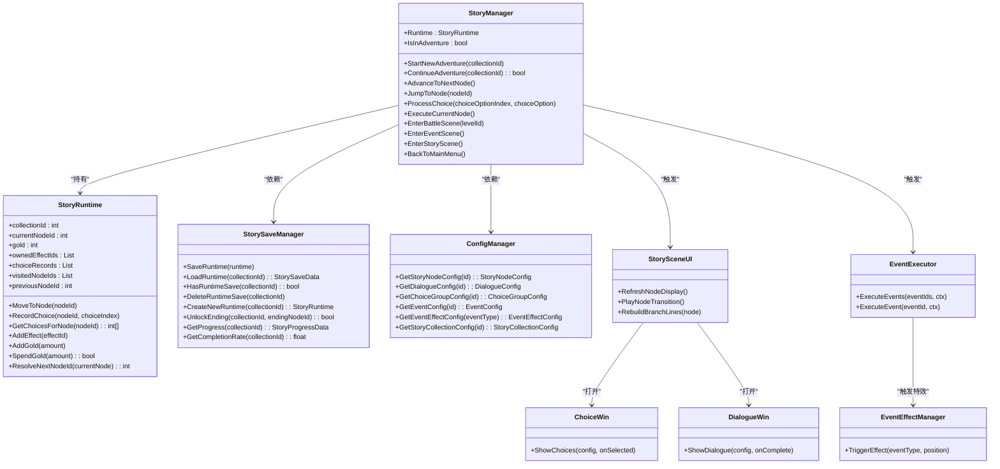
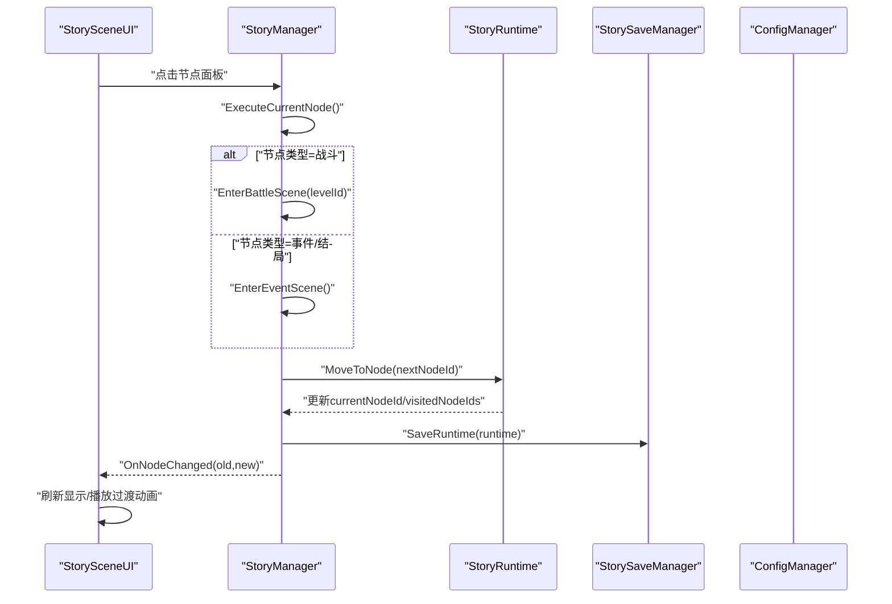
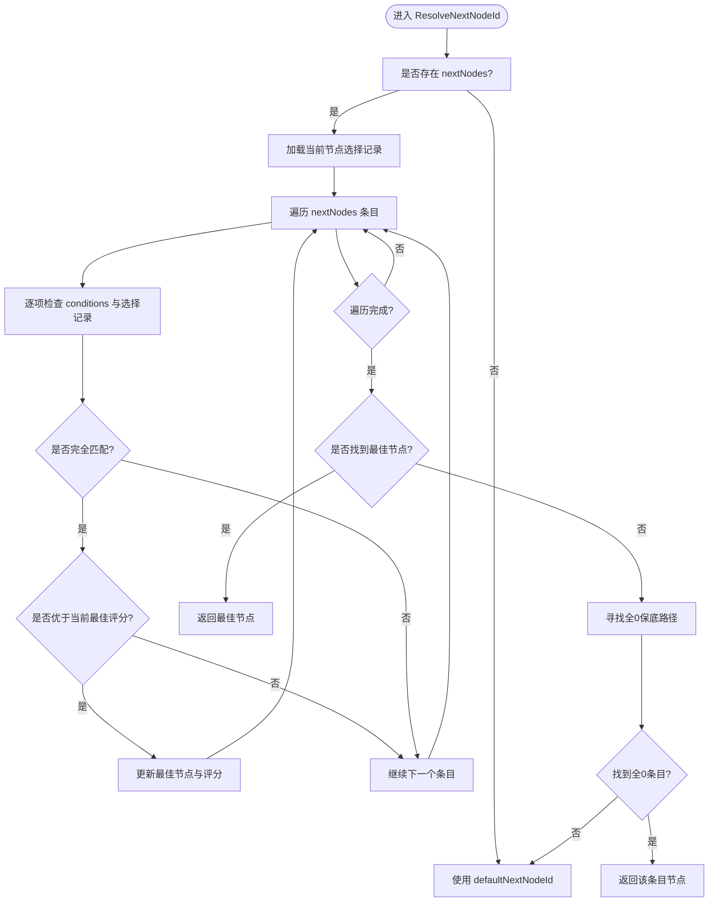
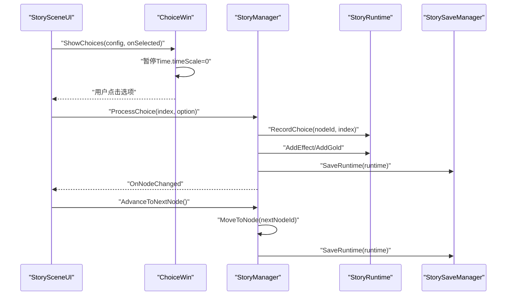
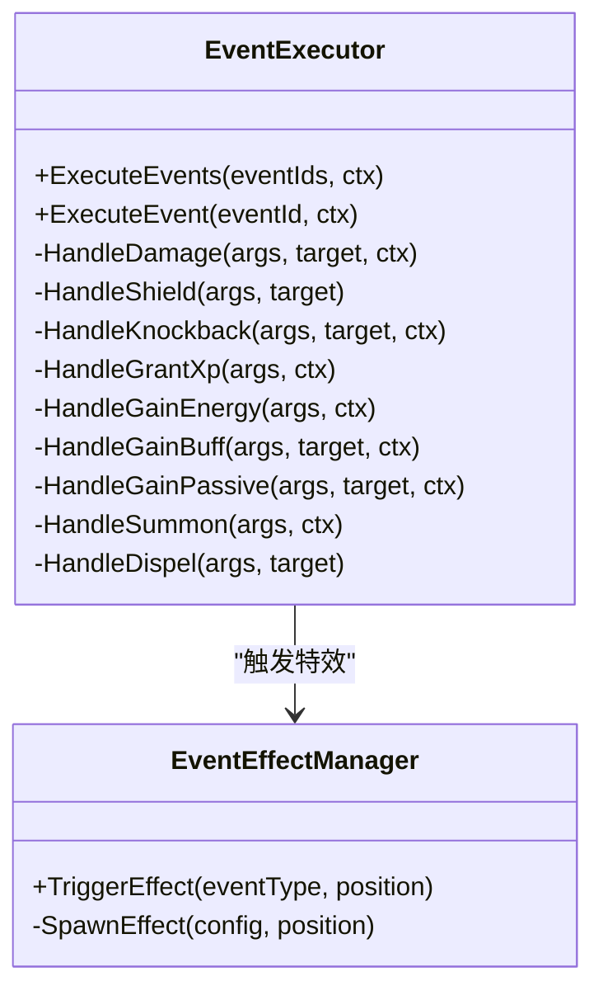
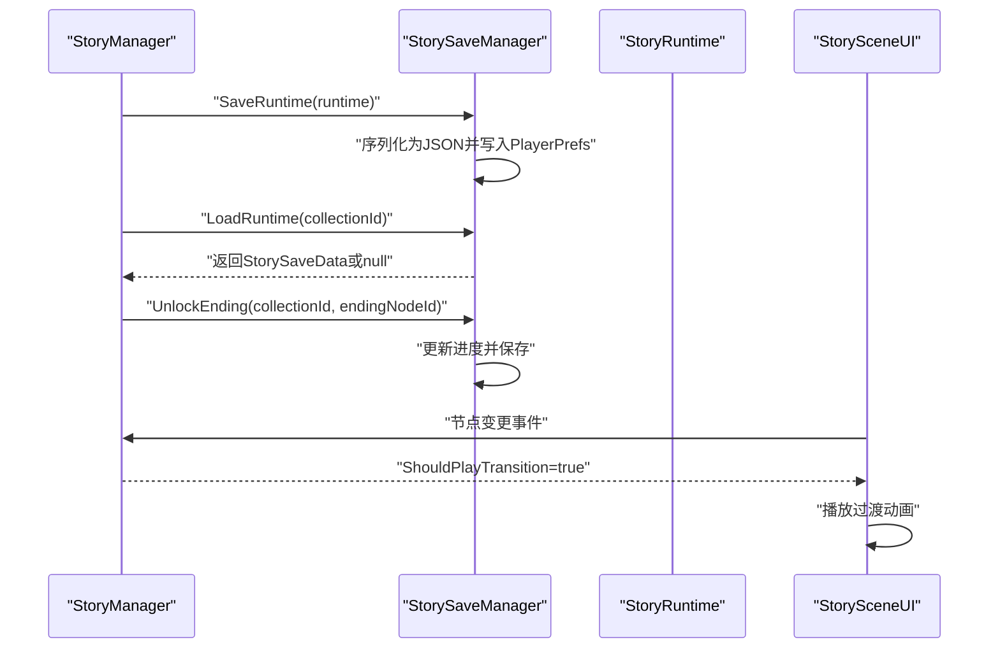
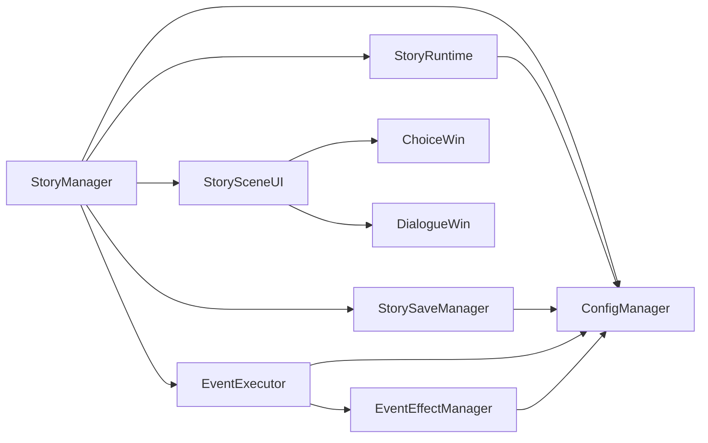

# 故事剧情系统

<cite>
**本文档引用的文件**
- [StoryManager.cs](file://Assets/Scripts/Core/StoryManager.cs)
- [StoryRuntime.cs](file://Assets/Scripts/Data/StoryRuntime.cs)
- [StorySaveManager.cs](file://Assets/Scripts/Core/StorySaveManager.cs)
- [ConfigManager.cs](file://Assets/Scripts/Core/ConfigManager.cs)
- [StorySceneUI.cs](file://Assets/Scripts/UI/StorySceneUI.cs)
- [ChoiceWin.cs](file://Assets/Scripts/UI/ChoiceWin.cs)
- [DialogueWin.cs](file://Assets/Scripts/UI/DialogueWin.cs)
- [EventExecutor.cs](file://Assets/Scripts/Battle/EventExecutor.cs)
- [EventEffectManager.cs](file://Assets/Scripts/Battle/EventEffectManager.cs)
- [story_node_config.json](file://Assets/Resources/Configs/story_node_config.json)
- [dialogue_config.json](file://Assets/Resources/Configs/dialogue_config.json)
- [choice_option_config.json](file://Assets/Resources/Configs/choice_option_config.json)
- [event_config.json](file://Assets/Resources/Configs/event_config.json)
- [event_effect_config.json](file://Assets/Resources/Configs/event_effect_config.json)
- [story_collection_config.json](file://Assets/Resources/Configs/story_collection_config.json)
</cite>

## 目录
1. [简介](#简介)
2. [项目结构](#项目结构)
3. [核心组件](#核心组件)
4. [架构总览](#架构总览)
5. [详细组件分析](#详细组件分析)
6. [依赖关系分析](#依赖关系分析)
7. [性能考量](#性能考量)
8. [故障排查指南](#故障排查指南)
9. [结论](#结论)
10. [附录](#附录)

## 简介
本技术文档面向GeometryTD的故事剧情系统，围绕故事管理器、故事运行时、分支剧情、事件执行与效果、存档读档、UI交互以及扩展性设计进行深入解析。文档旨在帮助开发者快速理解系统架构、掌握实现机制，并提供创作与扩展指导。

## 项目结构
故事剧情系统主要分布在以下模块：
- 核心管理：StoryManager（故事集生命周期与节点推进）、StorySaveManager（存档/进度持久化）
- 数据模型：StoryRuntime（运行时状态）、StoryProgressData（永久进度）
- 配置系统：ConfigManager（统一加载story_node_config.json、dialogue_config.json、choice_option_config.json、event_config.json、event_effect_config.json、story_collection_config.json等）
- UI层：StorySceneUI（故事场景界面）、ChoiceWin（选择窗口）、DialogueWin（对话窗口）
- 战斗事件：EventExecutor（事件执行器）、EventEffectManager（事件特效管理器）

图表来源
- [StoryManager.cs:1-589](file://Assets/Scripts/Core/StoryManager.cs#L1-L589)
- [StoryRuntime.cs:1-288](file://Assets/Scripts/Data/StoryRuntime.cs#L1-L288)
- [StorySaveManager.cs:1-179](file://Assets/Scripts/Core/StorySaveManager.cs#L1-L179)
- [ConfigManager.cs:1-619](file://Assets/Scripts/Core/ConfigManager.cs#L1-L619)
- [StorySceneUI.cs:1-607](file://Assets/Scripts/UI/StorySceneUI.cs#L1-L607)
- [ChoiceWin.cs:1-299](file://Assets/Scripts/UI/ChoiceWin.cs#L1-L299)
- [DialogueWin.cs:1-433](file://Assets/Scripts/UI/DialogueWin.cs#L1-L433)
- [EventExecutor.cs:1-197](file://Assets/Scripts/Battle/EventExecutor.cs#L1-L197)
- [EventEffectManager.cs:1-33](file://Assets/Scripts/Battle/EventEffectManager.cs#L1-L33)
- [story_node_config.json:1-305](file://Assets/Resources/Configs/story_node_config.json#L1-L305)
- [dialogue_config.json:1-146](file://Assets/Resources/Configs/dialogue_config.json#L1-L146)
- [choice_option_config.json:1-110](file://Assets/Resources/Configs/choice_option_config.json#L1-L110)
- [event_config.json:1-116](file://Assets/Resources/Configs/event_config.json#L1-L116)
- [event_effect_config.json:1-19](file://Assets/Resources/Configs/event_effect_config.json#L1-L19)
- [story_collection_config.json:1-21](file://Assets/Resources/Configs/story_collection_config.json#L1-L21)

章节来源
- [StoryManager.cs:1-589](file://Assets/Scripts/Core/StoryManager.cs#L1-L589)
- [StoryRuntime.cs:1-288](file://Assets/Scripts/Data/StoryRuntime.cs#L1-L288)
- [StorySaveManager.cs:1-179](file://Assets/Scripts/Core/StorySaveManager.cs#L1-L179)
- [ConfigManager.cs:1-619](file://Assets/Scripts/Core/ConfigManager.cs#L1-L619)
- [StorySceneUI.cs:1-607](file://Assets/Scripts/UI/StorySceneUI.cs#L1-L607)
- [ChoiceWin.cs:1-299](file://Assets/Scripts/UI/ChoiceWin.cs#L1-L299)
- [DialogueWin.cs:1-433](file://Assets/Scripts/UI/DialogueWin.cs#L1-L433)
- [EventExecutor.cs:1-197](file://Assets/Scripts/Battle/EventExecutor.cs#L1-L197)
- [EventEffectManager.cs:1-33](file://Assets/Scripts/Battle/EventEffectManager.cs#L1-L33)
- [story_node_config.json:1-305](file://Assets/Resources/Configs/story_node_config.json#L1-L305)
- [dialogue_config.json:1-146](file://Assets/Resources/Configs/dialogue_config.json#L1-L146)
- [choice_option_config.json:1-110](file://Assets/Resources/Configs/choice_option_config.json#L1-L110)
- [event_config.json:1-116](file://Assets/Resources/Configs/event_config.json#L1-L116)
- [event_effect_config.json:1-19](file://Assets/Resources/Configs/event_effect_config.json#L1-L19)
- [story_collection_config.json:1-21](file://Assets/Resources/Configs/story_collection_config.json#L1-L21)

## 核心组件
- StoryManager：单例，负责故事集生命周期（开始/继续/推进/结束）、节点切换、选择处理、金币与藏品系统、Boss事件推进、场景切换等。
- StoryRuntime：运行时状态容器，包含当前故事集ID、当前节点ID、金币、已拥有藏品、选择记录、访问历史、上一节点ID等；提供ResolveNextNodeId决策逻辑。
- StorySaveManager：基于PlayerPrefs+JSON的存档方案，支持运行时中途存档、永久进度存档、完成度统计。
- ConfigManager：集中加载与索引各类配置（故事节点、对话、选项、事件、特效等），提供快速查询接口。
- UI层：StorySceneUI负责节点展示与分支连线、过渡动画；ChoiceWin负责选项选择；DialogueWin负责对话展示。
- 战斗事件：EventExecutor根据事件类型执行具体效果；EventEffectManager触发视觉特效。

章节来源
- [StoryManager.cs:1-589](file://Assets/Scripts/Core/StoryManager.cs#L1-L589)
- [StoryRuntime.cs:1-288](file://Assets/Scripts/Data/StoryRuntime.cs#L1-L288)
- [StorySaveManager.cs:1-179](file://Assets/Scripts/Core/StorySaveManager.cs#L1-L179)
- [ConfigManager.cs:1-619](file://Assets/Scripts/Core/ConfigManager.cs#L1-L619)
- [StorySceneUI.cs:1-607](file://Assets/Scripts/UI/StorySceneUI.cs#L1-L607)
- [ChoiceWin.cs:1-299](file://Assets/Scripts/UI/ChoiceWin.cs#L1-L299)
- [DialogueWin.cs:1-433](file://Assets/Scripts/UI/DialogueWin.cs#L1-L433)
- [EventExecutor.cs:1-197](file://Assets/Scripts/Battle/EventExecutor.cs#L1-L197)
- [EventEffectManager.cs:1-33](file://Assets/Scripts/Battle/EventEffectManager.cs#L1-L33)

## 架构总览
故事系统采用“配置驱动 + 运行时状态 + UI事件”的分层架构：
- 配置层：story_node_config.json定义节点类型、分支条件、默认下一节点、失败节点、结局类型等；dialogue_config.json定义对话文本；choice_option_config.json定义选项组；event_config.json定义事件效果；event_effect_config.json定义特效映射；story_collection_config.json定义故事集合起始与结局节点。
- 运行时层：StoryRuntime承载当前进度、选择记录、金币与藏品；StorySaveManager负责存档与进度持久化。
- 控制层：StoryManager协调节点推进、选择处理、场景切换、事件触发与Boss事件序列。
- 表现层：StorySceneUI渲染节点与分支；ChoiceWin/DialougeWin负责交互与暂停逻辑。

图表来源
- [StoryManager.cs:1-589](file://Assets/Scripts/Core/StoryManager.cs#L1-L589)
- [StoryRuntime.cs:1-288](file://Assets/Scripts/Data/StoryRuntime.cs#L1-L288)
- [StorySaveManager.cs:1-179](file://Assets/Scripts/Core/StorySaveManager.cs#L1-L179)
- [ConfigManager.cs:1-619](file://Assets/Scripts/Core/ConfigManager.cs#L1-L619)
- [StorySceneUI.cs:1-607](file://Assets/Scripts/UI/StorySceneUI.cs#L1-L607)
- [ChoiceWin.cs:1-299](file://Assets/Scripts/UI/ChoiceWin.cs#L1-L299)
- [DialogueWin.cs:1-433](file://Assets/Scripts/UI/DialogueWin.cs#L1-L433)
- [EventExecutor.cs:1-197](file://Assets/Scripts/Battle/EventExecutor.cs#L1-L197)
- [EventEffectManager.cs:1-33](file://Assets/Scripts/Battle/EventEffectManager.cs#L1-L33)

## 详细组件分析

### 故事管理器（StoryManager）
- 生命周期管理：StartNewAdventure/ContinueAdventure/EndAdventure/AbandonAdventure，配合StorySaveManager进行存档与进度清理。
- 节点推进：AdvanceToNextNode通过Runtime.ResolveNextNodeId解析下一节点；JumpToNode用于事件触发战斗时的强制跳转；HandleBattleFailed/RetryFromFailure处理失败节点与重试。
- 选择处理：ProcessChoice记录选择、发放藏品与金币，并自动保存。
- Boss事件：GetCurrentBossEvent按序返回Boss死亡后的对话与选项，ResetBossEventIndex在新战斗节点时重置索引。
- 场景切换：根据节点类型进入战斗/事件/故事场景；BackToMainMenu支持中途退出并保留存档。
- 藏品与金币：提供金币加成、商店购买、效果查询与应用到战斗属性等。

图表来源
- [StoryManager.cs:539-560](file://Assets/Scripts/Core/StoryManager.cs#L539-L560)
- [StoryManager.cs:244-253](file://Assets/Scripts/Core/StoryManager.cs#L244-L253)
- [StoryRuntime.cs:107-114](file://Assets/Scripts/Data/StoryRuntime.cs#L107-L114)
- [StorySaveManager.cs:33-48](file://Assets/Scripts/Core/StorySaveManager.cs#L33-L48)
- [StorySceneUI.cs:225-243](file://Assets/Scripts/UI/StorySceneUI.cs#L225-L243)

章节来源
- [StoryManager.cs:96-164](file://Assets/Scripts/Core/StoryManager.cs#L96-L164)
- [StoryManager.cs:171-194](file://Assets/Scripts/Core/StoryManager.cs#L171-L194)
- [StoryManager.cs:196-242](file://Assets/Scripts/Core/StoryManager.cs#L196-L242)
- [StoryManager.cs:275-297](file://Assets/Scripts/Core/StoryManager.cs#L275-L297)
- [StoryManager.cs:306-326](file://Assets/Scripts/Core/StoryManager.cs#L306-L326)
- [StoryManager.cs:539-560](file://Assets/Scripts/Core/StoryManager.cs#L539-L560)

### 故事运行时（StoryRuntime）
- 关键字段：collectionId/currentNodeId/gold/ownedEffectIds/choiceRecords/visitedNodeIds/previousNodeId。
- 选择记录：RecordChoice/GetChoicesForNode维护每节点的选项组选择序列。
- 藏品系统：AddEffect根据stackable/maxStack控制叠加与上限。
- 金币系统：AddGold/SpendGold提供增减与余额校验。
- 节点推进决策：ResolveNextNodeId遍历nextNodes，按条件匹配选择记录，优先精确匹配，其次全0保底路径，最后回退defaultNextNodeId。

图表来源
- [StoryRuntime.cs:120-193](file://Assets/Scripts/Data/StoryRuntime.cs#L120-L193)

章节来源
- [StoryRuntime.cs:40-114](file://Assets/Scripts/Data/StoryRuntime.cs#L40-L114)
- [StoryRuntime.cs:120-193](file://Assets/Scripts/Data/StoryRuntime.cs#L120-L193)

### 故事节点系统与配置
- story_node_config.json：定义节点类型（战斗/事件/商店/结局）、关卡ID、Boss事件序列、对话与选项组、默认下一节点、失败节点、分支线数量、nextNodes条件与目标节点。
- dialogue_config.json：定义各节点的对话序列，支持角色头像与侧边显示。
- choice_option_config.json：定义选项组标题与选项（文本、描述、效果ID、金币奖励、是否触发战斗）。
- event_config.json：定义事件类型与参数（伤害、治疗、护盾、经验、能量、Buff、被动、召唤、驱散等）。
- event_effect_config.json：定义事件类型到特效预制体的映射。
- story_collection_config.json：定义故事集合的起始节点与结局节点集合。

章节来源
- [story_node_config.json:1-305](file://Assets/Resources/Configs/story_node_config.json#L1-L305)
- [dialogue_config.json:1-146](file://Assets/Resources/Configs/dialogue_config.json#L1-L146)
- [choice_option_config.json:1-110](file://Assets/Resources/Configs/choice_option_config.json#L1-L110)
- [event_config.json:1-116](file://Assets/Resources/Configs/event_config.json#L1-L116)
- [event_effect_config.json:1-19](file://Assets/Resources/Configs/event_effect_config.json#L1-L19)
- [story_collection_config.json:1-21](file://Assets/Resources/Configs/story_collection_config.json#L1-L21)

### 多分支故事线与选择窗口
- 分支逻辑：StorySceneUI根据节点的branchLineCount或nextNodes数量动态生成分支连线，颜色渐变体现不同分支。
- 选择窗口：ChoiceWin接收ChoiceGroupConfig，构建选项列表，显示奖励提示，暂停游戏时间，回调返回选中索引与选项。
- 事件执行：当选项触发战斗时，StoryManager进入战斗场景；否则推进节点并保存。

图表来源
- [StorySceneUI.cs:174-212](file://Assets/Scripts/UI/StorySceneUI.cs#L174-L212)
- [ChoiceWin.cs:52-68](file://Assets/Scripts/UI/ChoiceWin.cs#L52-L68)
- [ChoiceWin.cs:189-201](file://Assets/Scripts/UI/ChoiceWin.cs#L189-L201)
- [StoryManager.cs:275-297](file://Assets/Scripts/Core/StoryManager.cs#L275-L297)
- [StoryManager.cs:171-186](file://Assets/Scripts/Core/StoryManager.cs#L171-L186)
- [StoryRuntime.cs:40-59](file://Assets/Scripts/Data/StoryRuntime.cs#L40-L59)
- [StorySaveManager.cs:33-48](file://Assets/Scripts/Core/StorySaveManager.cs#L33-L48)

章节来源
- [StorySceneUI.cs:174-212](file://Assets/Scripts/UI/StorySceneUI.cs#L174-L212)
- [ChoiceWin.cs:52-68](file://Assets/Scripts/UI/ChoiceWin.cs#L52-L68)
- [ChoiceWin.cs:189-201](file://Assets/Scripts/UI/ChoiceWin.cs#L189-L201)
- [StoryManager.cs:275-297](file://Assets/Scripts/Core/StoryManager.cs#L275-L297)

### 事件执行器与效果管理器
- EventExecutor：根据事件类型（伤害、治疗、护盾、击退、经验、能量、Buff、被动、召唤、驱散等）执行具体逻辑，支持Args参数与上下文（施法者、目标、战场管理器、位置）。
- EventEffectManager：根据事件类型查找特效配置并实例化对应特效预制体。

图表来源
- [EventExecutor.cs:15-63](file://Assets/Scripts/Battle/EventExecutor.cs#L15-L63)
- [EventExecutor.cs:65-93](file://Assets/Scripts/Battle/EventExecutor.cs#L65-L93)
- [EventExecutor.cs:95-100](file://Assets/Scripts/Battle/EventExecutor.cs#L95-L100)
- [EventExecutor.cs:102-114](file://Assets/Scripts/Battle/EventExecutor.cs#L102-L114)
- [EventExecutor.cs:116-122](file://Assets/Scripts/Battle/EventExecutor.cs#L116-L122)
- [EventExecutor.cs:124-143](file://Assets/Scripts/Battle/EventExecutor.cs#L124-L143)
- [EventExecutor.cs:145-151](file://Assets/Scripts/Battle/EventExecutor.cs#L145-L151)
- [EventExecutor.cs:153-159](file://Assets/Scripts/Battle/EventExecutor.cs#L153-L159)
- [EventExecutor.cs:161-174](file://Assets/Scripts/Battle/EventExecutor.cs#L161-L174)
- [EventExecutor.cs:176-194](file://Assets/Scripts/Battle/EventExecutor.cs#L176-L194)
- [EventEffectManager.cs:13-30](file://Assets/Scripts/Battle/EventEffectManager.cs#L13-L30)

章节来源
- [EventExecutor.cs:15-63](file://Assets/Scripts/Battle/EventExecutor.cs#L15-L63)
- [EventEffectManager.cs:13-30](file://Assets/Scripts/Battle/EventEffectManager.cs#L13-L30)

### 故事存档与读档机制
- 运行时存档：SaveRuntime/LoadRuntime/DeleteRuntimeSave/CreateNewRuntime，使用StorySaveData包装StoryRuntime并以JSON存储于PlayerPrefs。
- 永久进度：StoryProgressData记录已解锁结局，StorySaveManager.GetProgress/UnlockEnding/GetCompletionRate提供跨冒险持久化能力。
- 过渡动画：StorySceneUI在节点切换时播放过渡动画，结合StoryManager的ShouldPlayTransition标志位控制。

图表来源
- [StorySaveManager.cs:33-75](file://Assets/Scripts/Core/StorySaveManager.cs#L33-L75)
- [StorySaveManager.cs:104-141](file://Assets/Scripts/Core/StorySaveManager.cs#L104-L141)
- [StoryManager.cs:244-253](file://Assets/Scripts/Core/StoryManager.cs#L244-L253)
- [StorySceneUI.cs:253-383](file://Assets/Scripts/UI/StorySceneUI.cs#L253-L383)

章节来源
- [StorySaveManager.cs:33-75](file://Assets/Scripts/Core/StorySaveManager.cs#L33-L75)
- [StorySaveManager.cs:104-141](file://Assets/Scripts/Core/StorySaveManager.cs#L104-L141)
- [StoryManager.cs:244-253](file://Assets/Scripts/Core/StoryManager.cs#L244-L253)
- [StorySceneUI.cs:253-383](file://Assets/Scripts/UI/StorySceneUI.cs#L253-L383)

### 扩展性设计与创作指南
- 添加新故事节点类型：在story_node_config.json中新增节点，设置type与相应字段；在StoryManager.ExecuteCurrentNode中扩展场景切换逻辑。
- 修改现有剧情：调整story_node_config.json的nextNodes/conditions/defaultNextNodeId/failNodeId，确保ResolveNextNodeId能正确匹配。
- 实现自定义事件效果：在event_config.json中新增事件类型与参数，在EventExecutor中新增分支处理；在event_effect_config.json中绑定特效预制体，在EventEffectManager中触发。
- 选项与对话：在choice_option_config.json中新增选项组，在dialogue_config.json中新增对话序列，StorySceneUI会自动渲染分支与连线。
- 性能与体验：合理控制分支数量与复杂度；为长对话启用自动模式；在Transition动画中避免过多UI元素参与。

章节来源
- [StoryManager.cs:539-560](file://Assets/Scripts/Core/StoryManager.cs#L539-L560)
- [StoryRuntime.cs:120-193](file://Assets/Scripts/Data/StoryRuntime.cs#L120-L193)
- [EventExecutor.cs:15-63](file://Assets/Scripts/Battle/EventExecutor.cs#L15-L63)
- [EventEffectManager.cs:13-30](file://Assets/Scripts/Battle/EventEffectManager.cs#L13-L30)
- [story_node_config.json:1-305](file://Assets/Resources/Configs/story_node_config.json#L1-L305)
- [choice_option_config.json:1-110](file://Assets/Resources/Configs/choice_option_config.json#L1-L110)
- [dialogue_config.json:1-146](file://Assets/Resources/Configs/dialogue_config.json#L1-L146)
- [event_config.json:1-116](file://Assets/Resources/Configs/event_config.json#L1-L116)
- [event_effect_config.json:1-19](file://Assets/Resources/Configs/event_effect_config.json#L1-L19)

## 依赖关系分析
- StoryManager依赖StoryRuntime、StorySaveManager、ConfigManager与UI组件。
- StoryRuntime依赖ConfigManager查询被动效果配置。
- StorySaveManager依赖ConfigManager查询故事集合与节点配置以计算完成度。
- EventExecutor依赖ConfigManager查询事件与特效配置。
- UI层依赖ConfigManager查询节点、对话、选项与角色配置。

图表来源
- [StoryManager.cs:1-589](file://Assets/Scripts/Core/StoryManager.cs#L1-L589)
- [StoryRuntime.cs:1-288](file://Assets/Scripts/Data/StoryRuntime.cs#L1-L288)
- [StorySaveManager.cs:1-179](file://Assets/Scripts/Core/StorySaveManager.cs#L1-L179)
- [ConfigManager.cs:1-619](file://Assets/Scripts/Core/ConfigManager.cs#L1-L619)
- [EventExecutor.cs:1-197](file://Assets/Scripts/Battle/EventExecutor.cs#L1-L197)
- [EventEffectManager.cs:1-33](file://Assets/Scripts/Battle/EventEffectManager.cs#L1-L33)

章节来源
- [StoryManager.cs:1-589](file://Assets/Scripts/Core/StoryManager.cs#L1-L589)
- [StoryRuntime.cs:1-288](file://Assets/Scripts/Data/StoryRuntime.cs#L1-L288)
- [StorySaveManager.cs:1-179](file://Assets/Scripts/Core/StorySaveManager.cs#L1-L179)
- [ConfigManager.cs:1-619](file://Assets/Scripts/Core/ConfigManager.cs#L1-L619)
- [EventExecutor.cs:1-197](file://Assets/Scripts/Battle/EventExecutor.cs#L1-L197)
- [EventEffectManager.cs:1-33](file://Assets/Scripts/Battle/EventEffectManager.cs#L1-L33)

## 性能考量
- JSON序列化：StorySaveData与StoryProgressSaveData使用JsonUtility序列化，建议控制存档体积，避免频繁保存。
- 配置加载：ConfigManager一次性加载并建立字典索引，后续查询为O(1)，注意配置文件大小与加载时间。
- UI动画：StorySceneUI的过渡动画包含颜色插值与布局计算，分支过多可能影响帧率，建议限制单节点分支数量。
- 事件执行：EventExecutor按事件类型分支处理，Args解析与上下文传递需避免重复计算。

## 故障排查指南
- 无法解析下一节点：检查story_node_config.json的nextNodes与conditions是否与StoryRuntime的choiceRecords匹配；确认defaultNextNodeId存在。
- 无存档可继续：ContinueAdventure返回false，检查StorySaveManager.HasRuntimeSave与PlayerPrefs中键值是否存在。
- Boss事件未触发：确认StoryNodeConfig.bossEvents是否配置，GetCurrentBossEvent返回null时检查索引与节点类型。
- 特效未显示：检查event_effect_config.json的eventType与prefabPath是否正确，EventEffectManager能否从ConfigManager获取对应配置。
- 金币异常：核对StoryManager.AddBattleGold与StoryManager.SpendGold的调用时机与数值；检查藏品加成是否正确应用。

章节来源
- [StoryRuntime.cs:120-193](file://Assets/Scripts/Data/StoryRuntime.cs#L120-L193)
- [StorySaveManager.cs:50-67](file://Assets/Scripts/Core/StorySaveManager.cs#L50-L67)
- [StoryManager.cs:306-326](file://Assets/Scripts/Core/StoryManager.cs#L306-L326)
- [EventEffectManager.cs:13-30](file://Assets/Scripts/Battle/EventEffectManager.cs#L13-L30)
- [StoryManager.cs:330-354](file://Assets/Scripts/Core/StoryManager.cs#L330-L354)

## 结论
GeometryTD的故事剧情系统通过配置驱动与运行时状态分离，实现了高扩展性的分支剧情与事件系统。StoryManager统筹全局流程，StoryRuntime承载进度与选择，StorySaveManager保障持久化，ConfigManager提供统一查询，UI层负责交互与表现。借助EventExecutor与EventEffectManager，系统能够灵活扩展事件与特效。遵循本文档的扩展与创作指南，可高效构建复杂的多分支故事线。

## 附录
- 配置文件路径与用途参考“章节来源”中的文件路径与行号。
- 如需新增节点类型或事件类型，请同步更新StoryManager与EventExecutor的分支逻辑，并在UI层适配展示。