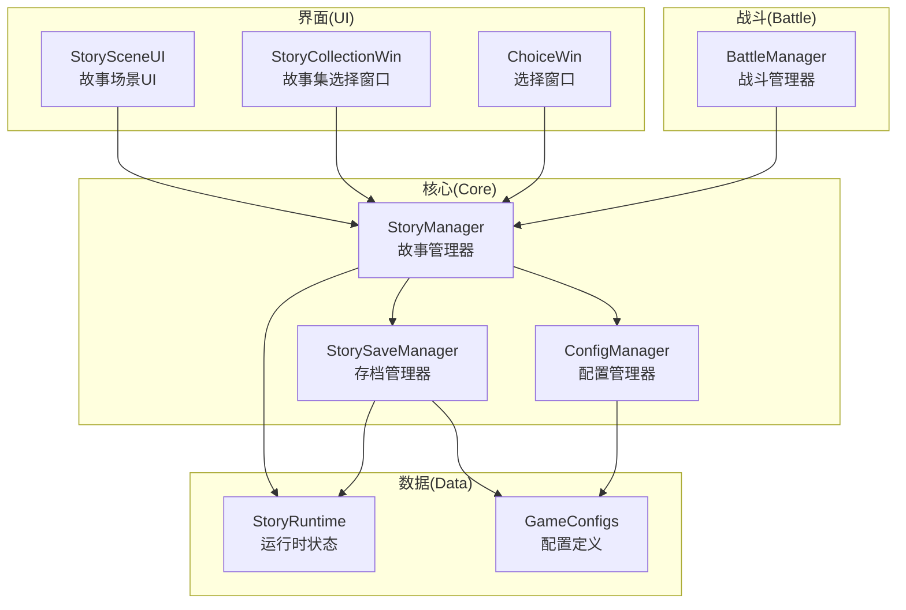
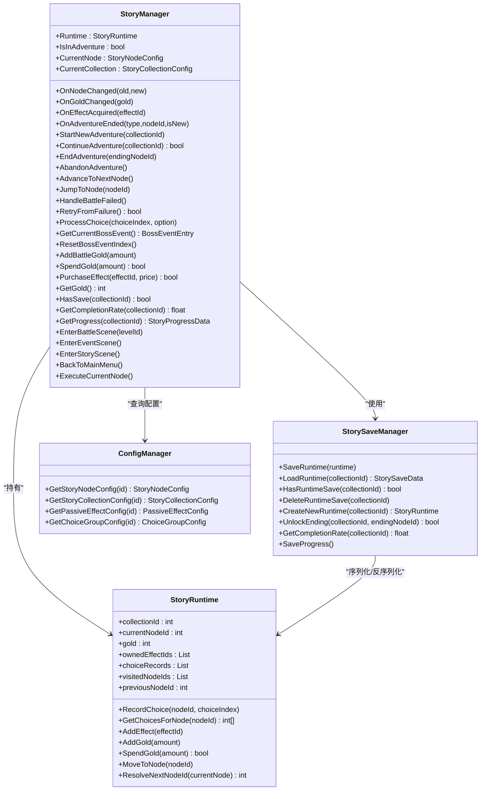
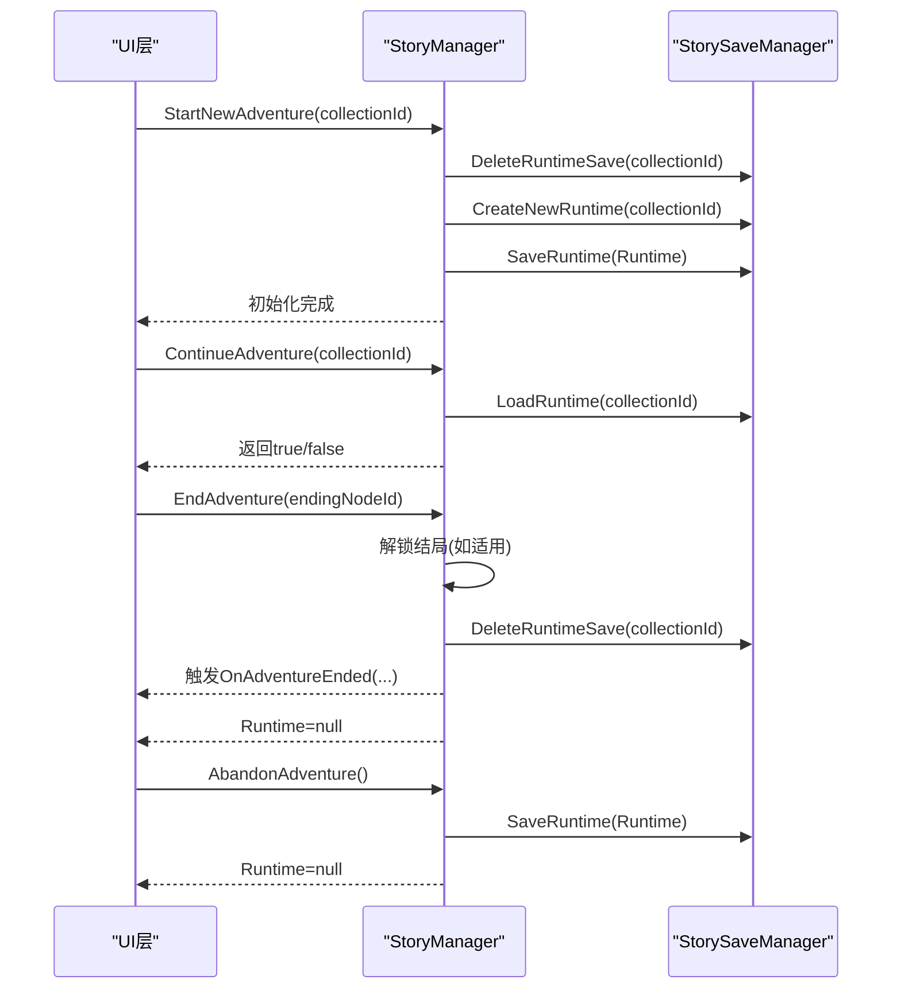
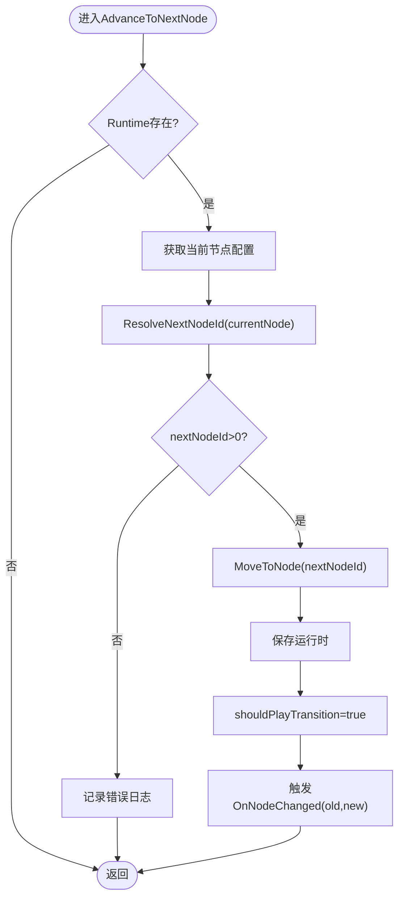
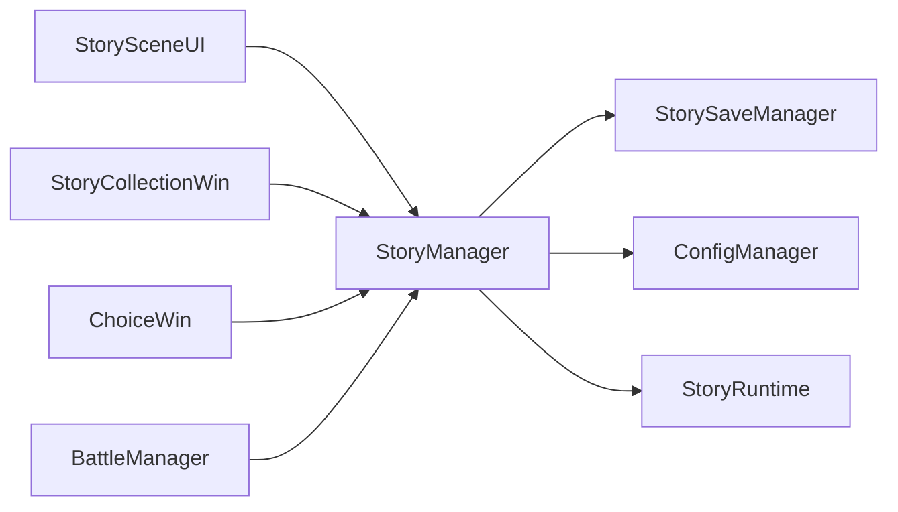

# 故事管理器核心

<cite>
**本文引用的文件**
- [StoryManager.cs](file://Assets/Scripts/Core/StoryManager.cs)
- [StoryRuntime.cs](file://Assets/Scripts/Data/StoryRuntime.cs)
- [StorySaveManager.cs](file://Assets/Scripts/Core/StorySaveManager.cs)
- [ConfigManager.cs](file://Assets/Scripts/Core/ConfigManager.cs)
- [GameConfigs.cs](file://Assets/Scripts/Data/GameConfigs.cs)
- [StorySceneUI.cs](file://Assets/Scripts/UI/StorySceneUI.cs)
- [StoryCollectionWin.cs](file://Assets/Scripts/UI/StoryCollectionWin.cs)
- [ChoiceWin.cs](file://Assets/Scripts/UI/ChoiceWin.cs)
- [BattleManager.cs](file://Assets/Scripts/Battle/BattleManager.cs)
</cite>

## 目录
1. [简介](#简介)
2. [项目结构](#项目结构)
3. [核心组件](#核心组件)
4. [架构总览](#架构总览)
5. [详细组件分析](#详细组件分析)
6. [依赖关系分析](#依赖关系分析)
7. [性能考量](#性能考量)
8. [故障排查指南](#故障排查指南)
9. [结论](#结论)
10. [附录](#附录)

## 简介
本文件面向GeometryTD的故事系统，聚焦“故事管理器”核心组件StoryManager的实现与使用。内容涵盖：
- 单例模式与跨场景持久化设计
- 冒险生命周期管理（开始/继续/推进/结束/放弃）
- 节点推进机制（自动推进、直接跳转、失败处理）
- 故事状态事件系统（节点切换、金币变化、藏品获得、冒险结束）
- Boss事件处理机制（当前Boss事件获取、事件索引重置）
- 存档与进度系统（运行时中途存档、永久进度解锁）
- 使用示例与最佳实践

## 项目结构
故事系统相关的核心文件分布于Core、Data、UI与Battle模块：
- Core：StoryManager、StorySaveManager、ConfigManager
- Data：StoryRuntime、GameConfigs（节点/集合/效果等配置）
- UI：StorySceneUI、StoryCollectionWin、ChoiceWin
- Battle：BattleManager（与Boss事件联动）

图表来源
- [StoryManager.cs:12-589](file://Assets/Scripts/Core/StoryManager.cs#L12-L589)
- [StorySaveManager.cs:11-179](file://Assets/Scripts/Core/StorySaveManager.cs#L11-L179)
- [ConfigManager.cs:6-200](file://Assets/Scripts/Core/ConfigManager.cs#L6-L200)
- [GameConfigs.cs:615-775](file://Assets/Scripts/Data/GameConfigs.cs#L615-L775)
- [StorySceneUI.cs:8-200](file://Assets/Scripts/UI/StorySceneUI.cs#L8-L200)
- [StoryCollectionWin.cs:7-610](file://Assets/Scripts/UI/StoryCollectionWin.cs#L7-L610)
- [ChoiceWin.cs:8-200](file://Assets/Scripts/UI/ChoiceWin.cs#L8-L200)
- [BattleManager.cs:721-761](file://Assets/Scripts/Battle/BattleManager.cs#L721-L761)

章节来源
- [StoryManager.cs:12-589](file://Assets/Scripts/Core/StoryManager.cs#L12-L589)
- [StorySaveManager.cs:11-179](file://Assets/Scripts/Core/StorySaveManager.cs#L11-L179)
- [ConfigManager.cs:6-200](file://Assets/Scripts/Core/ConfigManager.cs#L6-L200)
- [GameConfigs.cs:615-775](file://Assets/Scripts/Data/GameConfigs.cs#L615-L775)

## 核心组件
- StoryManager：单例，跨场景持久化，负责冒险生命周期、节点推进、事件分发、Boss事件、金币与藏品系统、场景切换。
- StoryRuntime：一次冒险过程中的运行时状态，包含当前节点、金币、已获藏品、选择记录、访问历史等。
- StorySaveManager：运行时中途存档与永久进度存档的读写，基于PlayerPrefs+JSON。
- ConfigManager：集中加载与索引各类配置（故事集合、节点、对话、选项、被动效果等）。
- UI层：StorySceneUI监听节点切换与金币变化；StoryCollectionWin驱动开始/继续冒险；ChoiceWin处理选项选择。
- BattleManager：与Boss事件联动，触发对话与选择。

章节来源
- [StoryManager.cs:12-589](file://Assets/Scripts/Core/StoryManager.cs#L12-L589)
- [StoryRuntime.cs:11-204](file://Assets/Scripts/Data/StoryRuntime.cs#L11-L204)
- [StorySaveManager.cs:11-179](file://Assets/Scripts/Core/StorySaveManager.cs#L11-L179)
- [ConfigManager.cs:6-200](file://Assets/Scripts/Core/ConfigManager.cs#L6-L200)
- [StorySceneUI.cs:8-200](file://Assets/Scripts/UI/StorySceneUI.cs#L8-L200)
- [StoryCollectionWin.cs:7-610](file://Assets/Scripts/UI/StoryCollectionWin.cs#L7-L610)
- [ChoiceWin.cs:8-200](file://Assets/Scripts/UI/ChoiceWin.cs#L8-L200)
- [BattleManager.cs:721-761](file://Assets/Scripts/Battle/BattleManager.cs#L721-L761)

## 架构总览
下图展示了StoryManager与各子系统的交互关系与职责边界：

图表来源
- [StoryManager.cs:12-589](file://Assets/Scripts/Core/StoryManager.cs#L12-L589)
- [StorySaveManager.cs:11-179](file://Assets/Scripts/Core/StorySaveManager.cs#L11-L179)
- [StoryRuntime.cs:11-204](file://Assets/Scripts/Data/StoryRuntime.cs#L11-L204)
- [ConfigManager.cs:6-200](file://Assets/Scripts/Core/ConfigManager.cs#L6-L200)

## 详细组件分析

### 单例模式与跨场景持久化
- 单例实现：通过静态Instance属性在首次访问时创建GameObject并附加组件，保证全局唯一。
- 跨场景持久化：Awake中调用DontDestroyOnLoad，确保场景切换时实例常驻。
- 延迟初始化：Instance getter中若不存在则创建，避免启动时的资源浪费。

章节来源
- [StoryManager.cs:14-92](file://Assets/Scripts/Core/StoryManager.cs#L14-L92)

### 冒险生命周期管理
- 开始新冒险：删除旧中途存档，创建新运行时，初始化Boss事件索引与失败节点标记，并保存初始状态。
- 继续冒险：从存档加载运行时，重置Boss事件索引与失败节点标记。
- 结束冒险：根据结局节点类型尝试解锁永久结局，清理中途存档，触发OnAdventureEnded事件，清空Runtime。
- 放弃冒险：保存当前运行时并清空Runtime，保留存档以供后续继续。

图表来源
- [StoryManager.cs:96-163](file://Assets/Scripts/Core/StoryManager.cs#L96-L163)
- [StorySaveManager.cs:33-100](file://Assets/Scripts/Core/StorySaveManager.cs#L33-L100)

章节来源
- [StoryManager.cs:96-163](file://Assets/Scripts/Core/StoryManager.cs#L96-L163)
- [StorySaveManager.cs:33-100](file://Assets/Scripts/Core/StorySaveManager.cs#L33-L100)

### 节点推进机制
- 自动推进：根据当前节点的nextNodes与运行时选择记录，匹配最精确条件，返回目标节点ID；若无精确匹配则回退到defaultNextNodeId。
- 直接跳转：JumpToNode用于事件触发战斗等场景，直接移动到指定节点。
- 失败处理：记录失败节点ID，优先跳转到当前节点failNodeId，否则提示无失败节点配置。

图表来源
- [StoryManager.cs:171-186](file://Assets/Scripts/Core/StoryManager.cs#L171-L186)
- [StoryRuntime.cs:120-193](file://Assets/Scripts/Data/StoryRuntime.cs#L120-L193)

章节来源
- [StoryManager.cs:171-217](file://Assets/Scripts/Core/StoryManager.cs#L171-L217)
- [StoryRuntime.cs:120-193](file://Assets/Scripts/Data/StoryRuntime.cs#L120-L193)

### 故事状态事件系统
- OnNodeChanged：节点切换时触发，参数为(旧节点ID, 新节点ID)，UI层据此刷新显示。
- OnGoldChanged：金币变化时触发，UI层更新金币显示。
- OnEffectAcquired：获得藏品时触发，UI层更新藏品计数。
- OnAdventureEnded：冒险结束时触发，参数为(结局类型, 结局节点ID, 是否新解锁)。

章节来源
- [StoryManager.cs:56-66](file://Assets/Scripts/Core/StoryManager.cs#L56-L66)
- [StorySceneUI.cs:80-94](file://Assets/Scripts/UI/StorySceneUI.cs#L80-L94)

### Boss事件处理机制
- GetCurrentBossEvent：按顺序返回当前节点配置中的Boss事件条目，自动递增事件索引；超出范围返回null。
- ResetBossEventIndex：进入新的战斗节点时调用，重置事件索引，确保从头播放。

章节来源
- [StoryManager.cs:306-326](file://Assets/Scripts/Core/StoryManager.cs#L306-L326)
- [GameConfigs.cs:634-639](file://Assets/Scripts/Data/GameConfigs.cs#L634-L639)

### 金币与藏品系统
- 战斗中增加金币：应用特殊效果加成后计入，触发OnGoldChanged。
- 商店消费金币：先检查余额，成功后触发OnGoldChanged。
- 购买藏品：花费金币后添加效果并触发OnEffectAcquired，随后保存运行时。
- 属性/技能/特殊效果查询：遍历已拥有效果，按类型聚合加成值，用于战斗前属性应用。

章节来源
- [StoryManager.cs:330-432](file://Assets/Scripts/Core/StoryManager.cs#L330-L432)

### 场景管理与节点执行
- ExecuteCurrentNode：根据当前节点类型进入不同场景（战斗/事件/商店/结局）。
- EnterBattleScene/EnterEventScene/EnterStoryScene/BackToMainMenu：统一的场景切换入口，配合Time.timeScale控制。

章节来源
- [StoryManager.cs:539-561](file://Assets/Scripts/Core/StoryManager.cs#L539-L561)
- [StoryManager.cs:499-533](file://Assets/Scripts/Core/StoryManager.cs#L499-L533)

### 选择处理与存档
- ProcessChoice：记录选择、发放藏品与金币、保存运行时。
- 运行时存档：每次节点推进或选择后保存，支持ContinueAdventure继续。
- 永久进度：解锁结局后保存至永久进度存档，跨冒险持久化。

章节来源
- [StoryManager.cs:275-297](file://Assets/Scripts/Core/StoryManager.cs#L275-L297)
- [StorySaveManager.cs:33-100](file://Assets/Scripts/Core/StorySaveManager.cs#L33-L100)
- [StorySaveManager.cs:104-141](file://Assets/Scripts/Core/StorySaveManager.cs#L104-L141)

## 依赖关系分析
- StoryManager依赖StorySaveManager进行存档读写，依赖ConfigManager查询配置，依赖Runtime维护状态。
- UI层通过事件订阅与StoryManager解耦，UI构建与刷新逻辑独立。
- BattleManager与StoryManager协作，通过GetCurrentBossEvent与ResetBossEventIndex实现Boss事件链路。

图表来源
- [StoryManager.cs:12-589](file://Assets/Scripts/Core/StoryManager.cs#L12-L589)
- [StorySaveManager.cs:11-179](file://Assets/Scripts/Core/StorySaveManager.cs#L11-L179)
- [ConfigManager.cs:6-200](file://Assets/Scripts/Core/ConfigManager.cs#L6-L200)
- [StorySceneUI.cs:8-200](file://Assets/Scripts/UI/StorySceneUI.cs#L8-L200)
- [StoryCollectionWin.cs:7-610](file://Assets/Scripts/UI/StoryCollectionWin.cs#L7-L610)
- [ChoiceWin.cs:8-200](file://Assets/Scripts/UI/ChoiceWin.cs#L8-L200)
- [BattleManager.cs:721-761](file://Assets/Scripts/Battle/BattleManager.cs#L721-L761)

章节来源
- [StoryManager.cs:12-589](file://Assets/Scripts/Core/StoryManager.cs#L12-L589)
- [StorySaveManager.cs:11-179](file://Assets/Scripts/Core/StorySaveManager.cs#L11-L179)
- [ConfigManager.cs:6-200](file://Assets/Scripts/Core/ConfigManager.cs#L6-L200)
- [StorySceneUI.cs:8-200](file://Assets/Scripts/UI/StorySceneUI.cs#L8-L200)
- [StoryCollectionWin.cs:7-610](file://Assets/Scripts/UI/StoryCollectionWin.cs#L7-L610)
- [ChoiceWin.cs:8-200](file://Assets/Scripts/UI/ChoiceWin.cs#L8-L200)
- [BattleManager.cs:721-761](file://Assets/Scripts/Battle/BattleManager.cs#L721-L761)

## 性能考量
- 事件触发频率：节点推进与选择会频繁触发事件，建议UI侧做节流或延迟刷新。
- JSON序列化：存档使用JsonUtility，注意避免在热路径频繁保存；可在节点切换或关键节点时保存。
- 配置查询：ConfigManager建立字典索引，查询为O(1)，对性能影响较小。
- Boss事件：GetCurrentBossEvent按顺序访问，建议在进入战斗节点时重置索引，避免重复播放。

## 故障排查指南
- 无法解析下一节点：检查StoryNodeConfig的nextNodes与条件匹配，确认运行时选择记录是否正确。
- 无失败节点配置：HandleBattleFailed会输出警告，需在配置中设置failNodeId。
- 金币异常：检查AddBattleGold与SpendGold逻辑，确认特殊效果加成是否符合预期。
- 存档丢失：确认SaveRuntime调用时机与PlayerPrefs保存，避免覆盖或删除键值。
- UI不刷新：确认StorySceneUI订阅了OnNodeChanged/OnGoldChanged/OnEffectAcquired事件。

章节来源
- [StoryManager.cs:181-217](file://Assets/Scripts/Core/StoryManager.cs#L181-L217)
- [StoryManager.cs:330-354](file://Assets/Scripts/Core/StoryManager.cs#L330-L354)
- [StorySaveManager.cs:33-48](file://Assets/Scripts/Core/StorySaveManager.cs#L33-L48)

## 结论
StoryManager以单例与跨场景持久化为基础，结合运行时状态与存档系统，提供了完整的冒险生命周期管理能力。通过事件系统与UI解耦，配合Boss事件链路与金币/藏品系统，实现了灵活而可扩展的故事体验。建议在实际开发中遵循事件驱动与最小化序列化的原则，确保性能与可维护性。

## 附录

### 使用示例与最佳实践
- 开始/继续冒险
  - UI层在选择故事集后调用StartNewAdventure或ContinueAdventure，随后进入故事场景。
  - 参考路径：[StoryCollectionWin.cs:524-534](file://Assets/Scripts/UI/StoryCollectionWin.cs#L524-L534)
- 节点推进
  - 在故事场景UI中监听OnNodeChanged，刷新节点显示；在节点执行完成后调用AdvanceToNextNode。
  - 参考路径：[StorySceneUI.cs:80-83](file://Assets/Scripts/UI/StorySceneUI.cs#L80-L83)
- 选项处理
  - ChoiceWin中选择后回调StoryManager.ProcessChoice，记录选择并发放奖励。
  - 参考路径：[ChoiceWin.cs:189-200](file://Assets/Scripts/UI/ChoiceWin.cs#L189-L200)、[StoryManager.cs:275-297](file://Assets/Scripts/Core/StoryManager.cs#L275-L297)
- Boss事件
  - 进入战斗节点时调用ResetBossEventIndex；在Boss对话结束后通过GetCurrentBossEvent获取下一条事件。
  - 参考路径：[StoryManager.cs:306-326](file://Assets/Scripts/Core/StoryManager.cs#L306-L326)、[BattleManager.cs:721-761](file://Assets/Scripts/Battle/BattleManager.cs#L721-L761)
- 金币与藏品
  - 战斗中击杀怪物时调用AddBattleGold；商店购买时调用PurchaseEffect。
  - 参考路径：[StoryManager.cs:330-365](file://Assets/Scripts/Core/StoryManager.cs#L330-L365)
- 场景切换
  - 根据节点类型调用ExecuteCurrentNode或直接调用EnterBattleScene/EnterEventScene。
  - 参考路径：[StoryManager.cs:539-561](file://Assets/Scripts/Core/StoryManager.cs#L539-L561)