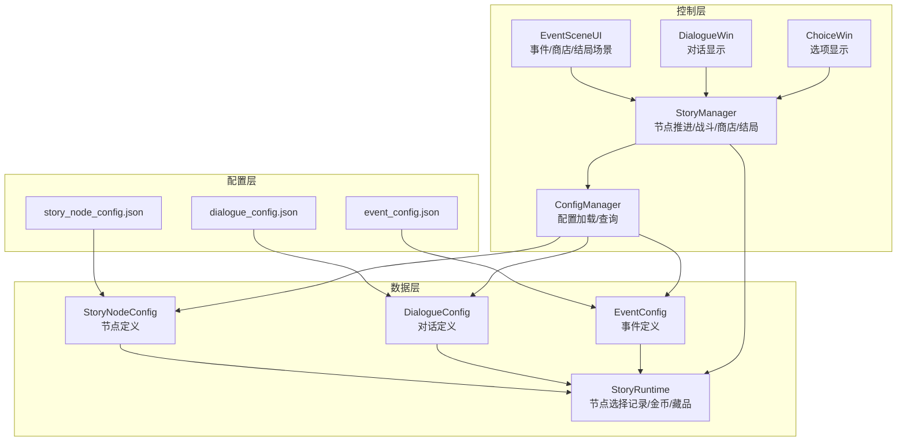
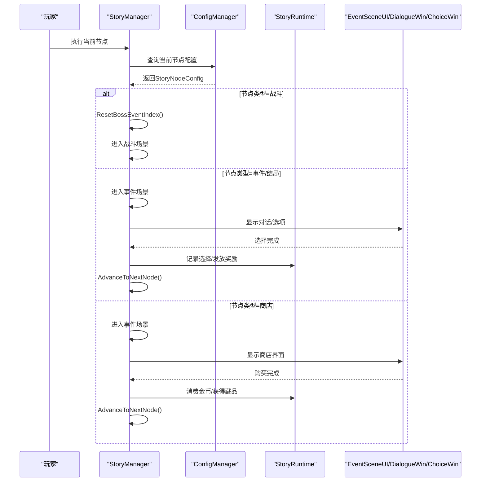
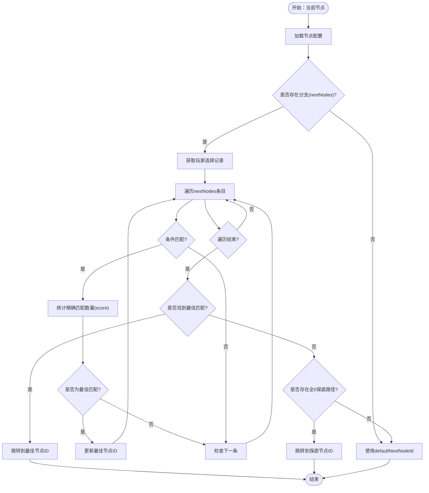
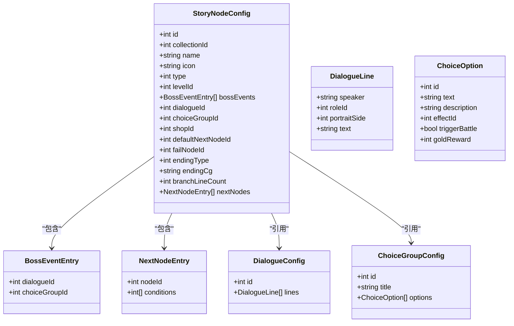
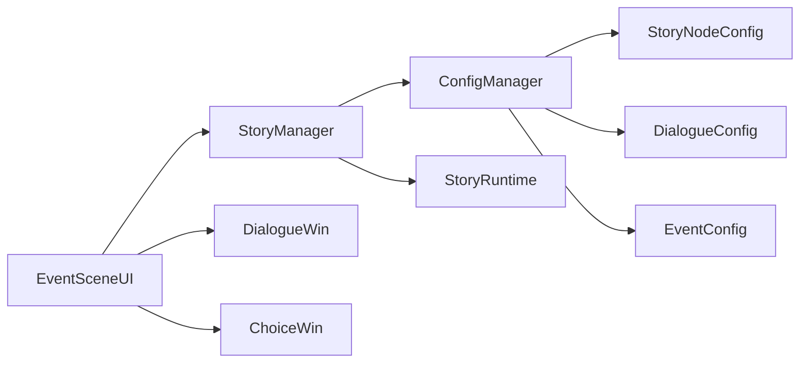

# 故事节点系统

<cite>
**本文引用的文件**
- [story_node_config.json](file://Assets/Resources/Configs/story_node_config.json)
- [dialogue_config.json](file://Assets/Resources/Configs/dialogue_config.json)
- [event_config.json](file://Assets/Resources/Configs/event_config.json)
- [StoryManager.cs](file://Assets/Scripts/Core/StoryManager.cs)
- [ConfigManager.cs](file://Assets/Scripts/Core/ConfigManager.cs)
- [StoryRuntime.cs](file://Assets/Scripts/Data/StoryRuntime.cs)
- [GameConfigs.cs](file://Assets/Scripts/Data/GameConfigs.cs)
- [EventSceneUI.cs](file://Assets/Scripts/UI/EventSceneUI.cs)
- [DialogueWin.cs](file://Assets/Scripts/UI/DialogueWin.cs)
- [ChoiceWin.cs](file://Assets/Scripts/UI/ChoiceWin.cs)
</cite>

## 目录
1. [简介](#简介)
2. [项目结构](#项目结构)
3. [核心组件](#核心组件)
4. [架构总览](#架构总览)
5. [详细组件分析](#详细组件分析)
6. [依赖关系分析](#依赖关系分析)
7. [性能考虑](#性能考虑)
8. [故障排除指南](#故障排除指南)
9. [结论](#结论)
10. [附录](#附录)

## 简介
本技术文档围绕GeometryTD的故事节点系统展开，系统化阐述故事节点配置的设计与实现，涵盖以下方面：
- 故事节点配置体系：基于story_node_config.json的节点类型、连接关系与导航逻辑
- 对话系统：基于dialogue_config.json的多轮对话、角色语音与情感表达
- 事件系统：基于event_config.json的随机事件、概率触发与条件判断
- 节点间导航：nextNodes条件匹配、failNodeId失败跳转、endingType结局类型
- 最佳实践：配置文件组织、命名规范与性能优化
- 调试技巧：可视化流程图与排错建议

## 项目结构
故事节点系统主要由三部分构成：
- 配置层：JSON配置文件（story_node_config.json、dialogue_config.json、event_config.json）
- 数据层：运行时数据结构（StoryRuntime、StoryNodeConfig等）
- 控制层：业务逻辑与UI交互（StoryManager、ConfigManager、EventSceneUI、DialogueWin、ChoiceWin）

图表来源
- [StoryManager.cs:12-589](file://Assets/Scripts/Core/StoryManager.cs#L12-L589)
- [ConfigManager.cs:65-122](file://Assets/Scripts/Core/ConfigManager.cs#L65-L122)
- [StoryRuntime.cs:11-204](file://Assets/Scripts/Data/StoryRuntime.cs#L11-L204)
- [GameConfigs.cs:649-775](file://Assets/Scripts/Data/GameConfigs.cs#L649-L775)
- [EventSceneUI.cs:7-68](file://Assets/Scripts/UI/EventSceneUI.cs#L7-L68)
- [DialogueWin.cs:7-101](file://Assets/Scripts/UI/DialogueWin.cs#L7-L101)
- [ChoiceWin.cs:8-68](file://Assets/Scripts/UI/ChoiceWin.cs#L8-L68)

章节来源
- [StoryManager.cs:12-589](file://Assets/Scripts/Core/StoryManager.cs#L12-L589)
- [ConfigManager.cs:65-122](file://Assets/Scripts/Core/ConfigManager.cs#L65-L122)

## 核心组件
- StoryManager：全局故事管理器，负责冒险生命周期、节点推进、战斗/商店/结局场景切换、金币与藏品系统、Boss事件序列等
- ConfigManager：配置加载与查询中心，提供StoryNodeConfig、DialogueConfig、EventConfig等的快速查找
- StoryRuntime：一次冒险过程中的运行时状态，记录当前节点、选择记录、金币、藏品、访问历史等
- GameConfigs：定义StoryNodeConfig、DialogueConfig、ChoiceGroupConfig、EventConfig等数据结构与枚举常量

章节来源
- [StoryManager.cs:12-589](file://Assets/Scripts/Core/StoryManager.cs#L12-L589)
- [ConfigManager.cs:65-122](file://Assets/Scripts/Core/ConfigManager.cs#L65-L122)
- [StoryRuntime.cs:11-204](file://Assets/Scripts/Data/StoryRuntime.cs#L11-L204)
- [GameConfigs.cs:649-775](file://Assets/Scripts/Data/GameConfigs.cs#L649-L775)

## 架构总览
故事节点系统采用“配置驱动 + 运行时状态”的架构模式：
- 配置驱动：通过JSON配置描述节点类型、对话、事件、商店等
- 运行时状态：StoryRuntime记录玩家选择与进度，驱动节点导航
- 业务控制：StoryManager根据当前节点类型执行相应场景切换与事件处理
- UI交互：EventSceneUI、DialogueWin、ChoiceWin负责呈现对话与选项

图表来源
- [StoryManager.cs:539-560](file://Assets/Scripts/Core/StoryManager.cs#L539-L560)
- [StoryRuntime.cs:120-193](file://Assets/Scripts/Data/StoryRuntime.cs#L120-L193)
- [EventSceneUI.cs:53-67](file://Assets/Scripts/UI/EventSceneUI.cs#L53-L67)
- [DialogueWin.cs:76-101](file://Assets/Scripts/UI/DialogueWin.cs#L76-L101)
- [ChoiceWin.cs:52-68](file://Assets/Scripts/UI/ChoiceWin.cs#L52-L68)

## 详细组件分析

### 故事节点配置体系
- 节点类型
  - 战斗节点（type=1）：关联关卡ID（levelId），可配置多个Boss事件（bossEvents），触发对话与选项序列
  - 事件节点（type=2）：可配置对话（dialogueId）与选项组（choiceGroupId）
  - 商店节点（type=3）：配置商店ID（shopId），默认跳转节点（defaultNextNodeId）
  - 结局节点（type=4）：配置结局类型（endingType）、CG资源（endingCg）
- 导航逻辑
  - nextNodes：每条记录包含目标节点ID与条件数组（conditions）。ResolveNextNodeId会优先匹配精确条件，否则退回defaultNextNodeId
  - failNodeId：战斗失败时跳转的节点
  - defaultNextNodeId：无条件分支或无法匹配时的保底跳转
- Boss事件序列
  - bossEvents：按顺序触发对话与选项，StoryManager内部维护currentBossEventIndex，逐个推进

章节来源
- [story_node_config.json:1-305](file://Assets/Resources/Configs/story_node_config.json#L1-L305)
- [StoryRuntime.cs:120-193](file://Assets/Scripts/Data/StoryRuntime.cs#L120-L193)
- [StoryManager.cs:306-326](file://Assets/Scripts/Core/StoryManager.cs#L306-L326)
- [GameConfigs.cs:649-667](file://Assets/Scripts/Data/GameConfigs.cs#L649-L667)

### 对话系统
- 对话配置
  - DialogueConfig包含对话ID与对话行数组（DialogueLine），每行包含说话者、角色ID、立绘侧别、文本
- 对话显示
  - DialogueWin负责逐字打印、自动模式、跳过、点击推进、立绘高亮与淡入淡出
  - 支持暂停时间轴，确保对话体验稳定
- 事件节点中的对话
  - EventSceneUI根据当前节点类型加载对话或选项，完成后自动推进

章节来源
- [dialogue_config.json:1-146](file://Assets/Resources/Configs/dialogue_config.json#L1-L146)
- [GameConfigs.cs:686-691](file://Assets/Scripts/Data/GameConfigs.cs#L686-L691)
- [DialogueWin.cs:76-253](file://Assets/Scripts/UI/DialogueWin.cs#L76-L253)
- [EventSceneUI.cs:72-100](file://Assets/Scripts/UI/EventSceneUI.cs#L72-L100)

### 事件系统
- 事件配置
  - EventConfig定义事件ID、类型（type）、名称、描述与参数数组（args）
  - 事件类型覆盖伤害/治疗、护盾、击退、经验、能量、Buff、Passive、召唤、驱散等
- 事件执行
  - 事件系统在战斗/剧情中按配置触发，影响角色属性、Buff、经验、能量等
- 与故事节点的结合
  - 事件节点可直接触发，也可作为选项奖励的一部分

章节来源
- [event_config.json:1-116](file://Assets/Resources/Configs/event_config.json#L1-L116)
- [GameConfigs.cs:138-146](file://Assets/Scripts/Data/GameConfigs.cs#L138-L146)
- [ConfigManager.cs:556-562](file://Assets/Scripts/Core/ConfigManager.cs#L556-L562)

### 节点间连接与导航
- 条件匹配算法
  - ResolveNextNodeId遍历nextNodes，统计与玩家选择匹配的条件数量（score），优先选择匹配度最高的条目
  - 若无精确匹配，回退到所有条件均为0的保底路径
  - 若仍无匹配，使用defaultNextNodeId
- 失败跳转
  - 战斗失败时，若当前节点配置了failNodeId，则跳转至失败节点；否则记录警告
- 重试机制
  - RetryFromFailure移除失败节点的访问记录，并回到失败前节点，清空该节点的选择记录以便重新挑战

图表来源
- [StoryRuntime.cs:120-193](file://Assets/Scripts/Data/StoryRuntime.cs#L120-L193)

章节来源
- [StoryRuntime.cs:120-193](file://Assets/Scripts/Data/StoryRuntime.cs#L120-L193)
- [StoryManager.cs:196-242](file://Assets/Scripts/Core/StoryManager.cs#L196-L242)

### 类型与数据模型

图表来源
- [GameConfigs.cs:634-775](file://Assets/Scripts/Data/GameConfigs.cs#L634-L775)

章节来源
- [GameConfigs.cs:634-775](file://Assets/Scripts/Data/GameConfigs.cs#L634-L775)

## 依赖关系分析
- StoryManager依赖ConfigManager进行配置查询，依赖StoryRuntime进行状态管理
- EventSceneUI依赖StoryManager获取当前节点，依赖DialogueWin/ChoiceWin进行对话与选项展示
- ConfigManager统一加载并缓存各类配置，提供快速查询接口
- StoryRuntime与StoryManager共同维护节点选择记录与导航逻辑

图表来源
- [StoryManager.cs:35-52](file://Assets/Scripts/Core/StoryManager.cs#L35-L52)
- [ConfigManager.cs:454-460](file://Assets/Scripts/Core/ConfigManager.cs#L454-L460)
- [EventSceneUI.cs:25-44](file://Assets/Scripts/UI/EventSceneUI.cs#L25-L44)

章节来源
- [StoryManager.cs:35-52](file://Assets/Scripts/Core/StoryManager.cs#L35-L52)
- [ConfigManager.cs:454-460](file://Assets/Scripts/Core/ConfigManager.cs#L454-L460)
- [EventSceneUI.cs:25-44](file://Assets/Scripts/UI/EventSceneUI.cs#L25-L44)

## 性能考虑
- 配置加载与缓存
  - ConfigManager一次性加载并建立索引，避免重复IO与查找开销
- 运行时状态序列化
  - StoryRuntime为可序列化结构，便于存档与跨场景持久化
- UI交互暂停
  - 对话与选项窗口暂停时间轴，避免并发渲染与输入冲突
- 导航匹配优化
  - nextNodes条目数量应合理控制，避免过多分支导致匹配成本上升

[本节为通用指导，无需特定文件引用]

## 故障排除指南
- 无法解析下一节点
  - 检查当前节点的nextNodes配置是否正确，条件数组长度与选项组数量一致
  - 确认defaultNextNodeId存在且可达
- 战斗失败无跳转
  - 检查当前节点的failNodeId配置，确认其指向有效节点
- 对话不显示或选项不出现
  - 确认节点的dialogueId或choiceGroupId配置正确，对应的配置文件已加载
- 金币/藏品异常
  - 检查StoryManager.ProcessChoice与StoryRuntime.RecordChoice的调用链
  - 确认ConfigManager.GetPassiveEffectConfig与GetEventConfig可用

章节来源
- [StoryManager.cs:171-186](file://Assets/Scripts/Core/StoryManager.cs#L171-L186)
- [StoryManager.cs:196-217](file://Assets/Scripts/Core/StoryManager.cs#L196-L217)
- [StoryRuntime.cs:120-193](file://Assets/Scripts/Data/StoryRuntime.cs#L120-L193)

## 结论
GeometryTD的故事节点系统通过“配置驱动 + 运行时状态 + 控制层”的清晰分层，实现了灵活的节点类型、多轮对话、事件系统与导航逻辑。借助StoryManager与ConfigManager的协作，系统能够稳定地推进剧情、管理玩家选择与奖励，并在战斗/事件/商店/结局之间无缝切换。遵循本文的最佳实践与调试技巧，内容创作者与开发者可以高效构建复杂而富有表现力的故事体验。

[本节为总结性内容，无需特定文件引用]

## 附录

### 节点类型与配置差异
- 战斗节点（type=1）
  - 关联levelId，支持bossEvents序列，触发对话与选项
  - 使用failNodeId处理失败跳转
- 事件节点（type=2）
  - 支持dialogueId与choiceGroupId，无默认跳转时需明确nextNodes
- 商店节点（type=3）
  - 配置shopId与defaultNextNodeId，通常无分支
- 结局节点（type=4）
  - 配置endingType与endingCg，无分支

章节来源
- [story_node_config.json:1-305](file://Assets/Resources/Configs/story_node_config.json#L1-L305)
- [GameConfigs.cs:559-576](file://Assets/Scripts/Data/GameConfigs.cs#L559-L576)

### 配置文件组织与命名规范
- 配置文件放置于Resources/Configs目录，命名采用名词短语，如story_node_config.json、dialogue_config.json、event_config.json
- 字段命名采用驼峰式，保持与数据结构一致
- 节点ID与对话ID、事件ID应唯一且有序，便于定位与调试

[本节为通用指导，无需特定文件引用]

### 调试技巧
- 使用StoryManager的事件回调（OnNodeChanged、OnGoldChanged、OnEffectAcquired、OnAdventureEnded）观察状态变化
- 在ResolveNextNodeId处设置断点，检查conditions与playerChoices的匹配情况
- 对话与选项窗口暂停时间轴，便于逐步验证UI与逻辑

章节来源
- [StoryManager.cs:56-66](file://Assets/Scripts/Core/StoryManager.cs#L56-L66)
- [StoryRuntime.cs:120-193](file://Assets/Scripts/Data/StoryRuntime.cs#L120-L193)
- [DialogueWin.cs:76-101](file://Assets/Scripts/UI/DialogueWin.cs#L76-L101)
- [ChoiceWin.cs:52-68](file://Assets/Scripts/UI/ChoiceWin.cs#L52-L68)