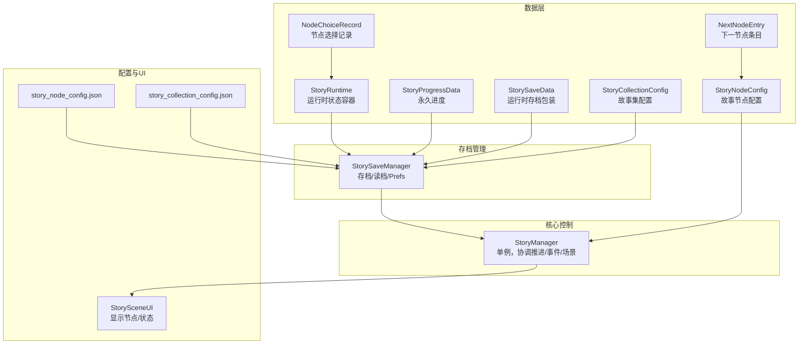
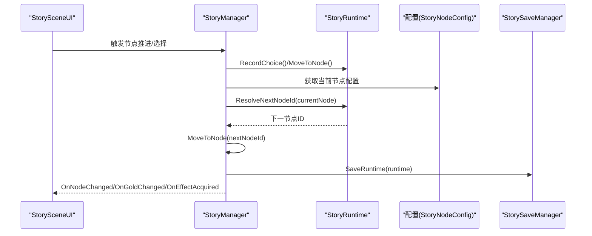
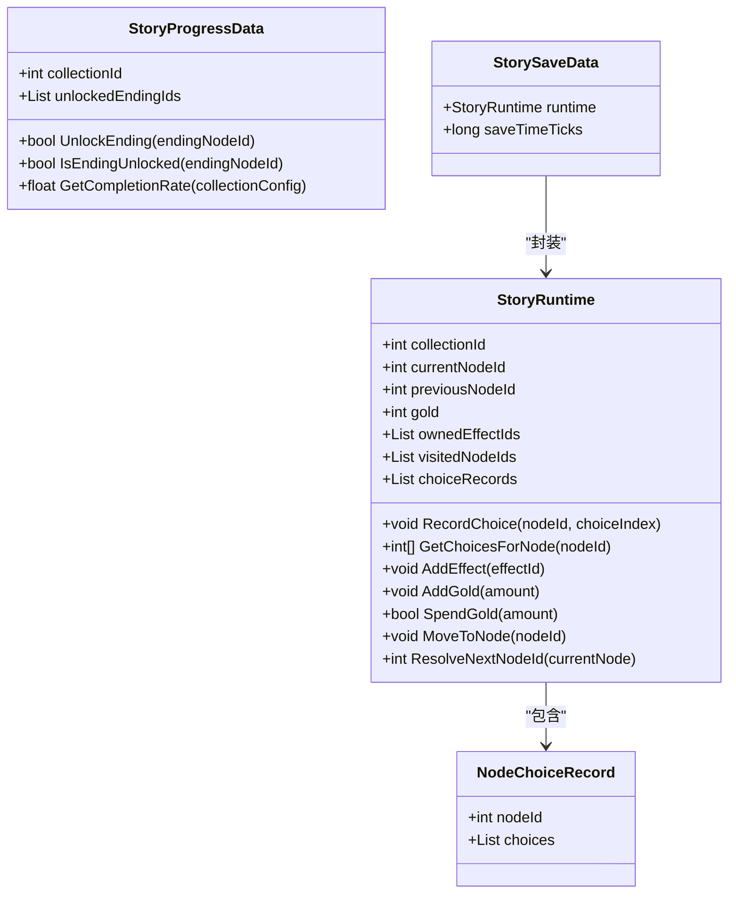
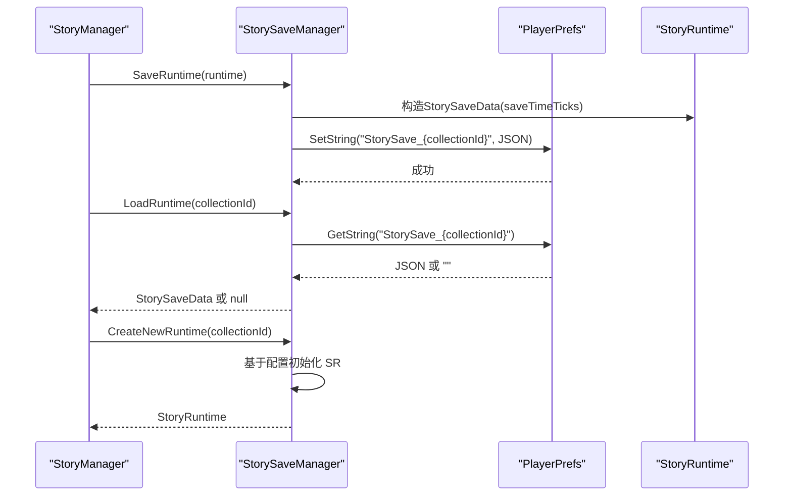
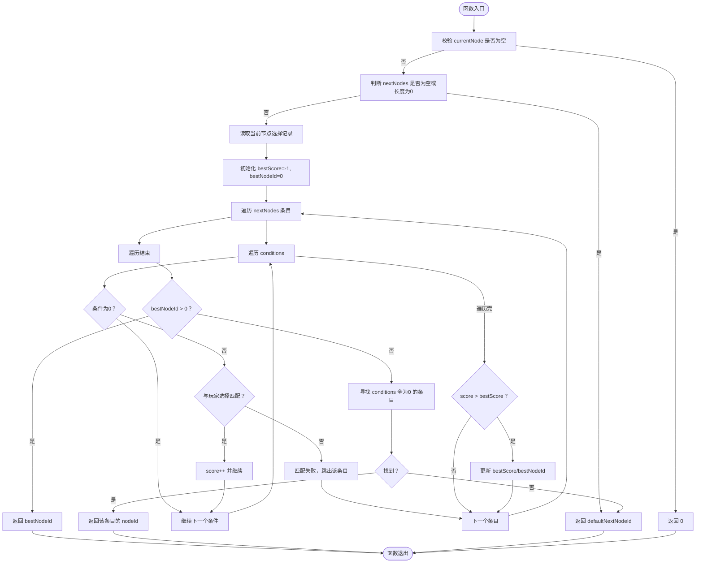
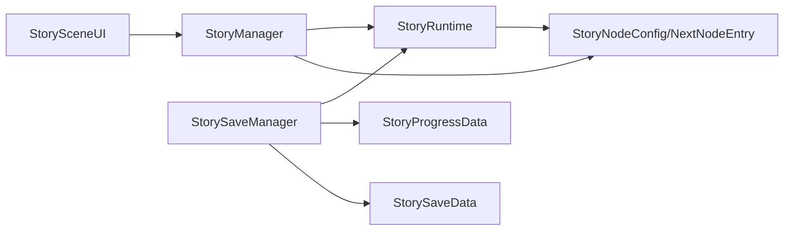

# 故事运行时系统

<cite>
**本文引用的文件**
- [StoryRuntime.cs](file://Assets/Scripts/Data/StoryRuntime.cs)
- [StorySaveManager.cs](file://Assets/Scripts/Core/StorySaveManager.cs)
- [StoryManager.cs](file://Assets/Scripts/Core/StoryManager.cs)
- [GameConfigs.cs](file://Assets/Scripts/Data/GameConfigs.cs)
- [story_node_config.json](file://Assets/Resources/Configs/story_node_config.json)
- [story_collection_config.json](file://Assets/Resources/Configs/story_collection_config.json)
- [StorySceneUI.cs](file://Assets/Scripts/UI/StorySceneUI.cs)
</cite>

## 目录
1. [简介](#简介)
2. [项目结构](#项目结构)
3. [核心组件](#核心组件)
4. [架构总览](#架构总览)
5. [详细组件分析](#详细组件分析)
6. [依赖关系分析](#依赖关系分析)
7. [性能考量](#性能考量)
8. [故障排查指南](#故障排查指南)
9. [结论](#结论)
10. [附录](#附录)

## 简介
本技术文档围绕 GeometryTD 的故事运行时系统展开，重点阐释 StoryRuntime 类作为“一次冒险过程中的故事状态容器”的设计与职责，并深入解析运行时状态管理机制、序列化与持久化流程、故事节点解析算法、数据校验与完整性保护，以及扩展与定制指南。读者将通过图示与路径引用，快速掌握如何正确使用与扩展该系统。

## 项目结构
故事运行时系统主要由以下模块构成：
- 数据层：StoryRuntime、StoryProgressData、StorySaveData、NodeChoiceRecord、配置类（StoryNodeConfig、NextNodeEntry、StoryCollectionConfig 等）
- 核心控制：StoryManager（单例，跨场景持久化，协调节点推进、事件、金币与藏品）
- 存档管理：StorySaveManager（基于 PlayerPrefs + JsonUtility 的存档/读档）
- 配置来源：JSON 配置（故事节点、故事集合）
- UI 展示：StorySceneUI（读取 StoryManager/Runtime 显示节点与状态）

图表来源
- [StoryRuntime.cs:11-287](file://Assets/Scripts/Data/StoryRuntime.cs#L11-L287)
- [StorySaveManager.cs:11-179](file://Assets/Scripts/Core/StorySaveManager.cs#L11-L179)
- [StoryManager.cs:12-589](file://Assets/Scripts/Core/StoryManager.cs#L12-L589)
- [GameConfigs.cs:615-775](file://Assets/Scripts/Data/GameConfigs.cs#L615-L775)
- [story_node_config.json:1-200](file://Assets/Resources/Configs/story_node_config.json#L1-L200)
- [story_collection_config.json:1-21](file://Assets/Resources/Configs/story_collection_config.json#L1-L21)
- [StorySceneUI.cs:1-200](file://Assets/Scripts/UI/StorySceneUI.cs#L1-L200)

章节来源
- [StoryRuntime.cs:11-287](file://Assets/Scripts/Data/StoryRuntime.cs#L11-L287)
- [StorySaveManager.cs:11-179](file://Assets/Scripts/Core/StorySaveManager.cs#L11-L179)
- [StoryManager.cs:12-589](file://Assets/Scripts/Core/StoryManager.cs#L12-L589)
- [GameConfigs.cs:615-775](file://Assets/Scripts/Data/GameConfigs.cs#L615-L775)
- [story_node_config.json:1-200](file://Assets/Resources/Configs/story_node_config.json#L1-L200)
- [story_collection_config.json:1-21](file://Assets/Resources/Configs/story_collection_config.json#L1-L21)
- [StorySceneUI.cs:1-200](file://Assets/Scripts/UI/StorySceneUI.cs#L1-L200)

## 核心组件
- StoryRuntime：承载一次冒险的全部运行时状态，支持序列化/反序列化，提供选择记录、访问历史、金币、藏品效果、节点移动与下一节点解析等能力。
- StorySaveManager：负责运行时中途存档（StorySaveData）与永久进度（StoryProgressData）的保存、读取、删除与缓存。
- StoryManager：单例，协调节点推进、事件触发、场景切换、金币与藏品系统，并通过事件通知 UI 更新。
- 配置类：StoryNodeConfig、NextNodeEntry、StoryCollectionConfig 等，描述故事节点的分支、条件、默认走向与结局等。
- UI：StorySceneUI 读取 StoryManager/Runtime，驱动节点显示与过渡动画。

章节来源
- [StoryRuntime.cs:11-287](file://Assets/Scripts/Data/StoryRuntime.cs#L11-L287)
- [StorySaveManager.cs:11-179](file://Assets/Scripts/Core/StorySaveManager.cs#L11-L179)
- [StoryManager.cs:12-589](file://Assets/Scripts/Core/StoryManager.cs#L12-L589)
- [GameConfigs.cs:615-775](file://Assets/Scripts/Data/GameConfigs.cs#L615-L775)
- [StorySceneUI.cs:1-200](file://Assets/Scripts/UI/StorySceneUI.cs#L1-L200)

## 架构总览
运行时系统采用“配置驱动 + 状态容器 + 存档管理 + 单例协调”的分层架构。StoryRuntime 作为状态中枢，StorySaveManager 提供持久化保障，StoryManager 统一调度业务流程，UI 通过事件感知状态变化。

图表来源
- [StoryManager.cs:171-253](file://Assets/Scripts/Core/StoryManager.cs#L171-L253)
- [StoryRuntime.cs:120-193](file://Assets/Scripts/Data/StoryRuntime.cs#L120-L193)
- [StorySaveManager.cs:33-48](file://Assets/Scripts/Core/StorySaveManager.cs#L33-L48)
- [StorySceneUI.cs:50-94](file://Assets/Scripts/UI/StorySceneUI.cs#L50-L94)

## 详细组件分析

### StoryRuntime 设计与状态管理
- 作为一次冒险过程中的“状态容器”，需满足完整序列化/反序列化的约束。
- 关键字段与职责
  - collectionId：标识所属故事集
  - currentNodeId：当前所在节点
  - previousNodeId：上一节点（用于过渡动画）
  - gold：局内金币（仅本次冒险有效）
  - ownedEffectIds：已获得的藏品效果ID列表（可含重复，表示叠加层数）
  - visitedNodeIds：访问历史（按顺序）
  - choiceRecords：节点选择记录（按节点聚合）
- 辅助方法
  - RecordChoice/GetChoicesForNode：记录与查询节点选择
  - AddEffect/AddGold/SpendGold：藏品与金币管理
  - MoveToNode：更新当前节点并记录访问
  - ResolveNextNodeId：根据选择记录与条件匹配下一节点

图表来源
- [StoryRuntime.cs:11-287](file://Assets/Scripts/Data/StoryRuntime.cs#L11-L287)

章节来源
- [StoryRuntime.cs:11-287](file://Assets/Scripts/Data/StoryRuntime.cs#L11-L287)

### 运行时状态序列化与持久化
- 运行时存档（中途存档/继续）：StorySaveData 包裹 StoryRuntime 与时间戳，使用 JsonUtility 序列化后写入 PlayerPrefs。
- 永久进度：StoryProgressSaveData 包含多个 StoryProgressData，记录各故事集的已解锁结局，同样以 JSON 形式持久化。
- 生命周期
  - 创建新运行时：CreateNewRuntime 基于 StoryCollectionConfig 初始化起始节点与基础状态
  - 保存：SaveRuntime 每次选择或节点变更后调用
  - 读取：LoadRuntime 返回存档或 null
  - 删除：DeleteRuntimeSave 清理存档
  - 永久进度：GetProgress/UnlockEnding/SaveProgress

图表来源
- [StorySaveManager.cs:33-100](file://Assets/Scripts/Core/StorySaveManager.cs#L33-L100)
- [StoryManager.cs:96-130](file://Assets/Scripts/Core/StoryManager.cs#L96-L130)

章节来源
- [StorySaveManager.cs:11-179](file://Assets/Scripts/Core/StorySaveManager.cs#L11-L179)
- [StoryManager.cs:96-130](file://Assets/Scripts/Core/StoryManager.cs#L96-L130)

### 故事节点解析算法：ResolveNextNodeId
- 输入：当前节点配置（StoryNodeConfig）
- 输出：下一节点ID；若无法匹配默认返回 defaultNextNodeId，仍不可得则返回 0
- 解析策略
  - 若节点无 nextNodes，则直接返回 defaultNextNodeId
  - 读取当前节点的选择记录（GetChoicesForNode），逐条匹配 nextNodes 中的 NextNodeEntry.conditions
  - 匹配规则
    - conditions 中的 0 为通配符，任意匹配
    - 非 0 条件必须与玩家在对应选项组的选择索引严格相等
    - 匹配成功后按“精确匹配条件数”打分，取最高分者
    - 若无精确匹配，回退到 conditions 全为 0 的条目
    - 若仍无可选条目，返回 defaultNextNodeId
- 异常与边界
  - currentNode 为空返回 0
  - 无匹配且无默认返回 0（调用方需处理）

图表来源
- [StoryRuntime.cs:120-193](file://Assets/Scripts/Data/StoryRuntime.cs#L120-L193)

章节来源
- [StoryRuntime.cs:120-193](file://Assets/Scripts/Data/StoryRuntime.cs#L120-L193)

### 运行时数据验证与完整性保护
- 空引用处理
  - ResolveNextNodeId 对 currentNode 与 nextNodes/conditions 进行判空
  - RecordChoice/MoveToNode/ResolveNextNodeId 前均进行 null 检查
- 边界条件保护
  - SpendGold 对 amount<=0 直接返回成功，避免负支出
  - AddEffect 对 effectId<=0 与配置缺失进行早退
  - visitedNodeIds 去重插入，避免重复记录
  - 选择记录按节点聚合，避免重复覆盖
- 完整性保障
  - 使用 JsonUtility 序列化/反序列化，保证跨平台一致性
  - 运行时存档在关键节点变更后立即保存，降低丢失风险
  - 永久进度独立存储，不受单次冒险影响

章节来源
- [StoryRuntime.cs:91-105](file://Assets/Scripts/Data/StoryRuntime.cs#L91-L105)
- [StoryRuntime.cs:61-89](file://Assets/Scripts/Data/StoryRuntime.cs#L61-L89)
- [StorySaveManager.cs:33-75](file://Assets/Scripts/Core/StorySaveManager.cs#L33-L75)

### 扩展指南：新增状态字段与自定义状态管理
- 新增运行时字段
  - 在 StoryRuntime 中添加字段（如新的资源、临时标记）
  - 如需持久化，确保字段可被 JsonUtility 序列化（public、可序列化类型）
  - 在 CreateNewRuntime 中初始化默认值
  - 在 SaveRuntime/LoadRuntime 流程中无需额外改动（由 StorySaveData 包裹）
- 修改数据结构
  - 若需拆分/合并记录结构，调整 NodeChoiceRecord 或引入新记录类型
  - 更新 ResolveNextNodeId 的匹配逻辑以适配新结构
- 自定义状态管理功能
  - 在 StoryManager 中新增事件与回调，驱动 UI 或其他系统
  - 通过 StorySaveManager 的 SaveRuntime/LoadRuntime 保持与现有存档兼容
- 示例路径参考
  - 新增字段与初始化：[StorySaveManager.cs:77-100](file://Assets/Scripts/Core/StorySaveManager.cs#L77-L100)
  - 选择记录结构：[StoryRuntime.cs:209-217](file://Assets/Scripts/Data/StoryRuntime.cs#L209-L217)
  - 节点解析算法：[StoryRuntime.cs:120-193](file://Assets/Scripts/Data/StoryRuntime.cs#L120-L193)

章节来源
- [StorySaveManager.cs:77-100](file://Assets/Scripts/Core/StorySaveManager.cs#L77-L100)
- [StoryRuntime.cs:209-217](file://Assets/Scripts/Data/StoryRuntime.cs#L209-L217)
- [StoryRuntime.cs:120-193](file://Assets/Scripts/Data/StoryRuntime.cs#L120-L193)

### 实际使用场景与代码示例路径
- 开始/继续/结束冒险
  - 开始新冒险：[StoryManager.cs:96-114](file://Assets/Scripts/Core/StoryManager.cs#L96-L114)
  - 继续冒险：[StoryManager.cs:116-130](file://Assets/Scripts/Core/StoryManager.cs#L116-L130)
  - 结束冒险：[StoryManager.cs:132-155](file://Assets/Scripts/Core/StoryManager.cs#L132-L155)
- 节点推进与选择处理
  - 推进到下一节点：[StoryManager.cs:171-186](file://Assets/Scripts/Core/StoryManager.cs#L171-L186)
  - 处理选择并发放奖励：[StoryManager.cs:275-297](file://Assets/Scripts/Core/StoryManager.cs#L275-L297)
- 金币与藏品系统
  - 增加金币/消费金币：[StoryManager.cs:330-354](file://Assets/Scripts/Core/StoryManager.cs#L330-L354)
  - 购买藏品：[StoryManager.cs:357-365](file://Assets/Scripts/Core/StoryManager.cs#L357-L365)
- UI 展示与事件
  - UI 订阅事件并刷新显示：[StorySceneUI.cs:50-94](file://Assets/Scripts/UI/StorySceneUI.cs#L50-L94)
  - 过渡动画与节点切换：[StorySceneUI.cs:260-320](file://Assets/Scripts/UI/StorySceneUI.cs#L260-L320)

章节来源
- [StoryManager.cs:96-186](file://Assets/Scripts/Core/StoryManager.cs#L96-L186)
- [StoryManager.cs:275-365](file://Assets/Scripts/Core/StoryManager.cs#L275-L365)
- [StorySceneUI.cs:50-94](file://Assets/Scripts/UI/StorySceneUI.cs#L50-L94)
- [StorySceneUI.cs:260-320](file://Assets/Scripts/UI/StorySceneUI.cs#L260-L320)

## 依赖关系分析
- StoryRuntime 依赖配置类（NextNodeEntry、StoryNodeConfig）进行节点解析
- StoryManager 依赖 StoryRuntime 与 ConfigManager（间接）进行节点推进与事件处理
- StorySaveManager 依赖 StoryRuntime/StoryProgressData/StorySaveData 进行持久化
- UI 依赖 StoryManager/Runtime 进行状态展示与交互

图表来源
- [StoryRuntime.cs:120-193](file://Assets/Scripts/Data/StoryRuntime.cs#L120-L193)
- [StoryManager.cs:171-253](file://Assets/Scripts/Core/StoryManager.cs#L171-L253)
- [StorySaveManager.cs:33-100](file://Assets/Scripts/Core/StorySaveManager.cs#L33-L100)
- [StorySceneUI.cs:50-94](file://Assets/Scripts/UI/StorySceneUI.cs#L50-L94)

章节来源
- [StoryRuntime.cs:120-193](file://Assets/Scripts/Data/StoryRuntime.cs#L120-L193)
- [StoryManager.cs:171-253](file://Assets/Scripts/Core/StoryManager.cs#L171-L253)
- [StorySaveManager.cs:33-100](file://Assets/Scripts/Core/StorySaveManager.cs#L33-L100)
- [StorySceneUI.cs:50-94](file://Assets/Scripts/UI/StorySceneUI.cs#L50-L94)

## 性能考量
- 选择记录与匹配
  - ResolveNextNodeId 对 nextNodes 进行线性扫描，复杂度 O(N*M)，其中 N 为条目数，M 为条件长度
  - 建议控制每个节点的分支数与条件长度，避免过度膨胀
- 数据结构
  - visitedNodeIds 与 ownedEffectIds 为线性结构，操作成本低
  - choiceRecords 按节点聚合，查找效率高
- 序列化与 I/O
  - JsonUtility 序列化开销较小，建议在节点变更或选择后异步保存（当前实现为同步）
- UI 刷新
  - 通过事件驱动 UI 更新，避免轮询，降低 UI 线程压力

## 故障排查指南
- 无法解析下一节点
  - 现象：AdvanceToNextNode 后日志报错“无法解析下一节点”
  - 排查：确认 StoryNodeConfig 的 nextNodes 是否为空；核对条件数组与选择记录长度；检查 defaultNextNodeId 是否配置
  - 参考：[StoryRuntime.cs:120-193](file://Assets/Scripts/Data/StoryRuntime.cs#L120-L193)
- 无存档可继续
  - 现象：ContinueAdventure 返回 false
  - 排查：检查 PlayerPrefs 中是否存在对应键；确认 collectionId 是否正确
  - 参考：[StorySaveManager.cs:51-67](file://Assets/Scripts/Core/StorySaveManager.cs#L51-L67)
- 藏品叠加异常
  - 现象：AddEffect 未生效或层数异常
  - 排查：确认 PassiveEffectConfig 的 stackable 与 maxStack；检查 ownedEffectIds 中是否已满
  - 参考：[StoryRuntime.cs:61-89](file://Assets/Scripts/Data/StoryRuntime.cs#L61-L89)
- 金币消费失败
  - 现象：SpendGold 返回 false
  - 排查：确认 amount>0 且 gold 足够
  - 参考：[StoryRuntime.cs:98-105](file://Assets/Scripts/Data/StoryRuntime.cs#L98-L105)

章节来源
- [StoryRuntime.cs:120-193](file://Assets/Scripts/Data/StoryRuntime.cs#L120-L193)
- [StorySaveManager.cs:51-67](file://Assets/Scripts/Core/StorySaveManager.cs#L51-L67)
- [StoryRuntime.cs:61-89](file://Assets/Scripts/Data/StoryRuntime.cs#L61-L89)
- [StoryRuntime.cs:98-105](file://Assets/Scripts/Data/StoryRuntime.cs#L98-L105)

## 结论
StoryRuntime 以简洁的数据结构与明确的职责划分，构建了可序列化、可扩展、可持久化的运行时状态容器。配合 StorySaveManager 的存档机制与 StoryManager 的统一调度，系统实现了从节点推进、事件触发到 UI 展示的完整闭环。通过合理的边界保护与清晰的扩展路径，开发者可在不破坏现有流程的前提下，安全地添加新状态字段与自定义逻辑。

## 附录
- 配置文件说明
  - 故事节点配置：描述节点类型、默认走向、失败节点、分支与条件
    - 示例路径：[story_node_config.json:1-200](file://Assets/Resources/Configs/story_node_config.json#L1-L200)
  - 故事集合配置：描述起始节点与结局节点集合
    - 示例路径：[story_collection_config.json:1-21](file://Assets/Resources/Configs/story_collection_config.json#L1-L21)
- 关键配置类定义
  - StoryNodeConfig/NextNodeEntry/StoryCollectionConfig
    - 示例路径：[GameConfigs.cs:615-775](file://Assets/Scripts/Data/GameConfigs.cs#L615-L775)