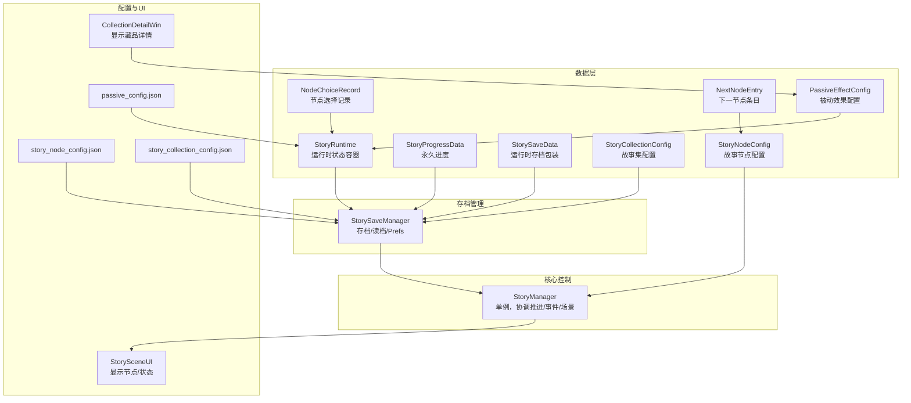
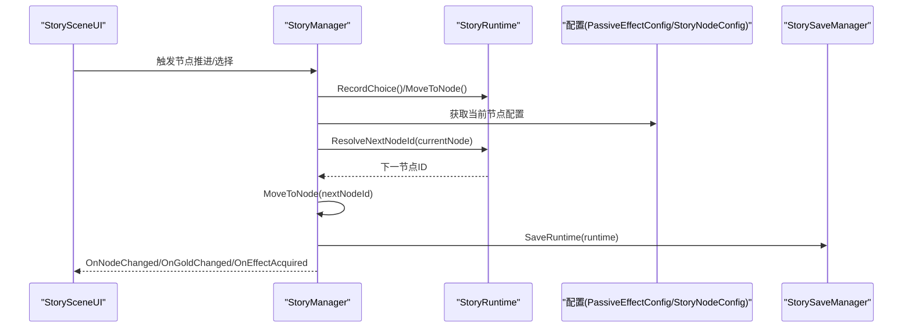
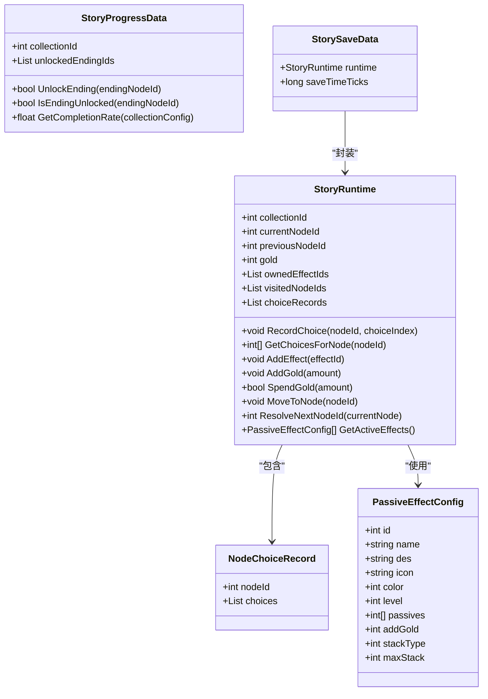
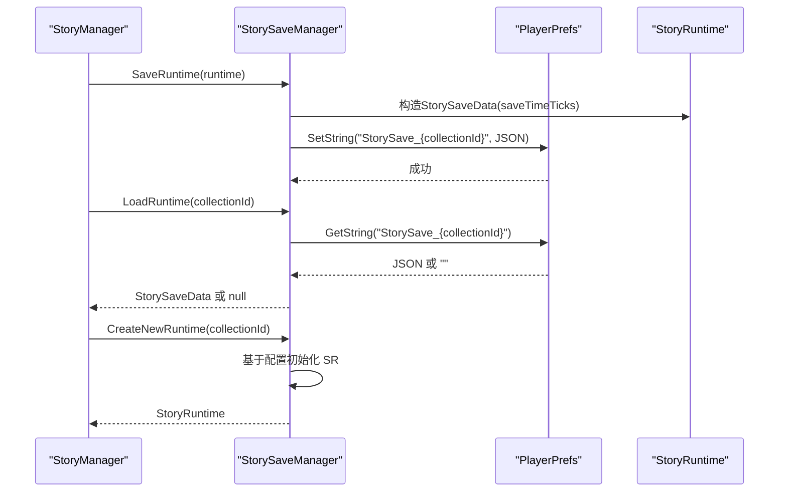
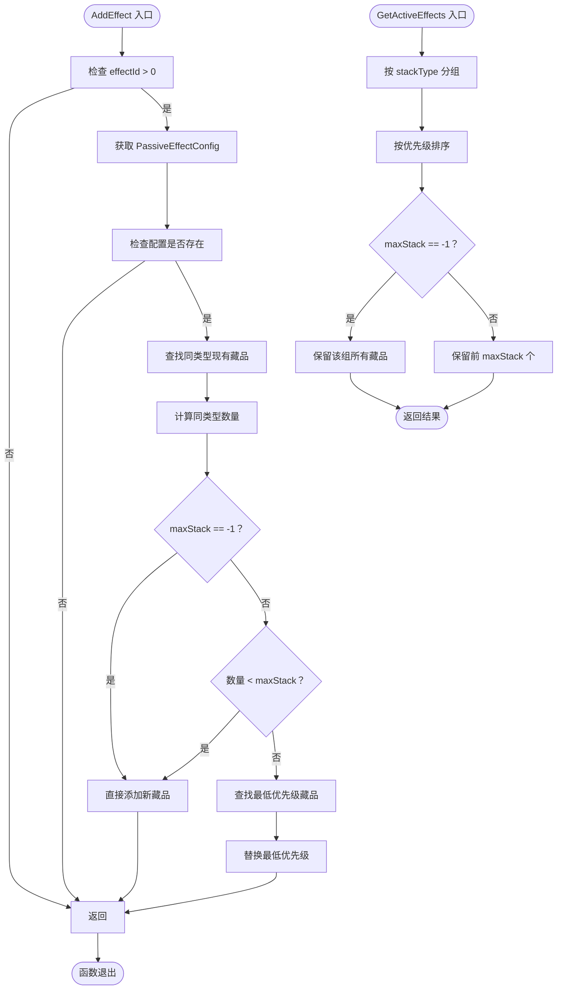
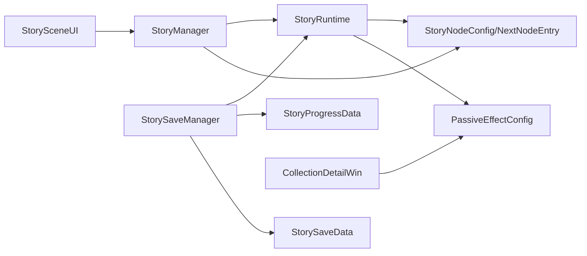

# 故事运行时系统

<cite>
**本文引用的文件**
- [StoryRuntime.cs](file://Assets/Scripts/Data/StoryRuntime.cs)
- [StorySaveManager.cs](file://Assets/Scripts/Core/StorySaveManager.cs)
- [StoryManager.cs](file://Assets/Scripts/Core/StoryManager.cs)
- [GameConfigs.cs](file://Assets/Scripts/Data/GameConfigs.cs)
- [passive_config.json](file://Assets/Resources/Configs/passive_config.json)
- [PassiveEffectConfig.cs](file://Assets/Scripts/Data/Configs/PassiveEffectConfig.cs)
- [story_node_config.json](file://Assets/Resources/Configs/story_node_config.json)
- [story_collection_config.json](file://Assets/Resources/Configs/story_collection_config.json)
- [StorySceneUI.cs](file://Assets/Scripts/UI/StorySceneUI.cs)
- [CollectionDetailWin.cs](file://Assets/Scripts/UI/Windows/CollectionDetailWin.cs)
</cite>

## 更新摘要
**变更内容**
- 更新了藏品堆叠机制部分，增加了对maxStack == -1无限制堆叠的支持说明
- 新增了无限制堆叠的配置示例和UI显示机制
- 完善了GetActiveEffects方法中无限制堆叠的处理逻辑说明

## 目录
1. [简介](#简介)
2. [项目结构](#项目结构)
3. [核心组件](#核心组件)
4. [架构总览](#架构总览)
5. [详细组件分析](#详细组件分析)
6. [依赖关系分析](#依赖关系分析)
7. [性能考量](#性能考量)
8. [故障排查指南](#故障排查指南)
9. [结论](#结论)
10. [附录](#附录)

## 简介
本技术文档围绕 GeometryTD 的故事运行时系统展开，重点阐释 StoryRuntime 类作为"一次冒险过程中的故事状态容器"的设计与职责，并深入解析运行时状态管理机制、序列化与持久化流程、故事节点解析算法、数据校验与完整性保护，以及扩展与定制指南。读者将通过图示与路径引用，快速掌握如何正确使用与扩展该系统。

**更新** 本版本增加了对maxStack == -1无限制堆叠机制的详细说明，这是本次应用变更的核心改进。

## 项目结构
故事运行时系统主要由以下模块构成：
- 数据层：StoryRuntime、StoryProgressData、StorySaveData、NodeChoiceRecord、配置类（StoryNodeConfig、NextNodeEntry、StoryCollectionConfig 等）
- 核心控制：StoryManager（单例，跨场景持久化，协调节点推进、事件、金币与藏品）
- 存档管理：StorySaveManager（基于 PlayerPrefs + JsonUtility 的存档/读档）
- 配置来源：JSON 配置（故事节点、故事集合、被动效果配置）
- UI 展示：StorySceneUI（读取 StoryManager/Runtime 显示节点与状态）、CollectionDetailWin（显示藏品详情）

**图表来源**
- [StoryRuntime.cs:11-380](file://Assets/Scripts/Data/StoryRuntime.cs#L11-L380)
- [StorySaveManager.cs:11-179](file://Assets/Scripts/Core/StorySaveManager.cs#L11-L179)
- [StoryManager.cs:12-589](file://Assets/Scripts/Core/StoryManager.cs#L12-L589)
- [PassiveEffectConfig.cs:11-30](file://Assets/Scripts/Data/Configs/PassiveEffectConfig.cs#L11-L30)
- [CollectionDetailWin.cs:120-132](file://Assets/Scripts/UI/Windows/CollectionDetailWin.cs#L120-L132)

**章节来源**
- [StoryRuntime.cs:11-380](file://Assets/Scripts/Data/StoryRuntime.cs#L11-L380)
- [StorySaveManager.cs:11-179](file://Assets/Scripts/Core/StorySaveManager.cs#L11-L179)
- [StoryManager.cs:12-589](file://Assets/Scripts/Core/StoryManager.cs#L12-L589)
- [PassiveEffectConfig.cs:11-30](file://Assets/Scripts/Data/Configs/PassiveEffectConfig.cs#L11-L30)
- [CollectionDetailWin.cs:120-132](file://Assets/Scripts/UI/Windows/CollectionDetailWin.cs#L120-L132)

## 核心组件
- StoryRuntime：承载一次冒险的全部运行时状态，支持序列化/反序列化，提供选择记录、访问历史、金币、藏品效果、节点移动与下一节点解析等能力。
- StorySaveManager：负责运行时中途存档（StorySaveData）与永久进度（StoryProgressData）的保存、读取、删除与缓存。
- StoryManager：单例，协调节点推进、事件触发、场景切换、金币与藏品系统，并通过事件通知 UI 更新。
- 配置类：StoryNodeConfig、NextNodeEntry、StoryCollectionConfig、PassiveEffectConfig 等，描述故事节点的分支、条件、默认走向与结局等。
- UI：StorySceneUI 读取 StoryManager/Runtime，驱动节点显示与过渡动画；CollectionDetailWin 显示藏品详情，包括无限制堆叠的特殊处理。

**更新** 新增了PassiveEffectConfig配置类，支持maxStack字段的配置。

**章节来源**
- [StoryRuntime.cs:11-380](file://Assets/Scripts/Data/StoryRuntime.cs#L11-L380)
- [StorySaveManager.cs:11-179](file://Assets/Scripts/Core/StorySaveManager.cs#L11-L179)
- [StoryManager.cs:12-589](file://Assets/Scripts/Core/StoryManager.cs#L12-L589)
- [PassiveEffectConfig.cs:11-30](file://Assets/Scripts/Data/Configs/PassiveEffectConfig.cs#L11-L30)
- [CollectionDetailWin.cs:120-132](file://Assets/Scripts/UI/Windows/CollectionDetailWin.cs#L120-L132)

## 架构总览
运行时系统采用"配置驱动 + 状态容器 + 存档管理 + 单例协调"的分层架构。StoryRuntime 作为状态中枢，StorySaveManager 提供持久化保障，StoryManager 统一调度业务流程，UI 通过事件感知状态变化。

**图表来源**
- [StoryManager.cs:171-253](file://Assets/Scripts/Core/StoryManager.cs#L171-L253)
- [StoryRuntime.cs:212-285](file://Assets/Scripts/Data/StoryRuntime.cs#L212-L285)
- [StorySaveManager.cs:33-48](file://Assets/Scripts/Core/StorySaveManager.cs#L33-L48)
- [StorySceneUI.cs:50-94](file://Assets/Scripts/UI/StorySceneUI.cs#L50-L94)

## 详细组件分析

### StoryRuntime 设计与状态管理
- 作为一次冒险过程中的"状态容器"，需满足完整序列化/反序列化的约束。
- 关键字段与职责
  - collectionId：标识所属故事集
  - currentNodeId：当前所在节点
  - previousNodeId：上一节点（用于过渡动画）
  - gold：局内金币（仅本次冒险有效）
  - ownedEffectIds：已获得的藏品效果ID列表（可含重复，表示叠加层数）
  - visitedNodeIds：访问历史（按顺序）
  - choiceRecords：节点选择记录（按节点聚合）
- 辅助方法
  - RecordChoice/GetChoicesForNode：记录与查询节点选择
  - AddEffect/AddGold/SpendGold：藏品与金币管理
  - MoveToNode：更新当前节点并记录访问
  - ResolveNextNodeId：根据选择记录与条件匹配下一节点

**图表来源**
- [StoryRuntime.cs:11-380](file://Assets/Scripts/Data/StoryRuntime.cs#L11-L380)
- [PassiveEffectConfig.cs:11-30](file://Assets/Scripts/Data/Configs/PassiveEffectConfig.cs#L11-L30)

**章节来源**
- [StoryRuntime.cs:11-380](file://Assets/Scripts/Data/StoryRuntime.cs#L11-L380)

### 运行时状态序列化与持久化
- 运行时存档（中途存档/继续）：StorySaveData 包裹 StoryRuntime 与时间戳，使用 JsonUtility 序列化后写入 PlayerPrefs。
- 永久进度：StoryProgressSaveData 包含多个 StoryProgressData，记录各故事集的已解锁结局，同样以 JSON 形式持久化。
- 生命周期
  - 创建新运行时：CreateNewRuntime 基于 StoryCollectionConfig 初始化起始节点与基础状态
  - 保存：SaveRuntime 每次选择或节点变更后调用
  - 读取：LoadRuntime 返回存档或 null
  - 删除：DeleteRuntimeSave 清理存档
  - 永久进度：GetProgress/UnlockEnding/SaveProgress

**图表来源**
- [StorySaveManager.cs:33-100](file://Assets/Scripts/Core/StorySaveManager.cs#L33-L100)
- [StoryManager.cs:96-130](file://Assets/Scripts/Core/StoryManager.cs#L96-L130)

**章节来源**
- [StorySaveManager.cs:11-179](file://Assets/Scripts/Core/StorySaveManager.cs#L11-L179)
- [StoryManager.cs:96-130](file://Assets/Scripts/Core/StoryManager.cs#L96-L130)

### 故事节点解析算法：ResolveNextNodeId
- 输入：当前节点配置（StoryNodeConfig）
- 输出：下一节点ID；若无法匹配默认返回 defaultNextNodeId，仍不可得则返回 0
- 解析策略
  - 若节点无 nextNodes，则直接返回 defaultNextNodeId
  - 读取当前节点的选择记录（GetChoicesForNode），逐条匹配 nextNodes 中的 NextNodeEntry.conditions
  - 匹配规则
    - conditions 中的 0 为通配符，任意匹配
    - 非 0 条件必须与玩家在对应选项组的选择索引严格相等
    - 匹配成功后按"精确匹配条件数"打分，取最高分者
    - 若无精确匹配，回退到 conditions 全为 0 的条目
    - 若仍无可选条目，返回 defaultNextNodeId
- 异常与边界
  - currentNode 为空返回 0
  - 无匹配且无默认返回 0（调用方需处理）

**图表来源**
- [StoryRuntime.cs:212-285](file://Assets/Scripts/Data/StoryRuntime.cs#L212-L285)

**章节来源**
- [StoryRuntime.cs:212-285](file://Assets/Scripts/Data/StoryRuntime.cs#L212-L285)

### 藏品堆叠机制：maxStack == -1 无限制堆叠
**更新** 这是本次应用变更的核心改进，增加了对无限制堆叠的支持。

- 背景与需求
  - 传统堆叠机制通过 maxStack 限制同类型藏品的最大生效数量
  - 新增 maxStack == -1 支持无限制堆叠，适用于特殊强力藏品
- AddEffect 方法中的堆叠逻辑
  - 首先获取同类型的现有藏品列表
  - 检查是否达到堆叠限制：`sameTypeIndices.Count < newConfig.maxStack`
  - 特殊处理：当 `newConfig.maxStack == -1` 时，表示无限制堆叠，直接添加
  - 未达到限制时直接添加新藏品
  - 达到限制时，按颜色和等级优先级替换最低优先级的藏品
- GetActiveEffects 方法中的生效逻辑
  - 按 stackType 分组处理所有藏品
  - 对每组按颜色和等级降序排序
  - 特殊处理：当 `maxStack == -1` 时，保留该组的所有藏品
  - 否则只保留前 maxStack 个最高优先级的藏品
- 优先级计算规则
  - 优先级分数 = color * 100 + level
  - 颜色优先于等级，颜色相同时比较等级
  - 数值越大表示优先级越高
- UI 显示机制
  - CollectionDetailWin 中检测 maxStack == -1
  - 显示"无生效限制"文本而非具体数值

**图表来源**
- [StoryRuntime.cs:61-113](file://Assets/Scripts/Data/StoryRuntime.cs#L61-L113)
- [StoryRuntime.cs:118-175](file://Assets/Scripts/Data/StoryRuntime.cs#L118-L175)
- [CollectionDetailWin.cs:122-131](file://Assets/Scripts/UI/Windows/CollectionDetailWin.cs#L122-L131)

**章节来源**
- [StoryRuntime.cs:61-113](file://Assets/Scripts/Data/StoryRuntime.cs#L61-L113)
- [StoryRuntime.cs:118-175](file://Assets/Scripts/Data/StoryRuntime.cs#L118-L175)
- [CollectionDetailWin.cs:122-131](file://Assets/Scripts/UI/Windows/CollectionDetailWin.cs#L122-L131)

### 运行时数据验证与完整性保护
- 空引用处理
  - ResolveNextNodeId 对 currentNode 与 nextNodes/conditions 进行判空
  - RecordChoice/MoveToNode/ResolveNextNodeId 前均进行 null 检查
- 边界条件保护
  - SpendGold 对 amount<=0 直接返回成功，避免负支出
  - AddEffect 对 effectId<=0 与配置缺失进行早退
  - visitedNodeIds 去重插入，避免重复记录
  - 选择记录按节点聚合，避免重复覆盖
  - **新增**：maxStack == -1 的特殊处理，确保无限制堆叠的正确性
- 完整性保障
  - 使用 JsonUtility 序列化/反序列化，保证跨平台一致性
  - 运行时存档在关键节点变更后立即保存，降低丢失风险
  - 永久进度独立存储，不受单次冒险影响

**章节来源**
- [StoryRuntime.cs:61-113](file://Assets/Scripts/Data/StoryRuntime.cs#L61-L113)
- [StoryRuntime.cs:190-206](file://Assets/Scripts/Data/StoryRuntime.cs#L190-L206)
- [StorySaveManager.cs:33-75](file://Assets/Scripts/Core/StorySaveManager.cs#L33-L75)

### 扩展指南：新增状态字段与自定义状态管理
- 新增运行时字段
  - 在 StoryRuntime 中添加字段（如新的资源、临时标记）
  - 如需持久化，确保字段可被 JsonUtility 序列化（public、可序列化类型）
  - 在 CreateNewRuntime 中初始化默认值
  - 在 SaveRuntime/LoadRuntime 流程中无需额外改动（由 StorySaveData 包裹）
- 修改数据结构
  - 若需拆分/合并记录结构，调整 NodeChoiceRecord 或引入新记录类型
  - 更新 ResolveNextNodeId 的匹配逻辑以适配新结构
- 自定义状态管理功能
  - 在 StoryManager 中新增事件与回调，驱动 UI 或其他系统
  - 通过 StorySaveManager 的 SaveRuntime/LoadRuntime 保持与现有存档兼容
- **新增**：无限制堆叠配置
  - 在 passive_config.json 中设置 `maxStack: -1` 表示无限制堆叠
  - 确保 UI 正确显示"无生效限制"文本
  - 验证 GetActiveEffects 方法的无限制处理逻辑

**章节来源**
- [StorySaveManager.cs:77-100](file://Assets/Scripts/Core/StorySaveManager.cs#L77-L100)
- [StoryRuntime.cs:212-285](file://Assets/Scripts/Data/StoryRuntime.cs#L212-L285)
- [passive_config.json:1-24](file://Assets/Resources/Configs/passive_config.json#L1-L24)

### 实际使用场景与代码示例路径
- 开始/继续/结束冒险
  - 开始新冒险：[StoryManager.cs:96-114](file://Assets/Scripts/Core/StoryManager.cs#L96-L114)
  - 继续冒险：[StoryManager.cs:116-130](file://Assets/Scripts/Core/StoryManager.cs#L116-L130)
  - 结束冒险：[StoryManager.cs:132-155](file://Assets/Scripts/Core/StoryManager.cs#L132-L155)
- 节点推进与选择处理
  - 推进到下一节点：[StoryManager.cs:171-186](file://Assets/Scripts/Core/StoryManager.cs#L171-L186)
  - 处理选择并发放奖励：[StoryManager.cs:275-297](file://Assets/Scripts/Core/StoryManager.cs#L275-L297)
- 金币与藏品系统
  - 增加金币/消费金币：[StoryManager.cs:330-354](file://Assets/Scripts/Core/StoryManager.cs#L330-L354)
  - 购买藏品：[StoryManager.cs:357-365](file://Assets/Scripts/Core/StoryManager.cs#L357-L365)
- **新增**：无限制堆叠使用场景
  - 添加无限制堆叠藏品：[StoryRuntime.cs:61-113](file://Assets/Scripts/Data/StoryRuntime.cs#L61-L113)
  - 获取生效藏品列表：[StoryRuntime.cs:118-175](file://Assets/Scripts/Data/StoryRuntime.cs#L118-L175)
  - UI 显示无限制堆叠：[CollectionDetailWin.cs:122-131](file://Assets/Scripts/UI/Windows/CollectionDetailWin.cs#L122-L131)
- UI 展示与事件
  - UI 订阅事件并刷新显示：[StorySceneUI.cs:50-94](file://Assets/Scripts/UI/StorySceneUI.cs#L50-L94)
  - 过渡动画与节点切换：[StorySceneUI.cs:260-320](file://Assets/Scripts/UI/StorySceneUI.cs#L260-L320)

**章节来源**
- [StoryManager.cs:96-186](file://Assets/Scripts/Core/StoryManager.cs#L96-L186)
- [StoryManager.cs:275-365](file://Assets/Scripts/Core/StoryManager.cs#L275-L365)
- [StoryRuntime.cs:61-175](file://Assets/Scripts/Data/StoryRuntime.cs#L61-L175)
- [CollectionDetailWin.cs:122-131](file://Assets/Scripts/UI/Windows/CollectionDetailWin.cs#L122-L131)
- [StorySceneUI.cs:50-94](file://Assets/Scripts/UI/StorySceneUI.cs#L50-L94)
- [StorySceneUI.cs:260-320](file://Assets/Scripts/UI/StorySceneUI.cs#L260-L320)

## 依赖关系分析
- StoryRuntime 依赖配置类（NextNodeEntry、StoryNodeConfig、PassiveEffectConfig）进行节点解析和堆叠管理
- StoryManager 依赖 StoryRuntime 与 ConfigManager（间接）进行节点推进与事件处理
- StorySaveManager 依赖 StoryRuntime/StoryProgressData/StorySaveData 进行持久化
- UI 依赖 StoryManager/Runtime 进行状态展示与交互
- **新增**：CollectionDetailWin 依赖 PassiveEffectConfig 进行 UI 显示

**图表来源**
- [StoryRuntime.cs:212-285](file://Assets/Scripts/Data/StoryRuntime.cs#L212-L285)
- [StoryRuntime.cs:61-175](file://Assets/Scripts/Data/StoryRuntime.cs#L61-L175)
- [StoryManager.cs:171-253](file://Assets/Scripts/Core/StoryManager.cs#L171-L253)
- [StorySaveManager.cs:33-100](file://Assets/Scripts/Core/StorySaveManager.cs#L33-L100)
- [CollectionDetailWin.cs:122-131](file://Assets/Scripts/UI/Windows/CollectionDetailWin.cs#L122-L131)

**章节来源**
- [StoryRuntime.cs:212-285](file://Assets/Scripts/Data/StoryRuntime.cs#L212-L285)
- [StoryRuntime.cs:61-175](file://Assets/Scripts/Data/StoryRuntime.cs#L61-L175)
- [StoryManager.cs:171-253](file://Assets/Scripts/Core/StoryManager.cs#L171-L253)
- [StorySaveManager.cs:33-100](file://Assets/Scripts/Core/StorySaveManager.cs#L33-L100)
- [CollectionDetailWin.cs:122-131](file://Assets/Scripts/UI/Windows/CollectionDetailWin.cs#L122-L131)

## 性能考量
- 选择记录与匹配
  - ResolveNextNodeId 对 nextNodes 进行线性扫描，复杂度 O(N*M)，其中 N 为条目数，M 为条件长度
  - 建议控制每个节点的分支数与条件长度，避免过度膨胀
- 数据结构
  - visitedNodeIds 与 ownedEffectIds 为线性结构，操作成本低
  - choiceRecords 按节点聚合，查找效率高
  - **新增**：无限制堆叠不影响性能，因为 AddEffect 和 GetActiveEffects 仍保持线性复杂度
- 序列化与 I/O
  - JsonUtility 序列化开销较小，建议在节点变更或选择后异步保存（当前实现为同步）
- UI 刷新
  - 通过事件驱动 UI 更新，避免轮询，降低 UI 线程压力
  - **新增**：CollectionDetailWin 的 UI 更新考虑了无限制堆叠的特殊显示逻辑

## 故障排查指南
- 无法解析下一节点
  - 现象：AdvanceToNextNode 后日志报错"无法解析下一节点"
  - 排查：确认 StoryNodeConfig 的 nextNodes 是否为空；核对条件数组与选择记录长度；检查 defaultNextNodeId 是否配置
  - 参考：[StoryRuntime.cs:212-285](file://Assets/Scripts/Data/StoryRuntime.cs#L212-L285)
- 无存档可继续
  - 现象：ContinueAdventure 返回 false
  - 排查：检查 PlayerPrefs 中是否存在对应键；确认 collectionId 是否正确
  - 参考：[StorySaveManager.cs:51-67](file://Assets/Scripts/Core/StorySaveManager.cs#L51-L67)
- **新增**：无限制堆叠异常
  - 现象：maxStack == -1 的藏品无法正常堆叠或显示异常
  - 排查：确认 passive_config.json 中 maxStack 设置为 -1；检查 AddEffect 和 GetActiveEffects 的逻辑；验证 UI 显示是否正确
  - 参考：[StoryRuntime.cs:61-113](file://Assets/Scripts/Data/StoryRuntime.cs#L61-L113)
  - 参考：[StoryRuntime.cs:118-175](file://Assets/Scripts/Data/StoryRuntime.cs#L118-L175)
  - 参考：[CollectionDetailWin.cs:122-131](file://Assets/Scripts/UI/Windows/CollectionDetailWin.cs#L122-L131)
- 藏品叠加异常
  - 现象：AddEffect 未生效或层数异常
  - 排查：确认 PassiveEffectConfig 的 stackable 与 maxStack；检查 ownedEffectIds 中是否已满
  - 参考：[StoryRuntime.cs:61-113](file://Assets/Scripts/Data/StoryRuntime.cs#L61-L113)
- 金币消费失败
  - 现象：SpendGold 返回 false
  - 排查：确认 amount>0 且 gold 足够
  - 参考：[StoryRuntime.cs:190-206](file://Assets/Scripts/Data/StoryRuntime.cs#L190-L206)

**章节来源**
- [StoryRuntime.cs:212-285](file://Assets/Scripts/Data/StoryRuntime.cs#L212-L285)
- [StorySaveManager.cs:51-67](file://Assets/Scripts/Core/StorySaveManager.cs#L51-L67)
- [StoryRuntime.cs:61-113](file://Assets/Scripts/Data/StoryRuntime.cs#L61-L113)
- [StoryRuntime.cs:190-206](file://Assets/Scripts/Data/StoryRuntime.cs#L190-L206)
- [CollectionDetailWin.cs:122-131](file://Assets/Scripts/UI/Windows/CollectionDetailWin.cs#L122-L131)

## 结论
StoryRuntime 以简洁的数据结构与明确的职责划分，构建了可序列化、可扩展、可持久化的运行时状态容器。配合 StorySaveManager 的存档机制与 StoryManager 的统一调度，系统实现了从节点推进、事件触发到 UI 展示的完整闭环。

**更新** 本次应用变更显著增强了藏品系统的灵活性，通过支持 maxStack == -1 的无限制堆叠机制，为游戏平衡性和玩家体验提供了更精细的控制。新增的配置项和 UI 显示逻辑确保了系统的完整性和用户友好性。

通过合理的边界保护与清晰的扩展路径，开发者可在不破坏现有流程的前提下，安全地添加新状态字段、自定义逻辑以及支持无限制堆叠的特殊藏品。

## 附录
- 配置文件说明
  - 故事节点配置：描述节点类型、默认走向、失败节点、分支与条件
    - 示例路径：[story_node_config.json:1-200](file://Assets/Resources/Configs/story_node_config.json#L1-L200)
  - 故事集合配置：描述起始节点与结局节点集合
    - 示例路径：[story_collection_config.json:1-21](file://Assets/Resources/Configs/story_collection_config.json#L1-L21)
  - **新增**：被动效果配置：描述藏品的属性、堆叠类型、最大堆叠数量等
    - 示例路径：[passive_config.json:1-24](file://Assets/Resources/Configs/passive_config.json#L1-L24)
    - 配置类定义：[PassiveEffectConfig.cs:11-30](file://Assets/Scripts/Data/Configs/PassiveEffectConfig.cs#L11-L30)
- 关键配置类定义
  - StoryNodeConfig/NextNodeEntry/StoryCollectionConfig
    - 示例路径：[GameConfigs.cs:615-775](file://Assets/Scripts/Data/GameConfigs.cs#L615-L775)
  - **新增**：PassiveEffectConfig
    - 示例路径：[PassiveEffectConfig.cs:11-30](file://Assets/Scripts/Data/Configs/PassiveEffectConfig.cs#L11-L30)
- **新增**：无限制堆叠配置示例
  - 在 passive_config.json 中设置 `"maxStack": -1` 表示该藏品无限制堆叠
  - UI 将自动显示"无生效限制"文本
  - GetActiveEffects 方法会返回该组的所有藏品，不受 maxStack 限制