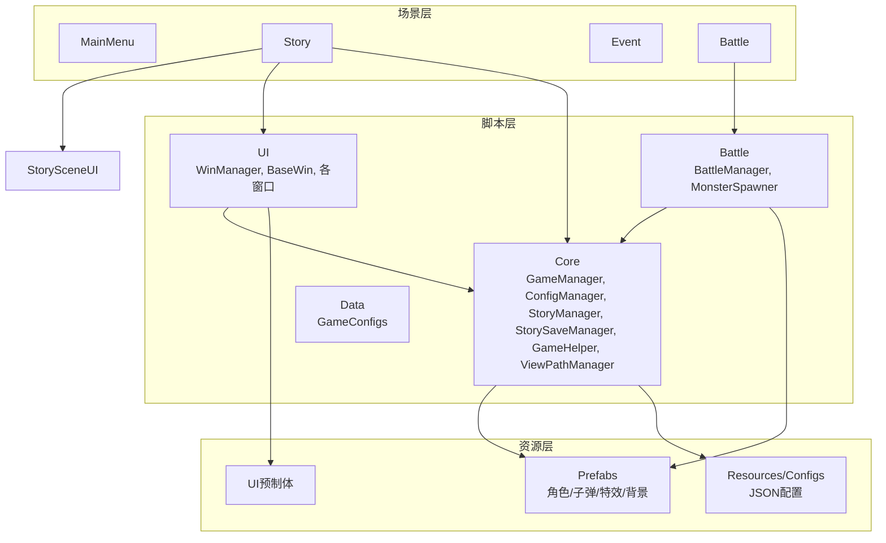
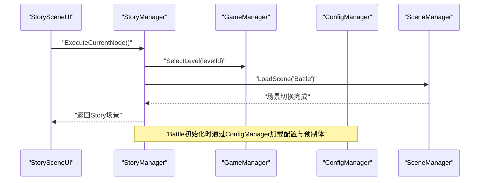
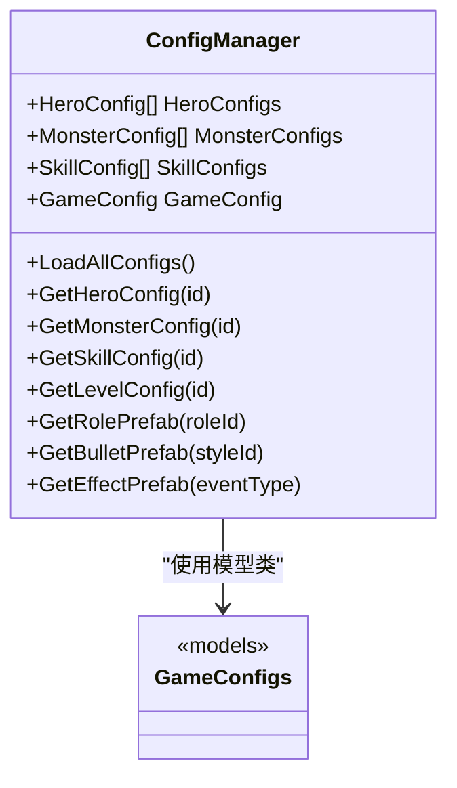
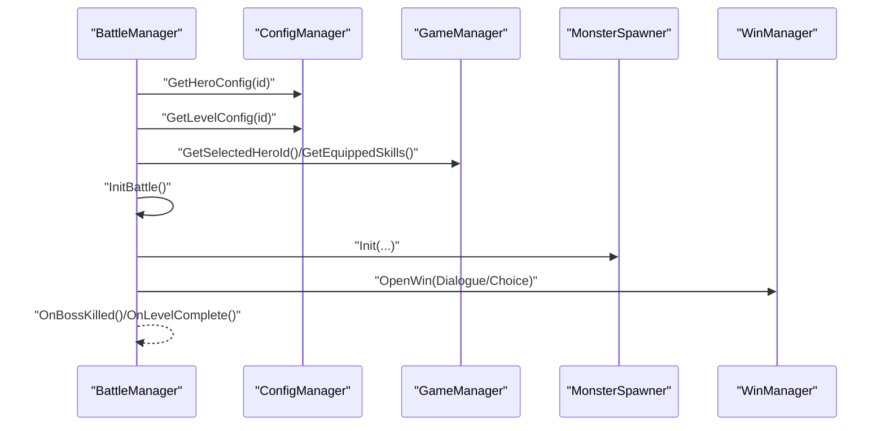
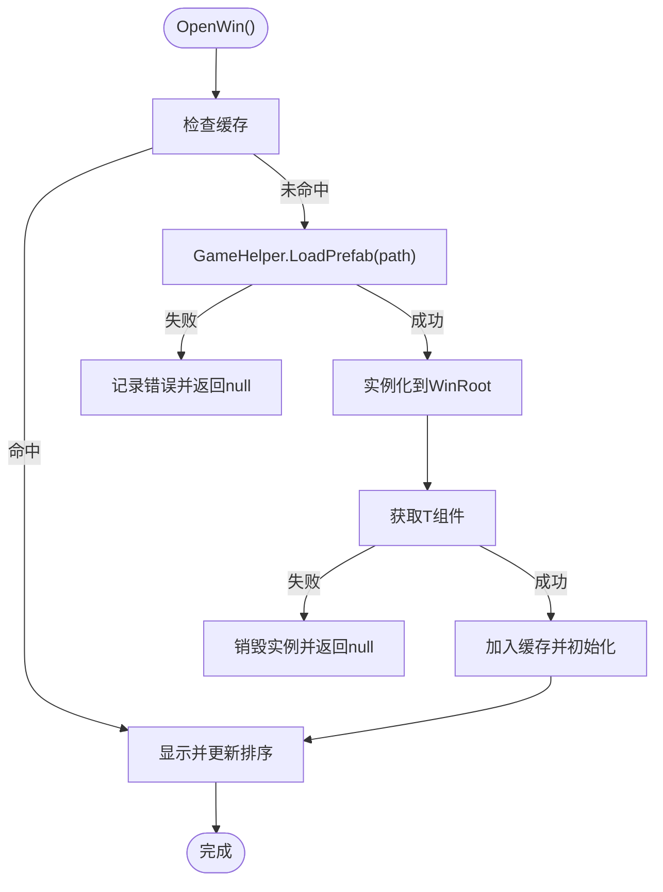
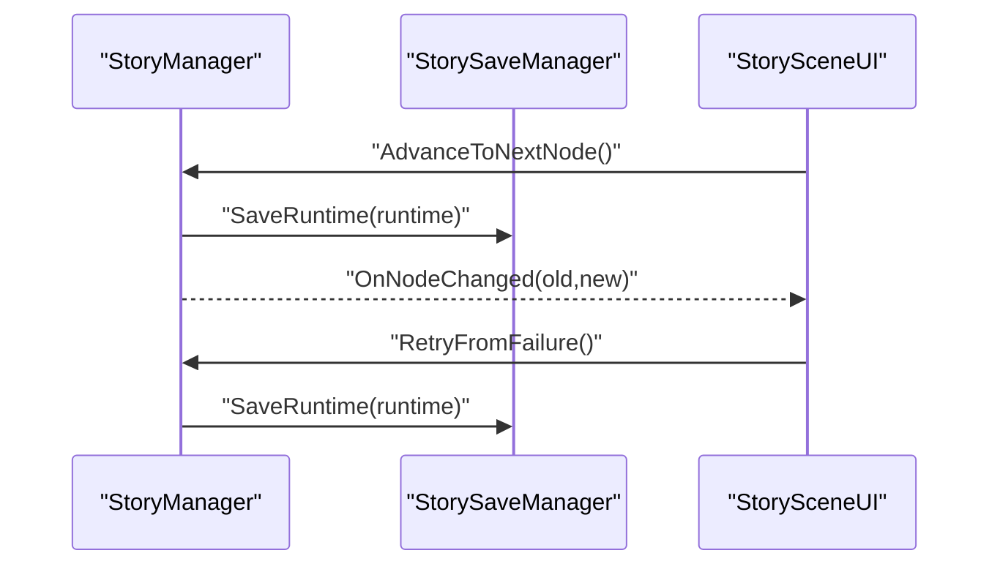
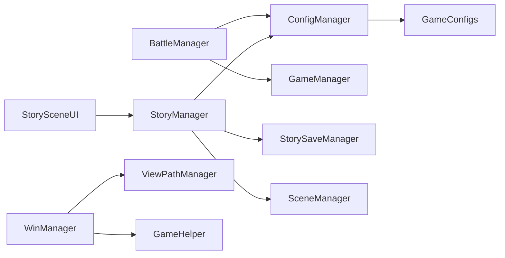

# 故障排除

<cite>
**本文引用的文件**
- [GameManager.cs](file://Assets/Scripts/Core/GameManager.cs)
- [ConfigManager.cs](file://Assets/Scripts/Core/ConfigManager.cs)
- [GameConfigs.cs](file://Assets/Scripts/Data/GameConfigs.cs)
- [BattleManager.cs](file://Assets/Scripts/Battle/BattleManager.cs)
- [StoryManager.cs](file://Assets/Scripts/Core/StoryManager.cs)
- [StorySaveManager.cs](file://Assets/Scripts/Core/StorySaveManager.cs)
- [WinManager.cs](file://Assets/Scripts/UI/WinManager.cs)
- [BaseWin.cs](file://Assets/Scripts/UI/BaseWin.cs)
- [ViewPathManager.cs](file://Assets/Scripts/Core/ViewPathManager.cs)
- [MonsterSpawner.cs](file://Assets/Scripts/Battle/MonsterSpawner.cs)
- [GameHelper.cs](file://Assets/Scripts/Core/GameHelper.cs)
- [StorySceneUI.cs](file://Assets/Scripts/UI/StorySceneUI.cs)
- [level_config.json](file://Assets/Resources/Configs/level_config.json)
- [game_config.json](file://Assets/Resources/Configs/game_config.json)
- [SceneTemplateSettings.json](file://ProjectSettings/SceneTemplateSettings.json)
</cite>

## 目录
1. [简介](#简介)
2. [项目结构](#项目结构)
3. [核心组件](#核心组件)
4. [架构总览](#架构总览)
5. [详细组件分析](#详细组件分析)
6. [依赖分析](#依赖分析)
7. [性能考虑](#性能考虑)
8. [故障排除指南](#故障排除指南)
9. [结论](#结论)
10. [附录](#附录)

## 简介
本指南面向GeometryTD项目的开发者与运维人员，聚焦于开发与运行期常见问题的定位与修复，涵盖Unity版本兼容性、配置文件加载失败、场景切换异常、UI窗口打开失败、战斗流程中断、存档与进度丢失、性能瓶颈识别与优化等主题。文档同时提供调试技巧、工具使用建议、错误诊断方法论、预防性措施与最佳实践，并给出具体错误案例与解决方案示例。

## 项目结构
项目采用“脚本-资源-场景”三层组织方式：
- 脚本层：Core（游戏核心）、Battle（战斗系统）、UI（界面）、Data（配置模型）
- 资源层：Resources/Configs（JSON配置）、UI预制体、角色/子弹/特效预制体
- 场景层：MainMenu、Story、Event、Battle

图表来源
- [GameManager.cs:1-239](file://Assets/Scripts/Core/GameManager.cs#L1-L239)
- [ConfigManager.cs:1-619](file://Assets/Scripts/Core/ConfigManager.cs#L1-L619)
- [BattleManager.cs:1-805](file://Assets/Scripts/Battle/BattleManager.cs#L1-L805)
- [StoryManager.cs:1-589](file://Assets/Scripts/Core/StoryManager.cs#L1-L589)
- [WinManager.cs:1-195](file://Assets/Scripts/UI/WinManager.cs#L1-L195)
- [GameConfigs.cs:1-775](file://Assets/Scripts/Data/GameConfigs.cs#L1-L775)
- [StorySceneUI.cs:1-48](file://Assets/Scripts/UI/StorySceneUI.cs#L1-L48)

章节来源
- [GameManager.cs:1-239](file://Assets/Scripts/Core/GameManager.cs#L1-L239)
- [ConfigManager.cs:1-619](file://Assets/Scripts/Core/ConfigManager.cs#L1-L619)
- [BattleManager.cs:1-805](file://Assets/Scripts/Battle/BattleManager.cs#L1-L805)
- [StoryManager.cs:1-589](file://Assets/Scripts/Core/StoryManager.cs#L1-L589)
- [WinManager.cs:1-195](file://Assets/Scripts/UI/WinManager.cs#L1-L195)
- [GameConfigs.cs:1-775](file://Assets/Scripts/Data/GameConfigs.cs#L1-L775)
- [StorySceneUI.cs:1-48](file://Assets/Scripts/UI/StorySceneUI.cs#L1-L48)

## 核心组件
- GameManager：全局状态与持久化（关卡完成、英雄选择、技能/奥术编队）
- ConfigManager：集中加载与索引所有JSON配置，缓存预制体，提供查询接口
- StoryManager：故事集生命周期管理（开始/继续/推进/结束），与战斗场景联动
- StorySaveManager：运行时中途存档与永久进度存档
- BattleManager：战斗初始化、怪物生成、技能/奥术系统、Boss事件链
- WinManager：UI窗口管理（实例化、排序、遮罩）
- GameHelper：资源加载、字体加载、场景切换
- GameConfigs：配置数据模型定义（属性、事件、Buff、Passive、关卡等）

章节来源
- [GameManager.cs:1-239](file://Assets/Scripts/Core/GameManager.cs#L1-L239)
- [ConfigManager.cs:1-619](file://Assets/Scripts/Core/ConfigManager.cs#L1-L619)
- [StoryManager.cs:1-589](file://Assets/Scripts/Core/StoryManager.cs#L1-L589)
- [StorySaveManager.cs:1-179](file://Assets/Scripts/Core/StorySaveManager.cs#L1-L179)
- [BattleManager.cs:1-805](file://Assets/Scripts/Battle/BattleManager.cs#L1-L805)
- [WinManager.cs:1-195](file://Assets/Scripts/UI/WinManager.cs#L1-L195)
- [GameHelper.cs:1-84](file://Assets/Scripts/Core/GameHelper.cs#L1-L84)
- [GameConfigs.cs:1-775](file://Assets/Scripts/Data/GameConfigs.cs#L1-L775)

## 架构总览
下图展示了从故事场景到战斗场景的关键流程，以及配置与资源加载路径。

图表来源
- [StorySceneUI.cs:1-48](file://Assets/Scripts/UI/StorySceneUI.cs#L1-L48)
- [StoryManager.cs:539-560](file://Assets/Scripts/Core/StoryManager.cs#L539-L560)
- [GameManager.cs:46-63](file://Assets/Scripts/Core/GameManager.cs#L46-L63)
- [ConfigManager.cs:77-122](file://Assets/Scripts/Core/ConfigManager.cs#L77-L122)

## 详细组件分析

### 组件A：配置加载与查询（ConfigManager）
- 职责：集中加载所有JSON配置，构建查找表，缓存预制体，提供统一查询接口
- 关键点：
  - 通过Resources.Load加载配置文本，再用JsonUtility反序列化
  - 大量Debug.LogError/Warning用于定位缺失或错误配置
  - 预制体缓存：子弹、特效、角色，避免重复加载
  - 查询失败时返回null或默认值，调用方需判空

图表来源
- [ConfigManager.cs:1-619](file://Assets/Scripts/Core/ConfigManager.cs#L1-L619)
- [GameConfigs.cs:1-775](file://Assets/Scripts/Data/GameConfigs.cs#L1-L775)

章节来源
- [ConfigManager.cs:77-122](file://Assets/Scripts/Core/ConfigManager.cs#L77-L122)
- [ConfigManager.cs:200-215](file://Assets/Scripts/Core/ConfigManager.cs#L200-L215)
- [ConfigManager.cs:169-198](file://Assets/Scripts/Core/ConfigManager.cs#L169-L198)
- [ConfigManager.cs:316-330](file://Assets/Scripts/Core/ConfigManager.cs#L316-L330)
- [ConfigManager.cs:350-370](file://Assets/Scripts/Core/ConfigManager.cs#L350-L370)

### 组件B：战斗初始化与流程（BattleManager）
- 职责：根据关卡与英雄配置初始化战斗，管理怪物生成、技能经验、Boss事件链
- 关键点：
  - 依赖ConfigManager与GameManager提供的配置与选择
  - 通过GameHelper加载背景与角色预制体
  - 通过WinManager打开对话/选择窗口
  - 结束时标记关卡完成并暂停时间

图表来源
- [BattleManager.cs:145-275](file://Assets/Scripts/Battle/BattleManager.cs#L145-L275)
- [BattleManager.cs:640-704](file://Assets/Scripts/Battle/BattleManager.cs#L640-L704)
- [BattleManager.cs:771-786](file://Assets/Scripts/Battle/BattleManager.cs#L771-L786)

章节来源
- [BattleManager.cs:145-275](file://Assets/Scripts/Battle/BattleManager.cs#L145-L275)
- [BattleManager.cs:640-704](file://Assets/Scripts/Battle/BattleManager.cs#L640-L704)
- [BattleManager.cs:771-786](file://Assets/Scripts/Battle/BattleManager.cs#L771-L786)

### 组件C：UI窗口管理（WinManager）
- 职责：按类型缓存与实例化窗口，设置排序与遮罩，支持关闭/销毁/全关
- 关键点：
  - 通过ViewPathManager与GameHelper加载预制体
  - 缺少组件或预制体会记录错误日志
  - 保证全屏遮罩以阻断点击穿透

图表来源
- [WinManager.cs:61-102](file://Assets/Scripts/UI/WinManager.cs#L61-L102)
- [WinManager.cs:157-186](file://Assets/Scripts/UI/WinManager.cs#L157-L186)
- [ViewPathManager.cs:25-30](file://Assets/Scripts/Core/ViewPathManager.cs#L25-L30)
- [GameHelper.cs:31-47](file://Assets/Scripts/Core/GameHelper.cs#L31-L47)

章节来源
- [WinManager.cs:61-102](file://Assets/Scripts/UI/WinManager.cs#L61-L102)
- [WinManager.cs:157-186](file://Assets/Scripts/UI/WinManager.cs#L157-L186)
- [ViewPathManager.cs:25-30](file://Assets/Scripts/Core/ViewPathManager.cs#L25-L30)
- [GameHelper.cs:31-47](file://Assets/Scripts/Core/GameHelper.cs#L31-L47)

### 组件D：故事场景与节点推进（StoryManager/StorySaveManager）
- 职责：故事集生命周期、节点推进、Boss事件链、存档与进度
- 关键点：
  - 运行时存档：每做一次选择即保存
  - 永久进度：结局解锁、完成度统计
  - 失败重试：回到失败前节点，清空该节点选择记录

图表来源
- [StoryManager.cs:171-186](file://Assets/Scripts/Core/StoryManager.cs#L171-L186)
- [StoryManager.cs:223-242](file://Assets/Scripts/Core/StoryManager.cs#L223-L242)
- [StorySaveManager.cs:34-48](file://Assets/Scripts/Core/StorySaveManager.cs#L34-L48)

章节来源
- [StoryManager.cs:171-186](file://Assets/Scripts/Core/StoryManager.cs#L171-L186)
- [StoryManager.cs:223-242](file://Assets/Scripts/Core/StoryManager.cs#L223-L242)
- [StorySaveManager.cs:34-48](file://Assets/Scripts/Core/StorySaveManager.cs#L34-L48)

## 依赖分析
- ConfigManager依赖Resources下的JSON配置与Resources/Prefabs目录
- BattleManager依赖ConfigManager与GameManager
- StoryManager依赖ConfigManager与StorySaveManager
- WinManager依赖ViewPathManager与GameHelper
- Scene切换通过GameHelper/StoryManager/SceneManager实现

图表来源
- [ConfigManager.cs:77-122](file://Assets/Scripts/Core/ConfigManager.cs#L77-L122)
- [BattleManager.cs:145-275](file://Assets/Scripts/Battle/BattleManager.cs#L145-L275)
- [StoryManager.cs:96-130](file://Assets/Scripts/Core/StoryManager.cs#L96-L130)
- [StorySaveManager.cs:78-100](file://Assets/Scripts/Core/StorySaveManager.cs#L78-L100)
- [WinManager.cs:61-102](file://Assets/Scripts/UI/WinManager.cs#L61-L102)
- [ViewPathManager.cs:25-30](file://Assets/Scripts/Core/ViewPathManager.cs#L25-L30)
- [GameHelper.cs:77-81](file://Assets/Scripts/Core/GameHelper.cs#L77-L81)
- [StorySceneUI.cs:39-47](file://Assets/Scripts/UI/StorySceneUI.cs#L39-L47)

章节来源
- [ConfigManager.cs:77-122](file://Assets/Scripts/Core/ConfigManager.cs#L77-L122)
- [BattleManager.cs:145-275](file://Assets/Scripts/Battle/BattleManager.cs#L145-L275)
- [StoryManager.cs:96-130](file://Assets/Scripts/Core/StoryManager.cs#L96-L130)
- [StorySaveManager.cs:78-100](file://Assets/Scripts/Core/StorySaveManager.cs#L78-L100)
- [WinManager.cs:61-102](file://Assets/Scripts/UI/WinManager.cs#L61-L102)
- [ViewPathManager.cs:25-30](file://Assets/Scripts/Core/ViewPathManager.cs#L25-L30)
- [GameHelper.cs:77-81](file://Assets/Scripts/Core/GameHelper.cs#L77-L81)
- [StorySceneUI.cs:39-47](file://Assets/Scripts/UI/StorySceneUI.cs#L39-L47)

## 性能考虑
- 配置加载
  - 首次加载所有配置，后续通过字典索引查询，时间复杂度O(1)，注意避免在热路径重复加载
  - 预制体缓存：子弹、特效、角色，减少Resources.Load开销
- 战斗生成
  - MonsterSpawner按固定间隔生成，注意spawn_interval与hard_multiplier对性能的影响
  - 大量敌人与特效同时存在时，建议降低特效数量或使用对象池
- UI窗口
  - WinManager缓存窗口实例，避免频繁Instantiate
  - 全屏遮罩与GraphicRaycaster确保交互正确，但会增加渲染开销，建议仅在必要时启用
- 时间控制
  - 战斗结束时暂停Time.timeScale，避免后台逻辑继续执行

章节来源
- [ConfigManager.cs:169-198](file://Assets/Scripts/Core/ConfigManager.cs#L169-L198)
- [MonsterSpawner.cs:55-66](file://Assets/Scripts/Battle/MonsterSpawner.cs#L55-L66)
- [WinManager.cs:157-186](file://Assets/Scripts/UI/WinManager.cs#L157-L186)
- [BattleManager.cs:781-785](file://Assets/Scripts/Battle/BattleManager.cs#L781-L785)

## 故障排除指南

### 一、Unity版本兼容性问题
- 现象
  - 编译报错：SceneTemplateSettings.json中某些类型未找到或默认实例化模式不匹配
- 排查步骤
  - 检查ProjectSettings/SceneTemplateSettings.json中依赖类型是否存在
  - 若使用较新Unity版本，确认类型名称与默认实例化模式是否变更
- 解决方案
  - 在Unity编辑器中重新导入项目，或手动修正SceneTemplateSettings.json中的type字段
  - 如涉及自定义模板，确保依赖类型存在于当前Unity版本

章节来源
- [SceneTemplateSettings.json:1-121](file://ProjectSettings/SceneTemplateSettings.json#L1-L121)

### 二、配置文件加载失败
- 现象
  - 控制台出现“无法加载配置文件”“配置文件解析失败”等错误
- 排查步骤
  - 确认Resources/Configs下对应JSON文件存在且命名正确
  - 使用Unity编辑器验证JSON语法（可复制到外部JSON校验工具）
  - 检查ConfigManager.LoadConfig路径与文件内容一致性
- 解决方案
  - 修正JSON语法错误（逗号、括号、引号）
  - 确保字段类型与GameConfigs模型一致（如id为整型、数组为数组）
  - 重新导入资源或清理Library/Temp/Obj后重启Unity

章节来源
- [ConfigManager.cs:200-215](file://Assets/Scripts/Core/ConfigManager.cs#L200-L215)
- [level_config.json:1-80](file://Assets/Resources/Configs/level_config.json#L1-L80)
- [game_config.json:1-9](file://Assets/Resources/Configs/game_config.json#L1-L9)

### 三、场景切换异常
- 现象
  - 点击按钮后无法进入Battle/Event/Story场景，或切换后立即回到主菜单
- 排查步骤
  - 检查GameHelper.LoadScene与StoryManager.LoadScene调用
  - StorySceneUI在无冒险状态下会强制切回MainMenu，确认StoryManager.Runtime是否为空
  - 确认场景名称与Build Settings中Scene名称一致
- 解决方案
  - 在StorySceneUI中确保StoryManager.Instance存在且IsInAdventure为true
  - 修正场景名称大小写与拼写
  - 确保Time.timeScale在切换前被重置为1

章节来源
- [GameHelper.cs:77-81](file://Assets/Scripts/Core/GameHelper.cs#L77-L81)
- [StoryManager.cs:500-533](file://Assets/Scripts/Core/StoryManager.cs#L500-L533)
- [StorySceneUI.cs:39-47](file://Assets/Scripts/UI/StorySceneUI.cs#L39-L47)

### 四、UI窗口打开失败
- 现象
  - 打开窗口时报“找不到窗口预制体”“预制体缺少组件”
- 排查步骤
  - 检查ViewPathManager映射或默认路径“UI/{WinName}”
  - 确认GameHelper.LoadPrefab返回非空
  - 检查窗口预制体上是否挂载了正确的BaseWin子类组件
- 解决方案
  - 在ViewPathManager中注册缺失窗口的路径映射
  - 修正预制体路径或在Resources中放置正确路径
  - 为窗口预制体添加缺失的UI窗口脚本组件

章节来源
- [WinManager.cs:61-102](file://Assets/Scripts/UI/WinManager.cs#L61-L102)
- [ViewPathManager.cs:25-30](file://Assets/Scripts/Core/ViewPathManager.cs#L25-L30)
- [GameHelper.cs:31-47](file://Assets/Scripts/Core/GameHelper.cs#L31-L47)
- [BaseWin.cs:1-32](file://Assets/Scripts/UI/BaseWin.cs#L1-L32)

### 五、战斗流程中断/无法生成怪物
- 现象
  - 战斗开始后怪物不刷新，或Boss不出现
- 排查步骤
  - 检查BattleManager.InitBattle中ConfigManager查询结果（英雄/关卡配置）
  - 检查MonsterSpawner.Init传入的LevelConfig与hardMultiplier
  - 确认关卡配置中的spawn_interval、monsterList、bossList字段
- 解决方案
  - 修正level_config.json中的字段（如id、spawn_interval、bossList数量）
  - 确保关卡条件满足（conditions引用的前置关卡已完成）

章节来源
- [BattleManager.cs:145-275](file://Assets/Scripts/Battle/BattleManager.cs#L145-L275)
- [MonsterSpawner.cs:25-43](file://Assets/Scripts/Battle/MonsterSpawner.cs#L25-L43)
- [level_config.json:1-80](file://Assets/Resources/Configs/level_config.json#L1-L80)

### 六、存档与进度丢失
- 现象
  - 重新进入故事场景后丢失进度，或结局未解锁
- 排查步骤
  - 检查StorySaveManager.SaveRuntime/LoadRuntime是否正常执行
  - 确认HasRuntimeSave与DeleteRuntimeSave调用时机
  - 检查永久进度StoryProgressData的序列化与保存
- 解决方案
  - 确保每次选择后调用SaveRuntime
  - 避免在运行中手动删除PlayerPrefs键
  - 升级或迁移存档时，先备份PlayerPrefs

章节来源
- [StorySaveManager.cs:34-75](file://Assets/Scripts/Core/StorySaveManager.cs#L34-L75)
- [StorySaveManager.cs:104-150](file://Assets/Scripts/Core/StorySaveManager.cs#L104-L150)

### 七、性能问题识别与优化
- 帧率下降
  - 检查战斗中同时存在的敌人与特效数量
  - 优化MonsterSpawner生成频率与波次规模
  - 减少不必要的UI遮罩与Raycaster
- 内存占用过高
  - 确认预制体缓存合理（避免无限增长）
  - 使用对象池回收子弹与特效
- 加载时间过长
  - 将大体积资源移出Resources或拆分为多个包
  - 预加载常用资源，避免首次使用时卡顿

章节来源
- [ConfigManager.cs:169-198](file://Assets/Scripts/Core/ConfigManager.cs#L169-L198)
- [MonsterSpawner.cs:55-66](file://Assets/Scripts/Battle/MonsterSpawner.cs#L55-L66)
- [WinManager.cs:157-186](file://Assets/Scripts/UI/WinManager.cs#L157-L186)

### 八、调试技巧与工具使用
- Unity调试器
  - 断点：在ConfigManager.LoadConfig、BattleManager.InitBattle、WinManager.OpenWin等关键入口设置断点
  - 观察变量：查看ConfigManager各Lookup字典是否填充、BattleManager引用是否为空
- 日志输出分析
  - 关注ConfigManager的错误日志（无法加载/解析失败）
  - 关注WinManager的错误日志（找不到预制体/组件）
  - 关注StoryManager的节点推进与失败重试日志
- 性能分析工具
  - Profiler：观察MonoBehaviour调用、GC Alloc、UI渲染开销
  - Memory Profiler：监控PlayerPrefs与缓存对象增长
- 内存泄漏检测
  - 定期检查WinManager缓存与ConfigManager缓存大小
  - 确保窗口关闭/销毁后引用被清空

章节来源
- [ConfigManager.cs:181-195](file://Assets/Scripts/Core/ConfigManager.cs#L181-L195)
- [WinManager.cs:80-95](file://Assets/Scripts/UI/WinManager.cs#L80-L95)
- [StoryManager.cs:181-183](file://Assets/Scripts/Core/StoryManager.cs#L181-L183)

### 九、错误诊断方法论
- 错误信息解读
  - “未找到配置/预制体”：通常为路径错误或资源未导入
  - “配置解析失败”：JSON语法或字段类型不匹配
- 堆栈跟踪分析
  - 从调用链定位到具体组件（如ConfigManager.LoadConfig、WinManager.OpenWin）
  - 逐步缩小范围：先检查路径，再检查资源，最后检查组件挂载
- 配置验证
  - 使用最小化配置复现问题
  - 逐项注释字段，定位导致解析失败的具体字段
- 依赖关系排查
  - 确认ConfigManager在场景启动早期初始化
  - 确认GameManager与StoryManager的单例生命周期

章节来源
- [ConfigManager.cs:200-215](file://Assets/Scripts/Core/ConfigManager.cs#L200-L215)
- [WinManager.cs:77-95](file://Assets/Scripts/UI/WinManager.cs#L77-L95)
- [GameManager.cs:23-34](file://Assets/Scripts/Core/GameManager.cs#L23-L34)

### 十、预防性措施与最佳实践
- 代码审查要点
  - 所有资源加载必须判空并记录警告/错误
  - 所有配置查询必须判空并提供默认值或回退逻辑
  - UI窗口打开必须检查组件挂载
- 测试覆盖范围
  - 单元测试：配置解析、查询接口、窗口打开
  - 集成测试：从故事场景到战斗场景的端到端流程
- 错误处理机制
  - 为关键流程添加兜底（如默认英雄、默认技能编队）
  - 为场景切换添加前置校验
- 日志记录策略
  - 统一日志格式，区分Warning/Error
  - 关键路径增加日志，便于快速定位

章节来源
- [ConfigManager.cs:181-195](file://Assets/Scripts/Core/ConfigManager.cs#L181-L195)
- [WinManager.cs:80-95](file://Assets/Scripts/UI/WinManager.cs#L80-L95)
- [GameHelper.cs:77-81](file://Assets/Scripts/Core/GameHelper.cs#L77-L81)

### 十一、具体错误案例与解决方案示例
- 案例1：无法加载level_config.json
  - 症状：控制台打印“无法加载配置文件: Configs/level_config”
  - 原因：文件名大小写错误或路径不在Resources/Configs
  - 解决：修正文件名为level_config.json，确保位于Assets/Resources/Configs
- 案例2：打开对话窗口失败
  - 症状：WinManager提示“找不到窗口预制体”
  - 原因：ViewPathManager未注册DialogueWin或路径错误
  - 解决：在ViewPathManager中注册或修正路径为UI/DialogueWin
- 案例3：战斗开始后无怪物
  - 症状：spawn_timer不递增或无怪物生成
  - 原因：LevelConfig缺失或spawn_interval为0
  - 解决：修正level_config.json中的spawn_interval与monsterList

章节来源
- [ConfigManager.cs:200-215](file://Assets/Scripts/Core/ConfigManager.cs#L200-L215)
- [WinManager.cs:77-95](file://Assets/Scripts/UI/WinManager.cs#L77-L95)
- [level_config.json:1-80](file://Assets/Resources/Configs/level_config.json#L1-L80)

## 结论
通过建立完善的配置加载与查询体系、严格的UI窗口管理、清晰的故事场景与战斗流程衔接，以及系统化的调试与性能优化策略，GeometryTD项目可以在多场景、多配置的复杂环境下保持稳定运行。建议团队在开发过程中坚持“先校验、后执行”的原则，配合日志与断点进行快速定位，并在发布前完成端到端回归测试。

## 附录
- 常用路径
  - 配置：Assets/Resources/Configs/*.json
  - UI预制体：Assets/Resources/UI/*.prefab
  - 角色/子弹/特效：Assets/Resources/Prefabs/*
- 常见场景名称
  - MainMenu、Story、Event、Battle