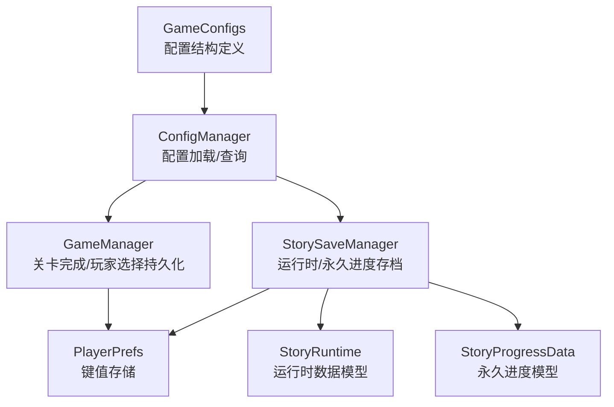
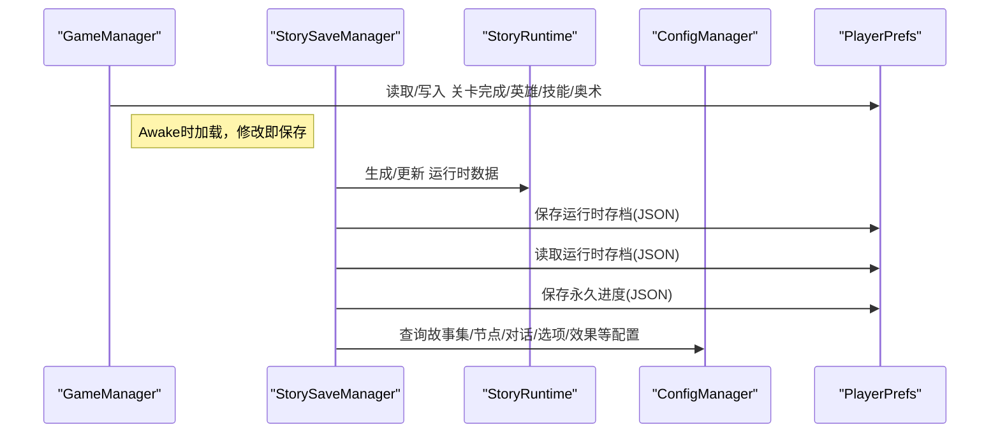
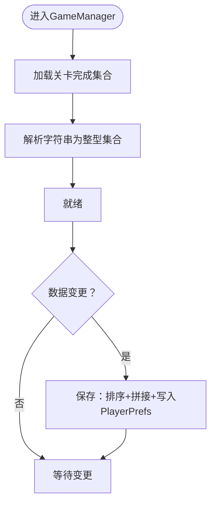
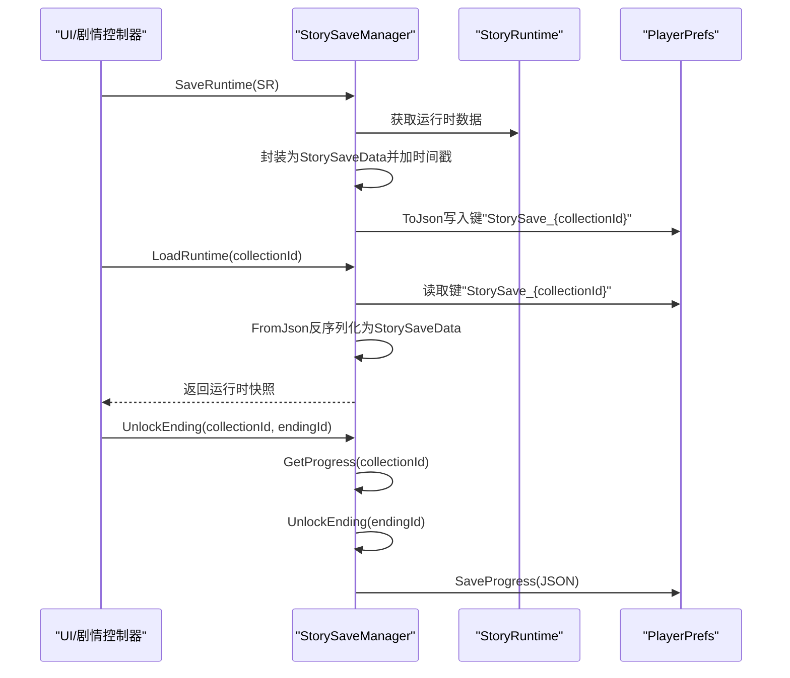
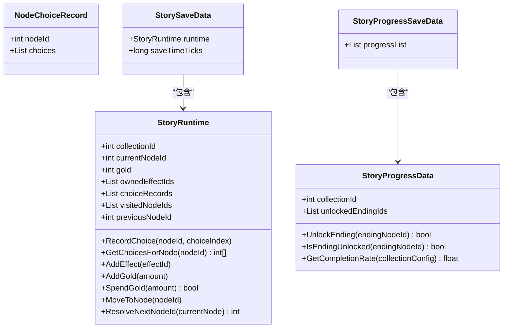
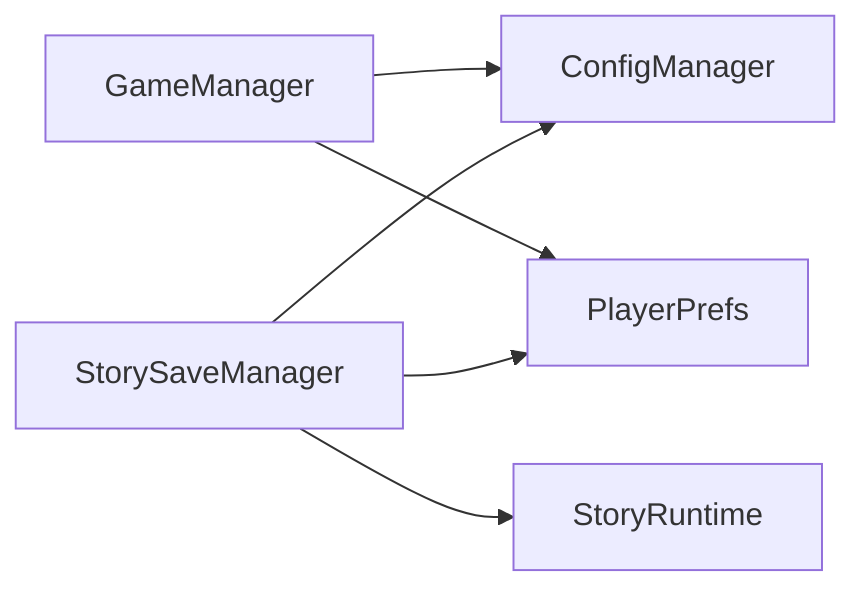

# 数据持久化

<cite>
**本文引用的文件**
- [GameManager.cs](file://Assets/Scripts/Core/GameManager.cs)
- [StorySaveManager.cs](file://Assets/Scripts/Core/StorySaveManager.cs)
- [StoryRuntime.cs](file://Assets/Scripts/Data/StoryRuntime.cs)
- [ConfigManager.cs](file://Assets/Scripts/Core/ConfigManager.cs)
- [GameConfigs.cs](file://Assets/Scripts/Data/GameConfigs.cs)
</cite>

## 目录
1. [简介](#简介)
2. [项目结构](#项目结构)
3. [核心组件](#核心组件)
4. [架构总览](#架构总览)
5. [详细组件分析](#详细组件分析)
6. [依赖关系分析](#依赖关系分析)
7. [性能考量](#性能考量)
8. [故障排查指南](#故障排查指南)
9. [结论](#结论)
10. [附录](#附录)

## 简介
本文件面向GeometryTD的数据持久化系统，聚焦以下目标：
- 解释GameManager中的关卡完成状态保存与加载机制，以及PlayerPrefs的使用模式
- 阐述StorySaveManager的故事存档系统，包括StoryRuntime运行时数据的序列化/反序列化流程
- 分析数据持久化的架构设计：数据模型、存储策略、恢复机制
- 说明不同数据类型的持久化方案：游戏进度、玩家选择、配置信息等的存储格式与访问方式
- 提供数据一致性保障、错误恢复与版本兼容性处理思路
- 给出性能优化策略与数据迁移指南

## 项目结构
与数据持久化直接相关的代码主要分布在以下模块：
- Core层：GameManager负责关卡完成状态与玩家选择的持久化；StorySaveManager负责故事集运行时与永久进度的存档
- Data层：StoryRuntime定义了运行时数据模型与序列化容器
- Core层：ConfigManager负责配置加载与查询，为持久化提供配置支撑
- Data层：GameConfigs定义了大量配置结构体，为关卡解锁条件、默认配置等提供依据

图表来源
- [GameManager.cs:1-238](file://Assets/Scripts/Core/GameManager.cs#L1-L238)
- [StorySaveManager.cs:1-179](file://Assets/Scripts/Core/StorySaveManager.cs#L1-L179)
- [StoryRuntime.cs:1-288](file://Assets/Scripts/Data/StoryRuntime.cs#L1-L288)
- [ConfigManager.cs:1-619](file://Assets/Scripts/Core/ConfigManager.cs#L1-L619)
- [GameConfigs.cs:1-775](file://Assets/Scripts/Data/GameConfigs.cs#L1-L775)

章节来源
- [GameManager.cs:1-238](file://Assets/Scripts/Core/GameManager.cs#L1-L238)
- [StorySaveManager.cs:1-179](file://Assets/Scripts/Core/StorySaveManager.cs#L1-L179)
- [StoryRuntime.cs:1-288](file://Assets/Scripts/Data/StoryRuntime.cs#L1-L288)
- [ConfigManager.cs:1-619](file://Assets/Scripts/Core/ConfigManager.cs#L1-L619)
- [GameConfigs.cs:1-775](file://Assets/Scripts/Data/GameConfigs.cs#L1-L775)

## 核心组件
- GameManager：负责关卡完成集合、英雄选择、技能与奥术装备槽位的持久化，采用PlayerPrefs键值存储，并在Awake阶段加载，修改后立即保存
- StorySaveManager：负责故事集运行时中途存档（每次选择后保存）与永久进度（跨冒险持久化），使用JsonUtility序列化到PlayerPrefs
- StoryRuntime：运行时数据模型，包含当前节点、金币、效果列表、选择记录、访问历史等，支持序列化
- ConfigManager：集中加载与缓存各类配置，为解锁条件判断、默认配置读取提供支撑
- GameConfigs：定义配置结构体，如GameConfig、LevelConfig、ConditionConfig等，为GameManager的解锁逻辑提供依据

章节来源
- [GameManager.cs:11-238](file://Assets/Scripts/Core/GameManager.cs#L11-L238)
- [StorySaveManager.cs:11-179](file://Assets/Scripts/Core/StorySaveManager.cs#L11-L179)
- [StoryRuntime.cs:10-288](file://Assets/Scripts/Data/StoryRuntime.cs#L10-L288)
- [ConfigManager.cs:6-122](file://Assets/Scripts/Core/ConfigManager.cs#L6-L122)
- [GameConfigs.cs:404-555](file://Assets/Scripts/Data/GameConfigs.cs#L404-L555)

## 架构总览
整体采用“配置驱动 + PlayerPrefs + JsonUtility”的轻量持久化架构：
- 配置层：ConfigManager统一加载配置，提供查询接口
- 运行时层：GameManager与StorySaveManager分别维护游戏进程与故事集运行时数据
- 存储层：PlayerPrefs以字符串形式保存JSON，键名区分运行时与永久进度

图表来源
- [GameManager.cs:23-34](file://Assets/Scripts/Core/GameManager.cs#L23-L34)
- [GameManager.cs:159-211](file://Assets/Scripts/Core/GameManager.cs#L159-L211)
- [GameManager.cs:215-236](file://Assets/Scripts/Core/GameManager.cs#L215-L236)
- [StorySaveManager.cs:34-75](file://Assets/Scripts/Core/StorySaveManager.cs#L34-L75)
- [StorySaveManager.cs:51-60](file://Assets/Scripts/Core/StorySaveManager.cs#L51-L60)
- [StorySaveManager.cs:144-150](file://Assets/Scripts/Core/StorySaveManager.cs#L144-L150)
- [ConfigManager.cs:77-122](file://Assets/Scripts/Core/ConfigManager.cs#L77-L122)

## 详细组件分析

### GameManager：关卡完成与玩家选择的持久化
- 关键职责
  - 加载/保存关卡完成集合（HashSet<int>），保存前排序并以逗号分隔的字符串形式存储
  - 加载/保存英雄选择与技能/奥术装备槽位，采用键值分离存储，字符串以逗号分隔
- 数据一致性
  - 加载时对字符串进行分割与整型解析，忽略无效项
  - 保存时立即调用PlayerPrefs.Save()，降低丢失风险
- 解锁条件判断
  - 通过ConfigManager查询LevelConfig与ConditionConfig，基于已完成关卡集合判断是否解锁

图表来源
- [GameManager.cs:23-34](file://Assets/Scripts/Core/GameManager.cs#L23-L34)
- [GameManager.cs:215-236](file://Assets/Scripts/Core/GameManager.cs#L215-L236)
- [GameManager.cs:159-211](file://Assets/Scripts/Core/GameManager.cs#L159-L211)
- [GameConfigs.cs:517-533](file://Assets/Scripts/Data/GameConfigs.cs#L517-L533)
- [GameConfigs.cs:542-549](file://Assets/Scripts/Data/GameConfigs.cs#L542-L549)

章节来源
- [GameManager.cs:11-238](file://Assets/Scripts/Core/GameManager.cs#L11-L238)
- [GameConfigs.cs:517-555](file://Assets/Scripts/Data/GameConfigs.cs#L517-L555)

### StorySaveManager：故事存档系统
- 运行时存档
  - SaveRuntime：将StoryRuntime封装为StorySaveData，加入UTC时间戳，序列化为JSON后写入PlayerPrefs
  - LoadRuntime：根据collectionId构造键名，读取JSON并反序列化
  - HasRuntimeSave/DeleteRuntimeSave：检查与删除运行时存档
  - CreateNewRuntime：基于StoryCollectionConfig初始化新的运行时状态
- 永久进度
  - GetProgress：按需加载StoryProgressSaveData，按collectionId查找或创建进度
  - UnlockEnding：解锁结局并按需保存
  - GetCompletionRate：基于配置计算完成度
  - SaveProgress：序列化并保存永久进度

图表来源
- [StorySaveManager.cs:34-75](file://Assets/Scripts/Core/StorySaveManager.cs#L34-L75)
- [StorySaveManager.cs:51-60](file://Assets/Scripts/Core/StorySaveManager.cs#L51-L60)
- [StorySaveManager.cs:105-133](file://Assets/Scripts/Core/StorySaveManager.cs#L105-L133)
- [StorySaveManager.cs:144-150](file://Assets/Scripts/Core/StorySaveManager.cs#L144-L150)

章节来源
- [StorySaveManager.cs:11-179](file://Assets/Scripts/Core/StorySaveManager.cs#L11-L179)
- [StoryRuntime.cs:10-288](file://Assets/Scripts/Data/StoryRuntime.cs#L10-L288)

### StoryRuntime：运行时数据模型与序列化
- 数据模型
  - StoryRuntime：包含collectionId、currentNodeId、gold、ownedEffectIds、choiceRecords、visitedNodeIds、previousNodeId等
  - NodeChoiceRecord：记录节点的选择序列
  - StoryProgressData：永久进度（unlockedEndingIds）
  - StorySaveData：运行时快照包装（包含runtime与saveTimeTicks）
  - StoryProgressSaveData：永久进度列表包装
- 序列化策略
  - 所有类均标注可序列化，便于JsonUtility.ToJson/FromJson
  - 运行时数据在每次关键节点变更时保存，永久进度仅在解锁新结局时保存

图表来源
- [StoryRuntime.cs:10-288](file://Assets/Scripts/Data/StoryRuntime.cs#L10-L288)

章节来源
- [StoryRuntime.cs:10-288](file://Assets/Scripts/Data/StoryRuntime.cs#L10-L288)

### ConfigManager与GameConfigs：配置支撑
- ConfigManager
  - 加载多类配置列表并建立字典索引，提供快速查询
  - 提供GetLevelConfig、GetConditionConfig、GetStoryCollectionConfig等接口
- GameConfigs
  - 定义GameConfig、LevelConfig、ConditionConfig等结构，支撑GameManager的解锁逻辑

章节来源
- [ConfigManager.cs:77-122](file://Assets/Scripts/Core/ConfigManager.cs#L77-L122)
- [ConfigManager.cs:316-330](file://Assets/Scripts/Core/ConfigManager.cs#L316-L330)
- [ConfigManager.cs:436-442](file://Assets/Scripts/Core/ConfigManager.cs#L436-L442)
- [GameConfigs.cs:404-555](file://Assets/Scripts/Data/GameConfigs.cs#L404-L555)

## 依赖关系分析
- GameManager依赖ConfigManager进行关卡解锁条件判断
- StorySaveManager依赖ConfigManager进行故事集/节点/对话/选项/效果等配置查询
- StoryRuntime作为数据载体被StorySaveManager序列化/反序列化
- 所有持久化最终落到PlayerPrefs，键名区分运行时与永久进度

图表来源
- [GameManager.cs:78-99](file://Assets/Scripts/Core/GameManager.cs#L78-L99)
- [StorySaveManager.cs:80-85](file://Assets/Scripts/Core/StorySaveManager.cs#L80-L85)
- [StorySaveManager.cs:154-157](file://Assets/Scripts/Core/StorySaveManager.cs#L154-L157)

章节来源
- [GameManager.cs:78-99](file://Assets/Scripts/Core/GameManager.cs#L78-L99)
- [StorySaveManager.cs:80-85](file://Assets/Scripts/Core/StorySaveManager.cs#L80-L85)
- [StorySaveManager.cs:154-157](file://Assets/Scripts/Core/StorySaveManager.cs#L154-L157)

## 性能考量
- 写入频率与批量
  - GameManager在每次选择/变更后立即保存，确保数据安全但可能增加写入次数
  - StorySaveManager在解锁新结局时保存永久进度，避免频繁写入
- 内存占用
  - StorySaveManager对永久进度做内存缓存（progressCache），首次访问才加载
- 序列化开销
  - 使用JsonUtility序列化，简单高效；运行时存档包含完整StoryRuntime，体积随剧情推进增长
- I/O策略
  - 每次写入后调用PlayerPrefs.Save()，降低丢失风险

章节来源
- [GameManager.cs:192-211](file://Assets/Scripts/Core/GameManager.cs#L192-L211)
- [StorySaveManager.cs:159-176](file://Assets/Scripts/Core/StorySaveManager.cs#L159-L176)
- [StorySaveManager.cs:144-150](file://Assets/Scripts/Core/StorySaveManager.cs#L144-L150)

## 故障排查指南
- PlayerPrefs读取为空
  - 检查键名是否正确（关卡完成、英雄、技能、奥术、运行时键前缀、永久进度键）
  - 确认保存后调用了PlayerPrefs.Save()
- 解析失败
  - GameManager对字符串解析使用TryParse，忽略非法项；若出现异常，检查存储格式
  - StorySaveManager对JSON反序列化失败时返回空，确认序列化字段与类型一致
- 解锁条件异常
  - 确认ConfigManager已加载LevelConfig与ConditionConfig，且ID有效
- 数据丢失
  - 在关键节点（如解锁结局、完成关卡）后调用保存；避免频繁覆盖同一键

章节来源
- [GameManager.cs:159-236](file://Assets/Scripts/Core/GameManager.cs#L159-L236)
- [StorySaveManager.cs:51-60](file://Assets/Scripts/Core/StorySaveManager.cs#L51-L60)
- [StorySaveManager.cs:163-167](file://Assets/Scripts/Core/StorySaveManager.cs#L163-L167)

## 结论
本持久化体系以PlayerPrefs为核心，结合JsonUtility与配置驱动，实现了两类关键数据的可靠存储：
- 游戏进程数据（关卡完成、英雄与装备）：简洁高效，适合轻量存档
- 故事集数据（运行时快照与永久进度）：支持中途存档与跨冒险持久化，满足剧情探索需求
建议在后续迭代中关注写入频率与数据体积，必要时引入版本号与迁移策略，以提升可维护性与兼容性。

## 附录

### 数据模型与存储格式
- 关卡完成集合
  - 键：固定字符串
  - 值：升序排列的整型ID，逗号分隔
- 玩家选择与装备
  - 键：英雄ID、技能ID列表、奥术ID列表
  - 值：整型ID，逗号分隔
- 运行时存档
  - 键：前缀+故事集ID
  - 值：JSON字符串，包含运行时快照与时间戳
- 永久进度
  - 键：固定字符串
  - 值：JSON字符串，包含多个故事集进度

章节来源
- [GameManager.cs:11-14](file://Assets/Scripts/Core/GameManager.cs#L11-L14)
- [GameManager.cs:215-236](file://Assets/Scripts/Core/GameManager.cs#L215-L236)
- [GameManager.cs:159-211](file://Assets/Scripts/Core/GameManager.cs#L159-L211)
- [StorySaveManager.cs:13-15](file://Assets/Scripts/Core/StorySaveManager.cs#L13-L15)
- [StorySaveManager.cs:51-60](file://Assets/Scripts/Core/StorySaveManager.cs#L51-L60)
- [StorySaveManager.cs:144-150](file://Assets/Scripts/Core/StorySaveManager.cs#L144-L150)

### 版本兼容与迁移建议
- 引入版本号字段
  - 在永久进度与运行时存档的顶层对象中增加版本号，便于识别格式差异
- 渐进式迁移
  - 新版本读取旧格式时，进行字段补齐与默认值填充；完成后写回新格式
- 向后兼容
  - 读取时忽略未知字段，避免因新增字段导致反序列化失败
- 备份策略
  - 迁移前备份PlayerPrefs中的相关键，失败时回滚

[本节为通用指导，无需列出具体文件来源]