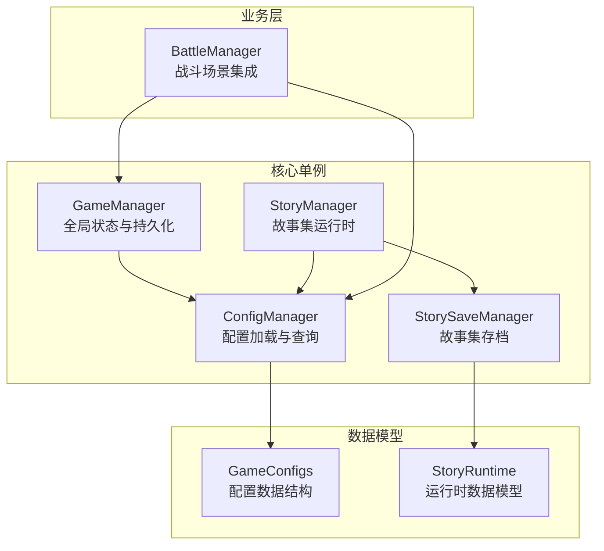
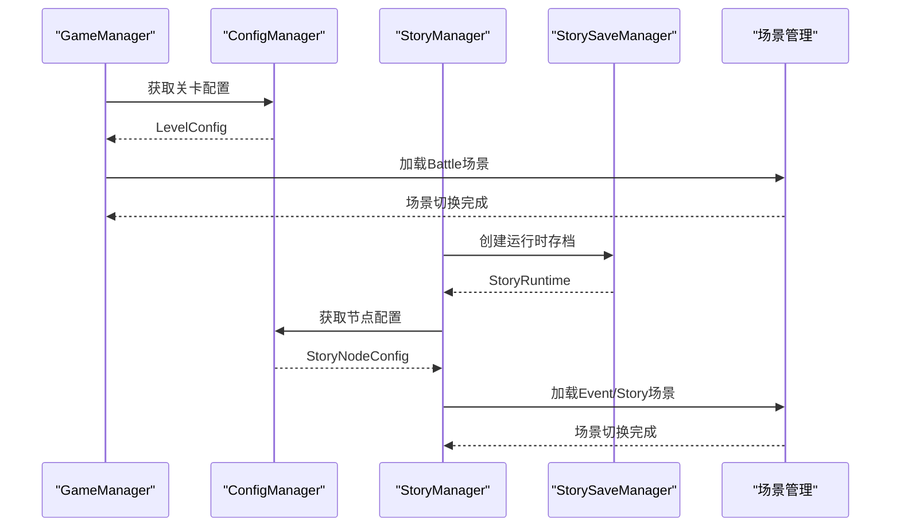
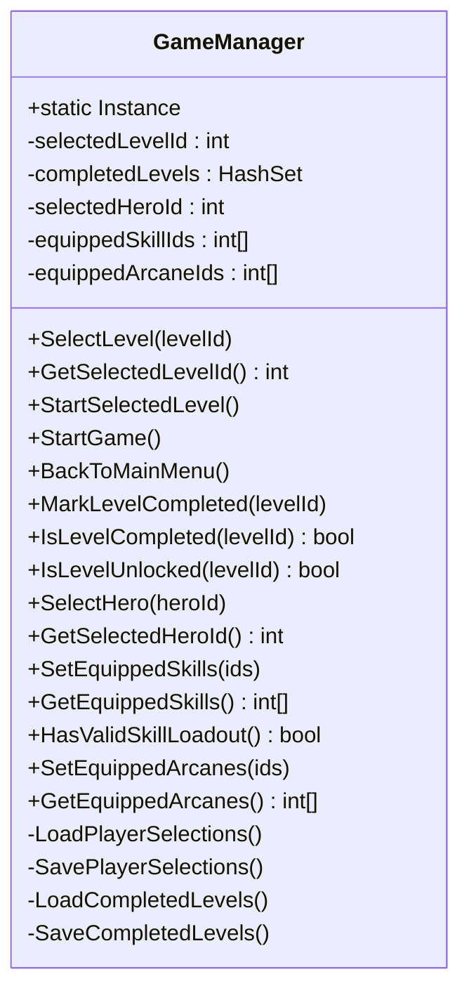
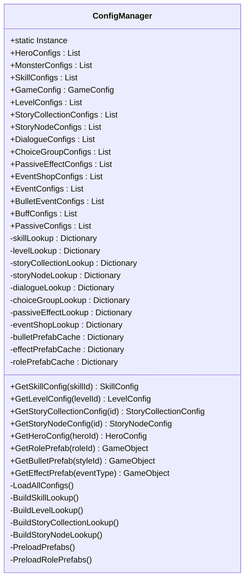
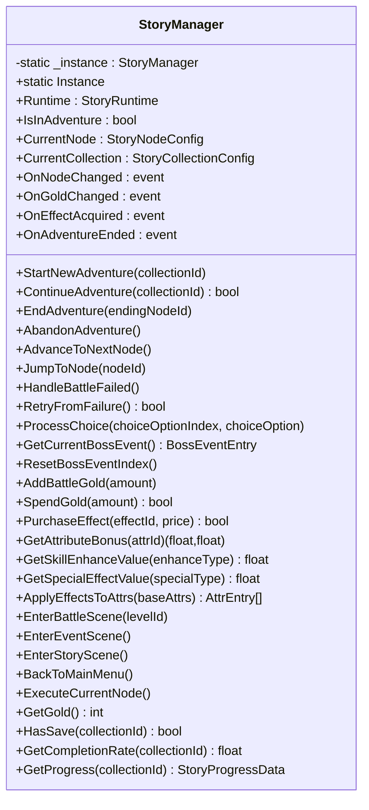
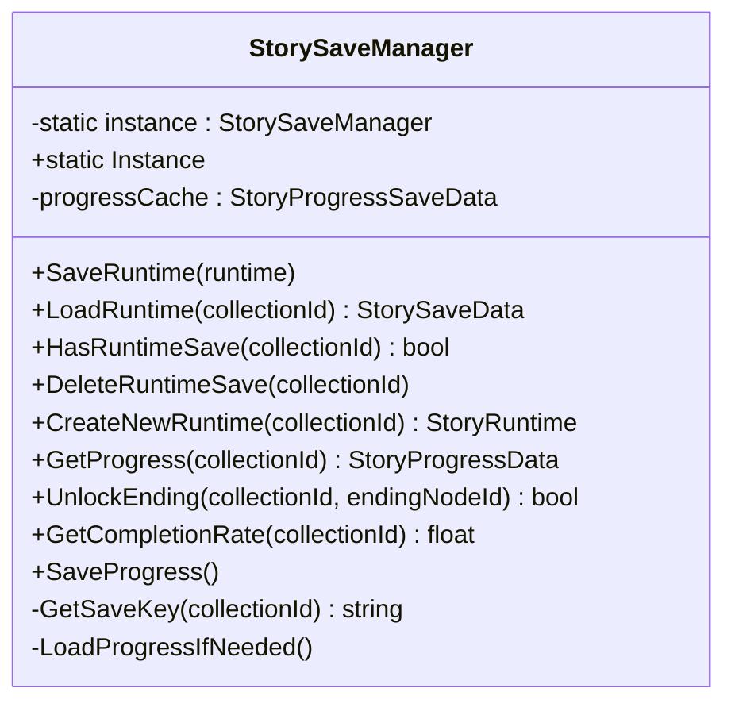
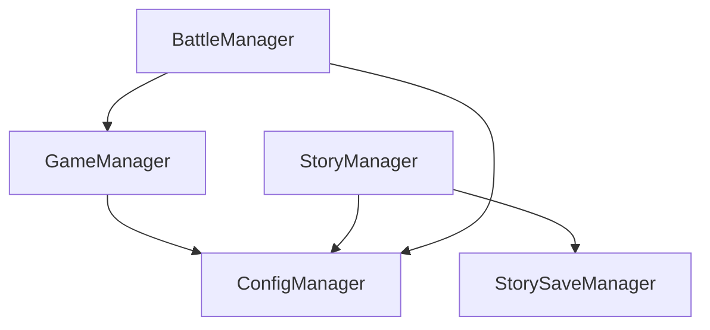

# 单例模式设计

<cite>
**本文引用的文件**
- [GameManager.cs](file://Assets/Scripts/Core/GameManager.cs)
- [ConfigManager.cs](file://Assets/Scripts/Core/ConfigManager.cs)
- [StoryManager.cs](file://Assets/Scripts/Core/StoryManager.cs)
- [StorySaveManager.cs](file://Assets/Scripts/Core/StorySaveManager.cs)
- [GameConfigs.cs](file://Assets/Scripts/Data/GameConfigs.cs)
- [StoryRuntime.cs](file://Assets/Scripts/Data/StoryRuntime.cs)
- [BattleManager.cs](file://Assets/Scripts/Battle/BattleManager.cs)
</cite>

## 目录
1. [简介](#简介)
2. [项目结构](#项目结构)
3. [核心组件](#核心组件)
4. [架构概览](#架构概览)
5. [详细组件分析](#详细组件分析)
6. [依赖关系分析](#依赖关系分析)
7. [性能考量](#性能考量)
8. [故障排除指南](#故障排除指南)
9. [结论](#结论)
10. [附录](#附录)

## 简介
本设计文档聚焦于GeometryTD项目中的单例模式实现，深入分析GameManager、ConfigManager、StoryManager三个核心单例类的设计与应用。文档涵盖单例模式在Unity游戏中的最佳实践（Awake中的实例管理、DontDestroyOnLoad的使用策略）、生命周期管理、线程安全考虑与内存泄漏防护，并阐述单例在游戏状态管理、配置访问和故事控制中的关键作用。同时提供使用示例、常见陷阱与注意事项，以及在大型项目中的适用性讨论。

## 项目结构
单例模式相关的核心文件位于Assets/Scripts/Core目录下，配合Assets/Scripts/Data中的配置数据模型，形成完整的单例体系：
- GameManager：全局游戏状态与持久化管理
- ConfigManager：配置加载与查询索引
- StoryManager：故事集运行时状态与场景切换
- StorySaveManager：故事集存档与进度持久化
- GameConfigs：配置数据结构定义
- StoryRuntime：故事集运行时数据模型

**图表来源**
- [GameManager.cs:1-239](file://Assets/Scripts/Core/GameManager.cs#L1-L239)
- [ConfigManager.cs:1-619](file://Assets/Scripts/Core/ConfigManager.cs#L1-L619)
- [StoryManager.cs:1-589](file://Assets/Scripts/Core/StoryManager.cs#L1-L589)
- [StorySaveManager.cs:1-179](file://Assets/Scripts/Core/StorySaveManager.cs#L1-L179)
- [GameConfigs.cs:1-775](file://Assets/Scripts/Data/GameConfigs.cs#L1-L775)
- [StoryRuntime.cs:1-288](file://Assets/Scripts/Data/StoryRuntime.cs#L1-L288)
- [BattleManager.cs:182-238](file://Assets/Scripts/Battle/BattleManager.cs#L182-L238)

**章节来源**
- [GameManager.cs:1-239](file://Assets/Scripts/Core/GameManager.cs#L1-L239)
- [ConfigManager.cs:1-619](file://Assets/Scripts/Core/ConfigManager.cs#L1-L619)
- [StoryManager.cs:1-589](file://Assets/Scripts/Core/StoryManager.cs#L1-L589)
- [StorySaveManager.cs:1-179](file://Assets/Scripts/Core/StorySaveManager.cs#L1-L179)
- [GameConfigs.cs:1-775](file://Assets/Scripts/Data/GameConfigs.cs#L1-L775)
- [StoryRuntime.cs:1-288](file://Assets/Scripts/Data/StoryRuntime.cs#L1-L288)
- [BattleManager.cs:182-238](file://Assets/Scripts/Battle/BattleManager.cs#L182-L238)

## 核心组件
本节概述三个核心单例类的职责与协作关系：
- GameManager：负责关卡选择、英雄与技能/奥术装备、关卡完成状态的持久化与加载，提供跨场景的全局状态入口。
- ConfigManager：集中加载与缓存各类配置（英雄、怪物、技能、关卡、故事集等），构建查询索引，提供快速配置检索与资源预加载。
- StoryManager：管理故事集的完整生命周期（开始/继续/推进节点/结束），协调场景切换与事件处理，维护运行时状态并通过StorySaveManager进行持久化。

**章节来源**
- [GameManager.cs:1-239](file://Assets/Scripts/Core/GameManager.cs#L1-L239)
- [ConfigManager.cs:1-619](file://Assets/Scripts/Core/ConfigManager.cs#L1-L619)
- [StoryManager.cs:1-589](file://Assets/Scripts/Core/StoryManager.cs#L1-L589)

## 架构概览
单例模式在GeometryTD中的应用遵循以下原则：
- 单例实例在Awake阶段创建并确保唯一性，使用DontDestroyOnLoad实现跨场景持久化。
- 通过静态属性提供全局访问点，避免重复实例化。
- 依赖注入：其他组件通过单例访问配置与运行时状态，降低耦合度。
- 持久化策略：使用PlayerPrefs与JSON序列化，保证数据在进程重启后仍可恢复。

**图表来源**
- [GameManager.cs:46-63](file://Assets/Scripts/Core/GameManager.cs#L46-L63)
- [StoryManager.cs:96-114](file://Assets/Scripts/Core/StoryManager.cs#L96-L114)
- [StorySaveManager.cs:77-100](file://Assets/Scripts/Core/StorySaveManager.cs#L77-L100)
- [ConfigManager.cs:316-330](file://Assets/Scripts/Core/ConfigManager.cs#L316-L330)

**章节来源**
- [GameManager.cs:46-63](file://Assets/Scripts/Core/GameManager.cs#L46-L63)
- [StoryManager.cs:96-114](file://Assets/Scripts/Core/StoryManager.cs#L96-L114)
- [StorySaveManager.cs:77-100](file://Assets/Scripts/Core/StorySaveManager.cs#L77-L100)
- [ConfigManager.cs:316-330](file://Assets/Scripts/Core/ConfigManager.cs#L316-L330)

## 详细组件分析

### GameManager：全局游戏状态与持久化
GameManager采用标准的单例实现，通过静态属性Instance提供全局访问。其关键特性包括：
- 实例唯一性：Awake中检测是否存在已有实例，若存在则销毁当前实例，确保全局唯一。
- 跨场景持久化：使用DontDestroyOnLoad使实例在场景切换时不被销毁。
- 状态持久化：通过PlayerPrefs存储已完成关卡、英雄选择与技能/奥术装备配置，支持断线续玩。
- 关卡解锁逻辑：基于ConfigManager中的关卡条件判断关卡是否解锁，支持多条件组合。

**图表来源**
- [GameManager.cs:1-239](file://Assets/Scripts/Core/GameManager.cs#L1-L239)

**章节来源**
- [GameManager.cs:23-34](file://Assets/Scripts/Core/GameManager.cs#L23-L34)
- [GameManager.cs:65-99](file://Assets/Scripts/Core/GameManager.cs#L65-L99)
- [GameManager.cs:159-236](file://Assets/Scripts/Core/GameManager.cs#L159-L236)

### ConfigManager：配置加载与查询索引
ConfigManager负责集中加载与缓存各类配置，并构建查询索引以提升访问效率：
- 配置加载：通过Resources.Load加载JSON配置文件，使用JsonUtility解析为强类型对象。
- 查询索引：为技能、关卡、角色、故事集等配置建立Dictionary索引，提供O(1)查询能力。
- 资源预加载：预加载子弹与特效的GameObject资源，减少运行时加载开销。
- 跨模块支持：为其他单例（如StoryManager、BattleManager）提供统一的配置访问接口。

**图表来源**
- [ConfigManager.cs:1-619](file://Assets/Scripts/Core/ConfigManager.cs#L1-L619)

**章节来源**
- [ConfigManager.cs:65-75](file://Assets/Scripts/Core/ConfigManager.cs#L65-L75)
- [ConfigManager.cs:77-122](file://Assets/Scripts/Core/ConfigManager.cs#L77-L122)
- [ConfigManager.cs:124-198](file://Assets/Scripts/Core/ConfigManager.cs#L124-L198)
- [ConfigManager.cs:217-283](file://Assets/Scripts/Core/ConfigManager.cs#L217-L283)

### StoryManager：故事集运行时与场景管理
StoryManager采用延迟初始化的单例模式，通过静态属性在首次访问时创建实例：
- 运行时状态：管理一次冒险过程中的所有状态（当前节点、金币、藏品、访问记录等）。
- 场景切换：根据当前节点类型（战斗/事件/商店/结局）加载相应场景。
- 事件处理：处理节点切换、选择记录、Boss事件、金币与藏品系统。
- 存档管理：委托StorySaveManager进行运行时存档与永久进度的持久化。

**图表来源**
- [StoryManager.cs:1-589](file://Assets/Scripts/Core/StoryManager.cs#L1-L589)

**章节来源**
- [StoryManager.cs:83-92](file://Assets/Scripts/Core/StoryManager.cs#L83-L92)
- [StoryManager.cs:96-130](file://Assets/Scripts/Core/StoryManager.cs#L96-L130)
- [StoryManager.cs:167-186](file://Assets/Scripts/Core/StoryManager.cs#L167-L186)
- [StoryManager.cs:269-297](file://Assets/Scripts/Core/StoryManager.cs#L269-L297)
- [StoryManager.cs:300-326](file://Assets/Scripts/Core/StoryManager.cs#L300-L326)
- [StoryManager.cs:328-432](file://Assets/Scripts/Core/StoryManager.cs#L328-L432)
- [StoryManager.cs:499-560](file://Assets/Scripts/Core/StoryManager.cs#L499-L560)

### StorySaveManager：故事集存档与进度持久化
StorySaveManager采用饿汉式单例（静态属性在首次访问时创建实例），负责：
- 运行时存档：保存/加载一次冒险过程中的运行时状态，支持中途退出与继续。
- 永久进度：记录已解锁结局等成就性信息，跨冒险持久化。
- 数据结构：使用StorySaveData与StoryProgressData进行JSON序列化，存储在PlayerPrefs中。

**图表来源**
- [StorySaveManager.cs:1-179](file://Assets/Scripts/Core/StorySaveManager.cs#L1-L179)

**章节来源**
- [StorySaveManager.cs:17-26](file://Assets/Scripts/Core/StorySaveManager.cs#L17-L26)
- [StorySaveManager.cs:33-75](file://Assets/Scripts/Core/StorySaveManager.cs#L33-L75)
- [StorySaveManager.cs:104-150](file://Assets/Scripts/Core/StorySaveManager.cs#L104-L150)

## 依赖关系分析
单例之间的依赖关系清晰且低耦合：
- GameManager依赖ConfigManager进行关卡与英雄配置查询。
- StoryManager依赖ConfigManager进行故事节点与配置查询，依赖StorySaveManager进行存档管理。
- BattleManager依赖GameManager与ConfigManager进行战斗初始化与配置加载。

**图表来源**
- [GameManager.cs:78-98](file://Assets/Scripts/Core/GameManager.cs#L78-L98)
- [StoryManager.cs:40-51](file://Assets/Scripts/Core/StoryManager.cs#L40-L51)
- [BattleManager.cs:216-218](file://Assets/Scripts/Battle/BattleManager.cs#L216-L218)

**章节来源**
- [GameManager.cs:78-98](file://Assets/Scripts/Core/GameManager.cs#L78-L98)
- [StoryManager.cs:40-51](file://Assets/Scripts/Core/StoryManager.cs#L40-L51)
- [BattleManager.cs:216-218](file://Assets/Scripts/Battle/BattleManager.cs#L216-L218)

## 性能考量
- 单例实例唯一性检查：Awake中通过Instance字段判断，避免重复实例化带来的资源浪费。
- 查询索引优化：ConfigManager为常用配置建立Dictionary索引，将查询复杂度从O(n)降至O(1)。
- 资源预加载：ConfigManager在Awake阶段预加载子弹与特效资源，减少运行时加载延迟。
- 持久化策略：PlayerPrefs与JSON序列化简单可靠，适合小到中型数据的持久化需求。

[本节为通用性能讨论，无需特定文件来源]

## 故障排除指南
- 单例未正确初始化：检查Awake中的实例唯一性逻辑，确保DontDestroyOnLoad正确调用。
- 配置加载失败：确认Resources目录下的配置文件路径与名称正确，检查JsonUtility解析错误日志。
- 场景切换异常：验证场景名称与加载逻辑，确保Time.timeScale在切换前后得到正确设置。
- 存档数据损坏：清理PlayerPrefs中对应键值，重新生成存档数据。

**章节来源**
- [ConfigManager.cs:200-215](file://Assets/Scripts/Core/ConfigManager.cs#L200-L215)
- [StorySaveManager.cs:50-60](file://Assets/Scripts/Core/StorySaveManager.cs#L50-L60)

## 结论
GeometryTD项目的单例模式设计体现了良好的架构实践：通过GameManager、ConfigManager、StoryManager三个核心单例实现了全局状态管理、配置访问与故事控制的解耦。单例的跨场景持久化与合理的生命周期管理确保了游戏体验的连续性。结合查询索引与资源预加载，系统在性能与可维护性之间取得了平衡。建议在大型项目中继续沿用此模式，并注意线程安全与内存泄漏的防护。

[本节为总结性内容，无需特定文件来源]

## 附录

### 单例模式最佳实践清单
- 使用Awake进行实例唯一性检查与DontDestroyOnLoad调用
- 提供静态属性作为全局访问点，避免直接构造实例
- 在依赖注入中优先使用单例而非静态方法
- 注意跨场景持久化时的数据一致性与版本兼容性
- 合理使用PlayerPrefs与JSON序列化进行持久化

### 常见陷阱与规避
- 重复实例化：确保Awake中严格检查Instance字段
- 循环依赖：避免单例之间相互依赖导致的初始化问题
- 内存泄漏：谨慎使用静态字段与事件订阅，及时解除订阅
- 线程安全：在多线程环境下考虑锁机制或使用Unity主线程API

[本节为通用指导，无需特定文件来源]