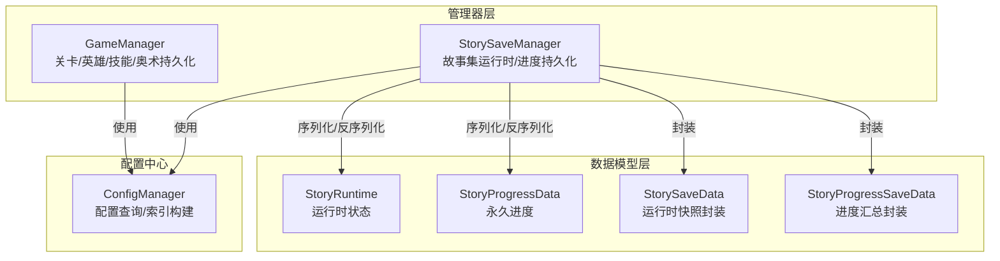
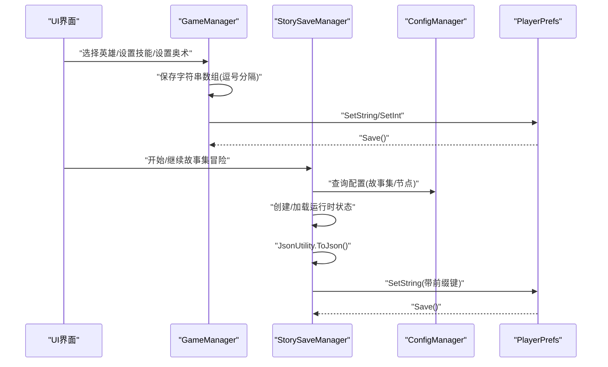
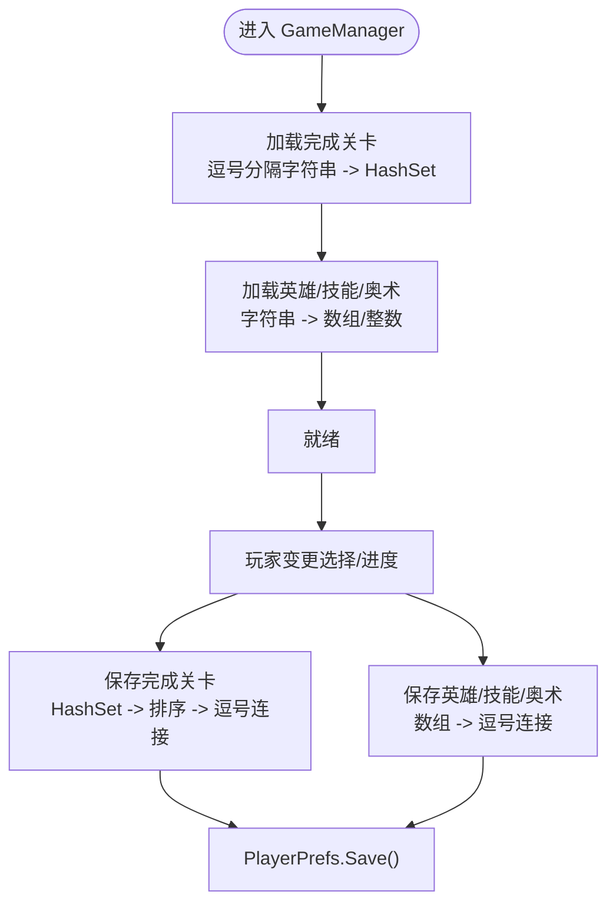
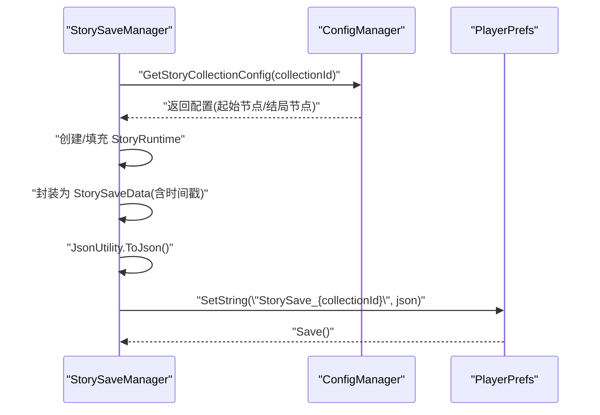
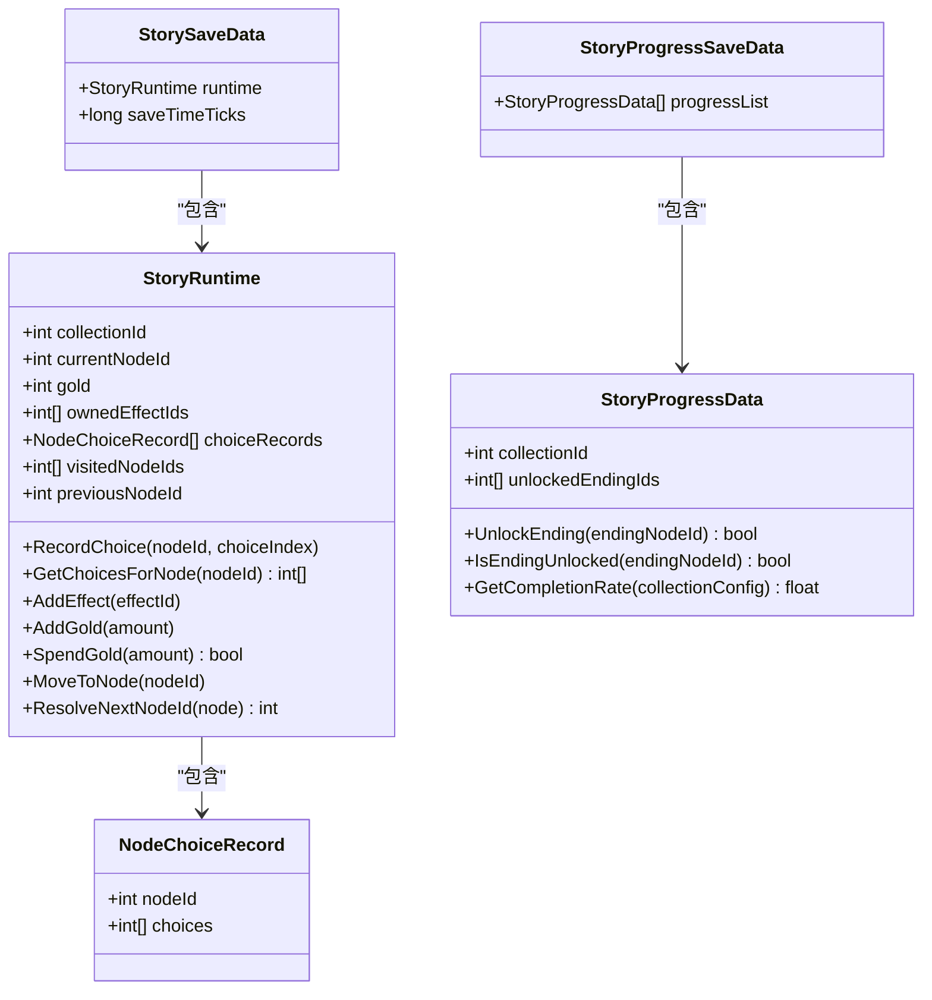
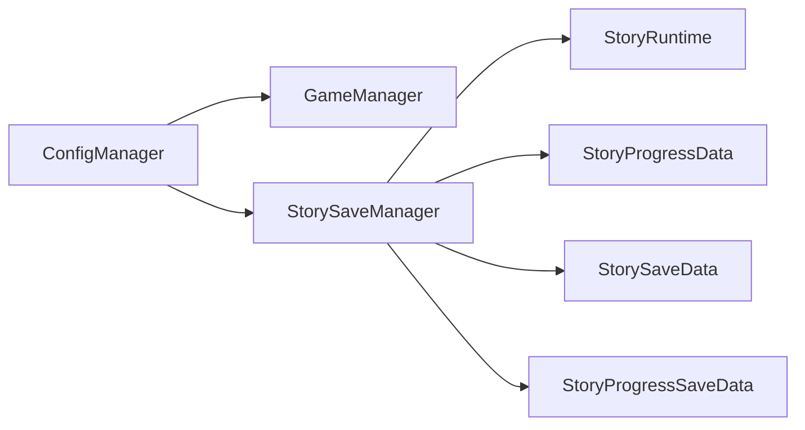

# 数据持久化架构

<cite>
**本文引用的文件**
- [GameManager.cs](file://Assets/Scripts/Core/GameManager.cs)
- [StorySaveManager.cs](file://Assets/Scripts/Core/StorySaveManager.cs)
- [StoryRuntime.cs](file://Assets/Scripts/Data/StoryRuntime.cs)
- [ConfigManager.cs](file://Assets/Scripts/Core/ConfigManager.cs)
- [HeroSelectWin.cs](file://Assets/Scripts/UI/HeroSelectWin.cs)
</cite>

## 目录
1. [简介](#简介)
2. [项目结构](#项目结构)
3. [核心组件](#核心组件)
4. [架构总览](#架构总览)
5. [详细组件分析](#详细组件分析)
6. [依赖关系分析](#依赖关系分析)
7. [性能考量](#性能考量)
8. [故障排查指南](#故障排查指南)
9. [结论](#结论)
10. [附录](#附录)

## 简介
本文件系统性梳理 GeometryTD 项目的“数据持久化架构”，重点覆盖以下方面：
- 使用 PlayerPrefs 的统一持久化策略与键值设计原则
- 关卡完成状态、英雄选择、技能装备、奥术装备的保存与加载流程
- 数据序列化与反序列化机制（JSON + 字符串分割/拼接）
- 数据完整性检查与错误恢复策略
- 数据迁移与版本兼容性处理建议
- 安全性与隐私保护、备份与恢复最佳实践

## 项目结构
围绕数据持久化，项目采用“配置中心 + 管理器 + 数据模型”的分层组织：
- 配置中心：ConfigManager 提供全局配置查询与资源预加载
- 管理器层：
  - GameManager：负责关卡完成状态、英雄选择、技能/奥术装备的持久化
  - StorySaveManager：负责故事集运行时存档与永久进度的持久化
- 数据模型层：StoryRuntime 及其配套类承载可序列化数据结构

图表来源
- [GameManager.cs:1-239](file://Assets/Scripts/Core/GameManager.cs#L1-L239)
- [StorySaveManager.cs:1-179](file://Assets/Scripts/Core/StorySaveManager.cs#L1-L179)
- [StoryRuntime.cs:1-288](file://Assets/Scripts/Data/StoryRuntime.cs#L1-L288)
- [ConfigManager.cs:1-619](file://Assets/Scripts/Core/ConfigManager.cs#L1-L619)

章节来源
- [GameManager.cs:1-239](file://Assets/Scripts/Core/GameManager.cs#L1-L239)
- [StorySaveManager.cs:1-179](file://Assets/Scripts/Core/StorySaveManager.cs#L1-L179)
- [StoryRuntime.cs:1-288](file://Assets/Scripts/Data/StoryRuntime.cs#L1-L288)
- [ConfigManager.cs:1-619](file://Assets/Scripts/Core/ConfigManager.cs#L1-L619)

## 核心组件
- GameManager：集中管理玩家选择与进度数据的持久化，使用 PlayerPrefs 键值进行读写；对数组类型采用逗号分隔的字符串格式进行序列化。
- StorySaveManager：负责故事集运行时中途存档与永久进度存档，使用 JsonUtility 将复杂对象序列化为 JSON 字符串，并通过固定键名持久化。
- StoryRuntime 及配套类：定义可序列化的运行时状态、永久进度、存档封装对象，确保跨场景/进程的可恢复性。

章节来源
- [GameManager.cs:1-239](file://Assets/Scripts/Core/GameManager.cs#L1-L239)
- [StorySaveManager.cs:1-179](file://Assets/Scripts/Core/StorySaveManager.cs#L1-L179)
- [StoryRuntime.cs:1-288](file://Assets/Scripts/Data/StoryRuntime.cs#L1-L288)

## 架构总览
下图展示数据在不同模块间的流转与持久化路径：

图表来源
- [GameManager.cs:159-236](file://Assets/Scripts/Core/GameManager.cs#L159-L236)
- [StorySaveManager.cs:34-75](file://Assets/Scripts/Core/StorySaveManager.cs#L34-L75)
- [ConfigManager.cs:436-442](file://Assets/Scripts/Core/ConfigManager.cs#L436-L442)

## 详细组件分析

### GameManager：玩家选择与进度持久化
- 关卡完成状态
  - 加载：从 PlayerPrefs 读取逗号分隔的整型列表，解析为 HashSet<int>，支持去重与快速查找
  - 保存：将完成关卡集合排序后转为逗号分隔字符串，写入并调用 Save()
- 英雄选择
  - 读取默认值：若未设置，回退到配置中的默认英雄ID
  - 保存：直接写入整型键值
- 技能装备
  - 读取：从字符串按逗号拆分，过滤非正整数，构建数组
  - 保存：将数组元素转为字符串并用逗号连接
- 奥术装备
  - 读取/保存：与技能装备相同的字符串分割/拼接策略

图表来源
- [GameManager.cs:159-236](file://Assets/Scripts/Core/GameManager.cs#L159-L236)

章节来源
- [GameManager.cs:1-239](file://Assets/Scripts/Core/GameManager.cs#L1-L239)

### StorySaveManager：故事集运行时与永久进度持久化
- 运行时存档
  - 保存：将 StoryRuntime 封装为 StorySaveData，加入 UTC 时间戳，使用 JsonUtility 序列化后以“StorySave_{collectionId}”为键写入
  - 加载：根据 collectionId 组合键名，读取 JSON 并反序列化为 StorySaveData；若无存档返回 null
  - 删除：按键名删除并 Save()
- 永久进度
  - 读取：首次访问时从 PlayerPrefs 读取 JSON，反序列化为 StoryProgressSaveData；若为空则初始化空列表
  - 解锁结局：在对应 StoryProgressData 中新增未解锁的结局ID，若为新解锁则整体保存
  - 完成度：基于配置中的结局总数计算百分比

图表来源
- [StorySaveManager.cs:34-75](file://Assets/Scripts/Core/StorySaveManager.cs#L34-L75)
- [StoryRuntime.cs:270-277](file://Assets/Scripts/Data/StoryRuntime.cs#L270-L277)
- [ConfigManager.cs:436-442](file://Assets/Scripts/Core/ConfigManager.cs#L436-L442)

章节来源
- [StorySaveManager.cs:1-179](file://Assets/Scripts/Core/StorySaveManager.cs#L1-L179)
- [StoryRuntime.cs:1-288](file://Assets/Scripts/Data/StoryRuntime.cs#L1-L288)
- [ConfigManager.cs:1-619](file://Assets/Scripts/Core/ConfigManager.cs#L1-L619)

### 数据模型与序列化机制
- StoryRuntime：包含当前故事集ID、当前节点、金币、效果ID列表、节点选择记录、访问历史等字段，均支持序列化
- StoryProgressData：记录某故事集的已解锁结局ID列表，提供解锁与完成度计算
- StorySaveData/StoryProgressSaveData：顶层封装对象，便于统一序列化为 JSON 字符串

图表来源
- [StoryRuntime.cs:11-287](file://Assets/Scripts/Data/StoryRuntime.cs#L11-L287)

章节来源
- [StoryRuntime.cs:1-288](file://Assets/Scripts/Data/StoryRuntime.cs#L1-L288)

### 键值设计原则与命名规范
- 固定键名
  - 关卡完成状态：CompletedLevels
  - 英雄选择：SelectedHeroId
  - 技能装备：EquippedSkillIds
  - 奥术装备：EquippedArcaneIds
- 前缀键名
  - 故事集运行时存档：StorySave_{collectionId}
  - 故事集永久进度：StoryProgress
- 设计原则
  - 明确性：键名语义清晰，避免歧义
  - 可扩展性：前缀+标识符的组合便于多实例存档
  - 兼容性：固定键名保证跨版本一致性

章节来源
- [GameManager.cs:11-14](file://Assets/Scripts/Core/GameManager.cs#L11-L14)
- [StorySaveManager.cs:13-15](file://Assets/Scripts/Core/StorySaveManager.cs#L13-L15)

### 数据完整性检查与错误恢复
- 字符串解析健壮性
  - 数字解析：使用 TryParse 并过滤非正整数，避免异常导致崩溃
  - 分隔符：统一使用逗号分隔，去除多余空白字符
- JSON 解析健壮性
  - 空值检查：读取 JSON 后判空再反序列化
  - 默认初始化：若无进度数据则初始化空列表，避免空引用
- 回退策略
  - 无存档返回：运行时存档加载返回 null，由调用方决定是否创建新状态
  - 默认值：英雄选择与装备槽位读取失败时回退到配置默认值

章节来源
- [GameManager.cs:159-236](file://Assets/Scripts/Core/GameManager.cs#L159-L236)
- [StorySaveManager.cs:51-75](file://Assets/Scripts/Core/StorySaveManager.cs#L51-L75)
- [StorySaveManager.cs:159-176](file://Assets/Scripts/Core/StorySaveManager.cs#L159-L176)

### 数据迁移与版本兼容性
- 当前实现
  - 使用固定键名与简单 JSON 结构，具备基础兼容性
  - 数组类型采用字符串分隔，便于未来扩展
- 建议方案
  - 版本号字段：在 JSON 顶层增加 version 字段，用于识别数据格式版本
  - 渐进迁移：读取旧格式时自动转换为新结构，写入时统一为最新版本
  - 备份策略：升级前自动备份旧键名数据，升级失败可回滚

[本节为通用建议，不直接分析具体文件，故无章节来源]

### 安全性与隐私保护
- 当前现状
  - 数据以明文字符串/JSON 形式存储于 PlayerPrefs，未做加密处理
- 建议措施
  - 加密存储：对敏感字段（如进度、解锁状态）进行轻量加密
  - 最小化采集：仅持久化必要数据，避免记录用户行为轨迹
  - 用户控制：提供本地数据导出/删除功能，满足隐私法规要求

[本节为通用建议，不直接分析具体文件，故无章节来源]

### 备份与恢复最佳实践
- 自动备份
  - 在重大版本升级或关键节点（如解锁结局）时，自动复制旧键名数据到备份键
- 手动导出
  - 提供导出按钮，将当前所有持久化数据打包为可读文本
- 恢复流程
  - 支持从备份键恢复，或从导出文本导入
  - 恢复前进行格式校验与版本兼容性检查

[本节为通用建议，不直接分析具体文件，故无章节来源]

## 依赖关系分析
- GameManager 依赖 ConfigManager 获取默认值与配置项
- StorySaveManager 依赖 ConfigManager 获取故事集/节点配置，用于创建新的运行时状态
- StoryRuntime/StoryProgressData 作为可序列化数据载体，被 StorySaveManager 与 GameManager 共同使用

图表来源
- [ConfigManager.cs:1-619](file://Assets/Scripts/Core/ConfigManager.cs#L1-L619)
- [GameManager.cs:1-239](file://Assets/Scripts/Core/GameManager.cs#L1-L239)
- [StorySaveManager.cs:1-179](file://Assets/Scripts/Core/StorySaveManager.cs#L1-L179)
- [StoryRuntime.cs:1-288](file://Assets/Scripts/Data/StoryRuntime.cs#L1-L288)

章节来源
- [ConfigManager.cs:1-619](file://Assets/Scripts/Core/ConfigManager.cs#L1-L619)
- [GameManager.cs:1-239](file://Assets/Scripts/Core/GameManager.cs#L1-L239)
- [StorySaveManager.cs:1-179](file://Assets/Scripts/Core/StorySaveManager.cs#L1-L179)
- [StoryRuntime.cs:1-288](file://Assets/Scripts/Data/StoryRuntime.cs#L1-L288)

## 性能考量
- PlayerPrefs 读写
  - 频繁 Save() 会带来 I/O 开销，建议批量写入或在合适时机集中 Save()
- JSON 序列化
  - 大对象序列化成本较高，StorySaveData 建议仅在必要时保存（如每次选择后）
- 字符串解析
  - Split/Trim/Parse 操作在大量数据时需注意性能，可考虑缓存解析结果或延迟解析

[本节提供一般性指导，不直接分析具体文件，故无章节来源]

## 故障排查指南
- 常见问题
  - 读取不到存档：检查键名是否正确、PlayerPrefs 是否存在对应键
  - 数组解析异常：确认字符串格式是否为逗号分隔且均为正整数
  - JSON 反序列化失败：确认 JSON 结构与类定义一致，字段名称匹配
- 排查步骤
  - 打印当前键值与内容，核对格式
  - 逐步验证解析链路（Split -> Trim -> Parse）
  - 对比配置中心返回的默认值，确认回退逻辑是否生效

章节来源
- [GameManager.cs:159-236](file://Assets/Scripts/Core/GameManager.cs#L159-L236)
- [StorySaveManager.cs:51-75](file://Assets/Scripts/Core/StorySaveManager.cs#L51-L75)

## 结论
GeometryTD 的数据持久化采用“PlayerPrefs + JsonUtility/字符串分割”的统一策略，覆盖关卡完成、英雄选择、技能/奥术装备以及故事集运行时与永久进度。该方案简洁可靠，具备良好的可维护性与扩展性。为进一步提升安全性与版本兼容性，建议引入版本号字段、加密存储与自动备份机制，并在关键节点进行数据完整性校验。

## 附录
- 使用示例路径参考
  - 关卡完成状态保存：[GameManager.cs:229-236](file://Assets/Scripts/Core/GameManager.cs#L229-L236)
  - 英雄选择保存：[GameManager.cs:192-211](file://Assets/Scripts/Core/GameManager.cs#L192-L211)
  - 技能/奥术装备保存：[GameManager.cs:192-211](file://Assets/Scripts/Core/GameManager.cs#L192-L211)
  - 故事集运行时存档保存：[StorySaveManager.cs:34-48](file://Assets/Scripts/Core/StorySaveManager.cs#L34-L48)
  - 故事集永久进度保存：[StorySaveManager.cs:144-150](file://Assets/Scripts/Core/StorySaveManager.cs#L144-L150)
  - UI 中英雄选择交互：[HeroSelectWin.cs:111-117](file://Assets/Scripts/UI/HeroSelectWin.cs#L111-L117)