# 数据生成工具

<cite>
**本文档引用的文件**
- [config_gen.py](file://Tools/config_gen.py)
- [migrate_json_to_excel.py](file://Tools/migrate_json_to_excel.py)
- [migrate_separator.py](file://Tools/migrate_separator.py)
- [migrate_struct_types.py](file://Tools/migrate_struct_types.py)
- [requirements.txt](file://Tools/requirements.txt)
- [ConfigManager.cs](file://Assets/Scripts/Core/ConfigManager.cs)
- [Cfg.cs](file://Assets/Scripts/Core/Cfg.cs)
- [GameTypes.cs](file://Assets/Scripts/Data/GameTypes.cs)
- [hero_config.json](file://Assets/Resources/Configs/hero_config.json)
- [skill_config.json](file://Assets/Resources/Configs/skill_config.json)
- [level_config.json](file://Assets/Resources/Configs/level_config.json)
- [global_config.json](file://Assets/Resources/Configs/global_config.json)
</cite>

## 目录
1. [简介](#简介)
2. [项目结构](#项目结构)
3. [核心组件](#核心组件)
4. [架构概览](#架构概览)
5. [详细组件分析](#详细组件分析)
6. [依赖关系分析](#依赖关系分析)
7. [性能考虑](#性能考虑)
8. [故障排除指南](#故障排除指南)
9. [结论](#结论)

## 简介

数据生成工具是Unity游戏项目GeometryTD中用于管理配置数据的核心系统。该系统提供了从Excel表格到JSON配置文件以及C#代码的完整转换流程，支持复杂的数据类型、结构体数组和元数据管理。

该工具集包含四个主要组件：配置生成器、JSON到Excel迁移器、结构分隔符迁移器和结构类型迁移器。这些工具协同工作，确保游戏配置数据的一致性和可维护性。

## 项目结构

项目采用模块化设计，将数据生成工具与游戏逻辑分离：

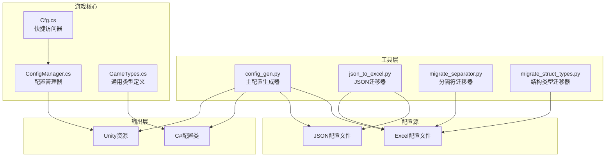

**图表来源**
- [config_gen.py:587-688](file://Tools/config_gen.py#L587-L688)
- [migrate_json_to_excel.py:485-596](file://Tools/migrate_json_to_excel.py#L485-L596)

**章节来源**
- [config_gen.py:1-688](file://Tools/config_gen.py#L1-L688)
- [migrate_json_to_excel.py:1-596](file://Tools/migrate_json_to_excel.py#L1-L596)

## 核心组件

### 配置生成器 (config_gen.py)

配置生成器是整个数据生成系统的核心，负责将Excel配置文件转换为JSON格式和对应的C#代码。

#### 类型系统
系统实现了完整的类型系统，支持基本类型、数组类型和结构体数组类型：

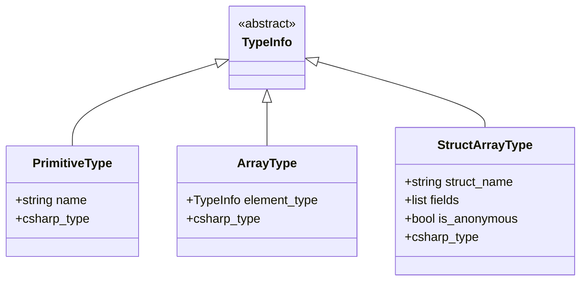

**图表来源**
- [config_gen.py:22-93](file://Tools/config_gen.py#L22-L93)

#### 数据转换机制
系统支持多种数据类型的转换，包括原始类型、数组类型和结构体数组类型：

- **原始类型转换**：整数、浮点数、字符串、布尔值
- **数组类型转换**：使用'|'分隔符的数组
- **结构体数组转换**：使用'~'分隔符的结构体字段

**章节来源**
- [config_gen.py:100-184](file://Tools/config_gen.py#L100-L184)
- [config_gen.py:191-237](file://Tools/config_gen.py#L191-L237)

### JSON到Excel迁移器 (migrate_json_to_excel.py)

该工具用于将现有的JSON配置文件迁移到Excel格式，便于编辑和管理。

#### 架构定义
工具通过预定义的架构定义来处理不同类型的配置：

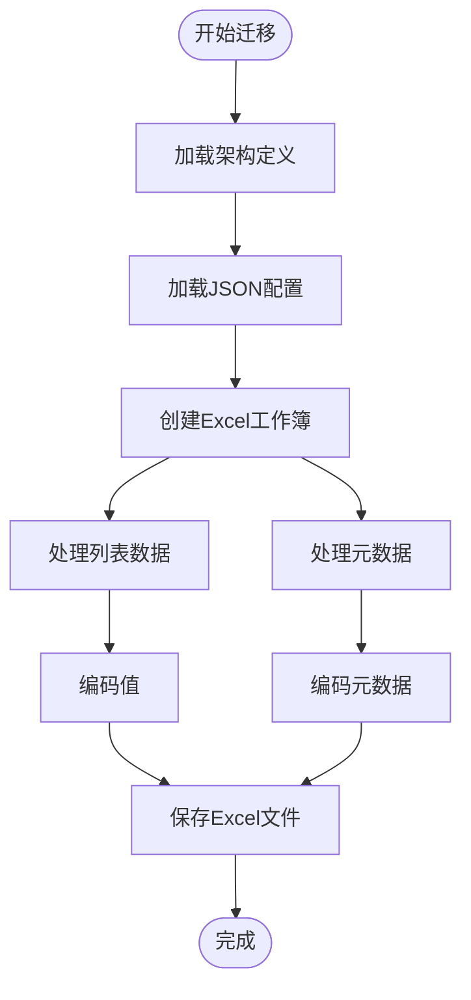

**图表来源**
- [migrate_json_to_excel.py:511-591](file://Tools/migrate_json_to_excel.py#L511-L591)

**章节来源**
- [migrate_json_to_excel.py:22-323](file://Tools/migrate_json_to_excel.py#L22-L323)

### 结构分隔符迁移器 (migrate_separator.py)

专门处理结构体字段分隔符从'-'到'~'的迁移，确保数据格式的一致性。

### 结构类型迁移器 (migrate_struct_types.py)

迁移命名结构类型到匿名结构类型，简化类型声明并提高灵活性。

## 架构概览

数据生成系统的整体架构采用分层设计，确保各组件职责清晰：

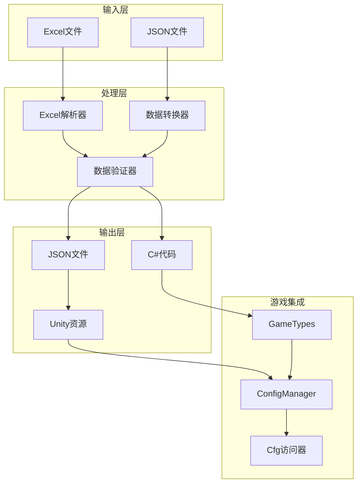

**图表来源**
- [config_gen.py:587-688](file://Tools/config_gen.py#L587-L688)
- [ConfigManager.cs:11-306](file://Assets/Scripts/Core/ConfigManager.cs#L11-L306)

## 详细组件分析

### 配置管理系统

#### ConfigManager组件
ConfigManager是游戏中的配置管理核心，负责加载和管理所有配置数据：

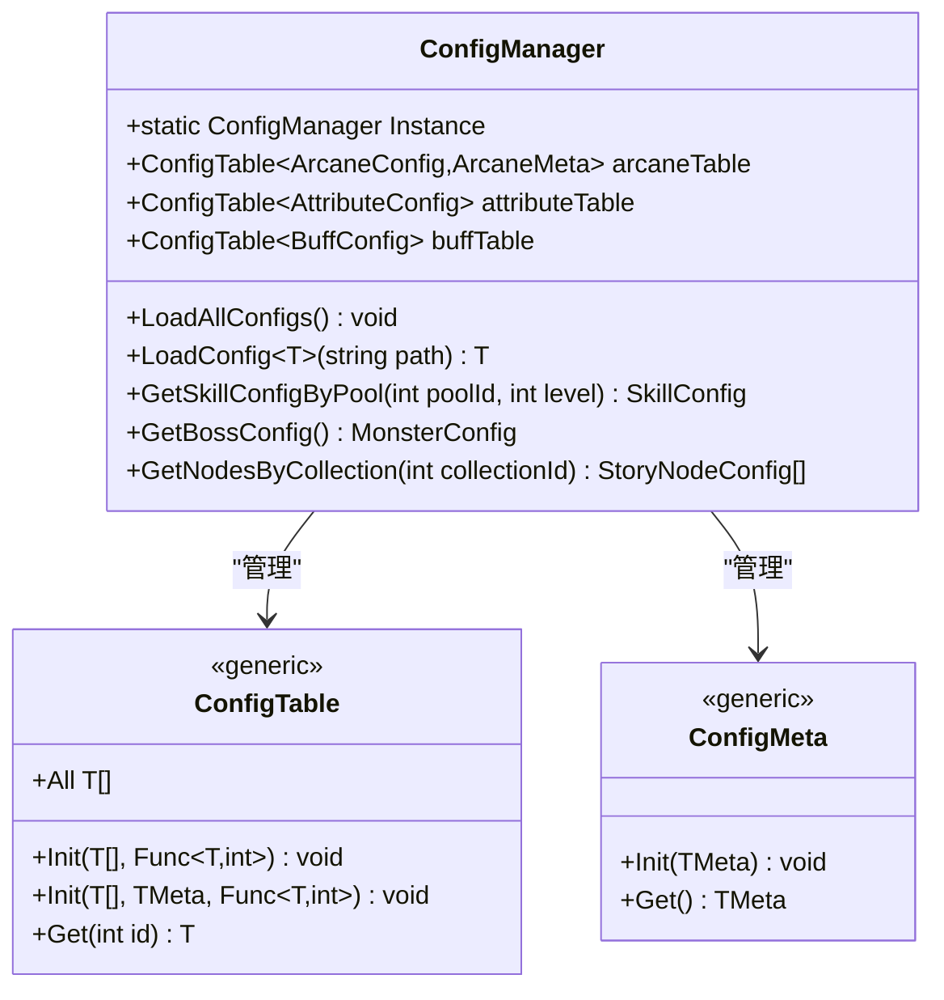

**图表来源**
- [ConfigManager.cs:11-306](file://Assets/Scripts/Core/ConfigManager.cs#L11-L306)

#### Cfg快捷访问器
Cfg类提供了静态访问接口，简化了配置数据的获取：

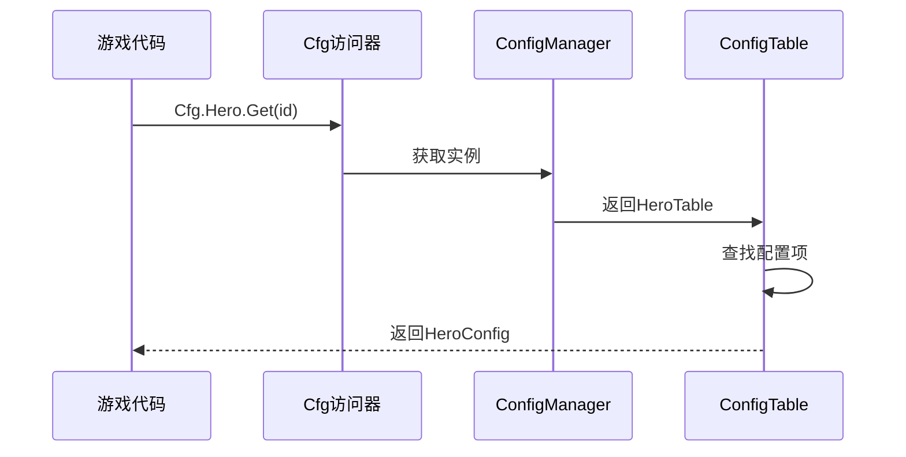

**图表来源**
- [Cfg.cs:7-35](file://Assets/Scripts/Core/Cfg.cs#L7-L35)

**章节来源**
- [ConfigManager.cs:1-306](file://Assets/Scripts/Core/ConfigManager.cs#L1-L306)
- [Cfg.cs:1-35](file://Assets/Scripts/Core/Cfg.cs#L1-L35)

### 数据类型系统

#### 通用类型定义
GameTypes.cs定义了跨表共享的配置结构体和运行时数据：

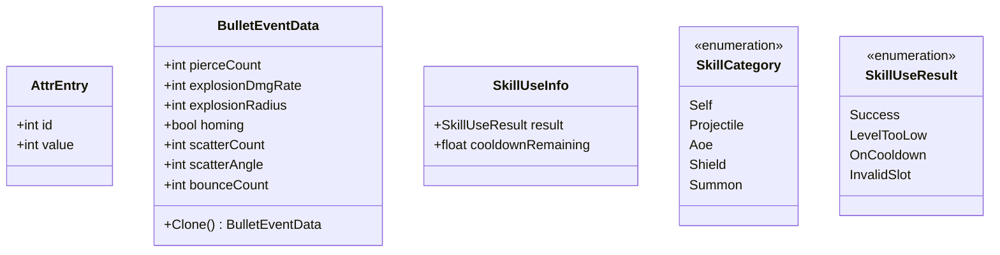

**图表来源**
- [GameTypes.cs:8-83](file://Assets/Scripts/Data/GameTypes.cs#L8-L83)

**章节来源**
- [GameTypes.cs:1-83](file://Assets/Scripts/Data/GameTypes.cs#L1-L83)

### 配置数据示例

#### 英雄配置示例
英雄配置展示了复杂的嵌套结构和数组类型：

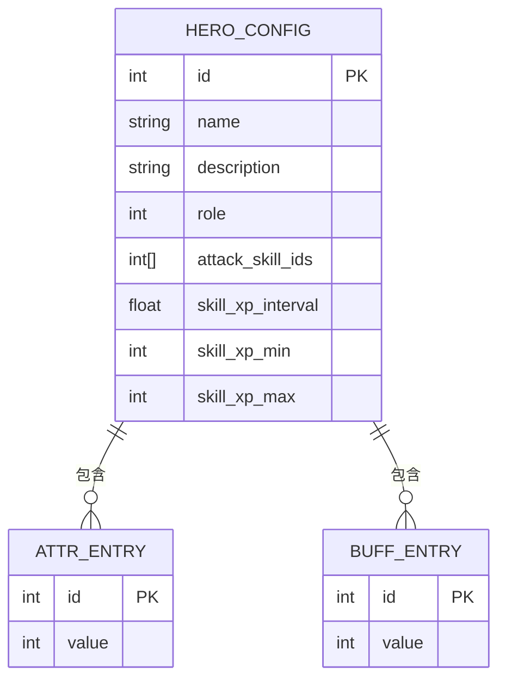

**图表来源**
- [hero_config.json:1-97](file://Assets/Resources/Configs/hero_config.json#L1-L97)

#### 关卡配置示例
关卡配置展示了复杂的数据结构和嵌套数组：

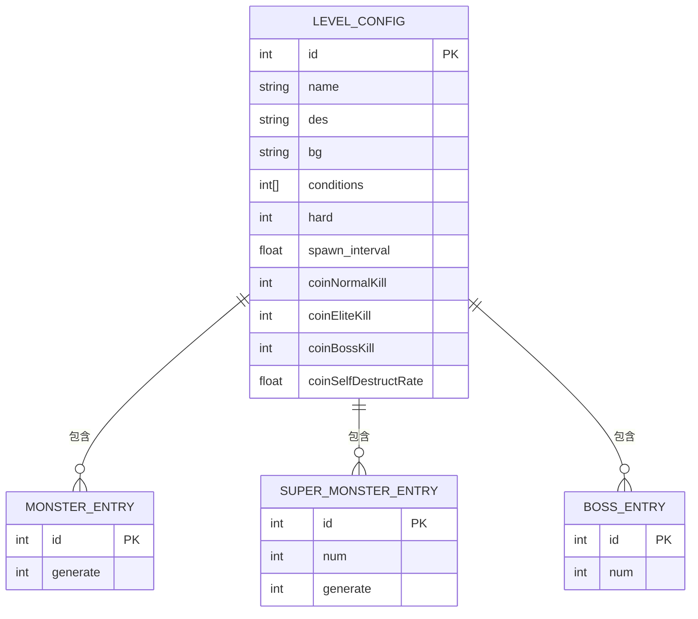

**图表来源**
- [level_config.json:1-141](file://Assets/Resources/Configs/level_config.json#L1-L141)

**章节来源**
- [hero_config.json:1-97](file://Assets/Resources/Configs/hero_config.json#L1-L97)
- [level_config.json:1-141](file://Assets/Resources/Configs/level_config.json#L1-L141)

## 依赖关系分析

### 外部依赖
系统对外部库的依赖主要集中在Excel处理上：

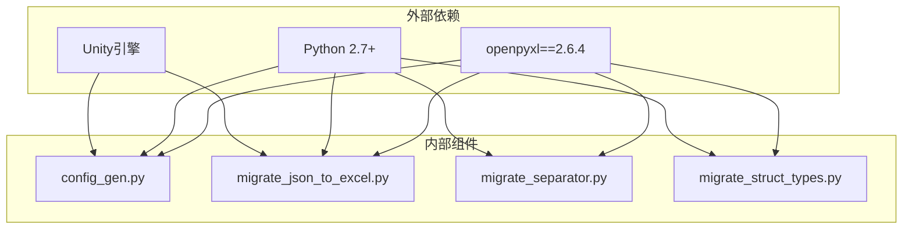

**图表来源**
- [requirements.txt:1-2](file://Tools/requirements.txt#L1-L2)

### 内部依赖关系
组件间的依赖关系体现了清晰的分层架构：

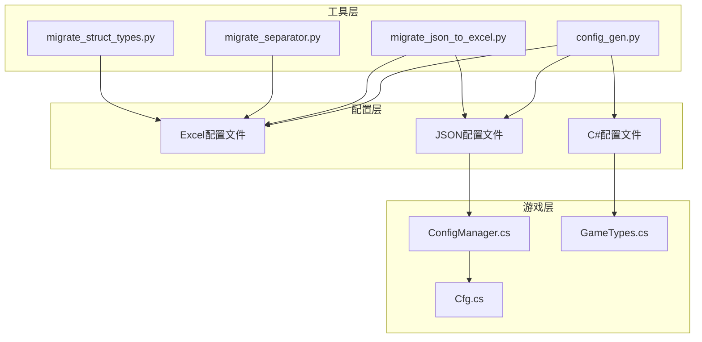

**图表来源**
- [config_gen.py:587-688](file://Tools/config_gen.py#L587-L688)

**章节来源**
- [requirements.txt:1-2](file://Tools/requirements.txt#L1-L2)

## 性能考虑

### 数据加载优化
配置管理系统采用了多种性能优化策略：

1. **延迟加载**：配置数据在首次访问时才进行解析
2. **缓存机制**：预加载常用配置到内存缓存
3. **增量更新**：支持部分配置的动态更新
4. **内存管理**：及时释放不再使用的配置数据

### 工具执行效率
数据生成工具在处理大量配置文件时采用了以下优化：

1. **批量处理**：一次处理多个Excel文件
2. **预扫描机制**：先扫描所有文件以收集结构定义
3. **流式处理**：避免一次性加载整个工作簿
4. **错误恢复**：单个文件错误不影响整体处理

## 故障排除指南

### 常见问题及解决方案

#### Excel文件格式问题
- **问题**：Excel文件无法正确解析
- **原因**：文件格式不兼容或损坏
- **解决**：使用Microsoft Excel重新保存文件

#### 类型转换错误
- **问题**：配置数据转换失败
- **原因**：数据类型不匹配或格式错误
- **解决**：检查Excel中的类型声明和数据格式

#### JSON生成问题
- **问题**：生成的JSON文件格式错误
- **原因**：特殊字符处理不当
- **解决**：检查分隔符使用和转义字符

#### 运行时配置加载失败
- **问题**：游戏启动时配置加载失败
- **原因**：资源配置路径错误或文件缺失
- **解决**：验证Resources目录结构和文件名

**章节来源**
- [config_gen.py:550-566](file://Tools/config_gen.py#L550-L566)
- [ConfigManager.cs:179-194](file://Assets/Scripts/Core/ConfigManager.cs#L179-L194)

## 结论

数据生成工具为GeometryTD项目提供了一个完整、灵活且高效的配置管理解决方案。通过四个核心工具的协同工作，实现了从Excel到JSON再到C#代码的完整转换流程，支持复杂的数据类型和结构体数组。

该系统的主要优势包括：

1. **灵活性**：支持多种数据类型和复杂结构
2. **可维护性**：提供完整的数据迁移和转换工具
3. **性能**：优化的加载和缓存机制
4. **扩展性**：模块化的架构设计便于功能扩展

通过标准化的配置管理流程，开发者可以更专注于游戏内容的创作，而无需担心底层数据管理的复杂性。该系统为类似的游戏项目提供了一个优秀的参考实现。