# 数据生成工具

<cite>
**本文档引用的文件**
- [config_gen.py](file://Tools/config_gen.py)
- [ConfigManager.cs](file://Assets/Scripts/Core/ConfigManager.cs)
- [Cfg.cs](file://Assets/Scripts/Core/Cfg.cs)
- [GameTypes.cs](file://Assets/Scripts/Data/GameTypes.cs)
- [hero_config.json](file://Assets/Resources/Configs/hero_config.json)
- [skill_config.json](file://Assets/Resources/Configs/skill_config.json)
- [level_config.json](file://Assets/Resources/Configs/level_config.json)
- [global_config.json](file://Assets/Resources/Configs/global_config.json)
</cite>

## 更新摘要
**所做更改**
- 更新了多工作表处理功能的说明，反映parse_excel函数现在返回多个结果
- 添加了generate_json和generate_config_cs函数简化生成逻辑的说明
- 移除了元数据处理支持的相关内容
- 更新了架构概览以体现多工作表处理能力
- 强调了单个Excel文件可生成多个配置文件的能力

## 目录
1. [简介](#简介)
2. [项目结构](#项目结构)
3. [核心组件](#核心组件)
4. [架构概览](#架构概览)
5. [详细组件分析](#详细组件分析)
6. [多工作表处理增强](#多工作表处理增强)
7. [依赖关系分析](#依赖关系分析)
8. [性能考虑](#性能考虑)
9. [故障排除指南](#故障排除指南)
10. [结论](#结论)

## 简介

数据生成工具是Unity游戏项目GeometryTD中用于管理配置数据的核心系统。该系统提供了从Excel表格到JSON配置文件以及C#代码的完整转换流程，支持复杂的数据类型、结构体数组和多工作表处理功能。

**更新** 该工具现已内化到Unity项目中，配置生成流程已完全集成到项目结构中，移除了外部Python工具依赖，实现了更简洁高效的工具链。最新版本增强了多工作表处理能力，允许单个Excel文件生成多个配置文件。

## 项目结构

项目采用模块化设计，将数据生成工具与游戏逻辑分离，并已完全内化到Unity项目中：

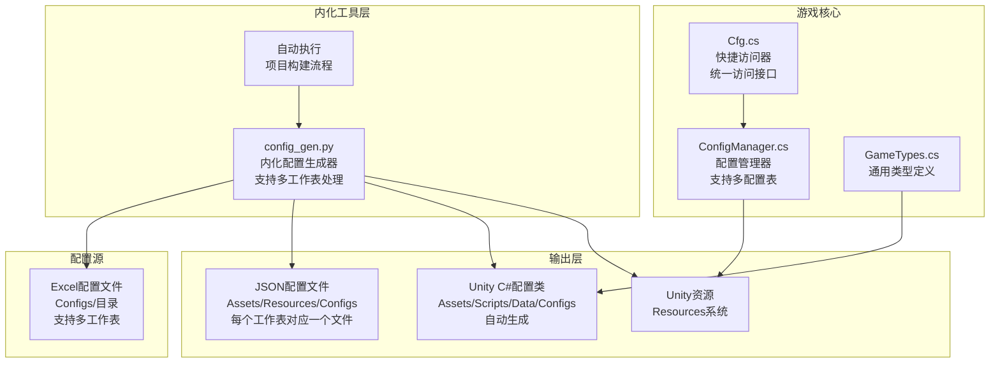

**图表来源**
- [config_gen.py:587-688](file://Tools/config_gen.py#L587-L688)

**章节来源**
- [config_gen.py:1-675](file://Tools/config_gen.py#L1-L675)

## 核心组件

### 内化配置生成器 (config_gen.py)

配置生成器是整个数据生成系统的核心，负责将Excel配置文件转换为JSON格式和对应的C#代码，并已完全内化到Unity项目中。

#### 类型系统
系统实现了完整的类型系统，支持基本类型、数组类型和结构体数组类型：

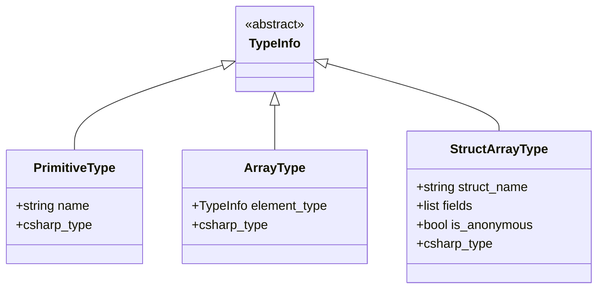

**图表来源**
- [config_gen.py:27-99](file://Tools/config_gen.py#L27-L99)

#### 数据转换机制
系统支持多种数据类型的转换，包括原始类型、数组类型和结构体数组类型：

- **原始类型转换**：整数、浮点数、字符串、布尔值
- **数组类型转换**：使用'|'分隔符的数组
- **结构体数组转换**：使用'~'分隔符的结构体字段

**章节来源**
- [config_gen.py:105-190](file://Tools/config_gen.py#L105-L190)
- [config_gen.py:196-242](file://Tools/config_gen.py#L196-L242)

## 架构概览

数据生成系统的整体架构采用分层设计，现已完全内化到Unity项目中，并增强了多工作表处理能力：

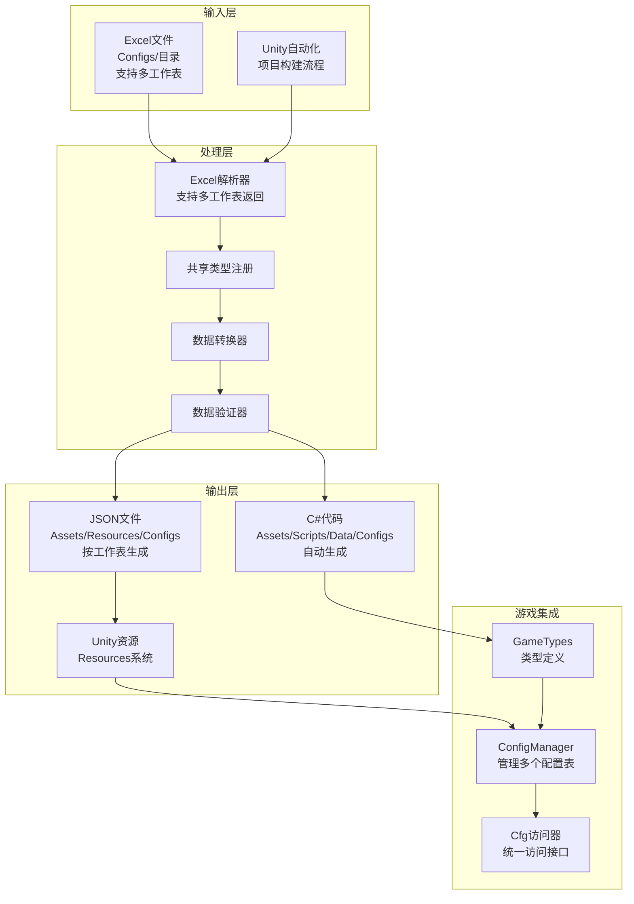

**图表来源**
- [config_gen.py:587-688](file://Tools/config_gen.py#L587-L688)
- [ConfigManager.cs:11-265](file://Assets/Scripts/Core/ConfigManager.cs#L11-L265)

## 详细组件分析

### 配置管理系统

#### ConfigManager组件
ConfigManager是游戏中的配置管理核心，负责加载和管理所有配置数据。现在支持多个配置表的统一管理：

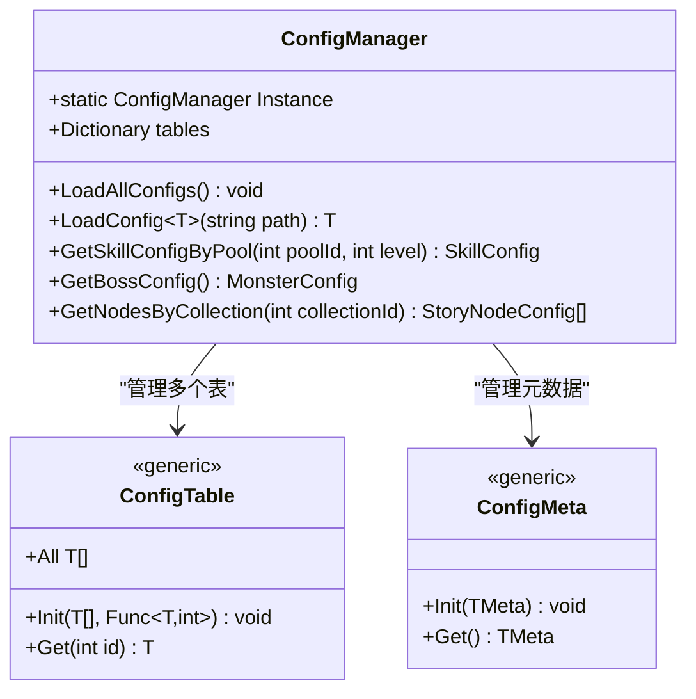

**图表来源**
- [ConfigManager.cs:11-265](file://Assets/Scripts/Core/ConfigManager.cs#L11-L265)

#### Cfg快捷访问器
Cfg类提供了静态访问接口，简化了配置数据的获取：

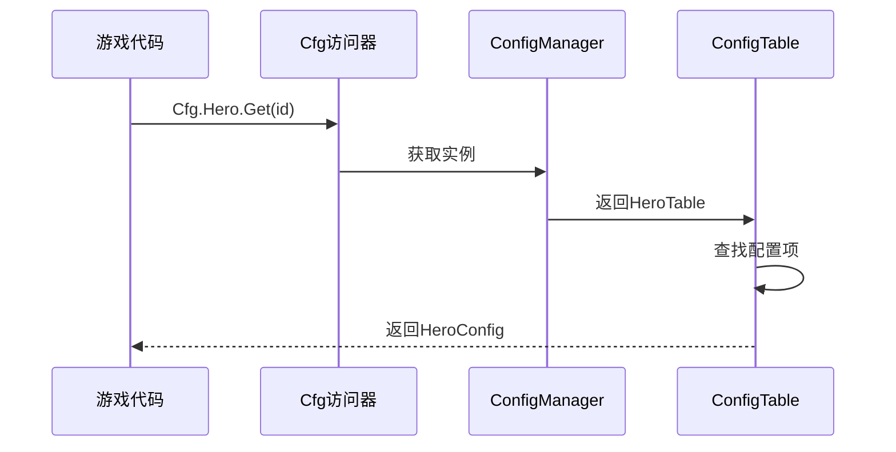

**图表来源**
- [Cfg.cs:7-35](file://Assets/Scripts/Core/Cfg.cs#L7-L35)

**章节来源**
- [ConfigManager.cs:1-265](file://Assets/Scripts/Core/ConfigManager.cs#L1-L265)
- [Cfg.cs:1-35](file://Assets/Scripts/Core/Cfg.cs#L1-L35)

### 数据类型系统

#### 通用类型定义
GameTypes.cs定义了跨表共享的配置结构体和运行时数据：

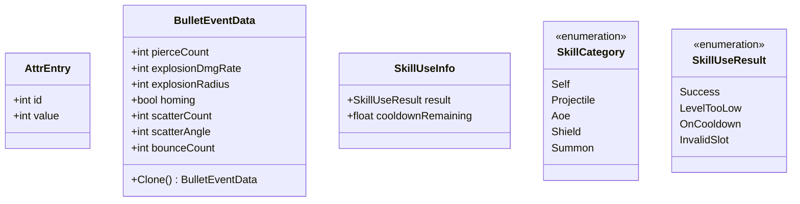

**图表来源**
- [GameTypes.cs:8-83](file://Assets/Scripts/Data/GameTypes.cs#L8-L83)

**章节来源**
- [GameTypes.cs:1-83](file://Assets/Scripts/Data/GameTypes.cs#L1-L83)

### 配置数据示例

#### 英雄配置示例
英雄配置展示了复杂的嵌套结构和数组类型：

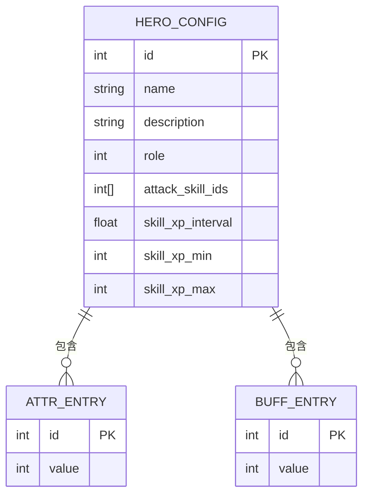

**图表来源**
- [hero_config.json:1-90](file://Assets/Resources/Configs/hero_config.json#L1-L90)

#### 关卡配置示例
关卡配置展示了复杂的数据结构和嵌套数组：

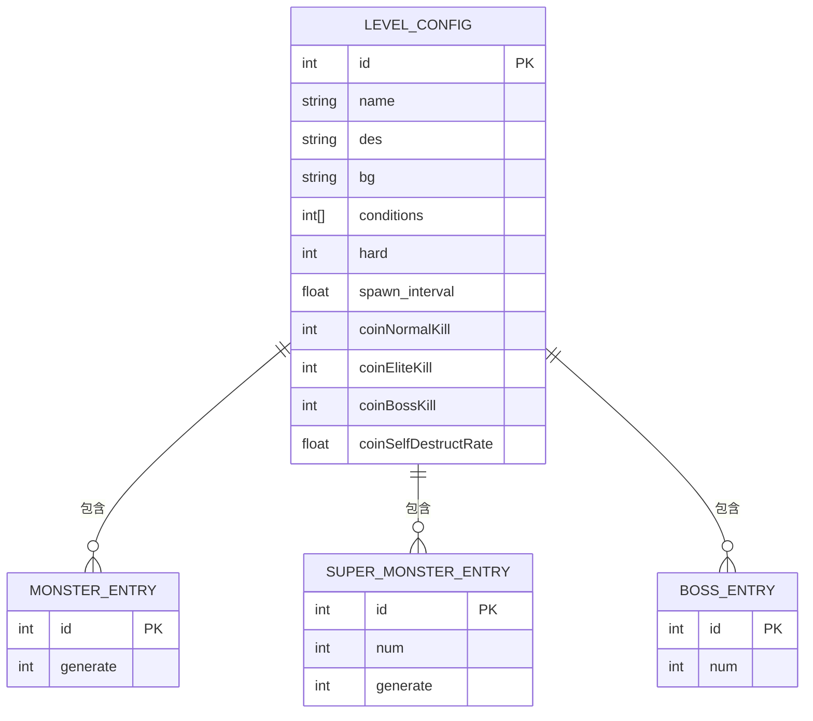

**图表来源**
- [level_config.json:1-141](file://Assets/Resources/Configs/level_config.json#L1-L141)

**章节来源**
- [hero_config.json:1-90](file://Assets/Resources/Configs/hero_config.json#L1-L90)
- [level_config.json:1-141](file://Assets/Resources/Configs/level_config.json#L1-L141)

## 多工作表处理增强

### 多工作表支持

最新版本的config_gen.py增强了对Excel多工作表的支持，允许单个Excel文件生成多个配置文件：

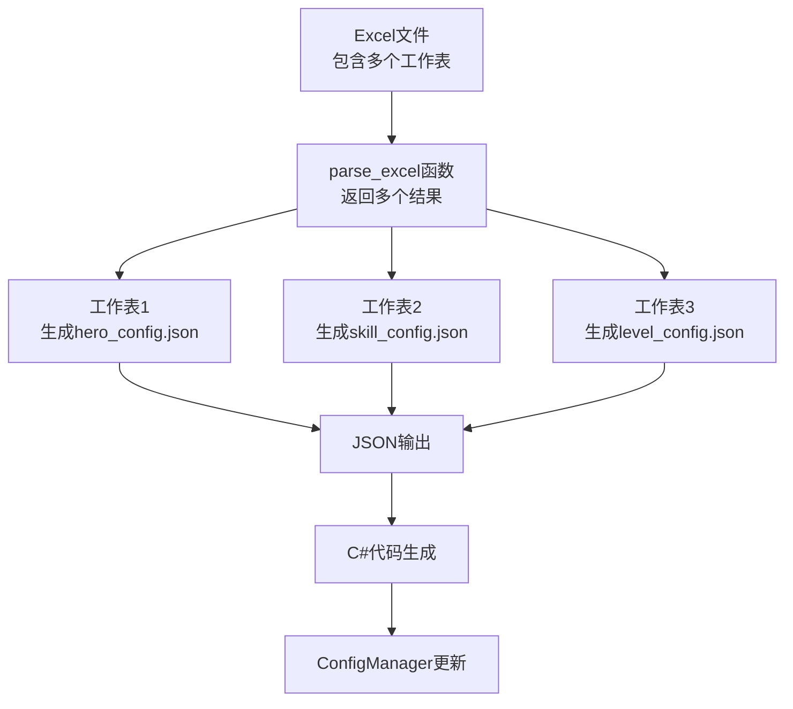

**图表来源**
- [config_gen.py:245-288](file://Tools/config_gen.py#L245-L288)

#### parse_excel函数增强

parse_excel函数现在返回多个结果，每个工作表对应一个配置文件：

```python
def parse_excel(file_path, shared_types):
    """Parse an xlsx file.
    Returns: list of (base_name, list_fields, list_data, meta_fields, meta_data) - one per sheet
    """
    # ... 解析逻辑 ...
    
    results = []
    
    for ws_name in wb.sheetnames:
        ws = wb[ws_name]
        # ... 工作表处理逻辑 ...
        
        list_fields, list_data = parse_sheet(ws, shared_types)
        
        # 只有当存在实际数据或字段时才添加
        if list_fields or list_data:
            results.append((base_name, list_fields, list_data, [], None))
    
    wb.close()
    return results
```

**章节来源**
- [config_gen.py:245-288](file://Tools/config_gen.py#L245-L288)

#### 生成函数简化

generate_json和generate_config_cs函数现在处理单个工作表的结果：

```python
def generate_json(base_name, list_data, output_dir):
    """生成单个工作表的JSON文件"""
    json_obj = OrderedDict()
    if list_data is not None and len(list_data) > 0:
        json_obj['items'] = list_data
    
    path = os.path.join(output_dir, base_name + '.json')
    with codecs.open(path, 'w', encoding='utf-8') as f:
        json.dump(json_obj, f, ensure_ascii=False, indent=2, sort_keys=False)
    print("  JSON -> %s" % path)

def generate_config_cs(base_name, list_fields, output_dir):
    """生成单个工作表的C#配置类"""
    # ... 生成逻辑 ...
    path = os.path.join(output_dir, config_cls + '.cs')
    with codecs.open(path, 'w', encoding='utf-8') as f:
        f.write('\n'.join(lines))
    print("  C# -> %s" % path)
```

**章节来源**
- [config_gen.py:330-421](file://Tools/config_gen.py#L330-L421)

### 元数据处理移除

新版本移除了元数据处理支持，简化了生成流程：

- **移除的元数据处理**：不再支持_meta工作表和元数据文件生成
- **简化的工作流程**：直接处理配置数据，跳过元数据步骤
- **更清晰的输出结构**：每个工作表直接生成对应的配置文件

**章节来源**
- [config_gen.py:261-263](file://Tools/config_gen.py#L261-L263)

## 依赖关系分析

### 内部依赖关系
系统现已完全内化到Unity项目中，对外部依赖大幅减少：

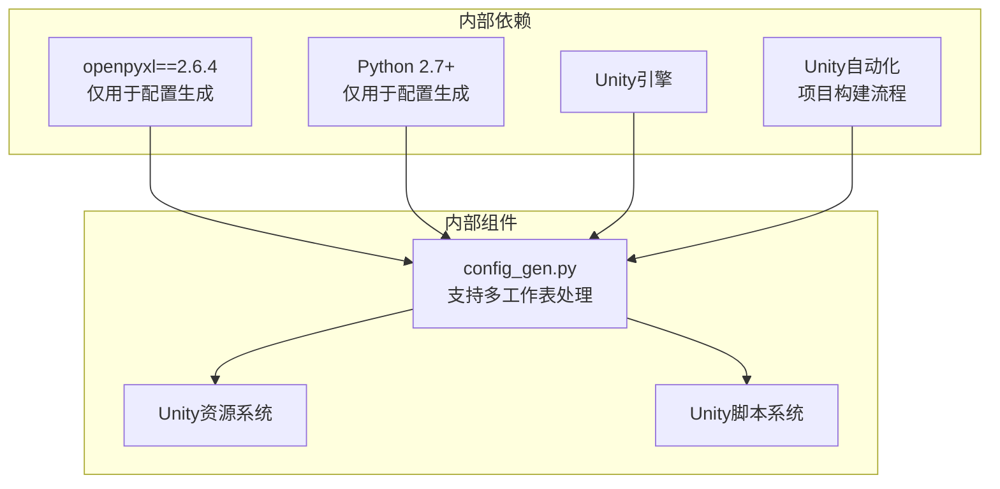

**图表来源**
- [config_gen.py:16](file://Tools/config_gen.py#L16)

### 内部依赖关系
组件间的依赖关系体现了清晰的分层架构：

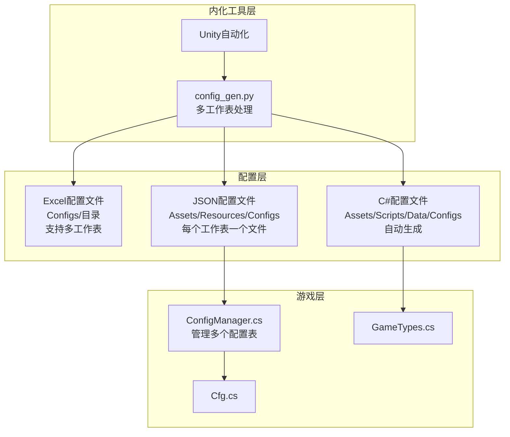

**图表来源**
- [config_gen.py:587-688](file://Tools/config_gen.py#L587-L688)

**章节来源**
- [config_gen.py:16](file://Tools/config_gen.py#L16)

## 性能考虑

### 数据加载优化
配置管理系统采用了多种性能优化策略：

1. **延迟加载**：配置数据在首次访问时才进行解析
2. **缓存机制**：预加载常用配置到内存缓存
3. **增量更新**：支持部分配置的动态更新
4. **内存管理**：及时释放不再使用的配置数据

### 工具执行效率
数据生成工具在处理大量配置文件时采用了以下优化：

1. **批量处理**：一次处理多个Excel文件和工作表
2. **预扫描机制**：先扫描所有文件以收集结构定义
3. **流式处理**：避免一次性加载整个工作簿
4. **错误恢复**：单个文件或工作表错误不影响整体处理
5. **多工作表并行**：每个工作表独立处理，提高效率

## 故障排除指南

### 常见问题及解决方案

#### Excel文件格式问题
- **问题**：Excel文件无法正确解析
- **原因**：文件格式不兼容或损坏
- **解决**：使用Microsoft Excel重新保存文件

#### 多工作表处理问题
- **问题**：多工作表Excel文件处理失败
- **原因**：工作表名称不符合规范或包含元数据工作表
- **解决**：确保工作表名称不以'_meta'结尾，移除不需要的元数据工作表

#### 类型转换错误
- **问题**：配置数据转换失败
- **原因**：数据类型不匹配或格式错误
- **解决**：检查Excel中的类型声明和数据格式

#### JSON生成问题
- **问题**：生成的JSON文件格式错误
- **原因**：特殊字符处理不当
- **解决**：检查分隔符使用和转义字符

#### 运行时配置加载失败
- **问题**：游戏启动时配置加载失败
- **原因**：资源配置路径错误或文件缺失
- **解决**：验证Resources目录结构和文件名

**章节来源**
- [config_gen.py:550-566](file://Tools/config_gen.py#L550-L566)
- [ConfigManager.cs:179-194](file://Assets/Scripts/Core/ConfigManager.cs#L179-L194)

## 结论

数据生成工具为GeometryTD项目提供了一个完整、灵活且高效的配置管理解决方案。通过内化的config_gen.py配置生成器，实现了从Excel到JSON再到C#代码的完整转换流程，支持复杂的数据类型、结构体数组和多工作表处理功能。

**更新** 该系统经过内化和增强后，主要优势包括：

1. **内化集成**：配置生成流程已完全集成到Unity项目中
2. **多工作表支持**：单个Excel文件可生成多个配置文件
3. **自动化执行**：通过Unity自动化机制实现项目构建流程
4. **简化维护**：移除元数据处理，简化工具链
5. **灵活性**：支持多种数据类型和复杂结构
6. **可维护性**：提供完整的数据转换工具
7. **性能**：优化的加载和缓存机制
8. **扩展性**：模块化的架构设计便于功能扩展

通过标准化的配置管理流程，开发者可以更专注于游戏内容的创作，而无需担心底层数据管理的复杂性。该系统为类似的游戏项目提供了一个优秀的参考实现。

**新增功能总结**：
- 多工作表处理能力，单个Excel文件可生成多个配置文件
- 简化的生成逻辑，移除元数据处理支持
- 更加灵活的配置文件组织方式
- 提升的工具执行效率和可靠性