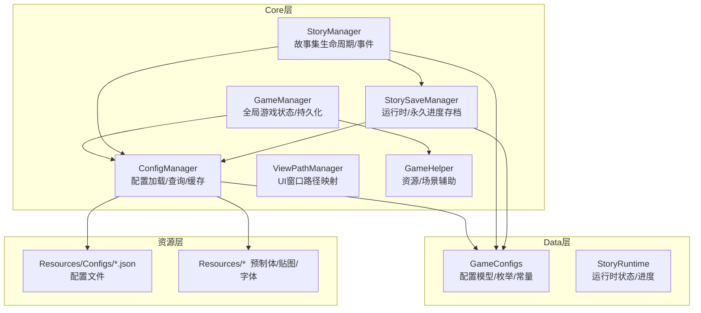
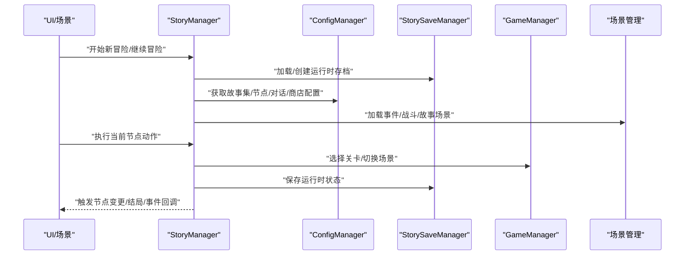
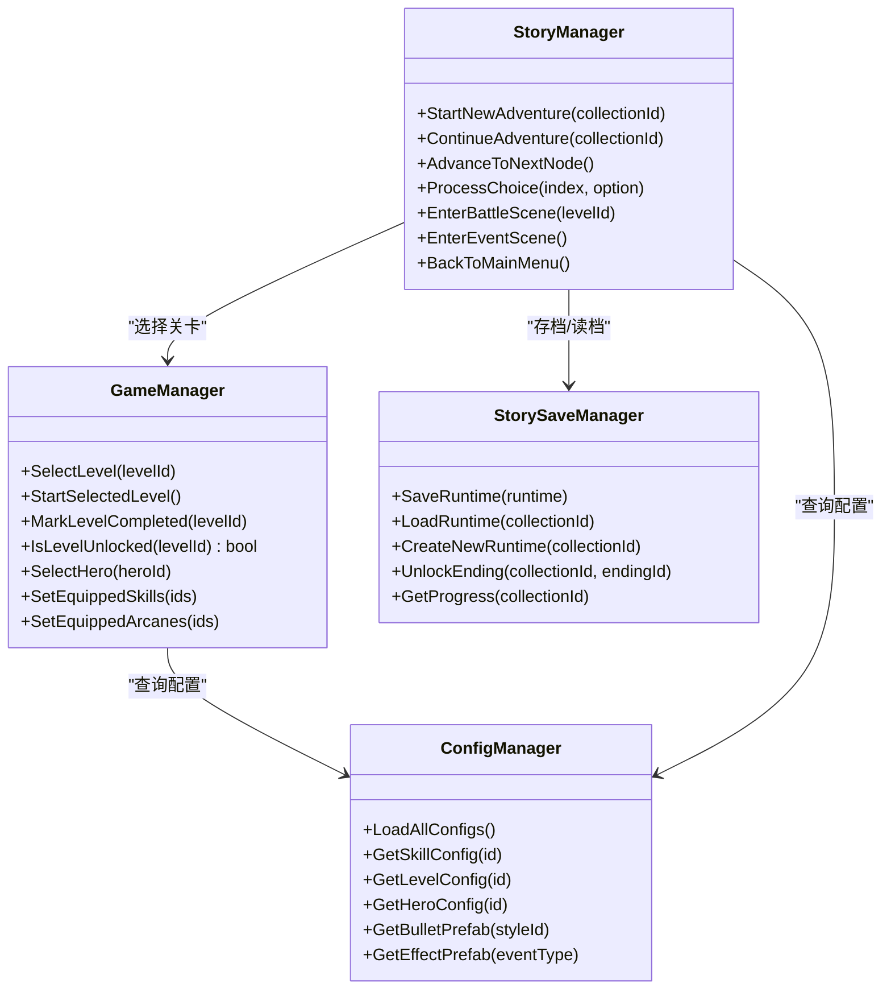
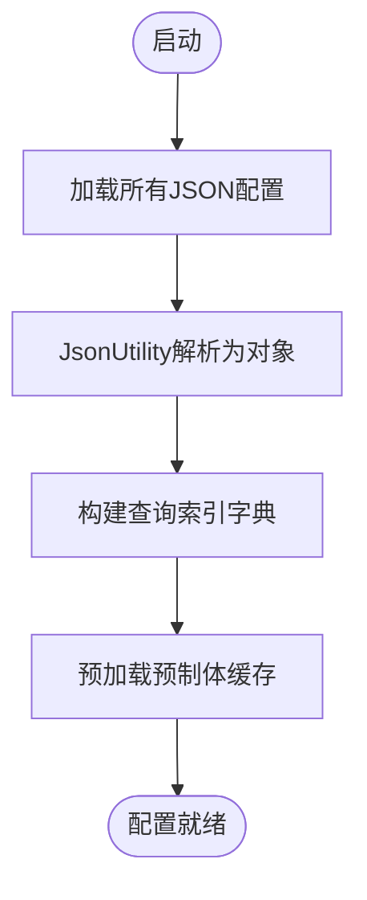
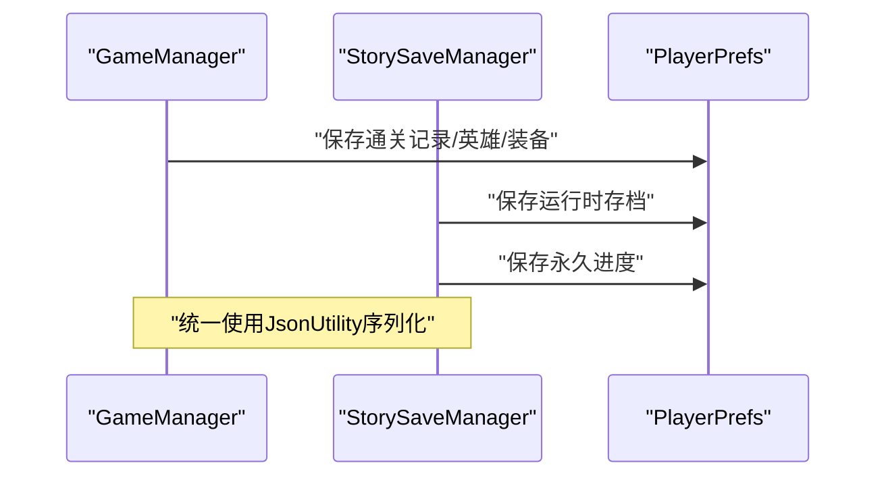
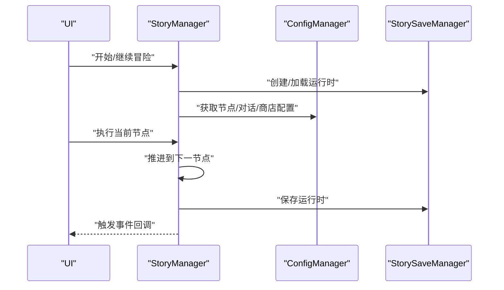
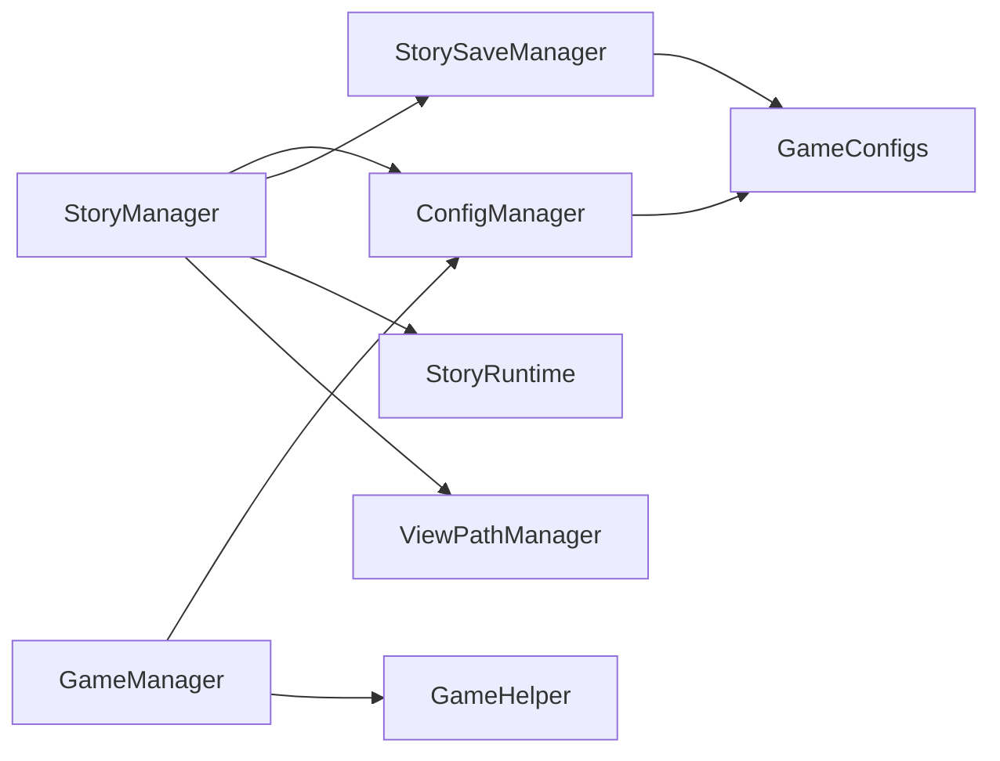

# 核心架构

<cite>
**本文引用的文件**
- [GameManager.cs](file://Assets/Scripts/Core/GameManager.cs)
- [ConfigManager.cs](file://Assets/Scripts/Core/ConfigManager.cs)
- [StoryManager.cs](file://Assets/Scripts/Core/StoryManager.cs)
- [StorySaveManager.cs](file://Assets/Scripts/Core/StorySaveManager.cs)
- [GameConfigs.cs](file://Assets/Scripts/Data/GameConfigs.cs)
- [StoryRuntime.cs](file://Assets/Scripts/Data/StoryRuntime.cs)
- [GameHelper.cs](file://Assets/Scripts/Core/GameHelper.cs)
- [ViewPathManager.cs](file://Assets/Scripts/Core/ViewPathManager.cs)
- [game_config.json](file://Assets/Resources/Configs/game_config.json)
- [level_config.json](file://Assets/Resources/Configs/level_config.json)
- [hero_config.json](file://Assets/Resources/Configs/hero_config.json)
</cite>

## 目录
1. [简介](#简介)
2. [项目结构](#项目结构)
3. [核心组件](#核心组件)
4. [架构总览](#架构总览)
5. [详细组件分析](#详细组件分析)
6. [依赖关系分析](#依赖关系分析)
7. [性能考虑](#性能考虑)
8. [故障排查指南](#故障排查指南)
9. [结论](#结论)
10. [附录](#附录)

## 简介
本文件面向GeometryTD项目的核心架构文档，聚焦以下主题：
- 单例模式在GameManager、ConfigManager、StoryManager中的应用与差异
- 系统边界划分与模块间交互关系
- Core层作为系统核心的职责与设计原则
- 配置驱动开发模式的实现机制（ConfigManager如何管理JSON配置与预制体缓存）
- 数据持久化架构（PlayerPrefs使用模式与策略）
- 扩展点与插件机制（通过新增配置文件扩展游戏内容）
- 系统上下文图与组件分解图
- 跨模块关注点（性能优化、内存管理、错误处理）

## 项目结构
项目采用“Scripts/Core”、“Scripts/Data”、“Scripts/UI”、“Scripts/Battle”等分层组织，其中Core层负责全局状态与配置管理，Data层承载配置模型与运行时数据，UI与Battle层基于Core与Data进行业务编排。

图表来源
- [GameManager.cs:1-239](file://Assets/Scripts/Core/GameManager.cs#L1-L239)
- [ConfigManager.cs:1-619](file://Assets/Scripts/Core/ConfigManager.cs#L1-L619)
- [StoryManager.cs:1-589](file://Assets/Scripts/Core/StoryManager.cs#L1-L589)
- [StorySaveManager.cs:1-179](file://Assets/Scripts/Core/StorySaveManager.cs#L1-L179)
- [GameConfigs.cs:1-775](file://Assets/Scripts/Data/GameConfigs.cs#L1-L775)
- [StoryRuntime.cs:1-288](file://Assets/Scripts/Data/StoryRuntime.cs#L1-L288)
- [GameHelper.cs:1-84](file://Assets/Scripts/Core/GameHelper.cs#L1-L84)
- [ViewPathManager.cs:1-33](file://Assets/Scripts/Core/ViewPathManager.cs#L1-L33)

章节来源
- [GameManager.cs:1-239](file://Assets/Scripts/Core/GameManager.cs#L1-L239)
- [ConfigManager.cs:1-619](file://Assets/Scripts/Core/ConfigManager.cs#L1-L619)
- [StoryManager.cs:1-589](file://Assets/Scripts/Core/StoryManager.cs#L1-L589)
- [StorySaveManager.cs:1-179](file://Assets/Scripts/Core/StorySaveManager.cs#L1-L179)
- [GameConfigs.cs:1-775](file://Assets/Scripts/Data/GameConfigs.cs#L1-L775)
- [StoryRuntime.cs:1-288](file://Assets/Scripts/Data/StoryRuntime.cs#L1-L288)
- [GameHelper.cs:1-84](file://Assets/Scripts/Core/GameHelper.cs#L1-L84)
- [ViewPathManager.cs:1-33](file://Assets/Scripts/Core/ViewPathManager.cs#L1-L33)

## 核心组件
- GameManager：全局游戏状态与持久化，负责关卡选择、英雄/技能/奥术装备、通关记录等。采用单例（Awake销毁重复实例，DontDestroyOnLoad跨场景保留）。
- ConfigManager：配置驱动核心，集中加载与缓存各类JSON配置，构建查询索引，并预加载预制体缓存（子弹、特效、角色）。
- StoryManager：故事集生命周期管理，推进节点、处理选择、金币与藏品系统、场景切换、Boss事件等。采用延迟初始化单例。
- StorySaveManager：故事集存档管理，运行时中途存档与永久进度存档，统一使用PlayerPrefs + JsonUtility。
- GameConfigs：配置模型定义与常量枚举，提供属性、事件、节点、结局、效果等类型定义。
- StoryRuntime：故事集运行时状态，支持序列化，包含节点选择记录、金币、已拥有藏品、访问历史等。
- GameHelper：资源与场景辅助工具，提供Sprite/Prefab加载、窗口打开、场景切换等。
- ViewPathManager：UI窗口预制体路径映射，支持注册与回退默认路径。

章节来源
- [GameManager.cs:1-239](file://Assets/Scripts/Core/GameManager.cs#L1-L239)
- [ConfigManager.cs:1-619](file://Assets/Scripts/Core/ConfigManager.cs#L1-L619)
- [StoryManager.cs:1-589](file://Assets/Scripts/Core/StoryManager.cs#L1-L589)
- [StorySaveManager.cs:1-179](file://Assets/Scripts/Core/StorySaveManager.cs#L1-L179)
- [GameConfigs.cs:1-775](file://Assets/Scripts/Data/GameConfigs.cs#L1-L775)
- [StoryRuntime.cs:1-288](file://Assets/Scripts/Data/StoryRuntime.cs#L1-L288)
- [GameHelper.cs:1-84](file://Assets/Scripts/Core/GameHelper.cs#L1-L84)
- [ViewPathManager.cs:1-33](file://Assets/Scripts/Core/ViewPathManager.cs#L1-L33)

## 架构总览
系统以Core层为核心，围绕配置驱动与数据持久化两条主线展开：
- 配置驱动：ConfigManager集中加载Resources/Configs下的JSON配置，构建字典索引，提供O(1)查询；同时预加载常用预制体到缓存，降低运行时开销。
- 数据持久化：GameManager与StorySaveManager均使用PlayerPrefs进行本地存储，采用JsonUtility序列化复杂对象，确保跨版本兼容与易维护性。
- 生命周期与事件：StoryManager管理故事集的完整生命周期，结合ConfigManager提供的节点/对话/商店/结局配置，驱动UI与场景切换。

图表来源
- [StoryManager.cs:96-130](file://Assets/Scripts/Core/StoryManager.cs#L96-L130)
- [StorySaveManager.cs:33-100](file://Assets/Scripts/Core/StorySaveManager.cs#L33-L100)
- [ConfigManager.cs:77-122](file://Assets/Scripts/Core/ConfigManager.cs#L77-L122)
- [GameManager.cs:46-63](file://Assets/Scripts/Core/GameManager.cs#L46-L63)

## 详细组件分析

### 单例模式与职责边界
- GameManager：全局唯一，负责关卡选择、通关记录、英雄/技能/奥术装备持久化。通过Awake销毁重复实例，DontDestroyOnLoad保证跨场景存在。
- ConfigManager：全局唯一，负责配置加载、索引构建、预制体缓存。同样通过Awake销毁重复实例，DontDestroyOnLoad。
- StoryManager：延迟初始化单例（静态属性在首次访问时创建GameObject并挂载组件）。负责故事集生命周期与事件驱动。

图表来源
- [GameManager.cs:36-155](file://Assets/Scripts/Core/GameManager.cs#L36-L155)
- [ConfigManager.cs:77-122](file://Assets/Scripts/Core/ConfigManager.cs#L77-L122)
- [StoryManager.cs:96-130](file://Assets/Scripts/Core/StoryManager.cs#L96-L130)
- [StorySaveManager.cs:33-100](file://Assets/Scripts/Core/StorySaveManager.cs#L33-L100)

章节来源
- [GameManager.cs:23-34](file://Assets/Scripts/Core/GameManager.cs#L23-L34)
- [ConfigManager.cs:65-75](file://Assets/Scripts/Core/ConfigManager.cs#L65-L75)
- [StoryManager.cs:83-92](file://Assets/Scripts/Core/StoryManager.cs#L83-L92)

### 配置驱动开发模式
- 配置加载：ConfigManager在Awake中调用LoadAllConfigs，统一从Resources/Configs加载各JSON配置，使用JsonUtility.FromJson<T>解析。
- 索引构建：为每类配置建立Dictionary索引（如技能、等级、角色、事件等），实现O(1)查询；部分配置采用线性遍历（如怪物配置）。
- 预加载缓存：预加载子弹样式与特效对应的预制体到缓存字典，避免运行时频繁Resources.Load。
- 扩展机制：新增配置文件只需在Resources/Configs下添加JSON，并在ConfigManager中声明字段、构建索引与提供查询方法，即可被其他模块透明使用。

图表来源
- [ConfigManager.cs:77-122](file://Assets/Scripts/Core/ConfigManager.cs#L77-L122)
- [ConfigManager.cs:169-198](file://Assets/Scripts/Core/ConfigManager.cs#L169-L198)
- [ConfigManager.cs:200-215](file://Assets/Scripts/Core/ConfigManager.cs#L200-L215)

章节来源
- [ConfigManager.cs:77-122](file://Assets/Scripts/Core/ConfigManager.cs#L77-L122)
- [ConfigManager.cs:169-198](file://Assets/Scripts/Core/ConfigManager.cs#L169-L198)
- [ConfigManager.cs:200-215](file://Assets/Scripts/Core/ConfigManager.cs#L200-L215)

### 数据持久化架构
- GameManager：使用PlayerPrefs存储通关记录、英雄选择、技能/奥术装备；保存时将集合序列化为逗号分隔字符串，读取时解析。
- StorySaveManager：运行时中途存档（StorySaveData）与永久进度（StoryProgressData）均通过JsonUtility序列化后写入PlayerPrefs；永久进度在首次访问时懒加载到内存缓存。
- 设计原则：统一使用PlayerPrefs + JsonUtility，保证跨平台一致性与易维护性；运行时存档频繁保存，永久进度只在变更时保存。

图表来源
- [GameManager.cs:159-211](file://Assets/Scripts/Core/GameManager.cs#L159-L211)
- [GameManager.cs:215-236](file://Assets/Scripts/Core/GameManager.cs#L215-L236)
- [StorySaveManager.cs:33-60](file://Assets/Scripts/Core/StorySaveManager.cs#L33-L60)
- [StorySaveManager.cs:104-150](file://Assets/Scripts/Core/StorySaveManager.cs#L104-L150)

章节来源
- [GameManager.cs:159-211](file://Assets/Scripts/Core/GameManager.cs#L159-L211)
- [GameManager.cs:215-236](file://Assets/Scripts/Core/GameManager.cs#L215-L236)
- [StorySaveManager.cs:104-150](file://Assets/Scripts/Core/StorySaveManager.cs#L104-L150)

### 故事集生命周期与事件流
- 生命周期：StartNewAdventure/CreateNewRuntime -> ContinueAdventure -> AdvanceToNextNode/ExecuteCurrentNode -> EndAdventure/AbandonAdventure。
- 事件驱动：节点推进根据选择记录匹配nextNodes条件；处理选择发放金币与藏品；战斗失败支持重试。
- 场景切换：EnterBattleScene/EnterEventScene/EnterStoryScene/BackToMainMenu统一通过SceneManager切换场景并重置Time.timeScale。

图表来源
- [StoryManager.cs:96-130](file://Assets/Scripts/Core/StoryManager.cs#L96-L130)
- [StoryManager.cs:171-186](file://Assets/Scripts/Core/StoryManager.cs#L171-L186)
- [StoryManager.cs:539-560](file://Assets/Scripts/Core/StoryManager.cs#L539-L560)
- [StorySaveManager.cs:33-60](file://Assets/Scripts/Core/StorySaveManager.cs#L33-L60)

章节来源
- [StoryManager.cs:96-130](file://Assets/Scripts/Core/StoryManager.cs#L96-L130)
- [StoryManager.cs:171-186](file://Assets/Scripts/Core/StoryManager.cs#L171-L186)
- [StoryManager.cs:539-560](file://Assets/Scripts/Core/StoryManager.cs#L539-L560)

### 扩展点与插件机制
- 新增配置文件：在Resources/Configs下添加新的JSON文件，定义配置模型与数据；在ConfigManager中声明字段、加载与索引构建方法；在GameConfigs中补充类型定义。
- 新增预制体：在Resources下放置预制体，配置文件中引用路径；ConfigManager预加载到缓存字典，运行时直接查询使用。
- 新增故事集：在story_collection_config.json与story_node_config.json中新增节点与分支逻辑，StoryManager根据nextNodes条件推进。

章节来源
- [ConfigManager.cs:77-122](file://Assets/Scripts/Core/ConfigManager.cs#L77-L122)
- [GameConfigs.cs:613-774](file://Assets/Scripts/Data/GameConfigs.cs#L613-L774)
- [level_config.json:1-80](file://Assets/Resources/Configs/level_config.json#L1-L80)
- [hero_config.json:1-44](file://Assets/Resources/Configs/hero_config.json#L1-L44)
- [game_config.json:1-9](file://Assets/Resources/Configs/game_config.json#L1-L9)

## 依赖关系分析
- Core层内部依赖：StoryManager依赖ConfigManager与StorySaveManager；GameManager依赖ConfigManager与PlayerPrefs；GameHelper与ViewPathManager为通用工具。
- Core层对外依赖：ConfigManager依赖Resources/Configs与Resources下的预制体；StorySaveManager依赖PlayerPrefs与JsonUtility。
- 数据层依赖：GameConfigs提供类型定义；StoryRuntime提供序列化能力。

图表来源
- [ConfigManager.cs:1-619](file://Assets/Scripts/Core/ConfigManager.cs#L1-L619)
- [StoryManager.cs:1-589](file://Assets/Scripts/Core/StoryManager.cs#L1-L589)
- [StorySaveManager.cs:1-179](file://Assets/Scripts/Core/StorySaveManager.cs#L1-L179)
- [GameManager.cs:1-239](file://Assets/Scripts/Core/GameManager.cs#L1-L239)
- [GameConfigs.cs:1-775](file://Assets/Scripts/Data/GameConfigs.cs#L1-L775)
- [StoryRuntime.cs:1-288](file://Assets/Scripts/Data/StoryRuntime.cs#L1-L288)
- [GameHelper.cs:1-84](file://Assets/Scripts/Core/GameHelper.cs#L1-L84)
- [ViewPathManager.cs:1-33](file://Assets/Scripts/Core/ViewPathManager.cs#L1-L33)

章节来源
- [ConfigManager.cs:1-619](file://Assets/Scripts/Core/ConfigManager.cs#L1-L619)
- [StoryManager.cs:1-589](file://Assets/Scripts/Core/StoryManager.cs#L1-L589)
- [StorySaveManager.cs:1-179](file://Assets/Scripts/Core/StorySaveManager.cs#L1-L179)
- [GameManager.cs:1-239](file://Assets/Scripts/Core/GameManager.cs#L1-L239)
- [GameConfigs.cs:1-775](file://Assets/Scripts/Data/GameConfigs.cs#L1-L775)
- [StoryRuntime.cs:1-288](file://Assets/Scripts/Data/StoryRuntime.cs#L1-L288)
- [GameHelper.cs:1-84](file://Assets/Scripts/Core/GameHelper.cs#L1-L84)
- [ViewPathManager.cs:1-33](file://Assets/Scripts/Core/ViewPathManager.cs#L1-L33)

## 性能考虑
- 配置查询优化：ConfigManager为高频查询构建字典索引，避免线性扫描；预加载预制体缓存减少Resources.Load开销。
- 持久化策略：PlayerPrefs写入采用批量保存（Save），避免频繁IO；运行时存档在关键节点保存，永久进度仅在变更时保存。
- 场景切换：统一设置Time.timeScale=1，避免暂停状态影响体验。
- UI路径映射：ViewPathManager提供注册与回退机制，减少硬编码路径带来的维护成本。

[本节为通用性能建议，无需特定文件引用]

## 故障排查指南
- 配置加载失败：检查Resources/Configs下JSON文件是否存在与命名正确；确认JsonUtility解析未报错；查看ConfigManager日志输出。
- 预制体加载失败：检查prefabPath是否正确；确认Resources目录结构；查看ConfigManager的警告日志。
- 故事集推进异常：检查StoryNodeConfig的nextNodes条件与选择记录是否匹配；确认ResolveNextNodeId逻辑。
- 存档读取失败：检查PlayerPrefs键名与格式；确认JsonUtility序列化/反序列化过程；验证StorySaveData/StoryProgressData结构。
- 单例冲突：确认Awake中重复实例销毁逻辑；确保DontDestroyOnLoad仅在正确时机调用。

章节来源
- [ConfigManager.cs:200-215](file://Assets/Scripts/Core/ConfigManager.cs#L200-L215)
- [ConfigManager.cs:169-198](file://Assets/Scripts/Core/ConfigManager.cs#L169-L198)
- [StoryRuntime.cs:120-193](file://Assets/Scripts/Data/StoryRuntime.cs#L120-L193)
- [StorySaveManager.cs:51-60](file://Assets/Scripts/Core/StorySaveManager.cs#L51-L60)
- [GameManager.cs:23-34](file://Assets/Scripts/Core/GameManager.cs#L23-L34)

## 结论
GeometryTD采用清晰的Core层架构与配置驱动开发模式，通过ConfigManager集中管理配置与缓存，结合PlayerPrefs实现数据持久化，StoryManager驱动故事集生命周期与事件流。单例模式在不同组件中采用合适策略（Awake销毁重复实例与延迟初始化），满足跨场景与按需创建的需求。整体架构具备良好的扩展性与可维护性，便于通过新增配置文件快速扩展游戏内容。

[本节为总结性内容，无需特定文件引用]

## 附录
- 配置文件示例：game_config.json、level_config.json、hero_config.json展示了配置驱动的基本形态。
- 运行时数据：StoryRuntime提供完整的序列化支持，便于存档与进度管理。

章节来源
- [game_config.json:1-9](file://Assets/Resources/Configs/game_config.json#L1-L9)
- [level_config.json:1-80](file://Assets/Resources/Configs/level_config.json#L1-L80)
- [hero_config.json:1-44](file://Assets/Resources/Configs/hero_config.json#L1-L44)
- [StoryRuntime.cs:10-287](file://Assets/Scripts/Data/StoryRuntime.cs#L10-L287)