# 游戏常量与类型

<cite>
**本文档引用的文件**
- [GameConsts.cs](file://Assets/Scripts/Data/GameConsts.cs)
- [GameTypes.cs](file://Assets/Scripts/Data/GameTypes.cs)
- [Cfg.cs](file://Assets/Scripts/Core/Cfg.cs)
- [ConfigManager.cs](file://Assets/Scripts/Core/ConfigManager.cs)
- [ConfigTable.cs](file://Assets/Scripts/Core/ConfigTable.cs)
- [GameHelper.cs](file://Assets/Scripts/Core/GameHelper.cs)
- [DamageCalculator.cs](file://Assets/Scripts/Battle/DamageCalculator.cs)
- [SkillManager.cs](file://Assets/Scripts/Battle/SkillManager.cs)
- [AttrComponent.cs](file://Assets/Scripts/Battle/AttrComponent.cs)
- [StoryRuntime.cs](file://Assets/Scripts/Data/StoryRuntime.cs)
- [BuffSystem.cs](file://Assets/Scripts/Battle/BuffSystem.cs)
- [BuffConfig.cs](file://Assets/Scripts/Data/Configs/BuffConfig.cs)
- [BossController.cs](file://Assets/Scripts/Battle/BossController.cs)
- [HeroController.cs](file://Assets/Scripts/Battle/HeroController.cs)
- [MonsterController.cs](file://Assets/Scripts/Battle/MonsterController.cs)
- [attribute_config.json](file://Assets/Resources/Configs/attribute_config.json)
- [skill_config.json](file://Assets/Resources/Configs/skill_config.json)
- [bullet_style_config.json](file://Assets/Resources/Configs/bullet_style_config.json)
- [bullet_event_config.json](file://Assets/Resources/Configs/bullet_event_config.json)
- [monster_config.json](file://Assets/Resources/Configs/monster_config.json)
</cite>

## 更新摘要
**变更内容**
- 更新了BuffSpecialEventType枚举部分，增加了关于反击事件的详细注释说明
- 新增了反击事件在战斗系统中的具体应用场景分析
- 补充了BuffSystem中TryCounterAttack方法的详细工作流程

## 目录
1. [简介](#简介)
2. [项目结构](#项目结构)
3. [核心组件](#核心组件)
4. [架构概览](#架构概览)
5. [详细组件分析](#详细组件分析)
6. [依赖关系分析](#依赖关系分析)
7. [性能考虑](#性能考虑)
8. [故障排除指南](#故障排除指南)
9. [结论](#结论)

## 简介

本项目是一个基于Unity的游戏项目，专注于游戏常量与类型系统的实现。项目采用配置驱动的设计模式，通过JSON配置文件定义游戏常量、类型和行为，实现了高度模块化的游戏系统架构。

游戏的核心特点包括：
- 基于配置的常量管理系统
- 类型安全的配置表结构
- 面向对象的战斗系统设计
- 完整的故事集系统
- 可扩展的技能和属性系统

## 项目结构

项目采用分层架构设计，主要分为以下几个层次：

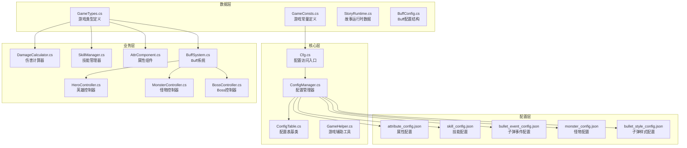

**图表来源**
- [GameConsts.cs:1-167](file://Assets/Scripts/Data/GameConsts.cs#L1-L167)
- [GameTypes.cs:1-83](file://Assets/Scripts/Data/GameTypes.cs#L1-L83)
- [Cfg.cs:1-35](file://Assets/Scripts/Core/Cfg.cs#L1-L35)
- [ConfigManager.cs:1-306](file://Assets/Scripts/Core/ConfigManager.cs#L1-L306)

**章节来源**
- [GameConsts.cs:1-167](file://Assets/Scripts/Data/GameConsts.cs#L1-L167)
- [GameTypes.cs:1-83](file://Assets/Scripts/Data/GameTypes.cs#L1-L83)
- [Cfg.cs:1-35](file://Assets/Scripts/Core/Cfg.cs#L1-L35)

## 核心组件

### 游戏常量系统

游戏常量系统通过静态类提供统一的常量定义，确保代码的一致性和可维护性。

#### 属性ID系统
属性ID系统采用分层设计，将属性按照功能分类：

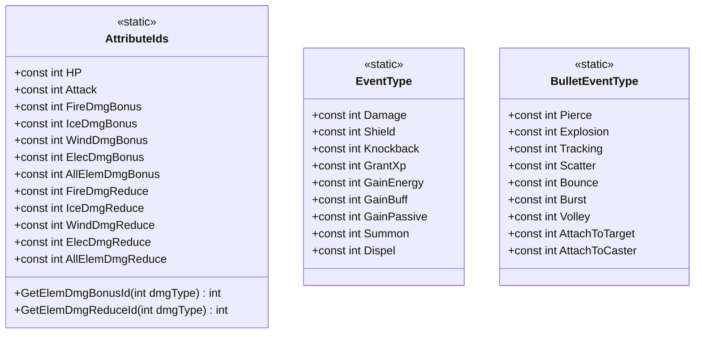

**图表来源**
- [GameConsts.cs:5-69](file://Assets/Scripts/Data/GameConsts.cs#L5-L69)
- [GameConsts.cs:72-97](file://Assets/Scripts/Data/GameConsts.cs#L72-L97)

#### Buff特殊事件类型系统
Buff特殊事件类型系统定义了各种Buff效果的特殊事件类型，特别强化了反击事件的说明：

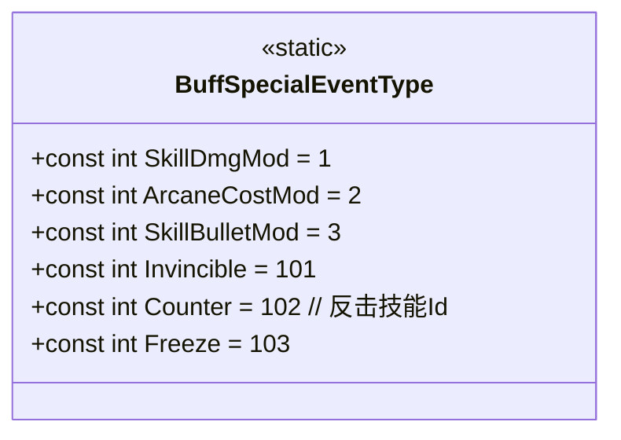

**更新** 新增了对Counter（反击）事件的详细注释说明，明确指出其存储的是技能Id而非伤害值。

**图表来源**
- [GameConsts.cs:99-115](file://Assets/Scripts/Data/GameConsts.cs#L99-L115)

#### 故事集系统常量
故事集系统包含完整的节点类型和结局类型定义：

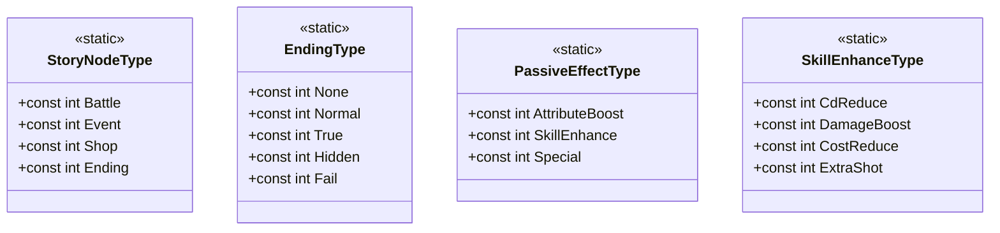

**图表来源**
- [GameConsts.cs:117-149](file://Assets/Scripts/Data/GameConsts.cs#L117-L149)

**章节来源**
- [GameConsts.cs:1-167](file://Assets/Scripts/Data/GameConsts.cs#L1-L167)

### 游戏类型系统

游戏类型系统定义了跨表共享的数据结构和枚举类型：

#### 配置数据结构
配置系统采用泛型设计，支持不同类型的配置数据：

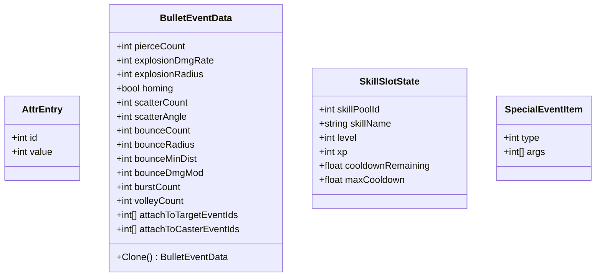

**图表来源**
- [GameTypes.cs:8-56](file://Assets/Scripts/Data/GameTypes.cs#L8-L56)
- [BuffConfig.cs:21-25](file://Assets/Scripts/Data/Configs/BuffConfig.cs#L21-L25)

#### 枚举类型
系统定义了多个枚举类型来描述游戏状态：

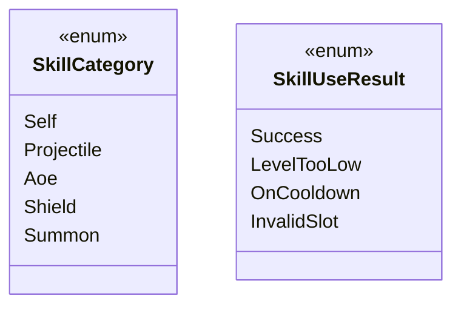

**图表来源**
- [GameTypes.cs:60-82](file://Assets/Scripts/Data/GameTypes.cs#L60-L82)

**章节来源**
- [GameTypes.cs:1-83](file://Assets/Scripts/Data/GameTypes.cs#L1-L83)

## 架构概览

项目采用配置驱动的架构模式，通过配置管理器统一管理所有游戏配置：

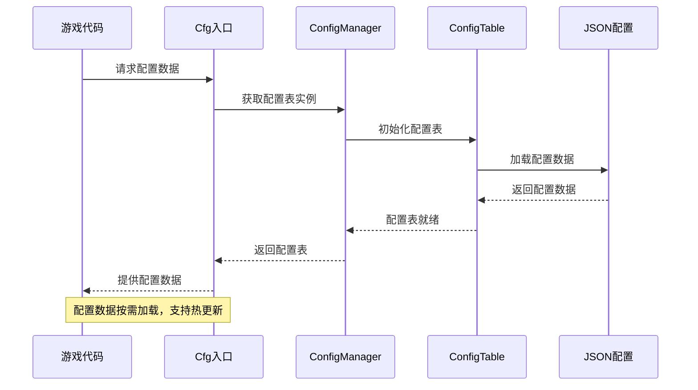

**图表来源**
- [Cfg.cs:7-33](file://Assets/Scripts/Core/Cfg.cs#L7-L33)
- [ConfigManager.cs:56-177](file://Assets/Scripts/Core/ConfigManager.cs#L56-L177)
- [ConfigTable.cs:17-32](file://Assets/Scripts/Core/ConfigTable.cs#L17-L32)

### 配置表架构

配置表系统采用泛型设计，支持不同类型的数据结构：

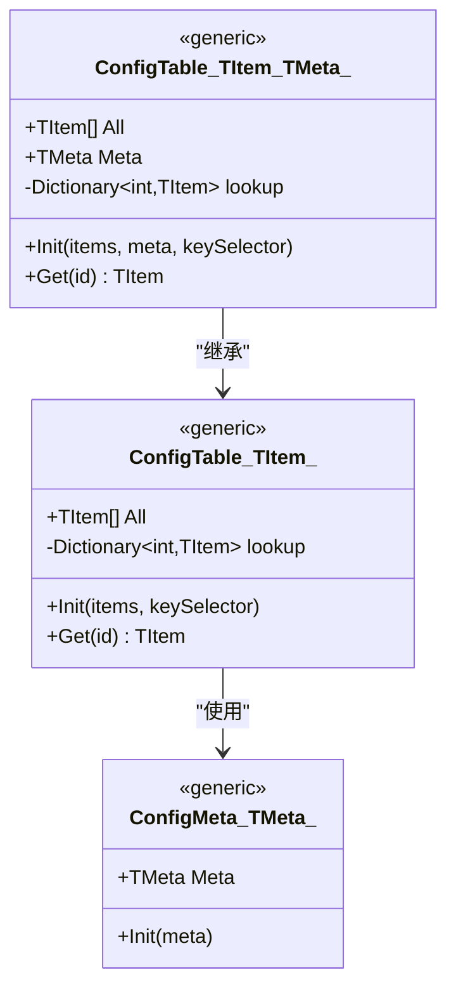

**图表来源**
- [ConfigTable.cs:11-71](file://Assets/Scripts/Core/ConfigTable.cs#L11-L71)

**章节来源**
- [ConfigManager.cs:1-306](file://Assets/Scripts/Core/ConfigManager.cs#L1-L306)
- [ConfigTable.cs:1-73](file://Assets/Scripts/Core/ConfigTable.cs#L1-L73)

## 详细组件分析

### 伤害计算系统

伤害计算系统是战斗机制的核心，实现了复杂的伤害公式和属性计算：

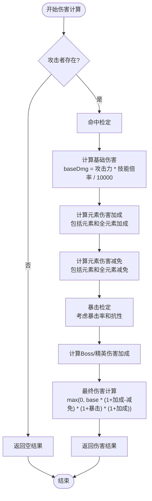

**图表来源**
- [DamageCalculator.cs:24-103](file://Assets/Scripts/Battle/DamageCalculator.cs#L24-L103)

#### 伤害计算流程详解

伤害计算系统包含以下关键步骤：

1. **命中检定**：基于攻击者的命中率和防守者的闪避率进行检定
2. **基础伤害计算**：使用攻击力和技能伤害倍率计算基础伤害
3. **元素属性处理**：应用元素伤害加成和减免
4. **暴击系统**：检定暴击并计算暴击伤害
5. **特殊目标加成**：对Boss和精英单位的额外伤害

**章节来源**
- [DamageCalculator.cs:1-106](file://Assets/Scripts/Battle/DamageCalculator.cs#L1-L106)

### 技能管理系统

技能管理系统负责技能槽位的状态管理和技能使用逻辑：

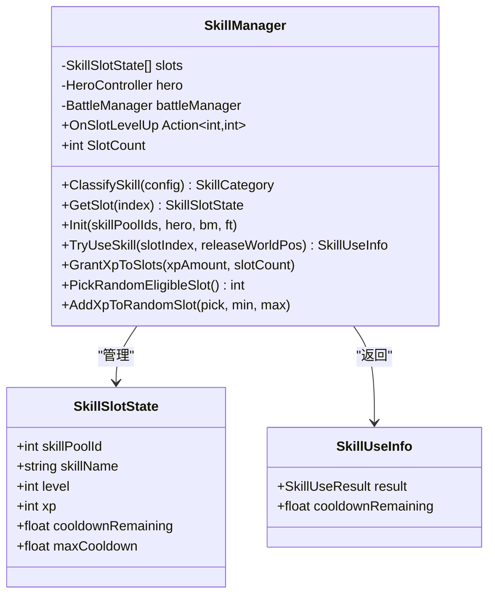

**图表来源**
- [SkillManager.cs:15-240](file://Assets/Scripts/Battle/SkillManager.cs#L15-L240)

#### 技能槽位系统

技能槽位系统支持多技能池和等级提升机制：

1. **技能池识别**：通过技能池ID识别不同的技能系列
2. **等级系统**：技能经验累积到10点升级，最高10级
3. **冷却管理**：独立的冷却计时器管理技能使用间隔
4. **随机分配**：支持随机分配经验点数给技能槽位

**章节来源**
- [SkillManager.cs:1-242](file://Assets/Scripts/Battle/SkillManager.cs#L1-L242)

### 属性系统

属性系统为角色提供基础的数值属性管理：

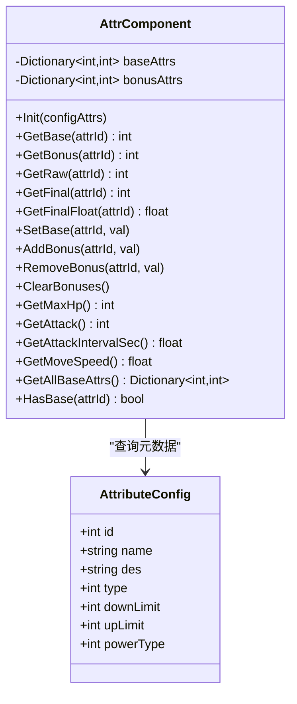

**图表来源**
- [AttrComponent.cs:6-127](file://Assets/Scripts/Battle/AttrComponent.cs#L6-L127)

#### 属性计算机制

属性系统采用分层计算模型：

1. **基础属性**：从配置中加载的基础数值
2. **临时加成**：动态计算的临时属性加成
3. **上限下限限制**：根据属性元数据设置的数值范围
4. **浮点数转换**：百分比属性转换为小数形式

**章节来源**
- [AttrComponent.cs:1-129](file://Assets/Scripts/Battle/AttrComponent.cs#L1-L129)

### Buff系统与反击机制

Buff系统是游戏战斗机制的重要组成部分，特别强化了反击事件的实现：

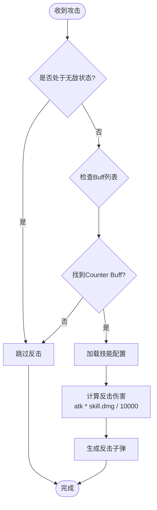

**更新** 新增了Buff系统中反击机制的详细流程图，展示了Counter事件的完整执行过程。

**图表来源**
- [BuffSystem.cs:330-378](file://Assets/Scripts/Battle/BuffSystem.cs#L330-L378)

#### 反击事件实现详解

反击事件是Buff系统中的重要特殊事件类型，具有以下特点：

1. **事件类型标识**：Counter（102）表示反击事件
2. **参数含义**：args[0]存储的是技能Id而非伤害值
3. **触发时机**：在角色受到攻击时立即触发
4. **伤害计算**：基于角色攻击力和技能伤害倍率计算
5. **技能应用**：使用指定技能的子弹事件和效果

**章节来源**
- [BuffSystem.cs:1-378](file://Assets/Scripts/Battle/BuffSystem.cs#L1-L378)
- [BuffConfig.cs:21-25](file://Assets/Scripts/Data/Configs/BuffConfig.cs#L21-L25)

### 故事集系统

故事集系统提供了完整的剧情推进和选择分支机制：

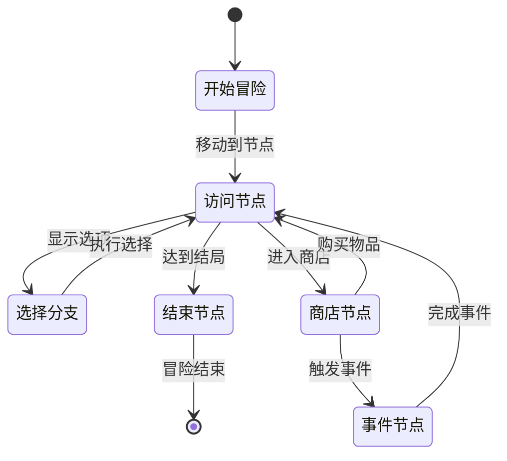

**图表来源**
- [StoryRuntime.cs:107-193](file://Assets/Scripts/Data/StoryRuntime.cs#L107-L193)

#### 故事运行时状态

故事集系统包含以下关键组件：

1. **运行时数据**：保存当前冒险过程中的状态信息
2. **永久进度**：记录解锁的结局和成就信息
3. **选择记录**：跟踪玩家在故事中的决策
4. **节点解析**：根据选择和条件确定下一个节点

**章节来源**
- [StoryRuntime.cs:1-288](file://Assets/Scripts/Data/StoryRuntime.cs#L1-L288)

## 依赖关系分析

项目采用松耦合的设计，通过接口和抽象类实现模块间的解耦：

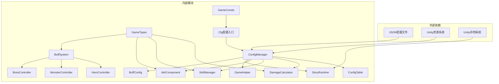

**图表来源**
- [ConfigManager.cs:15-46](file://Assets/Scripts/Core/ConfigManager.cs#L15-L46)
- [GameHelper.cs:13-47](file://Assets/Scripts/Core/GameHelper.cs#L13-L47)

### 关键依赖关系

1. **配置依赖**：所有业务逻辑都依赖配置管理器提供的配置数据
2. **资源依赖**：配置管理器依赖Unity的Resources系统加载配置文件
3. **存档依赖**：故事集系统依赖Unity的PlayerPrefs进行数据持久化
4. **Buff依赖**：控制器类依赖BuffSystem进行特殊事件处理

**章节来源**
- [ConfigManager.cs:1-306](file://Assets/Scripts/Core/ConfigManager.cs#L1-L306)
- [GameHelper.cs:1-84](file://Assets/Scripts/Core/GameHelper.cs#L1-L84)

## 性能考虑

### 配置缓存策略

项目采用了多层次的缓存机制来优化性能：

1. **配置表缓存**：ConfigManager缓存所有加载的配置表
2. **预制体缓存**：缓存子弹和特效预制体以避免重复加载
3. **字典查找**：使用字典进行O(1)时间复杂度的配置查找

### 内存优化

1. **延迟加载**：配置文件按需加载，减少启动时间
2. **对象池**：技能槽位状态使用对象池避免频繁GC
3. **数据结构优化**：使用高效的字典和列表结构

## 故障排除指南

### 常见问题及解决方案

#### 配置加载失败
**问题**：游戏启动时报错"Failed to load"或"Failed to parse"
**原因**：配置文件路径错误或JSON格式不正确
**解决方案**：
1. 检查配置文件是否位于正确的Resources路径
2. 验证JSON格式的正确性
3. 确认配置文件编码为UTF-8

#### 技能使用异常
**问题**：技能无法正常使用或冷却时间异常
**原因**：技能配置错误或技能槽位状态异常
**解决方案**：
1. 检查技能配置文件中的cd字段
2. 验证技能池ID的正确性
3. 确认技能槽位初始化是否正确

#### 伤害计算异常
**问题**：伤害数值不符合预期
**原因**：属性配置错误或计算公式异常
**解决方案**：
1. 检查属性配置文件中的数值设置
2. 验证伤害计算公式的参数
3. 确认元素属性的加成和减免计算

#### 反击事件异常
**问题**：角色受到攻击时没有触发反击
**原因**：Buff配置错误或Counter事件参数设置不当
**解决方案**：
1. 检查Buff配置中的specialEvent数组
2. 确认Counter事件的args参数包含有效的技能Id
3. 验证技能配置是否存在且有效

**章节来源**
- [ConfigManager.cs:179-194](file://Assets/Scripts/Core/ConfigManager.cs#L179-L194)
- [SkillManager.cs:87-137](file://Assets/Scripts/Battle/SkillManager.cs#L87-L137)
- [DamageCalculator.cs:24-103](file://Assets/Scripts/Battle/DamageCalculator.cs#L24-L103)
- [BuffSystem.cs:330-378](file://Assets/Scripts/Battle/BuffSystem.cs#L330-L378)

## 结论

本项目的游戏常量与类型系统展现了优秀的软件工程实践：

1. **模块化设计**：清晰的分层架构和职责分离
2. **配置驱动**：通过配置文件实现灵活的游戏平衡调整
3. **类型安全**：强类型系统确保代码的正确性和可维护性
4. **扩展性**：模块化设计支持新功能的快速集成
5. **性能优化**：多层次缓存和优化的数据结构

**更新** 最新的增强包括对BuffSpecialEventType枚举中Counter事件的详细注释说明，明确了其参数存储的是技能Id而非伤害值，这为开发者提供了更清晰的API使用指导。

该系统为游戏开发提供了坚实的基础，支持复杂的游戏机制实现和灵活的平衡调整。通过配置驱动的方式，开发者可以快速迭代游戏内容，而无需修改大量代码。Buff系统的反击机制进一步丰富了战斗策略的深度，为玩家提供了更多的战术选择。