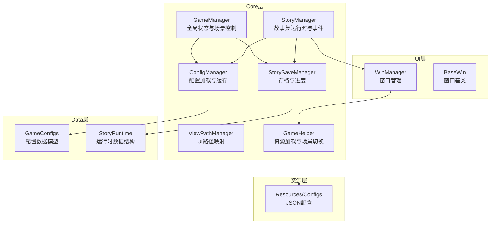
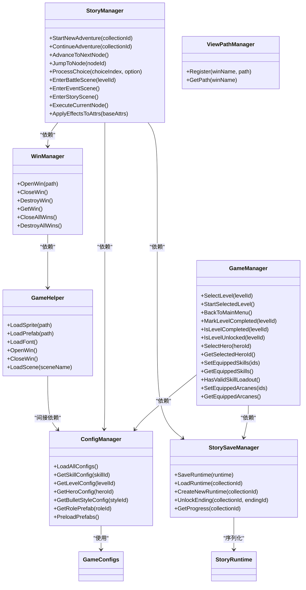
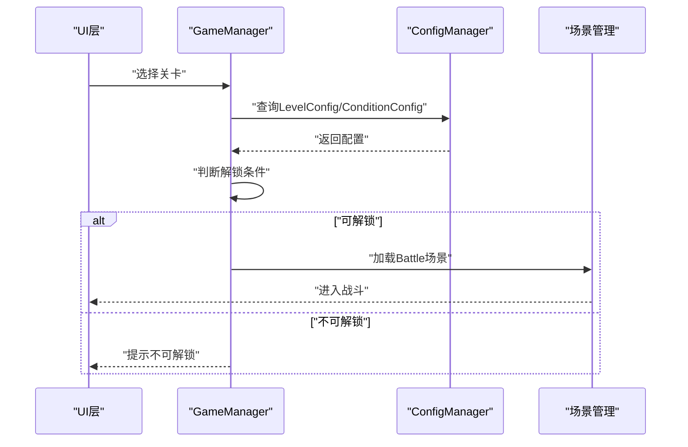
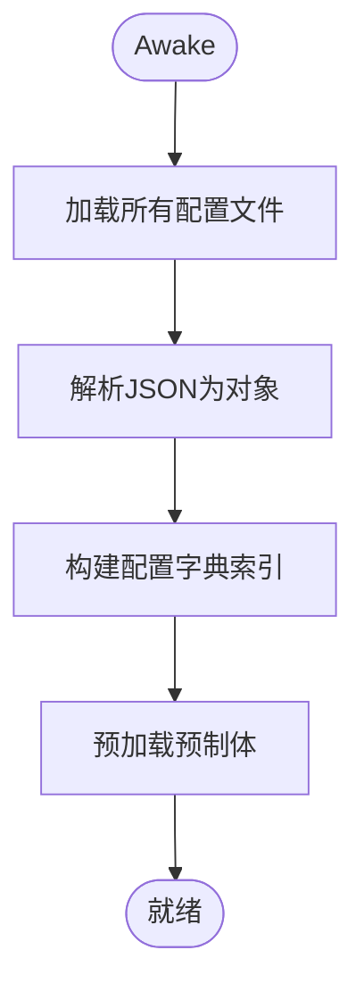
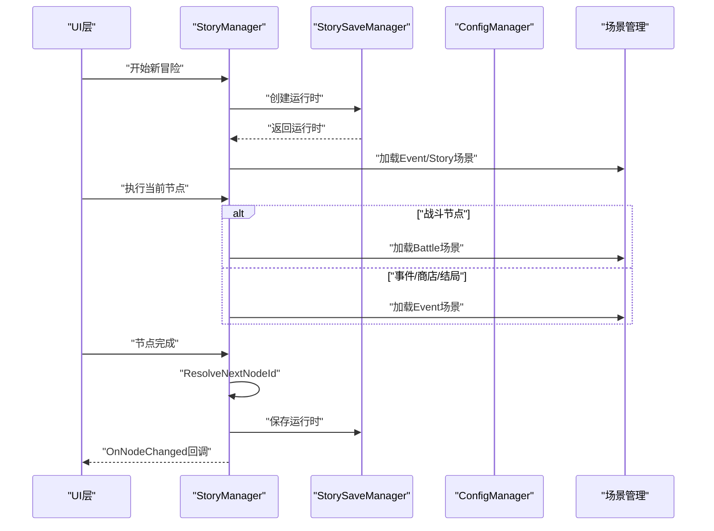
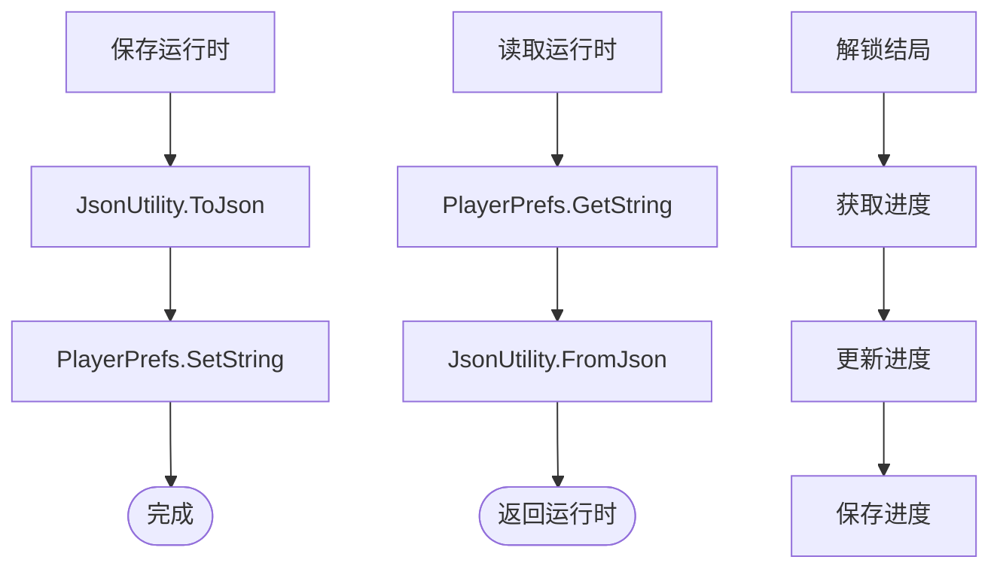
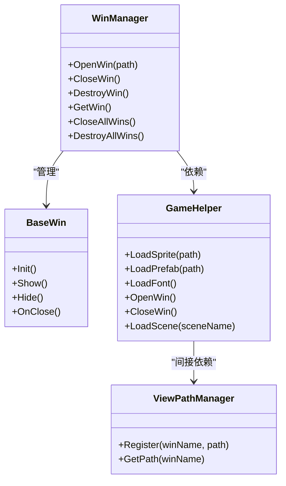
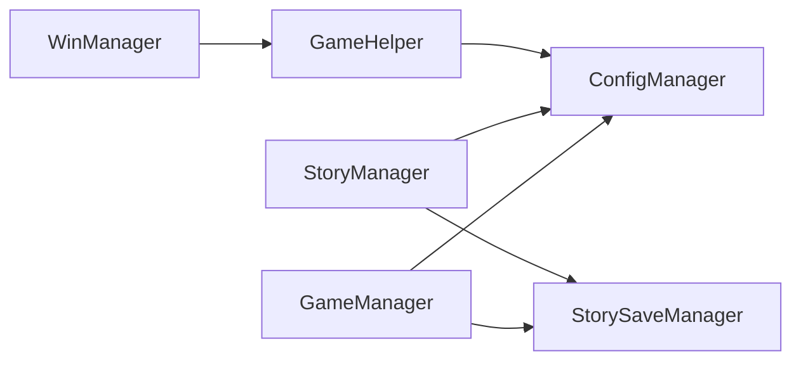

# 系统边界设计

<cite>
**本文引用的文件**
- [GameManager.cs](file://Assets/Scripts/Core/GameManager.cs)
- [ConfigManager.cs](file://Assets/Scripts/Core/ConfigManager.cs)
- [StoryManager.cs](file://Assets/Scripts/Core/StoryManager.cs)
- [StorySaveManager.cs](file://Assets/Scripts/Core/StorySaveManager.cs)
- [GameConfigs.cs](file://Assets/Scripts/Data/GameConfigs.cs)
- [StoryRuntime.cs](file://Assets/Scripts/Data/StoryRuntime.cs)
- [GameHelper.cs](file://Assets/Scripts/Core/GameHelper.cs)
- [WinManager.cs](file://Assets/Scripts/UI/WinManager.cs)
- [BaseWin.cs](file://Assets/Scripts/UI/BaseWin.cs)
- [ViewPathManager.cs](file://Assets/Scripts/Core/ViewPathManager.cs)
- [game_config.json](file://Assets/Resources/Configs/game_config.json)
- [level_config.json](file://Assets/Resources/Configs/level_config.json)
</cite>

## 目录
1. [简介](#简介)
2. [项目结构](#项目结构)
3. [核心组件](#核心组件)
4. [架构总览](#架构总览)
5. [详细组件分析](#详细组件分析)
6. [依赖关系分析](#依赖关系分析)
7. [性能考量](#性能考量)
8. [故障排查指南](#故障排查指南)
9. [结论](#结论)
10. [附录](#附录)

## 简介
本文件为GeometryTD项目的系统边界设计文档，聚焦Core层作为系统核心的职责划分与边界定义，深入分析GameManager、ConfigManager、StoryManager之间的协作关系与依赖层次，解释系统与Unity引擎及第三方资源的集成点，阐述模块间通信机制与消息传递模式，并讨论系统边界对可测试性与可维护性的影响。最后给出扩展点设计原则、插件机制实现方案以及微服务架构在Unity游戏中的应用可能性与限制。

## 项目结构
GeometryTD采用基于功能域的分层组织：
- Core层：系统核心，负责全局状态、配置加载与故事集运行时管理
- Data层：配置数据模型与运行时数据结构
- UI层：窗口管理与界面交互
- 资源层：JSON配置文件与Unity资源

图表来源
- [GameManager.cs:1-239](file://Assets/Scripts/Core/GameManager.cs#L1-L239)
- [ConfigManager.cs:1-619](file://Assets/Scripts/Core/ConfigManager.cs#L1-L619)
- [StoryManager.cs:1-589](file://Assets/Scripts/Core/StoryManager.cs#L1-L589)
- [StorySaveManager.cs:1-179](file://Assets/Scripts/Core/StorySaveManager.cs#L1-L179)
- [GameConfigs.cs:1-775](file://Assets/Scripts/Data/GameConfigs.cs#L1-L775)
- [StoryRuntime.cs:1-288](file://Assets/Scripts/Data/StoryRuntime.cs#L1-L288)
- [GameHelper.cs:1-84](file://Assets/Scripts/Core/GameHelper.cs#L1-L84)
- [WinManager.cs:1-195](file://Assets/Scripts/UI/WinManager.cs#L1-L195)
- [BaseWin.cs:1-32](file://Assets/Scripts/UI/BaseWin.cs#L1-L32)
- [ViewPathManager.cs:1-33](file://Assets/Scripts/Core/ViewPathManager.cs#L1-L33)

章节来源
- [GameManager.cs:1-239](file://Assets/Scripts/Core/GameManager.cs#L1-L239)
- [ConfigManager.cs:1-619](file://Assets/Scripts/Core/ConfigManager.cs#L1-L619)
- [StoryManager.cs:1-589](file://Assets/Scripts/Core/StoryManager.cs#L1-L589)
- [StorySaveManager.cs:1-179](file://Assets/Scripts/Core/StorySaveManager.cs#L1-L179)
- [GameConfigs.cs:1-775](file://Assets/Scripts/Data/GameConfigs.cs#L1-L775)
- [StoryRuntime.cs:1-288](file://Assets/Scripts/Data/StoryRuntime.cs#L1-L288)
- [GameHelper.cs:1-84](file://Assets/Scripts/Core/GameHelper.cs#L1-L84)
- [WinManager.cs:1-195](file://Assets/Scripts/UI/WinManager.cs#L1-L195)
- [BaseWin.cs:1-32](file://Assets/Scripts/UI/BaseWin.cs#L1-L32)
- [ViewPathManager.cs:1-33](file://Assets/Scripts/Core/ViewPathManager.cs#L1-L33)

## 核心组件
- GameManager：全局状态与场景控制，负责关卡选择、英雄与技能/奥术装备、持久化与场景切换
- ConfigManager：集中式配置加载与查询，构建多类配置字典索引，预加载资源与预制体
- StoryManager：故事集运行时生命周期管理，节点推进、事件回调、金币与藏品系统、场景切换
- StorySaveManager：运行时中途存档与永久进度存档，使用PlayerPrefs+JsonUtility
- GameHelper：资源加载工具与场景切换封装
- WinManager：UI窗口生命周期管理，层级排序与遮罩
- ViewPathManager：UI窗口名到预制体路径的映射
- GameConfigs：配置数据模型与枚举常量
- StoryRuntime：故事集运行时数据结构与逻辑

章节来源
- [GameManager.cs:1-239](file://Assets/Scripts/Core/GameManager.cs#L1-L239)
- [ConfigManager.cs:1-619](file://Assets/Scripts/Core/ConfigManager.cs#L1-L619)
- [StoryManager.cs:1-589](file://Assets/Scripts/Core/StoryManager.cs#L1-L589)
- [StorySaveManager.cs:1-179](file://Assets/Scripts/Core/StorySaveManager.cs#L1-L179)
- [GameConfigs.cs:1-775](file://Assets/Scripts/Data/GameConfigs.cs#L1-L775)
- [StoryRuntime.cs:1-288](file://Assets/Scripts/Data/StoryRuntime.cs#L1-L288)
- [GameHelper.cs:1-84](file://Assets/Scripts/Core/GameHelper.cs#L1-L84)
- [WinManager.cs:1-195](file://Assets/Scripts/UI/WinManager.cs#L1-L195)
- [BaseWin.cs:1-32](file://Assets/Scripts/UI/BaseWin.cs#L1-L32)
- [ViewPathManager.cs:1-33](file://Assets/Scripts/Core/ViewPathManager.cs#L1-L33)

## 架构总览
Core层作为系统边界的核心，向上承接UI层与业务逻辑，向下依赖资源层与Unity引擎。各组件通过单例与静态工具类形成清晰的边界，配置与运行时数据通过统一的数据模型进行解耦。

图表来源
- [GameManager.cs:1-239](file://Assets/Scripts/Core/GameManager.cs#L1-L239)
- [ConfigManager.cs:1-619](file://Assets/Scripts/Core/ConfigManager.cs#L1-L619)
- [StoryManager.cs:1-589](file://Assets/Scripts/Core/StoryManager.cs#L1-L589)
- [StorySaveManager.cs:1-179](file://Assets/Scripts/Core/StorySaveManager.cs#L1-L179)
- [GameHelper.cs:1-84](file://Assets/Scripts/Core/GameHelper.cs#L1-L84)
- [WinManager.cs:1-195](file://Assets/Scripts/UI/WinManager.cs#L1-L195)
- [ViewPathManager.cs:1-33](file://Assets/Scripts/Core/ViewPathManager.cs#L1-L33)
- [GameConfigs.cs:1-775](file://Assets/Scripts/Data/GameConfigs.cs#L1-L775)
- [StoryRuntime.cs:1-288](file://Assets/Scripts/Data/StoryRuntime.cs#L1-L288)

## 详细组件分析

### GameManager：全局状态与场景控制
- 职责边界
  - 关卡选择与解锁条件判断
  - 英雄选择与技能/奥术装备持久化
  - 场景切换与时间缩放控制
- 数据持久化
  - 使用PlayerPrefs存储已完成关卡、英雄选择、技能与奥术编队
- 与ConfigManager协作
  - 解锁条件依赖LevelConfig与ConditionConfig
- 与StoryManager协作
  - 通过场景切换驱动故事集流程

图表来源
- [GameManager.cs:36-99](file://Assets/Scripts/Core/GameManager.cs#L36-L99)
- [ConfigManager.cs:300-331](file://Assets/Scripts/Core/ConfigManager.cs#L300-L331)

章节来源
- [GameManager.cs:1-239](file://Assets/Scripts/Core/GameManager.cs#L1-L239)

### ConfigManager：配置加载与查询
- 职责边界
  - 加载所有JSON配置到内存
  - 构建多类配置的字典索引以支持O(1)查询
  - 预加载子弹与特效预制体
- 数据结构
  - 多个List与Dictionary构成配置容器与索引
- 与资源层集成
  - 通过Resources.Load加载JSON与预制体
- 与GameHelper协作
  - 使用GameHelper.LoadPrefab加载角色预制体

图表来源
- [ConfigManager.cs:77-122](file://Assets/Scripts/Core/ConfigManager.cs#L77-L122)
- [ConfigManager.cs:169-198](file://Assets/Scripts/Core/ConfigManager.cs#L169-L198)
- [GameHelper.cs:31-47](file://Assets/Scripts/Core/GameHelper.cs#L31-L47)

章节来源
- [ConfigManager.cs:1-619](file://Assets/Scripts/Core/ConfigManager.cs#L1-L619)
- [GameConfigs.cs:1-775](file://Assets/Scripts/Data/GameConfigs.cs#L1-L775)
- [game_config.json:1-9](file://Assets/Resources/Configs/game_config.json#L1-L9)
- [level_config.json:1-80](file://Assets/Resources/Configs/level_config.json#L1-L80)

### StoryManager：故事集运行时与事件
- 职责边界
  - 冒险生命周期：开始/继续/推进/结束/放弃
  - 节点推进与条件匹配
  - 事件回调：节点切换、金币变化、藏品获得、结局解锁
  - 金币与商店系统
  - 场景切换：战斗/事件/故事集/主菜单
- 与StorySaveManager协作
  - 读写运行时存档与永久进度
- 与ConfigManager协作
  - 查询故事集、节点、对话、选项、被动效果等配置

图表来源
- [StoryManager.cs:96-130](file://Assets/Scripts/Core/StoryManager.cs#L96-L130)
- [StoryManager.cs:539-560](file://Assets/Scripts/Core/StoryManager.cs#L539-L560)
- [StorySaveManager.cs:77-100](file://Assets/Scripts/Core/StorySaveManager.cs#L77-L100)

章节来源
- [StoryManager.cs:1-589](file://Assets/Scripts/Core/StoryManager.cs#L1-L589)
- [StoryRuntime.cs:1-288](file://Assets/Scripts/Data/StoryRuntime.cs#L1-L288)

### StorySaveManager：存档与进度
- 职责边界
  - 运行时中途存档：每次节点推进后保存
  - 永久进度存档：结局解锁等成就性数据
  - 使用PlayerPrefs+JsonUtility进行序列化
- 与StoryRuntime协作
  - 保存/加载StoryRuntime对象

图表来源
- [StorySaveManager.cs:34-48](file://Assets/Scripts/Core/StorySaveManager.cs#L34-L48)
- [StorySaveManager.cs:51-60](file://Assets/Scripts/Core/StorySaveManager.cs#L51-L60)
- [StorySaveManager.cs:126-133](file://Assets/Scripts/Core/StorySaveManager.cs#L126-L133)
- [StoryRuntime.cs:270-286](file://Assets/Scripts/Data/StoryRuntime.cs#L270-L286)

章节来源
- [StorySaveManager.cs:1-179](file://Assets/Scripts/Core/StorySaveManager.cs#L1-L179)
- [StoryRuntime.cs:1-288](file://Assets/Scripts/Data/StoryRuntime.cs#L1-L288)

### UI层：窗口管理与消息传递
- WinManager：窗口生命周期管理、层级排序、遮罩与点击穿透
- BaseWin：窗口基类，提供Init/Show/Hide/OnClose等钩子
- ViewPathManager：窗口名到预制体路径的映射
- GameHelper：统一的资源加载与场景切换入口

图表来源
- [WinManager.cs:1-195](file://Assets/Scripts/UI/WinManager.cs#L1-L195)
- [BaseWin.cs:1-32](file://Assets/Scripts/UI/BaseWin.cs#L1-L32)
- [ViewPathManager.cs:1-33](file://Assets/Scripts/Core/ViewPathManager.cs#L1-L33)
- [GameHelper.cs:1-84](file://Assets/Scripts/Core/GameHelper.cs#L1-L84)

章节来源
- [WinManager.cs:1-195](file://Assets/Scripts/UI/WinManager.cs#L1-L195)
- [BaseWin.cs:1-32](file://Assets/Scripts/UI/BaseWin.cs#L1-L32)
- [ViewPathManager.cs:1-33](file://Assets/Scripts/Core/ViewPathManager.cs#L1-L33)
- [GameHelper.cs:1-84](file://Assets/Scripts/Core/GameHelper.cs#L1-L84)

## 依赖关系分析
- 组件耦合
  - GameManager与ConfigManager强耦合（关卡解锁条件）
  - StoryManager与ConfigManager强耦合（故事集/节点/对话/选项/被动）
  - StoryManager与StorySaveManager双向协作（存档/进度）
  - UI层通过WinManager与GameHelper解耦具体资源路径与场景切换
- 外部依赖
  - Unity引擎：MonoBehaviour、SceneManager、Resources、PlayerPrefs、JsonUtility
  - 第三方库：无（纯Unity内置API）

图表来源
- [GameManager.cs:1-239](file://Assets/Scripts/Core/GameManager.cs#L1-L239)
- [ConfigManager.cs:1-619](file://Assets/Scripts/Core/ConfigManager.cs#L1-L619)
- [StoryManager.cs:1-589](file://Assets/Scripts/Core/StoryManager.cs#L1-L589)
- [StorySaveManager.cs:1-179](file://Assets/Scripts/Core/StorySaveManager.cs#L1-L179)
- [WinManager.cs:1-195](file://Assets/Scripts/UI/WinManager.cs#L1-L195)
- [GameHelper.cs:1-84](file://Assets/Scripts/Core/GameHelper.cs#L1-L84)

章节来源
- [GameManager.cs:1-239](file://Assets/Scripts/Core/GameManager.cs#L1-L239)
- [ConfigManager.cs:1-619](file://Assets/Scripts/Core/ConfigManager.cs#L1-L619)
- [StoryManager.cs:1-589](file://Assets/Scripts/Core/StoryManager.cs#L1-L589)
- [StorySaveManager.cs:1-179](file://Assets/Scripts/Core/StorySaveManager.cs#L1-L179)
- [WinManager.cs:1-195](file://Assets/Scripts/UI/WinManager.cs#L1-L195)
- [GameHelper.cs:1-84](file://Assets/Scripts/Core/GameHelper.cs#L1-L84)

## 性能考量
- 配置加载
  - ConfigManager在Awake阶段一次性加载并构建索引，避免运行时重复IO与遍历
- 预加载资源
  - 预加载子弹与特效预制体，减少运行时Resources.Load开销
- 存档策略
  - 使用PlayerPrefs+JsonUtility，简单可靠，适合小体量数据；大规模数据建议考虑SQLite或自定义二进制格式
- UI窗口
  - WinManager缓存窗口实例，避免频繁Instantiate/Destory
- 场景切换
  - 统一通过GameHelper与StoryManager控制Time.timeScale与SceneManager，确保状态一致性

## 故障排查指南
- 配置加载失败
  - 检查Resources/Configs下JSON文件是否存在且格式正确
  - 查看ConfigManager日志输出，确认LoadAllConfigs执行情况
- 预制体加载失败
  - 检查ConfigManager与GameHelper的LoadPrefab路径是否正确
  - 确认Resources目录结构与prefabPath一致
- 存档异常
  - 检查PlayerPrefs键名与序列化字段是否匹配
  - 确认StorySaveManager的Save/Load流程
- 场景切换问题
  - 确认场景名称与Build Settings一致
  - 检查Time.timeScale设置是否被意外修改

章节来源
- [ConfigManager.cs:200-215](file://Assets/Scripts/Core/ConfigManager.cs#L200-L215)
- [GameHelper.cs:31-47](file://Assets/Scripts/Core/GameHelper.cs#L31-L47)
- [StorySaveManager.cs:34-48](file://Assets/Scripts/Core/StorySaveManager.cs#L34-L48)
- [StoryManager.cs:500-533](file://Assets/Scripts/Core/StoryManager.cs#L500-L533)

## 结论
Core层通过明确的职责划分与清晰的边界定义，实现了系统核心功能的高内聚低耦合。GameManager、ConfigManager、StoryManager三者协作紧密，既满足了游戏业务需求，又保持了良好的可测试性与可维护性。UI层通过WinManager与GameHelper实现解耦，便于扩展与替换。建议后续在存档与配置热更新方面引入更完善的机制，以进一步提升系统的可扩展性与可维护性。

## 附录

### 系统边界对可测试性与可维护性的影响
- 可测试性
  - 单例与静态工具类的存在使得单元测试较为困难，建议通过接口抽象与依赖注入框架（如Zenject）进行重构
  - 配置与存档通过PlayerPrefs+JsonUtility实现，便于模拟与断言
- 可维护性
  - 统一的资源加载与场景切换入口降低了维护成本
  - 配置模型清晰，便于新增配置项与扩展业务逻辑

### 扩展点设计原则与插件机制
- 设计原则
  - 开闭原则：对扩展开放，对修改关闭
  - 依赖倒置：高层模块不应依赖低层模块，二者都应依赖抽象
  - 接口隔离：客户端不应依赖不需要的接口
- 插件机制
  - 通过接口与工厂模式实现插件注册与动态加载
  - 使用反射或特性标记识别插件组件
  - 通过配置文件声明插件清单，运行时动态装配

### 微服务架构在Unity游戏中的应用可能性与限制
- 可能性
  - 服务器端微服务：用户认证、排行榜、商店、事件中心
  - 客户端微服务：AI决策、网络通信、数据分析
- 限制
  - Unity客户端线程模型与微服务通信协议的兼容性
  - 资源加载与场景切换的复杂性
  - 实时性要求与网络延迟的权衡