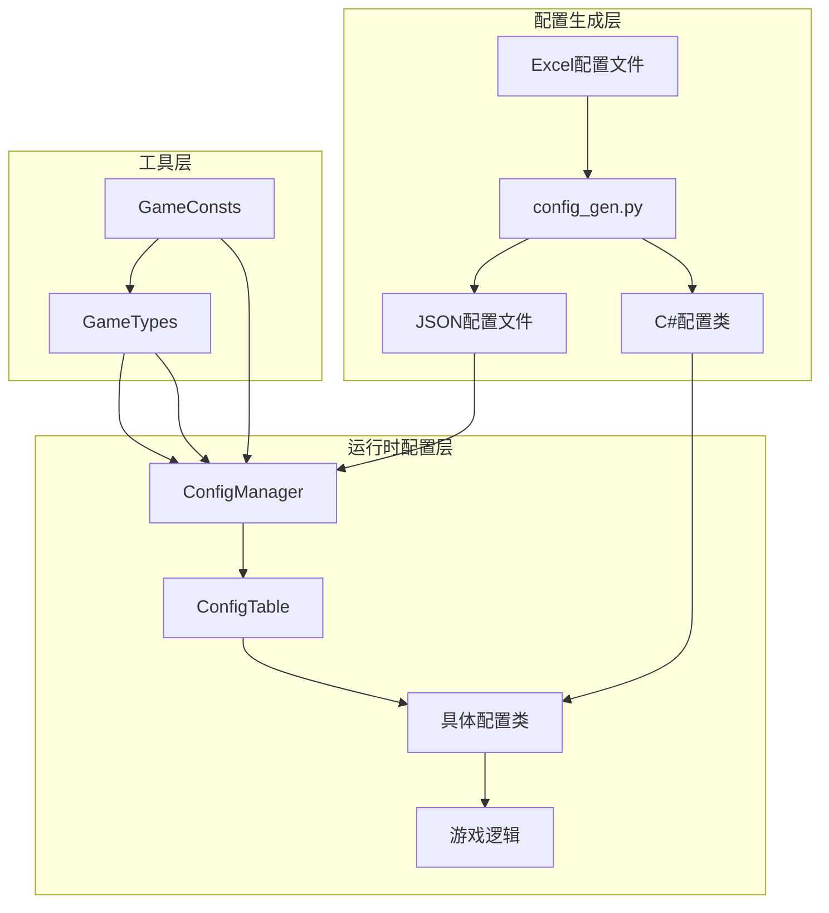
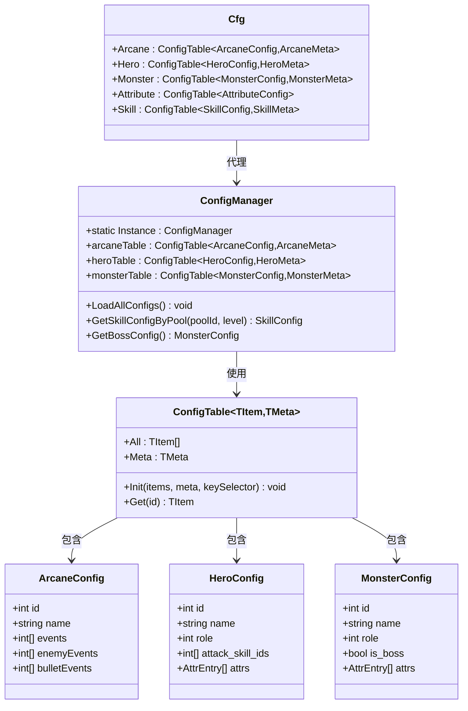
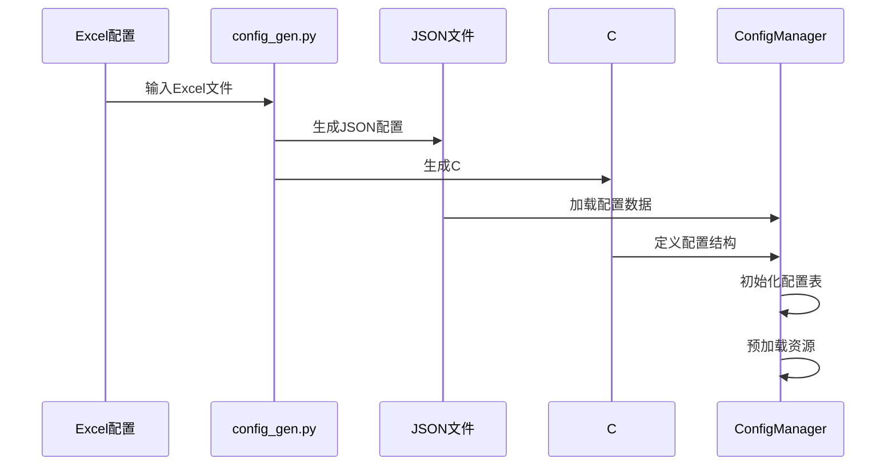
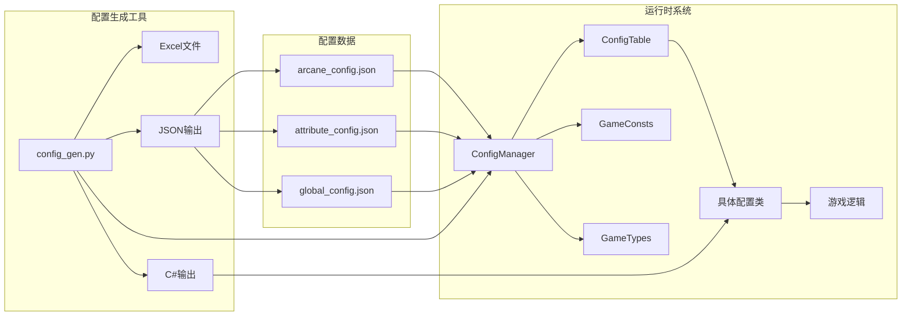

# 自动生成的配置类

<cite>
**本文档引用的文件**
- [Assets/Scripts/Core/Cfg.cs](file://Assets/Scripts/Core/Cfg.cs)
- [Assets/Scripts/Core/ConfigManager.cs](file://Assets/Scripts/Core/ConfigManager.cs)
- [Assets/Scripts/Core/ConfigTable.cs](file://Assets/Scripts/Core/ConfigTable.cs)
- [Assets/Scripts/Data/GameConsts.cs](file://Assets/Scripts/Data/GameConsts.cs)
- [Assets/Scripts/Data/GameTypes.cs](file://Assets/Scripts/Data/GameTypes.cs)
- [Assets/Scripts/Battle/SkillManager.cs](file://Assets/Scripts/Battle/SkillManager.cs)
- [Assets/Scripts/Data/Configs/ArcaneConfig.cs](file://Assets/Scripts/Data/Configs/ArcaneConfig.cs)
- [Assets/Scripts/Data/Configs/HeroConfig.cs](file://Assets/Scripts/Data/Configs/HeroConfig.cs)
- [Assets/Scripts/Data/Configs/MonsterConfig.cs](file://Assets/Scripts/Data/Configs/MonsterConfig.cs)
- [Assets/Resources/Configs/arcane_config.json](file://Assets/Resources/Configs/arcane_config.json)
- [Assets/Resources/Configs/attribute_config.json](file://Assets/Resources/Configs/attribute_config.json)
- [Assets/Resources/Configs/global_config.json](file://Assets/Resources/Configs/global_config.json)
- [Tools/config_gen.py](file://Tools/config_gen.py)
</cite>

## 目录
1. [简介](#简介)
2. [项目结构](#项目结构)
3. [核心组件](#核心组件)
4. [架构概览](#架构概览)
5. [详细组件分析](#详细组件分析)
6. [依赖关系分析](#依赖关系分析)
7. [性能考虑](#性能考虑)
8. [故障排除指南](#故障排除指南)
9. [结论](#结论)

## 简介

这是一个基于Unity引擎开发的塔防游戏项目中的配置管理系统。该系统采用自动生成机制，通过Excel配置文件生成JSON数据和对应的C#配置类，实现了游戏参数的集中管理和动态加载。

系统的核心特点包括：
- 自动化配置生成：从Excel到JSON再到C#代码的完整自动化流程
- 类型安全：强类型的配置访问接口
- 运行时优化：预加载和缓存机制提升性能
- 扩展性：支持多种配置类型和自定义扩展

## 项目结构

项目采用分层架构设计，主要包含以下模块：



**图表来源**
- [Tools/config_gen.py:587-688](file://Tools/config_gen.py#L587-L688)
- [Assets/Scripts/Core/ConfigManager.cs:11-306](file://Assets/Scripts/Core/ConfigManager.cs#L11-L306)

**章节来源**
- [Assets/Scripts/Core/Cfg.cs:1-35](file://Assets/Scripts/Core/Cfg.cs#L1-L35)
- [Assets/Scripts/Core/ConfigManager.cs:1-306](file://Assets/Scripts/Core/ConfigManager.cs#L1-L306)

## 核心组件

### 配置管理器（ConfigManager）

ConfigManager是整个配置系统的核心，负责：
- 单例模式管理
- 所有配置表的初始化和加载
- 预加载游戏资源
- 提供自定义查询方法

### 配置表（ConfigTable）

提供统一的配置访问接口：
- 支持带元数据和不带元数据的配置表
- 基于字典的O(1)查找性能
- 提供所有配置项的列表访问

### 静态配置入口（Cfg）

提供简洁的静态访问接口：
- 通过Cfg.Hero.Get(id)访问特定配置
- 通过Cfg.Hero.All获取所有配置
- 通过Cfg.Global.Meta访问全局配置

**章节来源**
- [Assets/Scripts/Core/ConfigManager.cs:11-306](file://Assets/Scripts/Core/ConfigManager.cs#L11-L306)
- [Assets/Scripts/Core/ConfigTable.cs:1-73](file://Assets/Scripts/Core/ConfigTable.cs#L1-L73)
- [Assets/Scripts/Core/Cfg.cs:7-33](file://Assets/Scripts/Core/Cfg.cs#L7-L33)

## 架构概览



**图表来源**
- [Assets/Scripts/Core/ConfigManager.cs:11-306](file://Assets/Scripts/Core/ConfigManager.cs#L11-L306)
- [Assets/Scripts/Core/ConfigTable.cs:11-71](file://Assets/Scripts/Core/ConfigTable.cs#L11-L71)
- [Assets/Scripts/Core/Cfg.cs:7-33](file://Assets/Scripts/Core/Cfg.cs#L7-L33)
- [Assets/Scripts/Data/Configs/ArcaneConfig.cs:11-41](file://Assets/Scripts/Data/Configs/ArcaneConfig.cs#L11-L41)
- [Assets/Scripts/Data/Configs/HeroConfig.cs:11-36](file://Assets/Scripts/Data/Configs/HeroConfig.cs#L11-L36)
- [Assets/Scripts/Data/Configs/MonsterConfig.cs:11-35](file://Assets/Scripts/Data/Configs/MonsterConfig.cs#L11-L35)

## 详细组件分析

### 配置生成流程

配置系统采用完整的自动化生成流程：



**图表来源**
- [Tools/config_gen.py:587-688](file://Tools/config_gen.py#L587-L688)
- [Assets/Scripts/Core/ConfigManager.cs:56-177](file://Assets/Scripts/Core/ConfigManager.cs#L56-L177)

### 配置访问模式

系统提供了多种配置访问模式：

```mermaid
flowchart TD
A[游戏逻辑] --> B{访问类型}
B --> |单个配置| C[Cfg.Table.Get(id)]
B --> |所有配置| D[Cfg.Table.All]
B --> |元数据| E[Cfg.Table.Meta]
B --> |自定义查询| F[ConfigManager自定义方法]
C --> G[ConfigTable.Get]
D --> H[ConfigTable.All]
E --> I[ConfigMeta.Meta]
F --> J[ConfigManager.CustomMethods]
G --> K[Dictionary查找 O(1)]
H --> L[List遍历 O(n)]
I --> M[直接访问]
J --> N[业务逻辑处理]
```

**图表来源**
- [Assets/Scripts/Core/Cfg.cs:11-33](file://Assets/Scripts/Core/Cfg.cs#L11-L33)
- [Assets/Scripts/Core/ConfigTable.cs:26-56](file://Assets/Scripts/Core/ConfigTable.cs#L26-L56)

### 具体配置示例

#### 奥术配置（ArcaneConfig）
- **基本属性**：id、name、icon
- **战斗属性**：dmg、dmgType、radius、tickInterval
- **冷却属性**：cd、runeCost、runeType
- **事件关联**：events、enemyEvents、bulletEvents

#### 英雄配置（HeroConfig）
- **基础信息**：id、name、description
- **角色定位**：role
- **战斗能力**：attack_skill_ids、skill_xp_interval
- **属性列表**：attrs（AttrEntry数组）
- **特殊效果**：charge_buff_ids

#### 怪物配置（MonsterConfig）
- **标识信息**：id、name
- **角色定位**：role、level
- **类型标记**：is_boss、is_elite
- **战斗属性**：attack_skill_ids、attack_interval
- **属性列表**：attrs（AttrEntry数组）

**章节来源**
- [Assets/Scripts/Data/Configs/ArcaneConfig.cs:11-41](file://Assets/Scripts/Data/Configs/ArcaneConfig.cs#L11-L41)
- [Assets/Scripts/Data/Configs/HeroConfig.cs:11-36](file://Assets/Scripts/Data/Configs/HeroConfig.cs#L11-L36)
- [Assets/Scripts/Data/Configs/MonsterConfig.cs:11-35](file://Assets/Scripts/Data/Configs/MonsterConfig.cs#L11-L35)

## 依赖关系分析



**图表来源**
- [Tools/config_gen.py:587-688](file://Tools/config_gen.py#L587-L688)
- [Assets/Scripts/Core/ConfigManager.cs:15-37](file://Assets/Scripts/Core/ConfigManager.cs#L15-L37)

系统的主要依赖关系：
- **配置生成工具**：config_gen.py依赖Excel解析库和JSON处理
- **运行时依赖**：ConfigManager依赖Unity的Resources系统进行配置加载
- **数据依赖**：所有配置类都依赖GameConsts和GameTypes中的常量定义

**章节来源**
- [Assets/Scripts/Core/ConfigManager.cs:15-37](file://Assets/Scripts/Core/ConfigManager.cs#L15-L37)
- [Assets/Scripts/Data/GameConsts.cs:1-160](file://Assets/Scripts/Data/GameConsts.cs#L1-L160)
- [Assets/Scripts/Data/GameTypes.cs:1-83](file://Assets/Scripts/Data/GameTypes.cs#L1-L83)

## 性能考虑

### 内存优化策略

1. **延迟加载**：配置在首次访问时才加载到内存
2. **字典索引**：使用Dictionary实现O(1)的配置查找
3. **资源缓存**：预加载常用的预制体到内存缓存

### 访问性能分析

| 访问方式 | 时间复杂度 | 空间复杂度 | 适用场景 |
|---------|-----------|-----------|----------|
| 单个配置获取 | O(1) | O(1) | 频繁访问的配置 |
| 遍历所有配置 | O(n) | O(n) | 统计和批量处理 |
| 按条件过滤 | O(n) | O(k) | 动态筛选 |

### 预加载机制

系统实现了智能预加载：
- **子弹样式**：根据bullet_style配置预加载对应预制体
- **特效配置**：根据event_effect配置预加载特效预制体  
- **角色配置**：根据role配置预加载角色预制体

**章节来源**
- [Assets/Scripts/Core/ConfigManager.cs:255-298](file://Assets/Scripts/Core/ConfigManager.cs#L255-L298)
- [Assets/Scripts/Core/ConfigTable.cs:26-56](file://Assets/Scripts/Core/ConfigTable.cs#L26-L56)

## 故障排除指南

### 常见问题及解决方案

#### 配置加载失败
**症状**：控制台出现"Failed to load"错误
**原因**：资源配置文件路径错误或文件不存在
**解决**：检查Assets/Resources/Configs目录下的JSON文件命名

#### 配置解析错误
**症状**：控制台出现"Failed to parse"错误
**原因**：JSON格式不正确或字段类型不匹配
**解决**：验证Excel配置文件的数据类型和格式

#### 配置访问返回null
**症状**：Cfg.Table.Get(id)返回null
**原因**：配置ID不存在或配置未正确加载
**解决**：检查配置ID是否正确，确认配置文件已生成

#### 预加载资源失败
**症状**：日志显示"无法加载"警告
**原因**：预制体路径错误或资源未导入
**解决**：检查prefabPath字段的资源路径

**章节来源**
- [Assets/Scripts/Core/ConfigManager.cs:179-194](file://Assets/Scripts/Core/ConfigManager.cs#L179-L194)
- [Assets/Scripts/Core/ConfigManager.cs:255-298](file://Assets/Scripts/Core/ConfigManager.cs#L255-L298)

## 结论

这个自动生成的配置系统为Unity游戏开发提供了强大而灵活的配置管理解决方案。其主要优势包括：

1. **自动化程度高**：从Excel到运行时配置的完整自动化流程
2. **类型安全**：编译时类型检查确保配置使用的安全性
3. **性能优化**：智能缓存和延迟加载机制
4. **扩展性强**：支持新的配置类型和自定义查询方法
5. **维护友好**：集中化的配置管理简化了游戏平衡调整

该系统特别适合需要频繁调整游戏平衡性和快速迭代的游戏项目。通过合理的配置设计和适当的扩展，可以轻松支持复杂的玩法机制和丰富的游戏内容。