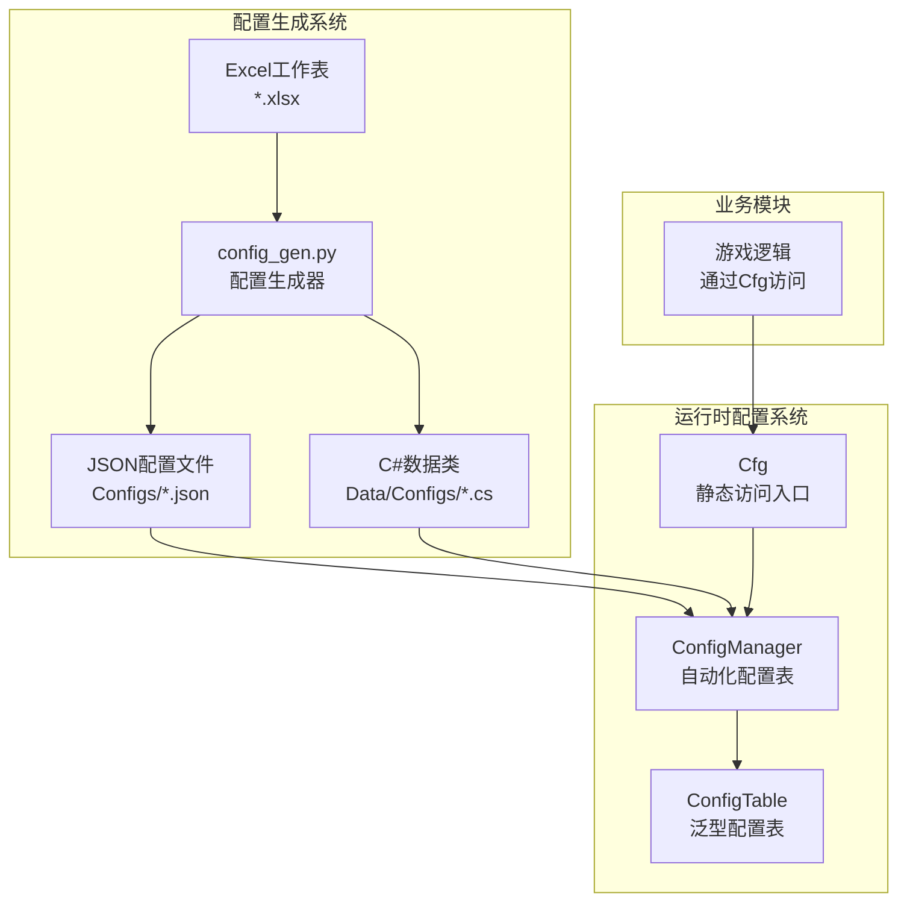
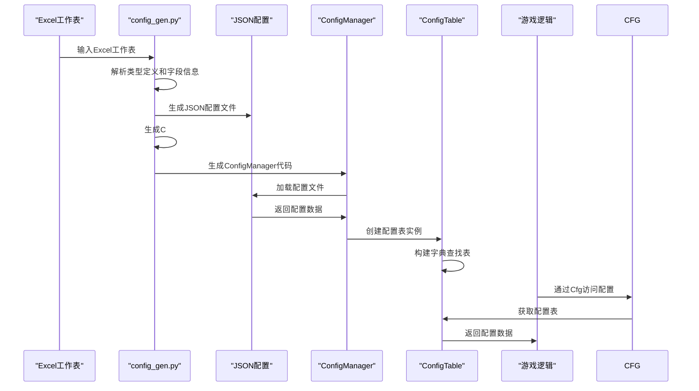
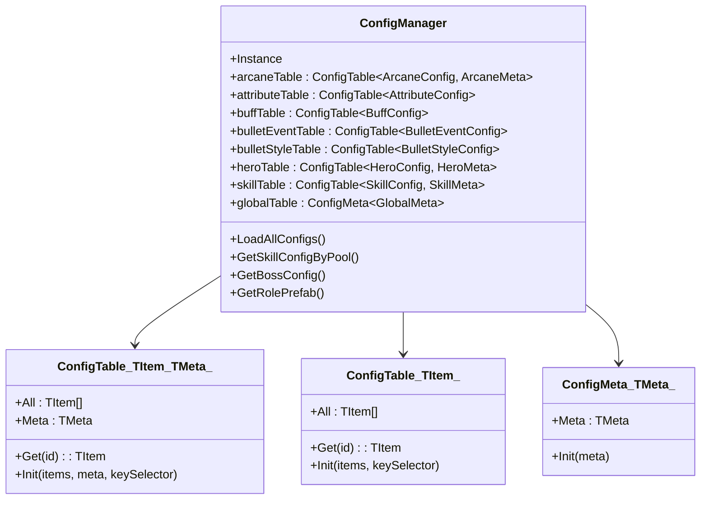
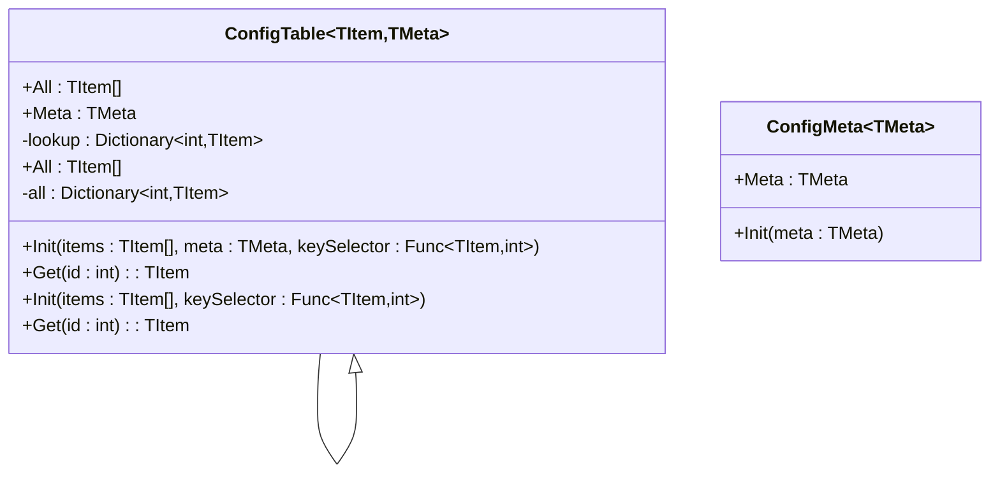
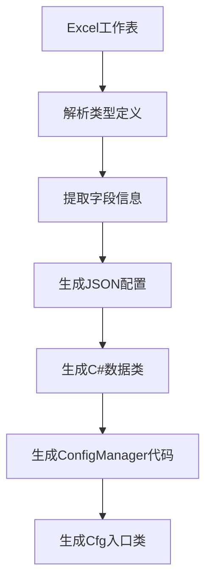
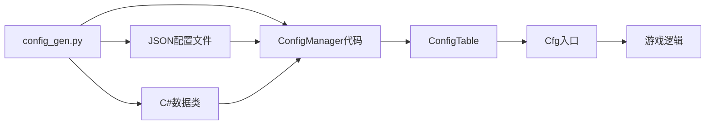

# 配置驱动开发

<cite>
**本文档引用的文件**
- [ConfigManager.cs](file://Assets/Scripts/Core/ConfigManager.cs)
- [ConfigTable.cs](file://Assets/Scripts/Core/ConfigTable.cs)
- [Cfg.cs](file://Assets/Scripts/Core/Cfg.cs)
- [config_gen.py](file://Tools/config_gen.py)
- [HeroConfig.cs](file://Assets/Scripts/Data/Configs/HeroConfig.cs)
- [SkillConfig.cs](file://Assets/Scripts/Data/Configs/SkillConfig.cs)
- [GlobalConfig.cs](file://Assets/Scripts/Data/Configs/GlobalConfig.cs)
- [hero_config.json](file://Assets/Resources/Configs/hero_config.json)
- [skill_config.json](file://Assets/Resources/Configs/skill_config.json)
- [global_config.json](file://Assets/Resources/Configs/global_config.json)
</cite>

## 更新摘要
**所做更改**
- 更新了ConfigManager的现代化实现，引入了自动化配置表系统
- 新增了ConfigTable泛型类提供类型安全的配置访问
- 引入了Cfg静态入口点简化配置访问
- 更新了配置生成工具config_gen.py的自动化生成功能
- 重构了配置文件结构，支持items和meta分离模式

## 目录
1. [简介](#简介)
2. [项目结构](#项目结构)
3. [核心组件](#核心组件)
4. [架构总览](#架构总览)
5. [详细组件分析](#详细组件分析)
6. [依赖关系分析](#依赖关系分析)
7. [性能考量](#性能考量)
8. [故障排查指南](#故障排查指南)
9. [结论](#结论)
10. [附录](#附录)

## 简介
本文档面向GeometryTD项目的现代化配置驱动开发，系统性阐述通过自动化配置表系统实现的配置管理机制。新架构通过ConfigManager的自动化生成、ConfigTable的泛型类型安全、Cfg静态入口点的便捷访问，以及config_gen.py的Excel到JSON/C#自动转换工具，提供了更强大、更可靠的配置驱动开发解决方案。

## 项目结构
- 配置资源位于Resources/Configs目录，采用JSON格式，支持items和meta分离结构
- 自动化配置生成工具config_gen.py负责从Excel工作表生成JSON配置文件和C#数据类
- ConfigManager通过自动化生成的配置表字段管理所有配置数据
- ConfigTable提供泛型类型安全的配置访问接口
- Cfg静态类提供简化的配置访问入口点

**图表来源**
- [config_gen.py:587-688](file://Tools/config_gen.py#L587-L688)
- [ConfigManager.cs:15-38](file://Assets/Scripts/Core/ConfigManager.cs#L15-L38)
- [ConfigTable.cs:11-71](file://Assets/Scripts/Core/ConfigTable.cs#L11-L71)
- [Cfg.cs:7-33](file://Assets/Scripts/Core/Cfg.cs#L7-L33)

**章节来源**
- [config_gen.py:587-688](file://Tools/config_gen.py#L587-L688)
- [ConfigManager.cs:15-38](file://Assets/Scripts/Core/ConfigManager.cs#L15-L38)
- [ConfigTable.cs:11-71](file://Assets/Scripts/Core/ConfigTable.cs#L11-L71)
- [Cfg.cs:7-33](file://Assets/Scripts/Core/Cfg.cs#L7-L33)

## 核心组件
- **ConfigManager**：通过自动化生成的配置表字段管理所有配置，提供统一的配置访问接口
- **ConfigTable<T>**：泛型配置表类，提供类型安全的配置数据访问和字典查找功能
- **Cfg静态类**：提供简化的配置访问入口，通过静态属性访问各个配置表
- **config_gen.py**：自动化配置生成工具，支持Excel到JSON和C#代码的双向转换
- **配置数据类**：自动生成的C#数据类，支持Serializable特性和类型安全

**章节来源**
- [ConfigManager.cs:11-318](file://Assets/Scripts/Core/ConfigManager.cs#L11-L318)
- [ConfigTable.cs:11-71](file://Assets/Scripts/Core/ConfigTable.cs#L11-L71)
- [Cfg.cs:7-33](file://Assets/Scripts/Core/Cfg.cs#L7-L33)
- [config_gen.py:1-688](file://Tools/config_gen.py#L1-688)

## 架构总览
新架构通过自动化配置生成系统实现配置驱动开发的现代化升级。config_gen.py从Excel工作表提取配置信息，自动生成JSON配置文件和对应的C#数据类，然后ConfigManager加载这些配置并构建ConfigTable类型的配置表。

**图表来源**
- [config_gen.py:240-262](file://Tools/config_gen.py#L240-L262)
- [config_gen.py:520-546](file://Tools/config_gen.py#L520-L546)
- [ConfigManager.cs:60-185](file://Assets/Scripts/Core/ConfigManager.cs#L60-L185)
- [ConfigTable.cs:17-32](file://Assets/Scripts/Core/ConfigTable.cs#L17-L32)

**章节来源**
- [config_gen.py:240-262](file://Tools/config_gen.py#L240-L262)
- [config_gen.py:520-546](file://Tools/config_gen.py#L520-L546)
- [ConfigManager.cs:60-185](file://Assets/Scripts/Core/ConfigManager.cs#L60-L185)
- [ConfigTable.cs:17-32](file://Assets/Scripts/Core/ConfigTable.cs#L17-L32)

## 详细组件分析

### ConfigManager：自动化配置表管理
ConfigManager经过现代化改造，通过自动化生成的配置表字段管理所有配置数据。每个配置表都通过ConfigTable泛型类实现，提供类型安全的访问接口。

- **自动化生成**：配置表字段通过config_gen.py自动生成，确保与JSON配置结构完全匹配
- **类型安全**：ConfigTable<TItem, TMeta>提供编译时类型检查，避免运行时类型错误
- **统一接口**：所有配置表都通过相同的Init方法初始化，支持不同配置结构
- **缓存机制**：保留原有的预制体缓存机制，支持子弹、特效和角色的预加载

**图表来源**
- [ConfigManager.cs:15-38](file://Assets/Scripts/Core/ConfigManager.cs#L15-L38)
- [ConfigTable.cs:11-71](file://Assets/Scripts/Core/ConfigTable.cs#L11-L71)

**章节来源**
- [ConfigManager.cs:15-38](file://Assets/Scripts/Core/ConfigManager.cs#L15-L38)
- [ConfigManager.cs:60-185](file://Assets/Scripts/Core/ConfigManager.cs#L60-L185)
- [ConfigTable.cs:11-71](file://Assets/Scripts/Core/ConfigTable.cs#L11-L71)

### ConfigTable：泛型配置表系统
ConfigTable是新架构的核心组件，提供类型安全的配置数据访问和高效的查找机制。

- **泛型设计**：支持两种配置表类型：带元数据的ConfigTable<TItem, TMeta>和纯列表的ConfigTable<TItem>
- **字典查找**：内部使用Dictionary<int, TItem>实现O(1)的配置查找
- **统一接口**：所有配置表都提供Get(id)方法和All列表访问
- **初始化机制**：通过Init方法接受配置数据和键选择器函数

**图表来源**
- [ConfigTable.cs:11-71](file://Assets/Scripts/Core/ConfigTable.cs#L11-L71)

**章节来源**
- [ConfigTable.cs:11-71](file://Assets/Scripts/Core/ConfigTable.cs#L11-L71)

### Cfg：静态配置访问入口
Cfg静态类提供简化的配置访问接口，通过静态属性访问各个配置表，实现零样板代码的配置访问。

- **静态入口**：所有配置表都通过静态属性暴露，如Cfg.Hero、Cfg.Skill、Cfg.Global
- **类型安全**：编译时类型检查，避免运行时配置访问错误
- **简化语法**：通过Cfg.Hero.Get(1)替代ConfigManager.Instance.heroTable.Get(1)
- **自动绑定**：与ConfigManager的自动化生成完全集成

**章节来源**
- [Cfg.cs:7-33](file://Assets/Scripts/Core/Cfg.cs#L7-L33)

### config_gen.py：自动化配置生成工具
config_gen.py是新架构的关键工具，负责从Excel工作表自动生成配置相关的所有文件。

- **Excel解析**：支持复杂的Excel结构，包括类型定义行和数据行
- **类型系统**：支持基本类型、数组类型和结构体数组类型
- **代码生成**：自动生成JSON配置文件、C#数据类和ConfigManager代码
- **元数据支持**：支持配置的meta元数据和items列表分离结构
- **键字段推断**：自动推断配置的主键字段（通常是第一列）

**图表来源**
- [config_gen.py:240-262](file://Tools/config_gen.py#L240-L262)
- [config_gen.py:336-414](file://Tools/config_gen.py#L336-L414)
- [config_gen.py:457-581](file://Tools/config_gen.py#L457-L581)

**章节来源**
- [config_gen.py:1-688](file://Tools/config_gen.py#L1-L688)

### 配置数据类：类型安全的数据模型
自动生成的配置数据类提供完整的类型安全和序列化支持。

- **Serializable特性**：所有配置类都标记为Serializable，支持Unity的JsonUtility序列化
- **嵌套结构**：支持复杂的嵌套结构，如HeroConfig中的AttrEntry数组
- **元数据分离**：支持ConfigData包装类，包含items列表和meta元数据
- **数组支持**：支持int[]、string[]等基本类型数组
- **结构体数组**：支持复杂结构体数组，如HeroConfig中的attrs字段

**章节来源**
- [HeroConfig.cs:10-38](file://Assets/Scripts/Data/Configs/HeroConfig.cs#L10-L38)
- [SkillConfig.cs:10-44](file://Assets/Scripts/Data/Configs/SkillConfig.cs#L10-L44)
- [GlobalConfig.cs:10-23](file://Assets/Scripts/Data/Configs/GlobalConfig.cs#L10-L23)

## 依赖关系分析
新架构建立了清晰的依赖层次：config_gen.py生成所有配置相关代码，ConfigManager管理运行时配置，ConfigTable提供类型安全访问，Cfg提供简化接口。

**图表来源**
- [config_gen.py:587-688](file://Tools/config_gen.py#L587-L688)
- [ConfigManager.cs:15-38](file://Assets/Scripts/Core/ConfigManager.cs#L15-L38)
- [Cfg.cs:7-33](file://Assets/Scripts/Core/Cfg.cs#L7-L33)

**章节来源**
- [config_gen.py:587-688](file://Tools/config_gen.py#L587-L688)
- [ConfigManager.cs:15-38](file://Assets/Scripts/Core/ConfigManager.cs#L15-L38)
- [Cfg.cs:7-33](file://Assets/Scripts/Core/Cfg.cs#L7-L33)

## 性能考量
新架构在保持原有性能优势的基础上，进一步优化了类型安全和访问效率。

- **编译时优化**：ConfigTable的泛型设计在编译时确定类型，避免运行时类型检查开销
- **字典查找优化**：ConfigTable内部使用Dictionary实现O(1)查找，比线性搜索快得多
- **内存效率**：ConfigTable只存储必要的配置数据，避免冗余对象创建
- **延迟加载**：配置表在首次访问时才进行查找，避免不必要的初始化
- **缓存复用**：ConfigManager保留原有的预制体缓存，避免重复资源加载

**章节来源**
- [ConfigTable.cs:17-32](file://Assets/Scripts/Core/ConfigTable.cs#L17-L32)
- [ConfigManager.cs:263-306](file://Assets/Scripts/Core/ConfigManager.cs#L263-L306)

## 故障排查指南
新架构提供了更好的错误诊断和恢复机制。

- **配置生成错误**：
  - 现象：config_gen.py运行时报错，无法生成配置文件
  - 排查：检查Excel工作表的类型定义行格式，确保字段类型正确
- **配置加载失败**：
  - 现象：ConfigManager无法加载配置文件或解析失败
  - 排查：检查JSON文件格式，确认items和meta字段结构正确
- **类型不匹配**：
  - 现象：编译时出现类型错误，ConfigTable无法初始化
  - 排查：确认C#数据类字段类型与JSON配置一致
- **配置访问错误**：
  - 现现象：运行时无法通过Cfg访问配置
  - 排查：确认ConfigManager已正确初始化，配置表字段已生成

**章节来源**
- [config_gen.py:549-566](file://Tools/config_gen.py#L549-L566)
- [ConfigManager.cs:187-202](file://Assets/Scripts/Core/ConfigManager.cs#L187-L202)

## 结论
新架构通过自动化配置生成系统、泛型类型安全的ConfigTable、简化的Cfg访问入口，实现了配置驱动开发的现代化升级。这种设计不仅保持了原有的性能优势，还大幅提升了开发效率和代码质量。通过严格的类型检查和自动化工具链，开发者可以更专注于游戏逻辑实现，而不需要担心配置管理的复杂性。

## 附录

### 配置文件结构规范
新架构支持标准化的配置文件结构，包含items列表和可选的meta元数据。

- **标准结构**：每个配置文件包含items数组和可选的meta对象
- **键字段**：配置的主键字段通常为第一个字段（如HeroConfig的id）
- **元数据支持**：全局配置（如GlobalConfig）只包含meta，不包含items
- **数组字段**：支持基本类型数组和结构体数组
- **嵌套结构**：支持复杂的嵌套对象结构

**章节来源**
- [hero_config.json:1-97](file://Assets/Resources/Configs/hero_config.json#L1-L97)
- [skill_config.json:1-200](file://Assets/Resources/Configs/skill_config.json#L1-L200)
- [global_config.json:1-23](file://Assets/Resources/Configs/global_config.json#L1-L23)

### 如何添加新的配置表
通过config_gen.py自动化工具，可以轻松添加新的配置表。

- **Excel配置**：在Excel工作表中添加新的配置表，包含类型定义行和数据行
- **自动生成**：运行config_gen.py，自动生成JSON配置文件、C#数据类和ConfigManager代码
- **类型定义**：在类型定义行中指定字段类型，支持基本类型、数组和结构体
- **键字段**：确保第一列为配置的主键字段
- **元数据**：如需全局配置，在单独的工作表中定义meta字段

**章节来源**
- [config_gen.py:240-262](file://Tools/config_gen.py#L240-L262)
- [config_gen.py:520-546](file://Tools/config_gen.py#L520-L546)

### 类型安全的最佳实践
新架构提供了完整的类型安全机制，以下是使用建议。

- **字段类型**：确保C#数据类字段类型与Excel类型定义完全匹配
- **数组处理**：使用int[]等基本类型数组，避免复杂的嵌套结构
- **空值处理**：ConfigTable返回default(TItem)表示未找到，需要在业务层处理
- **键唯一性**：确保配置的主键字段具有唯一性，避免查找冲突
- **元数据访问**：通过Cfg.{Config}.Meta访问全局配置，通过Cfg.{Config}.Get访问具体配置

**章节来源**
- [HeroConfig.cs:10-38](file://Assets/Scripts/Data/Configs/HeroConfig.cs#L10-L38)
- [ConfigTable.cs:26-32](file://Assets/Scripts/Core/ConfigTable.cs#L26-L32)

### 性能优化建议
基于新架构的特点，以下是一些性能优化建议。

- **批量访问**：通过Cfg.{Config}.All获取所有配置，避免多次Get调用
- **缓存策略**：利用ConfigTable的字典查找，避免重复计算
- **内存管理**：及时释放不再使用的配置引用，避免内存泄漏
- **预加载机制**：ConfigManager已实现预制体预加载，无需额外优化
- **并发访问**：ConfigTable是线程安全的，可在多线程环境中使用

**章节来源**
- [ConfigTable.cs:17-32](file://Assets/Scripts/Core/ConfigTable.cs#L17-L32)
- [ConfigManager.cs:263-306](file://Assets/Scripts/Core/ConfigManager.cs#L263-L306)