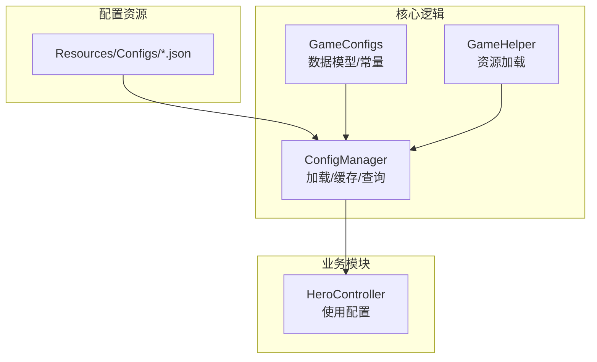
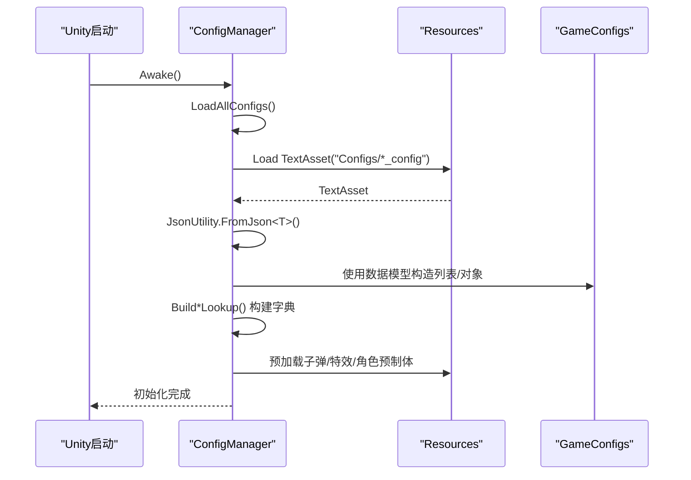
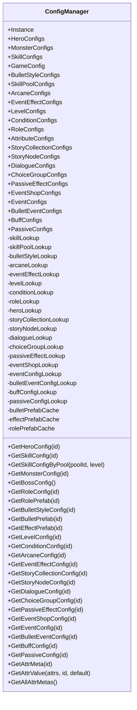
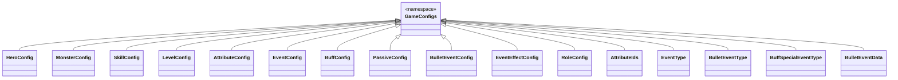
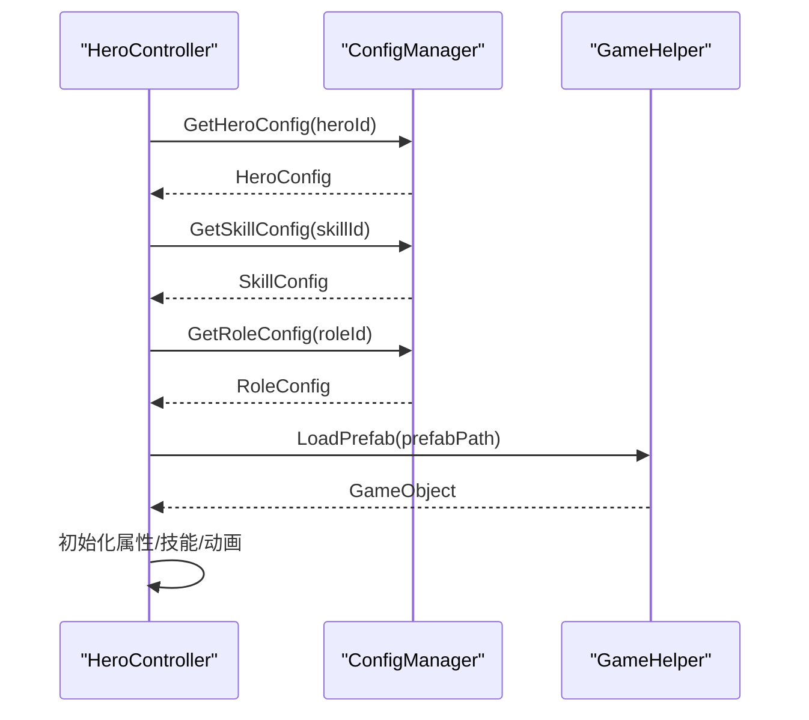
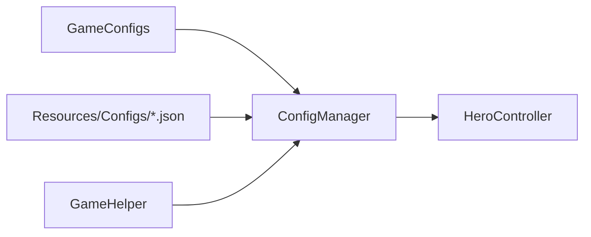

# 配置驱动开发

<cite>
**本文档引用的文件**
- [ConfigManager.cs](file://Assets/Scripts/Core/ConfigManager.cs)
- [GameConfigs.cs](file://Assets/Scripts/Data/GameConfigs.cs)
- [GameHelper.cs](file://Assets/Scripts/Core/GameHelper.cs)
- [game_config.json](file://Assets/Resources/Configs/game_config.json)
- [hero_config.json](file://Assets/Resources/Configs/hero_config.json)
- [skill_config.json](file://Assets/Resources/Configs/skill_config.json)
- [monster_config.json](file://Assets/Resources/Configs/monster_config.json)
- [bullet_config.json](file://Assets/Resources/Configs/bullet_config.json)
- [level_config.json](file://Assets/Resources/Configs/level_config.json)
- [HeroController.cs](file://Assets/Scripts/Battle/HeroController.cs)
</cite>

## 目录
1. [简介](#简介)
2. [项目结构](#项目结构)
3. [核心组件](#核心组件)
4. [架构总览](#架构总览)
5. [详细组件分析](#详细组件分析)
6. [依赖关系分析](#依赖关系分析)
7. [性能考量](#性能考量)
8. [故障排查指南](#故障排查指南)
9. [结论](#结论)
10. [附录](#附录)

## 简介
本文件面向GeometryTD项目的配置驱动开发，系统性阐述ConfigManager如何管理JSON配置文件与预制体缓存机制，分析配置加载流程、缓存策略与查找表构建过程；说明GameConfigs如何封装配置数据并提供类型安全的访问接口；解释配置验证机制与错误处理策略；给出新增配置文件的扩展方法、命名规范与结构要求；讨论热重载与向后兼容性；最后总结配置驱动开发的优势、局限与最佳实践。

## 项目结构
- 配置资源位于Resources/Configs目录，采用JSON格式，键名与GameConfigs中定义的类名保持一致。
- 核心配置管理器ConfigManager负责加载所有配置、构建查找表、预加载预制体缓存，并提供统一查询接口。
- GameConfigs定义了所有配置的数据模型与枚举常量，确保类型安全与跨模块共享。
- GameHelper提供资源加载辅助方法，用于加载Sprite与Prefab等资源。

图表来源
- [ConfigManager.cs:77-122](file://Assets/Scripts/Core/ConfigManager.cs#L77-L122)
- [GameConfigs.cs:10-120](file://Assets/Scripts/Data/GameConfigs.cs#L10-L120)
- [GameHelper.cs:31-47](file://Assets/Scripts/Core/GameHelper.cs#L31-L47)
- [HeroController.cs:85-138](file://Assets/Scripts/Battle/HeroController.cs#L85-L138)

章节来源
- [ConfigManager.cs:77-122](file://Assets/Scripts/Core/ConfigManager.cs#L77-L122)
- [GameConfigs.cs:10-120](file://Assets/Scripts/Data/GameConfigs.cs#L10-L120)
- [GameHelper.cs:31-47](file://Assets/Scripts/Core/GameHelper.cs#L31-L47)
- [HeroController.cs:85-138](file://Assets/Scripts/Battle/HeroController.cs#L85-L138)

## 核心组件
- ConfigManager：单例配置管理器，负责加载所有JSON配置、构建字典查找表、预加载预制体缓存、提供类型安全的查询接口。
- GameConfigs：集中定义所有配置数据模型、枚举常量与运行时数据结构，确保跨模块类型一致性。
- GameHelper：提供资源加载辅助方法，兼容Resources与Editor环境下的资产路径。

章节来源
- [ConfigManager.cs:6-619](file://Assets/Scripts/Core/ConfigManager.cs#L6-L619)
- [GameConfigs.cs:1-775](file://Assets/Scripts/Data/GameConfigs.cs#L1-L775)
- [GameHelper.cs:9-84](file://Assets/Scripts/Core/GameHelper.cs#L9-L84)

## 架构总览
ConfigManager在Awake阶段初始化，调用LoadAllConfigs加载所有配置，随后构建各类查找表，并预加载子弹与特效的预制体缓存。业务模块通过静态实例访问配置，实现零耦合的配置驱动。

图表来源
- [ConfigManager.cs:65-122](file://Assets/Scripts/Core/ConfigManager.cs#L65-L122)
- [ConfigManager.cs:200-215](file://Assets/Scripts/Core/ConfigManager.cs#L200-L215)

章节来源
- [ConfigManager.cs:65-122](file://Assets/Scripts/Core/ConfigManager.cs#L65-L122)
- [ConfigManager.cs:200-215](file://Assets/Scripts/Core/ConfigManager.cs#L200-L215)

## 详细组件分析

### ConfigManager：配置加载与缓存
- 单例生命周期：Awake中设置DontDestroyOnLoad，避免场景切换丢失配置。
- 配置加载：LoadAllConfigs按固定路径加载各配置文件，使用JsonUtility.FromJson<T>()反序列化。
- 查找表构建：为每类配置构建Dictionary<int, T>，提供O(1)查询；部分配置仍保留线性遍历（如怪物配置）。
- 预制体缓存：
  - 子弹预制体缓存：根据bullet_config.json中的prefabPath预加载，加速运行时获取。
  - 特效预制体缓存：根据event_effect_config.json中的prefabPath预加载。
  - 角色预制体缓存：通过GameHelper.LoadPrefab加载，支持Editor环境回退。
- 错误处理：加载失败或解析失败时记录错误日志；查询不到配置时记录警告/错误日志。

图表来源
- [ConfigManager.cs:6-619](file://Assets/Scripts/Core/ConfigManager.cs#L6-L619)

章节来源
- [ConfigManager.cs:65-122](file://Assets/Scripts/Core/ConfigManager.cs#L65-L122)
- [ConfigManager.cs:124-198](file://Assets/Scripts/Core/ConfigManager.cs#L124-L198)
- [ConfigManager.cs:169-198](file://Assets/Scripts/Core/ConfigManager.cs#L169-L198)
- [ConfigManager.cs:199-388](file://Assets/Scripts/Core/ConfigManager.cs#L199-L388)
- [ConfigManager.cs:394-424](file://Assets/Scripts/Core/ConfigManager.cs#L394-L424)

### GameConfigs：类型安全的配置数据模型
- 数据模型：以Serializable类定义各配置项字段，如HeroConfig、MonsterConfig、SkillConfig、LevelConfig等。
- 常量与枚举：定义属性ID、事件类型、Buff类型、故事节点类型等，确保跨模块一致性。
- 运行时数据：如BulletEventData用于运行时组合子弹事件效果，支持Clone深拷贝。

图表来源
- [GameConfigs.cs:10-775](file://Assets/Scripts/Data/GameConfigs.cs#L10-L775)

章节来源
- [GameConfigs.cs:10-775](file://Assets/Scripts/Data/GameConfigs.cs#L10-L775)

### GameHelper：资源加载辅助
- LoadSprite：优先从Resources加载，失败时在Editor环境下尝试AssetDatabase路径回退。
- LoadPrefab：同上，支持Editor环境回退。
- LoadFont：字体加载与回退策略。

章节来源
- [GameHelper.cs:13-58](file://Assets/Scripts/Core/GameHelper.cs#L13-L58)

### 使用示例：HeroController如何使用配置
- 初始化时读取HeroConfig，构建属性组件与技能配置数组。
- 通过ConfigManager.Instance.GetSkillConfig获取技能配置，读取攻击范围、冷却时间等。
- 通过ConfigManager.Instance.GetRoleConfig与GameHelper.LoadPrefab获取角色预制体。

图表来源
- [HeroController.cs:85-138](file://Assets/Scripts/Battle/HeroController.cs#L85-L138)
- [ConfigManager.cs:382-388](file://Assets/Scripts/Core/ConfigManager.cs#L382-L388)
- [ConfigManager.cs:342-355](file://Assets/Scripts/Core/ConfigManager.cs#L342-L355)
- [GameHelper.cs:31-47](file://Assets/Scripts/Core/GameHelper.cs#L31-L47)

章节来源
- [HeroController.cs:85-138](file://Assets/Scripts/Battle/HeroController.cs#L85-L138)
- [ConfigManager.cs:382-388](file://Assets/Scripts/Core/ConfigManager.cs#L382-L388)
- [ConfigManager.cs:342-355](file://Assets/Scripts/Core/ConfigManager.cs#L342-L355)
- [GameHelper.cs:31-47](file://Assets/Scripts/Core/GameHelper.cs#L31-L47)

## 依赖关系分析
- ConfigManager依赖GameConfigs的数据模型进行反序列化。
- ConfigManager依赖Resources加载配置文本与Resources/加载预制体。
- GameHelper为ConfigManager的角色预制体加载提供回退能力。
- 业务模块（如HeroController）通过ConfigManager静态实例访问配置，形成松耦合。

图表来源
- [ConfigManager.cs:77-122](file://Assets/Scripts/Core/ConfigManager.cs#L77-L122)
- [GameConfigs.cs:10-120](file://Assets/Scripts/Data/GameConfigs.cs#L10-L120)
- [GameHelper.cs:31-47](file://Assets/Scripts/Core/GameHelper.cs#L31-L47)
- [HeroController.cs:85-138](file://Assets/Scripts/Battle/HeroController.cs#L85-L138)

章节来源
- [ConfigManager.cs:77-122](file://Assets/Scripts/Core/ConfigManager.cs#L77-L122)
- [GameConfigs.cs:10-120](file://Assets/Scripts/Data/GameConfigs.cs#L10-L120)
- [GameHelper.cs:31-47](file://Assets/Scripts/Core/GameHelper.cs#L31-L47)
- [HeroController.cs:85-138](file://Assets/Scripts/Battle/HeroController.cs#L85-L138)

## 性能考量
- 字典查找：为技能、技能池、子弹样式、奥术、事件效果、关卡、条件、角色、英雄等构建Dictionary<int, T>，查询复杂度O(1)，显著优于线性遍历。
- 预加载缓存：子弹与特效预制体在加载阶段预加载到内存字典，运行时直接取用，避免频繁Resources.Load开销。
- 避免重复解析：JsonUtility.FromJson仅在初始化阶段执行一次，后续通过字典快速访问。
- 建议优化：
  - 对MonsterConfig等仍使用线性遍历的场景，可考虑在加载后也构建字典，进一步提升查询效率。
  - 大型配置文件建议拆分，按需加载，减少初始内存占用。

章节来源
- [ConfigManager.cs:124-198](file://Assets/Scripts/Core/ConfigManager.cs#L124-L198)
- [ConfigManager.cs:169-198](file://Assets/Scripts/Core/ConfigManager.cs#L169-L198)

## 故障排查指南
- 配置文件缺失：
  - 现象：日志输出“无法加载配置文件: ...”
  - 排查：确认Resources/Configs下存在对应JSON文件，且文件名与加载路径一致。
- 配置文件解析失败：
  - 现象：日志输出“配置文件解析失败: ...”
  - 排查：检查JSON语法、字段类型与GameConfigs定义是否一致。
- 查询不到配置：
  - 现象：日志输出“未找到...配置, id: ...”（错误级别）
  - 排查：确认id是否存在、是否正确传入；对于线性遍历的配置（如怪物），确认id唯一且正确。
- 预制体加载失败：
  - 现象：日志输出“无法加载...Prefab: ...”
  - 排查：确认prefabPath正确，资源存在于Resources或Editor环境下的AssetDatabase路径。

章节来源
- [ConfigManager.cs:203-214](file://Assets/Scripts/Core/ConfigManager.cs#L203-L214)
- [ConfigManager.cs:243-244](file://Assets/Scripts/Core/ConfigManager.cs#L243-L244)
- [ConfigManager.cs:181-182](file://Assets/Scripts/Core/ConfigManager.cs#L181-L182)
- [ConfigManager.cs:368](file://Assets/Scripts/Core/ConfigManager.cs#L368)

## 结论
ConfigManager通过统一的配置加载、字典查找与预制体缓存，实现了高效的配置驱动开发模式。GameConfigs提供了强类型的数据模型与常量定义，确保跨模块一致性与可维护性。通过合理的错误处理与日志提示，提升了问题定位效率。建议在大型项目中进一步完善热重载与增量更新机制，同时保持向后兼容性，以满足快速迭代需求。

## 附录

### 配置文件命名规范与结构要求
- 命名规范：所有配置文件位于Resources/Configs目录，文件名为“{模块名}_config.json”，例如“hero_config.json”、“skill_config.json”、“level_config.json”等。
- 结构要求：JSON顶层应包含一个与数据模型类名对应的字段，该字段为数组或对象，包含具体配置项。例如：
  - hero_config.json包含“heroes”字段，其值为HeroConfig数组。
  - skill_config.json包含“skills”字段，其值为SkillConfig数组。
  - level_config.json包含“levels”字段，其值为LevelConfig数组。
  - bullet_config.json包含“bulletStyles”字段，其值为BulletStyleConfig数组。
  - game_config.json为GameConfig对象。
- 字段类型：严格遵循GameConfigs中定义的字段类型，避免类型不匹配导致解析失败。

章节来源
- [ConfigManager.cs:79-100](file://Assets/Scripts/Core/ConfigManager.cs#L79-L100)
- [hero_config.json:1-44](file://Assets/Resources/Configs/hero_config.json#L1-L44)
- [skill_config.json:1-800](file://Assets/Resources/Configs/skill_config.json#L1-L800)
- [level_config.json:1-80](file://Assets/Resources/Configs/level_config.json#L1-L80)
- [bullet_config.json:1-9](file://Assets/Resources/Configs/bullet_config.json#L1-L9)
- [game_config.json:1-9](file://Assets/Resources/Configs/game_config.json#L1-L9)

### 如何添加新的配置文件
- 定义数据模型：在GameConfigs中新增类与列表包装类，如MyConfig、MyConfigList。
- 编写JSON：在Resources/Configs下新增“my_config.json”，顶层字段命名为“my_configs”，值为MyConfig数组。
- 加载与查询：
  - 在ConfigManager.LoadAllConfigs中添加一行加载逻辑，如“MyConfigs = LoadConfig<MyConfigList>(\"Configs/my_config\").my_configs;”。
  - 构建查找表：在LoadAllConfigs后调用BuildMyLookup()，并在类内实现BuildMyLookup()与GetMyConfig()。
  - 在业务模块中通过ConfigManager.Instance.GetMyConfig(id)访问。

章节来源
- [ConfigManager.cs:77-122](file://Assets/Scripts/Core/ConfigManager.cs#L77-L122)
- [GameConfigs.cs:10-120](file://Assets/Scripts/Data/GameConfigs.cs#L10-L120)

### 热重载与向后兼容性
- 现状：ConfigManager在Awake阶段一次性加载并缓存配置，未内置热重载机制。
- 建议方案：
  - 热重载：提供ReloadConfigs()方法，重新加载JSON、重建字典与缓存，并通知业务模块刷新显示。
  - 向后兼容：在GameConfigs中为新增字段提供默认值，或在ConfigManager中对缺失字段进行容错处理，避免因版本差异导致崩溃。
  - 增量更新：对大型配置文件进行拆分，按需加载，减少重载成本。

章节来源
- [ConfigManager.cs:65-122](file://Assets/Scripts/Core/ConfigManager.cs#L65-L122)

### 配置驱动开发的优势与局限
- 优势：
  - 快速迭代：无需修改代码即可调整游戏平衡与玩法。
  - 类型安全：通过GameConfigs统一数据模型，降低运行时错误。
  - 松耦合：业务模块通过ConfigManager访问配置，降低模块间耦合。
- 局限：
  - 初始加载成本：一次性加载所有配置可能增加启动时间。
  - 热重载缺失：当前未实现运行时热更新，需重启或自定义热重载方案。
  - 配置膨胀：配置文件过多可能导致维护复杂度上升。