# 测试工具

<cite>
**本文档引用的文件**
- [p1_client.slnx](file://p1_client.slnx)
- [ProjectSettings.asset](file://ProjectSettings/ProjectSettings.asset)
- [Assembly-CSharp.csproj](file://Assembly-CSharp.csproj)
- [UnityEngine.TestRunner.csproj](file://UnityEngine.TestRunner.csproj)
- [UnityEditor.TestRunner.csproj](file://UnityEditor.TestRunner.csproj)
- [Assets.Tests.meta](file://Assets/Tests.meta)
</cite>

## 目录
1. [简介](#简介)
2. [项目结构](#项目结构)
3. [核心组件](#核心组件)
4. [架构概览](#架构概览)
5. [详细组件分析](#详细组件分析)
6. [依赖关系分析](#依赖关系分析)
7. [性能考虑](#性能考虑)
8. [故障排除指南](#故障排除指南)
9. [结论](#结论)

## 简介

本项目集成了Unity官方测试框架，支持编辑模式（EditMode）和播放模式（PlayMode）的自动化测试。测试工具基于Unity Test Framework 1.1.33版本构建，使用NUnit作为测试断言库，为游戏逻辑、战斗系统、UI组件等提供全面的自动化测试能力。

## 项目结构

项目采用标准的Unity项目结构，测试相关的核心文件分布如下：

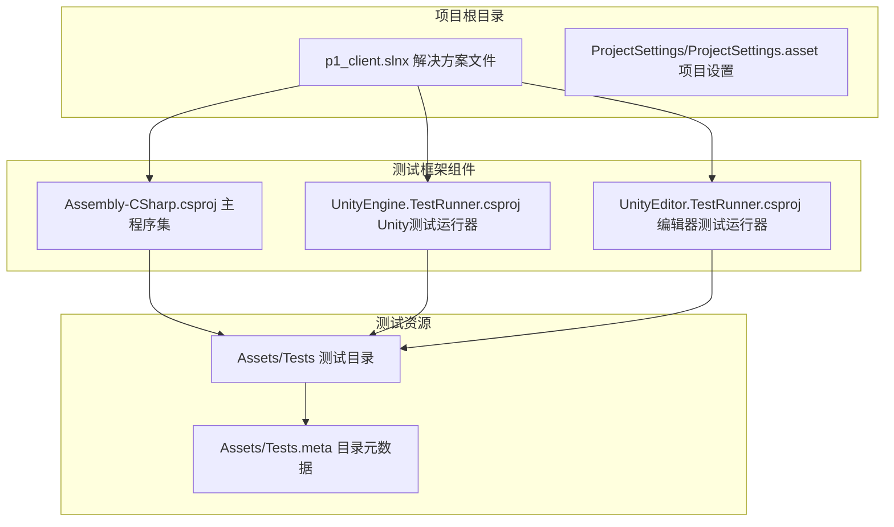

**图表来源**
- [p1_client.slnx:1-7](file://p1_client.slnx#L1-L7)
- [Assembly-CSharp.csproj:1-50](file://Assembly-CSharp.csproj#L1-L50)
- [UnityEngine.TestRunner.csproj:1-50](file://UnityEngine.TestRunner.csproj#L1-L50)
- [UnityEditor.TestRunner.csproj:1-50](file://UnityEditor.TestRunner.csproj#L1-L50)

**章节来源**
- [p1_client.slnx:1-7](file://p1_client.slnx#L1-L7)
- [ProjectSettings.asset:400-401](file://ProjectSettings/ProjectSettings.asset#L400-L401)

## 核心组件

### 测试框架架构

项目采用分层测试架构，包含以下核心组件：

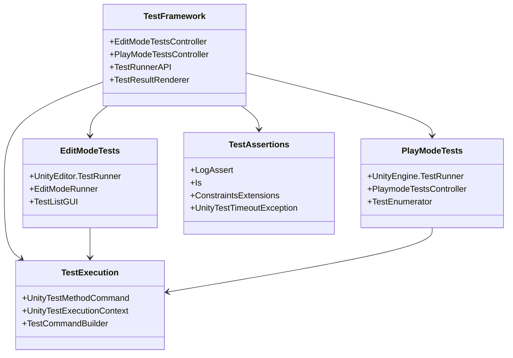

**图表来源**
- [UnityEngine.TestRunner.csproj:132-156](file://UnityEngine.TestRunner.csproj#L132-L156)
- [UnityEditor.TestRunner.csproj:120-149](file://UnityEditor.TestRunner.csproj#L120-L149)

### 测试执行流程

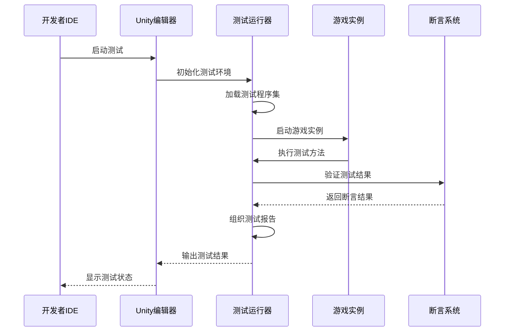

**图表来源**
- [UnityEngine.TestRunner.csproj:132-156](file://UnityEngine.TestRunner.csproj#L132-L156)
- [UnityEditor.TestRunner.csproj:120-149](file://UnityEditor.TestRunner.csproj#L120-L149)

**章节来源**
- [UnityEngine.TestRunner.csproj:1-800](file://UnityEngine.TestRunner.csproj#L1-L800)
- [UnityEditor.TestRunner.csproj:1-800](file://UnityEditor.TestRunner.csproj#L1-L800)

## 架构概览

### 测试环境配置

项目使用Unity 2022.3.62版本，测试框架通过以下配置实现：

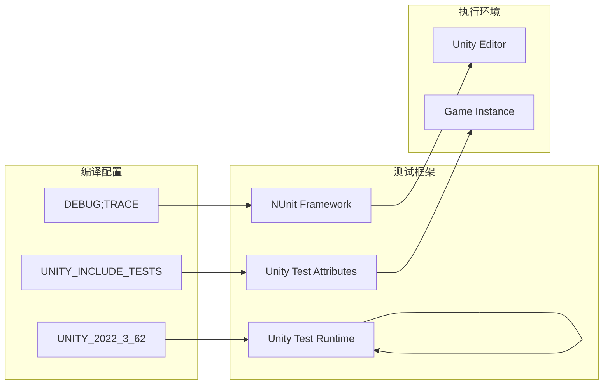

**图表来源**
- [Assembly-CSharp.csproj:20-30](file://Assembly-CSharp.csproj#L20-L30)
- [UnityEngine.TestRunner.csproj:20-30](file://UnityEngine.TestRunner.csproj#L20-L30)

### 测试类型分类

项目支持多种测试类型，每种类型具有特定的执行环境和用途：

| 测试类型 | 执行环境 | 用途 | 特点 |
|---------|---------|------|------|
| EditMode测试 | Unity编辑器 | 单元测试、集成测试 | 快速执行，无需启动游戏实例 |
| PlayMode测试 | 游戏实例 | 系统测试、端到端测试 | 模拟真实游戏环境 |
| 场景测试 | 场景加载 | 场景完整性验证 | 验证场景资源加载 |

**章节来源**
- [ProjectSettings.asset:400-401](file://ProjectSettings/ProjectSettings.asset#L400-L401)
- [Assembly-CSharp.csproj:20-30](file://Assembly-CSharp.csproj#L20-L30)

## 详细组件分析

### 测试运行器组件

#### EditMode测试运行器

EditMode测试在Unity编辑器环境中执行，具有以下特点：

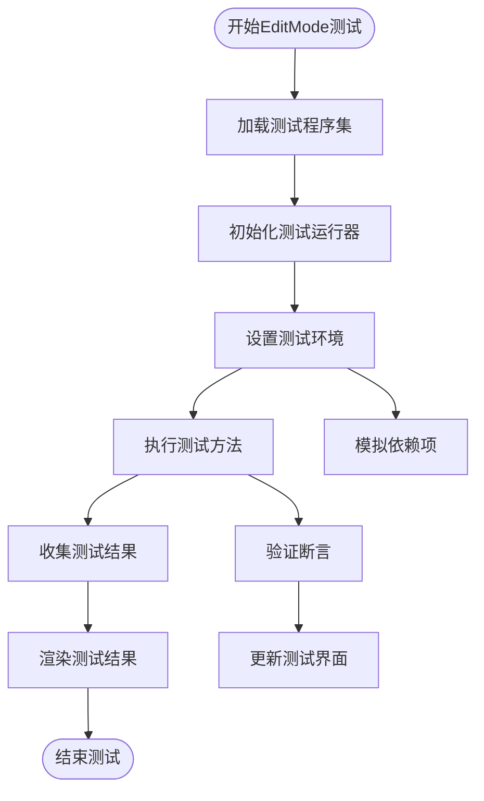

**图表来源**
- [UnityEditor.TestRunner.csproj:120-149](file://UnityEditor.TestRunner.csproj#L120-L149)

#### PlayMode测试运行器

PlayMode测试在独立的游戏实例中执行，提供更真实的测试环境：

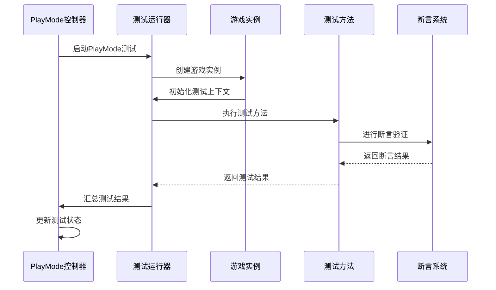

**图表来源**
- [UnityEngine.TestRunner.csproj:132-156](file://UnityEngine.TestRunner.csproj#L132-L156)

**章节来源**
- [UnityEditor.TestRunner.csproj:120-200](file://UnityEditor.TestRunner.csproj#L120-L200)
- [UnityEngine.TestRunner.csproj:132-180](file://UnityEngine.TestRunner.csproj#L132-L180)

### 测试断言系统

#### 日志断言机制

测试框架提供了强大的日志断言功能，用于验证游戏运行时的日志输出：

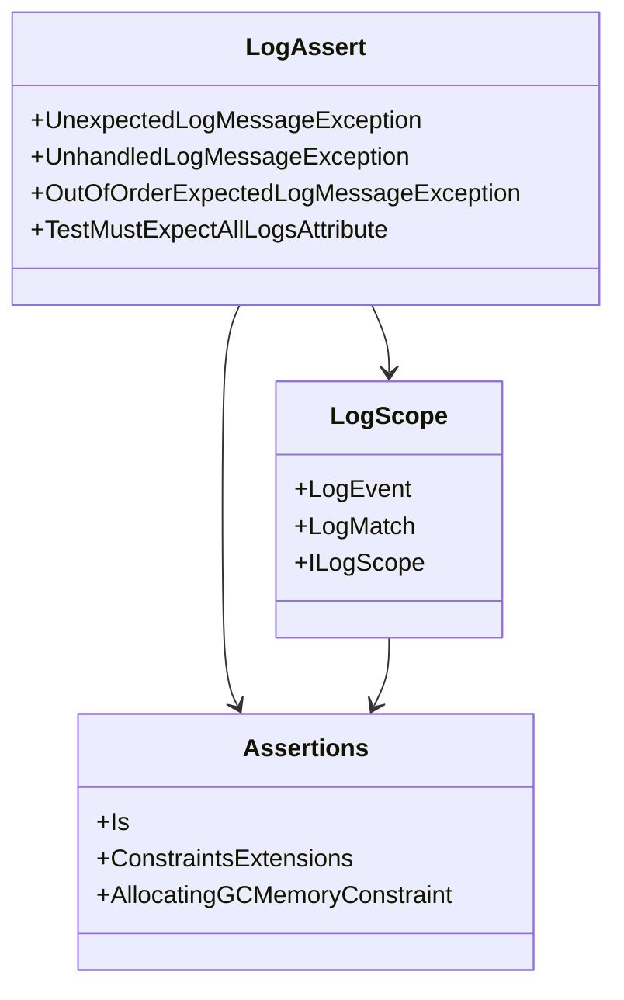

**图表来源**
- [UnityEngine.TestRunner.csproj:93-120](file://UnityEngine.TestRunner.csproj#L93-L120)

#### 超时异常处理

测试框架实现了完善的超时异常处理机制：

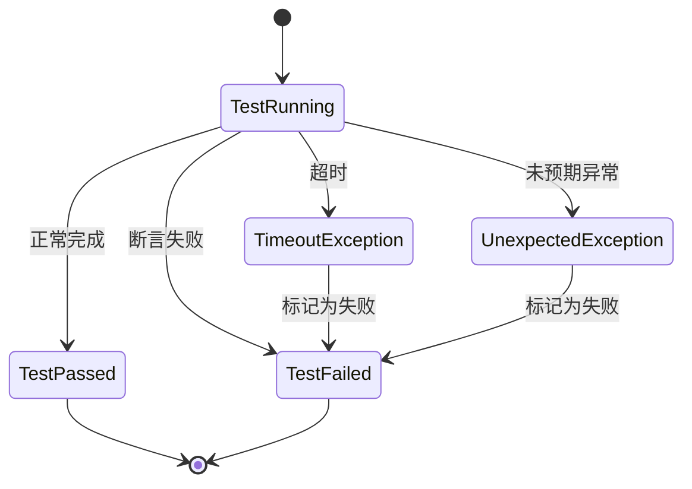

**图表来源**
- [UnityEngine.TestRunner.csproj:51-80](file://UnityEngine.TestRunner.csproj#L51-L80)

**章节来源**
- [UnityEngine.TestRunner.csproj:93-156](file://UnityEngine.TestRunner.csproj#L93-L156)

### 测试工具组件

#### 测试列表管理

测试框架提供了完整的测试列表管理功能：

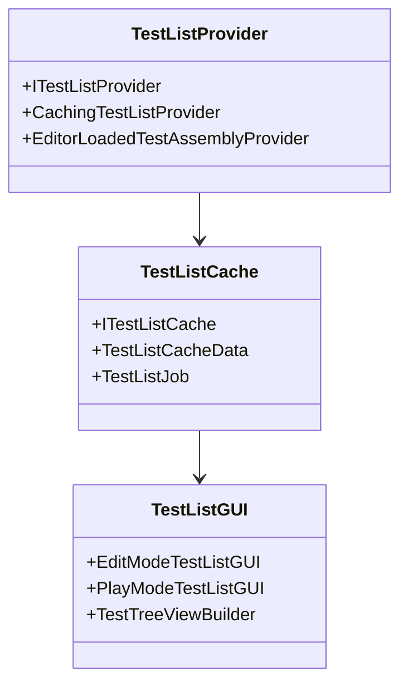

**图表来源**
- [UnityEditor.TestRunner.csproj:186-196](file://UnityEditor.TestRunner.csproj#L186-L196)

#### 测试结果渲染

测试结果通过专门的渲染器进行可视化展示：

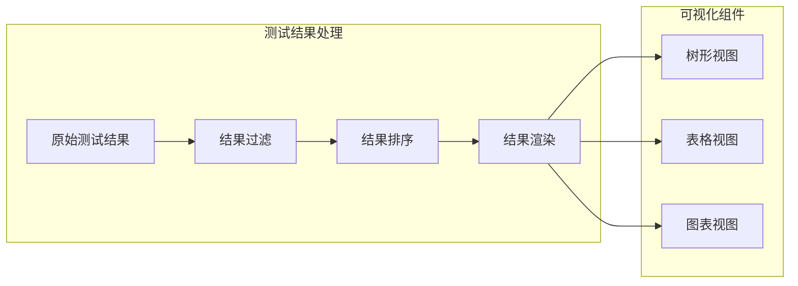

**图表来源**
- [UnityEditor.TestRunner.csproj:67-98](file://UnityEditor.TestRunner.csproj#L67-L98)

**章节来源**
- [UnityEditor.TestRunner.csproj:186-207](file://UnityEditor.TestRunner.csproj#L186-L207)

## 依赖关系分析

### 外部依赖

项目测试框架依赖于以下外部组件：

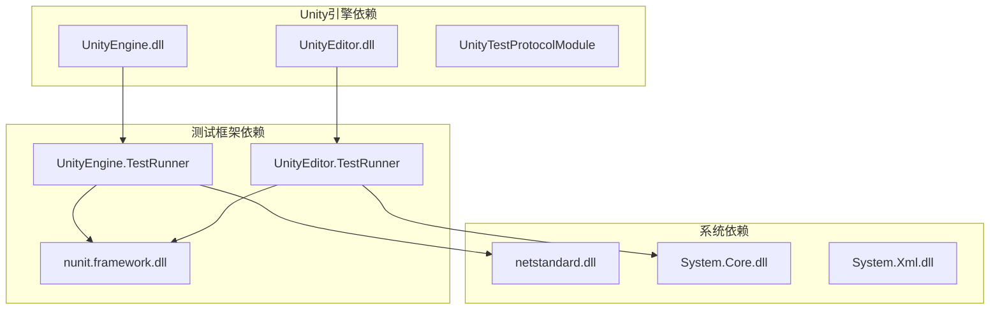

**图表来源**
- [Assembly-CSharp.csproj:127-165](file://Assembly-CSharp.csproj#L127-L165)
- [UnityEngine.TestRunner.csproj:157-195](file://UnityEngine.TestRunner.csproj#L157-L195)

### 内部模块依赖

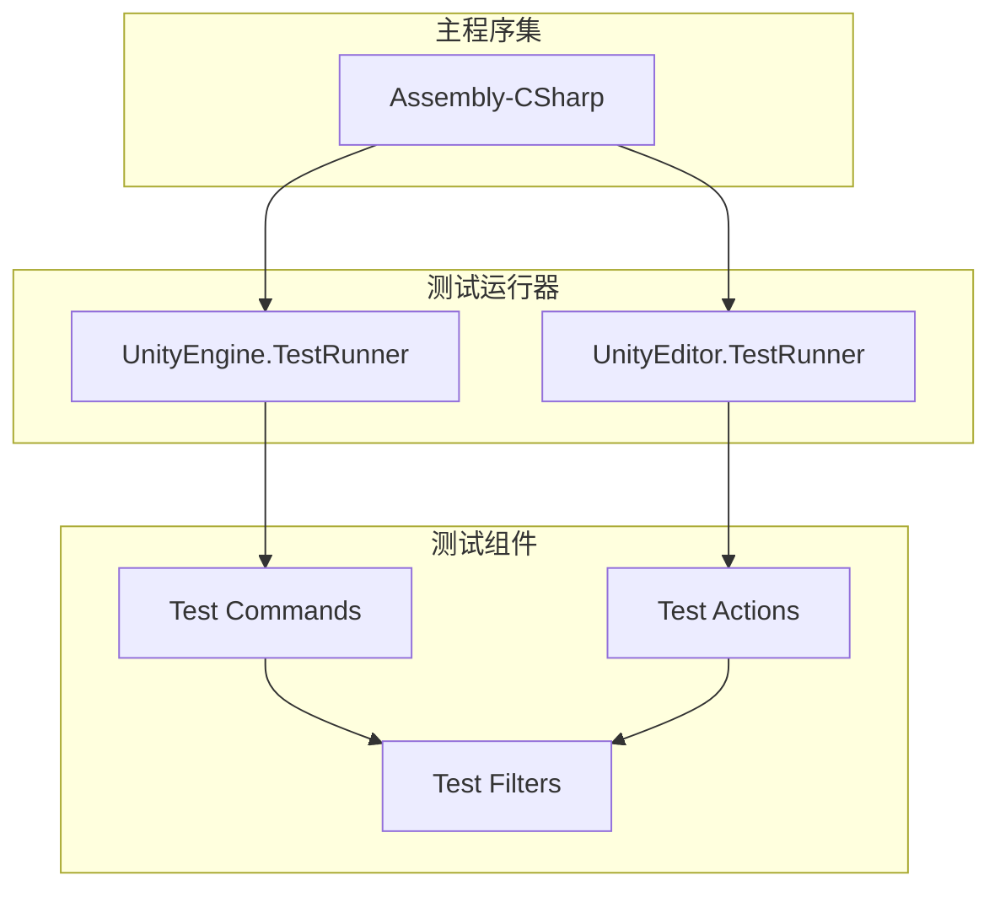

**图表来源**
- [Assembly-CSharp.csproj:42-125](file://Assembly-CSharp.csproj#L42-L125)
- [UnityEngine.TestRunner.csproj:38-86](file://UnityEngine.TestRunner.csproj#L38-L86)

**章节来源**
- [Assembly-CSharp.csproj:127-385](file://Assembly-CSharp.csproj#L127-L385)
- [UnityEngine.TestRunner.csproj:157-361](file://UnityEngine.TestRunner.csproj#L157-L361)

## 性能考虑

### 测试执行优化

测试框架在性能方面采用了多项优化策略：

1. **异步测试执行**：支持协程和异步测试方法
2. **内存管理**：自动垃圾回收监控和内存泄漏检测
3. **并行测试**：支持多线程并行执行测试
4. **缓存机制**：测试列表和结果的智能缓存

### 测试环境隔离

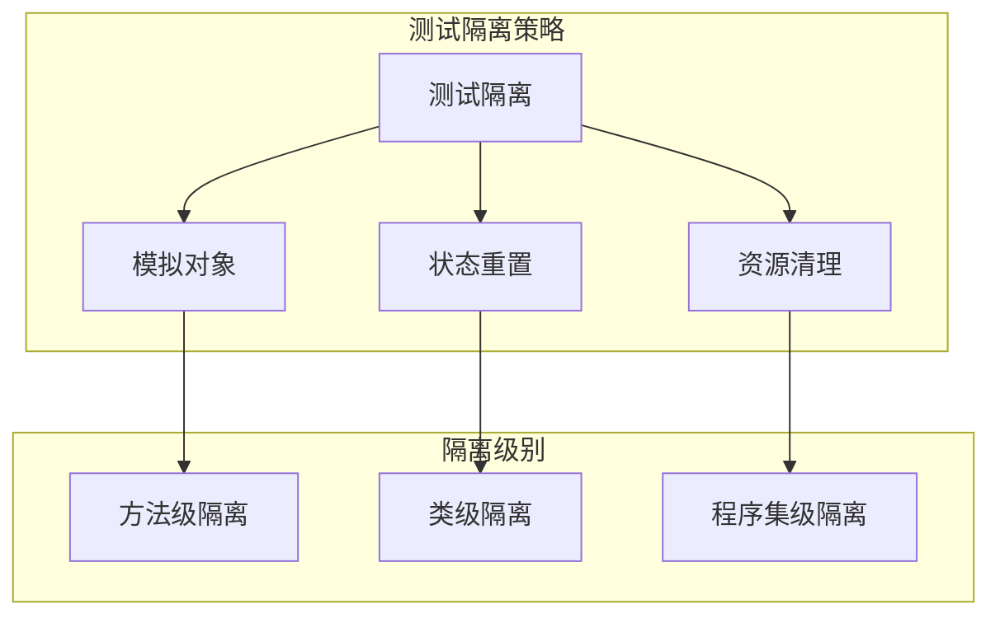

## 故障排除指南

### 常见问题诊断

#### 测试无法启动

**症状**：测试运行器无法启动或显示空测试列表

**解决方案**：
1. 检查测试程序集是否正确编译
2. 验证测试方法是否标记为`[Test]`或`[UnityTest]`
3. 确认测试类是否为公共且可实例化

#### 断言失败

**症状**：测试执行过程中出现断言失败

**诊断步骤**：
1. 查看详细的错误日志和堆栈跟踪
2. 验证测试数据和期望值
3. 检查测试环境配置

#### 性能问题

**症状**：测试执行时间过长或内存占用过高

**优化建议**：
1. 减少测试间的依赖关系
2. 使用适当的测试数据集
3. 实施测试结果缓存机制

**章节来源**
- [UnityEngine.TestRunner.csproj:51-80](file://UnityEngine.TestRunner.csproj#L51-L80)
- [UnityEditor.TestRunner.csproj:168-186](file://UnityEditor.TestRunner.csproj#L168-L186)

## 结论

本项目成功集成了Unity官方测试框架，提供了完整的测试解决方案。通过编辑模式和播放模式的双重测试支持，以及丰富的断言和日志验证功能，为游戏开发提供了可靠的自动化测试基础。

测试框架的主要优势包括：
- **全面的测试覆盖**：支持单元测试、集成测试和系统测试
- **灵活的执行环境**：编辑器和游戏实例两种执行模式
- **强大的断言系统**：基于NUnit的丰富断言库
- **优秀的性能表现**：优化的测试执行和资源管理

未来可以考虑的改进方向：
- 扩展测试覆盖率统计
- 增强测试报告生成
- 集成持续集成管道
- 添加更多测试辅助工具