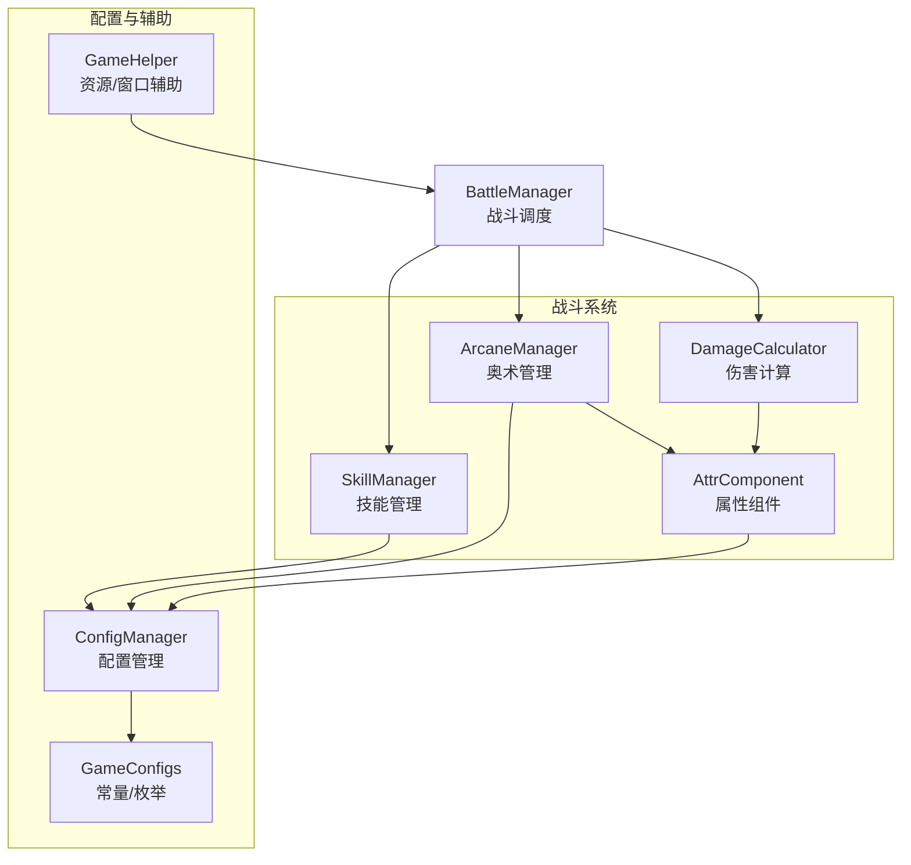
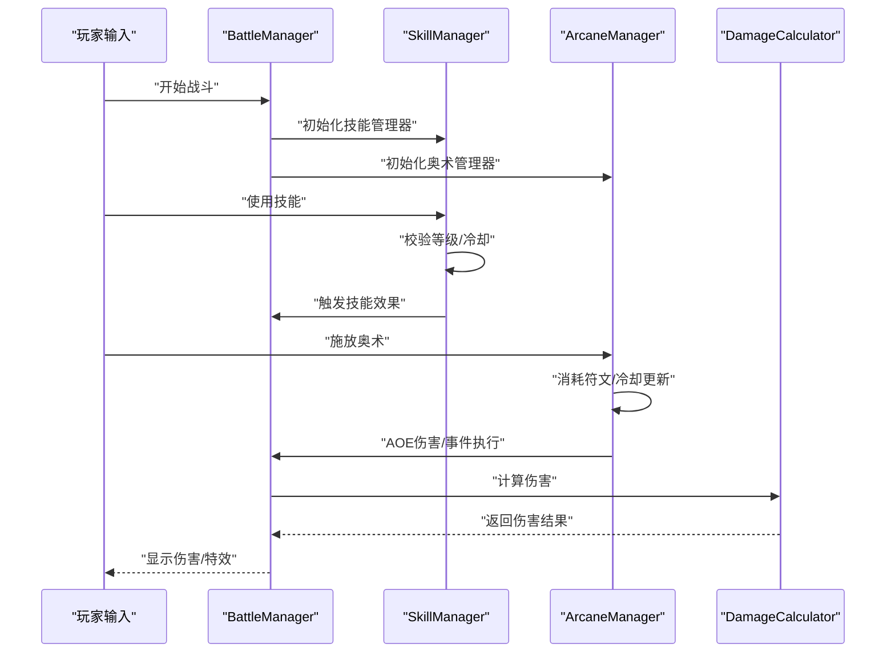
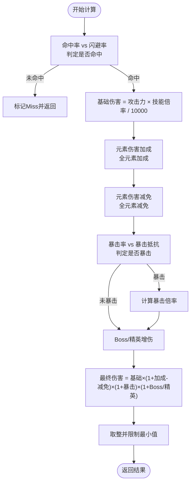
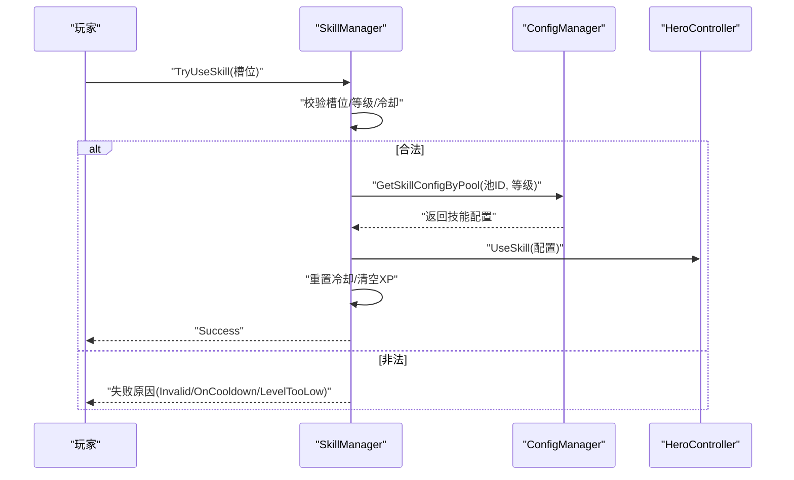
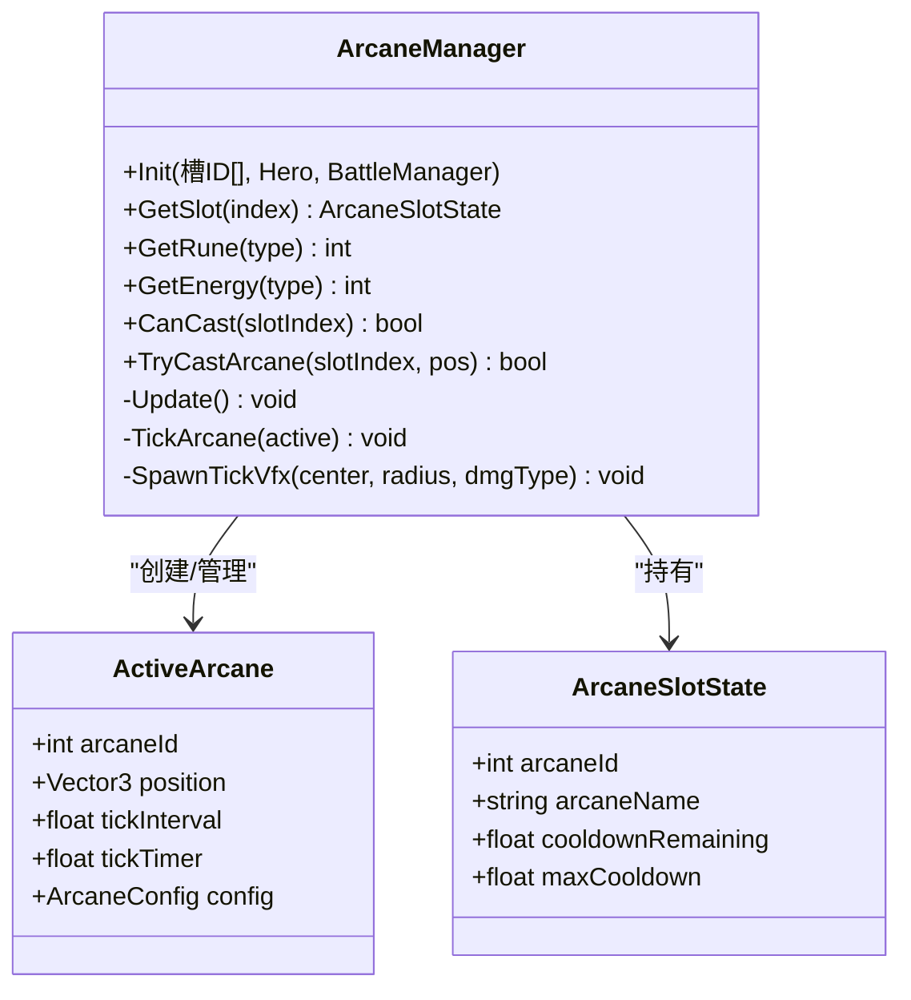

# 测试策略

<cite>
**本文档引用的文件**
- [DamageCalculator.cs](file://Assets/Scripts/Battle/DamageCalculator.cs)
- [SkillManager.cs](file://Assets/Scripts/Battle/SkillManager.cs)
- [ArcaneManager.cs](file://Assets/Scripts/Battle/ArcaneManager.cs)
- [AttrComponent.cs](file://Assets/Scripts/Battle/AttrComponent.cs)
- [ConfigManager.cs](file://Assets/Scripts/Core/ConfigManager.cs)
- [GameConfigs.cs](file://Assets/Scripts/Data/GameConfigs.cs)
- [BattleManager.cs](file://Assets/Scripts/Battle/BattleManager.cs)
- [GameHelper.cs](file://Assets/Scripts/Core/GameHelper.cs)
- [arcane_config.json](file://Assets/Resources/Configs/arcane_config.json)
- [skill_config.json](file://Assets/Resources/Configs/skill_config.json)
- [attribute_config.json](file://Assets/Resources/Configs/attribute_config.json)
</cite>

## 目录
1. [简介](#简介)
2. [项目结构与测试范围](#项目结构与测试范围)
3. [核心组件与测试架构](#核心组件与测试架构)
4. [系统架构与交互关系](#系统架构与交互关系)
5. [关键模块测试实现](#关键模块测试实现)
6. [测试用例设计原则](#测试用例设计原则)
7. [自动化测试实施](#自动化测试实施)
8. [测试驱动开发实践](#测试驱动开发实践)
9. [测试覆盖率评估](#测试覆盖率评估)
10. [最佳实践与规范](#最佳实践与规范)
11. [故障排查指南](#故障排查指南)
12. [结论](#结论)

## 简介
本测试策略文档面向 GeometryTD 项目，旨在建立完善的测试体系，覆盖单元测试、集成测试与回归测试，确保伤害计算、技能系统与奥术系统的准确性、稳定性与可维护性。文档从测试架构设计、关键模块测试实现、测试用例设计原则、自动化测试实施、测试驱动开发实践、覆盖率评估到最佳实践进行全面阐述，并提供可操作的实施建议。

## 项目结构与测试范围
- 测试范围聚焦于战斗系统核心模块：
  - 伤害计算：DamageCalculator
  - 技能系统：SkillManager
  - 奥术系统：ArcaneManager
  - 属性系统：AttrComponent
  - 配置系统：ConfigManager
  - 游戏辅助：GameHelper
- 配置文件支撑：arcane_config.json、skill_config.json、attribute_config.json
- 关键依赖：BattleManager（场景调度）、GameConfigs（常量与枚举）

图表来源
- [DamageCalculator.cs:22-103](file://Assets/Scripts/Battle/DamageCalculator.cs#L22-L103)
- [SkillManager.cs:15-240](file://Assets/Scripts/Battle/SkillManager.cs#L15-L240)
- [ArcaneManager.cs:23-296](file://Assets/Scripts/Battle/ArcaneManager.cs#L23-L296)
- [AttrComponent.cs:6-127](file://Assets/Scripts/Battle/AttrComponent.cs#L6-L127)
- [ConfigManager.cs:6-618](file://Assets/Scripts/Core/ConfigManager.cs#L6-L618)
- [GameConfigs.cs:23-56](file://Assets/Scripts/Data/GameConfigs.cs#L23-L56)
- [BattleManager.cs:7-804](file://Assets/Scripts/Battle/BattleManager.cs#L7-L804)
- [GameHelper.cs:9-84](file://Assets/Scripts/Core/GameHelper.cs#L9-L84)

章节来源
- [DamageCalculator.cs:1-106](file://Assets/Scripts/Battle/DamageCalculator.cs#L1-L106)
- [SkillManager.cs:1-242](file://Assets/Scripts/Battle/SkillManager.cs#L1-L242)
- [ArcaneManager.cs:1-298](file://Assets/Scripts/Battle/ArcaneManager.cs#L1-L298)
- [AttrComponent.cs:1-129](file://Assets/Scripts/Battle/AttrComponent.cs#L1-L129)
- [ConfigManager.cs:1-619](file://Assets/Scripts/Core/ConfigManager.cs#L1-L619)
- [GameConfigs.cs:23-56](file://Assets/Scripts/Data/GameConfigs.cs#L23-L56)
- [BattleManager.cs:1-805](file://Assets/Scripts/Battle/BattleManager.cs#L1-L805)
- [GameHelper.cs:1-84](file://Assets/Scripts/Core/GameHelper.cs#L1-L84)

## 核心组件与测试架构
- 单元测试（Unit Test）：针对纯函数与无副作用的逻辑，如伤害计算、属性计算、配置查询等，使用模拟对象隔离外部依赖。
- 集成测试（Integration Test）：验证组件间协作，如 SkillManager 与 ConfigManager 的组合、ArcaneManager 与 BattleManager 的联动。
- 回归测试（Regression Test）：基于配置文件与固定输入输出的稳定场景，确保版本演进不破坏既有行为。
- 测试数据与环境：
  - 使用 Resources/Configs 下的 JSON 配置作为测试输入
  - 通过 ConfigManager 单例加载配置，避免重复 IO
  - 使用 GameHelper 提供的资源加载能力进行场景/预制体加载

章节来源
- [ConfigManager.cs:65-122](file://Assets/Scripts/Core/ConfigManager.cs#L65-L122)
- [GameHelper.cs:31-47](file://Assets/Scripts/Core/GameHelper.cs#L31-L47)

## 系统架构与交互关系
DamageCalculator 依赖 AttrComponent 计算最终属性；SkillManager 依赖 ConfigManager 查询技能配置并管理冷却与经验；ArcaneManager 依赖 ConfigManager 查询奥术配置并管理能量与符文；BattleManager 协调三者并在场景中执行。

图表来源
- [BattleManager.cs:145-275](file://Assets/Scripts/Battle/BattleManager.cs#L145-L275)
- [SkillManager.cs:87-137](file://Assets/Scripts/Battle/SkillManager.cs#L87-L137)
- [ArcaneManager.cs:135-165](file://Assets/Scripts/Battle/ArcaneManager.cs#L135-L165)
- [DamageCalculator.cs:24-103](file://Assets/Scripts/Battle/DamageCalculator.cs#L24-L103)

## 关键模块测试实现

### 伤害计算测试（DamageCalculator）
- 测试目标
  - 命中/闪避判定的正确性
  - 基础伤害与技能倍率的计算
  - 元素伤害加成/减免的叠加
  - 暴击率/抗性的计算与倍率应用
  - Boss/精英增伤的叠加
  - 最终伤害的取整与下限保护
- 关键输入
  - 攻击者/防御者 AttrComponent
  - 技能伤害比例与类型
  - 是否Boss/精英目标标记
- 关键断言
  - 命中/闪避标志
  - 暴击标志与倍率
  - 最终伤害数值范围

图表来源
- [DamageCalculator.cs:24-103](file://Assets/Scripts/Battle/DamageCalculator.cs#L24-L103)
- [AttrComponent.cs:38-53](file://Assets/Scripts/Battle/AttrComponent.cs#L38-L53)

章节来源
- [DamageCalculator.cs:22-103](file://Assets/Scripts/Battle/DamageCalculator.cs#L22-L103)
- [AttrComponent.cs:6-127](file://Assets/Scripts/Battle/AttrComponent.cs#L6-L127)

### 技能系统测试（SkillManager）
- 测试目标
  - 技能分类识别（根据配置字段优先，否则按属性回退）
  - 技能槽初始化与状态管理
  - 冷却时间更新与重置
  - 技能使用前置条件校验（等级、冷却、英雄状态）
  - 经验值分配（均匀/随机槽位）
  - 等级提升事件通知
- 关键输入
  - 技能池ID数组
  - 英雄控制器与战斗管理器
  - 技能使用请求（槽位、释放位置）
- 关键断言
  - 使用结果（成功/失败原因）
  - 冷却剩余时间
  - 经验值槽位变化
  - 等级提升事件触发

图表来源
- [SkillManager.cs:87-137](file://Assets/Scripts/Battle/SkillManager.cs#L87-L137)
- [ConfigManager.cs:224-227](file://Assets/Scripts/Core/ConfigManager.cs#L224-L227)

章节来源
- [SkillManager.cs:15-240](file://Assets/Scripts/Battle/SkillManager.cs#L15-L240)
- [ConfigManager.cs:6-618](file://Assets/Scripts/Core/ConfigManager.cs#L6-L618)

### 奥术系统测试（ArcaneManager）
- 测试目标
  - 符文能量累积与转换
  - 奥术施放条件（冷却、符文消耗、成本修正）
  - 激活奥术的周期性触发与伤害计算
  - 全屏与范围伤害的差异
  - 自身事件与敌方事件的执行
  - VFX 生成与销毁
- 关键输入
  - 奥术槽ID数组
  - 施放位置与目标
  - 英雄基础攻击与配置参数
- 关键断言
  - 符文消耗与剩余
  - 冷却时间更新
  - 激活列表变化
  - 伤害与事件触发次数

图表来源
- [ArcaneManager.cs:23-296](file://Assets/Scripts/Battle/ArcaneManager.cs#L23-L296)

章节来源
- [ArcaneManager.cs:23-296](file://Assets/Scripts/Battle/ArcaneManager.cs#L23-L296)

## 测试用例设计原则
- 边界条件测试
  - 命中率/闪避率为0/10000的极端场景
  - 暴击率为0/10000与抗性抵消的边界
  - Boss/精英增伤为负的场景
  - 最终伤害为0的保护
- 异常情况处理
  - 缺失配置/空引用的容错
  - 无效槽位/冷却中的技能使用
  - 超出数组范围的访问
- 性能基准测试
  - 大量敌人范围伤害的吞吐量
  - 多个激活奥术的 Tick 频率
  - 配置加载与缓存命中率
- 可重现性与隔离
  - 使用固定随机种子或替换随机源
  - 使用内存型配置加载，避免磁盘依赖

章节来源
- [DamageCalculator.cs:32-43](file://Assets/Scripts/Battle/DamageCalculator.cs#L32-L43)
- [SkillManager.cs:91-119](file://Assets/Scripts/Battle/SkillManager.cs#L91-L119)
- [ArcaneManager.cs:135-165](file://Assets/Scripts/Battle/ArcaneManager.cs#L135-L165)

## 自动化测试实施
- 测试数据准备
  - 使用 Resources/Configs 下的 JSON 文件作为输入
  - 在测试前初始化 ConfigManager 单例并加载配置
  - 准备最小化的 AttrComponent 数据以驱动计算
- 测试环境搭建
  - 使用 Unity 的测试框架（推荐运行在编辑器或命令行）
  - 通过 GameHelper.LoadPrefab/LoadSprite 加载必要资源
  - Mock 或 Stub 外部依赖（如 BattleManager 的 UI/场景部分）
- 测试结果验证
  - 使用断言库验证数值范围、布尔标志与事件回调
  - 对随机性逻辑进行多次采样统计验证分布合理性
  - 对配置查询路径进行白盒覆盖度检查

章节来源
- [ConfigManager.cs:77-122](file://Assets/Scripts/Core/ConfigManager.cs#L77-L122)
- [GameHelper.cs:31-47](file://Assets/Scripts/Core/GameHelper.cs#L31-L47)

## 测试驱动开发实践
- 先写失败的测试，再实现最小逻辑满足
- 从简单场景开始（纯数值计算），逐步引入配置与依赖
- 通过测试暴露设计缺陷，推动模块解耦与职责分离
- 将测试作为设计说明书，确保重构后行为不变

## 测试覆盖率评估
- 代码覆盖率
  - 行覆盖率：目标≥80%，关键分支≥90%
  - 分支覆盖率：核心计算路径100%
- 功能覆盖率
  - 伤害计算：命中/闪避/暴击/元素加成/Boss增伤全场景覆盖
  - 技能系统：分类、冷却、经验、升级全流程覆盖
  - 奥术系统：施放、冷却、Tick、事件、VFX全链路覆盖
- 业务逻辑覆盖
  - 配置驱动的参数敏感性分析
  - 极端参数组合（零/负值、超上限）的健壮性
  - 多次施放/叠加Buff的稳定性

## 最佳实践与规范
- 测试命名
  - 使用“条件_期望结果”的格式，如 “When_HitRate_Is_Max_Then_Not_Miss”
- 测试组织
  - 按模块分文件夹：Test/Battle、Test/Core
  - 每个类一个测试类，每个方法一个测试用例
- 测试数据管理
  - 使用小而精的 JSON 配置片段，避免冗长
  - 为每种类型（技能/奥术/属性）准备独立的测试配置
- 持续集成
  - 在 CI 中执行单元测试与集成测试
  - 对关键场景设置性能回归阈值
- 缺陷跟踪
  - 每个缺陷对应一个回归测试用例
  - 记录问题复现步骤与期望输出

## 故障排查指南
- 伤害计算异常
  - 检查 AttrComponent 的 GetFinal 与 GetFinalFloat 是否正确
  - 核对元素加成/减免 ID 映射是否一致
- 技能使用失败
  - 检查技能池配置是否存在且等级匹配
  - 确认冷却时间是否正确更新
- 奥术施放失败
  - 检查符文消耗与成本修正逻辑
  - 确认激活列表 Tick 是否正常推进

章节来源
- [AttrComponent.cs:38-62](file://Assets/Scripts/Battle/AttrComponent.cs#L38-L62)
- [ConfigManager.cs:224-227](file://Assets/Scripts/Core/ConfigManager.cs#L224-L227)
- [ArcaneManager.cs:135-165](file://Assets/Scripts/Battle/ArcaneManager.cs#L135-L165)

## 结论
通过构建以配置驱动为核心的测试体系，GeometryTD 项目能够在保持玩法灵活性的同时，确保伤害计算、技能系统与奥术系统的稳定性与一致性。建议持续完善测试用例，强化边界与异常场景覆盖，并将测试纳入日常开发流程，以支持高质量的迭代与长期维护。