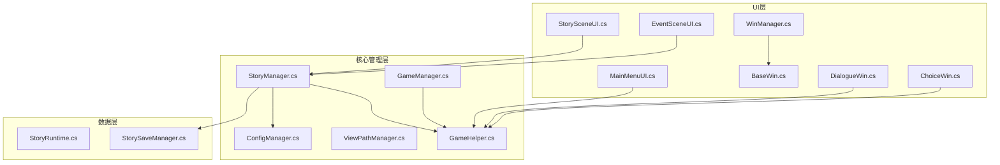
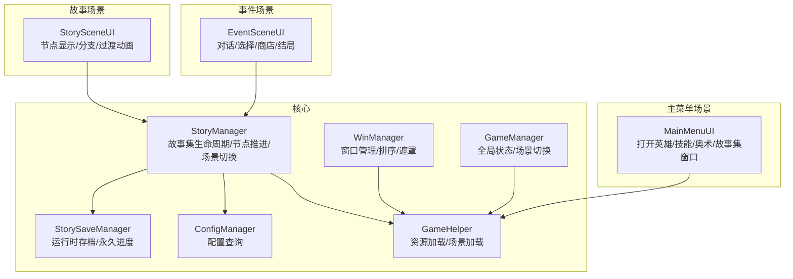
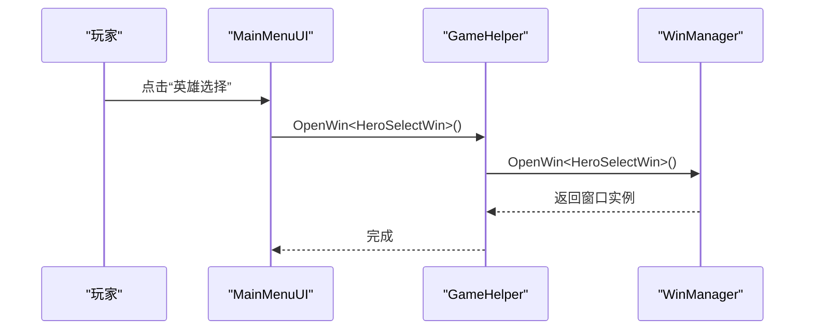
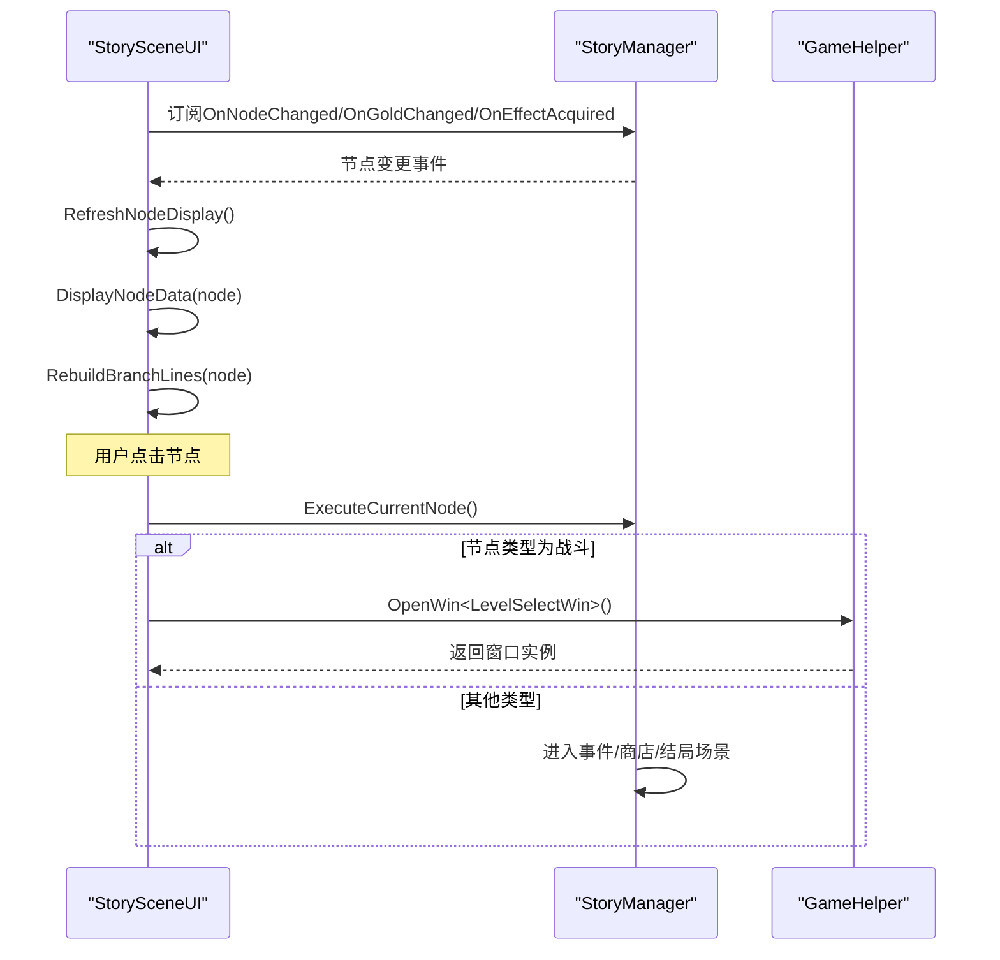
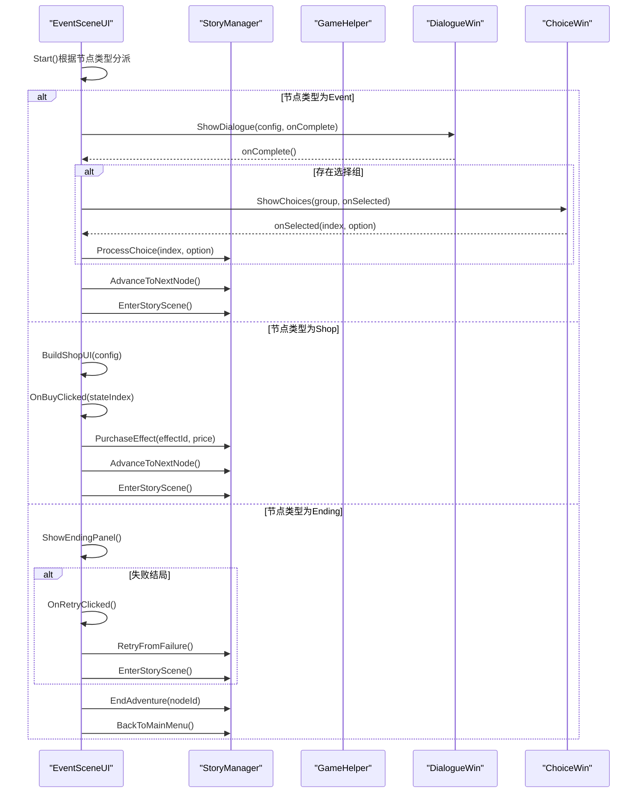
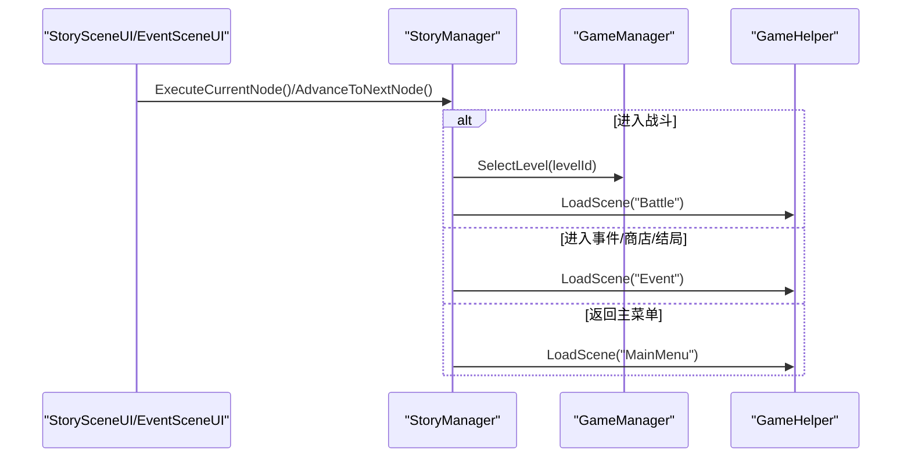
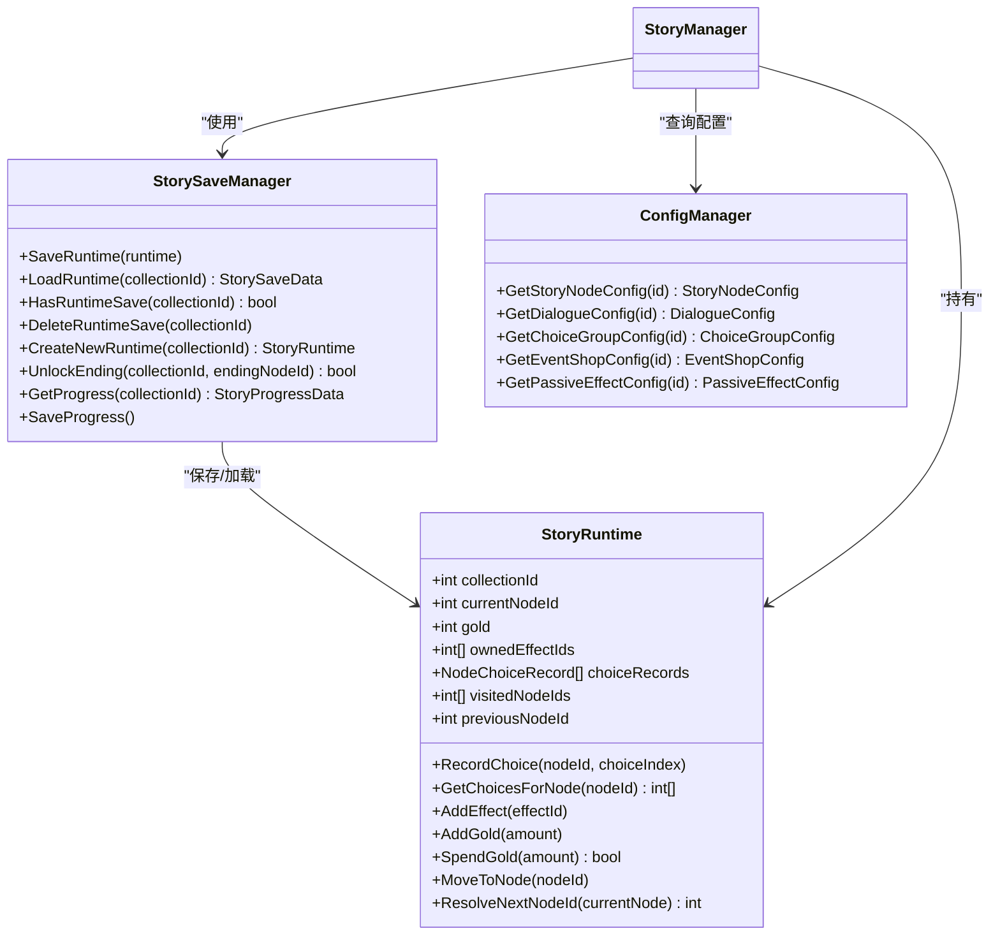
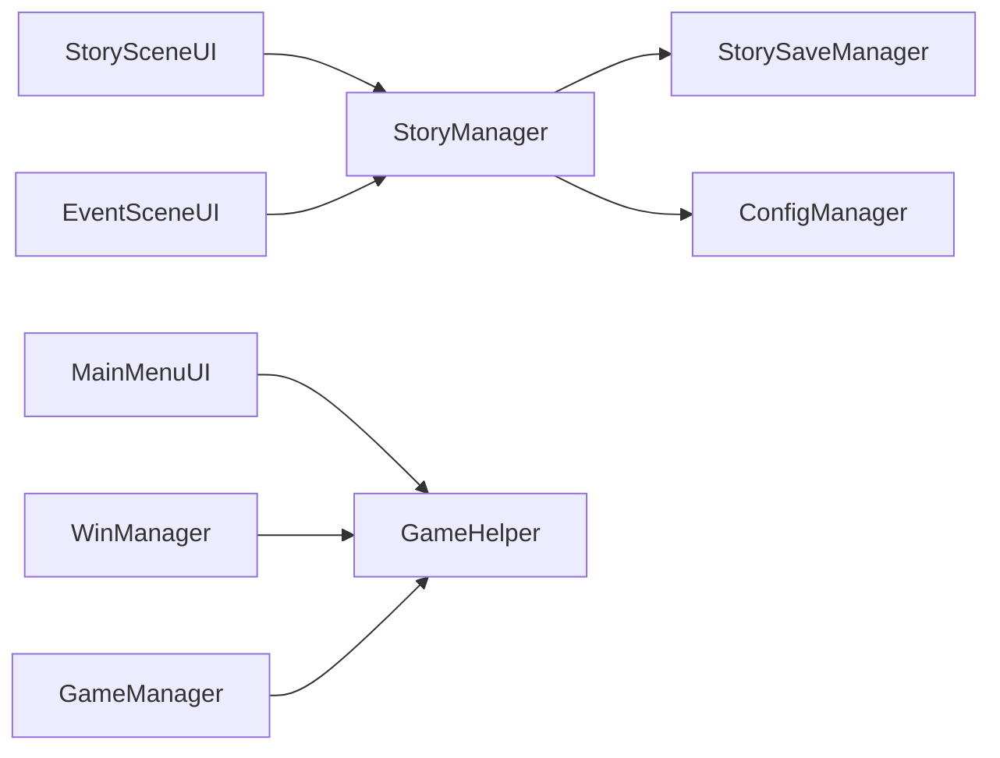

# 场景界面系统

<cite>
**本文引用的文件**
- [MainMenuUI.cs](file://Assets/Scripts/UI/MainMenuUI.cs)
- [StorySceneUI.cs](file://Assets/Scripts/UI/StorySceneUI.cs)
- [EventSceneUI.cs](file://Assets/Scripts/UI/EventSceneUI.cs)
- [StoryManager.cs](file://Assets/Scripts/Core/StoryManager.cs)
- [GameManager.cs](file://Assets/Scripts/Core/GameManager.cs)
- [WinManager.cs](file://Assets/Scripts/UI/WinManager.cs)
- [BaseWin.cs](file://Assets/Scripts/UI/BaseWin.cs)
- [DialogueWin.cs](file://Assets/Scripts/UI/DialogueWin.cs)
- [ChoiceWin.cs](file://Assets/Scripts/UI/ChoiceWin.cs)
- [StoryRuntime.cs](file://Assets/Scripts/Data/StoryRuntime.cs)
- [ConfigManager.cs](file://Assets/Scripts/Core/ConfigManager.cs)
- [GameHelper.cs](file://Assets/Scripts/Core/GameHelper.cs)
- [ViewPathManager.cs](file://Assets/Scripts/Core/ViewPathManager.cs)
- [StorySaveManager.cs](file://Assets/Scripts/Core/StorySaveManager.cs)
</cite>

## 目录
1. [简介](#简介)
2. [项目结构](#项目结构)
3. [核心组件](#核心组件)
4. [架构概览](#架构概览)
5. [详细组件分析](#详细组件分析)
6. [依赖关系分析](#依赖关系分析)
7. [性能考虑](#性能考虑)
8. [故障排除指南](#故障排除指南)
9. [结论](#结论)
10. [附录](#附录)

## 简介
本技术文档围绕GeometryTD的场景界面系统，深入解析三大核心UI模块：主菜单界面（MainMenuUI）、故事场景界面（StorySceneUI）与事件场景界面（EventSceneUI）。文档将阐述各界面的功能实现、交互逻辑、场景切换机制、状态保存与用户上下文保持策略，并提供扩展指南，帮助开发者添加新的场景类型、修改界面布局与实现自定义交互效果。

## 项目结构
场景界面系统主要分布在以下目录与文件中：
- UI层：包含场景UI脚本与通用窗口系统（WinManager、BaseWin、DialogueWin、ChoiceWin）
- 核心管理层：StoryManager（故事集生命周期与节点推进）、GameManager（全局游戏状态与场景切换）、GameHelper（资源加载与场景加载）、ViewPathManager（窗口路径映射）
- 数据层：StoryRuntime（运行时状态）、StorySaveManager（存档管理）、ConfigManager（配置查询）

**图表来源**
- [MainMenuUI.cs:1-32](file://Assets/Scripts/UI/MainMenuUI.cs#L1-L32)
- [StorySceneUI.cs:1-607](file://Assets/Scripts/UI/StorySceneUI.cs#L1-L607)
- [EventSceneUI.cs:1-647](file://Assets/Scripts/UI/EventSceneUI.cs#L1-L647)
- [StoryManager.cs:1-589](file://Assets/Scripts/Core/StoryManager.cs#L1-L589)
- [GameManager.cs:1-239](file://Assets/Scripts/Core/GameManager.cs#L1-L239)
- [WinManager.cs:1-195](file://Assets/Scripts/UI/WinManager.cs#L1-L195)
- [BaseWin.cs:1-32](file://Assets/Scripts/UI/BaseWin.cs#L1-L32)
- [DialogueWin.cs:1-433](file://Assets/Scripts/UI/DialogueWin.cs#L1-L433)
- [ChoiceWin.cs:1-299](file://Assets/Scripts/UI/ChoiceWin.cs#L1-L299)
- [StoryRuntime.cs:1-288](file://Assets/Scripts/Data/StoryRuntime.cs#L1-L288)
- [StorySaveManager.cs:1-179](file://Assets/Scripts/Core/StorySaveManager.cs#L1-L179)
- [ConfigManager.cs:1-619](file://Assets/Scripts/Core/ConfigManager.cs#L1-L619)
- [GameHelper.cs:1-84](file://Assets/Scripts/Core/GameHelper.cs#L1-L84)
- [ViewPathManager.cs:1-33](file://Assets/Scripts/Core/ViewPathManager.cs#L1-L33)

**章节来源**
- [MainMenuUI.cs:1-32](file://Assets/Scripts/UI/MainMenuUI.cs#L1-L32)
- [StorySceneUI.cs:1-607](file://Assets/Scripts/UI/StorySceneUI.cs#L1-L607)
- [EventSceneUI.cs:1-647](file://Assets/Scripts/UI/EventSceneUI.cs#L1-L647)
- [StoryManager.cs:1-589](file://Assets/Scripts/Core/StoryManager.cs#L1-L589)
- [GameManager.cs:1-239](file://Assets/Scripts/Core/GameManager.cs#L1-L239)
- [WinManager.cs:1-195](file://Assets/Scripts/UI/WinManager.cs#L1-L195)
- [BaseWin.cs:1-32](file://Assets/Scripts/UI/BaseWin.cs#L1-L32)
- [DialogueWin.cs:1-433](file://Assets/Scripts/UI/DialogueWin.cs#L1-L433)
- [ChoiceWin.cs:1-299](file://Assets/Scripts/UI/ChoiceWin.cs#L1-L299)
- [StoryRuntime.cs:1-288](file://Assets/Scripts/Data/StoryRuntime.cs#L1-L288)
- [StorySaveManager.cs:1-179](file://Assets/Scripts/Core/StorySaveManager.cs#L1-L179)
- [ConfigManager.cs:1-619](file://Assets/Scripts/Core/ConfigManager.cs#L1-L619)
- [GameHelper.cs:1-84](file://Assets/Scripts/Core/GameHelper.cs#L1-L84)
- [ViewPathManager.cs:1-33](file://Assets/Scripts/Core/ViewPathManager.cs#L1-L33)

## 核心组件
本节概述三大场景界面及其协作关系：
- 主菜单界面（MainMenuUI）：负责打开英雄选择、技能选择、奥术选择与故事集收藏界面
- 故事场景界面（StorySceneUI）：展示故事节点、分支连线与过渡动画，支持点击节点进入相应场景
- 事件场景界面（EventSceneUI）：根据节点类型展示对话、选择分支、商店购买与结局面板

它们通过StoryManager协调故事集生命周期、节点推进与场景切换，通过WinManager统一管理UI窗口的打开、排序与遮罩，通过GameHelper与GameManager进行资源加载与场景切换。

**章节来源**
- [MainMenuUI.cs:11-29](file://Assets/Scripts/UI/MainMenuUI.cs#L11-L29)
- [StorySceneUI.cs:39-66](file://Assets/Scripts/UI/StorySceneUI.cs#L39-L66)
- [EventSceneUI.cs:36-68](file://Assets/Scripts/UI/EventSceneUI.cs#L36-L68)
- [StoryManager.cs:96-130](file://Assets/Scripts/Core/StoryManager.cs#L96-L130)
- [WinManager.cs:61-102](file://Assets/Scripts/UI/WinManager.cs#L61-L102)
- [GameHelper.cs:60-81](file://Assets/Scripts/Core/GameHelper.cs#L60-L81)
- [GameManager.cs:59-63](file://Assets/Scripts/Core/GameManager.cs#L59-L63)

## 架构概览
下图展示了场景界面系统的整体架构与交互流程：

**图表来源**
- [MainMenuUI.cs:11-29](file://Assets/Scripts/UI/MainMenuUI.cs#L11-L29)
- [StorySceneUI.cs:225-243](file://Assets/Scripts/UI/StorySceneUI.cs#L225-L243)
- [EventSceneUI.cs:53-67](file://Assets/Scripts/UI/EventSceneUI.cs#L53-L67)
- [StoryManager.cs:499-533](file://Assets/Scripts/Core/StoryManager.cs#L499-L533)
- [WinManager.cs:61-102](file://Assets/Scripts/UI/WinManager.cs#L61-L102)
- [GameHelper.cs:60-81](file://Assets/Scripts/Core/GameHelper.cs#L60-L81)
- [GameManager.cs:59-63](file://Assets/Scripts/Core/GameManager.cs#L59-L63)
- [StorySaveManager.cs:33-75](file://Assets/Scripts/Core/StorySaveManager.cs#L33-L75)
- [ConfigManager.cs:426-442](file://Assets/Scripts/Core/ConfigManager.cs#L426-L442)

## 详细组件分析

### 主菜单界面（MainMenuUI）
- 功能职责
  - 提供英雄选择、技能选择、奥术选择与故事集收藏入口
  - 通过GameHelper.OpenWin<T>()打开对应窗口
- 交互逻辑
  - 按钮点击事件映射到具体窗口类型
  - 窗口由WinManager统一管理，具备排序与遮罩能力
- 与核心系统的集成
  - 依赖GameHelper进行窗口打开
  - 依赖WinManager进行窗口生命周期管理

**图表来源**
- [MainMenuUI.cs:11-14](file://Assets/Scripts/UI/MainMenuUI.cs#L11-L14)
- [GameHelper.cs:60-68](file://Assets/Scripts/Core/GameHelper.cs#L60-L68)
- [WinManager.cs:61-102](file://Assets/Scripts/UI/WinManager.cs#L61-L102)

**章节来源**
- [MainMenuUI.cs:11-29](file://Assets/Scripts/UI/MainMenuUI.cs#L11-L29)
- [GameHelper.cs:60-68](file://Assets/Scripts/Core/GameHelper.cs#L60-L68)
- [WinManager.cs:61-102](file://Assets/Scripts/UI/WinManager.cs#L61-L102)

### 故事场景界面（StorySceneUI）
- 功能职责
  - 展示当前故事节点信息（名称、类型、图标）
  - 动态生成分支连线，支持节点点击进入相应场景
  - 播放节点过渡动画，保持用户上下文
- 核心逻辑
  - 初始化时检查是否处于冒险中，否则返回主菜单
  - 订阅StoryManager事件以刷新UI（节点变更、金币变化、获得效果）
  - 根据节点类型决定点击行为：战斗节点打开关卡选择，其他节点直接执行
  - 支持过渡动画：淡出非选中分支、沿选中分支滑动、淡入新节点
- UI构建
  - 动态创建画布、面板、文本与按钮，适配屏幕分辨率
  - 使用CanvasGroup控制透明度与交互阻断

**图表来源**
- [StorySceneUI.cs:39-66](file://Assets/Scripts/UI/StorySceneUI.cs#L39-L66)
- [StorySceneUI.cs:80-94](file://Assets/Scripts/UI/StorySceneUI.cs#L80-L94)
- [StorySceneUI.cs:98-118](file://Assets/Scripts/UI/StorySceneUI.cs#L98-L118)
- [StorySceneUI.cs:120-150](file://Assets/Scripts/UI/StorySceneUI.cs#L120-L150)
- [StorySceneUI.cs:174-212](file://Assets/Scripts/UI/StorySceneUI.cs#L174-L212)
- [StorySceneUI.cs:225-243](file://Assets/Scripts/UI/StorySceneUI.cs#L225-L243)
- [StoryManager.cs:539-560](file://Assets/Scripts/Core/StoryManager.cs#L539-L560)

**章节来源**
- [StorySceneUI.cs:39-66](file://Assets/Scripts/UI/StorySceneUI.cs#L39-L66)
- [StorySceneUI.cs:78-94](file://Assets/Scripts/UI/StorySceneUI.cs#L78-L94)
- [StorySceneUI.cs:98-150](file://Assets/Scripts/UI/StorySceneUI.cs#L98-L150)
- [StorySceneUI.cs:174-212](file://Assets/Scripts/UI/StorySceneUI.cs#L174-L212)
- [StorySceneUI.cs:225-243](file://Assets/Scripts/UI/StorySceneUI.cs#L225-L243)
- [StoryManager.cs:539-560](file://Assets/Scripts/Core/StoryManager.cs#L539-L560)

### 事件场景界面（EventSceneUI）
- 功能职责
  - 根据当前节点类型处理事件节点（对话/选择）、商店节点（购买）与结局节点（CG/按钮）
- 事件节点处理
  - 若存在对话ID：打开DialogueWin展示对话，完成后回调
  - 若存在选择组ID：打开ChoiceWin展示选项，回调中调用StoryManager.ProcessChoice并推进节点
  - 否则直接完成事件节点并进入故事场景
- 商店节点处理
  - 加载EventShopConfig，随机选择若干商品（带权重），动态生成购买项
  - 监听金币变化，实时更新按钮可用性
  - 成功购买后更新视觉状态并刷新按钮
- 结局节点处理
  - 展示CG与结局标题/类型标签
  - 失败结局提供“回到失败之前”与“退出”按钮；其他结局提供“退出”按钮
- 对话与选择窗口
  - DialogueWin：打字机效果、自动模式、跳过、点击推进
  - ChoiceWin：选项列表、奖励提示、点击选择

**图表来源**
- [EventSceneUI.cs:36-68](file://Assets/Scripts/UI/EventSceneUI.cs#L36-L68)
- [EventSceneUI.cs:72-114](file://Assets/Scripts/UI/EventSceneUI.cs#L72-L114)
- [EventSceneUI.cs:118-134](file://Assets/Scripts/UI/EventSceneUI.cs#L118-L134)
- [EventSceneUI.cs:372-394](file://Assets/Scripts/UI/EventSceneUI.cs#L372-L394)
- [DialogueWin.cs:76-101](file://Assets/Scripts/UI/DialogueWin.cs#L76-L101)
- [ChoiceWin.cs:52-68](file://Assets/Scripts/UI/ChoiceWin.cs#L52-L68)
- [StoryManager.cs:275-297](file://Assets/Scripts/Core/StoryManager.cs#L275-L297)
- [StoryManager.cs:357-365](file://Assets/Scripts/Core/StoryManager.cs#L357-L365)
- [StoryManager.cs:510-533](file://Assets/Scripts/Core/StoryManager.cs#L510-L533)

**章节来源**
- [EventSceneUI.cs:36-68](file://Assets/Scripts/UI/EventSceneUI.cs#L36-L68)
- [EventSceneUI.cs:72-114](file://Assets/Scripts/UI/EventSceneUI.cs#L72-L114)
- [EventSceneUI.cs:118-134](file://Assets/Scripts/UI/EventSceneUI.cs#L118-L134)
- [EventSceneUI.cs:372-394](file://Assets/Scripts/UI/EventSceneUI.cs#L372-L394)
- [DialogueWin.cs:76-101](file://Assets/Scripts/UI/DialogueWin.cs#L76-L101)
- [ChoiceWin.cs:52-68](file://Assets/Scripts/UI/ChoiceWin.cs#L52-L68)
- [StoryManager.cs:275-297](file://Assets/Scripts/Core/StoryManager.cs#L275-L297)
- [StoryManager.cs:357-365](file://Assets/Scripts/Core/StoryManager.cs#L357-L365)
- [StoryManager.cs:510-533](file://Assets/Scripts/Core/StoryManager.cs#L510-L533)

### 场景切换机制
- 场景加载
  - 通过GameHelper.LoadScene与GameManager.BackToMainMenu实现场景切换
  - StoryManager提供EnterBattleScene、EnterEventScene、EnterStoryScene、BackToMainMenu等专用接口
- 状态保存与用户上下文保持
  - StoryManager维护StoryRuntime（运行时状态），每次节点推进与选择都会保存
  - StorySaveManager负责运行时存档与永久进度存档，支持继续冒险与结局解锁
  - ConfigManager集中管理所有配置，为UI与业务逻辑提供查询服务

**图表来源**
- [StorySceneUI.cs:235-242](file://Assets/Scripts/UI/StorySceneUI.cs#L235-L242)
- [EventSceneUI.cs:110-114](file://Assets/Scripts/UI/EventSceneUI.cs#L110-L114)
- [StoryManager.cs:500-533](file://Assets/Scripts/Core/StoryManager.cs#L500-L533)
- [GameManager.cs:59-63](file://Assets/Scripts/Core/GameManager.cs#L59-L63)
- [GameHelper.cs:77-81](file://Assets/Scripts/Core/GameHelper.cs#L77-L81)

**章节来源**
- [StoryManager.cs:499-533](file://Assets/Scripts/Core/StoryManager.cs#L499-L533)
- [GameManager.cs:59-63](file://Assets/Scripts/Core/GameManager.cs#L59-L63)
- [GameHelper.cs:77-81](file://Assets/Scripts/Core/GameHelper.cs#L77-L81)
- [StorySaveManager.cs:33-75](file://Assets/Scripts/Core/StorySaveManager.cs#L33-L75)

### 数据模型与存档
- StoryRuntime
  - 记录当前故事集ID、当前节点ID、金币、已拥有效果、选择记录、访问历史与上一节点ID
  - 提供ResolveNextNodeId根据选择记录匹配下一节点
- StorySaveManager
  - 运行时存档：每次节点推进与选择后保存
  - 永久进度：结局解锁状态，跨冒险持久化
- ConfigManager
  - 统一管理所有配置（故事集、节点、对话、选项、商店、角色等），提供快速查询

**图表来源**
- [StoryRuntime.cs:11-204](file://Assets/Scripts/Data/StoryRuntime.cs#L11-L204)
- [StorySaveManager.cs:33-100](file://Assets/Scripts/Core/StorySaveManager.cs#L33-L100)
- [ConfigManager.cs:444-442](file://Assets/Scripts/Core/ConfigManager.cs#L444-L442)
- [StoryManager.cs:96-130](file://Assets/Scripts/Core/StoryManager.cs#L96-L130)

**章节来源**
- [StoryRuntime.cs:11-204](file://Assets/Scripts/Data/StoryRuntime.cs#L11-L204)
- [StorySaveManager.cs:33-100](file://Assets/Scripts/Core/StorySaveManager.cs#L33-L100)
- [ConfigManager.cs:444-442](file://Assets/Scripts/Core/ConfigManager.cs#L444-L442)
- [StoryManager.cs:96-130](file://Assets/Scripts/Core/StoryManager.cs#L96-L130)

## 依赖关系分析
- UI层依赖
  - StorySceneUI与EventSceneUI均依赖StoryManager进行节点推进与场景切换
  - WinManager提供统一窗口管理，BaseWin定义窗口抽象
  - GameHelper封装资源与场景加载，简化UI层调用
- 核心层依赖
  - StoryManager依赖StorySaveManager与ConfigManager，负责业务逻辑与数据持久化
  - GameManager负责全局状态与场景切换
- 数据层依赖
  - ConfigManager集中管理配置，被StoryManager与UI层广泛使用

**图表来源**
- [StorySceneUI.cs:39-66](file://Assets/Scripts/UI/StorySceneUI.cs#L39-L66)
- [EventSceneUI.cs:36-68](file://Assets/Scripts/UI/EventSceneUI.cs#L36-L68)
- [MainMenuUI.cs:11-29](file://Assets/Scripts/UI/MainMenuUI.cs#L11-L29)
- [WinManager.cs:61-102](file://Assets/Scripts/UI/WinManager.cs#L61-L102)
- [StoryManager.cs:96-130](file://Assets/Scripts/Core/StoryManager.cs#L96-L130)
- [StorySaveManager.cs:33-75](file://Assets/Scripts/Core/StorySaveManager.cs#L33-L75)
- [ConfigManager.cs:444-442](file://Assets/Scripts/Core/ConfigManager.cs#L444-L442)
- [GameManager.cs:59-63](file://Assets/Scripts/Core/GameManager.cs#L59-L63)
- [GameHelper.cs:60-81](file://Assets/Scripts/Core/GameHelper.cs#L60-L81)

**章节来源**
- [StorySceneUI.cs:39-66](file://Assets/Scripts/UI/StorySceneUI.cs#L39-L66)
- [EventSceneUI.cs:36-68](file://Assets/Scripts/UI/EventSceneUI.cs#L36-L68)
- [MainMenuUI.cs:11-29](file://Assets/Scripts/UI/MainMenuUI.cs#L11-L29)
- [WinManager.cs:61-102](file://Assets/Scripts/UI/WinManager.cs#L61-L102)
- [StoryManager.cs:96-130](file://Assets/Scripts/Core/StoryManager.cs#L96-L130)
- [StorySaveManager.cs:33-75](file://Assets/Scripts/Core/StorySaveManager.cs#L33-L75)
- [ConfigManager.cs:444-442](file://Assets/Scripts/Core/ConfigManager.cs#L444-L442)
- [GameManager.cs:59-63](file://Assets/Scripts/Core/GameManager.cs#L59-L63)
- [GameHelper.cs:60-81](file://Assets/Scripts/Core/GameHelper.cs#L60-L81)

## 性能考虑
- UI构建与动画
  - StorySceneUI动态创建分支连线与面板，建议限制分支数量或采用池化策略减少GC
  - 过渡动画使用CanvasGroup与颜色插值，注意在高帧耗时场景下调整动画时长
- 窗口管理
  - WinManager缓存窗口实例，避免频繁Instantiate；确保合理销毁不再使用的窗口
- 配置查询
  - ConfigManager建立索引字典，查询复杂度为O(1)，有利于UI渲染性能
- 存档与序列化
  - StoryRuntime与StorySaveData使用JsonUtility序列化，建议避免频繁保存；在节点推进与选择后保存即可

[本节为通用指导，无需特定文件引用]

## 故障排除指南
- 场景加载异常
  - 检查GameHelper.LoadScene与GameManager.BackToMainMenu的调用时机
  - 确认场景名称正确且已添加到构建设置
- UI窗口不显示或遮罩问题
  - 确认WinManager.EnsureWinRoot已初始化Canvas与GraphicRaycaster
  - 检查窗口Canvas的sortingOrder与RectTransform锚点设置
- 对话/选择窗口无法关闭
  - 确认DialogueWin与ChoiceWin的OnClose回调正确恢复Time.timeScale
  - 检查外部关闭时的回调参数传递
- 节点推进无效
  - 检查StoryManager.ResolveNextNodeId的条件匹配逻辑
  - 确认StoryRuntime.choiceRecords记录正确，且SaveRuntime已调用

**章节来源**
- [GameHelper.cs:77-81](file://Assets/Scripts/Core/GameHelper.cs#L77-L81)
- [WinManager.cs:40-59](file://Assets/Scripts/UI/WinManager.cs#L40-L59)
- [DialogueWin.cs:57-71](file://Assets/Scripts/UI/DialogueWin.cs#L57-L71)
- [ChoiceWin.cs:33-46](file://Assets/Scripts/UI/ChoiceWin.cs#L33-L46)
- [StoryRuntime.cs:120-193](file://Assets/Scripts/Data/StoryRuntime.cs#L120-L193)
- [StorySaveManager.cs:33-48](file://Assets/Scripts/Core/StorySaveManager.cs#L33-L48)

## 结论
GeometryTD的场景界面系统通过清晰的分层设计实现了主菜单、故事场景与事件场景的协同工作。StoryManager作为核心协调者，结合WinManager的窗口管理与GameHelper的资源/场景加载，提供了稳定的状态保存与流畅的用户交互体验。StorySceneUI与EventSceneUI分别承担故事节点展示与事件处理，配合ConfigManager与StorySaveManager，形成了完整的叙事驱动与数据持久化体系。

[本节为总结性内容，无需特定文件引用]

## 附录

### 扩展指南：添加新的场景类型
- 新增场景类型步骤
  - 在StoryNodeType中定义新类型（如NewType）
  - 在StorySceneUI中扩展节点类型判断与点击行为
  - 在EventSceneUI中新增对应处理逻辑（如ShowNewTypePanel）
  - 在StoryManager中扩展ExecuteCurrentNode对新类型的处理
  - 在ConfigManager中添加新类型节点的配置查询方法
  - 在WinManager中注册新窗口的预制体路径（若需要）
- 界面布局修改
  - StorySceneUI与EventSceneUI均支持动态UI构建，可通过修改BuildUI方法调整布局
  - 注意保持CanvasScaler与GraphicRaycaster配置一致
- 自定义交互效果
  - 可在StorySceneUI中扩展PlayNodeTransition的动画序列
  - 在EventSceneUI中扩展对话/选择窗口的交互行为

**章节来源**
- [StorySceneUI.cs:405-427](file://Assets/Scripts/UI/StorySceneUI.cs#L405-L427)
- [EventSceneUI.cs:548-567](file://Assets/Scripts/UI/EventSceneUI.cs#L548-L567)
- [StoryManager.cs:539-560](file://Assets/Scripts/Core/StoryManager.cs#L539-L560)
- [ConfigManager.cs:444-442](file://Assets/Scripts/Core/ConfigManager.cs#L444-L442)
- [WinManager.cs:61-102](file://Assets/Scripts/UI/WinManager.cs#L61-L102)
- [ViewPathManager.cs:25-30](file://Assets/Scripts/Core/ViewPathManager.cs#L25-L30)